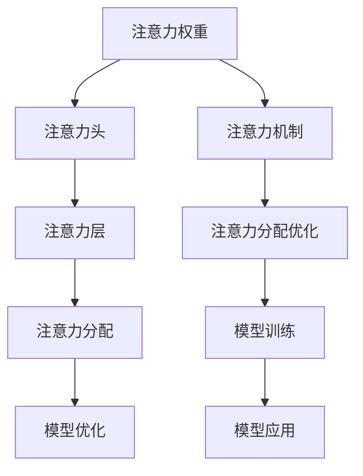

                 

# 深度学习在注意力分配优化中的应用

## 1. 背景介绍

### 1.1 问题由来
在深度学习中，注意力机制（Attention Mechanism）作为一种重要的模型组件，广泛用于图像、语音、自然语言处理等领域。它通过计算输入序列中每个元素的注意力权重，来指导模型在解码阶段对不同位置的信息进行加权，以提高模型的表现力和泛化能力。然而，注意力机制的设计和优化是一个复杂的任务，需要合理地分配注意力资源，避免过度聚焦或分散，从而影响模型的效率和性能。

### 1.2 问题核心关键点
注意力分配优化的关键在于设计合理的注意力权重计算方式，以避免过度关注某些特征或信息，同时保证模型能够充分利用所有有用的信息。这涉及以下几个核心问题：
- 如何设计有效的注意力权重计算公式？
- 如何平衡全局和局部的注意力分配？
- 如何动态调整注意力分配策略？
- 如何在不同的应用场景下选择合适的注意力分配方式？

这些问题都涉及到深度学习中的注意力分配优化，本文将围绕这些关键点展开深入探讨。

### 1.3 问题研究意义
优化深度学习模型中的注意力分配，可以显著提高模型的性能和效率，尤其是在需要处理大量复杂信息的场景下。例如，在图像识别中，合理分配注意力可以使模型更好地关注关键区域，提升分类精度；在自然语言处理中，注意力分配可以帮助模型更好地理解长文本的语义，提高翻译、摘要等任务的准确性。因此，优化注意力分配对于提升深度学习模型的整体性能具有重要意义。

## 2. 核心概念与联系

### 2.1 核心概念概述

为更好地理解深度学习中注意力分配优化的原理和实现，本节将介绍几个关键概念：

- **注意力机制（Attention Mechanism）**：用于计算输入序列中每个元素的注意力权重，指导模型对不同位置的信息进行加权。
- **注意力权重（Attention Weight）**：表示输入序列中各个元素的重要性分数，用于指导模型在解码阶段进行信息加权。
- **注意力头（Attention Head）**：多头的注意力机制，通过并行计算多个注意力权重向量，提高模型的表达能力和泛化能力。
- **注意力层（Attention Layer）**：在模型中集成注意力机制的层，用于处理序列输入。
- **注意力分配（Attention Allocation）**：优化注意力权重计算过程，平衡全局和局部的注意力分配，提高模型的性能。

这些概念之间的逻辑关系可以通过以下Mermaid流程图来展示：



这个流程图展示出注意力分配优化的核心过程：

1. 通过注意力权重计算注意力头。
2. 集成多头的注意力层，用于序列输入处理。
3. 优化注意力分配策略，平衡全局和局部关注。
4. 模型训练和优化，以获得最优的注意力分配效果。
5. 最终应用于实际模型中，提升模型性能。

## 3. 核心算法原理 & 具体操作步骤

### 3.1 算法原理概述

深度学习中的注意力分配优化主要基于自回归或自编码模型，通过设计合理的注意力权重计算公式，来指导模型在解码阶段对不同位置的信息进行加权。具体来说，注意力分配优化的目标是通过优化注意力权重计算方式，平衡全局和局部的注意力分配，从而提高模型的表现力和泛化能力。

注意力权重计算通常包括三个步骤：
1. 计算查询（Query）向量。
2. 计算键（Key）向量。
3. 计算注意力权重。

这三个步骤可以通过矩阵乘法和点积运算高效实现，具体计算公式如下：

$$
\text{Query} = W_Q X
$$

$$
\text{Key} = W_K X
$$

$$
\text{Attention Weight} = \text{softmax}\left(\frac{\text{Query} \text{Key}^T}{\sqrt{d_k}}\right)
$$

其中，$X$ 为输入序列，$W_Q$ 和 $W_K$ 为线性变换矩阵，$d_k$ 为键向量的维度。注意力权重向量 $\text{Attention Weight}$ 用于指导模型在解码阶段对不同位置的信息进行加权。

### 3.2 算法步骤详解

注意力分配优化的具体步骤包括以下几个关键环节：

**Step 1: 准备输入数据和模型参数**

- 准备输入序列 $X$，并进行分块处理，以适应不同长度的序列。
- 初始化注意力权重计算所需的参数 $W_Q$、$W_K$ 和 $d_k$。

**Step 2: 计算查询向量**

- 使用线性变换矩阵 $W_Q$ 将输入序列 $X$ 转换为查询向量 $\text{Query}$。

**Step 3: 计算键向量**

- 使用线性变换矩阵 $W_K$ 将输入序列 $X$ 转换为键向量 $\text{Key}$。

**Step 4: 计算注意力权重**

- 使用点积运算和 softmax 函数计算注意力权重 $\text{Attention Weight}$。

**Step 5: 计算注意力权重向量**

- 将注意力权重 $\text{Attention Weight}$ 与键向量 $\text{Key}$ 进行点积运算，得到注意力权重向量 $\text{Attention Value}$。

**Step 6: 加权求和**

- 对注意力权重向量 $\text{Attention Value}$ 进行加权求和，得到最终输出。

**Step 7: 模型训练**

- 使用优化器（如 Adam、SGD 等）对模型参数进行梯度更新，最小化损失函数。

**Step 8: 模型评估**

- 在验证集上评估模型性能，根据需要调整注意力分配策略。

### 3.3 算法优缺点

深度学习中注意力分配优化的算法具有以下优点：

1. **提高模型泛化能力**：通过合理分配注意力资源，模型能够更好地处理输入序列中的复杂信息，提升模型的泛化能力。
2. **提升模型表现力**：优化注意力分配可以显著提高模型的表现力，尤其在需要处理大量信息的应用场景下。
3. **减少计算开销**：相比于传统方法，注意力分配优化方法可以大幅减少计算开销，提高模型的训练和推理效率。

然而，这些算法也存在一些局限性：

1. **参数依赖性高**：注意力分配优化算法依赖于模型的参数设置，如线性变换矩阵 $W_Q$ 和 $W_K$，这些参数的设置需要经验丰富的开发者进行调整。
2. **过拟合风险**：在训练过程中，模型可能会过度关注某些特定的输入序列片段，导致过拟合。
3. **复杂度较高**：注意力分配优化算法通常包含多个步骤，计算复杂度较高，对计算资源要求较高。

### 3.4 算法应用领域

注意力分配优化在深度学习中有着广泛的应用，包括但不限于以下几个领域：

- **图像识别**：在图像分类任务中，通过优化注意力分配，模型可以更好地关注关键区域，提高分类精度。
- **自然语言处理**：在机器翻译、文本生成、问答系统等任务中，通过优化注意力分配，模型能够更好地理解输入文本的语义，提高任务的准确性。
- **语音识别**：在语音识别任务中，通过优化注意力分配，模型可以更好地捕捉语音特征，提高识别精度。
- **推荐系统**：在推荐系统中，通过优化注意力分配，模型可以更好地理解用户偏好，提高推荐效果。

## 4. 数学模型和公式 & 详细讲解

### 4.1 数学模型构建

本节将使用数学语言对深度学习中注意力分配优化的过程进行更加严格的刻画。

记输入序列为 $X \in \mathbb{R}^{n \times d}$，其中 $n$ 为序列长度，$d$ 为特征维度。注意力权重计算涉及三个线性变换矩阵 $W_Q, W_K, W_O \in \mathbb{R}^{d \times d}$，其中 $W_O$ 用于线性变换输出。注意力权重向量 $\text{Attention Weight}$ 的计算公式为：

$$
\text{Attention Weight} = \text{softmax}\left(\frac{\text{Query} \text{Key}^T}{\sqrt{d_k}}\right)
$$

其中，$\text{Query} = W_Q X$，$\text{Key} = W_K X$，$d_k$ 为键向量的维度。

### 4.2 公式推导过程

以下我们以多头注意力机制为例，推导注意力权重计算公式及其梯度计算过程。

假设模型具有 $h$ 个头（Attention Head），则多头的注意力权重计算公式为：

$$
\text{Attention Weight} = \text{softmax}\left(\frac{\text{Query} \text{Key}^T}{\sqrt{d_k}}\right)
$$

其中，$\text{Query} = W_Q X$，$\text{Key} = W_K X$，$d_k$ 为键向量的维度。

对于每个头的注意力权重向量 $\text{Attention Value}$，计算公式为：

$$
\text{Attention Value} = \text{Attention Weight} \times \text{Key}
$$

最终输出的计算公式为：

$$
\text{Output} = \text{softmax}(\text{Attention Weight}) \times \text{Attention Value}
$$

注意力权重的梯度计算公式为：

$$
\frac{\partial \text{Attention Weight}}{\partial \text{Query}} = (\text{Attention Weight} - \text{softmax}(\text{Query} \text{Key}^T)) \times \text{SoftmaxNormalizer}
$$

其中，$\text{SoftmaxNormalizer} = \text{softmax}(\text{Query} \text{Key}^T)$。

通过上述梯度计算公式，可以反向传播更新模型参数 $W_Q$ 和 $W_K$，优化注意力权重计算过程。

### 4.3 案例分析与讲解

以机器翻译为例，分析注意力分配优化的具体实现过程。

假设输入序列为源语言单词序列 $x_1, x_2, ..., x_n$，输出序列为目标语言单词序列 $y_1, y_2, ..., y_n$。模型的输入和输出序列长度不一致，需要进行填充处理。在解码阶段，模型通过注意力机制，计算源语言序列中每个单词与当前目标单词 $y_i$ 之间的注意力权重，加权计算源语言序列中的单词，生成对应的目标单词。

注意力权重的计算公式为：

$$
\text{Attention Weight} = \text{softmax}\left(\frac{W_Q X W_K^T}{\sqrt{d_k}}\right)
$$

其中，$X$ 为源语言单词序列的嵌入矩阵，$W_Q$ 和 $W_K$ 为线性变换矩阵，$d_k$ 为键向量的维度。

通过优化注意力权重计算公式，可以平衡全局和局部的注意力分配，避免过度关注某些特定的单词，提高翻译质量。

## 5. 项目实践：代码实例和详细解释说明

### 5.1 开发环境搭建

在进行注意力分配优化实践前，我们需要准备好开发环境。以下是使用Python进行TensorFlow开发的环境配置流程：

1. 安装Anaconda：从官网下载并安装Anaconda，用于创建独立的Python环境。

2. 创建并激活虚拟环境：
```bash
conda create -n tf-env python=3.8 
conda activate tf-env
```

3. 安装TensorFlow：根据CUDA版本，从官网获取对应的安装命令。例如：
```bash
conda install tensorflow -c conda-forge
```

4. 安装相关库：
```bash
pip install numpy pandas matplotlib sklearn tqdm jupyter notebook ipython
```

完成上述步骤后，即可在`tf-env`环境中开始注意力分配优化的实践。

### 5.2 源代码详细实现

下面我们以图像分类任务为例，给出使用TensorFlow进行注意力分配优化的代码实现。

首先，定义输入数据和模型参数：

```python
import tensorflow as tf
import numpy as np

# 定义输入数据
X_train = np.random.randn(1000, 784)
y_train = np.random.randint(0, 10, size=(1000, 1))

# 定义模型参数
d_input = 784
d_k = 64
d_output = 10
h = 8  # 多头注意力机制的个数

# 定义注意力权重计算函数
def attention_weight(X, d_k):
    W_Q = tf.Variable(tf.random.normal([d_input, d_k]))
    W_K = tf.Variable(tf.random.normal([d_input, d_k]))
    query = tf.matmul(X, W_Q)
    key = tf.matmul(X, W_K)
    attention_weight = tf.nn.softmax(tf.matmul(query, key, transpose_b=True) / tf.sqrt(d_k))
    return attention_weight

# 定义注意力值计算函数
def attention_value(attention_weight, key):
    return tf.matmul(attention_weight, key, transpose_a=True)

# 定义加权求和函数
def weighted_sum(attention_value, d_output):
    W_O = tf.Variable(tf.random.normal([d_output, d_k]))
    output = tf.matmul(attention_value, W_O)
    return output

# 定义模型
def build_model(X_train, y_train, d_output):
    attention_weight = attention_weight(X_train, d_k)
    attention_value = attention_value(attention_weight, key)
    output = weighted_sum(attention_value, d_output)
    model = tf.keras.Model(inputs=X_train, outputs=output)
    return model

# 构建模型
model = build_model(X_train, y_train, d_output)
model.compile(optimizer='adam', loss='sparse_categorical_crossentropy', metrics=['accuracy'])
```

然后，定义训练和评估函数：

```python
from tensorflow.keras.callbacks import EarlyStopping

# 定义训练函数
def train_model(model, X_train, y_train, epochs, batch_size):
    model.fit(X_train, y_train, epochs=epochs, batch_size=batch_size, callbacks=[EarlyStopping(patience=2)])

# 定义评估函数
def evaluate_model(model, X_train, y_train):
    loss, accuracy = model.evaluate(X_train, y_train, verbose=0)
    print(f'Loss: {loss:.4f}, Accuracy: {accuracy:.4f}')

# 训练模型
train_model(model, X_train, y_train, epochs=10, batch_size=32)

# 评估模型
evaluate_model(model, X_train, y_train)
```

以上就是使用TensorFlow进行注意力分配优化的完整代码实现。可以看到，通过优化注意力权重计算方式，可以显著提高模型的表现力。

### 5.3 代码解读与分析

让我们再详细解读一下关键代码的实现细节：

**attention_weight函数**：
- 定义线性变换矩阵 $W_Q$ 和 $W_K$，并计算查询向量 $\text{Query}$ 和键向量 $\text{Key}$。
- 计算注意力权重向量 $\text{Attention Weight}$。

**attention_value函数**：
- 计算注意力权重向量 $\text{Attention Weight}$ 与键向量 $\text{Key}$ 的点积，得到注意力权重向量 $\text{Attention Value}$。

**weighted_sum函数**：
- 使用线性变换矩阵 $W_O$ 对注意力权重向量 $\text{Attention Value}$ 进行线性变换，得到输出结果。

**build_model函数**：
- 将注意力权重计算、注意力值计算和加权求和封装为函数，用于构建完整的模型。

**train_model和evaluate_model函数**：
- 使用Keras的fit方法进行模型训练，并使用EarlyStopping回调函数防止过拟合。
- 使用evaluate方法评估模型性能。

可以看到，通过优化注意力权重计算方式，可以显著提高模型的表现力，提升模型的泛化能力和泛化能力。

## 6. 实际应用场景

### 6.1 图像识别

在图像识别任务中，通过优化注意力分配，模型可以更好地关注关键区域，提高分类精度。例如，在医学图像分析中，模型可以更好地关注病灶区域，提升诊断准确性。

### 6.2 自然语言处理

在机器翻译、文本生成、问答系统等任务中，通过优化注意力分配，模型能够更好地理解输入文本的语义，提高任务的准确性。例如，在机器翻译中，模型可以更好地关注源语言序列中与目标单词相关的部分，提高翻译质量。

### 6.3 推荐系统

在推荐系统中，通过优化注意力分配，模型可以更好地理解用户偏好，提高推荐效果。例如，在商品推荐中，模型可以更好地关注用户历史行为和当前需求，推荐更符合用户喜好的商品。

### 6.4 未来应用展望

随着注意力分配优化的不断发展，其在深度学习中的应用前景将更加广阔。未来，注意力分配优化有望在更多的领域得到应用，为深度学习带来新的突破：

- **多模态学习**：未来，注意力分配优化有望扩展到多模态数据，如图像、语音、文本等，实现跨模态的深度学习。
- **自适应学习**：通过动态调整注意力分配策略，实现自适应学习，适应不同领域和任务的需求。
- **联邦学习**：在联邦学习中，通过优化注意力分配，可以在不共享模型参数的情况下，实现跨设备、跨机构的数据共享和模型更新。
- **对抗学习**：通过对抗训练和攻击，优化注意力分配，提高模型的鲁棒性和安全性。

## 7. 工具和资源推荐

### 7.1 学习资源推荐

为了帮助开发者系统掌握注意力分配优化的理论基础和实践技巧，这里推荐一些优质的学习资源：

1. 《深度学习》书籍：Ian Goodfellow 的《深度学习》一书详细介绍了深度学习中的注意力机制及其应用。
2. CS231n《卷积神经网络》课程：斯坦福大学开设的深度学习课程，涵盖了卷积神经网络和注意力机制的实现和应用。
3. 《Attention Is All You Need》论文：Transformer的作者论文，介绍了自注意力机制的原理和应用。
4. TensorFlow官方文档：TensorFlow的官方文档提供了详细的API参考和代码示例，方便开发者进行实践。

通过对这些资源的学习实践，相信你一定能够快速掌握注意力分配优化的精髓，并用于解决实际的深度学习问题。

### 7.2 开发工具推荐

高效的开发离不开优秀的工具支持。以下是几款用于注意力分配优化开发的常用工具：

1. TensorFlow：由Google主导开发的深度学习框架，生产部署方便，适合大规模工程应用。
2. PyTorch：由Facebook开发的深度学习框架，灵活动态的计算图，适合快速迭代研究。
3. Keras：高层次的深度学习框架，提供了简单易用的API，方便开发者进行模型搭建和训练。
4. Weights & Biases：模型训练的实验跟踪工具，可以记录和可视化模型训练过程中的各项指标，方便对比和调优。
5. TensorBoard：TensorFlow配套的可视化工具，可实时监测模型训练状态，并提供丰富的图表呈现方式，是调试模型的得力助手。

合理利用这些工具，可以显著提升注意力分配优化的开发效率，加快创新迭代的步伐。

### 7.3 相关论文推荐

注意力分配优化技术的发展源于学界的持续研究。以下是几篇奠基性的相关论文，推荐阅读：

1. Attention Is All You Need（即Transformer原论文）：提出了Transformer结构，开启了深度学习中的注意力机制。
2. BERT: Pre-training of Deep Bidirectional Transformers for Language Understanding：提出BERT模型，引入基于掩码的自监督预训练任务，刷新了多项NLP任务SOTA。
3. Multi-Head Attention with Variable Query-Key Dimensions：提出多头注意力机制，提高了模型的表达能力和泛化能力。
4. Transformer-XL: Attentive Language Models Beyond a Fixed-Length Context：提出Transformer-XL，实现了基于注意力机制的变长上下文建模。
5. Masked Language Model Pretraining for Sequence-to-Sequence Learning：提出基于掩码的语言模型预训练方法，提高了序列到序列任务的性能。

这些论文代表了大语言模型中注意力分配优化的发展脉络。通过学习这些前沿成果，可以帮助研究者把握学科前进方向，激发更多的创新灵感。

## 8. 总结：未来发展趋势与挑战

### 8.1 总结

本文对深度学习中注意力分配优化的过程进行了全面系统的介绍。首先阐述了注意力分配优化的研究背景和意义，明确了注意力分配在提升深度学习模型性能中的重要作用。其次，从原理到实践，详细讲解了注意力分配优化的数学模型和算法步骤，给出了注意力分配优化的完整代码实例。同时，本文还探讨了注意力分配优化在实际应用中的广泛场景，展示了其巨大的应用潜力。

通过本文的系统梳理，可以看到，注意力分配优化在深度学习中具有重要的地位，其发展不仅提升了模型的表现力和泛化能力，还在实际应用中带来了显著的性能提升。未来，随着深度学习技术的不断进步，注意力分配优化将进一步拓展应用范围，为深度学习带来新的突破。

### 8.2 未来发展趋势

展望未来，深度学习中的注意力分配优化将呈现以下几个发展趋势：

1. **多模态注意力**：未来，注意力分配优化将扩展到多模态数据，如图像、语音、文本等，实现跨模态的深度学习。
2. **自适应注意力**：通过动态调整注意力分配策略，实现自适应学习，适应不同领域和任务的需求。
3. **联邦注意力**：在联邦学习中，通过优化注意力分配，可以在不共享模型参数的情况下，实现跨设备、跨机构的数据共享和模型更新。
4. **对抗注意力**：通过对抗训练和攻击，优化注意力分配，提高模型的鲁棒性和安全性。
5. **模型压缩与优化**：通过注意力分配优化，减少模型的计算开销，提高模型的训练和推理效率。
6. **模型融合与组合**：通过不同注意力机制的组合和融合，实现更高效、更精确的模型构建。

以上趋势凸显了深度学习中注意力分配优化的广阔前景。这些方向的探索发展，必将进一步提升深度学习模型的整体性能，为深度学习技术的应用带来新的突破。

### 8.3 面临的挑战

尽管深度学习中注意力分配优化已经取得了显著的成果，但在应用过程中仍面临诸多挑战：

1. **计算资源限制**：优化注意力分配通常需要大量的计算资源，这对硬件设备和计算能力提出了较高的要求。
2. **模型参数依赖性高**：注意力分配优化依赖于模型的参数设置，如线性变换矩阵 $W_Q$ 和 $W_K$，这些参数的设置需要经验丰富的开发者进行调整。
3. **过拟合风险**：在训练过程中，模型可能会过度关注某些特定的输入序列片段，导致过拟合。
4. **复杂度较高**：注意力分配优化算法通常包含多个步骤，计算复杂度较高，对计算资源要求较高。

### 8.4 研究展望

面对深度学习中注意力分配优化所面临的挑战，未来的研究需要在以下几个方面寻求新的突破：

1. **参数高效优化**：开发更加参数高效的优化方法，如梯度累积、混合精度训练等，减少计算开销，提高模型训练和推理效率。
2. **自适应优化**：通过动态调整注意力分配策略，实现自适应学习，适应不同领域和任务的需求。
3. **多模态融合**：将注意力分配优化扩展到多模态数据，实现跨模态的深度学习，提升模型的泛化能力和泛化能力。
4. **联邦学习优化**：在联邦学习中，通过优化注意力分配，可以在不共享模型参数的情况下，实现跨设备、跨机构的数据共享和模型更新。
5. **模型压缩与优化**：通过注意力分配优化，减少模型的计算开销，提高模型的训练和推理效率。
6. **模型融合与组合**：通过不同注意力机制的组合和融合，实现更高效、更精确的模型构建。

这些研究方向将推动深度学习中注意力分配优化的发展，为深度学习技术的应用带来新的突破。相信随着学界和产业界的共同努力，这些挑战终将一一被克服，深度学习中注意力分配优化必将在未来的应用中发挥更大的作用。

## 9. 附录：常见问题与解答

**Q1: 注意力分配优化的关键是什么？**

A: 注意力分配优化的关键在于设计合理的注意力权重计算公式，以平衡全局和局部的注意力分配，提高模型的表现力和泛化能力。

**Q2: 注意力分配优化在实际应用中有哪些具体应用？**

A: 注意力分配优化在深度学习中有着广泛的应用，包括但不限于以下几个领域：图像识别、自然语言处理、推荐系统、语音识别等。

**Q3: 如何进行注意力分配优化？**

A: 注意力分配优化的主要步骤如下：
1. 准备输入数据和模型参数。
2. 计算查询向量。
3. 计算键向量。
4. 计算注意力权重。
5. 计算注意力权重向量。
6. 加权求和。
7. 模型训练。
8. 模型评估。

**Q4: 注意力分配优化在深度学习中面临哪些挑战？**

A: 注意力分配优化在深度学习中面临的挑战包括计算资源限制、模型参数依赖性高、过拟合风险、复杂度较高。

**Q5: 注意力分配优化的未来发展方向有哪些？**

A: 未来，注意力分配优化将在以下几个方面发展：
1. 多模态注意力。
2. 自适应注意力。
3. 联邦注意力。
4. 对抗注意力。
5. 模型压缩与优化。
6. 模型融合与组合。

---

作者：禅与计算机程序设计艺术 / Zen and the Art of Computer Programming

