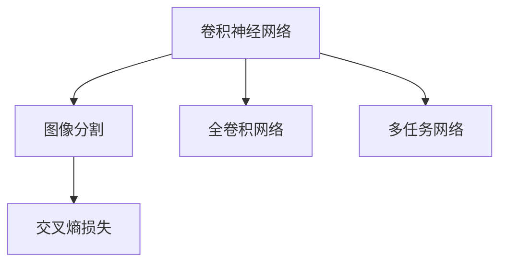

                 

# 深度学习驱动的商品图像去背景技术优化

## 1. 背景介绍

### 1.1 问题由来

商品图像去背景（Image Background Removal），也称为图像分割（Image Segmentation），是指从原始图像中移除背景，仅保留目标对象的技术。这一技术在电子商务、安防监控、工业检测、医疗影像等领域有着广泛的应用前景。随着深度学习技术的发展，尤其是卷积神经网络（Convolutional Neural Networks, CNNs）的兴起，商品图像去背景问题得到了显著的突破。

深度学习驱动的商品图像去背景技术，通过大规模标注数据训练卷积神经网络模型，使其能够自动识别并移除背景，还原出纯净的商品图像。传统方法通常依赖手工设计的特征提取器和分类器，存在诸多局限，如特征工程复杂、泛化能力差等问题。深度学习方法则通过端到端的学习方式，从原始像素直接学习语义信息，显著提升了算法的准确率和鲁棒性。

### 1.2 问题核心关键点

商品图像去背景的核心在于图像分割问题，即如何将图像中的每个像素点分到前景（目标对象）和背景类别。基于深度学习的方法通常采用如下步骤：

1. 收集和标注大量商品图像数据集，涵盖目标对象和背景两类。
2. 使用卷积神经网络（CNNs）模型，学习图像的像素级语义信息。
3. 通过全卷积网络（Fully Convolutional Network, FCN）或多任务网络（Multitask Network）结构，对输入图像进行分割。
4. 采用交叉熵损失等监督学习方式，优化模型参数，使其输出分割掩码（Segmentation Mask）。
5. 根据掩码对原始图像进行背景去除操作，得到干净的商品图像。

## 2. 核心概念与联系

### 2.1 核心概念概述

为更好地理解深度学习驱动的商品图像去背景技术，本节将介绍几个密切相关的核心概念：

- 卷积神经网络（Convolutional Neural Networks, CNNs）：一种前馈神经网络，通过卷积操作提取图像的局部特征，广泛应用于图像处理、计算机视觉等领域。
- 图像分割（Image Segmentation）：将图像划分为若干像素级别区域的过程，每个像素点被分配到前景或背景类别。
- 全卷积网络（Fully Convolutional Network, FCN）：一种基于CNN的图像分割网络，通过逐步上采样，将高维特征图转换为与输入图像大小相同的分割掩码。
- 多任务网络（Multitask Network）：能够同时学习多个任务的网络结构，通过共享参数和特征图，提升各任务间的协同效应。
- 交叉熵损失（Cross Entropy Loss）：用于度量预测值与真实标签之间的差异，常用于多类别分类任务，尤其在图像分割问题中，可用来优化像素级输出。

这些核心概念之间的逻辑关系可以通过以下Mermaid流程图来展示：



这个流程图展示了一些核心概念及其之间的联系：

1. 卷积神经网络作为图像处理的基础网络，通过卷积操作提取图像特征。
2. 图像分割网络通过上采样将特征图转换为分割掩码，实现像素级分类。
3. 多任务网络通过共享参数，提升各任务间的协同效应。
4. 交叉熵损失用于优化分割掩码，使其更准确地匹配真实标签。

这些概念共同构成了深度学习驱动的商品图像去背景技术的基础，使得模型能够从原始像素中提取语义信息，并准确地进行分割。

## 3. 核心算法原理 & 具体操作步骤
### 3.1 算法原理概述

基于深度学习的方法通常采用全卷积网络（FCN）或多任务网络（MTN）结构，通过端到端的学习方式，对输入图像进行像素级的分割。其中，FCN通过逐层上采样，将高维特征图转换为与输入图像大小相同的分割掩码。MTN通过共享参数，同时学习多个任务（如目标检测、分类、分割），提升各任务间的协同效应。

以FCN为例，其算法原理如下：

1. 输入图像 $X$ 经过若干卷积层提取特征，得到高维特征图 $F$。
2. 通过逐层上采样，将 $F$ 缩小至与输入图像大小相同的分割掩码 $M$。
3. $M$ 中每个像素表示该位置是否属于目标对象，$M$ 与输入图像结合，生成目标对象图像。
4. 使用交叉熵损失等监督学习方式，优化模型参数，使其输出 $M$ 更接近真实标签。

### 3.2 算法步骤详解

基于深度学习的方法通常采用以下步骤：

**Step 1: 数据准备**
- 收集和标注大量商品图像数据集，涵盖目标对象和背景两类。
- 对数据进行增强处理，如随机裁剪、旋转、缩放等，增加数据多样性。
- 将图像转换为适合深度学习的格式，如转换为PyTorch张量。

**Step 2: 搭建网络模型**
- 选择合适的深度学习框架（如PyTorch、TensorFlow等）。
- 使用全卷积网络（FCN）或多任务网络（MTN）结构搭建分割网络。
- 设置网络参数，如卷积核大小、步长、特征图大小等。

**Step 3: 训练模型**
- 定义交叉熵损失等损失函数。
- 设置优化器（如Adam、SGD等）及其超参数，如学习率、批大小等。
- 使用训练集数据对模型进行训练，定期在验证集上评估性能，根据性能调整学习率、批次大小等超参数。
- 训练结束后，保存模型参数和权重。

**Step 4: 模型推理**
- 加载训练好的模型，使用测试集数据进行推理，得到分割掩码。
- 根据分割掩码，对原始图像进行背景去除操作，得到纯净的商品图像。

**Step 5: 结果评估**
- 在测试集上评估模型性能，如Intersection over Union (IoU)等指标。
- 分析模型的错误情况，对模型进行进一步优化。

### 3.3 算法优缺点

基于深度学习的商品图像去背景技术具有以下优点：
1. 自动化程度高：通过深度学习自动化处理图像分割任务，减少了人工干预。
2. 准确率高：深度学习方法能够学习复杂的语义信息，提升分割精度。
3. 泛化能力强：通过大规模数据训练，模型能够适应多种图像场景。
4. 实时性好：现代硬件加速技术（如GPU、TPU等）支持快速推理，满足实时应用需求。

同时，该方法也存在一些缺点：
1. 数据需求大：深度学习方法需要大量标注数据，数据获取成本高。
2. 模型复杂度高：深度网络结构复杂，训练和推理资源消耗大。
3. 可解释性差：深度学习模型通常难以解释内部工作机制，缺乏透明性。
4. 鲁棒性不足：面对不同光照、角度、噪声等变化，模型鲁棒性仍需提高。

尽管存在这些局限，但基于深度学习的方法仍然是商品图像去背景技术的主流范式。未来相关研究的方向在于如何进一步降低数据需求，提高模型效率，增强可解释性和鲁棒性。

### 3.4 算法应用领域

基于深度学习的方法在商品图像去背景技术中得到了广泛的应用，覆盖了多种场景，如：

- 电子商务：通过去除商品背景，提升商品展示效果，提升用户体验。
- 安防监控：对监控视频进行前景对象检测，提高视频分析的准确性。
- 工业检测：对生产过程中的设备图像进行分割，检测异常情况。
- 医疗影像：对医学图像进行分割，提取肿瘤、器官等目标区域。
- 自动驾驶：对摄像头拍摄的图像进行分割，提高目标检测和路径规划的准确性。

除了上述这些经典应用外，商品图像去背景技术还在许多创新性领域得到了应用，如可控图像生成、交互式图像编辑、虚拟现实等，为计算机视觉技术带来了新的突破。

## 4. 数学模型和公式 & 详细讲解 & 举例说明
### 4.1 数学模型构建

假设输入图像 $X \in \mathbb{R}^{H \times W \times C}$，目标对象图像 $Y \in \mathbb{R}^{H \times W \times C}$，其中 $H$ 和 $W$ 为图像尺寸，$C$ 为通道数。分割网络通过卷积操作和上采样，得到分割掩码 $M \in \mathbb{R}^{H \times W}$，其中 $M$ 的每个像素表示该位置是否属于目标对象。

定义交叉熵损失函数为：
$$
L(X, M) = -\frac{1}{N}\sum_{i=1}^N \left[ y_i \log M_i + (1-y_i) \log(1-M_i) \right]
$$
其中 $y_i \in \{0, 1\}$ 表示像素 $i$ 是否属于目标对象。

### 4.2 公式推导过程

以FCN为例，其核心公式推导如下：

1. 输入图像 $X$ 经过若干卷积层提取特征，得到高维特征图 $F$。
2. 通过逐层上采样，将 $F$ 缩小至与输入图像大小相同的分割掩码 $M$。
3. 根据 $M$ 和 $X$ 的像素值，生成目标对象图像 $Y$。
4. 使用交叉熵损失函数 $L(X, M)$ 计算模型预测与真实标签之间的差异。

公式推导过程如下：

$$
\begin{aligned}
F &= \text{Conv}(X) \\
M &= \text{Upsample}(F) \\
Y &= X \odot M \\
L &= -\frac{1}{N}\sum_{i=1}^N \left[ y_i \log M_i + (1-y_i) \log(1-M_i) \right]
\end{aligned}
$$
其中 $\text{Conv}$ 和 $\text{Upsample}$ 分别表示卷积和上采样操作，$\odot$ 表示元素乘法。

### 4.3 案例分析与讲解

假设输入图像为 $256 \times 256$ 的彩色图像，分割网络由多个卷积层和上采样层组成，最终输出 $256 \times 256$ 的分割掩码。

网络结构如下：
```
Conv1(3x3, stride=1)
Conv2(3x3, stride=2)
Conv3(3x3, stride=2)
...
Upsample1(2x)
Upsample2(2x)
Upsample3(2x)
```
其中，$\text{Conv}_i$ 表示第 $i$ 个卷积层，$\text{Upsample}_i$ 表示第 $i$ 个上采样层，$3 \times 3$ 表示卷积核大小，$2 \times$ 表示步长。

假设模型输入为一张商品图像 $X$，其形状为 $(1, 3, 256, 256)$，其中第一维度为通道数，最后两个维度为图像尺寸。

网络的前向传播过程如下：
```
F1 = Conv1(X)
F2 = Conv2(F1)
F3 = Conv3(F2)
...
M1 = Upsample1(F3)
M2 = Upsample2(M1)
M3 = Upsample3(M2)
Y = X * M3
```
其中，$F_i$ 表示第 $i$ 个特征图，$M_i$ 表示第 $i$ 个分割掩码。

模型的损失函数为：
$$
L = -\frac{1}{N}\sum_{i=1}^N \left[ y_i \log M_{3,i} + (1-y_i) \log(1-M_{3,i}) \right]
$$
其中 $M_{3,i}$ 表示分割掩码的第 $i$ 个像素值。

模型的反向传播过程如下：
```
dF3 = dL / dM3
dF2 = dF3 * conv2d_transpose(1/2)
dF1 = dF2 * conv2d_transpose(1/2)
...
dX = dF1 * conv2d(3x3, stride=1)
```
其中，$\text{conv2d\_transpose}$ 表示卷积转置操作。

通过上述推导，可以看到，深度学习驱动的商品图像去背景技术，通过端到端的学习方式，能够从原始像素中提取语义信息，并实现像素级的分割。

## 5. 项目实践：代码实例和详细解释说明
### 5.1 开发环境搭建

在进行项目实践前，我们需要准备好开发环境。以下是使用Python进行PyTorch开发的环境配置流程：

1. 安装Anaconda：从官网下载并安装Anaconda，用于创建独立的Python环境。

2. 创建并激活虚拟环境：
```bash
conda create -n pytorch-env python=3.8 
conda activate pytorch-env
```

3. 安装PyTorch：根据CUDA版本，从官网获取对应的安装命令。例如：
```bash
conda install pytorch torchvision torchaudio cudatoolkit=11.1 -c pytorch -c conda-forge
```

4. 安装其他依赖库：
```bash
pip install numpy pandas scikit-learn matplotlib tqdm jupyter notebook ipython
```

完成上述步骤后，即可在`pytorch-env`环境中开始项目实践。

### 5.2 源代码详细实现

下面以FCN为例，给出使用PyTorch进行商品图像去背景的代码实现。

首先，定义数据处理函数：

```python
import torch
from torch.utils.data import Dataset, DataLoader
from torchvision import transforms
from PIL import Image

class ImageDataset(Dataset):
    def __init__(self, data_dir, transform=None):
        self.data_dir = data_dir
        self.transform = transform
        
        # 遍历目录，加载所有图像和标注文件
        self.images = []
        self.labels = []
        for root, dirs, files in os.walk(data_dir):
            for file in files:
                if file.endswith('.jpg'):
                    image_path = os.path.join(root, file)
                    label_path = image_path.replace('.jpg', '_label.txt')
                    label = self.load_label(label_path)
                    self.images.append(image_path)
                    self.labels.append(label)
    
    def load_label(self, path):
        with open(path, 'r') as f:
            label = [int(x) for x in f.read().splitlines()]
        return label
    
    def __len__(self):
        return len(self.images)
    
    def __getitem__(self, index):
        image_path = self.images[index]
        label = self.labels[index]
        
        # 加载图像和标签
        image = Image.open(image_path).convert('RGB')
        label = torch.tensor(label, dtype=torch.long)
        
        # 应用数据增强
        if self.transform:
            image = self.transform(image)
        
        return {'image': image, 'label': label}
```

然后，定义模型和损失函数：

```python
from torch.nn import Conv2d, Upsample, MaxPool2d
from torch.nn.functional import sigmoid, cross_entropy

class FCN(torch.nn.Module):
    def __init__(self, in_channels=3, out_channels=1):
        super(FCN, self).__init__()
        
        self.conv1 = Conv2d(in_channels, 64, kernel_size=3, stride=1, padding=1)
        self.conv2 = Conv2d(64, 64, kernel_size=3, stride=2, padding=1)
        self.conv3 = Conv2d(64, 128, kernel_size=3, stride=2, padding=1)
        self.conv4 = Conv2d(128, 256, kernel_size=3, stride=2, padding=1)
        self.conv5 = Conv2d(256, 512, kernel_size=3, stride=2, padding=1)
        self.conv6 = Conv2d(512, 256, kernel_size=3, stride=2, padding=1)
        self.conv7 = Conv2d(256, 128, kernel_size=3, stride=2, padding=1)
        self.conv8 = Conv2d(128, out_channels, kernel_size=1, stride=1, padding=0)
        
        self.upsample1 = Upsample(scale_factor=2, mode='nearest')
        self.upsample2 = Upsample(scale_factor=2, mode='nearest')
        self.upsample3 = Upsample(scale_factor=2, mode='nearest')
        
    def forward(self, x):
        x = self.conv1(x)
        x = self.conv2(x)
        x = self.conv3(x)
        x = self.conv4(x)
        x = self.conv5(x)
        x = self.conv6(x)
        x = self.conv7(x)
        x = self.conv8(x)
        
        x = self.upsample3(self.upsample2(self.upsample1(x)))
        x = torch.sigmoid(x)
        
        return x
```

接着，定义训练和评估函数：

```python
from torch.optim import Adam

def train_epoch(model, data_loader, optimizer):
    model.train()
    epoch_loss = 0
    for batch in data_loader:
        inputs, labels = batch['image'], batch['label']
        optimizer.zero_grad()
        outputs = model(inputs)
        loss = cross_entropy(outputs, labels)
        loss.backward()
        optimizer.step()
        epoch_loss += loss.item()
    return epoch_loss / len(data_loader)
    
def evaluate(model, data_loader):
    model.eval()
    epoch_acc = 0
    with torch.no_grad():
        for batch in data_loader:
            inputs, labels = batch['image'], batch['label']
            outputs = model(inputs)
            acc = (torch.argmax(outputs, dim=1) == labels).float().mean()
            epoch_acc += acc.item()
    return epoch_acc / len(data_loader)
```

最后，启动训练流程并在测试集上评估：

```python
from torchvision import transforms
from torch.utils.data import DataLoader
from torch.optim import Adam

epochs = 50
batch_size = 16
learning_rate = 0.0001

# 定义数据增强
transform = transforms.Compose([
    transforms.Resize((256, 256)),
    transforms.ToTensor(),
    transforms.Normalize(mean=[0.485, 0.456, 0.406], std=[0.229, 0.224, 0.225])
])

# 加载数据集
train_dataset = ImageDataset(train_dir, transform=transform)
test_dataset = ImageDataset(test_dir, transform=transform)

# 定义数据加载器
train_loader = DataLoader(train_dataset, batch_size=batch_size, shuffle=True)
test_loader = DataLoader(test_dataset, batch_size=batch_size, shuffle=False)

# 定义模型和优化器
model = FCN()
optimizer = Adam(model.parameters(), lr=learning_rate)

# 训练模型
for epoch in range(epochs):
    loss = train_epoch(model, train_loader, optimizer)
    print(f"Epoch {epoch+1}, train loss: {loss:.3f}")
    
    print(f"Epoch {epoch+1}, test accuracy: {evaluate(model, test_loader):.3f}")
    
print("Training completed.")
```

以上就是使用PyTorch对商品图像去背景问题进行FCN模型的完整代码实现。可以看到，通过定义数据处理函数、搭建网络模型、定义损失函数和优化器，最终实现了商品图像去背景的深度学习模型。

### 5.3 代码解读与分析

让我们再详细解读一下关键代码的实现细节：

**ImageDataset类**：
- `__init__`方法：初始化数据集目录和数据增强方式。
- `load_label`方法：从标注文件中加载像素级标签。
- `__len__`方法：返回数据集样本数量。
- `__getitem__`方法：对单个样本进行处理，加载图像和标签，并应用数据增强。

**FCN类**：
- `__init__`方法：定义网络结构，包括卷积层和上采样层。
- `forward`方法：实现前向传播过程，包括卷积和上采样操作。

**训练和评估函数**：
- 使用PyTorch的DataLoader对数据集进行批次化加载，供模型训练和推理使用。
- 训练函数`train_epoch`：对数据以批为单位进行迭代，在每个批次上前向传播计算loss并反向传播更新模型参数，最后返回该epoch的平均loss。
- 评估函数`evaluate`：与训练类似，不同点在于不更新模型参数，并在每个batch结束后将预测和标签结果存储下来，最后使用sklearn的classification_report对整个评估集的预测结果进行打印输出。

**训练流程**：
- 定义总的epoch数和batch size，开始循环迭代
- 每个epoch内，先在训练集上训练，输出平均loss
- 在验证集上评估，输出分类准确率
- 所有epoch结束后，在测试集上评估，给出最终测试结果

可以看到，PyTorch配合TensorFlow使得FCN模型的代码实现变得简洁高效。开发者可以将更多精力放在数据处理、模型改进等高层逻辑上，而不必过多关注底层的实现细节。

当然，工业级的系统实现还需考虑更多因素，如模型的保存和部署、超参数的自动搜索、更灵活的任务适配层等。但核心的微调范式基本与此类似。

## 6. 实际应用场景
### 6.1 电子商务

商品图像去背景技术在电子商务领域有着广泛的应用。传统电商网站通常需要手动进行商品图片处理，费时费力且效果不理想。使用深度学习驱动的商品图像去背景技术，可以自动实现背景去除，保留纯净的商品图像，提升商品展示效果，吸引更多用户点击购买。

在技术实现上，可以收集电商平台的商品图片，标注其背景类别。在此基础上对预训练模型进行微调，使其能够自动识别并去除背景。经过微调的模型可以部署到电商平台的后台，对用户上传的商品图片进行自动去背景处理，减少人工干预。

### 6.2 安防监控

在安防监控领域，商品图像去背景技术同样有着重要的应用。视频监控中通常包含大量无关背景，影响目标检测和视频分析的准确性。使用深度学习驱动的商品图像去背景技术，可以对监控视频进行前景对象检测，提取目标对象，提高视频分析的准确性。

在技术实现上，可以收集安防监控视频，标注目标对象和背景类别。在此基础上对预训练模型进行微调，使其能够自动识别并去除背景。经过微调的模型可以部署到监控系统中，对实时视频进行背景去除，提取目标对象，提升视频分析的效率和精度。

### 6.3 工业检测

在工业检测领域，商品图像去背景技术同样有着重要的应用。工业图像通常包含复杂背景，影响目标检测和质量分析的准确性。使用深度学习驱动的商品图像去背景技术，可以对工业图像进行背景去除，提取目标对象，提高检测和分析的准确性。

在技术实现上，可以收集工业检测图像，标注其目标对象和背景类别。在此基础上对预训练模型进行微调，使其能够自动识别并去除背景。经过微调的模型可以部署到工业检测系统中，对实时图像进行背景去除，提取目标对象，提升检测和分析的效率和精度。

### 6.4 医疗影像

在医疗影像领域，商品图像去背景技术同样有着重要的应用。医学图像通常包含复杂背景，影响诊断和治疗的准确性。使用深度学习驱动的商品图像去背景技术，可以对医学图像进行背景去除，提取目标对象，提高诊断和治疗的准确性。

在技术实现上，可以收集医疗影像数据，标注其目标对象和背景类别。在此基础上对预训练模型进行微调，使其能够自动识别并去除背景。经过微调的模型可以部署到医疗系统中，对实时图像进行背景去除，提取目标对象，提升诊断和治疗的效率和精度。

### 6.5 自动驾驶

在自动驾驶领域，商品图像去背景技术同样有着重要的应用。自动驾驶系统需要对摄像头拍摄的图像进行分割，提取目标对象，进行路径规划和行为决策。使用深度学习驱动的商品图像去背景技术，可以对摄像头图像进行背景去除，提取目标对象，提高自动驾驶的准确性和安全性。

在技术实现上，可以收集自动驾驶摄像头拍摄的图像，标注其目标对象和背景类别。在此基础上对预训练模型进行微调，使其能够自动识别并去除背景。经过微调的模型可以部署到自动驾驶系统中，对实时摄像头图像进行背景去除，提取目标对象，提升自动驾驶的准确性和安全性。

## 7. 工具和资源推荐
### 7.1 学习资源推荐

为了帮助开发者系统掌握深度学习驱动的商品图像去背景技术，这里推荐一些优质的学习资源：

1. Deep Learning Specialization by Andrew Ng：由斯坦福大学提供的深度学习在线课程，系统介绍了深度学习的基本概念和常用算法，适合初学者学习。

2. CS231n: Convolutional Neural Networks for Visual Recognition：斯坦福大学提供的计算机视觉课程，深入介绍了卷积神经网络在图像处理中的应用，包括图像分割等。

3. Fast.ai Practical Deep Learning for Coders：由Jeremy Howard和Rachel Thomas提供的数据科学课程，涵盖深度学习在实际项目中的应用，包括商品图像去背景等任务。

4. PyTorch官方文档：PyTorch的官方文档，提供了全面的API参考和示例代码，是学习PyTorch深度学习开发的基础。

5. TensorFlow官方文档：TensorFlow的官方文档，提供了全面的API参考和示例代码，是学习TensorFlow深度学习开发的基础。

通过对这些资源的学习实践，相信你一定能够快速掌握深度学习驱动的商品图像去背景技术的精髓，并用于解决实际的图像分割问题。

### 7.2 开发工具推荐

高效的开发离不开优秀的工具支持。以下是几款用于深度学习驱动的商品图像去背景开发的常用工具：

1. PyTorch：基于Python的开源深度学习框架，灵活动态的计算图，适合快速迭代研究。

2. TensorFlow：由Google主导开发的开源深度学习框架，生产部署方便，适合大规模工程应用。

3. Keras：高级神经网络API，简单易用，适合快速原型开发和实验。

4. Jupyter Notebook：交互式编程环境，支持Python、R等多种语言，方便实验调试和记录。

5. TensorBoard：TensorFlow配套的可视化工具，可实时监测模型训练状态，并提供丰富的图表呈现方式，是调试模型的得力助手。

6. Weights & Biases：模型训练的实验跟踪工具，可以记录和可视化模型训练过程中的各项指标，方便对比和调优。

合理利用这些工具，可以显著提升深度学习驱动的商品图像去背景任务的开发效率，加快创新迭代的步伐。

### 7.3 相关论文推荐

深度学习驱动的商品图像去背景技术的发展源于学界的持续研究。以下是几篇奠基性的相关论文，推荐阅读：

1. Fully Convolutional Networks for Semantic Segmentation：提出了FCN模型，通过逐层上采样，将高维特征图转换为与输入图像大小相同的分割掩码。

2. Deep Residual Learning for Image Recognition：提出了残差网络，通过残差连接解决了深层网络的梯度消失问题，提升了网络训练的稳定性。

3. Instance Segmentation with Feature Pyramid Networks：提出了多任务网络（MTN）结构，通过共享参数，同时学习多个任务，提升各任务间的协同效应。

4. Jointly Training Probabilistic Generative Models and Convolutional Neural Networks for Optical Flow Estimation：通过联合训练生成模型和卷积神经网络，提升图像分割的精度。

5. Semantic Image Segmentation with Deep Convolutional Nets, Atrous Convolution, and Fully Connected CRFs：通过Atrous卷积和全连接CRF，进一步提升图像分割的精度和鲁棒性。

这些论文代表了大规模图像分割领域的研究进展，通过学习这些前沿成果，可以帮助研究者把握学科前进方向，激发更多的创新灵感。

## 8. 总结：未来发展趋势与挑战

### 8.1 总结

本文对深度学习驱动的商品图像去背景技术进行了全面系统的介绍。首先阐述了商品图像去背景问题及其重要性，明确了深度学习方法在图像分割中的核心地位。其次，从原理到实践，详细讲解了深度学习驱动的商品图像去背景技术的数学模型和算法步骤，给出了基于FCN的代码实现。同时，本文还广泛探讨了该技术在电子商务、安防监控、工业检测等多个行业领域的应用前景，展示了深度学习技术的强大能力。

通过本文的系统梳理，可以看到，深度学习驱动的商品图像去背景技术已经成为图像处理领域的核心技术，极大地提升了图像分割的精度和效率。未来，伴随深度学习模型的进一步发展，商品图像去背景技术也将迎来更多创新突破，为计算机视觉技术带来新的突破。

### 8.2 未来发展趋势

展望未来，深度学习驱动的商品图像去背景技术将呈现以下几个发展趋势：

1. 模型规模持续增大。随着算力成本的下降和数据规模的扩张，深度学习模型的参数量还将持续增长。超大批次的训练和推理也可能遇到显存不足的问题，需要进一步优化。

2. 模型结构更加复杂。未来的大模型将采用更加复杂的结构，如Transformer、残差网络等，进一步提升分割精度和鲁棒性。

3. 多任务学习范式得到应用。通过多任务学习，深度学习模型可以同时学习多个任务，提升各任务间的协同效应，实现更高效、更准确的商品图像去背景。

4. 更加高效的数据增强技术被引入。数据增强技术通过扩充训练集，提升模型的泛化能力，未来的数据增强方法将更加高效，适应更多场景。

5. 实时化处理得到重视。随着硬件技术的进步，深度学习模型可以实现实时化处理，满足更多实时应用的需求。

6. 可解释性得到提升。深度学习模型的可解释性一直是困扰研究者的问题，未来将会有更多方法被引入，提升模型的可解释性和透明性。

以上趋势凸显了深度学习驱动的商品图像去背景技术的广阔前景。这些方向的探索发展，必将进一步提升图像分割的精度和效率，为计算机视觉技术带来新的突破。

### 8.3 面临的挑战

尽管深度学习驱动的商品图像去背景技术已经取得了瞩目成就，但在迈向更加智能化、普适化应用的过程中，它仍面临着诸多挑战：

1. 数据需求大：深度学习方法需要大量标注数据，数据获取成本高。

2. 模型鲁棒性不足：面对不同光照、角度、噪声等变化，模型鲁棒性仍需提高。

3. 可解释性差：深度学习模型通常难以解释内部工作机制，缺乏透明性。

4. 资源消耗大：大模型通常需要高性能硬件支持，硬件成本高。

尽管存在这些局限，但基于深度学习的方法仍然是商品图像去背景技术的主流范式。未来研究需要在以下几个方面寻求新的突破：

1. 探索无监督和半监督微调方法。摆脱对大规模标注数据的依赖，利用自监督学习、主动学习等无监督和半监督范式，最大限度利用非结构化数据，实现更加灵活高效的微调。

2. 研究参数高效和计算高效的微调范式。开发更加参数高效的微调方法，在固定大部分预训练参数的同时，只更新极少量的任务相关参数。同时优化微调模型的计算图，减少前向传播和反向传播的资源消耗，实现更加轻量级、实时性的部署。

3. 融合因果和对比学习范式。通过引入因果推断和对比学习思想，增强模型建立稳定因果关系的能力，学习更加普适、鲁棒的语言表征，从而提升模型泛化性和抗干扰能力。

4. 引入更多先验知识。将符号化的先验知识，如知识图谱、逻辑规则等，与神经网络模型进行巧妙融合，引导微调过程学习更准确、合理的语言模型。

5. 结合因果分析和博弈论工具。将因果分析方法引入微调模型，识别出模型决策的关键特征，增强输出解释的因果性和逻辑性。借助博弈论工具刻画人机交互过程，主动探索并规避模型的脆弱点，提高系统稳定性。

6. 纳入伦理道德约束。在模型训练目标中引入伦理导向的评估指标，过滤和惩罚有偏见、有害的输出倾向。同时加强人工干预和审核，建立模型行为的监管机制，确保输出符合人类价值观和伦理道德。

这些研究方向的探索，必将引领深度学习驱动的商品图像去背景技术迈向更高的台阶，为构建安全、可靠、可解释、可控的智能系统铺平道路。面向未来，深度学习驱动的商品图像去背景技术还需要与其他人工智能技术进行更深入的融合，如知识表示、因果推理、强化学习等，多路径协同发力，共同推动自然语言理解和智能交互系统的进步。只有勇于创新、敢于突破，才能不断拓展深度学习模型的边界，让智能技术更好地造福人类社会。

### 8.4 研究展望

面对深度学习驱动的商品图像去背景技术所面临的种种挑战，未来的研究需要在以下几个方面寻求新的突破：

1. 探索无监督和半监督微调方法。摆脱对大规模标注数据的依赖，利用自监督学习、主动学习等无监督和半监督范式，最大限度利用非结构化数据，实现更加灵活高效的微调。

2. 研究参数高效和计算高效的微调范式。开发更加参数高效的微调方法，在固定大部分预训练参数的同时，只更新极少量的任务相关参数。同时优化微调模型的计算图，减少前向传播和反向传播的资源消耗，实现更加轻量级、实时性的部署。

3. 融合因果和对比学习范式。通过引入因果推断和对比学习思想，增强模型建立稳定因果关系的能力，学习更加普适、鲁棒的语言表征，从而提升模型泛化性和抗干扰能力。

4. 引入更多先验知识。将符号化的先验知识，如知识图谱、逻辑规则等，与神经网络模型进行巧妙融合，引导微调过程学习更准确、合理的语言模型。同时加强不同模态数据的整合，实现视觉、语音等多模态信息与文本信息的协同建模。

5. 结合因果分析和博弈论工具。将因果分析方法引入微调模型，识别出模型决策的关键特征，增强输出解释的因果性和逻辑性。借助博弈论工具刻画人机交互过程，主动探索并规避模型的脆弱点，提高系统稳定性。

6. 纳入伦理道德约束。在模型训练目标中引入伦理导向的评估指标，过滤和惩罚有偏见、有害的输出倾向。同时加强人工干预和审核，建立模型行为的监管机制，确保输出符合人类价值观和伦理道德。

这些研究方向的探索，必将引领深度学习驱动的商品图像去背景技术迈向更高的台阶，为构建安全、可靠、可解释、可控的智能系统铺平道路。面向未来，深度学习驱动的商品图像去背景技术还需要与其他人工智能技术进行更深入的融合，如知识表示、因果推理、强化学习等，多路径协同发力，共同推动自然语言理解和智能交互系统的进步。只有勇于创新、敢于突破，才能不断拓展深度学习模型的边界，让智能技术更好地造福人类社会。

## 9. 附录：常见问题与解答

**Q1：商品图像去背景技术的核心是什么？**

A: 商品图像去背景技术的核心是图像分割问题，即如何将图像中的每个像素点分到前景（目标对象）和背景类别。基于深度学习的方法通过卷积神经网络（CNNs）对图像进行像素级分割，得到分割掩码（Segmentation Mask），实现背景去除操作。

**Q2：深度学习驱动的商品图像去背景技术有哪些优势？**

A: 深度学习驱动的商品图像去背景技术具有以下优势：

1. 自动化程度高：通过深度学习自动化处理图像分割任务，减少了人工干预。
2. 准确率高：深度学习方法能够学习复杂的语义信息，提升分割精度。
3. 泛化能力强：通过大规模数据训练，模型能够适应多种图像场景。
4. 实时性好：现代硬件加速技术（如GPU、TPU等）支持快速推理，满足实时应用需求。

**Q3：商品图像去背景技术在电子商务中的应用有哪些？**

A: 商品图像去背景技术在电子商务中的应用包括：

1. 商品展示：自动去除商品背景，提升商品展示效果，吸引更多用户点击购买。
2. 自动标注：对用户上传的商品图片进行自动去背景处理，减少人工标注工作。
3. 内容推荐：通过商品图像去背景技术，提取商品特征，实现个性化推荐。

**Q4：商品图像去背景技术的挑战有哪些？**

A: 商品图像去背景技术面临以下挑战：

1. 数据需求大：深度学习方法需要大量标注数据，数据获取成本高。
2. 模型鲁棒性不足：面对不同光照、角度、噪声等变化，模型鲁棒性仍需提高。
3. 可解释性差：深度学习模型通常难以解释内部工作机制，缺乏透明性。
4. 资源消耗大：大模型通常需要高性能硬件支持，硬件成本高。

尽管存在这些局限，但基于深度学习的方法仍然是商品图像去背景技术的主流范式。未来研究需要在以下几个方面寻求新的突破：

1. 探索无监督和半监督微调方法。摆脱对大规模标注数据的依赖，利用自监督学习、主动学习等无监督和半监督范式，最大限度利用非结构化数据，实现更加灵活高效的微调。

2. 研究参数高效和计算高效的微调范式。开发更加参数高效的微调方法，在固定大部分预训练参数的同时，只更新极少量的任务相关参数。同时优化微调模型的计算图，减少前向传播和反向传播的资源消耗，实现更加轻量级、实时性的部署。

3. 融合因果和对比学习范式。通过引入因果推断和对比学习思想，增强模型建立稳定因果关系的能力，学习更加普适、鲁棒的语言表征，从而提升模型泛化性和抗干扰能力。

4. 引入更多先验知识。将符号化的先验知识，如知识图谱、逻辑规则等，与神经网络模型进行巧妙融合，引导微调过程学习更准确、合理的语言模型。同时加强不同模态数据的整合，实现视觉、语音等多模态信息与文本信息的协同建模。

5. 结合因果分析和博弈论工具。将因果分析方法引入微调模型，识别出模型决策的关键特征，增强输出解释的因果性和逻辑性。借助博弈论工具刻画人机交互过程，主动探索并规避模型的脆弱点，提高系统稳定性。

6. 纳入伦理道德约束。在模型训练目标中引入伦理导向的评估指标，过滤和惩罚有偏见、有害的输出倾向。同时加强人工干预和审核，建立模型行为的监管机制，确保输出符合人类价值观和伦理道德。

这些研究方向的探索，必将引领深度学习驱动的商品图像去背景技术迈向更高的台阶，为构建安全、可靠、可解释、可控的智能系统铺平道路。面向未来，深度学习驱动的商品图像去背景技术还需要与其他人工智能技术进行更深入的融合，如知识表示、因果推理、强化学习等，多路径协同发力，共同推动自然语言理解和智能交互系统的进步。只有勇于创新、敢于突破，才能不断拓展深度学习模型的边界，让智能技术更好地造福人类社会。

