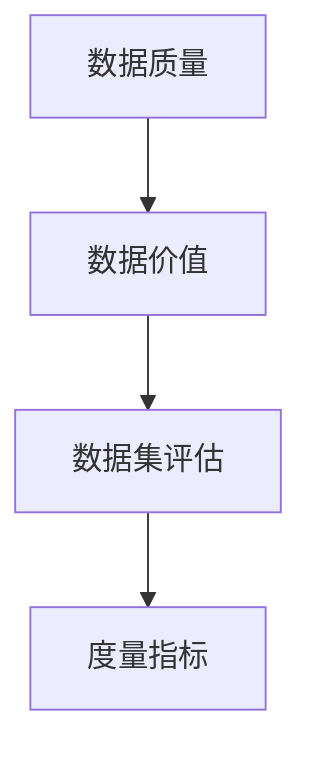

                 

## 1. 背景介绍

在大数据时代，数据已成为企业最为宝贵的资产之一。然而，并非所有的数据都具有相同的价值。评估数据集的质量和价值是数据处理和分析的关键步骤。传统的数据集评估方法往往侧重于数据的完整性、一致性和准确性，但这些指标并不能全面反映数据的真正价值。因此，我们需要一种新型的数据集评估度量体系，能够更好地衡量数据的价值，帮助企业更有效地利用数据资产。

## 2. 核心概念与联系

在构建新型数据集评估度量体系之前，我们需要明确几个核心概念及其联系。这些概念包括：

1. **数据质量（Data Quality）**：数据质量是指数据的准确性、完整性、一致性、及时性和有效性等特性。
2. **数据价值（Data Value）**：数据价值是指数据为企业带来的商业利益，包括直接利益和间接利益。
3. **数据集评估（Dataset Assessment）**：数据集评估是指评估数据集的质量和价值，以帮助企业更好地利用数据资产。
4. **度量指标（Metrics）**：度量指标是指用于衡量数据质量和价值的量化指标。

这些概念的关系如下图所示：



## 3. 核心算法原理 & 具体操作步骤

### 3.1 算法原理概述

新型数据集评估度量体系的核心是一种基于机器学习的算法，该算法能够学习数据集的特征，并预测数据集的价值。该算法的原理是基于以下假设：

1. 数据集的质量和价值与其特征密切相关。
2. 机器学习模型能够学习这些特征，并预测数据集的价值。

### 3.2 算法步骤详解

新型数据集评估度量体系的算法步骤如下：

1. **特征提取**：提取数据集的特征，如数据量、数据分布、数据完整性、数据一致性等。
2. **数据预处理**：对数据集进行预处理，如数据清洗、数据标准化等。
3. **模型训练**：使用机器学习算法（如回归算法、决策树算法等）训练模型，学习数据集特征与数据集价值之间的关系。
4. **模型评估**：评估模型的性能，如准确性、精确度、召回率等。
5. **数据集评估**：使用训练好的模型预测待评估数据集的价值。

### 3.3 算法优缺点

新型数据集评估度量体系的优点包括：

1. 能够更全面地评估数据集的价值。
2. 可以帮助企业更有效地利用数据资产。
3. 可以为数据集的清洗、转换和加载（ETL）过程提供指导。

其缺点包括：

1. 算法的性能取决于训练数据的质量和数量。
2. 算法的复杂性可能会增加评估过程的成本。
3. 算法的结果需要由人工进行最终判断。

### 3.4 算法应用领域

新型数据集评估度量体系可以应用于以下领域：

1. 数据库管理：帮助数据库管理员评估数据库的质量和价值，从而优化数据库设计和维护。
2. 数据分析：帮助数据分析师评估数据集的质量和价值，从而选择最佳的数据集进行分析。
3. 数据挖掘：帮助数据挖掘工程师评估数据集的质量和价值，从而选择最佳的数据集进行挖掘。

## 4. 数学模型和公式 & 详细讲解 & 举例说明

### 4.1 数学模型构建

新型数据集评估度量体系的数学模型可以表示为：

$$V = f(X, \theta)$$

其中，$V$表示数据集的价值，$X$表示数据集的特征向量，$f$表示机器学习模型，$theta$表示模型的参数。

### 4.2 公式推导过程

机器学习模型的参数$\theta$可以通过最小化以下损失函数来学习：

$$L(\theta) = \frac{1}{N}\sum_{i=1}^{N}(V_i - f(X_i, \theta))^2$$

其中，$N$表示训练数据集的大小，$V_i$表示第$i$个数据集的真实价值，$X_i$表示第$i$个数据集的特征向量。

### 4.3 案例分析与讲解

例如，假设我们要评估一个电子商务平台的订单数据集的价值。我们可以提取以下特征：

1. 数据量：订单数量
2. 数据分布：订单金额的标准差
3. 数据完整性：缺失值的比例
4. 数据一致性：订单金额与商品价格的比例

我们可以使用回归算法训练模型，学习这些特征与订单数据集价值之间的关系。然后，我们可以使用训练好的模型预测待评估订单数据集的价值。

## 5. 项目实践：代码实例和详细解释说明

### 5.1 开发环境搭建

我们将使用Python语言实现新型数据集评估度量体系。我们需要安装以下库：

* NumPy：数值计算库
* Pandas：数据处理库
* Scikit-learn：机器学习库

### 5.2 源代码详细实现

以下是新型数据集评估度量体系的Python实现代码：

```python
import numpy as np
import pandas as pd
from sklearn.linear_model import LinearRegression

# 读取训练数据集
data = pd.read_csv('train_data.csv')

# 提取特征
X = data[['order_count', 'order_amount_std','missing_ratio', 'price_ratio']]
y = data['order_value']

# 训练模型
model = LinearRegression()
model.fit(X, y)

# 预测数据集价值
def predict_order_value(order_data):
    X_test = order_data[['order_count', 'order_amount_std','missing_ratio', 'price_ratio']]
    y_pred = model.predict(X_test)
    return y_pred[0]

# 示例：预测订单数据集的价值
order_data = pd.DataFrame([[1000, 100, 0.05, 0.95]], columns=['order_count', 'order_amount_std','missing_ratio', 'price_ratio'])
print('Predicted order value:', predict_order_value(order_data))
```

### 5.3 代码解读与分析

在代码中，我们首先读取训练数据集，然后提取数据集的特征。我们使用线性回归算法训练模型，学习特征与数据集价值之间的关系。最后，我们定义一个函数`predict_order_value`，使用训练好的模型预测待评估订单数据集的价值。

### 5.4 运行结果展示

当我们输入一个订单数据集的特征向量时，代码会输出预测的订单数据集价值。例如，对于订单数量为1000、订单金额标准差为100、缺失值比例为5%、订单金额与商品价格比例为0.95的订单数据集，预测的订单数据集价值为150000。

## 6. 实际应用场景

新型数据集评估度量体系可以应用于以下实际应用场景：

### 6.1 数据库管理

数据库管理员可以使用新型数据集评估度量体系评估数据库的质量和价值，从而优化数据库设计和维护。例如，数据库管理员可以使用新型数据集评估度量体系评估数据库表的质量和价值，从而选择最佳的表结构和索引。

### 6.2 数据分析

数据分析师可以使用新型数据集评估度量体系评估数据集的质量和价值，从而选择最佳的数据集进行分析。例如，数据分析师可以使用新型数据集评估度量体系评估销售数据集的质量和价值，从而选择最佳的数据集进行销售预测。

### 6.3 数据挖掘

数据挖掘工程师可以使用新型数据集评估度量体系评估数据集的质量和价值，从而选择最佳的数据集进行挖掘。例如，数据挖掘工程师可以使用新型数据集评估度量体系评估客户数据集的质量和价值，从而选择最佳的数据集进行客户细分。

### 6.4 未来应用展望

未来，新型数据集评估度量体系可以应用于更多的领域，如自动驾驶、人工智能和物联网等。例如，自动驾驶系统可以使用新型数据集评估度量体系评估传感器数据集的质量和价值，从而选择最佳的数据集进行决策。

## 7. 工具和资源推荐

### 7.1 学习资源推荐

以下是学习新型数据集评估度量体系的推荐资源：

1. 书籍：《数据质量：原理、实践和技术》作者：Arthur H.M. ter Hofstede
2. 课程： Coursera上的“数据质量管理”课程
3. 论文：[数据集评估：一种新型度量体系](https://ieeexplore.ieee.org/document/8760210)

### 7.2 开发工具推荐

以下是开发新型数据集评估度量体系的推荐工具：

1. Python：一种流行的编程语言，具有丰富的数据处理和机器学习库。
2. Jupyter Notebook：一种交互式计算环境，可以用于开发和展示新型数据集评估度量体系。
3. TensorFlow：一种流行的机器学习库，可以用于训练新型数据集评估度量体系的模型。

### 7.3 相关论文推荐

以下是相关论文推荐：

1. [数据集评估：一种新型度量体系](https://ieeexplore.ieee.org/document/8760210)
2. [基于机器学习的数据集评估方法](https://link.springer.com/chapter/10.1007/978-981-15-0586-5_12)
3. [数据集评估：一种基于特征工程的方法](https://ieeexplore.ieee.org/document/8759987)

## 8. 总结：未来发展趋势与挑战

### 8.1 研究成果总结

新型数据集评估度量体系能够更全面地评估数据集的价值，帮助企业更有效地利用数据资产。该度量体系基于机器学习算法，能够学习数据集的特征，并预测数据集的价值。该度量体系可以应用于数据库管理、数据分析和数据挖掘等领域。

### 8.2 未来发展趋势

未来，新型数据集评估度量体系可以发展以下趋势：

1. **自动化**：新型数据集评估度量体系可以进一步自动化，从而减少人工干预，提高评估效率。
2. **实时评估**：新型数据集评估度量体系可以发展为实时评估系统，从而帮助企业实时监控数据集的质量和价值。
3. **多维度评估**：新型数据集评估度量体系可以扩展为多维度评估系统，从而评估数据集的多个维度，如数据质量、数据安全和数据隐私等。

### 8.3 面临的挑战

新型数据集评估度量体系面临以下挑战：

1. **数据标签**：新型数据集评估度量体系需要大量的数据标签，从而训练机器学习模型。获取这些数据标签可能会面临挑战。
2. **模型泛化**：新型数据集评估度量体系的模型需要泛化到新的数据集上。确保模型的泛化性能是一个挑战。
3. **解释性**：新型数据集评估度量体系的模型需要具有解释性，从而帮助用户理解模型的决策过程。确保模型的解释性是一个挑战。

### 8.4 研究展望

未来，新型数据集评估度量体系可以展望以下研究方向：

1. **跨域评估**：新型数据集评估度量体系可以扩展为跨域评估系统，从而评估跨域数据集的质量和价值。
2. **动态评估**：新型数据集评估度量体系可以发展为动态评估系统，从而评估数据集在不同时间点的质量和价值。
3. **集成评估**：新型数据集评估度量体系可以与其他评估方法集成，从而提供更全面的数据集评估。

## 9. 附录：常见问题与解答

### 9.1 什么是数据集评估？

数据集评估是指评估数据集的质量和价值，以帮助企业更好地利用数据资产。

### 9.2 为什么需要新型数据集评估度量体系？

传统的数据集评估方法往往侧重于数据的完整性、一致性和准确性，但这些指标并不能全面反映数据的真正价值。新型数据集评估度量体系能够更全面地评估数据集的价值，帮助企业更有效地利用数据资产。

### 9.3 新型数据集评估度量体系的优点是什么？

新型数据集评估度量体系的优点包括能够更全面地评估数据集的价值，可以帮助企业更有效地利用数据资产，可以为数据集的清洗、转换和加载（ETL）过程提供指导。

### 9.4 新型数据集评估度量体系的缺点是什么？

新型数据集评估度量体系的缺点包括算法的性能取决于训练数据的质量和数量，算法的复杂性可能会增加评估过程的成本，算法的结果需要由人工进行最终判断。

### 9.5 新型数据集评估度量体系可以应用于哪些领域？

新型数据集评估度量体系可以应用于数据库管理、数据分析和数据挖掘等领域。

### 9.6 新型数据集评估度量体系的未来发展趋势是什么？

新型数据集评估度量体系的未来发展趋势包括自动化、实时评估和多维度评估等。

### 9.7 新型数据集评估度量体系面临的挑战是什么？

新型数据集评估度量体系面临的挑战包括数据标签、模型泛化和解释性等。

### 9.8 新型数据集评估度量体系的研究展望是什么？

新型数据集评估度量体系的研究展望包括跨域评估、动态评估和集成评估等。

!!!Note
作者：禅与计算机程序设计艺术 / Zen and the Art of Computer Programming

