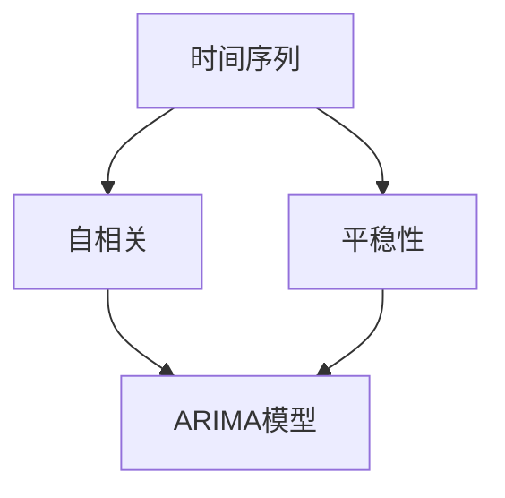

                 

- 时间序列分析
- ARIMA模型
- 移动平均法
- 白噪声
- 回归分析
- Python
- Pandas
- Statsmodels

## 1. 背景介绍

时间序列分析是一种用于处理和预测时间相关数据的统计方法。它广泛应用于金融、气候、生物医学、工业生产等领域。本文将介绍时间序列分析的原理，重点讲解ARIMA模型，并提供Python代码实例。

## 2. 核心概念与联系

### 2.1 核心概念

- **时间序列（Time Series）**：按时间顺序排列的数据序列。
- **自相关（Autocorrelation）**：时间序列在不同时间点的相关性。
- **平稳性（Stationarity）**：时间序列的统计性质不随时间变化。
- **ARIMA模型（AutoRegressive Integrated Moving Average）**：一种用于预测时间序列的模型，结合了自回归（AR）、差分（I）和移动平均（MA）部分。

### 2.2 核心概念联系 Mermaid 流程图



## 3. 核心算法原理 & 具体操作步骤

### 3.1 算法原理概述

ARIMA模型是一种广泛使用的时间序列预测模型，它结合了自回归（AR）、差分（I）和移动平均（MA）部分。ARIMA(p, d, q)模型中，p是自回归项的数量，d是差分的阶数，q是移动平均项的数量。

### 3.2 算法步骤详解

1. **数据预处理**：检查时间序列的平稳性，如果不平稳，则进行差分处理。
2. **参数选择**：通过自相关函数（ACF）和偏自相关函数（PACF）图，选择合适的(p, q)值。
3. **模型拟合**：使用选定的(p, d, q)值拟合ARIMA模型。
4. **模型评估**：使用残差图、自相关函数（ACF）图和偏自相关函数（PACF）图评估模型的合适性。
5. **预测**：使用拟合的模型进行时间序列预测。

### 3.3 算法优缺点

**优点**：ARIMA模型简单易用，可以处理各种类型的时间序列数据。

**缺点**：ARIMA模型假设时间序列是平稳的，如果数据不平稳，则需要进行预处理。此外，ARIMA模型的参数选择可能需要大量试错。

### 3.4 算法应用领域

ARIMA模型广泛应用于金融（股票价格预测）、气候（温度预测）、生物医学（疾病传播预测）、工业生产（需求预测）等领域。

## 4. 数学模型和公式 & 详细讲解 & 举例说明

### 4.1 数学模型构建

ARIMA(p, d, q)模型的数学表达式为：

$$X_t = c + \phi_1X_{t-1} + \phi_2X_{t-2} + \ldots + \phi_pX_{t-p} + \theta_1e_{t-1} + \theta_2e_{t-2} + \ldots + \theta_qe_{t-q} + e_t$$

其中，$X_t$是时间序列在时刻$t$的值，$c$是常数项，$e_t$是白噪声，$p$是自回归项的数量，$q$是移动平均项的数量。

### 4.2 公式推导过程

ARIMA模型的推导基于自回归（AR）、差分（I）和移动平均（MA）部分的组合。自回归部分表示当前值与其历史值的线性关系，差分部分用于消除时间序列的趋势和季节性，移动平均部分表示当前值与其误差项的线性关系。

### 4.3 案例分析与讲解

假设我们有一个平稳的时间序列，并已知其自相关函数（ACF）和偏自相关函数（PACF）图。通过观察ACF图，我们发现自相关项主要集中在第一个滞后期，因此我们选择p=1。通过观察PACF图，我们发现偏自相关项主要集中在第一个滞后期，因此我们选择q=1。在这种情况下，我们可以选择ARIMA(1, 0, 1)模型。

## 5. 项目实践：代码实例和详细解释说明

### 5.1 开发环境搭建

本项目使用Python语言，并需要以下库：Pandas、Statsmodels、Matplotlib、Seaborn。

```bash
pip install pandas statsmodels matplotlib seaborn
```

### 5.2 源代码详细实现

以下是使用ARIMA模型预测时间序列的Python代码示例。

```python
import pandas as pd
import matplotlib.pyplot as plt
import seaborn as sns
from statsmodels.tsa.arima.model import ARIMA
from statsmodels.tsa.stattools import adfuller
from statsmodels.graphics.tsaplots import plot_acf, plot_pacf

# 加载数据
data = pd.read_csv('airline_passengers.csv')
data['Month'] = pd.to_datetime(data['Month'])
data.set_index('Month', inplace=True)

# 绘制时间序列图
plt.figure(figsize=(12, 6))
sns.lineplot(data=data)
plt.title('Airline Passengers')
plt.show()

# 检查平稳性
result = adfuller(data['Passengers'])
print('ADF Statistic: %f' % result[0])
print('p-value: %f' % result[1])

# 如果不平稳，则进行差分处理
#...

# 绘制自相关函数（ACF）图和偏自相关函数（PACF）图
plot_acf(data['Passengers'])
plot_pacf(data['Passengers'])
plt.show()

# 选择合适的(p, q)值，并拟合ARIMA模型
model = ARIMA(data['Passengers'], order=(1, 0, 1))
model_fit = model.fit()

# 评估模型
model_fit.summary()

# 进行预测
forecast = model_fit.forecast(steps=12)
plt.figure(figsize=(12, 6))
sns.lineplot(data=data, label='actual')
sns.lineplot(data=forecast, label='forecast')
plt.title('Airline Passengers Forecast')
plt.show()
```

### 5.3 代码解读与分析

代码首先加载时间序列数据，并绘制时间序列图。然后，它使用Augmented Dickey-Fuller（ADF）检验检查时间序列的平稳性。如果时间序列不平稳，则进行差分处理。接下来，代码绘制自相关函数（ACF）图和偏自相关函数（PACF）图，以帮助选择合适的(p, q)值。然后，它拟合ARIMA模型，评估模型，并进行预测。

### 5.4 运行结果展示

预测结果图显示了实际值和预测值的比较。通过观察图表，我们可以评估预测的准确性。

## 6. 实际应用场景

ARIMA模型广泛应用于金融、气候、生物医学、工业生产等领域。例如，金融领域可以使用ARIMA模型预测股票价格，气候领域可以预测温度，生物医学领域可以预测疾病传播，工业生产领域可以预测需求。

### 6.1 未来应用展望

随着计算能力的提高和大数据的兴起，时间序列分析的应用将变得更加广泛。未来，我们可能会看到更复杂的时间序列模型，以及更先进的预测技术。

## 7. 工具和资源推荐

### 7.1 学习资源推荐

- "Time Series Analysis: Forecasting and Control" by George E.P. Box, Gwilym M. Jenkins
- "Forecasting: Principles and Practice" by Rob J. Hyndman, George C. Cobb

### 7.2 开发工具推荐

- Python：Pandas、Statsmodels、Matplotlib、Seaborn
- R：forecast包

### 7.3 相关论文推荐

- "Automatic Selection of ARIMA Models for Time Series Forecasting" by Hyndman, R.J., & Khandakar, Y.
- "A New Approach to the Selection of Autoregressive Integrated Moving Average Models" by Ng, K., & Yip, W.

## 8. 总结：未来发展趋势与挑战

### 8.1 研究成果总结

本文介绍了时间序列分析的原理，重点讲解了ARIMA模型，并提供了Python代码实例。

### 8.2 未来发展趋势

未来，时间序列分析将继续发展，我们可能会看到更复杂的模型和更先进的预测技术。

### 8.3 面临的挑战

时间序列分析面临的挑战包括数据的非平稳性、参数的选择、模型的评估等。

### 8.4 研究展望

未来的研究将关注更复杂的时间序列模型，以及更先进的预测技术。

## 9. 附录：常见问题与解答

**Q：时间序列分析的优点是什么？**

**A**：时间序列分析可以处理各种类型的时间相关数据，并提供准确的预测。

**Q：时间序列分析的缺点是什么？**

**A**：时间序列分析假设时间序列是平稳的，如果数据不平稳，则需要进行预处理。此外，参数的选择可能需要大量试错。

**Q：ARIMA模型的参数选择应该如何进行？**

**A**：ARIMA模型的参数选择通常基于自相关函数（ACF）和偏自相关函数（PACF）图。通过观察ACF图，我们可以选择p值，通过观察PACF图，我们可以选择q值。d值通常通过检查时间序列的平稳性来选择。

!!!Note
作者：禅与计算机程序设计艺术 / Zen and the Art of Computer Programming

