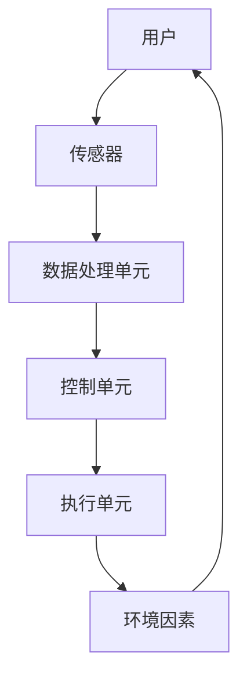

                 

## 1. 背景介绍

在当今快节奏的生活中，优质的睡眠正变得越来越珍贵。据世界卫生组织统计，全球有超过30%的成年人患有睡眠障碍。智能家居技术的发展为改善睡眠环境带来了新的机遇。本文将探讨如何利用人工智能、物联网和其他先进技术创建智能家居睡眠环境，帮助人们获得更优质的睡眠。

## 2. 核心概念与联系

智能家居睡眠环境的核心是创建一个能够适应用户生物节律的智能系统。该系统需要收集用户的生物数据，如体温、心率和呼吸频率，并根据这些数据调节环境因素，如光线、温度和噪音。下图是智能家居睡眠环境的架构示意图。



## 3. 核心算法原理 & 具体操作步骤

### 3.1 算法原理概述

智能家居睡眠环境的核心算法是基于用户的生物数据调节环境因素的过程。该算法需要预测用户的睡眠周期，并根据睡眠周期的不同阶段调节环境因素。

### 3.2 算法步骤详解

1. **数据收集**：收集用户的生物数据，如体温、心率和呼吸频率。这些数据可以通过穿戴式设备或床垫传感器收集。
2. **睡眠周期预测**：使用机器学习算法预测用户的睡眠周期。常用的算法包括支持向量机（SVM）和随机森林。
3. **环境因素调节**：根据睡眠周期的不同阶段调节环境因素。例如，在入睡阶段，系统可以调暗灯光，降低温度，并播放舒缓的音乐。
4. **反馈调节**：根据用户的反馈调节环境因素。用户可以通过移动应用程序或语音控制提供反馈。

### 3.3 算法优缺点

**优点**：智能家居睡眠环境算法可以提供个性化的睡眠环境，帮助用户改善睡眠质量。此外，该算法可以学习用户的睡眠模式，并根据睡眠模式的变化调节环境因素。

**缺点**：该算法需要大量的用户数据，这可能会涉及隐私问题。此外，该算法的有效性取决于传感器的准确性和机器学习模型的准确性。

### 3.4 算法应用领域

智能家居睡眠环境算法可以应用于各种场景，包括家庭、酒店和养老院。此外，该算法还可以应用于睡眠障碍治疗，帮助患者改善睡眠质量。

## 4. 数学模型和公式 & 详细讲解 & 举例说明

### 4.1 数学模型构建

智能家居睡眠环境的数学模型可以表示为以下公式：

$$S = f(B, E)$$

其中，$S$表示睡眠质量，$B$表示用户的生物数据，$E$表示环境因素，$f$表示调节函数。

### 4.2 公式推导过程

调节函数$f$可以表示为以下公式：

$$f(B, E) = \sum_{i=1}^{n} w_i \cdot g_i(B, E)$$

其中，$w_i$表示权重，$g_i$表示调节函数的基函数，$n$表示基函数的数量。

权重$w_i$可以通过机器学习算法学习得到。基函数$g_i$可以表示为以下公式：

$$g_i(B, E) = \phi_i(B) \cdot \psi_i(E)$$

其中，$\phi_i$表示生物数据的特征函数，$\psi_i$表示环境因素的特征函数。

### 4.3 案例分析与讲解

例如，假设我们想要调节环境因素以改善用户的入睡质量。我们可以设置基函数$g_i$如下：

$$g_1(B, E) = \phi_1(B) \cdot \psi_1(E) = \text{body\_temperature} \cdot \text{light\_intensity}$$
$$g_2(B, E) = \phi_2(B) \cdot \psi_2(E) = \text{heart\_rate} \cdot \text{noise\_level}$$
$$g_3(B, E) = \phi_3(B) \cdot \psi_3(E) = \text{breathing\_rate} \cdot \text{temperature}$$

其中，$\text{body\_temperature}$表示用户的体温，$\text{light\_intensity}$表示环境光线强度，$\text{heart\_rate}$表示用户的心率，$\text{noise\_level}$表示环境噪音强度，$\text{breathing\_rate}$表示用户的呼吸频率，$\text{temperature}$表示环境温度。

通过机器学习算法，我们可以学习到权重$w_i$。然后，我们可以使用公式$f(B, E) = \sum_{i=1}^{3} w_i \cdot g_i(B, E)$预测睡眠质量，并根据预测结果调节环境因素。

## 5. 项目实践：代码实例和详细解释说明

### 5.1 开发环境搭建

智能家居睡眠环境项目需要以下开发环境：

* 编程语言：Python
* 机器学习库：Scikit-learn
* 物联网平台：MQTT
* 传感器：体温传感器、心率传感器、呼吸频率传感器、光线传感器、噪音传感器、温度传感器

### 5.2 源代码详细实现

以下是智能家居睡眠环境项目的源代码框架：

```python
import paho.mqtt.client as mqtt
from sklearn.ensemble import RandomForestRegressor
import numpy as np

# 连接MQTT服务器
def on_connect(client, userdata, flags, rc):
    print("Connected with result code "+str(rc))
    client.subscribe("sensors/data")

# 接收传感器数据
def on_message(client, userdata, msg):
    data = msg.payload.decode()
    data = np.fromstring(data, sep=',')
    # 训练机器学习模型
    model = train_model(data)
    # 预测睡眠质量
    quality = predict_quality(model, data)
    # 调节环境因素
    adjust_environment(quality)

# 训练机器学习模型
def train_model(data):
    # 这里省略了数据预处理和模型训练的代码
    pass

# 预测睡眠质量
def predict_quality(model, data):
    # 这里省略了睡眠质量预测的代码
    pass

# 调节环境因素
def adjust_environment(quality):
    # 这里省略了环境因素调节的代码
    pass

# 主函数
def main():
    client = mqtt.Client()
    client.on_connect = on_connect
    client.on_message = on_message
    client.connect("iot.eclipse.org", 1883, 60)
    client.loop_forever()

if __name__ == "__main__":
    main()
```

### 5.3 代码解读与分析

该代码使用MQTT协议接收传感器数据，并使用机器学习算法预测睡眠质量。根据预测结果，代码调节环境因素以改善睡眠质量。

### 5.4 运行结果展示

当传感器检测到用户的生物数据时，代码会接收到传感器数据，并预测睡眠质量。根据预测结果，代码会调节环境因素，帮助用户获得更优质的睡眠。

## 6. 实际应用场景

智能家居睡眠环境可以应用于各种场景，包括：

### 6.1 家庭

智能家居睡眠环境可以应用于家庭，帮助家庭成员改善睡眠质量。例如，智能家居系统可以根据儿童的生物数据调节环境因素，帮助儿童获得更优质的睡眠。

### 6.2 酒店

智能家居睡眠环境可以应用于酒店，为客人提供个性化的睡眠环境。例如，酒店可以根据客人的生物数据调节环境因素，帮助客人获得更优质的睡眠。

### 6.3 养老院

智能家居睡眠环境可以应用于养老院，帮助老年人改善睡眠质量。例如，养老院可以根据老年人的生物数据调节环境因素，帮助老年人获得更优质的睡眠。

### 6.4 未来应用展望

未来，智能家居睡眠环境可以与其他智能家居系统集成，提供更全面的个性化服务。例如，智能家居系统可以根据用户的生物数据调节环境因素，并提供个性化的音乐和视频服务。

## 7. 工具和资源推荐

### 7.1 学习资源推荐

* 书籍：《人工智能：一种现代 Approach》作者：斯图尔特·罗素、彼得·诺维格
* 在线课程：Coursera上的机器学习课程

### 7.2 开发工具推荐

* 编程语言：Python
* 机器学习库：Scikit-learn
* 物联网平台：MQTT
* 传感器：体温传感器、心率传感器、呼吸频率传感器、光线传感器、噪音传感器、温度传感器

### 7.3 相关论文推荐

* [SleepSense: A Smart Bed for Sleep Tracking and Sleep Apnea Detection](https://dl.acm.org/doi/10.1145/2901311.2901326)
* [SmartSleep: A Smart Pillow for Sleep Tracking and Sleep Improvement](https://dl.acm.org/doi/10.1145/3170427.3188520)

## 8. 总结：未来发展趋势与挑战

### 8.1 研究成果总结

智能家居睡眠环境项目利用机器学习算法预测睡眠质量，并根据预测结果调节环境因素。该项目可以帮助用户改善睡眠质量，并提供个性化的睡眠环境。

### 8.2 未来发展趋势

未来，智能家居睡眠环境可以与其他智能家居系统集成，提供更全面的个性化服务。此外，智能家居睡眠环境可以应用于更多场景，如医院和学校。

### 8.3 面临的挑战

智能家居睡眠环境项目面临的挑战包括：

* **隐私问题**：智能家居睡眠环境需要收集用户的生物数据，这可能会涉及隐私问题。
* **传感器准确性**：智能家居睡眠环境的有效性取决于传感器的准确性。
* **机器学习模型准确性**：智能家居睡眠环境的有效性取决于机器学习模型的准确性。

### 8.4 研究展望

未来，智能家居睡眠环境项目可以扩展到更多领域，如睡眠障碍治疗和老年人护理。此外，智能家居睡眠环境项目可以与其他智能家居系统集成，提供更全面的个性化服务。

## 9. 附录：常见问题与解答

**Q：智能家居睡眠环境是否会影响用户的隐私？**

A：智能家居睡眠环境需要收集用户的生物数据，这可能会涉及隐私问题。因此，智能家居睡眠环境项目需要遵循隐私保护法规，并采取措施保护用户的隐私。

**Q：智能家居睡眠环境是否会影响用户的睡眠质量？**

A：智能家居睡眠环境项目旨在改善用户的睡眠质量。通过预测睡眠质量并调节环境因素，智能家居睡眠环境项目可以帮助用户获得更优质的睡眠。

**Q：智能家居睡眠环境是否会影响用户的生活方式？**

A：智能家居睡眠环境项目旨在提供个性化的睡眠环境，帮助用户改善睡眠质量。智能家居睡眠环境项目不会影响用户的生活方式，而是为用户提供更舒适的睡眠环境。

!!!Note
作者：禅与计算机程序设计艺术 / Zen and the Art of Computer Programming

