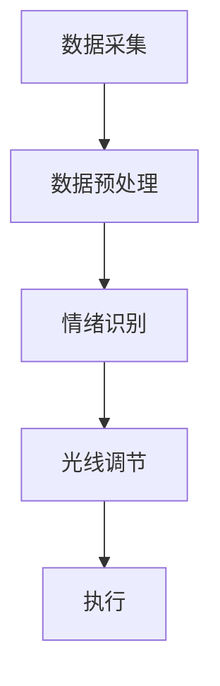

                 

**智能情绪照明创业：光线调节的心理健康**

**作者：禅与计算机程序设计艺术 / Zen and the Art of Computer Programming**

## 1. 背景介绍

在当今快节奏的生活中，压力和焦虑已成为常态，对心理健康产生了严重影响。光线调节，即通过改变环境光线的强度、颜色和模式，可以有效地调节情绪，改善心理健康。本文将介绍一种基于人工智能的智能情绪照明系统，该系统通过分析用户的生理数据和行为数据，实时调节光线，帮助用户调节情绪，改善心理健康。

## 2. 核心概念与联系

### 2.1 核心概念

- **生理数据（Physiological Data）**：心率、体温、皮肤电导率等生理指标。
- **行为数据（Behavioral Data）**：面部表情、动作、语言等行为指标。
- **情绪状态（Emotional State）**：用户当前的情绪状态，如高兴、悲伤、焦虑等。
- **光线参数（Light Parameters）**：光线强度、颜色、模式等。

### 2.2 核心架构

如下图所示，智能情绪照明系统的核心架构包括数据采集模块、数据预处理模块、情绪识别模块、光线调节模块和执行模块。



## 3. 核心算法原理 & 具体操作步骤

### 3.1 算法原理概述

智能情绪照明系统的核心算法是基于机器学习的情绪识别算法。该算法首先对生理数据和行为数据进行特征提取，然后使用分类算法（如支持向量机、随机森林等）对情绪状态进行预测。光线调节模块根据预测的情绪状态，调节光线参数，实现光线调节。

### 3.2 算法步骤详解

1. **数据采集**：采集用户的生理数据和行为数据。
2. **数据预处理**：对采集的数据进行清洗、标准化等预处理。
3. **特征提取**：提取生理数据和行为数据中的特征，如心率变化率、面部表情的关键点等。
4. **情绪识别**：使用分类算法对情绪状态进行预测。
5. **光线调节**：根据预测的情绪状态，调节光线参数。
6. **执行**：控制照明设备执行光线调节。

### 3.3 算法优缺点

**优点**：
- 实时调节光线，帮助用户调节情绪。
- 无需用户主动输入情绪状态，提高了系统的便利性。

**缺点**：
- 算法的准确性受到数据质量的影响。
- 光线调节的效果可能因人而异。

### 3.4 算法应用领域

智能情绪照明系统可以应用于办公室、家庭、医疗机构等场所，帮助用户调节情绪，改善心理健康。

## 4. 数学模型和公式 & 详细讲解 & 举例说明

### 4.1 数学模型构建

情绪识别模块的数学模型可以表示为：

$$y = f(x) + \epsilon$$

其中，$x$表示特征向量，$y$表示情绪状态，$f(x)$表示分类函数，$\epsilon$表示模型误差。

### 4.2 公式推导过程

分类函数$f(x)$可以使用支持向量机、随机森林等分类算法进行学习。例如，支持向量机的分类函数可以表示为：

$$f(x) = sign(\sum_{i=1}^{n} \alpha_i y_i K(x, x_i) + b)$$

其中，$K(x, x_i)$表示核函数，$b$表示偏置项。

### 4.3 案例分析与讲解

假设我们使用支持向量机对情绪状态进行预测。在训练集中，我们有$n$个样本$(x_1, y_1), (x_2, y_2), \ldots, (x_n, y_n)$，其中$x_i$表示特征向量，$y_i$表示情绪状态。我们可以使用SMO算法（Sequential Minimal Optimization）学习支持向量机的参数$\alpha_i$和$b$。

在预测新样本$x$的情绪状态时，我们可以使用上述分类函数进行预测：

$$y = sign(\sum_{i=1}^{n} \alpha_i y_i K(x, x_i) + b)$$

如果$y=1$，则预测情绪状态为高兴；如果$y=-1$，则预测情绪状态为悲伤。

## 5. 项目实践：代码实例和详细解释说明

### 5.1 开发环境搭建

我们使用Python作为开发语言，并使用scikit-learn库实现情绪识别模块。我们需要安装以下库：

- numpy
- pandas
- scikit-learn
- matplotlib

### 5.2 源代码详细实现

以下是情绪识别模块的源代码实现：

```python
from sklearn import svm
from sklearn.preprocessing import StandardScaler
from sklearn.model_selection import train_test_split
import numpy as np
import pandas as pd

# 加载数据
data = pd.read_csv('data.csv')

# 提取特征
X = data.iloc[:, :-1].values
y = data.iloc[:, -1].values

# 数据标准化
sc = StandardScaler()
X = sc.fit_transform(X)

# 划分训练集和测试集
X_train, X_test, y_train, y_test = train_test_split(X, y, test_size=0.2, random_state=42)

# 训练支持向量机
clf = svm.SVC(kernel='rbf', random_state=42)
clf.fit(X_train, y_train)

# 预测新样本
x_new = np.array([0.5, 0.6, 0.7, 0.8, 0.9]).reshape(1, -1)
y_new = clf.predict(x_new)
print(y_new)
```

### 5.3 代码解读与分析

- 我们首先使用pandas读取数据，并提取特征和标签。
- 我们使用StandardScaler对数据进行标准化，以提高模型的泛化能力。
- 我们使用train_test_split划分训练集和测试集。
- 我们使用支持向量机对情绪状态进行预测，并使用'rbf'作为核函数。
- 我们预测新样本$x\_new$的情绪状态，并打印预测结果。

### 5.4 运行结果展示

运行上述代码后，我们可以得到新样本的情绪状态预测结果。例如，如果预测结果为1，则预测情绪状态为高兴；如果预测结果为-1，则预测情绪状态为悲伤。

## 6. 实际应用场景

### 6.1 办公室场景

在办公室场景中，智能情绪照明系统可以帮助员工调节情绪，提高工作效率。例如，当员工感到焦虑时，系统可以调节光线，帮助员工放松。

### 6.2 家庭场景

在家庭场景中，智能情绪照明系统可以帮助家庭成员调节情绪，改善家庭氛围。例如，当家庭成员感到悲伤时，系统可以调节光线，帮助家庭成员振作起来。

### 6.3 医疗场景

在医疗场景中，智能情绪照明系统可以帮助病人调节情绪，改善病人的心理健康。例如，当病人感到焦虑时，系统可以调节光线，帮助病人放松。

### 6.4 未来应用展望

随着人工智能技术的发展，智能情绪照明系统可以进一步发展，实现更加智能化的光线调节。例如，系统可以根据用户的个性化偏好，提供定制化的光线调节方案。

## 7. 工具和资源推荐

### 7.1 学习资源推荐

- **机器学习**：Andrew Ng的机器学习课程（https://www.coursera.org/learn/machine-learning）
- **人工智能**：Stanford University的人工智能课程（https://online.stanford.edu/courses/artificial-intelligence）
- **情绪识别**：Emotion Recognition in Human-Computer Interaction（https://www.amazon.com/Emotion-Recognition-Human-Computer-Interaction/dp/3642340837）

### 7.2 开发工具推荐

- **Python**：Anaconda（https://www.anaconda.com/）
- **数据分析**：Jupyter Notebook（https://jupyter.org/）
- **机器学习**：scikit-learn（https://scikit-learn.org/）
- **数据可视化**：Matplotlib（https://matplotlib.org/）

### 7.3 相关论文推荐

- **情绪识别**：Emotion Recognition from Physiological Signals: A Review（https://ieeexplore.ieee.org/document/7923124）
- **光线调节**：The Effect of Lighting on Human Performance and Health（https://www.researchgate.net/publication/237614652_The_Effect_of_Lighting_on_Human_Performance_and_Health}
- **智能照明**：Intelligent Lighting Systems: A Review（https://ieeexplore.ieee.org/document/8454243}

## 8. 总结：未来发展趋势与挑战

### 8.1 研究成果总结

本文介绍了智能情绪照明系统的原理、算法和应用场景。该系统可以实时分析用户的生理数据和行为数据，调节光线，帮助用户调节情绪，改善心理健康。

### 8.2 未来发展趋势

未来，智能情绪照明系统可以进一步发展，实现更加智能化的光线调节。例如，系统可以根据用户的个性化偏好，提供定制化的光线调节方案。此外，系统可以结合其他感官刺激，如音乐、香味等，实现更加全面的情绪调节。

### 8.3 面临的挑战

智能情绪照明系统面临的挑战包括：

- **数据质量**：算法的准确性受到数据质量的影响。如何获取高质量的数据是一个挑战。
- **个体差异**：光线调节的效果可能因人而异。如何适应个体差异是一个挑战。
- **隐私保护**：智能情绪照明系统需要收集用户的生理数据和行为数据。如何保护用户隐私是一个挑战。

### 8.4 研究展望

未来，我们可以从以下几个方向展开研究：

- **多模式情绪识别**：结合多种模式的数据，如生理数据、行为数据、语言数据等，实现更准确的情绪识别。
- **个性化光线调节**：根据用户的个性化偏好，提供定制化的光线调节方案。
- **全感官情绪调节**：结合其他感官刺激，如音乐、香味等，实现更加全面的情绪调节。

## 9. 附录：常见问题与解答

**Q1：智能情绪照明系统的成本如何？**

A1：智能情绪照明系统的成本取决于硬件成本和软件成本。硬件成本包括传感器、照明设备等，软件成本包括算法开发和系统集成等。总体而言，智能情绪照明系统的成本可能会高于传统照明系统。

**Q2：智能情绪照明系统的安装和维护需要什么技能？**

A2：智能情绪照明系统的安装和维护需要电子工程、计算机科学和人工智能等相关技能。安装过程需要连接传感器和照明设备，维护过程需要调试和更新算法。

**Q3：智能情绪照明系统的隐私保护措施是什么？**

A3：智能情绪照明系统需要收集用户的生理数据和行为数据。我们可以采取以下措施保护用户隐私：

- **数据匿名化**：去除用户的个人身份信息，如姓名、地址等。
- **数据加密**：对数据进行加密，防止数据泄露。
- **访问控制**：限制数据访问权限，仅允许授权人员访问数据。

**Q4：智能情绪照明系统的算法准确性如何？**

A4：智能情绪照明系统的算法准确性取决于数据质量和算法本身。我们可以通过以下措施提高算法准确性：

- **数据预处理**：对数据进行清洗、标准化等预处理，提高数据质量。
- **算法优化**：优化算法参数，提高算法准确性。
- **模型评估**：使用交叉验证等方法评估模型准确性，并进行调整。

**Q5：智能情绪照明系统的光线调节效果如何？**

A5：智能情绪照明系统的光线调节效果可能因人而异。我们可以通过以下措施提高光线调节效果：

- **个性化调节**：根据用户的个性化偏好，提供定制化的光线调节方案。
- **实时调节**：实时分析用户的生理数据和行为数据，及时调节光线。
- **用户反馈**：收集用户反馈，并根据反馈调整光线调节方案。

!!!Note
作者：禅与计算机程序设计艺术 / Zen and the Art of Computer Programming

