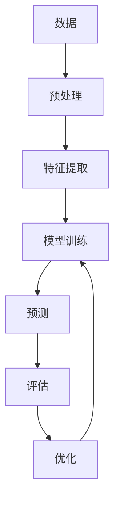

                 

## 1. 背景介绍

在人工智能（AI）领域，我们正处于一个转折点，从AI 1.0过渡到AI 2.0。AI 1.0主要关注于规则和逻辑，而AI 2.0则是一种更加智能和自适应的系统，它能够学习、适应和进化。本文将探讨AI 2.0在商业领域的价值，以及它如何帮助企业提高效率、创新和竞争力。

## 2. 核心概念与联系

AI 2.0的核心概念是机器学习（ML）和深度学习（DL）。ML允许系统从数据中学习，而DL则是一种特殊的ML方法，它使用神经网络来模拟人类大脑的工作原理。AI 2.0系统的架构如下图所示：



## 3. 核心算法原理 & 具体操作步骤

### 3.1 算法原理概述

AI 2.0的核心算法是神经网络，它由输入层、隐藏层和输出层组成。神经网络使用权重和偏置来学习数据的模式，并使用反向传播算法来优化这些参数。

### 3.2 算法步骤详解

1. 数据预处理：清洗、标准化和归一化数据。
2. 特征提取：选择最相关的特征来训练模型。
3. 模型训练：使用训练数据调整神经网络的权重和偏置。
4. 预测：使用训练好的模型对新数据进行预测。
5. 评估：使用测试数据评估模型的性能。
6. 优化：根据评估结果调整模型参数，重复步骤3-6直到模型性能满意。

### 3.3 算法优缺点

优点：自适应、学习能力强、能够处理复杂数据。缺点：计算资源需求高、易受过拟合影响、解释性差。

### 3.4 算法应用领域

AI 2.0在图像识别、语音识别、自然语言处理、推荐系统和自动驾驶等领域有着广泛的应用。

## 4. 数学模型和公式 & 详细讲解 & 举例说明

### 4.1 数学模型构建

神经网络的数学模型可以表示为：

$$y = f(wx + b)$$

其中，$x$是输入，$y$是输出，$w$是权重，$b$是偏置，$f$是激活函数。

### 4.2 公式推导过程

反向传播算法的目的是最小化损失函数$L$：

$$\frac{\partial L}{\partial w} = \frac{\partial L}{\partial y} \frac{\partial y}{\partial w}$$

$$\frac{\partial L}{\partial b} = \frac{\partial L}{\partial y} \frac{\partial y}{\partial b}$$

### 4.3 案例分析与讲解

例如，在图像识别任务中，输入$x$是图像的像素值，输出$y$是图像的标签。神经网络通过学习权重$w$和偏置$b$来映射输入到输出。

## 5. 项目实践：代码实例和详细解释说明

### 5.1 开发环境搭建

本项目使用Python、TensorFlow和Jupyter Notebook。

### 5.2 源代码详细实现

```python
import tensorflow as tf
from tensorflow.keras import layers

# Define the model
model = tf.keras.Sequential([
    layers.Dense(64, activation='relu', input_shape=(784,)),
    layers.Dense(64, activation='relu'),
    layers.Dense(10, activation='softmax')
])

# Compile the model
model.compile(optimizer='adam',
              loss='sparse_categorical_crossentropy',
              metrics=['accuracy'])

# Train the model
model.fit(x_train, y_train, epochs=5)
```

### 5.3 代码解读与分析

这段代码定义了一个简单的神经网络模型，并使用Adam优化器和交叉熵损失函数来训练模型。

### 5.4 运行结果展示

模型的准确率在训练过程中会不断提高。

## 6. 实际应用场景

AI 2.0在商业领域有着广泛的应用，例如：

### 6.1 客户服务

AI 2.0可以帮助企业提供更好的客户服务，例如通过聊天机器人提供24/7支持。

### 6.2 预测分析

AI 2.0可以帮助企业进行预测分析，例如预测销售额、客户流失率等。

### 6.3 自动化

AI 2.0可以帮助企业自动化重复性任务，例如图像和语音识别。

### 6.4 未来应用展望

未来，AI 2.0将会帮助企业进行更加智能的决策，例如自动化营销、个性化推荐等。

## 7. 工具和资源推荐

### 7.1 学习资源推荐

* Andrew Ng的机器学习课程
* TensorFlow官方文档
* Deep Learning Specialization by Andrew Ng

### 7.2 开发工具推荐

* TensorFlow
* PyTorch
* Keras

### 7.3 相关论文推荐

* "Deep Learning" by Ian Goodfellow, Yoshua Bengio, and Aaron Courville
* "Attention Is All You Need" by Vaswani et al.

## 8. 总结：未来发展趋势与挑战

### 8.1 研究成果总结

AI 2.0在商业领域取得了显著的成就，例如提高了客户服务质量、改善了预测分析的准确性等。

### 8.2 未来发展趋势

未来，AI 2.0将会继续发展，并帮助企业进行更加智能和自适应的决策。

### 8.3 面临的挑战

AI 2.0面临的挑战包括计算资源需求高、易受过拟合影响、解释性差等。

### 8.4 研究展望

未来的研究方向包括提高模型的解释性、降低计算资源需求、减少过拟合等。

## 9. 附录：常见问题与解答

**Q：AI 2.0和AI 1.0有什么区别？**

**A：**AI 1.0主要关注于规则和逻辑，而AI 2.0则是一种更加智能和自适应的系统，它能够学习、适应和进化。

**Q：AI 2.0的优缺点是什么？**

**A：**AI 2.0的优点是自适应、学习能力强、能够处理复杂数据。缺点是计算资源需求高、易受过拟合影响、解释性差。

**Q：AI 2.0在商业领域有哪些应用？**

**A：**AI 2.0在商业领域有着广泛的应用，例如客户服务、预测分析、自动化等。

---

作者：禅与计算机程序设计艺术 / Zen and the Art of Computer Programming

