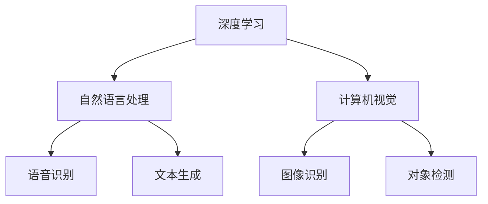

                 

**关键词：**AI应用、苹果、人工智能、深度学习、自然语言处理、计算机视觉、隐私保护、用户体验

## 1. 背景介绍

2019年，苹果在其开发者大会上发布了新的AI应用，引起了业界的广泛关注。这些应用利用了人工智能技术，为用户提供了更加智能和个性化的体验。本文将深入探讨苹果发布的AI应用的价值，分析其核心概念、算法原理，并提供项目实践和实际应用场景。

## 2. 核心概念与联系

苹果发布的AI应用主要包括三个方面：深度学习、自然语言处理和计算机视觉。这些技术相互关联，共同构成了AI应用的核心。



## 3. 核心算法原理 & 具体操作步骤

### 3.1 算法原理概述

苹果的AI应用主要基于深度学习算法，如卷积神经网络（CNN）和循环神经网络（RNN）。这些算法通过学习数据中的模式，不断改进其预测能力。

### 3.2 算法步骤详解

1. **数据收集与预处理：**收集大量的数据，并对其进行预处理，如清洗、标记和归一化。
2. **模型构建：**选择合适的深度学习模型，并配置其超参数。
3. **训练：**使用预处理后的数据训练模型，不断调整模型参数以最小化预测误差。
4. **评估：**使用测试数据评估模型的性能，并进行调优。
5. **部署：**将训练好的模型部署到应用中，为用户提供AI功能。

### 3.3 算法优缺点

**优点：**
- 学习能力强，能够从数据中提取复杂的模式。
- 可以处理大规模、高维的数据。
- 可以应用于各种领域，如图像、语音和文本处理。

**缺点：**
- 训练过程需要大量的数据和计算资源。
- 模型解释性差，难以理解其决策过程。
- 易受过拟合和噪声数据的影响。

### 3.4 算法应用领域

苹果的AI应用主要应用于以下领域：

- **语音识别：**用于转写语音到文本，实现语音助手功能。
- **文本生成：**用于生成自然语言文本，实现文本编辑和翻译功能。
- **图像识别：**用于识别图像中的物体和场景，实现图像搜索和标记功能。
- **对象检测：**用于检测图像中的物体位置，实现自动对焦和人脸识别功能。

## 4. 数学模型和公式 & 详细讲解 & 举例说明

### 4.1 数学模型构建

深度学习模型通常使用神经网络表示，其结构可以表示为：

$$G = \{W, b, f\}$$

其中，$W$和$b$分别是权重和偏置向量，$f$是激活函数。

### 4.2 公式推导过程

给定输入$x$和标签$y$，模型的目标是最小化损失函数$L(G; x, y)$。通过梯度下降法，模型参数可以更新为：

$$W := W - \eta \frac{\partial L}{\partial W}$$
$$b := b - \eta \frac{\partial L}{\partial b}$$

其中，$\eta$是学习率。

### 4.3 案例分析与讲解

例如，在图像识别任务中，输入$x$是图像特征向量，标签$y$是图像类别。模型的目标是预测图像类别，损失函数通常使用交叉熵函数：

$$L(G; x, y) = -\log P(y|x; G)$$

## 5. 项目实践：代码实例和详细解释说明

### 5.1 开发环境搭建

- **硬件：**一台配备GPU的计算机。
- **软件：**Python、TensorFlow或PyTorch、Jupyter Notebook。

### 5.2 源代码详细实现

以下是一个简单的图像分类示例，使用TensorFlow和CIFAR-10数据集：

```python
import tensorflow as tf
from tensorflow.keras.datasets import cifar10

# Load data
(x_train, y_train), (x_test, y_test) = cifar10.load_data()

# Preprocess data
x_train = x_train / 255.0
x_test = x_test / 255.0

# Build model
model = tf.keras.models.Sequential([
    tf.keras.layers.Conv2D(32, (3, 3), activation='relu', input_shape=(32, 32, 3)),
    tf.keras.layers.MaxPooling2D((2, 2)),
    tf.keras.layers.Conv2D(64, (3, 3), activation='relu'),
    tf.keras.layers.MaxPooling2D((2, 2)),
    tf.keras.layers.Conv2D(64, (3, 3), activation='relu'),
    tf.keras.layers.Flatten(),
    tf.keras.layers.Dense(64, activation='relu'),
    tf.keras.layers.Dense(10, activation='softmax')
])

# Compile model
model.compile(optimizer='adam',
              loss='sparse_categorical_crossentropy',
              metrics=['accuracy'])

# Train model
model.fit(x_train, y_train, epochs=10)

# Evaluate model
model.evaluate(x_test, y_test)
```

### 5.3 代码解读与分析

- **数据预处理：**将图像数据归一化到[0, 1]之间。
- **模型构建：**使用卷积神经网络（CNN）构建模型，包含三个卷积层、两个最大池化层、一个全连接层和一个softmax输出层。
- **模型编译：**使用Adam优化器和交叉熵损失函数编译模型。
- **模型训练：**使用训练数据训练模型，共训练10个epoch。
- **模型评估：**使用测试数据评估模型的准确率。

### 5.4 运行结果展示

模型的准确率应接近70%。可以通过调整模型结构、超参数或数据增强技术来提高模型性能。

## 6. 实际应用场景

### 6.1 当前应用

苹果的AI应用已经广泛应用于其产品中，如：

- **Siri：**语音助手，使用语音识别和自然语言处理技术。
- **Face ID：**人脸识别，使用计算机视觉技术。
- **照片应用：**图像搜索和标记，使用图像识别技术。

### 6.2 未来应用展望

未来，苹果的AI应用可能会扩展到以下领域：

- **增强现实（AR）和虚拟现实（VR）：**使用计算机视觉技术构建更加真实和互动的AR和VR体验。
- **自动驾驶：**使用计算机视觉和深度学习技术感知环境，实现自动驾驶功能。
- **数字健康：**使用深度学习技术分析生物信号，实现疾病预测和个性化治疗。

## 7. 工具和资源推荐

### 7.1 学习资源推荐

- **书籍：**"深度学习"（Goodfellow, Bengio, & Courville, 2016）
- **在线课程：**Stanford University的"CS231n：Convolutional Neural Networks for Visual Recognition"和"CS224n：Natural Language Processing with Deep Learning"

### 7.2 开发工具推荐

- **框架：**TensorFlow、PyTorch、Keras
- **开发环境：**Jupyter Notebook、Google Colab

### 7.3 相关论文推荐

- **深度学习：**"ImageNet Classification with Deep Convolutional Neural Networks"（Krizhevsky, Sutskever, & Hinton, 2012）
- **自然语言处理：**"Attention Is All You Need"（Vaswani et al., 2017）
- **计算机视觉：**"Real-Time Object Detection"（Redmon, Divvala, Girshick, & Farhadi, 2016）

## 8. 总结：未来发展趋势与挑战

### 8.1 研究成果总结

苹果的AI应用展示了人工智能技术在消费电子产品中的广泛应用，为用户提供了更加智能和个性化的体验。

### 8.2 未来发展趋势

未来，AI技术将继续发展，并应用于更多领域。边缘计算和联邦学习等技术将有助于保护隐私，并提高AI系统的可解释性。

### 8.3 面临的挑战

AI技术面临的挑战包括：

- **隐私保护：**如何在保护用户隐私的同时收集和使用数据。
- **算法偏见：**如何避免AI系统的偏见和歧视。
- **计算资源：**如何在保持性能的同时降低AI系统的计算资源需求。

### 8.4 研究展望

未来的研究将关注于提高AI系统的可解释性、隐私保护和计算效率。此外，AI技术将与其他技术（如量子计算和生物技术）结合，开发出更加先进的解决方案。

## 9. 附录：常见问题与解答

**Q1：苹果的AI应用是如何保护用户隐私的？**

A1：苹果的AI应用大多在设备本地进行处理，而不是将数据上传到云端。此外，苹果使用了差分隐私技术，在收集和使用数据时添加了噪声，以保护用户隐私。

**Q2：苹果的AI应用需要大量的计算资源吗？**

A2：苹果的AI应用设计得非常高效，可以在移动设备上运行。苹果还使用了专用的AI处理器（如Neural Engine），进一步提高了AI应用的性能和能效。

**Q3：苹果的AI应用是如何与其他应用集成的？**

A3：苹果的AI应用可以通过API与其他应用集成。开发者可以使用这些API为其应用添加AI功能，如图像识别和语音识别。

**Q4：苹果的AI应用是如何与其他技术结合的？**

A4：苹果的AI应用与其他技术（如AR、VR和自动驾驶）结合，开发出了更加先进的解决方案。例如，苹果的ARKit使用计算机视觉技术构建了更加真实和互动的AR体验。

**Q5：苹果的AI应用是如何与其他公司的AI应用竞争的？**

A5：苹果的AI应用与其他公司的AI应用（如Google和Amazon的AI应用）竞争，提供了更加智能和个性化的用户体验。苹果的AI应用优势在于其对隐私保护的重视和其设备的集成度。

## 作者：禅与计算机程序设计艺术 / Zen and the Art of Computer Programming

