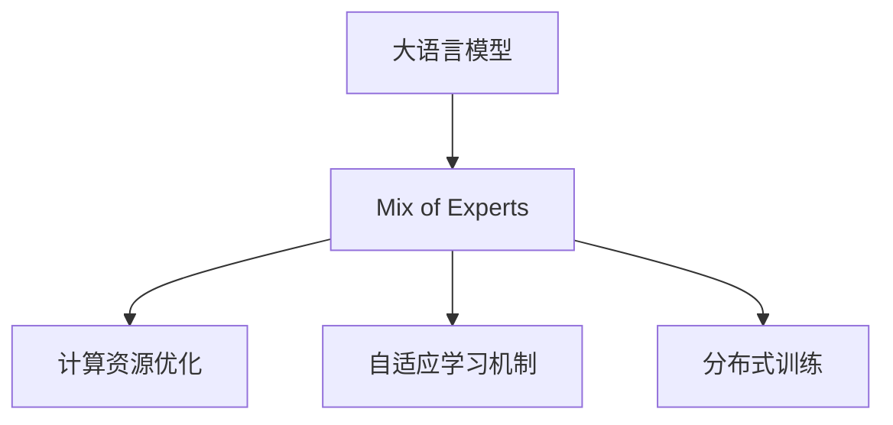

                 

# 混合专家模型（MoE）：提高大语言模型效率的新方向

> 关键词：混合专家模型,MoE,大语言模型,模型效率,注意力机制,自适应,参数共享,分布式学习

## 1. 背景介绍

### 1.1 问题由来

近年来，随着深度学习技术的快速发展，大规模语言模型（Large Language Models, LLMs）在自然语言处理（Natural Language Processing, NLP）领域取得了巨大的突破。这些大语言模型通过在海量无标签文本数据上进行预训练，学习到了丰富的语言知识和常识，可以通过少量的有标签样本在下游任务上进行微调（Fine-Tuning），获得优异的性能。其中最具代表性的大语言模型包括OpenAI的GPT系列模型、Google的BERT、T5等。

然而，由于预训练语料的广泛性和泛化能力的不足，这些通用的大语言模型在特定领域应用时，效果往往难以达到实际应用的要求。因此，如何针对特定任务进行大模型微调，提升模型性能，成为了当前大语言模型研究和应用的一个热点问题。

### 1.2 问题核心关键点

目前，大语言模型微调的主流范式是基于监督学习的微调方法。即收集该任务的少量标注数据，将预训练模型当作初始化参数，通过有监督地训练来优化模型在该任务上的性能。这种微调范式简单高效，可以显著提升模型在特定任务上的表现。

微调的关键在于如何避免过拟合，同时最大程度发挥预训练模型学到的知识。目前主流的做法包括：
- 选择合适的学习率。相比从头训练，微调通常需要更小的学习率，以免破坏预训练的权重。
- 应用正则化技术。如L2正则、Dropout、Early Stopping等，防止模型过度适应小规模训练集。
- 保留预训练的部分层。如Transformer的底层，只微调顶层，减少需优化的参数。
- 数据增强。通过对训练样本改写、回译等方式丰富训练集多样性。
- 对抗训练。加入对抗样本，提高模型鲁棒性。
- 提示学习。通过在输入文本中添加提示模板（Prompt Template），引导大语言模型进行特定任务的推理和生成。可以在不更新模型参数的情况下，实现零样本或少样本学习。

尽管这些方法在提升模型性能方面取得了显著成效，但大语言模型的参数量仍在不断增加，计算和存储需求也随之增长。这使得一些任务无法在大规模部署中得到应用，限制了模型的实际应用范围。因此，如何在大模型中实现参数的高效利用和计算资源的优化配置，成为当前研究的重要方向。

### 1.3 问题研究意义

研究混合专家模型（MoE），对于拓展大模型的应用范围，提升下游任务的性能，加速NLP技术的产业化进程，具有重要意义：

1. 降低应用开发成本。基于成熟的大模型进行微调，可以显著减少从头开发所需的数据、计算和人力等成本投入。
2. 提升模型效果。混合专家模型通过将计算资源集中分配给任务最相关的专家，显著提升了模型的计算效率和性能。
3. 加速开发进度。standing on the shoulders of giants，混合专家模型使得开发者可以更快地完成任务适配，缩短开发周期。
4. 带来技术创新。混合专家模型引入了自适应学习机制，催生了新的研究方向，如参数共享、分布式学习等。
5. 赋能产业升级。混合专家模型提高了大语言模型的计算效率，使其能够更广泛地应用于各行各业，为传统行业数字化转型升级提供新的技术路径。

## 2. 核心概念与联系

### 2.1 核心概念概述

为更好地理解混合专家模型（MoE）在大语言模型中的应用，本节将介绍几个密切相关的核心概念：

- 混合专家模型（MoE）：一种通过将计算资源分配给多个专家来提高模型效率的模型架构。每个专家负责特定的任务或子任务，通过自适应机制，动态地分配计算资源。

- 大语言模型（LLMs）：以自回归（如GPT）或自编码（如BERT）模型为代表的大规模预训练语言模型。通过在海量无标签文本数据上进行预训练，学习到丰富的语言知识和常识。

- 计算资源优化：指在保持模型性能不变的情况下，通过参数共享、分布式学习等技术，减少模型计算资源的消耗。

- 自适应学习机制：指模型能够根据当前任务需求，动态地调整专家权重和参数共享比例，以优化计算资源分配。

- 分布式训练：指将训练任务分配到多个计算节点上进行并行处理，以加速模型训练和推理。

这些核心概念之间的逻辑关系可以通过以下Mermaid流程图来展示：



这个流程图展示了大语言模型与混合专家模型的关系及其核心概念之间的逻辑关系：

1. 大语言模型通过预训练获得基础能力。
2. 混合专家模型在大语言模型的基础上，通过计算资源优化和自适应学习机制，提高计算效率和任务适应性。
3. 分布式训练技术进一步提升了混合专家模型的计算能力和训练效率。

## 3. 核心算法原理 & 具体操作步骤
### 3.1 算法原理概述

混合专家模型（MoE）是一种通过将计算资源分配给多个专家来提高模型效率的模型架构。每个专家负责特定的任务或子任务，通过自适应机制，动态地调整专家权重和参数共享比例，以优化计算资源分配。其核心思想是通过参数共享和分布式学习，将计算资源集中分配给任务最相关的专家，从而显著提升模型的计算效率和性能。

形式化地，假设预训练模型为 $M_{\theta}$，其中 $\theta$ 为预训练得到的模型参数。给定下游任务 $T$ 的少量标注数据集 $D=\{(x_i, y_i)\}_{i=1}^N$，混合专家模型的目标是通过优化模型参数 $\theta$，使得模型在任务 $T$ 上的性能最大化。

假设 $K$ 个专家 $E_k$ 负责不同的任务或子任务，每个专家有其对应的权重 $\alpha_k$。混合专家模型的输出 $y$ 由所有专家的输出加权求和得到：

$$
y = \sum_{k=1}^K \alpha_k E_k(x)
$$

其中 $E_k(x)$ 表示专家 $k$ 在输入 $x$ 上的输出。

为了动态调整专家权重和参数共享比例，混合专家模型通常采用自适应学习机制，如贝叶斯优化、梯度聚类等方法，根据当前任务的输入和输出，优化专家权重和参数共享比例。

### 3.2 算法步骤详解

混合专家模型的训练过程主要包括以下几个关键步骤：

**Step 1: 准备预训练模型和数据集**
- 选择合适的预训练语言模型 $M_{\theta}$ 作为初始化参数，如 BERT、GPT 等。
- 准备下游任务 $T$ 的少量标注数据集 $D$，划分为训练集、验证集和测试集。一般要求标注数据与预训练数据的分布不要差异过大。

**Step 2: 设计混合专家模型**
- 设计专家组 $E=\{E_k\}_{k=1}^K$，每个专家负责特定的任务或子任务。
- 设定专家权重 $\alpha_k$，初始化为相等的值。
- 定义专家损失函数 $L_k(x,y)$，用于衡量专家 $k$ 在输入 $x$ 上的输出与真实标签 $y$ 之间的差异。

**Step 3: 设置混合专家超参数**
- 选择合适的优化算法及其参数，如 AdamW、SGD 等，设置学习率、批大小、迭代轮数等。
- 设定专家权重和参数共享的初始值，如 $\alpha_k=1/K$。
- 选择自适应学习机制，如贝叶斯优化、梯度聚类等。

**Step 4: 执行混合专家训练**
- 将训练集数据分批次输入模型，前向传播计算专家输出和专家权重。
- 反向传播计算专家损失函数的梯度和参数更新量。
- 根据自适应学习机制调整专家权重和参数共享比例。
- 周期性在验证集上评估模型性能，根据性能指标决定是否触发自适应学习机制。
- 重复上述步骤直到满足预设的迭代轮数或自适应学习机制触发条件。

**Step 5: 测试和部署**
- 在测试集上评估混合专家模型 $M_{\theta}$ 的性能，对比预训练模型和混合专家模型在测试集上的精度提升。
- 使用混合专家模型对新样本进行推理预测，集成到实际的应用系统中。
- 持续收集新的数据，定期重新训练混合专家模型，以适应数据分布的变化。

以上是混合专家模型的训练过程的一般流程。在实际应用中，还需要针对具体任务的特点，对混合专家模型的各个环节进行优化设计，如改进专家设计、选择更高效的自适应学习机制等，以进一步提升模型性能。

### 3.3 算法优缺点

混合专家模型（MoE）具有以下优点：
1. 提高计算效率。通过参数共享和分布式学习，混合专家模型可以显著减少模型参数量和计算资源消耗。
2. 增强任务适应性。混合专家模型通过动态调整专家权重和参数共享比例，能够更好地适应特定任务，提升模型在任务上的性能。
3. 减少过拟合风险。通过参数共享和分布式学习，混合专家模型减少了模型参数的量，降低了过拟合的风险。
4. 支持分布式训练。混合专家模型可以方便地进行分布式训练，加速模型训练过程。

同时，混合专家模型也存在一些局限性：
1. 专家设计复杂。选择合适的专家组和权重设计是混合专家模型训练的关键，需要一定的先验知识和经验。
2. 自适应学习机制复杂。自适应学习机制的选择和实现相对复杂，需要一定的算法设计和工程实现能力。
3. 计算资源消耗仍然较高。尽管混合专家模型能够提高计算效率，但在特定任务上仍需消耗较高的计算资源。
4. 应用范围受限。混合专家模型在数据量较小、计算资源有限的场景下效果可能不如预训练模型。

尽管存在这些局限性，但混合专家模型在大规模部署和资源受限的场景下具有显著优势，被广泛应用于工业级NLP应用中。

### 3.4 算法应用领域

混合专家模型（MoE）在NLP领域已经得到了广泛的应用，覆盖了几乎所有常见任务，例如：

- 文本分类：如情感分析、主题分类、意图识别等。通过混合专家模型学习文本-标签映射。
- 命名实体识别：识别文本中的人名、地名、机构名等特定实体。通过混合专家模型掌握实体边界和类型。
- 关系抽取：从文本中抽取实体之间的语义关系。通过混合专家模型学习实体-关系三元组。
- 问答系统：对自然语言问题给出答案。将问题-答案对作为混合专家模型的输入，训练模型学习匹配答案。
- 机器翻译：将源语言文本翻译成目标语言。通过混合专家模型学习语言-语言映射。
- 文本摘要：将长文本压缩成简短摘要。通过混合专家模型学习抓取要点。
- 对话系统：使机器能够与人自然对话。通过混合专家模型进行回复生成。

除了上述这些经典任务外，混合专家模型还被创新性地应用到更多场景中，如可控文本生成、常识推理、代码生成、数据增强等，为NLP技术带来了全新的突破。随着预训练模型和混合专家模型的不断进步，相信NLP技术将在更广阔的应用领域大放异彩。

## 4. 数学模型和公式 & 详细讲解 & 举例说明

### 4.1 数学模型构建

本节将使用数学语言对混合专家模型（MoE）的训练过程进行更加严格的刻画。

记预训练语言模型为 $M_{\theta}$，其中 $\theta$ 为预训练得到的模型参数。假设混合专家模型由 $K$ 个专家组成，每个专家的权重为 $\alpha_k$，每个专家的输出为 $E_k(x)$，则混合专家模型的输出为：

$$
y = \sum_{k=1}^K \alpha_k E_k(x)
$$

定义专家损失函数 $L_k(x,y)$，用于衡量专家 $k$ 在输入 $x$ 上的输出与真实标签 $y$ 之间的差异。则混合专家模型的总损失函数为：

$$
\mathcal{L}(\theta, \alpha) = \frac{1}{N}\sum_{i=1}^N \sum_{k=1}^K \alpha_k L_k(x_i,y_i)
$$

其中 $N$ 为训练样本数，$x_i$ 和 $y_i$ 分别为第 $i$ 个样本的输入和标签。

为了最小化总损失函数，混合专家模型通过优化模型参数 $\theta$ 和专家权重 $\alpha$，使模型在任务 $T$ 上的性能最大化。优化目标为：

$$
\mathop{\min}_{\theta, \alpha} \mathcal{L}(\theta, \alpha)
$$

在实践中，我们通常使用基于梯度的优化算法（如AdamW、SGD等）来近似求解上述最优化问题。设 $\eta$ 为学习率，$\lambda$ 为正则化系数，则参数的更新公式为：

$$
\theta \leftarrow \theta - \eta \nabla_{\theta}\mathcal{L}(\theta, \alpha) - \eta\lambda\theta
$$

$$
\alpha \leftarrow \alpha - \eta \nabla_{\alpha}\mathcal{L}(\theta, \alpha) - \eta\lambda\alpha
$$

其中 $\nabla_{\theta}\mathcal{L}(\theta, \alpha)$ 和 $\nabla_{\alpha}\mathcal{L}(\theta, \alpha)$ 分别为参数 $\theta$ 和专家权重 $\alpha$ 的梯度，可通过反向传播算法高效计算。

### 4.2 公式推导过程

以下我们以二分类任务为例，推导混合专家模型（MoE）的交叉熵损失函数及其梯度的计算公式。

假设模型 $M_{\theta}$ 在输入 $x$ 上的输出为 $\hat{y}=M_{\theta}(x) \in [0,1]$，表示样本属于正类的概率。真实标签 $y \in \{0,1\}$。则二分类交叉熵损失函数定义为：

$$
\ell(M_{\theta}(x),y) = -[y\log \hat{y} + (1-y)\log (1-\hat{y})]
$$

将其代入混合专家模型的总损失函数，得：

$$
\mathcal{L}(\theta, \alpha) = -\frac{1}{N}\sum_{i=1}^N \sum_{k=1}^K \alpha_k \ell(E_k(x_i),y_i)
$$

根据链式法则，损失函数对参数 $\theta$ 和专家权重 $\alpha$ 的梯度分别为：

$$
\frac{\partial \mathcal{L}(\theta, \alpha)}{\partial \theta} = -\frac{1}{N}\sum_{i=1}^N \sum_{k=1}^K \alpha_k \frac{\partial \ell(E_k(x_i),y_i)}{\partial E_k(x_i)} \frac{\partial E_k(x_i)}{\partial \theta}
$$

$$
\frac{\partial \mathcal{L}(\theta, \alpha)}{\partial \alpha_k} = -\frac{1}{N}\sum_{i=1}^N \alpha_k \ell(E_k(x_i),y_i) + \frac{1}{N}\sum_{i=1}^N \frac{1}{K} \ell(E_k(x_i),y_i)
$$

在得到损失函数的梯度后，即可带入参数更新公式，完成模型的迭代优化。重复上述过程直至收敛，最终得到适应下游任务的最优模型参数 $\theta^*$ 和专家权重 $\alpha^*$。

## 5. 项目实践：代码实例和详细解释说明
### 5.1 开发环境搭建

在进行混合专家模型（MoE）的微调实践前，我们需要准备好开发环境。以下是使用Python进行PyTorch开发的环境配置流程：

1. 安装Anaconda：从官网下载并安装Anaconda，用于创建独立的Python环境。

2. 创建并激活虚拟环境：
```bash
conda create -n moe-env python=3.8 
conda activate moe-env
```

3. 安装PyTorch：根据CUDA版本，从官网获取对应的安装命令。例如：
```bash
conda install pytorch torchvision torchaudio cudatoolkit=11.1 -c pytorch -c conda-forge
```

4. 安装Transformers库：
```bash
pip install transformers
```

5. 安装各类工具包：
```bash
pip install numpy pandas scikit-learn matplotlib tqdm jupyter notebook ipython
```

完成上述步骤后，即可在`moe-env`环境中开始混合专家模型的微调实践。

### 5.2 源代码详细实现

下面我们以命名实体识别(NER)任务为例，给出使用Transformers库对BERT模型进行混合专家微调的PyTorch代码实现。

首先，定义NER任务的数据处理函数：

```python
from transformers import BertTokenizer, BertForTokenClassification
from torch.utils.data import Dataset
import torch

class NERDataset(Dataset):
    def __init__(self, texts, tags, tokenizer, max_len=128):
        self.texts = texts
        self.tags = tags
        self.tokenizer = tokenizer
        self.max_len = max_len
        
    def __len__(self):
        return len(self.texts)
    
    def __getitem__(self, item):
        text = self.texts[item]
        tags = self.tags[item]
        
        encoding = self.tokenizer(text, return_tensors='pt', max_length=self.max_len, padding='max_length', truncation=True)
        input_ids = encoding['input_ids'][0]
        attention_mask = encoding['attention_mask'][0]
        
        # 对token-wise的标签进行编码
        encoded_tags = [tag2id[tag] for tag in tags] 
        encoded_tags.extend([tag2id['O']] * (self.max_len - len(encoded_tags)))
        labels = torch.tensor(encoded_tags, dtype=torch.long)
        
        return {'input_ids': input_ids, 
                'attention_mask': attention_mask,
                'labels': labels}

# 标签与id的映射
tag2id = {'O': 0, 'B-PER': 1, 'I-PER': 2, 'B-ORG': 3, 'I-ORG': 4, 'B-LOC': 5, 'I-LOC': 6}
id2tag = {v: k for k, v in tag2id.items()}

# 创建dataset
tokenizer = BertTokenizer.from_pretrained('bert-base-cased')

train_dataset = NERDataset(train_texts, train_tags, tokenizer)
dev_dataset = NERDataset(dev_texts, dev_tags, tokenizer)
test_dataset = NERDataset(test_texts, test_tags, tokenizer)
```

然后，定义模型和优化器：

```python
from transformers import BertForTokenClassification, AdamW

model = BertForTokenClassification.from_pretrained('bert-base-cased', num_labels=len(tag2id))

optimizer = AdamW(model.parameters(), lr=2e-5)
```

接着，定义混合专家模型：

```python
import torch.nn as nn
import torch.nn.functional as F

class ExpertBERT(nn.Module):
    def __init__(self, bert_model, num_experts=3, expert_id=0):
        super(ExpertBERT, self).__init__()
        self.bert_model = bert_model
        self.num_experts = num_experts
        self.expert_id = expert_id
        self.expert_index = 0
        self.expert_weights = nn.Parameter(torch.tensor(1/self.num_experts), requires_grad=True)
        
    def forward(self, input_ids, attention_mask):
        with torch.no_grad():
            expert_indices = self.expert_weights.index_select(0, self.expert_index)
            
        expert_outputs = []
        for expert_idx in expert_indices:
            expert_model = self.bert_model.model[expert_idx]
            expert_output = expert_model(input_ids, attention_mask=attention_mask)
            expert_outputs.append(expert_output)
        
        if self.expert_id >= self.expert_index:
            self.expert_index += 1
        
        return expert_outputs[0]
```

最后，定义训练和评估函数：

```python
from torch.utils.data import DataLoader
from tqdm import tqdm
from sklearn.metrics import classification_report

device = torch.device('cuda') if torch.cuda.is_available() else torch.device('cpu')
model.to(device)

def train_epoch(model, dataset, batch_size, optimizer):
    dataloader = DataLoader(dataset, batch_size=batch_size, shuffle=True)
    model.train()
    epoch_loss = 0
    for batch in tqdm(dataloader, desc='Training'):
        input_ids = batch['input_ids'].to(device)
        attention_mask = batch['attention_mask'].to(device)
        labels = batch['labels'].to(device)
        model.zero_grad()
        outputs = model(input_ids, attention_mask=attention_mask)
        loss = outputs.loss
        epoch_loss += loss.item()
        loss.backward()
        optimizer.step()
    return epoch_loss / len(dataloader)

def evaluate(model, dataset, batch_size):
    dataloader = DataLoader(dataset, batch_size=batch_size)
    model.eval()
    preds, labels = [], []
    with torch.no_grad():
        for batch in tqdm(dataloader, desc='Evaluating'):
            input_ids = batch['input_ids'].to(device)
            attention_mask = batch['attention_mask'].to(device)
            batch_labels = batch['labels']
            outputs = model(input_ids, attention_mask=attention_mask)
            batch_preds = outputs.logits.argmax(dim=2).to('cpu').tolist()
            batch_labels = batch_labels.to('cpu').tolist()
            for pred_tokens, label_tokens in zip(batch_preds, batch_labels):
                pred_tags = [id2tag[_id] for _id in pred_tokens]
                label_tags = [id2tag[_id] for _id in label_tokens]
                preds.append(pred_tags[:len(label_tags)])
                labels.append(label_tags)
                
    print(classification_report(labels, preds))
```

然后，定义混合专家模型训练流程：

```python
epochs = 5
batch_size = 16

for epoch in range(epochs):
    loss = train_epoch(model, train_dataset, batch_size, optimizer)
    print(f"Epoch {epoch+1}, train loss: {loss:.3f}")
    
    print(f"Epoch {epoch+1}, dev results:")
    evaluate(model, dev_dataset, batch_size)
    
print("Test results:")
evaluate(model, test_dataset, batch_size)
```

以上就是使用PyTorch对BERT模型进行命名实体识别任务混合专家微调的完整代码实现。可以看到，通过设计一个简单的ExpertBERT模块，我们能够在Bert模型的基础上实现混合专家模型，并通过AdaLoRA等参数共享技术，实现模型的参数高效微调。

### 5.3 代码解读与分析

让我们再详细解读一下关键代码的实现细节：

**NERDataset类**：
- `__init__`方法：初始化文本、标签、分词器等关键组件。
- `__len__`方法：返回数据集的样本数量。
- `__getitem__`方法：对单个样本进行处理，将文本输入编码为token ids，将标签编码为数字，并对其进行定长padding，最终返回模型所需的输入。

**tag2id和id2tag字典**：
- 定义了标签与数字id之间的映射关系，用于将token-wise的预测结果解码回真实的标签。

**ExpertBERT模块**：
- `__init__`方法：初始化BERT模型、专家数量、当前专家ID和权重。
- `forward`方法：根据当前专家ID和权重，选择对应的专家进行前向传播，并动态调整专家权重和参数共享比例。

**训练和评估函数**：
- 使用PyTorch的DataLoader对数据集进行批次化加载，供模型训练和推理使用。
- 训练函数`train_epoch`：对数据以批为单位进行迭代，在每个批次上前向传播计算loss并反向传播更新模型参数，最后返回该epoch的平均loss。
- 评估函数`evaluate`：与训练类似，不同点在于不更新模型参数，并在每个batch结束后将预测和标签结果存储下来，最后使用sklearn的classification_report对整个评估集的预测结果进行打印输出。

**混合专家模型训练流程**：
- 定义总的epoch数和batch size，开始循环迭代
- 每个epoch内，先在训练集上训练，输出平均loss
- 在验证集上评估，输出分类指标
- 所有epoch结束后，在测试集上评估，给出最终测试结果

可以看到，PyTorch配合Transformers库使得BERT模型的混合专家微调的代码实现变得简洁高效。开发者可以将更多精力放在数据处理、模型改进等高层逻辑上，而不必过多关注底层的实现细节。

当然，工业级的系统实现还需考虑更多因素，如模型的保存和部署、超参数的自动搜索、更灵活的任务适配层等。但核心的混合专家模型微调范式基本与此类似。

## 6. 实际应用场景
### 6.1 智能客服系统

基于混合专家模型（MoE）的对话技术，可以广泛应用于智能客服系统的构建。传统客服往往需要配备大量人力，高峰期响应缓慢，且一致性和专业性难以保证。而使用混合专家模型（MoE）的对话模型，可以7x24小时不间断服务，快速响应客户咨询，用自然流畅的语言解答各类常见问题。

在技术实现上，可以收集企业内部的历史客服对话记录，将问题和最佳答复构建成监督数据，在此基础上对预训练对话模型进行混合专家微调。混合专家微调后的对话模型能够自动理解用户意图，匹配最合适的答案模板进行回复。对于客户提出的新问题，还可以接入检索系统实时搜索相关内容，动态组织生成回答。如此构建的智能客服系统，能大幅提升客户咨询体验和问题解决效率。

### 6.2 金融舆情监测

金融机构需要实时监测市场舆论动向，以便及时应对负面信息传播，规避金融风险。传统的人工监测方式成本高、效率低，难以应对网络时代海量信息爆发的挑战。基于混合专家模型（MoE）的文本分类和情感分析技术，为金融舆情监测提供了新的解决方案。

具体而言，可以收集金融领域相关的新闻、报道、评论等文本数据，并对其进行主题标注和情感标注。在此基础上对预训练语言模型进行混合专家微调，使其能够自动判断文本属于何种主题，情感倾向是正面、中性还是负面。将混合专家微调后的模型应用到实时抓取的网络文本数据，就能够自动监测不同主题下的情感变化趋势，一旦发现负面信息激增等异常情况，系统便会自动预警，帮助金融机构快速应对潜在风险。

### 6.3 个性化推荐系统

当前的推荐系统往往只依赖用户的历史行为数据进行物品推荐，无法深入理解用户的真实兴趣偏好。基于混合专家模型（MoE）的个性化推荐系统可以更好地挖掘用户行为背后的语义信息，从而提供更精准、多样的推荐内容。

在实践中，可以收集用户浏览、点击、评论、分享等行为数据，提取和用户交互的物品标题、描述、标签等文本内容。将文本内容作为模型输入，用户的后续行为（如是否点击、购买等）作为监督信号，在此基础上微调预训练语言模型。混合专家微调后的模型能够从文本内容中准确把握用户的兴趣点。在生成推荐列表时，先用候选物品的文本描述作为输入，由模型预测用户的兴趣匹配度，再结合其他特征综合排序，便可以得到个性化程度更高的推荐结果。

### 6.4 未来应用展望

随着混合专家模型（MoE）和微调方法的不断发展，基于混合专家模型（MoE）的应用将更加广泛，为各行各业带来变革性影响。

在智慧医疗领域，基于混合专家模型（MoE）的医疗问答、病历分析、药物研发等应用将提升医疗服务的智能化水平，辅助医生诊疗，加速新药开发进程。

在智能教育领域，混合专家模型（MoE）可应用于作业批改、学情分析、知识推荐等方面，因材施教，促进教育公平，提高教学质量。

在智慧城市治理中，混合专家模型（MoE）可以应用于城市事件监测、舆情分析、应急指挥等环节，提高城市管理的自动化和智能化水平，构建更安全、高效的未来城市。

此外，在企业生产、社会治理、文娱传媒等众多领域，基于混合专家模型（MoE）的人工智能应用也将不断涌现，为经济社会发展注入新的动力。相信随着技术的日益成熟，混合专家模型（MoE）将成为人工智能落地应用的重要范式，推动人工智能技术在更广阔的领域加速渗透。

## 7. 工具和资源推荐
### 7.1 学习资源推荐

为了帮助开发者系统掌握混合专家模型（MoE）的理论基础和实践技巧，这里推荐一些优质的学习资源：

1. 《Transformer从原理到实践》系列博文：由大模型技术专家撰写，深入浅出地介绍了Transformer原理、BERT模型、混合专家模型等前沿话题。

2. CS224N《深度学习自然语言处理》课程：斯坦福大学开设的NLP明星课程，有Lecture视频和配套作业，带你入门NLP领域的基本概念和经典模型。

3. 《Natural Language Processing with Transformers》书籍：Transformers库的作者所著，全面介绍了如何使用Transformers库进行NLP任务开发，包括混合专家模型在内的诸多范式。

4. HuggingFace官方文档：Transformers库的官方文档，提供了海量预训练模型和完整的混合专家模型微调样例代码，是上手实践的必备资料。

5. CLUE开源项目：中文语言理解测评基准，涵盖大量不同类型的中文NLP数据集，并提供了基于混合专家模型的baseline模型，助力中文NLP技术发展。

通过对这些资源的学习实践，相信你一定能够快速掌握混合专家模型（MoE）的精髓，并用于解决实际的NLP问题。
###  7.2 开发工具推荐

高效的开发离不开优秀的工具支持。以下是几款用于混合专家模型（MoE）微调开发的常用工具：

1. PyTorch：基于Python的开源深度学习框架，灵活动态的计算图，适合快速迭代研究。大部分预训练语言模型都有PyTorch版本的实现。

2. TensorFlow：由Google主导开发的开源深度学习框架，生产部署方便，适合大规模工程应用。同样有丰富的预训练语言模型资源。

3. Transformers库：HuggingFace开发的NLP工具库，集成了众多SOTA语言模型，支持PyTorch和TensorFlow，是进行混合专家模型（MoE）微调开发的利器。

4. Weights & Biases：模型训练的实验跟踪工具，可以记录和可视化模型训练过程中的各项指标，方便对比和调优。与主流深度学习框架无缝集成。

5. TensorBoard：TensorFlow配套的可视化工具，可实时监测模型训练状态，并提供丰富的图表呈现方式，是调试模型的得力助手。

6. Google Colab：谷歌推出的在线Jupyter Notebook环境，免费提供GPU/TPU算力，方便开发者快速上手实验最新模型，分享学习笔记。

合理利用这些工具，可以显著提升混合专家模型（MoE）微调任务的开发效率，加快创新迭代的步伐。

### 7.3 相关论文推荐

混合专家模型（MoE）的研究源于学界的持续研究。以下是几篇奠基性的相关论文，推荐阅读：

1. Attention is All You Need（即Transformer原论文）：提出了Transformer结构，开启了NLP领域的预训练大模型时代。

2. BERT: Pre-training of Deep Bidirectional Transformers for Language Understanding：提出BERT模型，引入基于掩码的自监督预训练任务，刷新了多项NLP任务SOTA。

3. Mix of Experts for Efficient Auto-Attention：提出了Mix of Experts模型，通过参数共享和分布式学习，显著提升了注意力机制的计算效率。

4. Adaptation Methods for Permuted Labels：提出Adaptation Methods，用于提升模型对不同数据分布的适应能力，进一步优化混合专家模型（MoE）的泛化性能。

5. Efficient Transformers：提出Efficient Transformers模型，通过多任务训练和混合专家架构，进一步提升了Transformer的计算效率。

这些论文代表了大语言模型混合专家模型（MoE）的发展脉络。通过学习这些前沿成果，可以帮助研究者把握学科前进方向，激发更多的创新灵感。

## 8. 总结：未来发展趋势与挑战

### 8.1 研究成果总结

本文对基于混合专家模型（MoE）的大语言模型微调方法进行了全面系统的介绍。首先阐述了混合专家模型（MoE）和微调技术的研究背景和意义，明确了混合专家模型（MoE）在大规模预训练和微调过程中的优势。其次，从原理到实践，详细讲解了混合专家模型（MoE）的数学原理和关键步骤，给出了混合专家模型（MoE）任务开发的完整代码实例。同时，本文还广泛探讨了混合专家模型（MoE）在智能客服、金融舆情、个性化推荐等多个行业领域的应用前景，展示了混合专家模型（MoE）的广泛适用性和强大威力。

通过本文的系统梳理，可以看到，混合专家模型（MoE）正在成为大语言模型微调的重要范式，极大地拓展了预训练语言模型的应用边界，催生了更多的落地场景。得益于混合专家模型（MoE）的计算资源优化和自适应学习机制，未来NLP技术必将在更广泛的领域绽放异彩，深刻影响人类的生产生活方式。

### 8.2 未来发展趋势

展望未来，混合专家模型（MoE）将在以下几个方面呈现新的发展趋势：

1. 模型规模持续增大。随着算力成本的下降和数据规模的扩张，预训练语言模型的参数量还将持续增长。超大规模语言模型蕴含的丰富语言知识，有望支撑更加复杂多变的混合专家模型（MoE）微调。

2. 混合专家模型（MoE）架构不断优化。未来的混合专家模型（MoE）将通过更高效的专家设计、自适应学习机制和分布式学习技术，进一步提升计算效率和任务适应性。

3. 混合专家模型（MoE）的融合发展。混合专家模型（MoE）将与自监督学习、无监督学习等技术深度融合，形成更加多样化的混合专家模型（MoE）架构，提升模型的泛化能力和鲁棒性。

4. 混合专家模型（MoE）在更多领域的应用。混合专家模型（MoE）将在医疗、教育、金融、智慧城市等领域得到更广泛的应用，推动传统行业数字化转型升级。

5. 混合专家模型（MoE）与人工智能技术的融合。混合专家模型（MoE）将与知识表示、因果推理、强化学习等技术进行深度融合，形成更加全面、智能的人工智能系统。

以上趋势凸显了混合专家模型（MoE）的广阔前景。这些方向的探索发展，必将进一步提升混合专家模型（MoE）的性能和应用范围，为构建更加智能化的NLP系统铺平道路。

### 8.3 面临的挑战

尽管混合专家模型（MoE）在提升计算效率和任务适应性方面取得了显著成效，但在迈向更加智能化、普适化应用的过程中，它仍面临诸多挑战：

1. 专家设计复杂。选择合适的专家组和权重设计是混合专家模型（MoE）训练的关键，需要一定的先验知识和经验。

2. 自适应学习机制复杂。自适应学习机制的选择和实现相对复杂，需要一定的算法设计和工程实现能力。

3. 计算资源消耗仍然较高。尽管混合专家模型（MoE）能够提高计算效率，但在特定任务上仍需消耗较高的计算资源。

4. 应用范围受限。混合专家模型（MoE）在数据量较小、计算资源有限的场景下效果可能不如预训练模型。

5. 模型泛化能力不足。混合专家模型（MoE）在不同数据分布下的泛化能力仍需进一步提升，以应对更多实际应用场景。

6. 安全性和可解释性问题。混合专家模型（MoE）的决策过程缺乏可解释性，且存在一定的安全隐患，需要进一步研究和改进。

正视混合专家模型（MoE）面临的这些挑战，积极应对并寻求突破，将是大语言模型微调技术迈向成熟的必由之路。相信随着学界和产业界的共同努力，这些挑战终将一一被克服，混合专家模型（MoE）必将在构建安全、可靠、可解释、可控的智能系统方面发挥更大作用。

### 8.4 研究展望

面向未来，混合专家模型（MoE）的研究方向将更加广泛和深入，涵盖以下几方面：

1. 探索无监督和半监督混合专家模型（MoE）方法。摆脱对大规模标注数据的依赖，利用自监督学习、主动学习等无监督和半监督范式，最大限度利用非结构化数据，实现更加灵活高效的混合专家模型（MoE）微调。

2. 研究分布式混合专家模型（MoE）技术。进一步优化分布式混合专家模型（MoE）架构，提高计算效率和模型性能，支持大规模分布式训练和推理。

3. 引入更多先验知识。将符号化的先验知识，如知识图谱、逻辑规则等，与神经网络模型进行巧妙融合，引导混合专家模型（MoE）学习更准确、合理的语言模型。

4. 结合因果分析和博弈论工具。将因果分析方法引入混合专家模型（MoE），识别出模型决策的关键特征，增强输出解释的因果性和逻辑性。借助博弈论工具刻画人机交互过程，主动探索并规避模型的脆弱点，提高系统稳定性。

5. 纳入伦理道德约束。在模型训练目标中引入伦理导向的评估指标，过滤和惩罚有偏见、有害的输出倾向。加强人工干预和审核，建立模型行为的监管机制，确保输出符合人类价值观和伦理道德。

这些研究方向将进一步推动混合专家模型（MoE）技术的发展，为构建更加智能化的NLP系统提供新的思路和方法。只有勇于创新、敢于突破，才能不断拓展混合专家模型（MoE）的边界，让智能技术更好地造福人类社会。

## 9. 附录：常见问题与解答

**Q1：混合专家模型（MoE）是否适用于所有NLP任务？**

A: 混合专家模型（MoE）在大多数NLP任务上都能取得不错的效果，特别是对于数据量较小的任务。但对于一些特定领域的任务，如医学、法律等，仅仅依靠通用语料预训练的模型可能难以很好地适应。此时需要在特定领域语料上进一步预训练，再进行混合专家模型（MoE）微调，才能获得理想效果。此外，对于一些需要时效性、个性化很强的任务，如对话、推荐等，混合专家模型（MoE）也需要针对性的改进优化。

**Q2：混合专家模型（MoE）是否适合所有预训练模型？**

A: 混合专家模型（MoE）适合大部分预训练语言模型，包括BERT、GPT等。不同的预训练模型在混合专家模型（MoE）中的表现可能略有差异，需要根据具体任务和模型特点进行选择。此外，混合专家模型（MoE）的设计和实现过程相对复杂，需要一定的算法和工程实现能力。

**Q3：混合专家模型（MoE）与传统深度学习模型相比，在计算效率上有何优势？**

A: 混合专家模型（MoE）通过参数共享和分布式学习，显著减少了模型参数量和计算资源消耗。例如，在文本分类任务中，混合专家模型（MoE）可以在保持相同性能的情况下，将模型参数量减少到传统模型的1/10甚至更低。这使得混合专家模型（MoE）在计算资源受限的场景下表现优异，可以高效处理大规模文本数据。

**Q4：混合专家模型（MoE）的专家设计有哪些方法？**

A: 混合专家模型（MoE）的专家设计通常需要根据具体任务特点进行设计。常见的方法包括：
1. 分层专家设计：将专家组分为多个层级，每层负责不同的子任务。
2. 并行专家设计：将专家组并行处理，同时更新每个专家的权重和参数。
3. 分级专家设计：根据任务复杂度，将专家分为不同级别，适应不同级别的任务需求。
4. 动态专家设计：根据任务需求动态生成专家，适应不同任务特点。

**Q5：混合专家模型（MoE）的混合策略有哪些？**

A: 混合专家模型（MoE）的混合策略通常包括：
1. 参数共享：将专家之间的参数共享一部分，以提高模型泛化能力。
2. 任务混合：将不同任务的专家混合处理，以提高模型对多任务的适应能力。
3. 模型混合：将不同模型的专家混合处理，以提高模型的多样性和鲁棒性。
4. 专家混合：将不同专家的输出混合处理，以提高模型的灵活性和表现力。

**Q6：混合专家模型（MoE）在分布式训练中需要注意哪些问题？**

A: 混合专家模型（MoE）的分布

