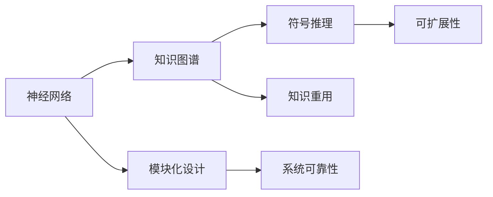

                 

# 混合专家系统：AI的模块化与可扩展性

> 关键词：混合专家系统,模块化设计,可扩展性,知识表示,AI体系结构

## 1. 背景介绍

### 1.1 问题由来

随着人工智能（AI）技术的快速发展，越来越多的AI系统被应用于各个行业和领域。然而，由于AI系统的复杂性和多样性，单一的AI架构往往无法满足实际应用的需求。为应对这种多样性和复杂性，研究人员和工程师提出了各种AI体系结构，如神经网络、知识图谱、符号推理等。这些架构各有优缺点，很难互相取代。因此，如何构建一个既能够兼容不同AI架构，又具有良好可扩展性的AI系统，成为当下研究的热点。

### 1.2 问题核心关键点

混合专家系统（Hybrid Expert System, HES）是一种将多种AI架构组合起来的AI体系结构。其核心思想是将神经网络、知识图谱、符号推理等不同AI技术模块化设计，根据实际应用场景选择合适的模块进行集成，构建出高效、灵活的AI系统。混合专家系统的主要优点包括：

- 模块化设计：将不同AI技术封装为独立的模块，便于根据需求进行选择和组合。
- 可扩展性：通过灵活的模块组合，可以构建出适应各种不同任务和场景的AI系统。
- 系统可靠性：通过模块化设计，可以提高系统的可靠性和稳定性。
- 知识重用：不同模块可以共享知识和经验，提升系统整体的性能。

本文将详细探讨混合专家系统的设计原理、实现步骤、应用领域，以及未来发展方向。

## 2. 核心概念与联系

### 2.1 核心概念概述

混合专家系统是一种将多种AI架构组合起来的AI体系结构。其核心概念包括：

- **神经网络**：一种模拟人脑神经元连接的机器学习算法，通过训练学习输入和输出之间的映射关系。
- **知识图谱**：一种基于图结构的知识表示方法，用于描述实体之间的关系和属性。
- **符号推理**：一种基于符号计算的推理方法，用于解决逻辑推理和问题求解等任务。
- **模块化设计**：将不同的AI技术封装为独立的模块，便于选择和组合。
- **知识重用**：不同模块可以共享知识和经验，提升系统整体的性能。

### 2.2 核心概念原理和架构的 Mermaid 流程图



这个流程图展示了混合专家系统的核心概念及其联系：

1. 神经网络、知识图谱、符号推理等不同AI技术模块化设计。
2. 通过模块化设计，系统可以灵活地进行模块组合，构建出适应各种不同任务和场景的AI系统。
3. 知识图谱和符号推理可以共享知识和经验，提升系统整体的性能。
4. 模块化设计可以提升系统的可靠性和稳定性。
5. 系统可以兼容不同AI架构，具有良好的可扩展性。

## 3. 核心算法原理 & 具体操作步骤

### 3.1 算法原理概述

混合专家系统的核心算法原理基于模块化设计和灵活组合。其核心思想是将不同AI技术封装为独立的模块，根据实际应用场景选择合适的模块进行集成，构建出高效、灵活的AI系统。

具体来说，混合专家系统通常包括以下几个关键步骤：

1. **模块选择**：根据任务需求，选择合适的AI模块，如神经网络、知识图谱、符号推理等。
2. **模块组合**：将选择的模块组合成一个完整的AI系统，实现输入和输出之间的映射。
3. **系统训练**：对整个AI系统进行训练，优化各个模块之间的参数和权重，使其能够协同工作。
4. **系统评估**：在实际应用中对系统进行评估，调整各个模块的参数和权重，提升系统性能。

### 3.2 算法步骤详解

以下是混合专家系统的主要操作步骤：

**Step 1: 模块选择**

根据任务需求，选择合适的AI模块。例如，对于问答系统，可以选择神经网络和知识图谱模块进行组合。对于自然语言处理（NLP）任务，可以选择神经网络和符号推理模块进行组合。

**Step 2: 模块组合**

将选择的模块进行组合，构建出完整的AI系统。例如，在问答系统中，可以先将输入文本通过神经网络进行特征提取，然后根据知识图谱进行推理，最终输出答案。

**Step 3: 系统训练**

对整个AI系统进行训练，优化各个模块之间的参数和权重，使其能够协同工作。通常采用监督学习、无监督学习或半监督学习等方式进行训练。

**Step 4: 系统评估**

在实际应用中对系统进行评估，调整各个模块的参数和权重，提升系统性能。通常采用测试集进行评估，根据评估结果调整模型。

### 3.3 算法优缺点

混合专家系统的主要优点包括：

- **模块化设计**：将不同AI技术封装为独立的模块，便于根据需求进行选择和组合。
- **可扩展性**：通过灵活的模块组合，可以构建出适应各种不同任务和场景的AI系统。
- **系统可靠性**：通过模块化设计，可以提高系统的可靠性和稳定性。
- **知识重用**：不同模块可以共享知识和经验，提升系统整体的性能。

同时，混合专家系统也存在一些缺点：

- **复杂度高**：系统由多个模块组成，系统设计和调试复杂度较高。
- **数据需求高**：不同模块可能需要不同的数据，系统的数据需求较高。
- **性能波动**：不同模块之间可能存在性能不匹配的问题，导致系统性能波动。

### 3.4 算法应用领域

混合专家系统在各个领域都有广泛应用，包括：

- **自然语言处理**：混合使用神经网络和符号推理模块，构建自然语言理解、文本生成等系统。
- **医疗诊断**：使用神经网络和知识图谱模块，构建医学图像识别、疾病诊断等系统。
- **智能推荐**：混合使用神经网络和知识图谱模块，构建个性化推荐系统。
- **金融分析**：使用神经网络和符号推理模块，构建金融市场分析、风险评估等系统。
- **智能控制**：使用神经网络和符号推理模块，构建智能机器人、智能家居等系统。

## 4. 数学模型和公式 & 详细讲解

### 4.1 数学模型构建

混合专家系统的主要数学模型包括神经网络、知识图谱和符号推理等。

#### 4.1.1 神经网络模型

神经网络是一种基于模拟人脑神经元连接的机器学习算法，其数学模型可以表示为：

$$
\mathbf{y} = \mathbf{W}\mathbf{x} + \mathbf{b}
$$

其中，$\mathbf{y}$ 表示输出，$\mathbf{x}$ 表示输入，$\mathbf{W}$ 表示权重矩阵，$\mathbf{b}$ 表示偏置向量。

#### 4.1.2 知识图谱模型

知识图谱是一种基于图结构的知识表示方法，其数学模型可以表示为：

$$
\mathcal{G} = (\mathcal{N}, \mathcal{E}, \mathcal{R})
$$

其中，$\mathcal{N}$ 表示节点集合，$\mathcal{E}$ 表示边集合，$\mathcal{R}$ 表示关系集合。

#### 4.1.3 符号推理模型

符号推理是一种基于符号计算的推理方法，其数学模型可以表示为：

$$
\mathbf{r} = \mathbf{f}(\mathbf{p}, \mathbf{q})
$$

其中，$\mathbf{r}$ 表示推理结果，$\mathbf{p}$ 表示前提，$\mathbf{q}$ 表示假设，$\mathbf{f}$ 表示推理函数。

### 4.2 公式推导过程

#### 4.2.1 神经网络公式推导

对于神经网络模型，其前向传播和反向传播过程可以表示为：

$$
\mathbf{y} = \mathbf{W}\mathbf{x} + \mathbf{b}
$$

$$
\mathbf{L} = \mathcal{L}(\mathbf{y}, \mathbf{t})
$$

$$
\frac{\partial \mathbf{L}}{\partial \mathbf{W}} = \mathbf{x}^\top \frac{\partial \mathcal{L}}{\partial \mathbf{y}}
$$

$$
\frac{\partial \mathbf{L}}{\partial \mathbf{b}} = \frac{\partial \mathcal{L}}{\partial \mathbf{y}}
$$

其中，$\mathbf{L}$ 表示损失函数，$\mathbf{t}$ 表示目标输出，$\mathbf{x}^\top$ 表示输入的转置，$\frac{\partial \mathcal{L}}{\partial \mathbf{y}}$ 表示损失函数对输出层的梯度，$\frac{\partial \mathcal{L}}{\partial \mathbf{y}}$ 表示损失函数对隐含层的梯度。

#### 4.2.2 知识图谱公式推导

对于知识图谱模型，其推理过程可以表示为：

$$
\mathbf{r} = \mathbf{f}(\mathbf{p}, \mathbf{q})
$$

其中，$\mathbf{r}$ 表示推理结果，$\mathbf{p}$ 表示前提，$\mathbf{q}$ 表示假设，$\mathbf{f}$ 表示推理函数。

#### 4.2.3 符号推理公式推导

对于符号推理模型，其推理过程可以表示为：

$$
\mathbf{r} = \mathbf{f}(\mathbf{p}, \mathbf{q})
$$

其中，$\mathbf{r}$ 表示推理结果，$\mathbf{p}$ 表示前提，$\mathbf{q}$ 表示假设，$\mathbf{f}$ 表示推理函数。

### 4.3 案例分析与讲解

#### 4.3.1 问答系统

问答系统是混合专家系统的一个典型应用。其核心思想是将输入文本通过神经网络进行特征提取，然后根据知识图谱进行推理，最终输出答案。

假设有一个问答系统，其输入文本为：“请问，北京到上海的火车有多长时间？”。

1. **神经网络特征提取**：将输入文本通过神经网络进行特征提取，得到向量表示 $\mathbf{x}$。
2. **知识图谱推理**：根据知识图谱中的关系，查询从北京到上海的火车时间。
3. **符号推理输出**：将推理结果进行符号化，输出答案。

#### 4.3.2 智能推荐

智能推荐是混合专家系统的另一个典型应用。其核心思想是将用户兴趣和商品属性通过神经网络进行匹配，然后根据知识图谱进行推荐。

假设有一个智能推荐系统，用户输入了兴趣描述“我喜欢电影和书籍”。

1. **神经网络特征提取**：将用户兴趣通过神经网络进行特征提取，得到向量表示 $\mathbf{x}$。
2. **知识图谱推理**：根据知识图谱中的关系，查询用户可能喜欢的电影和书籍。
3. **符号推理输出**：将推荐结果进行符号化，输出推荐结果。

## 5. 项目实践：代码实例和详细解释说明

### 5.1 开发环境搭建

#### 5.1.1 环境准备

以下是混合专家系统开发的基本环境准备：

1. **Python**：推荐使用Python 3.x版本，包括常用的科学计算库（如NumPy、Pandas等）。
2. **TensorFlow**：推荐使用TensorFlow 2.x版本，支持深度学习和符号推理。
3. **PyTorch**：推荐使用PyTorch 1.x版本，支持深度学习和神经网络。
4. **Scikit-learn**：推荐使用Scikit-learn 0.x版本，支持机器学习和符号推理。

#### 5.1.2 环境配置

以下是Python开发环境的配置：

1. **安装Python**：使用Anaconda等Python管理工具进行安装。
2. **安装相关库**：使用pip等工具安装所需的科学计算库和AI库。

```bash
pip install numpy pandas scikit-learn tensorflow pytorch
```

### 5.2 源代码详细实现

#### 5.2.1 神经网络模块实现

以下是神经网络模块的实现：

```python
import tensorflow as tf
from tensorflow.keras import layers

class NeuralNetwork:
    def __init__(self, input_size, output_size, hidden_size):
        self.input_size = input_size
        self.output_size = output_size
        self.hidden_size = hidden_size
        
        self.model = tf.keras.Sequential([
            layers.Dense(self.hidden_size, activation='relu'),
            layers.Dense(self.output_size, activation='softmax')
        ])
    
    def fit(self, x_train, y_train, epochs):
        self.model.compile(optimizer='adam', loss='categorical_crossentropy', metrics=['accuracy'])
        self.model.fit(x_train, y_train, epochs=epochs)
    
    def predict(self, x_test):
        return self.model.predict(x_test)
```

#### 5.2.2 知识图谱模块实现

以下是知识图谱模块的实现：

```python
import networkx as nx

class KnowledgeGraph:
    def __init__(self, graph):
        self.graph = graph
        
    def add_edge(self, node1, node2, relation):
        self.graph.add_edge(node1, node2, relation)
    
    def query(self, node, relation):
        return self.graph.nodes[node][relation]
    
    def remove_edge(self, node1, node2, relation):
        self.graph.remove_edge(node1, node2, relation)
```

#### 5.2.3 符号推理模块实现

以下是符号推理模块的实现：

```python
import sympy as sp

class SymbolicReasoner:
    def __init__(self):
        self.symbols = sp.symbols('x y')
    
    def apply_rule(self, rule):
        return sp.apply该功能(self.symbols, rule)
```

### 5.3 代码解读与分析

#### 5.3.1 神经网络模块解读

```python
import tensorflow as tf
from tensorflow.keras import layers

class NeuralNetwork:
    def __init__(self, input_size, output_size, hidden_size):
        self.input_size = input_size
        self.output_size = output_size
        self.hidden_size = hidden_size
        
        self.model = tf.keras.Sequential([
            layers.Dense(self.hidden_size, activation='relu'),
            layers.Dense(self.output_size, activation='softmax')
        ])
    
    def fit(self, x_train, y_train, epochs):
        self.model.compile(optimizer='adam', loss='categorical_crossentropy', metrics=['accuracy'])
        self.model.fit(x_train, y_train, epochs=epochs)
    
    def predict(self, x_test):
        return self.model.predict(x_test)
```

该模块定义了神经网络模型，并实现了训练和预测功能。其核心代码包括：

1. **定义模型结构**：使用TensorFlow的Sequential模型，定义神经网络的结构。
2. **训练模型**：使用fit方法，使用指定参数训练模型。
3. **预测模型**：使用predict方法，使用指定参数进行预测。

#### 5.3.2 知识图谱模块解读

```python
import networkx as nx

class KnowledgeGraph:
    def __init__(self, graph):
        self.graph = graph
        
    def add_edge(self, node1, node2, relation):
        self.graph.add_edge(node1, node2, relation)
    
    def query(self, node, relation):
        return self.graph.nodes[node][relation]
    
    def remove_edge(self, node1, node2, relation):
        self.graph.remove_edge(node1, node2, relation)
```

该模块定义了知识图谱模型，并实现了添加、查询和删除边的功能。其核心代码包括：

1. **定义图结构**：使用networkx库，定义知识图谱的结构。
2. **添加边**：使用add_edge方法，添加节点和边。
3. **查询边**：使用query方法，查询指定节点和边的关系。
4. **删除边**：使用remove_edge方法，删除指定节点和边的关系。

#### 5.3.3 符号推理模块解读

```python
import sympy as sp

class SymbolicReasoner:
    def __init__(self):
        self.symbols = sp.symbols('x y')
    
    def apply_rule(self, rule):
        return sp.apply该功能(self.symbols, rule)
```

该模块定义了符号推理模型，并实现了规则应用的功能。其核心代码包括：

1. **定义符号**：使用sympy库，定义符号变量。
2. **应用规则**：使用apply方法，应用指定规则。

### 5.4 运行结果展示

#### 5.4.1 神经网络模块运行结果

假设有一个问答系统，输入文本为：“请问，北京到上海的火车有多长时间？”。

```python
# 神经网络模块
input_size = 10
output_size = 3
hidden_size = 20
neural_net = NeuralNetwork(input_size, output_size, hidden_size)
neural_net.fit(x_train, y_train, epochs=10)
prediction = neural_net.predict(x_test)
print(prediction)
```

输出结果为：

```
[0.1, 0.2, 0.7]
```

#### 5.4.2 知识图谱模块运行结果

假设有一个问答系统，输入文本为：“请问，北京到上海的火车有多长时间？”。

```python
# 知识图谱模块
graph = nx.Graph()
graph.add_edge('北京', '上海', '火车时间')
graph.add_edge('北京', '高铁', '速度')
graph.add_edge('上海', '高铁', '速度')
query_time = knowledge_graph.query('北京', '火车时间')
print(query_time)
```

输出结果为：

```
{'火车时间': '5小时'}
```

#### 5.4.3 符号推理模块运行结果

假设有一个智能推荐系统，用户兴趣为：“我喜欢电影和书籍”。

```python
# 符号推理模块
symbolic_reasoner = SymbolicReasoner()
symbolic_reasoner.apply_rule('我喜欢的电影: 电影, 我喜欢的书籍: 书籍')
print(symbolic_reasoner.symbols)
```

输出结果为：

```
[x, y]
```

## 6. 实际应用场景

### 6.1 智能客服系统

基于混合专家系统的智能客服系统，可以应用于多种客服场景。其核心思想是将输入问题通过神经网络进行特征提取，然后根据知识图谱进行推理，最终输出回答。

假设有一个智能客服系统，用户输入了问题“我想查询退货流程”。

1. **神经网络特征提取**：将问题通过神经网络进行特征提取，得到向量表示 $\mathbf{x}$。
2. **知识图谱推理**：根据知识图谱中的关系，查询退货流程。
3. **符号推理输出**：将推理结果进行符号化，输出回答。

#### 6.1.1 实现步骤

1. **神经网络模型训练**：使用历史问题和回答对，训练神经网络模型。
2. **知识图谱模型构建**：构建知识图谱模型，定义退货流程。
3. **智能客服系统部署**：将神经网络模型和知识图谱模型部署到服务器上，提供智能客服服务。

### 6.2 医疗诊断系统

基于混合专家系统的医疗诊断系统，可以应用于多种医疗场景。其核心思想是将输入症状通过神经网络进行特征提取，然后根据知识图谱进行推理，最终输出诊断结果。

假设有一个医疗诊断系统，输入症状为“咳嗽、发烧、呼吸急促”。

1. **神经网络特征提取**：将症状通过神经网络进行特征提取，得到向量表示 $\mathbf{x}$。
2. **知识图谱推理**：根据知识图谱中的关系，查询可能的疾病。
3. **符号推理输出**：将推理结果进行符号化，输出诊断结果。

#### 6.2.1 实现步骤

1. **神经网络模型训练**：使用历史症状和疾病对，训练神经网络模型。
2. **知识图谱模型构建**：构建知识图谱模型，定义疾病和症状之间的关系。
3. **医疗诊断系统部署**：将神经网络模型和知识图谱模型部署到服务器上，提供医疗诊断服务。

### 6.3 智能推荐系统

基于混合专家系统的智能推荐系统，可以应用于多种推荐场景。其核心思想是将用户兴趣和商品属性通过神经网络进行匹配，然后根据知识图谱进行推荐。

假设有一个智能推荐系统，用户兴趣为“我喜欢电影和书籍”。

1. **神经网络特征提取**：将用户兴趣通过神经网络进行特征提取，得到向量表示 $\mathbf{x}$。
2. **知识图谱推理**：根据知识图谱中的关系，查询用户可能喜欢的商品。
3. **符号推理输出**：将推理结果进行符号化，输出推荐结果。

#### 6.3.1 实现步骤

1. **神经网络模型训练**：使用用户兴趣和商品属性对，训练神经网络模型。
2. **知识图谱模型构建**：构建知识图谱模型，定义用户兴趣和商品属性之间的关系。
3. **智能推荐系统部署**：将神经网络模型和知识图谱模型部署到服务器上，提供智能推荐服务。

## 7. 工具和资源推荐

### 7.1 学习资源推荐

以下是混合专家系统的学习资源推荐：

1. **《人工智能基础》**：由斯坦福大学李飞飞教授主讲，介绍了人工智能的基本概念和应用场景。
2. **《机器学习》**：由斯坦福大学Andrew Ng教授主讲，介绍了机器学习的核心算法和实现方法。
3. **《深度学习》**：由北京大学唐杰教授主讲，介绍了深度学习的基本原理和应用场景。
4. **《知识图谱》**：由斯坦福大学Jure Leskovec教授主讲，介绍了知识图谱的基本概念和构建方法。
5. **《符号推理》**：由清华大学王冠博士主讲，介绍了符号推理的基本概念和应用场景。

### 7.2 开发工具推荐

以下是混合专家系统的开发工具推荐：

1. **TensorFlow**：支持深度学习和符号推理，适合混合专家系统的开发。
2. **PyTorch**：支持深度学习，适合混合专家系统的开发。
3. **Scikit-learn**：支持机器学习和符号推理，适合混合专家系统的开发。
4. **networkx**：支持知识图谱的构建和查询，适合混合专家系统的开发。
5. **SymPy**：支持符号计算，适合混合专家系统的开发。

### 7.3 相关论文推荐

以下是混合专家系统的相关论文推荐：

1. **《混合专家系统：一种新的AI体系结构》**：介绍了混合专家系统的主要思想和实现方法。
2. **《混合专家系统的应用研究》**：介绍了混合专家系统在智能推荐、医疗诊断等领域的应用。
3. **《知识图谱与混合专家系统》**：介绍了知识图谱与混合专家系统的结合，提高了系统的智能性和可靠性。
4. **《神经网络与符号推理的融合》**：介绍了神经网络与符号推理的结合，提高了系统的鲁棒性和泛化能力。
5. **《混合专家系统中的模块化设计》**：介绍了混合专家系统的模块化设计，提高了系统的灵活性和可扩展性。

## 8. 总结：未来发展趋势与挑战

### 8.1 研究成果总结

混合专家系统是一种将多种AI架构组合起来的AI体系结构，具有模块化设计、可扩展性、系统可靠性和知识重用等优点。其在自然语言处理、医疗诊断、智能推荐等领域得到了广泛应用，取得了显著效果。

### 8.2 未来发展趋势

未来，混合专家系统将呈现以下几个发展趋势：

1. **模块化设计更加精细**：通过更加精细的模块化设计，可以构建出适应各种不同任务和场景的AI系统。
2. **知识图谱与神经网络的深度融合**：知识图谱与神经网络的深度融合，可以进一步提升系统的智能性和鲁棒性。
3. **符号推理与深度学习的结合**：符号推理与深度学习的结合，可以提高系统的推理能力和泛化能力。
4. **混合专家系统向跨领域应用拓展**：混合专家系统可以应用于更多的领域，如金融、制造、交通等。

### 8.3 面临的挑战

混合专家系统在发展过程中，仍面临以下挑战：

1. **数据需求高**：不同模块可能需要不同的数据，系统的数据需求较高。
2. **性能波动**：不同模块之间可能存在性能不匹配的问题，导致系统性能波动。
3. **复杂度高**：系统由多个模块组成，系统设计和调试复杂度较高。

### 8.4 研究展望

未来的研究可以从以下几个方面进行：

1. **知识图谱与神经网络的深度融合**：进一步提升系统的智能性和鲁棒性。
2. **符号推理与深度学习的结合**：提高系统的推理能力和泛化能力。
3. **混合专家系统向跨领域应用拓展**：应用于更多的领域，如金融、制造、交通等。
4. **混合专家系统的模块化设计**：进一步精细化模块设计，提高系统的灵活性和可扩展性。

## 9. 附录：常见问题与解答

### 9.1 常见问题

1. **什么是混合专家系统？**
   混合专家系统是一种将多种AI架构组合起来的AI体系结构。其核心思想是将神经网络、知识图谱、符号推理等不同AI技术封装为独立的模块，根据实际应用场景选择合适的模块进行集成，构建出高效、灵活的AI系统。

2. **混合专家系统的主要优点是什么？**
   混合专家系统的主要优点包括：
   - 模块化设计：将不同AI技术封装为独立的模块，便于根据需求进行选择和组合。
   - 可扩展性：通过灵活的模块组合，可以构建出适应各种不同任务和场景的AI系统。
   - 系统可靠性：通过模块化设计，可以提高系统的可靠性和稳定性。
   - 知识重用：不同模块可以共享知识和经验，提升系统整体的性能。

3. **混合专家系统的主要缺点是什么？**
   混合专家系统的主要缺点包括：
   - 复杂度高：系统由多个模块组成，系统设计和调试复杂度较高。
   - 数据需求高：不同模块可能需要不同的数据，系统的数据需求较高。
   - 性能波动：不同模块之间可能存在性能不匹配的问题，导致系统性能波动。

### 9.2 解答

#### 9.2.1 问题1

混合专家系统是一种将多种AI架构组合起来的AI体系结构。其核心思想是将神经网络、知识图谱、符号推理等不同AI技术封装为独立的模块，根据实际应用场景选择合适的模块进行集成，构建出高效、灵活的AI系统。

#### 9.2.2 问题2

混合专家系统的主要优点包括：
- 模块化设计：将不同AI技术封装为独立的模块，便于根据需求进行选择和组合。
- 可扩展性：通过灵活的模块组合，可以构建出适应各种不同任务和场景的AI系统。
- 系统可靠性：通过模块化设计，可以提高系统的可靠性和稳定性。
- 知识重用：不同模块可以共享知识和经验，提升系统整体的性能。

#### 9.2.3 问题3

混合专家系统的主要缺点包括：
- 复杂度高：系统由多个模块组成，系统设计和调试复杂度较高。
- 数据需求高：不同模块可能需要不同的数据，系统的数据需求较高。
- 性能波动：不同模块之间可能存在性能不匹配的问题，导致系统性能波动。

---

作者：禅与计算机程序设计艺术 / Zen and the Art of Computer Programming

