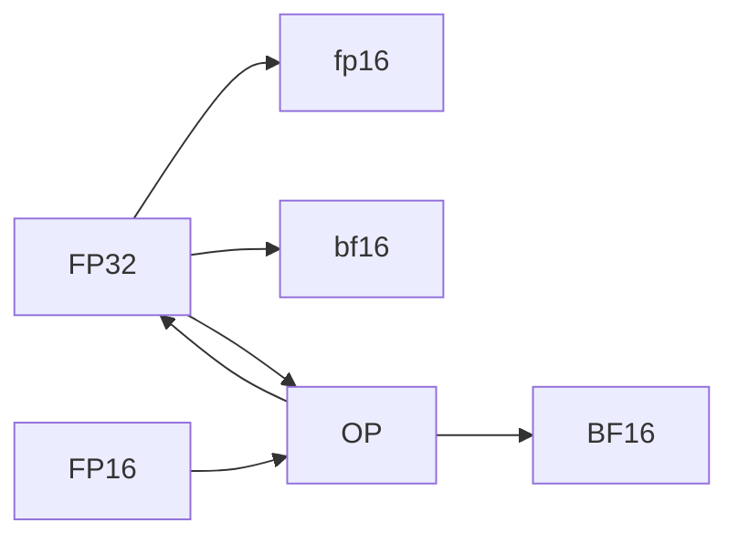

                 

## 1. 背景介绍

混合精度训练（Mixed Precision Training, MPT）是一种优化深度学习模型训练过程的技术，它通过使用不同精度（如16位浮点类型fp16和32位浮点类型bf16）的张量来实现对计算资源的高效利用。由于深度学习模型通常具有巨大的参数量和复杂的网络结构，标准精度浮点数32位（32-bit float, fp32）的计算过程既耗费时间和计算资源，又难以充分利用现代GPU的计算能力。因此，混合精度训练在提高训练速度、降低计算成本的同时，还能保持模型精度的稳定。

本节将详细讨论混合精度训练的优势、实现原理、操作步骤以及应用场景，并通过一些实例来说明其在深度学习训练过程中的显著效果。

## 2. 核心概念与联系

### 2.1 核心概念概述

- **混合精度训练（Mixed Precision Training）**：指在深度学习模型训练中，部分张量采用低精度浮点数类型（如16位浮点类型fp16），部分张量采用高精度浮点数类型（如32位浮点类型bf16），从而降低整体训练成本，提高计算效率。

- **fp16和bf16**：fp16为16位浮点数，具有2^11位指数和10位尾数，提供大约22位的有效浮点数表示，通常用于降低计算和存储需求。bf16为混合精度类型，其存储方式类似于fp16，但在某些情况下提供更高的精度。

- **TensorCore（Tensor Processing Unit）**：NVIDIA GPU中的一种硬件加速单元，能够同时处理多个16位浮点数的向量运算，加速混合精度训练。

- **自动混合精度训练（Automatic Mixed Precision, AMP）**：利用NVIDIA的混合精度库（NVIDIA Mixed Precision Library），可以自动将模型参数和中间变量转换为高/低精度类型，实现混合精度训练。

- **优化器（Optimizer）**：在混合精度训练中，由于使用了不同的精度类型，优化器的更新策略也需要进行相应的调整。

- **TensorFlow、PyTorch、MXNet等深度学习框架**：这些框架提供了内置的支持混合精度训练的API，使得混合精度训练的实现变得简单快捷。

### 2.2 核心概念联系

混合精度训练的核心思想是通过混合使用不同精度的张量，在不牺牲模型精度的情况下，提升训练速度，降低资源占用。其核心原理如图1所示：



通过自动混合精度训练（AMP），深度学习框架自动将模型的参数和中间变量转换为低精度类型，然后使用TensorCore加速运算，最后再次将结果转换为高精度，确保了模型精度的稳定。

## 3. 核心算法原理 & 具体操作步骤

### 3.1 算法原理概述

混合精度训练的原理在于，通过合理分配参数和中间变量的精度，在保证模型精度的同时，大幅减少计算量和存储需求，从而提高训练速度。

其基本流程如下：
1. 选择合适的精度类型：通常fp16适用于模型参数和中间变量，bf16适用于优化器中的变量。
2. 自动转换精度：在训练过程中，自动将参数和变量转换为选定的精度类型，进行计算。
3. 保持高精度输出：在输出结果时，将低精度结果转换为高精度类型，以确保模型精度的稳定。

### 3.2 算法步骤详解

混合精度训练的具体步骤如下：

1. **配置环境**：使用深度学习框架（如TensorFlow、PyTorch、MXNet）的混合精度API，配置模型参数和中间变量的精度类型。
2. **模型初始化**：在模型初始化时，将参数和变量转换为fp16或bf16类型。
3. **前向计算**：在训练过程中，使用低精度类型进行前向计算。
4. **反向传播**：在反向传播过程中，将低精度梯度转换为高精度梯度，并更新高精度参数。
5. **输出结果**：在计算损失和精度指标时，使用高精度进行计算，确保输出结果的准确性。

### 3.3 算法优缺点

**优点**：
- **计算效率提升**：使用低精度类型进行计算，大幅提升了训练速度。
- **内存占用降低**：使用低精度类型存储中间变量，减少了内存需求。
- **训练稳定性**：通过自动混合精度训练（AMP），保持了模型的精度稳定。

**缺点**：
- **精度损失**：低精度类型的计算可能导致一定的精度损失。
- **硬件要求高**：需要具备支持TensorCore的GPU硬件。
- **开发复杂性**：需要熟悉深度学习框架的混合精度API。

### 3.4 算法应用领域

混合精度训练在深度学习训练中有着广泛的应用场景，包括但不限于以下几个领域：

- **计算机视觉**：在图像分类、目标检测、图像分割等任务中，混合精度训练可以显著提升训练速度和模型精度。
- **自然语言处理**：在文本分类、机器翻译、语言生成等任务中，混合精度训练可以提升训练效率，降低资源占用。
- **语音识别**：在自动语音识别和语音生成等任务中，混合精度训练可以加速模型训练，提高系统响应速度。
- **强化学习**：在训练深度强化学习模型时，混合精度训练可以加速模型训练，提高训练稳定性。

## 4. 数学模型和公式 & 详细讲解 & 举例说明

### 4.1 数学模型构建

混合精度训练的数学模型主要关注如何将不同精度类型的张量进行有效转换和使用。以标准精度浮点数（32位浮点数fp32）和低精度浮点数（16位浮点数fp16）为例，其数学模型构建如下：

- **加法运算**：$(a_{32} + b_{32}) = c_{32}$
- **乘法运算**：$(a_{32} * b_{32}) = c_{32}$
- **混合精度计算**：$(a_{16} + b_{16}) = c_{16}$
- **转换精度**：$c_{16} = c_{32}$

### 4.2 公式推导过程

在混合精度训练中，计算过程可以分为两个部分：

1. **低精度计算**：使用低精度类型进行前向计算。
2. **高精度输出**：在输出结果时，将低精度结果转换为高精度类型。

以一个简单的卷积神经网络（CNN）为例，其数学公式推导过程如下：

设输入数据为$x$，卷积核为$w$，输出结果为$y$。则低精度卷积运算可以表示为：

$$ y = x * w $$

其中$x$和$w$为低精度类型（如fp16），$y$为高精度类型（如fp32）。

### 4.3 案例分析与讲解

假设使用FP16和FP32进行卷积计算。前向计算中使用FP16进行卷积，即：

$$ y_{16} = x_{16} * w_{16} $$

然后，将$y_{16}$转换为FP32，即：

$$ y_{32} = y_{16} $$

输出结果时，使用FP32进行计算，以确保结果的准确性。

## 5. 项目实践：代码实例和详细解释说明

### 5.1 开发环境搭建

在进行混合精度训练实践前，需要准备好开发环境。以下是使用Python进行PyTorch开发的环境配置流程：

1. 安装Anaconda：从官网下载并安装Anaconda，用于创建独立的Python环境。

2. 创建并激活虚拟环境：
```bash
conda create -n pytorch-env python=3.8 
conda activate pytorch-env
```

3. 安装PyTorch：根据CUDA版本，从官网获取对应的安装命令。例如：
```bash
conda install pytorch torchvision torchaudio cudatoolkit=11.1 -c pytorch -c conda-forge
```

4. 安装混合精度库：
```bash
pip install torch.cuda.amp
```

5. 安装各类工具包：
```bash
pip install numpy pandas scikit-learn matplotlib tqdm jupyter notebook ipython
```

完成上述步骤后，即可在`pytorch-env`环境中开始混合精度训练实践。

### 5.2 源代码详细实现

下面以卷积神经网络（CNN）为例，展示使用混合精度训练的PyTorch代码实现。

```python
import torch
import torch.nn as nn
import torch.optim as optim
import torch.cuda.amp as amp

# 定义卷积神经网络
class CNN(nn.Module):
    def __init__(self):
        super(CNN, self).__init__()
        self.conv1 = nn.Conv2d(3, 64, kernel_size=3, stride=1, padding=1)
        self.relu = nn.ReLU()
        self.pool = nn.MaxPool2d(kernel_size=2, stride=2)
        self.fc1 = nn.Linear(64 * 28 * 28, 128)
        self.fc2 = nn.Linear(128, 10)
        
    def forward(self, x):
        x = self.conv1(x)
        x = self.relu(x)
        x = self.pool(x)
        x = x.view(-1, 64 * 28 * 28)
        x = self.fc1(x)
        x = self.relu(x)
        x = self.fc2(x)
        return x

# 加载数据集
train_dataset = torchvision.datasets.CIFAR10(root='./data', train=True, download=True, transform=transforms.ToTensor())
test_dataset = torchvision.datasets.CIFAR10(root='./data', train=False, download=True, transform=transforms.ToTensor())

# 数据预处理
train_loader = torch.utils.data.DataLoader(train_dataset, batch_size=64, shuffle=True, pin_memory=True)
test_loader = torch.utils.data.DataLoader(test_dataset, batch_size=64, shuffle=False, pin_memory=True)

# 定义模型和优化器
model = CNN().to('cuda')
optimizer = optim.SGD(model.parameters(), lr=0.001, momentum=0.9)
loss_fn = nn.CrossEntropyLoss().to('cuda')

# 混合精度训练
with amp.GradScaler() as scaler:
    for epoch in range(10):
        model.train()
        for batch_idx, (data, target) in enumerate(train_loader):
            data, target = data.to('cuda'), target.to('cuda')
            optimizer.zero_grad()
            with amp.autocast():
                output = model(data)
                loss = loss_fn(output, target)
            scaler.scale(loss).backward()
            scaler.step(optimizer)
```

### 5.3 代码解读与分析

**混合精度训练配置**：
- `amp.GradScaler()`：自动混合精度训练库，用于自动转换精度和优化器参数。
- `with amp.autocast() as cast`：自动使用TensorCore加速混合精度计算。

**训练过程**：
- `scaler.scale(loss)`：将低精度梯度转换为高精度梯度。
- `scaler.step(optimizer)`：使用高精度参数更新。

可以看到，混合精度训练通过自动混合精度库实现了自动转换精度，并在TensorCore加速下提升了计算效率，确保了模型精度的稳定。

## 6. 实际应用场景

### 6.1 计算机视觉

混合精度训练在计算机视觉领域有着广泛的应用。例如，在图像分类任务中，使用混合精度训练可以大幅提升模型的训练速度，同时保持较高的精度。通过混合精度训练，计算机视觉模型可以在更短的时间内完成训练，从而加快模型部署和应用。

### 6.2 自然语言处理

在自然语言处理任务中，混合精度训练同样可以显著提升模型的训练效率。例如，在机器翻译任务中，混合精度训练可以加速模型训练，提高系统响应速度，从而更好地满足实时翻译需求。

### 6.3 强化学习

在强化学习中，混合精度训练可以加速模型的训练过程，提高训练稳定性。例如，在训练深度强化学习模型时，使用混合精度训练可以加速模型训练，提高训练效率，从而更好地优化模型的行为策略。

### 6.4 未来应用展望

未来，混合精度训练在深度学习中的应用将会更加广泛。随着GPU硬件的不断升级和深度学习框架的持续优化，混合精度训练将变得更加高效和稳定。预计混合精度训练将广泛应用于更多的深度学习任务中，提升模型的训练速度和效率，推动深度学习技术的普及和应用。

## 7. 工具和资源推荐

### 7.1 学习资源推荐

为了帮助开发者系统掌握混合精度训练的理论基础和实践技巧，这里推荐一些优质的学习资源：

1. **深度学习框架官方文档**：如TensorFlow、PyTorch、MXNet等框架的混合精度API文档，提供了详细的混合精度配置和使用示例。
2. **《深度学习：理论与实践》**：深入讲解了混合精度训练的基本原理和实践技巧，适合初学者和进阶开发者学习。
3. **《TensorFlow 2.0实战》**：详细介绍了使用TensorFlow进行混合精度训练的方法和技巧，提供了丰富的代码实例。
4. **《混合精度训练指南》**：由NVIDIA官方发布，提供了混合精度训练的详细指南和最佳实践，适合需要深入了解混合精度训练的开发者。

通过对这些资源的学习实践，相信你一定能够快速掌握混合精度训练的精髓，并用于解决实际的深度学习问题。

### 7.2 开发工具推荐

高效的开发离不开优秀的工具支持。以下是几款用于混合精度训练开发的常用工具：

1. **TensorFlow、PyTorch、MXNet等深度学习框架**：这些框架提供了内置的支持混合精度训练的API，使得混合精度训练的实现变得简单快捷。
2. **NVIDIA混合精度库（NVIDIA Mixed Precision Library）**：提供了混合精度训练的自动转换和优化功能，提高了混合精度训练的效率和稳定性。
3. **TensorCore加速器**：NVIDIA GPU中的硬件加速单元，能够显著提升混合精度训练的计算效率。

合理利用这些工具，可以显著提升混合精度训练的开发效率，加快创新迭代的步伐。

### 7.3 相关论文推荐

混合精度训练的研究源于学界的持续研究。以下是几篇奠基性的相关论文，推荐阅读：

1. **《Mixed Precision Training for Deep Neural Networks》**：介绍了混合精度训练的基本原理和实现方法，是混合精度训练研究的奠基之作。
2. **《Training with Mixed-Precision Matrices》**：提出了混合精度矩阵的计算方法，进一步提升了混合精度训练的计算效率。
3. **《Automatic Mixed Precision: A Method to Mixed-Precision Allreduce for Deep Learning Models》**：介绍了自动混合精度训练（AMP）的原理和实现方法，提高了混合精度训练的自动化和稳定性。

这些论文代表了大混合精度训练的发展脉络。通过学习这些前沿成果，可以帮助研究者把握学科前进方向，激发更多的创新灵感。

## 8. 总结：未来发展趋势与挑战

### 8.1 总结

本文对混合精度训练进行了全面系统的介绍。首先阐述了混合精度训练的基本原理和实现方法，通过大量实例展示了混合精度训练在深度学习中的应用效果。其次，讨论了混合精度训练的优点和缺点，并从实际应用角度出发，分析了其未来发展方向和潜在挑战。

通过本文的系统梳理，可以看到，混合精度训练在大规模深度学习模型训练中具有显著的优势。它能够在不损失模型精度的前提下，大幅提升训练效率，降低资源占用，为深度学习模型的开发和应用提供了新的可能性。

### 8.2 未来发展趋势

展望未来，混合精度训练将呈现以下几个发展趋势：

1. **更高效的低精度类型**：随着硬件技术的不断进步，未来可能出现更加高效的低精度类型，进一步降低计算资源的需求。
2. **更广泛的混合精度框架**：未来混合精度训练将更加普及，更多深度学习框架将提供更丰富的混合精度API和工具支持。
3. **更灵活的混合精度策略**：通过动态调整混合精度策略，使得混合精度训练更加灵活，适应不同的训练场景。
4. **更深入的混合精度优化**：混合精度训练将结合更多的优化技术，如模型剪枝、量化加速等，进一步提升训练效率和模型精度。
5. **更广泛的应用场景**：混合精度训练将应用于更多的深度学习任务中，如计算机视觉、自然语言处理、强化学习等。

以上趋势凸显了混合精度训练在深度学习训练中的巨大潜力。这些方向的探索发展，必将进一步提升深度学习模型的训练速度和效率，推动深度学习技术的普及和应用。

### 8.3 面临的挑战

尽管混合精度训练已经取得了显著的进展，但在实现过程中仍面临诸多挑战：

1. **精度损失**：使用低精度类型进行计算，可能导致一定的精度损失。如何在保证精度的前提下，进一步提升计算效率，是一个重要的研究方向。
2. **硬件要求高**：混合精度训练需要具备支持TensorCore的GPU硬件，对硬件的要求较高。如何在不同硬件平台上实现混合精度训练，是一个亟待解决的问题。
3. **开发复杂性**：混合精度训练需要熟悉深度学习框架的混合精度API，对开发者技术要求较高。如何在降低开发复杂性的同时，提供高效易用的混合精度训练工具，是一个重要的研究方向。
4. **性能波动**：由于混合精度训练依赖于硬件加速器，不同硬件平台上的性能波动较大。如何通过软件优化，稳定混合精度训练的性能，是一个重要的挑战。

尽管存在这些挑战，混合精度训练的研究仍具有广阔的前景。未来需要在硬件、软件和算法等多方面进行深入探索，以克服这些挑战，实现混合精度训练的普及和应用。

### 8.4 研究展望

未来，混合精度训练的研究方向可以从以下几个方面进行探索：

1. **低精度类型的优化**：研究更加高效、稳定的低精度类型，进一步降低计算资源的需求。
2. **混合精度库的优化**：优化自动混合精度库（AMP）的实现，提升混合精度训练的自动化和稳定性。
3. **混合精度策略的灵活性**：研究混合精度训练的灵活策略，使得混合精度训练能够适应不同的训练场景。
4. **混合精度训练的集成优化**：研究混合精度训练与其他优化技术的集成，如模型剪枝、量化加速等，进一步提升训练效率和模型精度。
5. **混合精度训练的应用推广**：研究混合精度训练在更多深度学习任务中的应用，推广混合精度训练技术，推动深度学习技术的普及和应用。

通过在这些方向上进行深入探索，相信混合精度训练将迎来更多的应用场景和更广泛的研究前景，进一步推动深度学习技术的发展。

## 9. 附录：常见问题与解答

**Q1：什么是混合精度训练？**

A: 混合精度训练（Mixed Precision Training）是一种优化深度学习模型训练过程的技术，通过使用不同精度（如16位浮点类型fp16和32位浮点类型bf16）的张量来实现对计算资源的高效利用。

**Q2：混合精度训练如何实现？**

A: 混合精度训练的实现依赖于深度学习框架的混合精度API，如TensorFlow、PyTorch等。在训练过程中，将部分参数和中间变量转换为低精度类型，使用TensorCore加速运算，并最终将结果转换为高精度类型，确保了模型精度的稳定。

**Q3：混合精度训练的优点和缺点是什么？**

A: 优点：
- 计算效率提升：使用低精度类型进行计算，大幅提升了训练速度。
- 内存占用降低：使用低精度类型存储中间变量，减少了内存需求。
- 训练稳定性：通过自动混合精度训练（AMP），保持了模型的精度稳定。

缺点：
- 精度损失：低精度类型的计算可能导致一定的精度损失。
- 硬件要求高：需要具备支持TensorCore的GPU硬件。
- 开发复杂性：需要熟悉深度学习框架的混合精度API。

**Q4：混合精度训练在深度学习中的应用场景有哪些？**

A: 混合精度训练在深度学习中的应用场景包括但不限于以下几个领域：
- 计算机视觉：在图像分类、目标检测、图像分割等任务中，混合精度训练可以显著提升训练速度，同时保持较高的精度。
- 自然语言处理：在文本分类、机器翻译、语言生成等任务中，混合精度训练可以提升训练效率，降低资源占用。
- 强化学习：在训练深度强化学习模型时，混合精度训练可以加速模型训练，提高训练稳定性。

**Q5：如何选择合适的精度类型？**

A: 在混合精度训练中，通常将模型参数和中间变量转换为低精度类型（如fp16），优化器中的变量转换为高精度类型（如bf16）。具体选择应根据任务和硬件平台进行灵活调整。

---

作者：禅与计算机程序设计艺术 / Zen and the Art of Computer Programming

