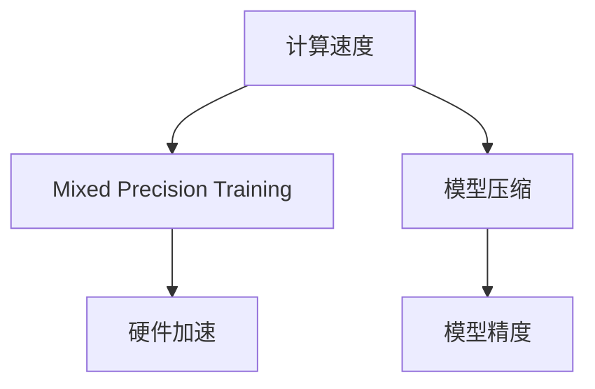

                 

# 混合精度训练：平衡计算速度和模型精度

> 关键词：混合精度训练, 深度学习, 计算速度, 模型精度, 模型压缩, 硬件加速

## 1. 背景介绍

### 1.1 问题由来

随着深度学习模型的复杂度不断增加，训练和推理所需的计算资源也急剧攀升。特别是在大规模神经网络、大图像和语言模型训练中，常常面临内存和计算资源的双重压力。如何在保证模型精度的前提下，尽可能地减少计算资源的消耗，成为深度学习社区亟待解决的问题。混合精度训练技术应运而生，通过混合使用32位和16位浮点数来降低计算复杂度，在保证模型精度的情况下显著提升计算效率。

### 1.2 问题核心关键点

混合精度训练的核心在于通过将模型中的某些层使用16位浮点数表示，降低整体的计算需求。同时，为了保证精度，许多层仍使用32位浮点数表示，以维持关键计算路径的精度。这种混合精度训练方式，能够在大幅降低计算资源消耗的同时，仍能保证模型的有效性和准确性。

## 2. 核心概念与联系

### 2.1 核心概念概述

为更好地理解混合精度训练技术，本节将介绍几个密切相关的核心概念：

- **混合精度训练(Mixed Precision Training)**：一种通过混合使用32位和16位浮点数来降低计算需求，同时保持模型精度的训练方法。通常，将模型的参数、激活函数、优化器等部分或全部层设置为16位精度，其余层仍使用32位精度。

- **计算速度**：训练和推理过程中，模型处理数据的速度。高效的计算速度可以显著缩短模型训练时间，提升系统响应速度。

- **模型精度**：模型预测结果与真实值之间的误差。精度高的模型能够更好地适应复杂的输入数据，避免过拟合。

- **模型压缩**：通过减少模型参数数量、降低模型复杂度等手段，减小模型计算量，提升计算速度。

- **硬件加速**：利用GPU、TPU等加速器设备，提高模型计算效率。混合精度训练与硬件加速技术密切相关，可以通过混合精度计算充分利用加速器的计算能力。

这些核心概念之间的逻辑关系可以通过以下Mermaid流程图来展示：



这个流程图展示出计算速度、混合精度训练、模型压缩、模型精度和硬件加速之间的相互关系：

1. 计算速度的提升依赖于混合精度训练和模型压缩。
2. 模型精度的维持是混合精度训练的主要目标。
3. 硬件加速是提升计算速度的重要手段。

## 3. 核心算法原理 & 具体操作步骤

### 3.1 算法原理概述

混合精度训练的基本思想是在保证模型精度的情况下，尽量使用精度较低的16位浮点数表示模型参数和激活函数，从而降低计算资源需求。同时，对于模型的关键部分（如卷积核、权重矩阵等）仍保持32位精度，以确保计算路径的精度。

混合精度训练通过自动混合精度计算，自动调整参数的精度，从而平衡计算速度和模型精度。其原理包括以下几个步骤：

1. 确定模型的混合精度方案：决定哪些层的参数使用32位浮点数，哪些层的参数使用16位浮点数。
2. 选择合适的混合精度实现方式：包括自动混合精度计算(AMP)、手动混合精度计算等。
3. 调整模型的计算精度：训练过程中根据当前层的输入和输出数据类型，自动切换为合适的精度。

### 3.2 算法步骤详解

以下我们详细介绍混合精度训练的详细步骤：

**Step 1: 确定混合精度方案**

在混合精度训练中，需要根据模型的具体情况确定哪些层的参数使用32位浮点数，哪些层的参数使用16位浮点数。通常，以下几类层的参数建议保持32位精度：

- 模型的顶层
- 重要的全连接层
- 卷积核等计算密集型层的权重矩阵

对于其他层的参数，可以采用16位浮点数表示，以减少计算资源消耗。

**Step 2: 选择合适的混合精度实现方式**

常见的混合精度实现方式包括：

- **自动混合精度计算(AMP)**：利用CUDA库和PyTorch的AMP支持，自动调整计算精度。通常通过`torch.cuda.amp`和`torch.cuda.amp.autocast`实现。
- **手动混合精度计算**：手动调整计算精度，使用混合精度计算函数，如`torch.float16`、`torch.bfloat16`等。

**Step 3: 调整计算精度**

训练过程中，混合精度计算会在特定条件下自动切换计算精度。例如：

- 当输入数据的精度不足时，自动将计算精度提升为32位。
- 当输出数据的精度不足时，自动将计算精度下调至16位。

这种自动切换机制确保了模型在精度和速度之间达到最佳平衡。

### 3.3 算法优缺点

混合精度训练技术具有以下优点：

1. **计算效率高**：通过混合使用16位和32位浮点数，大幅减少了计算资源的消耗。
2. **模型精度好**：对于某些层使用32位精度，保证了关键计算路径的精度。
3. **兼容性好**：与目前广泛使用的深度学习框架兼容，如PyTorch、TensorFlow等。

同时，混合精度训练也存在一些局限性：

1. **硬件要求高**：混合精度训练依赖于支持16位浮点数运算的硬件设备，如NVIDIA的GPU等。
2. **模型难以调试**：由于精度问题，混合精度训练的模型调试较为复杂，需要更多的工具和技巧。
3. **精度损失**：部分操作（如批标准化）在16位浮点数下可能存在精度损失，需要额外处理。

尽管存在这些局限性，混合精度训练仍是大规模深度学习训练的有效手段，能够显著提升计算效率，加速模型训练。

### 3.4 算法应用领域

混合精度训练技术在深度学习领域有广泛的应用，以下是几个典型的应用场景：

1. **计算机视觉**：在图像分类、目标检测、图像生成等任务中，混合精度训练能够显著提升计算效率，加速模型训练和推理。
2. **自然语言处理**：在大规模语言模型训练中，混合精度训练可以大幅降低计算成本，加速模型收敛。
3. **推荐系统**：在推荐算法训练中，混合精度训练能够提高计算速度，加速模型迭代。
4. **语音识别**：在语音识别模型训练中，混合精度训练可以加速模型收敛，提升系统响应速度。

## 4. 数学模型和公式 & 详细讲解 & 举例说明

### 4.1 数学模型构建

混合精度训练的基本数学模型建立在浮点数的表示和计算上。假设模型的参数为 $\theta$，其中 $\theta \in \mathbb{R}^d$，分别使用32位和16位浮点数表示。假设 $\theta_{16}$ 表示使用16位浮点数表示的参数子集，$\theta_{32}$ 表示使用32位浮点数表示的参数子集。

在混合精度训练中，模型的计算精度分为两种：

- 对于 $\theta_{16}$，使用16位浮点数进行计算。
- 对于 $\theta_{32}$，使用32位浮点数进行计算。

在训练过程中，根据数据类型自动切换计算精度。

### 4.2 公式推导过程

以下推导使用混合精度训练的基本数学模型，展示如何在混合精度下进行模型参数的更新：

假设当前层的输入为 $x$，输出为 $y$，激活函数为 $f$。在32位精度下，计算过程为：

$$
y_{32} = f(x_{32})
$$

其中 $x_{32}$ 和 $y_{32}$ 分别表示输入和输出的32位浮点数。在16位精度下，计算过程为：

$$
y_{16} = f(x_{16})
$$

其中 $x_{16}$ 和 $y_{16}$ 分别表示输入和输出的16位浮点数。

在混合精度训练中，对于输入 $x$，可能使用16位浮点数表示，也可能使用32位浮点数表示。同样，对于激活函数 $f$ 的输入和输出，也需要根据当前层的精度进行自动切换。

### 4.3 案例分析与讲解

以卷积层为例，展示混合精度计算的实现过程。假设卷积核 $\mathbf{W}$ 使用16位浮点数表示，输入特征图 $x$ 使用32位浮点数表示。卷积计算过程如下：

$$
y = \mathbf{W} \star x
$$

在16位精度下，计算过程为：

$$
y_{16} = \mathbf{W}_{16} \star x_{16}
$$

其中 $\mathbf{W}_{16}$ 表示16位浮点数表示的卷积核，$x_{16}$ 表示32位浮点数表示的输入特征图。在32位精度下，计算过程为：

$$
y_{32} = \mathbf{W}_{32} \star x_{32}
$$

其中 $\mathbf{W}_{32}$ 表示32位浮点数表示的卷积核，$x_{32}$ 表示32位浮点数表示的输入特征图。

在混合精度训练中，可以根据输入和输出的精度自动切换计算精度，从而平衡计算速度和模型精度。

## 5. 项目实践：代码实例和详细解释说明

### 5.1 开发环境搭建

在进行混合精度训练实践前，我们需要准备好开发环境。以下是使用PyTorch进行混合精度训练的环境配置流程：

1. 安装Anaconda：从官网下载并安装Anaconda，用于创建独立的Python环境。

2. 创建并激活虚拟环境：
```bash
conda create -n pytorch-env python=3.8 
conda activate pytorch-env
```

3. 安装PyTorch：根据CUDA版本，从官网获取对应的安装命令。例如：
```bash
conda install pytorch torchvision torchaudio cudatoolkit=11.1 -c pytorch -c conda-forge
```

4. 安装相关库：
```bash
pip install torch torchvision torchaudio
```

5. 安装混合精度计算库：
```bash
pip install torch.cuda.amp
```

完成上述步骤后，即可在`pytorch-env`环境中开始混合精度训练实践。

### 5.2 源代码详细实现

下面我们以卷积神经网络(CNN)为例，给出使用PyTorch进行混合精度训练的PyTorch代码实现。

```python
import torch
import torch.nn as nn
import torch.nn.functional as F
import torch.cuda.amp as amp

class CNN(nn.Module):
    def __init__(self):
        super(CNN, self).__init__()
        self.conv1 = nn.Conv2d(3, 32, 3)
        self.conv2 = nn.Conv2d(32, 64, 3)
        self.pool = nn.MaxPool2d(2, 2)
        self.fc1 = nn.Linear(64 * 4 * 4, 256)
        self.fc2 = nn.Linear(256, 10)

    def forward(self, x):
        x = F.relu(self.conv1(x))
        x = self.pool(x)
        x = F.relu(self.conv2(x))
        x = self.pool(x)
        x = x.view(-1, 64 * 4 * 4)
        x = F.relu(self.fc1(x))
        x = self.fc2(x)
        return x

# 加载数据集和模型
train_loader = ...
model = CNN()

# 设置混合精度训练
with amp.autocast():
    for epoch in range(10):
        for batch_idx, (inputs, targets) in enumerate(train_loader):
            inputs, targets = inputs.to(device), targets.to(device)
            optimizer.zero_grad()
            outputs = model(inputs)
            loss = F.cross_entropy(outputs, targets)
            loss.backward()
            optimizer.step()
```

### 5.3 代码解读与分析

让我们再详细解读一下关键代码的实现细节：

**Cnn类**：
- `__init__`方法：定义卷积层、全连接层等模型组件。
- `forward`方法：定义模型前向传播过程。

**with amp.autocast()**：
- 开启混合精度计算，自动切换计算精度，确保模型精度和计算速度的平衡。

**训练循环**：
- 使用`amp.autocast()`封装训练过程，自动进行精度切换。
- 对输入和目标变量进行GPU转移，确保计算在GPU上进行。
- 使用优化器更新模型参数。
- 记录训练过程中的损失。

**混合精度训练**：
- `amp.autocast()`确保了在16位和32位精度下自动切换计算路径，优化了模型的计算速度。
- 在训练过程中，需要特别关注精度切换对计算的影响，必要时进行手动优化。

### 5.4 运行结果展示

在训练过程中，可以通过监控训练的损失和精度，验证混合精度训练的效果。以下是一个简单的结果展示：

```python
import torch
import torch.nn as nn
import torch.nn.functional as F
import torch.cuda.amp as amp

class CNN(nn.Module):
    def __init__(self):
        super(CNN, self).__init__()
        self.conv1 = nn.Conv2d(3, 32, 3)
        self.conv2 = nn.Conv2d(32, 64, 3)
        self.pool = nn.MaxPool2d(2, 2)
        self.fc1 = nn.Linear(64 * 4 * 4, 256)
        self.fc2 = nn.Linear(256, 10)

    def forward(self, x):
        x = F.relu(self.conv1(x))
        x = self.pool(x)
        x = F.relu(self.conv2(x))
        x = self.pool(x)
        x = x.view(-1, 64 * 4 * 4)
        x = F.relu(self.fc1(x))
        x = self.fc2(x)
        return x

# 加载数据集和模型
train_loader = ...
model = CNN()

# 设置混合精度训练
with amp.autocast():
    for epoch in range(10):
        for batch_idx, (inputs, targets) in enumerate(train_loader):
            inputs, targets = inputs.to(device), targets.to(device)
            optimizer.zero_grad()
            outputs = model(inputs)
            loss = F.cross_entropy(outputs, targets)
            loss.backward()
            optimizer.step()
            
        print(f'Epoch {epoch+1}, loss: {loss:.4f}')
```

以上是一个简单的混合精度训练示例，展示了如何在PyTorch中进行混合精度计算。

## 6. 实际应用场景

### 6.1 智能推荐系统

在智能推荐系统中，大规模用户数据和商品数据的处理需要极大的计算资源。通过混合精度训练，可以显著降低模型训练和推理的计算需求，加速推荐模型的迭代和部署。

在实际应用中，可以在用户数据和商品数据上进行预训练，然后对推荐模型进行微调，使其能够根据用户历史行为和商品特征进行推荐。混合精度训练可以大大缩短推荐模型的训练时间，使得快速响应和实时推荐成为可能。

### 6.2 计算机视觉

在计算机视觉领域，混合精度训练也被广泛应用。例如，在图像分类、目标检测等任务中，混合精度训练可以加速模型的收敛，提升系统响应速度。

通过混合精度训练，可以在保持模型精度的情况下，大幅降低计算资源需求。这对于图像分类、目标检测等计算密集型任务尤为重要，能够显著提升模型的训练和推理效率。

### 6.3 自然语言处理

在大规模语言模型训练中，混合精度训练同样具有重要应用。通过混合精度训练，可以在保持模型精度的同时，大幅降低计算需求，加速模型训练。

例如，在BERT等大规模语言模型训练中，混合精度训练可以显著减少计算资源消耗，加速模型收敛。这对于大规模语言模型的开发和部署具有重要意义。

## 7. 工具和资源推荐

### 7.1 学习资源推荐

为了帮助开发者系统掌握混合精度训练的理论基础和实践技巧，这里推荐一些优质的学习资源：

1. 《深度学习中的混合精度计算》系列博文：由深度学习领域专家撰写，深入浅出地介绍了混合精度计算的原理、实现方式及其应用场景。

2. NVIDIA官方混合精度计算文档：详细介绍了混合精度计算的原理、实现方式及NVIDIA硬件的支持。

3. PyTorch官方混合精度计算文档：提供了PyTorch框架下混合精度计算的详细教程和示例代码。

4. TensorFlow混合精度计算文档：介绍了TensorFlow框架下混合精度计算的实现方式及性能优化技巧。

5. Mixed Precision Training in Deep Learning（论文）：一篇综述论文，全面总结了混合精度训练的原理、实现方式及应用效果。

通过对这些资源的学习实践，相信你一定能够快速掌握混合精度训练的精髓，并用于解决实际的深度学习问题。

### 7.2 开发工具推荐

高效的开发离不开优秀的工具支持。以下是几款用于混合精度训练开发的常用工具：

1. PyTorch：基于Python的开源深度学习框架，支持混合精度计算，适合快速迭代研究。

2. TensorFlow：由Google主导开发的开源深度学习框架，支持混合精度计算，适用于大规模工程应用。

3. Caffe2：Facebook开源的深度学习框架，支持混合精度计算，适用于高性能计算环境。

4. OpenCL库：跨平台计算库，支持混合精度计算，适用于异构计算环境。

5. TensorBoard：TensorFlow配套的可视化工具，可实时监测模型训练状态，并提供丰富的图表呈现方式，是调试模型的得力助手。

合理利用这些工具，可以显著提升混合精度训练任务的开发效率，加快创新迭代的步伐。

### 7.3 相关论文推荐

混合精度训练技术的发展源于学界的持续研究。以下是几篇奠基性的相关论文，推荐阅读：

1. **“Training with Mixed-Precision: Reducing 16-Bit Floating Point Computation”（论文）**：
   这篇论文首次提出混合精度训练的概念，并展示了其在GPU上的实现效果。

2. **“Mixed-Precision Training with Dynamic Loss Scaling”（论文）**：
   这篇论文详细介绍了混合精度训练中的动态损失缩放方法，解决了精度问题。

3. **“Hybrid Precision Training: Tricks of the Trade”（论文）**：
   这篇论文总结了混合精度训练的多种技巧，包括自动混合精度计算、动态损失缩放等，提供了混合精度训练的实用经验。

4. **“High-Performance Computing Using Hybrid-Precision Training”（论文）**：
   这篇论文展示了混合精度训练在超级计算机上的应用，展示了其在高性能计算环境下的性能提升。

这些论文代表了大规模深度学习训练技术的发展脉络。通过学习这些前沿成果，可以帮助研究者把握学科前进方向，激发更多的创新灵感。

## 8. 总结：未来发展趋势与挑战

### 8.1 总结

本文对混合精度训练技术进行了全面系统的介绍。首先阐述了混合精度训练的计算速度和模型精度之间的平衡，明确了混合精度训练在深度学习中的重要价值。其次，从原理到实践，详细讲解了混合精度训练的数学模型和实现步骤，给出了混合精度训练任务开发的完整代码实例。同时，本文还广泛探讨了混合精度训练技术在智能推荐系统、计算机视觉、自然语言处理等多个行业领域的应用前景，展示了混合精度训练技术的广泛适用性。此外，本文精选了混合精度训练技术的各类学习资源，力求为读者提供全方位的技术指引。

通过本文的系统梳理，可以看到，混合精度训练技术已经成为深度学习模型训练的重要手段，能够在大幅降低计算资源消耗的同时，仍能保证模型的有效性和准确性。未来，伴随深度学习技术的不断发展，混合精度训练将进一步优化计算资源使用，提升模型训练和推理效率，加速深度学习模型的落地应用。

### 8.2 未来发展趋势

展望未来，混合精度训练技术将呈现以下几个发展趋势：

1. **硬件加速不断提升**：随着AI芯片的不断进化，混合精度训练的硬件支持将更加广泛，性能也将进一步提升。未来的AI芯片将更加高效，能够支持更多的混合精度计算操作。

2. **软件优化不断深化**：混合精度训练的优化将从硬件层面扩展到软件层面，包括自动混合精度计算、动态损失缩放、模型压缩等技术将更加成熟。

3. **混合精度计算在更多应用场景中推广**：混合精度计算不仅应用于深度学习训练，还将推广到图像处理、信号处理等领域，成为通用的计算技术。

4. **混合精度训练与边缘计算结合**：边缘计算的兴起将使得混合精度计算更加普及，能够支持更多实时计算需求，提升计算效率。

5. **混合精度计算与云计算结合**：混合精度计算将与云计算平台结合，提供弹性计算资源，满足不同规模的计算需求。

以上趋势凸显了混合精度训练技术的广阔前景。这些方向的探索发展，必将进一步提升计算效率，优化资源使用，推动深度学习技术的产业化进程。

### 8.3 面临的挑战

尽管混合精度训练技术已经取得了瞩目成就，但在迈向更加智能化、普适化应用的过程中，它仍面临诸多挑战：

1. **硬件瓶颈**：混合精度训练依赖于支持16位浮点数运算的硬件设备，如NVIDIA的GPU等。目前硬件设备的普及和性能提升仍是关键问题。

2. **精度损失**：部分操作（如批标准化）在16位浮点数下可能存在精度损失，需要额外处理。

3. **模型调试复杂**：混合精度训练的模型调试较为复杂，需要更多的工具和技巧。

4. **精度调整策略**：混合精度训练中的精度调整策略需要根据具体任务进行灵活调整，难以统一。

5. **模型压缩问题**：混合精度训练需要减少模型参数数量，但模型的压缩和优化仍是一个难题。

尽管存在这些挑战，混合精度训练技术仍是大规模深度学习训练的有效手段，能够显著提升计算效率，加速模型训练。

### 8.4 研究展望

面对混合精度训练面临的挑战，未来的研究需要在以下几个方面寻求新的突破：

1. **硬件支持更加广泛**：提升AI芯片对混合精度计算的支持，推广混合精度计算在更多硬件平台上的应用。

2. **软件优化更加精细**：优化混合精度计算的软件实现，减少精度损失，提升计算效率。

3. **混合精度计算与边缘计算结合**：探索混合精度计算在边缘计算环境中的应用，满足实时计算需求。

4. **混合精度计算与云计算结合**：探索混合精度计算在云计算平台中的应用，提供弹性计算资源。

5. **混合精度计算与符号计算结合**：探索混合精度计算与符号计算的结合，提升混合精度计算的可靠性和可解释性。

这些研究方向将进一步推动混合精度计算技术的发展，为深度学习技术的广泛应用奠定坚实基础。相信随着硬件和软件的不断进步，混合精度计算技术将更加成熟，为深度学习技术的落地应用提供更强的支持。

## 9. 附录：常见问题与解答

**Q1：混合精度训练对模型精度有何影响？**

A: 混合精度训练可以在保持模型精度的同时，大幅降低计算资源需求。具体而言，对于部分层采用16位浮点数表示，可以显著降低计算复杂度，提升训练速度。同时，对于关键层的参数保持32位精度，可以确保模型精度的稳定。

**Q2：混合精度训练中的精度切换策略有哪些？**

A: 常见的精度切换策略包括：
1. **自动混合精度计算(AMP)**：利用CUDA库和PyTorch的AMP支持，自动调整计算精度。
2. **手动混合精度计算**：手动调整计算精度，使用混合精度计算函数，如`torch.float16`、`torch.bfloat16`等。
3. **动态损失缩放**：根据当前层的输入和输出数据类型，自动调整计算精度，确保模型精度的稳定。

**Q3：如何选择合适的混合精度方案？**

A: 混合精度方案的选择需要根据具体任务进行灵活调整。一般来说，以下几类层的参数建议保持32位精度：
1. 模型的顶层
2. 重要的全连接层
3. 卷积核等计算密集型层的权重矩阵

对于其他层的参数，可以采用16位浮点数表示，以减少计算资源消耗。

**Q4：混合精度训练中存在哪些精度损失问题？**

A: 混合精度训练中，部分操作（如批标准化）在16位浮点数下可能存在精度损失，需要额外处理。常见的解决方法包括：
1. 使用16位浮点数训练和32位浮点数推理的方式，确保计算精度。
2. 使用特殊的批标准化方法，如Fused BatchNorm，优化混合精度计算。

这些精度问题需要通过实验验证和优化来解决。

**Q5：混合精度训练对模型性能有何影响？**

A: 混合精度训练可以在保证模型精度的同时，大幅降低计算资源需求，提升模型训练和推理效率。具体而言，混合精度训练能够加速模型收敛，缩短训练时间，提升模型推理速度。

---

作者：禅与计算机程序设计艺术 / Zen and the Art of Computer Programming

