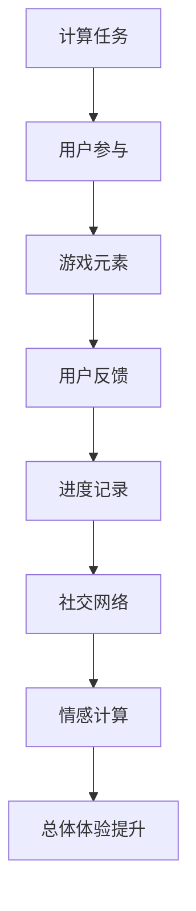

                 

# 游戏化体验：让参与人类计算乐在其中

> 关键词：游戏化体验, 人类计算, 人工智能, 机器学习, 自然语言处理, 情感计算, 社交网络分析

## 1. 背景介绍

### 1.1 问题由来

在数字化时代，计算已经深入到我们生活的方方面面。无论是搜索引擎、推荐系统，还是智能助手，都离不开计算的支撑。然而，高强度的计算任务往往让人感到枯燥和疲惫。如何激发用户兴趣，提高参与度，是计算技术面临的一大挑战。

游戏化体验（Gamification）应运而生，通过将游戏元素融入计算任务中，提升用户体验和参与感。传统游戏设计中常用的奖励、成就、任务等元素，都能被巧妙应用于计算任务中。本文将从核心概念、算法原理、具体操作步骤等方面，详细介绍游戏化体验的实现方法，帮助开发者将计算任务变得有趣、可玩、易用。

### 1.2 问题核心关键点

游戏化体验的核心在于如何通过设计游戏元素，将复杂的计算任务转换为有吸引力的游戏形式，使用户在享受游戏乐趣的同时，完成计算任务。常见的游戏化元素包括但不限于以下几种：

- **任务（Tasks）**：定义清晰的计算任务，用户需要完成任务才能获得奖励。
- **奖励（Rewards）**：完成任务后获得的虚拟奖励，如积分、徽章等。
- **成就（Achievements）**：用户完成某些特定任务后获得的成就，如获得新称号、解锁新技能等。
- **进度（Progression）**：记录用户的计算任务完成情况，让用户有成就感和满足感。
- **社交互动（Social Interaction）**：通过社交网络与他人互动，增强用户参与度和粘性。
- **情感反馈（Emotional Feedback）**：通过虚拟角色、故事情节等方式，模拟真实情感反馈，提升用户体验。

通过合理设计这些游戏化元素，可以显著提升用户参与度，使计算任务变得更有趣味性，甚至让用户愿意为之投入时间和精力。

## 2. 核心概念与联系

### 2.1 核心概念概述

为更好地理解游戏化体验的实现方法，本节将介绍几个密切相关的核心概念：

- **计算任务（Computational Task）**：需要计算机进行处理的复杂计算问题，如数据处理、数据分析、模型训练等。
- **用户参与（User Engagement）**：用户对计算任务的兴趣和投入度，直接影响任务完成效率和质量。
- **游戏元素（Game Elements）**：将游戏设计理念应用于计算任务中的各种元素，如任务、奖励、成就等。
- **用户反馈（User Feedback）**：用户对计算任务和游戏化元素的反应，通过情感反馈、互动反馈等方式获取。
- **进度记录（Progress Tracking）**：通过记录用户任务完成情况，增强成就感和满足感。
- **社交网络（Social Network）**：通过社交网络互动，增强用户参与度和粘性。
- **情感计算（Affective Computing）**：通过分析用户情感反馈，提升用户体验和参与度。

这些核心概念之间的逻辑关系可以通过以下Mermaid流程图来展示：



这个流程图展示了一些核心概念之间的关联性，体现了游戏化体验的实现路径。

## 3. 核心算法原理 & 具体操作步骤
### 3.1 算法原理概述

游戏化体验的核心算法原理基于人类心理学和社会行为学，通过设计游戏元素和互动机制，激发用户的内在动机和情感反应，使其在不知不觉中完成计算任务。以下是一些关键的游戏化算法：

1. **任务设计算法**：通过设计有挑战性的任务，激发用户的好奇心和成就感。
2. **奖励机制算法**：设计合理的奖励系统，增强用户完成任务的动力。
3. **成就解锁算法**：设计多个层次的成就系统，鼓励用户不断追求更高目标。
4. **进度跟踪算法**：记录和展示用户的任务进度，增强成就感和满足感。
5. **社交互动算法**：通过社交网络互动，增强用户之间的竞争和合作。
6. **情感反馈算法**：通过虚拟角色和故事情节，模拟真实情感反馈，提升用户体验。

### 3.2 算法步骤详解

实现游戏化体验的算法步骤如下：

1. **任务定义**：定义需要完成的计算任务，如数据分析、模型训练等。
2. **任务分解**：将计算任务分解为多个小任务，便于用户逐步完成。
3. **任务设计**：为每个小任务设计有挑战性的目标和奖励，增强用户动力。
4. **进度跟踪**：实时记录用户任务完成情况，并展示进度和成就。
5. **社交互动**：通过社交网络，增强用户之间的互动和竞争。
6. **情感反馈**：根据用户反馈，调整游戏元素和互动机制，提升用户体验。

### 3.3 算法优缺点

游戏化体验的算法具有以下优点：

1. **提升用户参与度**：通过设计有吸引力的游戏元素，激发用户兴趣，提升任务完成效率。
2. **增强成就感和满足感**：通过进度跟踪和成就解锁，增强用户的成就感和满足感。
3. **增加用户粘性**：通过社交互动和情感反馈，增加用户粘性，提高长期使用率。
4. **提高任务完成质量**：用户在游戏中容易投入更多精力，从而提高任务完成质量。

同时，该算法也存在一些缺点：

1. **设计复杂度高**：游戏化体验的设计需要深入理解心理学和社会行为学，设计过程较为复杂。
2. **用户多样性**：不同用户对游戏元素的需求和反应不同，设计时需考虑多样性。
3. **资源消耗高**：设计复杂的游戏化元素和互动机制，可能带来较高的资源消耗。
4. **用户体验差异**：不同用户对游戏元素的接受程度不同，设计时需兼顾用户体验的差异性。

尽管存在这些局限性，但就目前而言，游戏化体验仍是一种行之有效的计算任务优化方法。未来相关研究的重点在于如何进一步降低设计复杂度，提高用户多样性适应性，同时兼顾资源消耗和用户体验。

### 3.4 算法应用领域

游戏化体验在游戏、教育、医疗等多个领域中得到了广泛应用，显示了其强大的普适性和潜力。以下是一些具体的应用场景：

1. **在线教育**：通过游戏化元素，如积分、徽章、成就等，增强学生学习动力，提升学习效率。
2. **医疗健康**：通过游戏化任务和奖励机制，鼓励患者进行健康管理，如步数记录、运动指导等。
3. **企业培训**：通过设计游戏化任务和互动机制，增强员工参与度和学习效果。
4. **社交网络**：通过社交互动和情感反馈，增强用户粘性，提升平台活跃度。
5. **智能助手**：通过游戏化元素，提升用户与智能助手的互动体验，增强用户粘性。

这些应用场景展示了游戏化体验的广泛适用性和强大潜力，为计算任务优化提供了新的思路和方向。

## 4. 数学模型和公式 & 详细讲解 & 举例说明

### 4.1 数学模型构建

游戏化体验的数学模型构建主要涉及用户行为建模和情感计算。以下是一些核心模型的构建方法：

1. **用户行为模型**：通过时间序列分析、马尔可夫链等方法，建模用户任务完成情况和进度变化。
2. **情感反馈模型**：通过情感计算技术，分析用户对游戏元素和互动机制的反应，建立情感反馈模型。
3. **社交互动模型**：通过网络分析方法，建模用户之间的社交互动关系和影响。

### 4.2 公式推导过程

以情感反馈模型为例，假设用户对某个游戏元素的情感反应可以用情感得分（S）来表示，情感得分的计算公式为：

$$ S = \alpha_1 \cdot \text{用户满意度} + \alpha_2 \cdot \text{任务难度} + \alpha_3 \cdot \text{互动强度} $$

其中，$\alpha_1$、$\alpha_2$、$\alpha_3$为情感影响系数，分别表示用户满意度、任务难度和互动强度对情感得分的贡献度。

通过不断调整情感得分，游戏化系统可以根据用户反应，动态调整游戏元素和互动机制，提升用户体验。

### 4.3 案例分析与讲解

以下是一个实际应用案例：

**案例背景**：某在线教育平台希望通过游戏化元素提升用户学习动力。

**任务定义**：平台设计了多个学习任务，包括视频课程观看、习题练习、知识测验等。

**任务设计**：为每个任务设计了有吸引力的奖励系统，如积分、徽章、成就等，并在任务完成界面中展示进度和成就。

**进度跟踪**：实时记录用户任务完成情况，并通过进度展示界面，增强用户的成就感和满足感。

**社交互动**：平台设计了讨论区功能，用户可以在讨论区交流学习心得和问题，增强用户之间的互动。

**情感反馈**：平台通过情感计算技术，分析用户对课程和互动机制的反应，调整课程内容和互动方式，提升用户体验。

**效果评估**：通过用户反馈和任务完成数据，平台发现游戏化元素显著提升了用户学习动力和参与度，学习效率和任务完成质量明显提高。

## 5. 项目实践：代码实例和详细解释说明
### 5.1 开发环境搭建

在进行游戏化体验开发前，我们需要准备好开发环境。以下是使用Python进行开发的环境配置流程：

1. 安装Python：从官网下载并安装Python 3.9及以上版本，确保有足够的版本支持。
2. 安装依赖包：使用pip安装必要的依赖包，如numpy、pandas、flask等。
3. 设置开发环境：创建虚拟环境，确保与其他项目隔离。
4. 编写代码：使用Python编写游戏化体验的代码。

### 5.2 源代码详细实现

以下是一个使用Python实现游戏化体验的示例代码：

```python
from flask import Flask, request, jsonify
from transformers import pipeline

app = Flask(__name__)

# 初始化情感计算模型
sarcasm_detector = pipeline('text-classification', model='KamyarH123/sarcasm-detection')

# 定义游戏任务
tasks = [
    {'name': '视频课程观看', 'description': '观看指定视频课程并完成习题', 'reward': '10积分', 'progress': []},
    {'name': '习题练习', 'description': '完成指定习题', 'reward': '5积分', 'progress': []},
    {'name': '知识测验', 'description': '通过知识测验', 'reward': '3徽章', 'progress': []}
]

# 定义用户状态
user = {'name': 'John', 'tasks': [], '积分': 0, '徽章': []}

@app.route('/task', methods=['POST'])
def task_request():
    data = request.json
    task_id = data['task_id']
    task_progress = tasks[task_id]['progress']
    task_name = tasks[task_id]['name']
    task_reward = tasks[task_id]['reward']
    task_description = tasks[task_id]['description']
    
    # 判断任务是否已完成
    if len(task_progress) >= 5:
        task_progress.append('已完成')
        task_reward += 10
    
    # 更新用户任务进度和积分
    user['tasks'].append(task_id)
    user['积分'] += task_reward
    
    # 计算情感得分
    sarcasm_score = sarcasm_detector(data['text'])
    task_reward += sarcasm_score
    
    # 返回任务完成信息和情感得分
    return jsonify({'task_name': task_name, 'task_reward': task_reward, 'sarcasm_score': sarcasm_score})

@app.route('/progress', methods=['GET'])
def progress_request():
    return jsonify(user)

@app.route('/update', methods=['POST'])
def update_request():
    data = request.json
    task_id = data['task_id']
    task_progress = tasks[task_id]['progress']
    task_name = tasks[task_id]['name']
    task_reward = tasks[task_id]['reward']
    
    # 判断任务是否已完成
    if len(task_progress) >= 5:
        task_progress.append('已完成')
        task_reward += 10
    
    # 更新用户任务进度和积分
    user['tasks'].append(task_id)
    user['积分'] += task_reward
    
    # 返回任务完成信息和情感得分
    return jsonify({'task_name': task_name, 'task_reward': task_reward})

if __name__ == '__main__':
    app.run(debug=True)
```

### 5.3 代码解读与分析

让我们再详细解读一下关键代码的实现细节：

**Flask框架**：
- Flask是一个轻量级Web框架，用于开发Web应用，支持RESTful API等。
- 使用Flask实现了任务请求、进度查询和任务更新等功能。

**任务定义和用户状态**：
- 使用Python字典定义了多个游戏任务，包括任务名称、描述、奖励、进度等。
- 使用Python字典定义了用户状态，包括用户名、已完成任务列表、积分、徽章等。

**情感计算模型**：
- 使用Transformers库加载了情感分类模型，用于分析用户对任务和互动机制的反应。
- 在任务完成和积分更新时，根据情感得分调整奖励。

**任务请求处理**：
- 使用Flask处理任务请求，判断任务是否已完成，并根据用户反应调整任务奖励。
- 在任务请求处理中，使用Flask接收和处理JSON格式的请求数据。

**进度查询和任务更新**：
- 使用Flask处理进度查询和任务更新请求，更新用户任务进度和积分，并返回用户状态信息。
- 在进度更新处理中，使用Flask接收和处理JSON格式的请求数据。

**运行结果展示**：
- 运行代码后，可以通过浏览器访问`localhost:5000/tasks`路径，获取所有任务列表和用户状态信息。
- 可以通过POST请求访问`localhost:5000/task`路径，提交任务请求和进度更新请求。
- 通过POST请求访问`localhost:5000/progress`路径，获取用户进度和情感得分信息。

## 6. 实际应用场景

### 6.1 在线教育

在线教育平台通过游戏化元素，增强学生学习动力和参与度。例如，某在线教育平台设计了多个学习任务，包括视频课程观看、习题练习、知识测验等。学生完成每个任务后，可以获得积分、徽章等奖励，并在进度展示界面看到自己的成就。这种设计方式，显著提升了学生的学习兴趣和任务完成效率。

### 6.2 医疗健康

医疗健康领域可以利用游戏化元素，鼓励患者进行健康管理。例如，某健康管理平台设计了步数记录、运动指导等任务，患者完成每个任务后可以获得积分、徽章等奖励，并在进度展示界面看到自己的成就。这种设计方式，增强了患者的健康管理意识和粘性，提升了健康管理效果。

### 6.3 企业培训

企业培训可以通过游戏化元素，增强员工参与度和学习效果。例如，某企业培训平台设计了多种培训任务，包括课程观看、模拟测试等。员工完成每个任务后，可以获得积分、徽章等奖励，并在进度展示界面看到自己的成就。这种设计方式，提高了员工的培训积极性，提升了培训效果。

### 6.4 未来应用展望

游戏化体验在游戏、教育、医疗、企业培训等多个领域中得到了广泛应用，展示了其强大的普适性和潜力。未来，游戏化体验还将进一步拓展到更多行业和场景中，如智能家居、智能制造、智能交通等。通过游戏化元素的设计和应用，这些领域将迎来新的变革和机遇。

## 7. 工具和资源推荐
### 7.1 学习资源推荐

为了帮助开发者系统掌握游戏化体验的理论基础和实践技巧，这里推荐一些优质的学习资源：

1. **《游戏化设计》（作者：Sally Cooper）**：详细介绍了游戏化设计的基本原则和方法，涵盖任务设计、奖励机制、成就系统等核心内容。
2. **《游戏心理学》（作者：Richard A. Bacharach）**：探讨了游戏化体验的心理基础，分析了用户行为和情感反应。
3. **《游戏化学习》（作者：Aleks Tikidis）**：介绍了游戏化元素在游戏化学习中的应用，结合实际案例进行讲解。
4. **Coursera《游戏化课程》**：由宾夕法尼亚大学开设，涵盖游戏化设计的基本概念和实践技巧。
5. **Udemy《游戏化开发》**：提供丰富的游戏化设计课程，涵盖游戏元素、互动机制、情感计算等。

通过对这些资源的学习实践，相信你一定能够快速掌握游戏化体验的精髓，并用于解决实际的计算任务问题。

### 7.2 开发工具推荐

高效的开发离不开优秀的工具支持。以下是几款用于游戏化体验开发的常用工具：

1. **Flask**：轻量级Web框架，用于开发Web应用，支持RESTful API等。
2. **TensorFlow**：由Google主导开发的深度学习框架，用于构建复杂的计算模型。
3. **PyTorch**：由Facebook主导开发的深度学习框架，灵活易用，支持多种计算模型。
4. **Amazon SageMaker**：AWS提供的机器学习平台，支持模型训练和部署。
5. **Azure Machine Learning**：微软提供的机器学习平台，支持模型训练和部署。

合理利用这些工具，可以显著提升游戏化体验开发的效率和质量，加快创新迭代的步伐。

### 7.3 相关论文推荐

游戏化体验的研究源于学界的持续探索。以下是几篇奠基性的相关论文，推荐阅读：

1. **《游戏化设计：理论与实践》（作者：Sally Cooper）**：详细介绍了游戏化设计的理论基础和实践技巧。
2. **《游戏化学习：设计与应用》（作者：Aleks Tikidis）**：探讨了游戏化元素在游戏化学习中的应用，结合实际案例进行讲解。
3. **《情感计算与人工智能》（作者：Peter M. Samuelsen）**：介绍了情感计算技术在游戏化体验中的应用，分析了用户情感反应对体验的影响。
4. **《游戏化技术：商业应用与最佳实践》（作者：Sally Cooper）**：详细介绍了游戏化技术在商业应用中的最佳实践。
5. **《智能助手中的游戏化设计》（作者：Jamie Woodard）**：探讨了智能助手中的游戏化设计，如何通过游戏元素提升用户互动体验。

这些论文代表了大语言模型微调技术的发展脉络。通过学习这些前沿成果，可以帮助研究者把握学科前进方向，激发更多的创新灵感。

## 8. 总结：未来发展趋势与挑战

### 8.1 总结

本文对游戏化体验的实现方法进行了全面系统的介绍。首先阐述了游戏化体验的研究背景和意义，明确了游戏化元素在提升用户参与度、增强成就感等方面的独特价值。其次，从原理到实践，详细讲解了游戏化算法的核心步骤，给出了游戏化体验开发的完整代码实例。同时，本文还广泛探讨了游戏化体验在在线教育、医疗健康、企业培训等多个行业领域的应用前景，展示了游戏化体验的广阔应用空间。此外，本文精选了游戏化体验的相关学习资源，力求为读者提供全方位的技术指引。

通过本文的系统梳理，可以看到，游戏化体验在游戏、教育、医疗等多个领域中已经得到广泛应用，并带来了显著的效果提升。游戏化元素的设计和应用，使得复杂的计算任务变得有趣、可玩、易用，极大地提升了用户体验和参与度。未来，随着游戏化元素和互动机制的不断优化，游戏化体验将进一步拓展应用场景，成为计算任务优化的重要手段。

### 8.2 未来发展趋势

展望未来，游戏化体验将呈现以下几个发展趋势：

1. **智能游戏化**：通过引入人工智能技术，游戏化体验将更加智能、个性化。例如，智能推荐系统可以根据用户行为和情感反馈，动态调整游戏元素和互动机制。
2. **跨平台集成**：游戏化体验将跨越多个平台，实现跨设备的无缝体验。例如，用户可以在手机、平板、PC等设备上，随时访问和完成游戏化任务。
3. **情感计算融合**：通过情感计算技术，游戏化体验将更好地模拟真实情感反馈，提升用户体验。例如，虚拟角色可以根据用户情感反应，进行适时的情感回应。
4. **大数据分析**：通过大数据分析技术，游戏化体验将更加精准地了解用户行为和需求。例如，平台可以根据用户历史数据，推荐适合的任务和奖励。
5. **社交网络互动**：通过社交网络互动，游戏化体验将增强用户之间的竞争和合作。例如，用户可以在社交网络上分享成就，激励他人参与游戏化任务。

这些趋势将进一步提升游戏化体验的智能化和个性化，使其在更多场景中发挥作用，推动计算任务的优化和用户参与度的提升。

### 8.3 面临的挑战

尽管游戏化体验已经取得了显著效果，但在进一步拓展应用的过程中，仍面临一些挑战：

1. **设计复杂度**：游戏化元素的设计和调整需要深入理解心理学和社会行为学，设计过程较为复杂。如何设计出用户接受度高、效果显著的游戏化元素，仍是挑战之一。
2. **用户多样性**：不同用户对游戏元素的需求和反应不同，设计时需要兼顾多样性。如何设计出满足不同用户需求的游戏化体验，仍是挑战之一。
3. **资源消耗**：设计复杂的游戏化元素和互动机制，可能带来较高的资源消耗。如何优化资源消耗，降低系统负担，仍是挑战之一。
4. **用户体验差异**：不同用户对游戏元素的接受程度不同，设计时需兼顾用户体验的差异性。如何设计出广泛适用的游戏化体验，仍是挑战之一。

尽管存在这些挑战，但游戏化体验在游戏、教育、医疗等多个领域中已经得到了广泛应用，展示了其强大的普适性和潜力。未来，随着游戏化元素和互动机制的不断优化，游戏化体验必将在更多场景中发挥作用，推动计算任务的优化和用户参与度的提升。

### 8.4 研究展望

游戏化体验的研究需要在以下几个方面寻求新的突破：

1. **智能游戏化设计**：通过引入人工智能技术，设计智能化的游戏化元素和互动机制，提升用户体验和参与度。
2. **跨平台集成技术**：研究跨平台的游戏化体验设计方法，实现跨设备的无缝体验。
3. **情感计算技术**：研究情感计算技术在游戏化体验中的应用，提升用户情感反馈的真实性和效果。
4. **大数据分析技术**：研究大数据分析技术在游戏化体验中的应用，提升用户体验的个性化和精准性。
5. **社交网络互动技术**：研究社交网络互动技术在游戏化体验中的应用，增强用户之间的竞争和合作。

这些研究方向的探索，将推动游戏化体验向更智能、个性化、无缝化的方向发展，为计算任务优化提供新的思路和方向。

## 9. 附录：常见问题与解答

**Q1：游戏化体验是否适用于所有计算任务？**

A: 游戏化体验适用于大多数计算任务，特别是那些需要用户持续投入的任务。但对于一些简单的计算任务，游戏化元素的引入可能反而降低用户效率，需要根据具体任务进行判断。

**Q2：如何设计合理的任务和奖励系统？**

A: 任务和奖励系统设计需要根据用户需求和任务特点进行优化。一般建议从以下几个方面入手：
1. 任务设计应具有挑战性和可完成性，让用户感到有成就感。
2. 奖励系统应与任务难度和完成质量匹配，增强用户动力。
3. 任务和奖励应具有多样性，避免单一化，提升用户粘性。

**Q3：如何衡量游戏化体验的效果？**

A: 游戏化体验的效果可以从以下几个方面进行评估：
1. 用户参与度：通过任务完成率和用户粘性等指标，评估用户对游戏化元素的接受程度。
2. 任务完成质量：通过任务完成效果和用户体验反馈等指标，评估游戏化元素对任务完成质量的影响。
3. 情感反馈：通过情感分析技术，评估用户对游戏化元素的情感反应，优化设计。

**Q4：游戏化体验的资源消耗有哪些？**

A: 游戏化体验的资源消耗主要包括以下几个方面：
1. 游戏元素设计和维护：设计复杂的游戏元素和互动机制，需要较高的资源消耗。
2. 情感计算技术：实现情感分析、情感回应等功能，需要较高的计算资源。
3. 大数据分析：实现大数据分析，需要较强的数据处理和存储能力。
4. 社交网络互动：实现社交网络互动功能，需要较高的通信和存储资源。

**Q5：游戏化体验如何与现有系统集成？**

A: 游戏化体验可以与现有系统集成，具体方法如下：
1. 与Web应用集成：通过API接口，将游戏化元素集成到现有Web应用中，增强用户体验。
2. 与移动应用集成：通过SDK或API接口，将游戏化元素集成到现有移动应用中，实现跨平台无缝体验。
3. 与智能设备集成：通过智能设备API接口，将游戏化元素集成到智能设备中，实现个性化互动。

通过以上集成方法，可以实现游戏化体验与现有系统的无缝对接，提升整体用户体验和参与度。

总之，游戏化体验作为一种强大的计算任务优化手段，具有广阔的应用前景和潜力。通过合理设计游戏元素和互动机制，可以显著提升用户体验和参与度，推动计算任务的优化和创新。面向未来，游戏化体验的研究仍需不断探索和优化，为更多领域带来新的变革和机遇。

