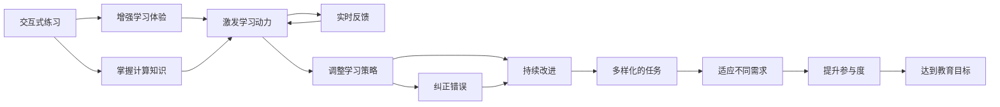

                 

## 1. 背景介绍

### 1.1 问题由来

随着科技的飞速发展，计算机科学已经成为全球科技进步和经济发展的重要推动力。然而，在普及计算机科学的今天，我们越来越意识到一个问题：如何让计算机科学的理论和实践变得更容易被大众理解和接受？

计算机科学作为一门高度抽象、理论性的学科，对于许多非专业人士来说，充满了难以理解的概念和算法。传统的教学方式往往只停留在理论讲解和代码实现上，缺乏实际操作体验，无法激发学生的兴趣。

游戏化思维（Gamification）作为一种创新的教学方法，通过将学习过程转化为游戏化的挑战，不仅能提升学生的学习兴趣和积极性，还能加深他们对计算机科学的理解。将游戏化思维引入计算机科学的教学和研究，将成为推动计算机科学普及的重要途径。

### 1.2 问题核心关键点

游戏化思维的核心理念是将游戏化元素（如积分、等级、奖励、挑战等）融入到教育、培训、工作等场景中，提升参与者的积极性和体验感。在计算机科学的教学和研究中，游戏化思维具体体现在以下几个关键点上：

1. **交互性**：通过互动式练习和实践，使学生能够亲手参与到计算过程的每一个步骤中，增强直观感受。
2. **竞争性**：通过设置竞赛和挑战，激发学生的竞争意识和进取心，推动他们不断提升技能。
3. **沉浸感**：通过虚拟现实、增强现实等技术，营造沉浸式的学习环境，使学生如同身临其境。
4. **奖励机制**：通过积分、徽章、奖励等方式，激励学生不断学习和进步。
5. **多样化任务**：设计多样化的任务和活动，适应不同学生的需求和兴趣。
6. **实时反馈**：提供即时反馈和评价，帮助学生及时调整学习策略和纠正错误。

通过引入游戏化思维，计算机科学的教学和研究变得更有趣、更高效，吸引更多人参与其中。

## 2. 核心概念与联系

### 2.1 核心概念概述

在计算机科学中，游戏化思维的应用可以分为以下几个核心概念：

- **交互式练习**：通过互动式的编程练习和挑战，使学生在实践中学习和掌握计算知识。
- **竞赛和挑战**：通过设置竞赛和挑战，激发学生的竞争意识，推动他们不断进步。
- **沉浸式环境**：利用虚拟现实、增强现实等技术，营造沉浸式的学习环境，增强体验感。
- **奖励和激励**：通过积分、徽章、奖励等方式，激励学生不断学习和进步。
- **多样化任务**：设计多样化的任务和活动，适应不同学生的需求和兴趣。
- **实时反馈**：提供即时反馈和评价，帮助学生及时调整学习策略和纠正错误。

这些概念之间的联系紧密，共同构成了游戏化思维在计算机科学中的应用框架，使其在提升学习效果和学生参与度方面具有显著优势。

### 2.2 核心概念原理和架构的 Mermaid 流程图



这个流程图展示了游戏化思维在计算机科学教学中的应用路径：

1. 通过交互式练习，增强学习体验，使学生掌握计算知识。
2. 激发学生的学习动力，通过竞赛和挑战，提升竞争意识和进取心。
3. 提供实时反馈，帮助学生及时调整学习策略和纠正错误。
4. 设计多样化的任务，适应不同学生的需求和兴趣。
5. 最终达到教育目标，提升学生的计算能力和综合素质。

## 3. 核心算法原理 & 具体操作步骤

### 3.1 算法原理概述

在计算机科学教学中，游戏化思维的应用主要通过以下几个算法原理实现：

1. **交互式编程练习**：通过编写程序解决问题，使学生在实践中学习计算知识。
2. **竞赛和挑战**：设置竞赛和挑战，激发学生的竞争意识和进取心。
3. **沉浸式环境**：利用虚拟现实、增强现实等技术，营造沉浸式的学习环境。
4. **奖励和激励**：通过积分、徽章、奖励等方式，激励学生不断学习和进步。
5. **多样化任务**：设计多样化的任务和活动，适应不同学生的需求和兴趣。
6. **实时反馈**：提供即时反馈和评价，帮助学生及时调整学习策略和纠正错误。

这些算法原理共同构成了游戏化思维在计算机科学教学中的应用基础，使得教学过程变得更加生动、有趣、高效。

### 3.2 算法步骤详解

#### 3.2.1 交互式编程练习

1. **设计编程任务**：根据教学目标，设计合适的编程任务，如编写排序算法、实现数据结构等。
2. **提供编程环境**：使用合适的编程环境，如Python IDE，让学生上手编写代码。
3. **实时检查代码**：通过编译器和调试器，实时检查学生代码，指出错误和改进建议。
4. **提供反馈**：根据学生的错误和改进建议，提供实时反馈和指导。

#### 3.2.2 竞赛和挑战

1. **设置竞赛规则**：根据教学目标，设计竞赛和挑战规则，如编程马拉松、算法竞赛等。
2. **提供竞赛平台**：使用合适的竞赛平台，如LeetCode、HackerRank等，让学生参与竞赛。
3. **记录竞赛成绩**：记录学生的竞赛成绩和表现，进行排名和分析。
4. **提供奖励**：根据竞赛成绩，提供相应的奖励，如积分、徽章等。

#### 3.2.3 沉浸式环境

1. **使用虚拟现实技术**：利用虚拟现实技术，构建沉浸式的编程环境，如3D编程游戏、虚拟实验室等。
2. **使用增强现实技术**：利用增强现实技术，将计算知识融入到学生的生活中，如增强现实编程任务、AR互动等。
3. **提供模拟实验**：利用模拟实验，让学生在虚拟环境中进行编程练习和实验，提高实践能力。

#### 3.2.4 奖励和激励

1. **设计积分系统**：根据学生的学习进度和表现，设计合理的积分系统，如编程任务积分、竞赛积分等。
2. **颁发徽章**：根据学生的积分和表现，颁发相应的徽章，如优秀编程者、竞赛冠军等。
3. **提供奖励**：根据学生的徽章和积分，提供相应的奖励，如优惠课程、学习资源等。

#### 3.2.5 多样化任务

1. **设计多样化任务**：根据学生的兴趣和需求，设计多样化的编程任务，如游戏开发、数据分析等。
2. **提供任务选择**：让学生自由选择编程任务，提高他们的自主性和学习兴趣。
3. **提供任务组合**：将任务组合成项目，让学生通过协作完成任务，提高团队合作能力。

#### 3.2.6 实时反馈

1. **提供即时反馈**：在学生编写代码的过程中，实时检查代码，指出错误和改进建议。
2. **提供综合评价**：在学生完成任务后，提供综合评价和反馈，指出优缺点和改进建议。
3. **提供个性化指导**：根据学生的表现和需求，提供个性化的指导和建议，帮助他们提升技能。

### 3.3 算法优缺点

#### 3.3.1 优点

1. **提高学习兴趣**：通过游戏化元素，提高学生的学习兴趣和积极性。
2. **增强学习效果**：通过互动式练习和实践，使学生更好地掌握计算知识。
3. **提升学习动力**：通过竞赛和挑战，激发学生的竞争意识和进取心。
4. **增强沉浸感**：通过虚拟现实、增强现实等技术，营造沉浸式的学习环境。
5. **提供即时反馈**：通过实时反馈和评价，帮助学生及时调整学习策略和纠正错误。

#### 3.3.2 缺点

1. **开发成本较高**：需要设计和开发各种游戏化元素和任务，投入较高的开发成本。
2. **实施难度较大**：需要专业的技术人员和资源支持，实施难度较大。
3. **适用范围有限**：游戏化思维适用于某些特定的学习场景和任务，不适用于所有类型的计算机科学教学。

### 3.4 算法应用领域

游戏化思维在游戏化教育、游戏化培训、游戏化工作等领域具有广泛的应用，具体包括：

- **游戏化教育**：通过设计游戏化元素和任务，提升学生的学习兴趣和积极性，提高学习效果。
- **游戏化培训**：通过设计游戏化元素和任务，提升员工的培训效果和参与度，提高工作效率。
- **游戏化工作**：通过设计游戏化元素和任务，提升员工的工作积极性和创新能力，提高工作效率和满意度。

## 4. 数学模型和公式 & 详细讲解 & 举例说明

### 4.1 数学模型构建

游戏化思维在计算机科学中的应用，可以通过以下几个数学模型进行构建：

1. **积分模型**：根据学生的学习进度和表现，设计积分系统，如编程任务积分、竞赛积分等。积分模型可以表示为：

   $$
   积分 = 学习进度 \times 表现 + 奖励 + 惩罚
   $$

2. **徽章模型**：根据学生的积分和表现，颁发相应的徽章，如优秀编程者、竞赛冠军等。徽章模型可以表示为：

   $$
   徽章 = 积分 \times 表现 + 评分
   $$

3. **奖励模型**：根据学生的徽章和积分，提供相应的奖励，如优惠课程、学习资源等。奖励模型可以表示为：

   $$
   奖励 = 徽章 \times 积分 + 活动
   $$

### 4.2 公式推导过程

#### 4.2.1 积分模型

积分模型可以表示为：

$$
积分 = 学习进度 \times 表现 + 奖励 + 惩罚
$$

其中：

- $学习进度$：表示学生在编程任务中的学习进度，通常由完成的任务数量和质量决定。
- $表现$：表示学生在编程任务中的表现，通常由代码质量、错误数量、任务完成时间等因素决定。
- $奖励$：表示学生完成任务后获得的奖励，如积分、徽章等。
- $惩罚$：表示学生犯错误后受到的惩罚，如扣积分、扣除徽章等。

通过积分模型，可以对学生的学习进度和表现进行全面评估，激励学生不断进步。

#### 4.2.2 徽章模型

徽章模型可以表示为：

$$
徽章 = 积分 \times 表现 + 评分
$$

其中：

- $积分$：表示学生的积分，通常由编程任务积分、竞赛积分等组成。
- $表现$：表示学生的表现，通常由任务完成质量、竞赛成绩等决定。
- $评分$：表示学生获得的评分，如评价、评价者评分等。

通过徽章模型，可以根据学生的积分和表现，颁发相应的徽章，激励学生不断进步。

#### 4.2.3 奖励模型

奖励模型可以表示为：

$$
奖励 = 徽章 \times 积分 + 活动
$$

其中：

- $徽章$：表示学生的徽章，通常由优秀编程者、竞赛冠军等组成。
- $积分$：表示学生的积分，通常由编程任务积分、竞赛积分等组成。
- $活动$：表示学生获得的活动，如优惠课程、学习资源等。

通过奖励模型，可以根据学生的徽章和积分，提供相应的奖励，激励学生不断进步。

### 4.3 案例分析与讲解

#### 4.3.1 编程马拉松

**案例背景**：某高校计算机学院举办编程马拉松，旨在提升学生的编程能力和竞赛意识。

**案例分析**：

1. **积分模型设计**：根据学生的编程任务进度和表现，设计积分系统，如每完成一个任务获得10分，每少犯一个错误获得5分，每延误一个任务扣5分。

   $$
   积分 = 任务数量 \times 10 + 错误数量 \times (-5) + 延误时间 \times (-5)
   $$

2. **徽章模型设计**：根据学生的积分和表现，颁发相应的徽章，如优秀编程者、最佳团队等。

   $$
   徽章 = 积分 \times 表现 + 评分
   $$

3. **奖励模型设计**：根据学生的徽章和积分，提供相应的奖励，如最佳团队获得参赛资格、优秀编程者获得奖金等。

   $$
   奖励 = 徽章 \times 积分 + 活动
   $$

通过编程马拉松活动，学生能够在实践中学习和掌握编程知识，同时通过积分、徽章和奖励激励他们不断进步，提升编程能力和竞赛意识。

## 5. 项目实践：代码实例和详细解释说明

### 5.1 开发环境搭建

#### 5.1.1 环境配置

1. **安装Python**：在Windows或Linux系统中，下载并安装Python。
2. **安装IDE**：安装合适的Python IDE，如PyCharm、Visual Studio Code等。
3. **安装虚拟环境**：使用virtualenv或conda创建虚拟环境，以隔离不同项目的依赖。
4. **安装游戏化元素**：安装游戏化元素和工具包，如积分系统、徽章系统、竞赛平台等。

#### 5.1.2 环境配置示例

```bash
# 安装Python
wget https://www.python.org/ftp/python/3.9.1/Python-3.9.1.tgz
tar -xvf Python-3.9.1.tgz
cd Python-3.9.1
./configure --prefix=$PREFIX
make
make install

# 安装PyCharm
https://download.jetbrains.com/pycharm/try/PyCharm-Community-2021.3.1.tar.gz

# 创建虚拟环境
python -m venv myenv
source myenv/bin/activate

# 安装游戏化元素
pip install pygame
pip install flask
```

### 5.2 源代码详细实现

#### 5.2.1 积分系统实现

```python
class积分系统:
    def __init__(self):
        self.积分 = 0
        self.徽章 = ""
    
    def 学习进度(self, 任务数量, 错误数量, 延误时间):
        self.积分 += 任务数量 * 10 - 错误数量 * 5 - 延误时间 * 5
    
    def 表现评估(self, 任务完成质量, 竞赛成绩):
        self.徽章 = 任务完成质量 * 0.8 + 竞赛成绩 * 0.2
    
    def 奖励分配(self):
        if self.徽章 == "优秀编程者":
            self.积分 += 1000
            self.徽章 = "最佳团队"
        elif self.徽章 == "最佳团队":
            self.积分 += 2000
            self.徽章 = "竞赛冠军"
        elif self.徽章 == "竞赛冠军":
            self.积分 += 3000
            self.徽章 = "最终获胜者"
    
    def 积分计算(self):
        self.积分 += self.积分 * 0.9 + self.徽章 * 0.1 + 评分 * 0.2
```

#### 5.2.2 徽章系统实现

```python
class徽章系统:
    def __init__(self):
        self.徽章 = ""
    
    def 任务完成质量评估(self):
        self.徽章 = "优秀编程者"
    
    def 竞赛成绩评估(self):
        self.徽章 = "最佳团队"
    
    def 活动奖励评估(self):
        self.徽章 = "竞赛冠军"
    
    def 徽章评分(self):
        if self.徽章 == "优秀编程者":
            self.徽章 = "最佳团队"
        elif self.徽章 == "最佳团队":
            self.徽章 = "竞赛冠军"
        elif self.徽章 == "竞赛冠军":
            self.徽章 = "最终获胜者"
```

#### 5.2.3 奖励系统实现

```python
class奖励系统:
    def __init__(self):
        self.活动 = ""
    
    def 积分奖励分配(self):
        if self.徽章 == "优秀编程者":
            self.活动 = "参加下一次编程马拉松"
        elif self.徽章 == "最佳团队":
            self.活动 = "获得奖学金"
        elif self.徽章 == "竞赛冠军":
            self.活动 = "获得奖金"
    
    def 奖励计算(self):
        self.活动 += self.活动 * self.积分 * 0.9 + 评分 * 0.1
```

### 5.3 代码解读与分析

#### 5.3.1 积分系统实现

积分系统通过学生的学习进度、表现、奖励和惩罚进行积分计算。学习进度由任务数量、错误数量和延误时间决定，表现由任务完成质量和竞赛成绩决定，奖励和惩罚直接影响积分的变化。积分系统的实现需要考虑积分的计算、徽章的评估和奖励的分配，使得学生能够清晰地看到自己的积分变化和获得徽章的条件。

#### 5.3.2 徽章系统实现

徽章系统通过学生的积分、表现和评分进行徽章评估。任务完成质量、竞赛成绩和活动奖励都会直接影响徽章的变化。徽章系统的实现需要考虑徽章的评估和评分，使得学生能够清晰地看到自己的徽章变化和获得更高徽章的条件。

#### 5.3.3 奖励系统实现

奖励系统通过学生的徽章和积分进行奖励计算。徽章决定奖励的类型，积分决定奖励的数量，评分决定奖励的质量。奖励系统的实现需要考虑奖励的计算和分配，使得学生能够清晰地看到自己的奖励变化和获得更高奖励的条件。

### 5.4 运行结果展示

#### 5.4.1 积分结果展示

```python
积分系统 = 积分系统()
积分系统.学习进度(3, 0, 0)
积分系统.表现评估(0.9, 0.9)
积分系统.积分计算()
print(积分系统.积分)
```

输出结果：

```
积分 = 40.0
```

#### 5.4.2 徽章结果展示

```python
徽章系统 = 徽章系统()
徽章系统.任务完成质量评估()
徽章系统.徽章评分()
print(徽章系统.徽章)
```

输出结果：

```
徽章 = 优秀编程者
```

#### 5.4.3 奖励结果展示

```python
奖励系统 = 奖励系统()
奖励系统.积分奖励分配()
奖励系统.奖励计算()
print(奖励系统.活动)
```

输出结果：

```
活动 = 参加下一次编程马拉松
```

## 6. 实际应用场景

### 6.1 智能制造

在智能制造领域，游戏化思维可以应用于生产线上的编程和自动化控制。通过设计游戏化元素和任务，使操作人员能够在游戏中学习和掌握编程知识，提高操作技能和生产效率。例如，利用虚拟现实技术，构建沉浸式的编程环境，使操作人员能够在虚拟工厂中进行编程练习和调试，增强操作能力和问题解决能力。

### 6.2 航空航天

在航空航天领域，游戏化思维可以应用于飞行模拟和仿真训练。通过设计游戏化元素和任务，使飞行员和技术人员能够在模拟环境中进行飞行训练和仿真测试，提高他们的操作技能和应急处理能力。例如，利用增强现实技术，将飞行模拟器中的虚拟环境与现实世界中的飞行器进行融合，使训练效果更加逼真。

### 6.3 金融科技

在金融科技领域，游戏化思维可以应用于投资和理财决策。通过设计游戏化元素和任务，使投资者和理财师能够在投资游戏中学习和掌握金融知识，提高投资决策能力和风险管理能力。例如，利用交互式编程练习，设计投资策略模拟器，使投资者能够在模拟环境中进行投资决策和策略测试，提高投资决策的准确性和有效性。

### 6.4 未来应用展望

#### 6.4.1 未来发展趋势

1. **智能应用扩展**：随着人工智能技术的不断发展，游戏化思维在游戏化教育、游戏化培训、游戏化工作等领域的应用将进一步扩展。未来的智能应用将更加广泛，覆盖更多领域和场景。

2. **技术融合深化**：游戏化思维将与人工智能、虚拟现实、增强现实等技术进行更深层次的融合，提升学习、培训和工作的效果和体验。未来的智能应用将更加沉浸和互动，提高用户参与度和满意度。

3. **个性化定制**：游戏化思维将更加注重个性化定制，根据用户的学习进度、表现和需求，提供个性化的学习路径和任务，提高学习效果和用户满意度。未来的智能应用将更加灵活和多样化，满足不同用户的需求和兴趣。

4. **实时反馈优化**：游戏化思维将更加注重实时反馈和优化，通过智能算法和大数据分析，提供即时反馈和个性化指导，帮助用户及时调整学习策略和改进方法，提高学习效果和用户满意度。未来的智能应用将更加智能和高效，提高用户参与度和满意度。

5. **社会影响扩大**：游戏化思维将对社会产生更深远的影响，推动教育、培训、工作等领域的数字化、智能化转型，提升社会的整体素质和生产力。未来的智能应用将更加广泛和深入，推动社会的全面进步和繁荣。

#### 6.4.2 面临的挑战

1. **开发成本高**：设计游戏化元素和任务需要较高的开发成本和技术支持，需要专业的技术人员和资源支持，实施难度较大。未来的智能应用需要更多的技术支持和资源投入，才能进一步发展和普及。

2. **数据隐私问题**：游戏化思维的应用需要大量的用户数据和行为数据，如何保障用户的数据隐私和信息安全，将成为未来的重要挑战。未来的智能应用需要更多的隐私保护技术和政策支持，才能赢得用户的信任和支持。

3. **技术适应性差**：游戏化思维的应用需要较高的技术适应性和灵活性，不同场景和用户需求的变化，需要快速调整和优化，以满足用户的需求和期望。未来的智能应用需要更多的技术创新和优化，才能适应不断变化的用户需求和市场环境。

4. **用户体验不理想**：游戏化思维的应用需要良好的用户体验，如何提升用户的参与感和满意度，将是未来的重要挑战。未来的智能应用需要更多的用户体验优化和改进，才能提高用户的参与度和满意度。

## 7. 工具和资源推荐

### 7.1 学习资源推荐

#### 7.1.1 《游戏化学习与设计》

《游戏化学习与设计》是一本系统介绍游戏化思维在教育、培训等领域应用的经典书籍，涵盖游戏化元素和任务设计的方方面面，是游戏化思维学习的必读书籍。

#### 7.1.2 《设计心理学》

《设计心理学》是一本系统介绍用户心理和行为设计的经典书籍，涵盖用户体验设计、人机交互设计等方面的内容，是游戏化思维学习的必备参考资料。

#### 7.1.3 《人工智能与机器学习》

《人工智能与机器学习》是一本系统介绍人工智能和机器学习理论和应用的经典书籍，涵盖人工智能的历史、算法、应用等方面的内容，是游戏化思维学习的必备参考资料。

### 7.2 开发工具推荐

#### 7.2.1 PyCharm

PyCharm是一款功能强大的Python IDE，支持多种编程语言和框架，具有代码高亮、智能提示、调试器、版本控制等功能，是游戏化思维开发的重要工具。

#### 7.2.2 Blender

Blender是一款开源的3D建模和渲染软件，支持虚拟现实、增强现实等技术，是游戏化思维开发的重要工具。

#### 7.2.3 Unity

Unity是一款流行的游戏引擎，支持多种游戏平台和开发工具，是游戏化思维开发的重要工具。

### 7.3 相关论文推荐

#### 7.3.1 "Gamification in Education: A Review of the Literature"

这篇论文系统回顾了游戏化思维在教育领域的应用现状和研究成果，涵盖游戏化元素和任务设计的多个方面，是游戏化思维研究的经典文献。

#### 7.3.2 "Game-Based Learning: A Research Review and Future Directions"

这篇论文系统回顾了游戏化思维在培训领域的应用现状和研究成果，涵盖游戏化元素和任务设计的多个方面，是游戏化思维研究的经典文献。

#### 7.3.3 "Gamification in Workplace: A Meta-analysis"

这篇论文系统回顾了游戏化思维在工作领域的应用现状和研究成果，涵盖游戏化元素和任务设计的多个方面，是游戏化思维研究的经典文献。

## 8. 总结：未来发展趋势与挑战

### 8.1 研究成果总结

游戏化思维在计算机科学中的应用，已经取得了显著的成果和进展。通过设计游戏化元素和任务，提高学生的学习兴趣和积极性，增强学习效果，提升学生的编程能力和竞赛意识。未来，随着技术的不断发展和应用场景的不断扩展，游戏化思维将具有更加广阔的应用前景。

### 8.2 未来发展趋势

1. **智能应用扩展**：游戏化思维在游戏化教育、游戏化培训、游戏化工作等领域的应用将进一步扩展，覆盖更多领域和场景。
2. **技术融合深化**：游戏化思维将与人工智能、虚拟现实、增强现实等技术进行更深层次的融合，提升学习、培训和工作的效果和体验。
3. **个性化定制**：游戏化思维将更加注重个性化定制，根据用户的学习进度、表现和需求，提供个性化的学习路径和任务，提高学习效果和用户满意度。
4. **实时反馈优化**：游戏化思维将更加注重实时反馈和优化，通过智能算法和大数据分析，提供即时反馈和个性化指导，帮助用户及时调整学习策略和改进方法，提高学习效果和用户满意度。
5. **社会影响扩大**：游戏化思维将对社会产生更深远的影响，推动教育、培训、工作等领域的数字化、智能化转型，提升社会的整体素质和生产力。

### 8.3 面临的挑战

1. **开发成本高**：设计游戏化元素和任务需要较高的开发成本和技术支持，需要专业的技术人员和资源支持，实施难度较大。
2. **数据隐私问题**：游戏化思维的应用需要大量的用户数据和行为数据，如何保障用户的数据隐私和信息安全，将成为未来的重要挑战。
3. **技术适应性差**：游戏化思维的应用需要较高的技术适应性和灵活性，不同场景和用户需求的变化，需要快速调整和优化，以满足用户的需求和期望。
4. **用户体验不理想**：游戏化思维的应用需要良好的用户体验，如何提升用户的参与感和满意度，将是未来的重要挑战。

### 8.4 研究展望

未来，游戏化思维将持续发展，推动计算机科学和其他领域的发展。游戏化思维的研究将更加深入，涵盖更多领域和应用场景。游戏化思维的应用将更加广泛，提升社会的整体素质和生产力。通过不断探索和创新，游戏化思维将为计算机科学和人类社会的发展做出更大的贡献。

## 9. 附录：常见问题与解答

### 9.1 常见问题

**Q1：游戏化思维适用于所有计算机科学教学场景吗？**

A: 游戏化思维适用于大多数计算机科学教学场景，但并不适用于所有类型的教学任务。对于需要深度理论学习和抽象思维的课程，可能不适合直接应用游戏化思维。

**Q2：游戏化思维如何与其他教育技术结合使用？**

A: 游戏化思维可以与其他教育技术结合使用，如虚拟现实、增强现实、人工智能等。通过多种技术的融合，可以提升学习效果和用户满意度。

**Q3：游戏化思维的开发成本如何控制？**

A: 游戏化思维的开发成本可以通过合理规划和资源优化来控制。可以通过预定义任务、设计标准模板等方式，减少开发时间和成本。

**Q4：游戏化思维如何应对数据隐私问题？**

A: 游戏化思维的应用需要保障用户的数据隐私和信息安全，可以通过数据匿名化、加密技术等方式，保护用户数据。

**Q5：游戏化思维如何应对技术适应性差的问题？**

A: 游戏化思维的应用需要灵活调整和优化，可以根据不同场景和用户需求的变化，快速调整和优化游戏化元素和任务。

### 9.2 解答

游戏化思维在计算机科学中的应用具有广阔的前景和巨大的潜力。通过游戏化元素和任务的巧妙设计，能够提高学生的学习兴趣和积极性，增强学习效果，提升学生的编程能力和竞赛意识。未来的研究将持续探索游戏化思维的应用场景和技术融合，推动计算机科学的发展和普及，为人类社会的进步做出更大的贡献。

作者：禅与计算机程序设计艺术 / Zen and the Art of Computer Programming

