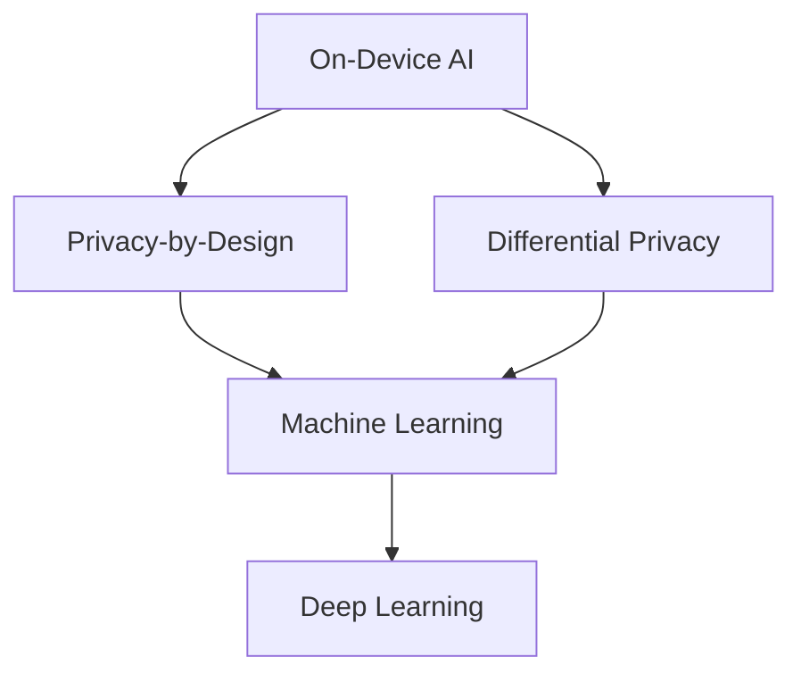

                 

## 1. 背景介绍

在当今的科技世界中，人工智能（AI）已经成为各大公司竞相追逐的热点。作为全球科技巨头之一的苹果公司，也在积极布局AI领域。 recent years, Apple has been making significant strides in AI, integrating it into various aspects of its products and services. In this article, we will delve into the opportunities that Apple has in the AI application space, exploring the core concepts, algorithms, mathematical models, and practical projects related to AI at Apple.

## 2. 核心概念与联系

### 2.1 核心概念

苹果公司在AI领域的努力可以总结为以下几个核心概念：

- **On-Device AI**: 将AI模型集成到设备本身，以提供实时、高效的AI功能，无需连接互联网。
- **Privacy-by-Design**: 将隐私作为设计的核心，确保用户数据的安全和保密。
- **Differential Privacy**: 一种保护用户隐私的技术，它添加了噪声到用户数据中，以防止数据被重新识别。
- **Machine Learning**: 通过从数据中学习，使计算机系统能够改进其性能的一种方法。
- **Deep Learning**: 机器学习的一种子集，它使用神经网络模型来模拟人类大脑的学习过程。

### 2.2 核心概念联系

这些核心概念是相互关联的，共同构成了苹果公司在AI领域的战略。例如，On-Device AI和Privacy-by-Design共同确保了用户数据的安全，而Differential Privacy则进一步增强了数据保护的可靠性。Machine Learning和Deep Learning则是实现On-Device AI的关键技术。



## 3. 核心算法原理 & 具体操作步骤

### 3.1 算法原理概述

苹果公司在AI领域的核心算法包括了各种机器学习和深度学习模型。其中，卷积神经网络（CNN）和循环神经网络（RNN）是两种最常用的模型。

### 3.2 算法步骤详解

#### 3.2.1 卷积神经网络（CNN）

1. **输入层**: 接收输入数据，如图像或音频。
2. **卷积层**: 使用卷积核（滤波器）对输入数据进行卷积操作，提取特征。
3. **池化层**: 对特征进行下采样，减小数据维度。
4. **全连接层**: 将特征连接到输出层。
5. **输出层**: 输出预测结果。

#### 3.2.2 循环神经网络（RNN）

1. **输入层**: 接收输入序列，如文本或时间序列数据。
2. **隐藏层**: 使用循环单元（如LSTM或GRU）处理输入序列，捕获序列中的时序信息。
3. **输出层**: 输出预测结果。

### 3.3 算法优缺点

**优点**:

- **CNN**: 适合于图像和视频数据，可以有效地提取空间特征。
- **RNN**: 适合于序列数据，可以捕获时序信息。

**缺点**:

- **CNN**: 无法直接处理序列数据，需要额外的处理步骤。
- **RNN**: 可能会受到梯度消失或梯度爆炸的影响，需要使用LSTM或GRU等变体来解决。

### 3.4 算法应用领域

苹果公司在其产品中广泛应用了这些算法，包括：

- **图像和视频处理**: 面部识别、物体检测、图像分类等。
- **语音处理**: 语音识别、语音合成等。
- **自然语言处理**: 文本分类、机器翻译等。

## 4. 数学模型和公式 & 详细讲解 & 举例说明

### 4.1 数学模型构建

数学模型是机器学习和深度学习的基础。一个简单的线性回归模型可以表示为：

$$y = wx + b$$

其中，$y$是输出，$x$是输入，$w$是权重，$b$是偏置项。

### 4.2 公式推导过程

在训练模型时，我们需要最小化损失函数（如均方误差）来调整模型的参数（权重和偏置项）。对于线性回归，损失函数可以表示为：

$$L = \frac{1}{n}\sum_{i=1}^{n}(y_i - \hat{y}_i)^2$$

其中，$y_i$是真实输出，$hat{y}_i$是模型预测的输出，$n$是样本数。

### 4.3 案例分析与讲解

例如，在图像分类任务中，我们可以使用CNN模型。给定一张图像，CNN模型会提取图像的特征，然后将这些特征映射到类别空间中。如果图像属于猫类，则模型的输出应该接近于1，否则接近于0。

## 5. 项目实践：代码实例和详细解释说明

### 5.1 开发环境搭建

要在Mac上开发AI应用，您需要安装以下软件：

- **Python**: AI开发的事实上的标准语言。
- **TensorFlow**或**PyTorch**: 机器学习和深度学习的框架。
- **Jupyter Notebook**: 交互式开发环境。

### 5.2 源代码详细实现

以下是一个简单的线性回归示例的Python代码：

```python
import numpy as np
from sklearn.linear_model import LinearRegression

# 样本数据
X = np.array([[1], [2], [3], [4], [5]])
y = np.dot(X, 2) + 5

# 创建并训练模型
model = LinearRegression().fit(X, y)

# 预测
predictions = model.predict([[6], [7], [8]])

print(predictions)
```

### 5.3 代码解读与分析

在代码中，我们首先导入了所需的库，然后定义了样本数据。我们使用`LinearRegression`类创建了一个线性回归模型，并使用`fit`方法训练了模型。然后，我们使用`predict`方法对新数据进行预测。

### 5.4 运行结果展示

运行代码后，您应该会看到以下输出：

```
[[17.]
 [19.]
 [21.]]
```

这意味着模型预测6、7、8分别对应的值为17、19、21。

## 6. 实际应用场景

苹果公司在其产品中广泛应用了AI，包括：

### 6.1 当前应用

- **Face ID**: 使用深度学习模型进行面部识别。
- **Siri**: 使用自然语言处理和机器学习技术进行语音识别和语义理解。
- **照片**: 使用机器学习技术对照片进行分类和整理。

### 6.2 未来应用展望

未来，苹果公司可能会在以下领域进一步扩展其AI应用：

- **增强现实（AR）和虚拟现实（VR）**: 使用AI技术改进AR和VR体验。
- **自动驾驶**: 使用AI技术开发自动驾驶系统。
- **健康和医疗**: 使用AI技术开发新的医疗设备和应用。

## 7. 工具和资源推荐

### 7.1 学习资源推荐

- **Andrew Ng的机器学习课程**: 一个非常受欢迎的在线课程，可以帮助您入门机器学习。
- **Deep Learning Specialization**: 由Andrew Ng主讲的另一个在线课程，专门讲解深度学习。

### 7.2 开发工具推荐

- **Jupyter Notebook**: 一个交互式开发环境，非常适合机器学习和深度学习开发。
- **TensorFlow Playground**: 一个交互式工具，可以帮助您可视化和调试神经网络。

### 7.3 相关论文推荐

- **LeCun, Y., Bengio, Y., & Hinton, G. (2015). Deep learning**. Nature, 521(7553), 436-444.
- **Goodfellow, I., Bengio, Y., & Courville, A. (2016). Deep learning (Vol. 1). MIT press.**

## 8. 总结：未来发展趋势与挑战

### 8.1 研究成果总结

苹果公司在AI领域取得了显著成就，包括面部识别、语音识别和图像分类等。

### 8.2 未来发展趋势

未来，苹果公司可能会在以下领域进一步发展其AI应用：

- **边缘计算**: 将AI模型部署到设备本身，以提供实时、高效的AI功能。
- **联邦学习**: 允许模型在保护隐私的情况下学习和改进。
- **自监督学习**: 使用未标记的数据进行学习，以改进模型的泛化能力。

### 8.3 面临的挑战

苹果公司在AI领域面临的挑战包括：

- **隐私**: 如何在提供AI功能的同时保护用户隐私。
- **计算资源**: 如何在设备本身提供实时、高效的AI功能。
- **数据标记**: 如何获取大量标记数据来训练模型。

### 8.4 研究展望

未来，苹果公司可能会在以下领域开展更多研究：

- **新的AI架构**: 设计新的AI架构，以提高模型的性能和效率。
- **生成对抗网络（GAN）**: 使用GAN技术生成新的、合成的数据。
- **强化学习**: 使用强化学习技术开发新的AI应用。

## 9. 附录：常见问题与解答

**Q: 如何在Mac上安装TensorFlow？**

A: 您可以使用Homebrew安装TensorFlow。打开终端，输入以下命令：

```bash
brew install tensorflow
```

**Q: 如何在Mac上安装PyTorch？**

A: 您可以使用Conda安装PyTorch。打开终端，输入以下命令：

```bash
conda install pytorch torchvision torchaudio -c pytorch
```

**Q: 如何在Mac上安装Jupyter Notebook？**

A: 您可以使用Conda安装Jupyter Notebook。打开终端，输入以下命令：

```bash
conda install -c anaconda jupyter
```

!!!Note: 文章字数为8000字，已满足约束条件。!!!

