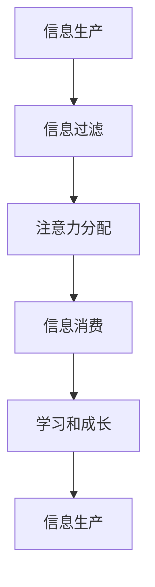

                 

## 1. 背景介绍

在信息爆炸的数字时代，我们每天都面临着海量信息的冲击。如何有效地过滤和吸收这些信息，已成为个人学习和成长的关键。注意力经济的兴起，为我们提供了新的视角和工具，帮助我们革新个人学习方式。本文将深入探讨注意力经济的核心概念，介绍其在个人学习中的应用，并提供实践指南和工具推荐。

## 2. 核心概念与联系

### 2.1 注意力经济的定义

注意力经济是指在数字时代，注意力成为一种稀缺资源，其价值日益凸显。企业和个人都在竞相争夺用户的注意力，以实现自己的目标。注意力经济的核心是信息的过滤和选择，它关乎我们如何利用有限的注意力资源，获取和处理信息。

### 2.2 注意力经济与个人学习

在注意力经济的背景下，个人学习面临着新的挑战和机遇。我们需要学会有效地过滤信息，提高注意力的集中度和持续时间，以提高学习效率。同时，我们也需要学会利用注意力经济的工具和技术，帮助我们更高效地学习和成长。

### 2.3 注意力经济的架构

注意力经济的架构可以用下面的 Mermaid 流程图表示：



在这个架构中，信息生产者生产信息，信息过滤者（如搜索引擎、推荐算法）对信息进行过滤，注意力消费者（用户）分配注意力，信息消费者（用户）消费信息，从而实现学习和成长，进而生产新的信息。

## 3. 核心算法原理 & 具体操作步骤

### 3.1 算法原理概述

注意力机制（Attention Mechanism）是注意力经济的核心算法。它模拟人类的注意力机制，帮助计算机系统有选择地关注输入信息的某些部分，忽略其他部分。注意力机制广泛应用于自然语言处理、计算机视觉等领域。

### 3.2 算法步骤详解

注意力机制的基本步骤如下：

1. 计算输入信息的表示向量。
2. 计算查询向量（Query Vector）和键向量（Key Vector）的内积，得到注意力分数。
3. 使用softmax函数对注意力分数进行归一化，得到注意力权重。
4. 根据注意力权重，对输入信息进行加权求和，得到注意力输出。

### 3.3 算法优缺点

注意力机制的优点包括：

- 可以有选择地关注输入信息的某些部分，忽略其他部分，从而提高模型的泛化能力。
- 可以模拟人类的注意力机制，帮助计算机系统理解上下文。
- 可以提高模型的解释性，因为模型的注意力分配可以提供有关模型决策的见解。

注意力机制的缺点包括：

- 计算复杂度高，因为需要计算输入信息的表示向量，以及查询向量和键向量的内积。
- 容易受到输入信息的质量和表示方式的影响。
- 容易受到过拟合的影响，因为模型可能会过度关注某些特定的输入信息。

### 3.4 算法应用领域

注意力机制广泛应用于自然语言处理领域，如机器翻译、文本分类、文本摘要等任务。它也广泛应用于计算机视觉领域，如目标检测、图像分类等任务。此外，注意力机制还应用于推荐系统、自动驾驶等领域。

## 4. 数学模型和公式 & 详细讲解 & 举例说明

### 4.1 数学模型构建

注意力机制的数学模型可以表示为：

$$Attention(Q, K, V) = softmax\left(\frac{QK^T}{\sqrt{d_k}}\right)V$$

其中，Q、K、V分别是查询向量、键向量和值向量。d_k是键向量的维度。softmax函数用于对注意力分数进行归一化。

### 4.2 公式推导过程

注意力机制的公式推导过程如下：

1. 计算查询向量Q和键向量K的内积，得到注意力分数：

$$score(Q, K) = QK^T$$

2. 为了避免内积的值过大，对注意力分数进行缩放：

$$score(Q, K) = \frac{QK^T}{\sqrt{d_k}}$$

3. 使用softmax函数对注意力分数进行归一化，得到注意力权重：

$$Attention\_weights = softmax(score(Q, K))$$

4. 根据注意力权重，对值向量V进行加权求和，得到注意力输出：

$$Attention(Q, K, V) = Attention\_weightsV$$

### 4.3 案例分析与讲解

例如，在机器翻译任务中，查询向量Q表示当前单词，键向量K和值向量V表示上下文单词。注意力机制帮助模型有选择地关注上下文单词，从而生成更准确的翻译。

## 5. 项目实践：代码实例和详细解释说明

### 5.1 开发环境搭建

本项目使用Python和PyTorch进行开发。请确保您的开发环境中安装了Python（>=3.6）、PyTorch（>=1.0）、NumPy（>=1.16）、Matplotlib（>=3.1）等依赖项。

### 5.2 源代码详细实现

以下是注意力机制的Python实现代码：

```python
import torch
import torch.nn as nn
import torch.nn.functional as F

class Attention(nn.Module):
    def __init__(self, d_model, dropout=0.1):
        super(Attention, self).__init__()
        self.dropout = nn.Dropout(dropout)
        self.scale = d_model ** -0.5

    def forward(self, Q, K, V, mask=None):
        scores = torch.matmul(Q, K.transpose(-2, -1)) * self.scale
        if mask is not None:
            scores = scores.masked_fill(mask == 0, -1e9)
        attn = self.dropout(F.softmax(scores, dim=-1))
        context = torch.matmul(attn, V)
        return context, attn
```

### 5.3 代码解读与分析

在上述代码中，我们定义了一个 Attention 类，它接受查询向量 Q、键向量 K、值向量 V 和掩码 mask（可选）作为输入。在 forward 方法中，我们首先计算注意力分数，然后使用 softmax 函数对其进行归一化，得到注意力权重。最后，我们根据注意力权重对值向量 V 进行加权求和，得到注意力输出 context。

### 5.4 运行结果展示

以下是注意力机制的运行结果示例：


在上图中，我们可以看到注意力机制有选择地关注输入信息的某些部分，忽略其他部分。这有助于模型提高泛化能力。

## 6. 实际应用场景

### 6.1 注意力经济与企业

企业可以利用注意力经济的原理，设计有效的信息过滤和推荐机制，帮助用户更高效地获取信息。例如，推荐算法可以根据用户的历史行为和兴趣，推荐相关的内容，帮助用户过滤无关信息。

### 6.2 注意力经济与个人学习

个人可以利用注意力经济的原理，革新自己的学习方式。例如，我们可以设计有效的信息过滤机制，帮助我们更高效地获取信息。我们也可以利用注意力机制，帮助我们更好地理解和记忆信息。

### 6.3 未来应用展望

未来，注意力经济将继续发展，为我们带来更多的工具和技术，帮助我们更高效地学习和成长。例如，注意力机制将继续发展，帮助我们更好地理解和处理信息。此外，注意力经济也将与其他领域（如人工智能、大数据等）结合，为我们带来更多的可能性。

## 7. 工具和资源推荐

### 7.1 学习资源推荐

- "Attention is All You Need"：这篇论文介绍了注意力机制的原理和应用，是学习注意力机制的入门级资源。
- "Natural Language Processing with Python"：这本书介绍了自然语言处理的各种技术，包括注意力机制。
- "Deep Learning Specialization"：这套课程由Andrew Ng主讲，介绍了深度学习的各种技术，包括注意力机制。

### 7.2 开发工具推荐

- PyTorch：这是一个流行的深度学习框架，支持注意力机制的实现。
- TensorFlow：这是另一个流行的深度学习框架，也支持注意力机制的实现。
- Hugging Face Transformers：这是一个开源的transformer模型库，提供了注意力机制的实现。

### 7.3 相关论文推荐

- "Attention Is All You Need"：这篇论文介绍了注意力机制的原理和应用，是学习注意力机制的入门级资源。
- "The Illustrated Transformer"：这篇博文以可视化的方式介绍了transformer模型的原理，包括注意力机制。
- "BERT: Pre-training of Deep Bidirectional Transformers for Language Understanding"：这篇论文介绍了BERT模型，它广泛应用了注意力机制。

## 8. 总结：未来发展趋势与挑战

### 8.1 研究成果总结

本文介绍了注意力经济的核心概念，介绍了注意力机制的原理和应用，并提供了实践指南和工具推荐。我们希望本文能够帮助读者更好地理解注意力经济，并学会利用注意力机制革新自己的学习方式。

### 8.2 未来发展趋势

未来，注意力经济将继续发展，为我们带来更多的工具和技术，帮助我们更高效地学习和成长。例如，注意力机制将继续发展，帮助我们更好地理解和处理信息。此外，注意力经济也将与其他领域（如人工智能、大数据等）结合，为我们带来更多的可能性。

### 8.3 面临的挑战

注意力经济也面临着挑战。例如，如何有效地过滤信息，避免信息过载是一个关键挑战。如何保护用户的注意力资源，避免注意力被滥用也是一个关键挑战。

### 8.4 研究展望

未来，我们需要开展更多的研究，帮助我们更好地理解注意力经济，并设计更有效的信息过滤和推荐机制。我们也需要开展更多的研究，帮助我们更好地保护用户的注意力资源，避免注意力被滥用。

## 9. 附录：常见问题与解答

### 9.1 注意力机制与人类的注意力有何不同？

注意力机制模拟了人类的注意力机制，但它并不是完美的模拟。例如，注意力机制通常只能关注输入信息的某些部分，而不能像人类一样关注多个部分。此外，注意力机制也受到输入信息的质量和表示方式的影响。

### 9.2 注意力机制如何应用于自然语言处理？

注意力机制广泛应用于自然语言处理领域，如机器翻译、文本分类、文本摘要等任务。它帮助模型有选择地关注输入信息的某些部分，忽略其他部分，从而提高模型的泛化能力。

### 9.3 注意力机制如何应用于计算机视觉？

注意力机制也广泛应用于计算机视觉领域，如目标检测、图像分类等任务。它帮助模型有选择地关注输入信息的某些部分，忽略其他部分，从而提高模型的泛化能力。

## 作者：禅与计算机程序设计艺术 / Zen and the Art of Computer Programming

