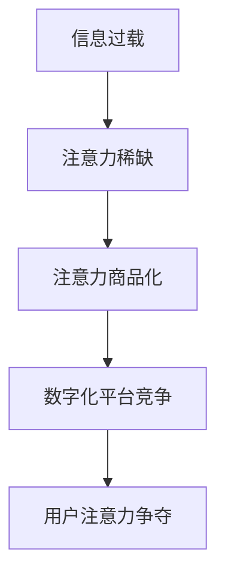

                 

## 1. 背景介绍

在当今信息爆炸的时代，注意力资源变得弥足珍贵。随着互联网的发展，数字化平台和应用程序的繁荣，我们每天接触的信息量呈指数级增长。与此同时，个人职业规划也面临着前所未有的挑战。如何在注意力经济中谋求发展，如何调整个人职业规划以适应快速变化的技术环境，成为当前亟待解决的问题。

## 2. 核心概念与联系

### 2.1 注意力经济

注意力经济是指在信息过载的情况下，注意力资源变得稀缺，从而成为一种有价值的商品。在数字化平台上，用户的注意力是最宝贵的资源，各种应用程序和广告都在竞相争夺用户的注意力。理解注意力经济的运作机制，有助于我们在信息过载的环境中做出明智的决策。



### 2.2 个人职业规划

个人职业规划是指个体对自己未来职业生涯的设计和规划。在注意力经济的背景下，个人职业规划需要考虑技术变化对就业市场的影响，以及如何培养和保持竞争力。

## 3. 核心算法原理 & 具体操作步骤

### 3.1 算法原理概述

在注意力经济中，机器学习算法， particularly 自然语言处理（NLP）和推荐系统，扮演着关键角色。这些算法帮助数字化平台优化内容推荐，从而争夺用户的注意力。理解这些算法的原理，有助于我们更好地理解注意力经济的运作机制。

### 3.2 算法步骤详解

#### 3.2.1 自然语言处理

NLP 算法的目标是理解和生成人类语言。在注意力经济中，NLP 算法用于分析用户的兴趣，从而推荐相关内容。常用的 NLP 技术包括词嵌入（Word Embedding）、注意力机制（Attention Mechanism）和序列到序列模型（Sequence-to-Sequence Models）。

#### 3.2.2 推荐系统

推荐系统的目标是为用户提供个性化的内容推荐。常用的推荐系统算法包括协同过滤（Collaborative Filtering）、内容过滤（Content-based Filtering）和混合过滤（Hybrid Filtering）。

### 3.3 算法优缺点

#### 3.3.1 优点

* 个性化推荐：算法可以根据用户的兴趣和行为习惯，提供个性化的内容推荐。
* 信息过滤：算法可以帮助用户从海量信息中筛选出相关内容，节省时间和精力。

#### 3.3.2 缺点

* 信息茧房效应（Filter Bubble）：算法可能会导致用户接触到的信息过于单一，从而形成信息茧房。
* 算法偏见：算法的训练数据可能存在偏见，从而导致推荐结果存在偏见。

### 3.4 算法应用领域

* 社交媒体平台：推荐用户感兴趣的内容，提高用户参与度。
* 电子商务平台：推荐用户可能感兴趣的商品，提高销售额。
* 在线视频平台：推荐用户可能感兴趣的视频，提高用户粘性。

## 4. 数学模型和公式 & 详细讲解 & 举例说明

### 4.1 数学模型构建

在注意力经济中，数学模型用于描述用户的注意力分配。一个简单的数学模型是注意力分配函数（Attention Distribution Function），它描述了用户在不同内容上的注意力分配。

### 4.2 公式推导过程

设 $C = \{c_1, c_2,..., c_n\}$ 是一组内容，$U = \{u_1, u_2,..., u_m\}$ 是一组用户，$A_{ij}$ 是用户 $u_i$ 对内容 $c_j$ 的注意力分配。注意力分配函数可以表示为：

$$A_{ij} = f(u_i, c_j, \theta)$$

其中 $f$ 是注意力分配函数，$theta$ 是模型的参数。

### 4.3 案例分析与讲解

例如，在社交媒体平台上，用户 $u_i$ 对内容 $c_j$ 的注意力分配可以表示为：

$$A_{ij} = \frac{\exp(s_{ij})}{\sum_{k=1}^{n}\exp(s_{ik})}$$

其中 $s_{ij}$ 是用户 $u_i$ 对内容 $c_j$ 的相关性评分。注意力分配函数描述了用户在不同内容上的注意力分配，从而帮助平台优化内容推荐。

## 5. 项目实践：代码实例和详细解释说明

### 5.1 开发环境搭建

要实现注意力经济相关的算法，需要搭建 Python 开发环境，并安装相关的库，如 TensorFlow、PyTorch 和 Scikit-learn。

### 5.2 源代码详细实现

以下是一个简单的内容推荐系统的 Python 实现，使用协同过滤算法：

```python
import pandas as pd
from surprise import KNNWithMeans

# 加载数据
ratings = pd.read_csv('ratings.csv')

# 训练模型
model = KNNWithMeans(k=50, sim_options={'name': 'pearson_baseline', 'user_based': True})
model.fit(ratings)

# 推荐内容
user_id = 'u1'
content_id = 'c1'
prediction = model.predict(user_id, content_id)
print(f'推荐内容：{content_id}，预测评分：{prediction.est}')
```

### 5.3 代码解读与分析

在上述代码中，我们首先加载用户评分数据，然后使用 KNNWithMeans 算法训练模型。在推荐内容时，我们使用模型预测用户对内容的评分，并推荐评分最高的内容。

### 5.4 运行结果展示

运行上述代码后，输出推荐内容及其预测评分。例如：

```
推荐内容：c1，预测评分：4.5
```

## 6. 实际应用场景

### 6.1 注意力经济与个人职业规划

在注意力经济中，个人职业规划需要考虑技术变化对就业市场的影响。例如，自动化和人工智能技术的发展可能会导致某些岗位消失，但也会创造新的岗位。因此，个人需要不断学习和更新技能，以适应快速变化的就业市场。

### 6.2 注意力经济与企业竞争

在注意力经济中，企业需要竞相争夺用户的注意力。企业需要开发个性化的内容，并使用算法优化内容推荐，从而提高用户参与度和忠诚度。

### 6.3 注意力经济与公共政策

注意力经济对公共政策提出了新的挑战。例如，如何防止算法偏见导致的不公平现象？如何防止信息茧房效应导致的信息孤岛现象？这些都是亟待解决的问题。

### 6.4 未来应用展望

未来，注意力经济将继续发展，数字化平台和应用程序将变得更加智能和个性化。个人和企业需要不断适应技术变化，培养和保持竞争力。

## 7. 工具和资源推荐

### 7.1 学习资源推荐

* "注意力经济"（The Attention Economy）一书，作者为 James Williams。
* "算法"（Algorithms）一书，作者为 Brian Christian 和 Tom Griffiths。
* 课程：[机器学习](https://www.coursera.org/learn/machine-learning)（Andrew Ng，Stanford University）

### 7.2 开发工具推荐

* Python：一个强大的编程语言，广泛用于机器学习和数据分析。
* TensorFlow：一个开源的机器学习平台。
* PyTorch：一个动态的深度学习平台。

### 7.3 相关论文推荐

* "The Filter Bubble"（Eli Pariser）
* "Algorithms of Oppression"（Safiya Umoja Noble）
* "Weapons of Math Destruction"（Cathy O'Neil）

## 8. 总结：未来发展趋势与挑战

### 8.1 研究成果总结

本文介绍了注意力经济的概念，并讨论了注意力经济对个人职业规划的影响。我们还介绍了注意力经济中常用的算法，并提供了项目实践和工具资源推荐。

### 8.2 未来发展趋势

未来，注意力经济将继续发展，数字化平台和应用程序将变得更加智能和个性化。个人和企业需要不断适应技术变化，培养和保持竞争力。

### 8.3 面临的挑战

注意力经济也面临着挑战，包括信息茧房效应和算法偏见等。如何解决这些挑战，是未来需要解决的关键问题。

### 8.4 研究展望

未来的研究可以关注注意力经济的道德和伦理问题，以及注意力经济对公共政策的影响。此外，开发新的算法和模型，以解决注意力经济中的挑战，也是一个重要的研究方向。

## 9. 附录：常见问题与解答

### 9.1 什么是注意力经济？

注意力经济是指在信息过载的情况下，注意力资源变得稀缺，从而成为一种有价值的商品。在数字化平台上，用户的注意力是最宝贵的资源，各种应用程序和广告都在竞相争夺用户的注意力。

### 9.2 注意力经济对个人职业规划有什么影响？

在注意力经济中，个人职业规划需要考虑技术变化对就业市场的影响。个人需要不断学习和更新技能，以适应快速变化的就业市场。

### 9.3 注意力经济中常用的算法有哪些？

在注意力经济中，常用的算法包括自然语言处理（NLP）算法和推荐系统算法。NLP 算法用于分析用户的兴趣，从而推荐相关内容。推荐系统算法用于为用户提供个性化的内容推荐。

### 9.4 如何解决注意力经济中的挑战？

解决注意力经济中的挑战需要多管齐下，包括开发新的算法和模型，改进算法的训练数据，以及开展公共政策研究等。

---

作者：禅与计算机程序设计艺术 / Zen and the Art of Computer Programming

