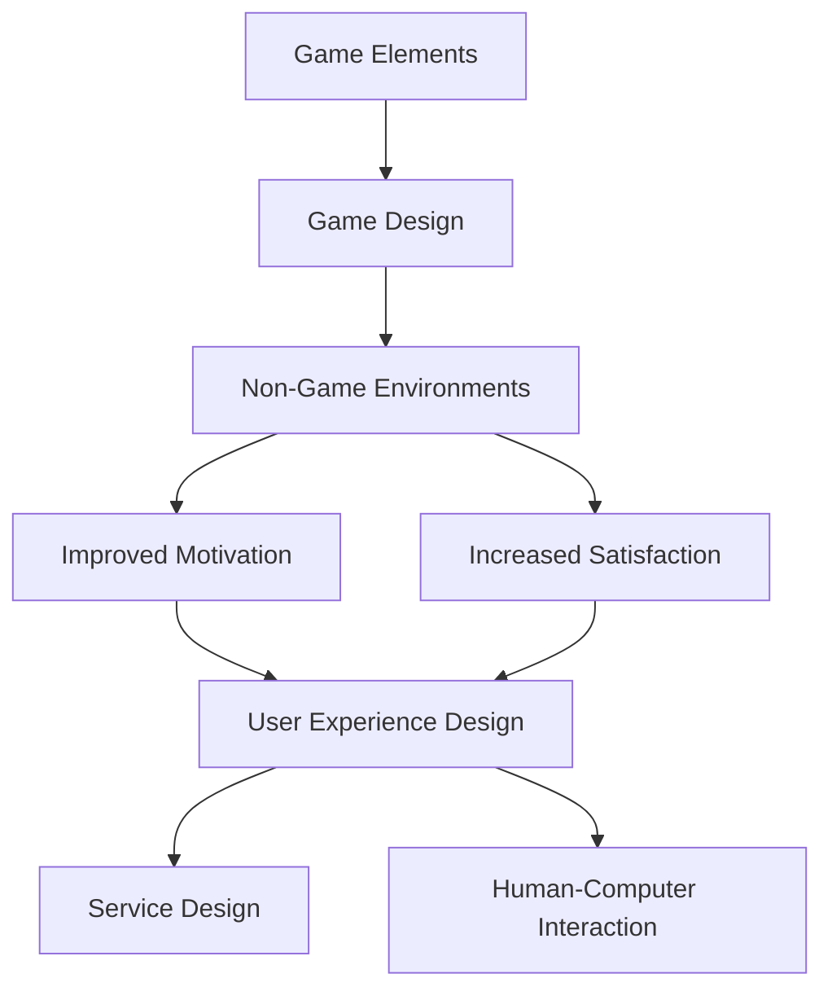

                 

## 1. 背景介绍

在当今信息化时代，人类计算的参与者正在不断增加，从专业程序员到普通用户，都在参与到计算任务中。然而，传统的人机交互方式往往枯燥乏味，难以调动参与者的积极性。如何让参与人类计算变得更有趣，是我们需要面对的挑战。游戏化思维（Gamification）应运而生，它将游戏要素引入非游戏化的领域，从而提高参与者的积极性和满意度。

## 2. 核心概念与联系

### 2.1 游戏化思维的定义

游戏化思维是指将游戏要素、游戏设计思维和游戏机制应用于非游戏环境，以激发参与者的动机、提高参与度和满意度的一种方法。它不是简单地将游戏元素添加到应用中，而是将游戏的核心机制和设计理念应用于目标驱动的环境中。

### 2.2 游戏化要素

游戏化要素是指那些在游戏中常见的元素，当它们被应用于非游戏环境时，可以提高参与者的动机和满意度。常见的游戏化要素包括：

- 目标和成就（Goals and Achievements）
- 进度跟踪（Progress Tracking）
- 反馈（Feedback）
- 等级和等级系统（Levels and Leveling Systems）
- 虚拟货币（Virtual Currency）
- 社交互动（Social Interaction）
- 竞争和对抗（Competition and Rivalry）
- 任务和挑战（Quests and Challenges）

### 2.3 游戏化思维的联系

游戏化思维将游戏要素和设计理念应用于非游戏环境，从而改善参与者的动机和满意度。它与用户体验设计（User Experience Design）、服务设计（Service Design）和人机交互（Human-Computer Interaction）密切相关。游戏化思维可以帮助设计师和开发者创建更有吸引力、更易于使用的应用和服务。



## 3. 核心算法原理 & 具体操作步骤

### 3.1 算法原理概述

游戏化思维的核心是将游戏要素和设计理念应用于非游戏环境。它不是一个单一的算法，而是一套方法和原则。然而，在实施游戏化思维时，我们需要考虑的关键因素包括目标设定、反馈机制、动机驱动和社交互动。

### 3.2 算法步骤详解

1. **目标设定（Goal Setting）：** 游戏化思维的第一步是设定清晰明确的目标。目标应当是挑战性的，但又是可达成的。目标可以是个人的，也可以是集体的。
2. **反馈机制（Feedback Mechanisms）：** 游戏化应用需要提供及时、有效的反馈。反馈可以是视觉的（如进度条、等级提升），也可以是听觉的（如音效、提示音）。
3. **动机驱动（Motivation Drivers）：** 游戏化应用需要驱动参与者的动机。动机可以是内在的（如成就感、自豪感），也可以是外在的（如虚拟货币、等级提升）。
4. **社交互动（Social Interaction）：** 游戏化应用需要鼓励社交互动。社交互动可以是合作的（如协作任务），也可以是竞争的（如排行榜、对抗赛）。
5. **评估和优化（Evaluation and Optimization）：** 游戏化应用需要定期评估和优化。评估可以是定性的（如用户反馈），也可以是定量的（如参与度、满意度统计）。

### 3.3 算法优缺点

**优点：**

- 提高参与者的动机和满意度
- 促进社交互动和协作
- 创建更有吸引力、更易于使用的应用和服务

**缺点：**

- 设计和实施游戏化应用需要时间和资源
- 如果不当设计，游戏化应用可能会导致参与者感到压力或失望
- 游戏化应用需要定期评估和优化，以保持其有效性

### 3.4 算法应用领域

游戏化思维可以应用于各种领域，包括：

- 教育：提高学生的参与度和动机
- 健康：鼓励用户养成健康习惯
- 企业：提高员工的生产率和满意度
- 公共服务：鼓励公民参与公共事务
- 环保：鼓励公民参与环保活动

## 4. 数学模型和公式 & 详细讲解 & 举例说明

### 4.1 数学模型构建

在游戏化思维中，我们可以使用动机心理学模型来指导我们的设计。其中一个常用的模型是自我决定理论（Self-Determination Theory），它提出了三种基本的内在动机：

- 自主性（Autonomy）：个体对自己的行为有控制感
- 胜任感（Competence）：个体认为自己有能力完成任务
- 关系感（Relatedness）：个体感到与他人有联系

### 4.2 公式推导过程

我们可以使用以下公式来表示游戏化应用的动机驱动因素：

$$M = f(A, C, R)$$

其中，$M$表示动机，$A$表示自主性，$C$表示胜任感，$R$表示关系感。这个公式告诉我们，动机是自主性、胜任感和关系感的函数。

### 4.3 案例分析与讲解

例如，在设计一款健康应用时，我们可以使用自我决定理论来指导我们的设计。我们可以提供用户自定义的目标（自主性），提供进度跟踪和反馈（胜任感），并提供社交功能（关系感）。通过这种方式，我们可以提高用户的动机，从而提高他们参与应用的积极性。

## 5. 项目实践：代码实例和详细解释说明

### 5.1 开发环境搭建

在开始项目实践之前，我们需要搭建开发环境。我们将使用JavaScript和Node.js来开发我们的游戏化应用。我们需要安装以下依赖项：

- Express：用于创建Web服务器
- Socket.IO：用于实时通信
- MongoDB：用于数据存储

### 5.2 源代码详细实现

以下是我们游戏化应用的源代码：

```javascript
// 导入依赖项
const express = require('express');
const app = express();
const http = require('http').createServer(app);
const io = require('socket.io')(http);
const MongoClient = require('mongodb').MongoClient;
const url ='mongodb://localhost:27017';
const dbName ='myproject';
const client = new MongoClient(url, { useUnifiedTopology: true });

// 连接到MongoDB
client.connect(err => {
  const db = client.db(dbName);
  const collection = db.collection('users');

  // 创建用户
  app.post('/users', (req, res) => {
    const user = req.body;
    collection.insertOne(user, (err, result) => {
      if (err) {
        res.status(500).send(err);
      } else {
        res.send(result.ops[0]);
      }
    });
  });

  // 获取用户
  app.get('/users', (req, res) => {
    collection.find({}).toArray((err, docs) => {
      if (err) {
        res.status(500).send(err);
      } else {
        res.send(docs);
      }
    });
  });

  // 更新用户
  app.put('/users/:id', (req, res) => {
    const userId = req.params.id;
    const updatedUser = req.body;
    collection.updateOne({ _id: ObjectId(userId) }, { $set: updatedUser }, (err, result) => {
      if (err) {
        res.status(500).send(err);
      } else {
        res.send(result);
      }
    });
  });

  // 实时通信
  io.on('connection', (socket) => {
    console.log('a user connected');

    socket.on('disconnect', () => {
      console.log('user disconnected');
    });

    socket.on('chat message', (msg) => {
      io.emit('chat message', msg);
    });
  });

  // 启动服务器
  http.listen(3000, () => {
    console.log('listening on *:3000');
  });
});
```

### 5.3 代码解读与分析

在代码中，我们首先导入了所需的依赖项，并连接到MongoDB数据库。我们创建了三个API端点：一个用于创建用户，一个用于获取用户，一个用于更新用户。我们还设置了实时通信，以便用户可以发送和接收消息。

### 5.4 运行结果展示

当我们运行代码时，我们的游戏化应用将在端口3000上启动。我们可以使用Postman或其他HTTP客户端来测试我们的API端点。我们还可以使用WebSocket客户端（如Socket.IO客户端）来测试实时通信功能。

## 6. 实际应用场景

### 6.1 教育

在教育领域，游戏化思维可以提高学生的参与度和动机。例如，我们可以创建一个在线学习平台，提供目标、反馈、等级系统和虚拟货币。学生可以通过完成任务和挑战来赚取虚拟货币，并用它来解锁新的内容或特权。

### 6.2 健康

在健康领域，游戏化思维可以鼓励用户养成健康习惯。例如，我们可以创建一款健康应用，提供目标、进度跟踪、反馈和社交互动。用户可以设定自己的目标（如每周锻炼5次），并通过完成任务来跟踪自己的进度。应用还可以提供反馈（如“你已经连续锻炼了7天了！”）和社交功能（如与朋友分享自己的进度）。

### 6.3 企业

在企业领域，游戏化思维可以提高员工的生产率和满意度。例如，我们可以创建一款企业应用，提供目标、反馈、等级系统和虚拟货币。员工可以通过完成任务和挑战来赚取虚拟货币，并用它来解锁新的内容或特权。应用还可以提供社交功能，鼓励员工合作和协作。

### 6.4 未来应用展望

未来，游戏化思维将继续发展，并应用于更多的领域。随着人工智能和虚拟现实技术的发展，我们将看到更先进的游戏化应用。例如，我们可以创建虚拟现实环境，让用户以更沉浸的方式参与到任务和挑战中。我们还可以使用人工智能来个性化游戏化应用，根据用户的偏好和行为动态调整目标和反馈。

## 7. 工具和资源推荐

### 7.1 学习资源推荐

- **书籍：**
  - "Don't Shoot the Dog!: The New Art of Teaching and Training" by Karen Pryor
  - "For the Win: How Game Thinking Can Revolutionize Your Business" by Kevin Werbach and Dan Hunter
  - "Reality is Broken: Why Games Make Us Better and How They Can Change the World" by Jane McGonigal
- **在线课程：**
  - "Gamification" on Coursera by the University of Pennsylvania
  - "Gamification" on Udemy by Todd Birzer

### 7.2 开发工具推荐

- **游戏引擎：**
  - Unity
  - Unreal Engine
  - Godot
- **前端框架：**
  - React
  - Angular
  - Vue.js
- **后端框架：**
  - Node.js
  - Express
  - Django
  - Ruby on Rails

### 7.3 相关论文推荐

- "Myths of Gamification: A 3-Year Longitudinal Study" by Sebastian Deterding, Dan Hunter, Michael Kickmeier-Rust, and Alexander Nussbaumer
- "Gamification: What is it and does it work?" by Deterding, Sebastian, et al.
- "The Effect of Gamification on Intrinsic Motivation, Social Comparison, and Academic Performance: A Quasi-Experimental Study" by Saari T. Sabri, et al.

## 8. 总结：未来发展趋势与挑战

### 8.1 研究成果总结

在本文中，我们介绍了游戏化思维的定义、核心概念、算法原理、数学模型和实际应用。我们还提供了一个项目实践的代码实例，并推荐了相关的学习资源、开发工具和论文。

### 8.2 未来发展趋势

未来，游戏化思维将继续发展，并应用于更多的领域。随着人工智能和虚拟现实技术的发展，我们将看到更先进的游戏化应用。此外，游戏化思维将与其他领域（如用户体验设计、服务设计和人机交互）更紧密地结合在一起。

### 8.3 面临的挑战

然而，游戏化思维也面临着挑战。设计和实施游戏化应用需要时间和资源，如果不当设计，游戏化应用可能会导致参与者感到压力或失望。此外，游戏化应用需要定期评估和优化，以保持其有效性。

### 8.4 研究展望

未来的研究将需要关注游戏化思维的长期影响，以及如何在不同的文化和语境中有效地应用游戏化思维。此外，我们需要更多地关注游戏化思维的道德和伦理问题，以及如何保护参与者的隐私和安全。

## 9. 附录：常见问题与解答

**Q1：游戏化思维和游戏化有什么区别？**

A1：游戏化思维是指将游戏要素、游戏设计思维和游戏机制应用于非游戏环境，以激发参与者的动机、提高参与度和满意度的一种方法。游戏化则是指将游戏要素添加到非游戏应用中，以改善用户体验。游戏化思维是更广泛的概念，它关注的是游戏的核心机制和设计理念，而不是简单地添加游戏元素。

**Q2：游戏化思维适用于所有领域吗？**

A2：游戏化思维适用于大多数领域，但并不是所有领域都适合。例如，在某些严肃或敏感的领域（如医疗保健或金融），游戏化思维可能不太合适。此外，游戏化思维需要考虑文化和语境因素，某些游戏化要素在某些文化中可能不受欢迎。

**Q3：如何评估游戏化应用的有效性？**

A3：评估游戏化应用的有效性需要定性和定量的方法。定性方法包括用户反馈和访谈，定量方法包括参与度、满意度和动机的统计。此外，我们还需要考虑游戏化应用的长期影响，以及它是否达到了预期的目标。

!!!Note
作者：禅与计算机程序设计艺术 / Zen and the Art of Computer Programming

