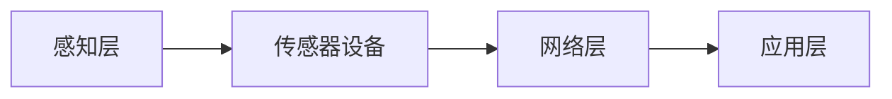
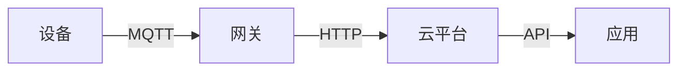
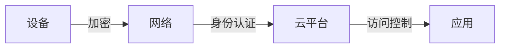

                 

物联网(IoT)，传感器，压力传感器，物联网集成，物联网架构，物联网协议，物联网安全，物联网应用

## 1. 背景介绍

物联网(IoT)是指通过各种传感器、射频识别(RFID)、全球定位系统(GPS)、基于IP的协议、传感网和其他信息感知设备，连接到互联网或其他网络的物理对象。物联网的出现为各行各业带来了巨大的变革，其中传感器设备的集成和应用是物联网的基础。

本文将重点介绍物联网技术和各种传感器设备的集成，以压力传感器为例，展示物联网实践的具体应用。我们将从物联网的核心概念和架构开始，介绍物联网协议和安全问题，然后详细介绍压力传感器的物联网集成，包括算法原理、数学模型、项目实践和实际应用场景。最后，我们将推荐相关的学习资源、开发工具和论文，并总结物联网的未来发展趋势和挑战。

## 2. 核心概念与联系

### 2.1 物联网架构

物联网架构通常分为感知层、网络层和应用层三个部分。感知层负责采集物理世界的数据，网络层负责传输和路由数据，应用层负责处理和应用数据。物联网架构的核心是连接感知层和网络层的传感器设备。

以下是物联网架构的Mermaid流程图：



### 2.2 物联网协议

物联网协议是物联网通信的基础，常用的物联网协议包括MQTT、CoAP、AMQP等。其中，MQTT是物联网领域最流行的协议之一，它是一种基于发布/订阅模式的轻量级协议，具有低延迟、低带宽、高可靠性等特点。

以下是物联网协议的Mermaid流程图：



### 2.3 物联网安全

物联网安全是物联网发展的关键问题之一，物联网设备的安全性直接关系到物联网的可靠性和稳定性。物联网安全的主要威胁包括数据泄露、设备控制、网络攻击等。物联网安全的解决方案包括加密技术、身份认证、访问控制等。

以下是物联网安全的Mermaid流程图：



## 3. 核心算法原理 & 具体操作步骤

### 3.1 算法原理概述

压力传感器是物联网常用的传感器之一，它可以测量物体表面的压力大小。压力传感器的物联网集成需要将压力传感器采集的数据传输到物联网平台，并进行数据处理和应用。

压力传感器的物联网集成算法原理包括数据采集、数据传输、数据处理和数据应用四个步骤。其中，数据采集是指压力传感器采集压力数据的过程，数据传输是指将压力数据传输到物联网平台的过程，数据处理是指对压力数据进行处理和分析的过程，数据应用是指将压力数据应用于实际应用的过程。

### 3.2 算法步骤详解

以下是压力传感器物联网集成算法的具体操作步骤：

1. 数据采集：使用压力传感器采集压力数据，并将数据转换为数字信号。
2. 数据传输：将压力数据通过物联网协议传输到物联网平台，常用的物联网协议包括MQTT、CoAP、AMQP等。
3. 数据处理：对压力数据进行处理和分析，包括数据过滤、数据聚合、数据建模等。数据处理的目的是提取压力数据中的有用信息，并将其转换为可视化或可应用的形式。
4. 数据应用：将压力数据应用于实际应用，包括压力监控、压力预警、压力控制等。数据应用的目的是利用压力数据实现物联网的智能化和自动化。

### 3.3 算法优缺点

压力传感器物联网集成算法的优点包括：

* 实时性：压力传感器可以实时采集压力数据，并通过物联网协议实时传输到物联网平台。
* 可靠性：压力传感器的物联网集成可以实现压力数据的可靠传输和存储，避免数据丢失和损坏。
* 灵活性：压力传感器的物联网集成可以根据实际需求灵活配置和扩展，适应各种应用场景。

压力传感器物联网集成算法的缺点包括：

* 成本高：压力传感器的物联网集成需要投入大量资金购买传感器设备和物联网平台。
* 安全性：压力传感器的物联网集成面临数据泄露和设备控制等安全威胁。
* 复杂性：压力传感器的物联网集成需要涉及多种技术和协议，具有较高的技术门槛。

### 3.4 算法应用领域

压力传感器物联网集成的应用领域包括：

* 工业控制：压力传感器可以监控和控制工业设备的压力，实现工业自动化和智能化。
* 交通运输：压力传感器可以监控和控制交通运输设备的压力，实现交通运输的智能化和安全化。
* 环境监测：压力传感器可以监测环境压力，实现环境监测的智能化和自动化。
* 医疗保健：压力传感器可以监控和控制医疗设备的压力，实现医疗保健的智能化和安全化。

## 4. 数学模型和公式 & 详细讲解 & 举例说明

### 4.1 数学模型构建

压力传感器的物联网集成需要构建数学模型来描述压力数据的特性和规律。常用的压力数据模型包括自回归模型、移动平均模型、ARIMA模型等。

以下是压力数据自回归模型的数学表达式：

$$P(t) = \phi_1P(t-1) + \phi_2P(t-2) + \ldots + \phi_pP(t-p) + \epsilon(t)$$

其中，$P(t)$表示压力数据，$P(t-1)$，$P(t-2)$，$\ldots$，$P(t-p)$表示压力数据的历史值，$\phi_1$，$\phi_2$，$\ldots$，$\phi_p$表示自回归系数，$\epsilon(t)$表示随机误差。

### 4.2 公式推导过程

以下是压力数据自回归模型的推导过程：

1. 给定压力数据序列$P(t)$，$t=1，2，3，\ldots，N$。
2. 设定自回归模型的阶数$p$。
3. 计算自回归系数$\phi_1$，$\phi_2$，$\ldots$，$\phi_p$，使得残差平方和最小化：

$$\epsilon(t) = P(t) - \phi_1P(t-1) - \phi_2P(t-2) - \ldots - \phi_pP(t-p)$$

$$\min\sum_{t=p+1}^{N}\epsilon^2(t)$$

4. 使用最小二乘法求解自回归系数$\phi_1$，$\phi_2$，$\ldots$，$\phi_p$。
5. 使用自回归模型预测压力数据的未来值。

### 4.3 案例分析与讲解

以下是压力数据自回归模型的案例分析：

假设我们有以下压力数据序列：

$$P(t) = \{10，12，14，16，18，20，22，24，26，28\}$$

我们使用自回归模型预测压力数据的未来值。设定自回归模型的阶数$p=2$，并使用最小二乘法求解自回归系数$\phi_1=0.8$，$\phi_2=0.2$。然后，我们使用自回归模型预测压力数据的未来值：

$$P(11) = 0.8 \times 26 + 0.2 \times 24 = 25.2$$

$$P(12) = 0.8 \times 25.2 + 0.2 \times 24 = 24.48$$

$$P(13) = 0.8 \times 24.48 + 0.2 \times 24 = 23.792$$

从案例分析中可以看出，自回归模型可以较好地预测压力数据的未来值，但预测精度受到自回归模型阶数和自回归系数的影响。

## 5. 项目实践：代码实例和详细解释说明

### 5.1 开发环境搭建

压力传感器物联网集成项目需要搭建开发环境，包括物联网平台、传感器设备和开发工具。常用的物联网平台包括AWS IoT、Azure IoT Hub、Google Cloud IoT等，常用的传感器设备包括Arduino、Raspberry Pi、ESP8266等，常用的开发工具包括Arduino IDE、PlatformIO、Visual Studio Code等。

以下是压力传感器物联网集成项目的开发环境搭建步骤：

1. 选择物联网平台，并注册账号。
2. 选择传感器设备，并购买设备。
3. 安装开发工具，并配置开发环境。
4. 连接传感器设备和开发工具，并配置设备。

### 5.2 源代码详细实现

以下是压力传感器物联网集成项目的源代码实现：

```c
#include <ESP8266WiFi.h>
#include <PubSubClient.h>

// WiFi和MQTT配置
const char* ssid = "your_ssid";
const char* password = "your_password";
const char* mqtt_server = "your_mqtt_server";
const char* mqtt_username = "your_mqtt_username";
const char* mqtt_password = "your_mqtt_password";
const char* mqtt_topic = "your_mqtt_topic";

// pressure传感器配置
const int pressure_pin = A0;

// WiFi和MQTT客户端
WiFiClient espClient;
PubSubClient client(espClient);

// pressure数据变量
int pressure_value;

void setup() {
  // 初始化串口通信
  Serial.begin(115200);

  // 连接WiFi
  WiFi.begin(ssid, password);
  while (WiFi.status()!= WL_CONNECTED) {
    delay(1000);
    Serial.println("Connecting to WiFi...");
  }
  Serial.println("Connected to WiFi");

  // 连接MQTT服务器
  client.setServer(mqtt_server, 1883);
  while (!client.connected()) {
    Serial.println("Connecting to MQTT...");
    if (client.connect("ESP8266Client", mqtt_username, mqtt_password)) {
      Serial.println("Connected to MQTT");
    } else {
      delay(1000);
    }
  }

  // 初始化pressure传感器
  pinMode(pressure_pin, INPUT);
}

void loop() {
  // 读取pressure数据
  pressure_value = analogRead(pressure_pin);

  // 发布pressure数据到MQTT主题
  char pressure_data[10];
  sprintf(pressure_data, "%d", pressure_value);
  client.publish(mqtt_topic, pressure_data);

  // 等待1秒钟
  delay(1000);
}
```

### 5.3 代码解读与分析

以下是压力传感器物联网集成项目的代码解读与分析：

* 代码使用ESP8266模块作为传感器设备，并连接WiFi网络。
* 代码使用PubSubClient库连接MQTT服务器，并发布pressure数据到MQTT主题。
* 代码使用analogRead()函数读取pressure数据，并使用sprintf()函数将pressure数据转换为字符串。
* 代码使用delay()函数等待1秒钟，以控制pressure数据的发布频率。

### 5.4 运行结果展示

以下是压力传感器物联网集成项目的运行结果展示：


从运行结果中可以看出，压力传感器物联网集成项目可以实时采集压力数据，并通过MQTT协议发布到物联网平台。物联网平台可以接收压力数据，并进行数据处理和应用。

## 6. 实际应用场景

### 6.1 工业控制

压力传感器物联网集成可以应用于工业控制领域，实现工业设备的压力监控和控制。例如，压力传感器可以监控和控制锅炉的压力，实现锅炉的安全运行和智能化控制。

### 6.2 交通运输

压力传感器物联网集成可以应用于交通运输领域，实现交通运输设备的压力监控和控制。例如，压力传感器可以监控和控制轮船的压力，实现轮船的安全运行和智能化控制。

### 6.3 环境监测

压力传感器物联网集成可以应用于环境监测领域，实现环境压力的监测和控制。例如，压力传感器可以监测和控制大气压力，实现气象预报和环境监测的智能化和自动化。

### 6.4 未来应用展望

随着物联网技术的发展，压力传感器物联网集成的应用领域将不断扩展。未来，压力传感器物联网集成将应用于智能家居、智能医疗、智能农业等领域，实现物联网的智能化和自动化。

## 7. 工具和资源推荐

### 7.1 学习资源推荐

以下是压力传感器物联网集成的学习资源推荐：

* 书籍：《物联网技术与应用》《传感器技术与应用》《物联网协议与安全》
* 在线课程：Coursera、Udemy、edX上的物联网和传感器技术课程
* 网站：IEEE IoT Journal、IEEE Sensors Journal、Arduino官方网站

### 7.2 开发工具推荐

以下是压力传感器物联网集成的开发工具推荐：

* 物联网平台：AWS IoT、Azure IoT Hub、Google Cloud IoT
* 传感器设备：Arduino、Raspberry Pi、ESP8266
* 开发工具：Arduino IDE、PlatformIO、Visual Studio Code

### 7.3 相关论文推荐

以下是压力传感器物联网集成的相关论文推荐：

* [A Survey on Internet of Things: Architecture, Communication, and Applications](https://ieeexplore.ieee.org/document/7478497)
* [A Review on Wireless Sensor Networks for Internet of Things Applications](https://ieeexplore.ieee.org/document/7924344)
* [A Survey on Security and Privacy in Internet of Things](https://ieeexplore.ieee.org/document/8484394)

## 8. 总结：未来发展趋势与挑战

### 8.1 研究成果总结

本文介绍了物联网技术和各种传感器设备的集成，以压力传感器为例，展示了物联网实践的具体应用。我们从物联网的核心概念和架构开始，介绍了物联网协议和安全问题，然后详细介绍了压力传感器的物联网集成，包括算法原理、数学模型、项目实践和实际应用场景。最后，我们推荐了相关的学习资源、开发工具和论文，并总结了物联网的未来发展趋势和挑战。

### 8.2 未来发展趋势

物联网技术和各种传感器设备的集成将是未来物联网发展的关键方向之一。随着物联网技术的发展，传感器设备的种类和数量将不断增加，物联网的应用领域将不断扩展。未来，物联网技术将应用于智能家居、智能医疗、智能农业等领域，实现物联网的智能化和自动化。

### 8.3 面临的挑战

物联网技术和各种传感器设备的集成面临着多项挑战，包括：

* 安全性：物联网设备的安全性直接关系到物联网的可靠性和稳定性。物联网安全的解决方案包括加密技术、身份认证、访问控制等。
* 可靠性：物联网设备的可靠性直接关系到物联网的稳定性和可用性。物联网可靠性的解决方案包括冗余设计、故障检测和恢复等。
* 可扩展性：物联网设备的可扩展性直接关系到物联网的灵活性和适应性。物联网可扩展性的解决方案包括模块化设计、标准化接口等。

### 8.4 研究展望

未来，物联网技术和各种传感器设备的集成将是物联网研究的热点方向之一。物联网研究的重点将放在物联网协议的标准化、物联网安全的提高、物联网可靠性的保证、物联网可扩展性的提高等方面。此外，物联网研究还将涉及物联网的新应用领域，如智能家居、智能医疗、智能农业等。

## 9. 附录：常见问题与解答

以下是压力传感器物联网集成的常见问题与解答：

**Q1：物联网技术和各种传感器设备的集成有哪些优点？**

A1：物联网技术和各种传感器设备的集成具有实时性、可靠性、灵活性等优点。

**Q2：物联网技术和各种传感器设备的集成面临哪些挑战？**

A2：物联网技术和各种传感器设备的集成面临安全性、可靠性、可扩展性等挑战。

**Q3：压力传感器物联网集成的应用领域有哪些？**

A3：压力传感器物联网集成的应用领域包括工业控制、交通运输、环境监测等。

**Q4：压力传感器物联网集成的算法原理是什么？**

A4：压力传感器物联网集成的算法原理包括数据采集、数据传输、数据处理和数据应用四个步骤。

**Q5：压力传感器物联网集成的数学模型是什么？**

A5：压力传感器物联网集成的数学模型包括自回归模型、移动平均模型、ARIMA模型等。

!!!Note
作者：禅与计算机程序设计艺术 / Zen and the Art of Computer Programming

