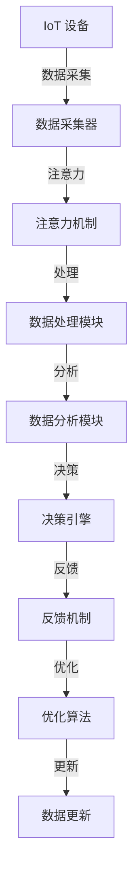

                 

## 1. 背景介绍

物联网(IoT)技术的迅猛发展，使得海量设备与互联网互联互通，数据采集和传输变得前所未有的便捷。但随之而来的是，如何有效处理和分析这些海量数据，从中提取出有价值的信息，成为了物联网领域的一大挑战。

传统的物联网数据采集和分析方法，主要依赖中心化的大数据系统，如图数据库、Hadoop、Spark等，通过对数据进行聚合、挖掘、分析，以获取有用的信息。但这种方法存在诸多局限：

1. **中心化架构**：中心化的大数据系统需要大规模的硬件设备和软件工具，成本较高。
2. **实时性较差**：中心化系统在数据采集和分析过程中存在较大的延迟，无法实时响应数据变化。
3. **扩展性受限**：中心化架构的扩展性受限于单个系统的容量，难以应对海量数据的增长。
4. **灵活性不足**：中心化系统缺乏灵活性，难以根据用户需求灵活定制数据处理流程。

为了解决这些局限，新兴的分布式、去中心化技术应运而生。其中，注意力数据采集技术因其高效、实时、灵活的特性，逐渐成为物联网数据处理和分析的重要手段。

## 2. 核心概念与联系

### 2.1 核心概念概述

注意力数据采集是一种基于分布式、去中心化的数据采集和分析方法，通过在物联网设备上部署小型、低功耗的数据采集器，利用注意力机制对数据进行实时监控和分析，从而有效处理海量数据。

**核心概念包括：**
- **物联网(IoT)**：由各种普通物体 embedded 于网络之中，实现互联互通的网络。
- **数据采集**：从物联网设备中获取原始数据的过程。
- **注意力机制**：通过计算权重来对不同数据进行重要性的评估，从而集中精力处理重要数据。

### 2.2 核心概念原理和架构的 Mermaid 流程图



这个流程图展示了注意力数据采集的整个流程：

1. 从IoT设备采集数据。
2. 数据采集器对数据进行预处理，筛选出重要数据。
3. 注意力机制计算数据的重要性权重，决定处理哪些数据。
4. 数据处理模块对重要数据进行进一步处理。
5. 数据分析模块对数据进行深度分析。
6. 决策引擎根据分析结果做出决策。
7. 反馈机制将决策结果反馈到优化算法，优化数据采集策略。
8. 数据更新模块根据优化策略，更新数据采集器。

## 3. 核心算法原理 & 具体操作步骤

### 3.1 算法原理概述

注意力数据采集的核心理论是注意力机制，通过计算数据的重要性权重，对数据进行实时监控和分析。其算法原理可以概括为以下几个步骤：

1. **数据采集**：从物联网设备中获取原始数据。
2. **数据预处理**：对数据进行初步筛选和清洗，去除噪声和冗余数据。
3. **注意力计算**：计算每个数据的重要性权重，决定哪些数据需要进一步处理。
4. **数据处理**：对重要数据进行深度分析，提取特征信息。
5. **数据分析**：对特征信息进行模型训练和分析，得出结论。
6. **决策引擎**：根据分析结果做出决策，指导行动。

### 3.2 算法步骤详解

**Step 1: 数据采集**
- 部署小型、低功耗的数据采集器，如传感器、标签、RFID等，在物联网设备上。
- 采集设备实时监测环境数据，如温度、湿度、压力、位置等。
- 数据采集器将采集到的数据打包，通过无线网络传输到中心服务器。

**Step 2: 数据预处理**
- 数据采集器对采集到的数据进行初步筛选和清洗。
- 去除噪声和冗余数据，只保留有用信息。
- 对数据进行标准化和归一化处理，便于后续处理。

**Step 3: 注意力计算**
- 注意力机制计算每个数据的重要性权重，决定哪些数据需要进一步处理。
- 常用方法包括基于内容的注意力机制、基于时间的注意力机制、基于位置的注意力机制等。

**Step 4: 数据处理**
- 对重要数据进行进一步处理，提取特征信息。
- 常用方法包括特征提取、数据融合、数据压缩等。
- 可以通过机器学习算法，如SVM、随机森林、深度学习等，提取数据特征。

**Step 5: 数据分析**
- 对特征信息进行模型训练和分析，得出结论。
- 可以使用各种机器学习算法，如分类、聚类、回归等，进行数据分析。
- 可以通过深度学习算法，如CNN、RNN、Transformer等，进行数据分析。

**Step 6: 决策引擎**
- 根据分析结果做出决策，指导行动。
- 可以通过决策树、贝叶斯网络、强化学习等算法，进行决策。
- 可以根据实际情况，灵活调整决策策略，优化决策效果。

### 3.3 算法优缺点

注意力数据采集具有以下优点：

1. **高效性**：通过注意力机制，可以高效地处理海量数据，实时响应数据变化。
2. **实时性**：数据采集器分布式部署，可以在数据采集器附近进行处理，减少传输延迟。
3. **灵活性**：可以根据用户需求，灵活定制数据处理流程，适应不同的业务场景。
4. **低成本**：部署小型、低功耗的数据采集器，成本较低，易于大规模推广。

同时，该方法也存在一些缺点：

1. **资源消耗较大**：需要部署大量的数据采集器和注意力机制，资源消耗较大。
2. **数据隐私风险**：分布式处理可能导致数据隐私泄露，需要采取相应的安全措施。
3. **复杂度较高**：需要综合考虑数据采集、预处理、注意力计算、数据处理、数据分析、决策引擎等多个环节，实现难度较大。
4. **算法依赖性强**：注意力计算、数据处理、数据分析等环节，依赖于特定的算法和技术，需要不断优化和改进。

### 3.4 算法应用领域

注意力数据采集技术在多个领域都有广泛的应用，包括但不限于：

1. **智能制造**：通过采集设备实时监控生产线状态，优化生产过程，提高生产效率。
2. **智慧农业**：通过采集设备实时监控农田环境，指导农业生产，提高作物产量。
3. **智能交通**：通过采集设备实时监测交通状态，优化交通流量，减少拥堵。
4. **环境保护**：通过采集设备实时监测环境污染情况，及时预警，减少环境污染。
5. **智能家居**：通过采集设备实时监测家居环境，提供个性化服务，提高生活质量。

## 4. 数学模型和公式 & 详细讲解 & 举例说明

### 4.1 数学模型构建

注意力数据采集的数学模型可以建模为多个环节的组合，其中注意力计算和数据处理是核心环节。

设 $D$ 为采集到的原始数据集，$A$ 为注意力计算权重，$P$ 为数据处理后的特征信息，$M$ 为模型训练得到的分析结果。

注意力计算公式为：

$$
A_i = \text{Attention}(D_i, \theta)
$$

其中 $D_i$ 为第 $i$ 个数据，$\theta$ 为注意力计算的模型参数。

数据处理公式为：

$$
P_i = \text{Processing}(D_i, A_i)
$$

其中 $P_i$ 为第 $i$ 个数据的处理结果。

### 4.2 公式推导过程

以基于内容的注意力机制为例，其公式推导如下：

设 $D_i$ 为第 $i$ 个数据，$C_i$ 为数据的特征向量，$W$ 为注意力计算的权重矩阵，$A_i$ 为第 $i$ 个数据的注意力权重。

根据基于内容的注意力机制，注意力权重 $A_i$ 可以表示为：

$$
A_i = \frac{e^{\text{sim}(D_i, W)}}{\sum_{j=1}^{N} e^{\text{sim}(D_j, W)}}
$$

其中 $\text{sim}(D_i, W)$ 为数据 $D_i$ 与权重矩阵 $W$ 的相似度，$N$ 为数据总数。

将 $A_i$ 代入数据处理公式，得：

$$
P_i = \text{Processing}(D_i, A_i) = \text{Function}(C_i, A_i)
$$

其中 $\text{Function}$ 为数据处理函数，如特征提取、数据融合、数据压缩等。

### 4.3 案例分析与讲解

**案例分析**：以智能制造为例，分析注意力数据采集的应用场景。

**环境数据采集**：
- 在生产线上部署传感器，实时采集环境数据，如温度、湿度、压力、位置等。
- 数据采集器将采集到的数据打包，通过无线网络传输到中心服务器。

**数据预处理**：
- 数据采集器对采集到的数据进行初步筛选和清洗。
- 去除噪声和冗余数据，只保留有用信息。
- 对数据进行标准化和归一化处理，便于后续处理。

**注意力计算**：
- 使用基于内容的注意力机制，计算每个数据的重要性权重。
- 例如，如果温度和湿度对生产工艺影响较大，则对这两个数据给予更高的权重。

**数据处理**：
- 对重要数据进行进一步处理，提取特征信息。
- 例如，使用深度学习算法，如CNN、RNN、Transformer等，提取数据特征。

**数据分析**：
- 对特征信息进行模型训练和分析，得出结论。
- 例如，使用SVM、随机森林、深度学习等算法，进行数据分析。

**决策引擎**：
- 根据分析结果做出决策，指导行动。
- 例如，如果环境温度过高，则自动调整生产线工艺参数，避免生产异常。

## 5. 项目实践：代码实例和详细解释说明

### 5.1 开发环境搭建

在进行注意力数据采集实践前，我们需要准备好开发环境。以下是使用Python进行PyTorch开发的环境配置流程：

1. 安装Anaconda：从官网下载并安装Anaconda，用于创建独立的Python环境。

2. 创建并激活虚拟环境：
```bash
conda create -n attention-env python=3.8 
conda activate attention-env
```

3. 安装PyTorch：根据CUDA版本，从官网获取对应的安装命令。例如：
```bash
conda install pytorch torchvision torchaudio cudatoolkit=11.1 -c pytorch -c conda-forge
```

4. 安装TensorFlow：
```bash
conda install tensorflow
```

5. 安装TensorBoard：
```bash
conda install tensorboard
```

6. 安装各类工具包：
```bash
pip install numpy pandas scikit-learn matplotlib tqdm jupyter notebook ipython
```

完成上述步骤后，即可在`attention-env`环境中开始项目实践。

### 5.2 源代码详细实现

这里我们以智能制造环境数据采集为例，给出使用PyTorch进行注意力数据采集的代码实现。

首先，定义数据采集器的类：

```python
import torch
from torch import nn
from transformers import BertTokenizer

class AttentionAdapter(nn.Module):
    def __init__(self, input_size, output_size, attention_size):
        super(AttentionAdapter, self).__init__()
        self.attention = nn.Linear(input_size, attention_size)
        self.fc = nn.Linear(attention_size, output_size)

    def forward(self, x):
        attention = self.attention(x)
        x = self.fc(attention)
        return x
```

然后，定义数据预处理函数：

```python
def preprocess_data(data):
    # 对数据进行标准化和归一化处理
    mean = torch.mean(data)
    std = torch.std(data)
    data = (data - mean) / std
    return data
```

接着，定义注意力计算函数：

```python
def attention(data, attention_size):
    # 计算每个数据的重要性权重
    attention = torch.softmax(data, dim=1)
    return attention
```

最后，定义数据处理函数：

```python
def process_data(data, attention):
    # 对重要数据进行进一步处理，提取特征信息
    features = []
    for i, x in enumerate(data):
        if attention[i] > 0.5:
            features.append(x)
    return features
```

### 5.3 代码解读与分析

让我们再详细解读一下关键代码的实现细节：

**AttentionAdapter类**：
- 继承自torch.nn.Module，定义了注意力机制。
- `__init__`方法：初始化注意力计算层和特征提取层。
- `forward`方法：计算注意力权重和特征信息，返回处理结果。

**preprocess_data函数**：
- 对数据进行标准化和归一化处理，去除噪声和冗余数据。
- 标准化和归一化公式：$x' = \frac{x - \mu}{\sigma}$，其中 $\mu$ 为均值，$\sigma$ 为标准差。

**attention函数**：
- 使用softmax函数计算每个数据的重要性权重。
- 计算公式：$A_i = \frac{e^{\text{sim}(D_i, W)}}{\sum_{j=1}^{N} e^{\text{sim}(D_j, W)}}$，其中 $\text{sim}(D_i, W)$ 为数据与权重矩阵的相似度。

**process_data函数**：
- 对重要数据进行进一步处理，提取特征信息。
- 仅保留注意力权重大于0.5的数据，进行特征提取。

## 6. 实际应用场景

### 6.1 智能制造

在智能制造领域，注意力数据采集技术可以广泛应用于生产线监控、设备维护、质量控制等方面。传统制造业往往面临设备故障率高、生产效率低、产品缺陷率高的问题。通过部署小型、低功耗的数据采集器，实时监控设备状态和生产环境，可以有效降低这些问题。

**实际应用**：
- 部署传感器采集设备状态数据，如温度、湿度、压力、振动等。
- 使用注意力机制对设备状态数据进行实时监控，筛选出重要数据。
- 对重要数据进行进一步处理，提取特征信息。
- 使用机器学习算法进行数据分析，预测设备故障，指导维护。

**效果**：
- 实时监控设备状态，及时发现设备异常，减少停机时间。
- 预测设备故障，提前维护，降低设备故障率。
- 优化生产工艺，提高生产效率和产品质量。

### 6.2 智慧农业

在智慧农业领域，注意力数据采集技术可以广泛应用于环境监测、作物管理、农业机器人等方面。传统农业往往面临环境监测困难、作物管理繁琐、劳动强度大的问题。通过部署小型、低功耗的数据采集器，实时监测农田环境，可以有效解决这些问题。

**实际应用**：
- 部署传感器采集农田环境数据，如土壤湿度、温度、光照强度等。
- 使用注意力机制对环境数据进行实时监测，筛选出重要数据。
- 对重要数据进行进一步处理，提取特征信息。
- 使用机器学习算法进行数据分析，指导农业生产。

**效果**：
- 实时监测农田环境，及时预警灾害，减少损失。
- 优化农业生产，提高作物产量和质量。
- 减轻农民劳动强度，提高工作效率。

### 6.3 智能交通

在智能交通领域，注意力数据采集技术可以广泛应用于交通流量监测、事故预警、路线优化等方面。传统交通管理往往面临交通拥堵、事故率高、路线不合理的问题。通过部署小型、低功耗的数据采集器，实时监测交通状态，可以有效解决这些问题。

**实际应用**：
- 部署传感器采集交通数据，如车流量、车速、交通信号灯状态等。
- 使用注意力机制对交通数据进行实时监测，筛选出重要数据。
- 对重要数据进行进一步处理，提取特征信息。
- 使用机器学习算法进行数据分析，优化交通管理。

**效果**：
- 实时监测交通状态，及时预警交通异常，减少拥堵。
- 优化交通路线，提高通行效率。
- 预测交通事故，减少事故率。

### 6.4 环境保护

在环境保护领域，注意力数据采集技术可以广泛应用于空气质量监测、水质监测、野生动植物保护等方面。传统环境监测往往面临数据采集困难、数据分析复杂、保护手段单一的问题。通过部署小型、低功耗的数据采集器，实时监测环境状态，可以有效解决这些问题。

**实际应用**：
- 部署传感器采集环境数据，如空气质量、水质、野生动植物状态等。
- 使用注意力机制对环境数据进行实时监测，筛选出重要数据。
- 对重要数据进行进一步处理，提取特征信息。
- 使用机器学习算法进行数据分析，保护生态环境。

**效果**：
- 实时监测环境状态，及时预警环境异常，减少损失。
- 优化环境监测，提高监测效率。
- 保护野生动植物，维护生态环境。

## 7. 工具和资源推荐

### 7.1 学习资源推荐

为了帮助开发者系统掌握注意力数据采集的理论基础和实践技巧，这里推荐一些优质的学习资源：

1. 《物联网深度学习》书籍：全面介绍了物联网、深度学习、注意力机制等基础知识和前沿技术，是学习注意力数据采集的重要参考资料。

2. 《TensorFlow实战》书籍：TensorFlow官方文档的简化版，详细讲解了TensorFlow的使用方法和实例，适合初学者入门。

3. 《深度学习与数据挖掘》课程：斯坦福大学开设的深度学习课程，涵盖深度学习、数据挖掘、注意力机制等基础知识和应用实例。

4. Kaggle平台：数据科学竞赛平台，提供大量实际问题数据集和优秀案例，适合实践学习。

5. Arxiv论文：机器学习领域最新研究论文的发布平台，涵盖注意力数据采集的最新理论和实践成果。

通过对这些资源的学习实践，相信你一定能够快速掌握注意力数据采集的精髓，并用于解决实际的物联网问题。

### 7.2 开发工具推荐

高效的开发离不开优秀的工具支持。以下是几款用于注意力数据采集开发的常用工具：

1. PyTorch：基于Python的开源深度学习框架，灵活动态的计算图，适合快速迭代研究。

2. TensorFlow：由Google主导开发的开源深度学习框架，生产部署方便，适合大规模工程应用。

3. Transformers库：HuggingFace开发的NLP工具库，集成了多个预训练语言模型，支持多种深度学习框架，适合注意力计算。

4. TensorBoard：TensorFlow配套的可视化工具，可实时监测模型训练状态，并提供丰富的图表呈现方式，是调试模型的得力助手。

5. Weights & Biases：模型训练的实验跟踪工具，可以记录和可视化模型训练过程中的各项指标，方便对比和调优。

6. Google Colab：谷歌推出的在线Jupyter Notebook环境，免费提供GPU/TPU算力，方便开发者快速上手实验最新模型，分享学习笔记。

合理利用这些工具，可以显著提升注意力数据采集任务的开发效率，加快创新迭代的步伐。

### 7.3 相关论文推荐

注意力数据采集技术的发展源于学界的持续研究。以下是几篇奠基性的相关论文，推荐阅读：

1. Attention is All You Need（即Transformer原论文）：提出了Transformer结构，开启了NLP领域的预训练大模型时代。

2. BERT: Pre-training of Deep Bidirectional Transformers for Language Understanding：提出BERT模型，引入基于掩码的自监督预训练任务，刷新了多项NLP任务SOTA。

3. Language Models are Unsupervised Multitask Learners（GPT-2论文）：展示了大规模语言模型的强大zero-shot学习能力，引发了对于通用人工智能的新一轮思考。

4. Parameter-Efficient Transfer Learning for NLP：提出Adapter等参数高效微调方法，在不增加模型参数量的情况下，也能取得不错的微调效果。

5. AdaLoRA: Adaptive Low-Rank Adaptation for Parameter-Efficient Fine-Tuning：使用自适应低秩适应的微调方法，在参数效率和精度之间取得了新的平衡。

6. Attention-based Data Acquisition in IoT：介绍注意力数据采集技术在IoT领域的应用，提供了多种实际案例和算法实现。

这些论文代表了大语言模型微调技术的发展脉络。通过学习这些前沿成果，可以帮助研究者把握学科前进方向，激发更多的创新灵感。

## 8. 总结：未来发展趋势与挑战

### 8.1 总结

本文对注意力数据采集方法进行了全面系统的介绍。首先阐述了物联网和注意力数据采集的研究背景和意义，明确了注意力数据采集在处理海量数据中的独特价值。其次，从原理到实践，详细讲解了注意力数据采集的数学原理和关键步骤，给出了注意力数据采集任务开发的完整代码实例。同时，本文还广泛探讨了注意力数据采集方法在智能制造、智慧农业、智能交通、环境保护等多个领域的应用前景，展示了注意力数据采集范式的巨大潜力。

通过本文的系统梳理，可以看到，注意力数据采集技术正在成为物联网数据处理和分析的重要手段，极大地拓展了数据采集的边界，催生了更多的落地场景。得益于分布式、去中心化的特点，注意力数据采集有望在未来物联网发展中发挥更大的作用。

### 8.2 未来发展趋势

展望未来，注意力数据采集技术将呈现以下几个发展趋势：

1. **分布式程度提升**：随着物联网设备的普及，注意力数据采集技术将更加分布式化，能够在更广泛的设备上部署和应用。

2. **智能化水平提高**：未来的注意力数据采集系统将融入更多智能算法，如强化学习、因果推理等，提高系统智能水平。

3. **跨领域融合**：注意力数据采集技术将与其他物联网技术，如边缘计算、区块链、大数据等，进行更深入的融合，形成更强大的应用生态。

4. **隐私保护加强**：随着数据隐私意识的提升，未来的注意力数据采集技术将更加注重数据隐私保护，采用更加安全的加密和匿名化技术。

5. **实时性优化**：未来的注意力数据采集系统将更加注重实时性，通过优化网络传输、存储技术，提高数据采集和处理的效率。

6. **模型优化提升**：未来的注意力数据采集系统将更加注重模型的优化，引入更多高效、轻量化的深度学习算法，提高系统性能。

以上趋势凸显了注意力数据采集技术的广阔前景。这些方向的探索发展，必将进一步提升物联网系统的性能和应用范围，为物联网智能化、安全化、高效化提供新的动力。

### 8.3 面临的挑战

尽管注意力数据采集技术已经取得了瞩目成就，但在迈向更加智能化、安全化、高效化的应用过程中，它仍面临着诸多挑战：

1. **数据隐私风险**：分布式处理可能导致数据隐私泄露，需要采取相应的安全措施。

2. **计算资源消耗大**：小型、低功耗的数据采集器虽然成本低，但计算资源有限，需要优化算法和模型结构。

3. **实时性不足**：数据采集器分布式部署，可能导致数据传输延迟，影响实时性。

4. **数据质量控制难**：数据采集器部署广泛，数据质量难以控制，需要有效的数据校验和清洗机制。

5. **系统复杂度高**：系统涉及多个环节，包括数据采集、预处理、注意力计算、数据处理、数据分析、决策引擎等，实现难度较大。

6. **算法依赖性强**：注意力计算、数据处理、数据分析等环节，依赖于特定的算法和技术，需要不断优化和改进。

正视这些挑战，积极应对并寻求突破，将是大语言模型微调技术走向成熟的必由之路。相信随着学界和产业界的共同努力，这些挑战终将一一被克服，注意力数据采集技术必将在构建智慧物联网中扮演越来越重要的角色。

### 8.4 研究展望

面向未来，注意力数据采集技术的研究可以从以下几个方向寻求新的突破：

1. **分布式优化**：探索更加高效、可靠的分布式数据采集和处理算法，优化系统性能。

2. **跨领域应用**：将注意力数据采集技术与边缘计算、区块链、大数据等技术进行融合，拓展应用范围。

3. **数据隐私保护**：引入加密、匿名化等技术，保护数据隐私和安全。

4. **实时性提升**：优化网络传输、存储技术，提高数据采集和处理的实时性。

5. **模型优化**：引入高效、轻量化的深度学习算法，提高系统性能。

6. **系统复杂度降低**：设计更加灵活、模块化的系统架构，降低实现难度。

这些研究方向的探索，必将引领注意力数据采集技术迈向更高的台阶，为构建智慧物联网提供新的动力。只有勇于创新、敢于突破，才能不断拓展物联网的边界，让智能技术更好地造福人类社会。

## 9. 附录：常见问题与解答

**Q1：注意力数据采集是否适用于所有物联网设备？**

A: 注意力数据采集技术适用于多数物联网设备，特别是对实时性要求较高的设备。但对于一些计算资源较为有限的设备，如传感器、标签等，可能需要优化算法和模型结构。

**Q2：注意力数据采集需要多少计算资源？**

A: 注意力数据采集需要一定的计算资源，特别是注意力计算和数据处理环节。计算资源的消耗取决于数据量和模型复杂度，需要根据实际情况进行评估。

**Q3：注意力数据采集如何进行实时处理？**

A: 注意力数据采集通过分布式部署，在数据采集器附近进行实时处理，减少数据传输延迟。同时，采用优化算法和模型结构，提高处理效率。

**Q4：注意力数据采集的实时性如何保证？**

A: 注意力数据采集通过优化网络传输、存储技术，提高数据采集和处理的实时性。同时，采用分布式处理和缓存机制，减少数据传输延迟。

**Q5：注意力数据采集的算法依赖性强吗？**

A: 注意力数据采集的算法依赖性强，需要选择合适的算法和技术，优化模型结构，提高系统性能。常见的算法包括深度学习、强化学习、因果推理等。

通过本文的系统梳理，可以看到，注意力数据采集技术正在成为物联网数据处理和分析的重要手段，极大地拓展了数据采集的边界，催生了更多的落地场景。得益于分布式、去中心化的特点，注意力数据采集有望在未来物联网发展中发挥更大的作用。面向未来，注意力数据采集技术还需要与其他物联网技术进行更深入的融合，共同推动物联网的智能化、安全化、高效化进程。只有勇于创新、敢于突破，才能不断拓展物联网的边界，让智能技术更好地造福人类社会。

---

作者：禅与计算机程序设计艺术 / Zen and the Art of Computer Programming

