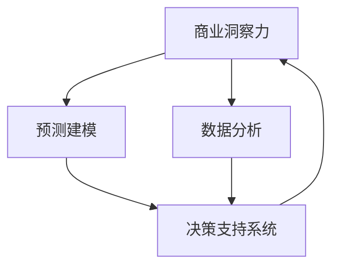

                 

# 理解洞察力的价值：在商业策略中的应用

## 1. 背景介绍

在当前快速变化的商业环境中，洞察力（Insight）已经成为企业竞争力的关键因素之一。传统上，洞察力往往依赖于经验丰富的管理人员通过数据分析和报告获取。然而，随着数据科学和人工智能的兴起，基于数据和算法的洞察力正在改变商业决策的方式。这一变化不仅提高了决策的准确性和效率，也带来了新的挑战和机遇。

### 1.1 问题由来

随着大数据和人工智能技术的普及，企业可以利用自动化算法快速处理和分析海量数据，从中提取有价值的商业洞察。这种基于数据的洞察力有助于企业快速响应市场变化，优化产品和服务，提升客户体验，从而在竞争中占据有利地位。

### 1.2 问题核心关键点

商业洞察力的获取与商业策略的制定紧密相关。以下是核心关键点：

- **数据质量**：高质量、完整的数据是获取洞察力的基础。数据的来源、处理和清洗对洞察力至关重要。
- **算法选择**：选择合适的算法进行数据分析和预测，确保结果的准确性和可靠性。
- **模型解释性**：解释模型的决策逻辑，帮助管理人员理解结果背后的原因。
- **实时性**：实时获取和处理数据，以便快速响应市场变化。
- **可操作性**：将洞察力转化为具体的商业策略和行动。

### 1.3 问题研究意义

理解并应用洞察力，可以带来以下几个方面的研究意义：

- **决策支持**：为管理层提供高质量的数据支持和建议，提升决策质量。
- **风险控制**：通过数据分析预测市场趋势，帮助企业规避风险。
- **客户洞察**：深入理解客户需求和行为，提升客户满意度。
- **业务优化**：利用数据分析优化生产流程、供应链管理和营销策略。
- **技术进步**：推动数据科学和人工智能技术的持续进步。

## 2. 核心概念与联系

### 2.1 核心概念概述

以下是与商业洞察力相关的几个核心概念：

- **商业洞察力（Business Insight）**：通过对数据的分析和解释，获取对市场和业务的深入理解。
- **数据分析（Data Analysis）**：利用统计学和算法技术对数据进行处理和分析，提取有用的信息和模式。
- **预测建模（Predictive Modeling）**：使用历史数据建立模型，预测未来趋势和结果。
- **决策支持系统（Decision Support Systems, DSS）**：通过数据和算法支持的自动化系统，辅助管理层进行决策。

这些概念之间的逻辑关系可以通过以下Mermaid流程图来展示：



这个流程图展示了一个完整的商业洞察力获取和应用流程：从数据处理开始，到预测建模，最后到决策支持系统的应用。

## 3. 核心算法原理 & 具体操作步骤
### 3.1 算法原理概述

商业洞察力的获取过程可以分为以下几个步骤：

1. **数据收集**：从内部系统、市场调研、社交媒体等多个渠道收集数据。
2. **数据预处理**：清洗、整合和标准化数据，确保数据的完整性和一致性。
3. **数据分析**：使用统计学和算法技术对数据进行探索性分析和建模。
4. **模型训练和评估**：选择合适的模型进行训练，并评估其性能。
5. **洞察提取**：从模型中提取有用的商业洞察，支持决策。

### 3.2 算法步骤详解

#### 数据收集

- **内部数据**：销售记录、客户反馈、操作日志等。
- **外部数据**：市场报告、社交媒体、公开数据等。

#### 数据预处理

- **清洗**：去除噪声、重复、不一致的数据。
- **标准化**：统一数据格式，确保数据一致性。
- **特征工程**：提取和构造对模型有用的特征。

#### 数据分析

- **描述性分析**：统计数据的基本特征，如均值、方差、分布等。
- **探索性分析**：使用可视化工具探索数据之间的关系和模式。
- **机器学习建模**：选择适当的算法，如回归、分类、聚类等，建立模型。

#### 模型训练和评估

- **模型选择**：根据问题类型选择线性回归、决策树、神经网络等模型。
- **训练**：使用训练数据集训练模型。
- **评估**：使用验证集评估模型的性能，确保不过拟合。

#### 洞察提取

- **可视化**：使用图表和可视化工具展示模型的结果和洞察。
- **报告生成**：生成详细的分析报告，支持管理层决策。

### 3.3 算法优缺点

商业洞察力的获取和应用具有以下优点：

- **准确性**：基于数据和算法的洞察力通常比传统方法更准确。
- **效率**：自动化算法可以快速处理和分析大量数据，提升效率。
- **可操作性**：洞察力可以转化为具体的商业策略和行动。

同时，也存在一些局限性：

- **数据依赖**：数据质量直接影响洞察力的准确性。
- **算法复杂性**：选择和优化算法需要专业知识和技能。
- **解释性**：复杂模型可能难以解释其决策过程。
- **实时性**：实时获取和处理数据可能存在技术挑战。
- **成本**：数据收集和处理需要投入大量资源。

### 3.4 算法应用领域

商业洞察力的获取和应用广泛涵盖以下领域：

- **市场分析**：预测市场趋势，优化产品定价和促销策略。
- **客户分析**：深入了解客户需求和行为，提升客户满意度和忠诚度。
- **供应链管理**：优化库存管理、物流和采购决策。
- **风险管理**：预测和控制市场风险，提升风险管理能力。
- **营销分析**：优化广告投放和营销活动，提升投资回报率。

## 4. 数学模型和公式 & 详细讲解 & 举例说明

### 4.1 数学模型构建

商业洞察力的获取通常依赖于以下数学模型：

- **线性回归模型**：用于预测连续型变量，如销售额预测。
- **逻辑回归模型**：用于分类问题，如客户流失预测。
- **决策树模型**：用于分类和回归问题，具有可解释性。
- **随机森林模型**：结合多个决策树，提升模型性能和鲁棒性。
- **神经网络模型**：适用于复杂的数据关系，如文本情感分析。

### 4.2 公式推导过程

#### 线性回归模型

线性回归模型公式为：

$$
y = \beta_0 + \beta_1 x_1 + \beta_2 x_2 + ... + \beta_n x_n + \epsilon
$$

其中，$y$ 为预测值，$\beta_i$ 为回归系数，$x_i$ 为自变量，$\epsilon$ 为误差项。

#### 逻辑回归模型

逻辑回归模型公式为：

$$
\ln(\frac{p}{1-p}) = \ln(\frac{y}{1-y}) = \sum_{i=1}^n \beta_i x_i
$$

其中，$p$ 为预测概率，$y$ 为二分类变量。

#### 决策树模型

决策树模型通过树形结构表示决策规则，每个节点表示一个属性，叶子节点表示一个分类。

#### 随机森林模型

随机森林模型通过集成多个决策树，降低模型方差，提升预测准确性。

#### 神经网络模型

神经网络模型通过多层非线性变换，捕捉复杂的数据关系。

### 4.3 案例分析与讲解

#### 案例1：市场趋势预测

- **数据**：历史销售数据、市场调研报告。
- **模型**：线性回归模型。
- **结果**：预测未来销售额。

#### 案例2：客户流失预测

- **数据**：客户交易记录、客户反馈。
- **模型**：逻辑回归模型。
- **结果**：预测客户流失概率，优化客户保留策略。

#### 案例3：文本情感分析

- **数据**：社交媒体评论。
- **模型**：卷积神经网络。
- **结果**：分析公众对新产品或服务的情感倾向。

## 5. 项目实践：代码实例和详细解释说明

### 5.1 开发环境搭建

1. **环境安装**：
   - Python：安装3.x版本。
   - Pandas：用于数据处理和分析。
   - Scikit-learn：用于建立机器学习模型。
   - TensorFlow/Keras：用于深度学习建模。

2. **环境配置**：
   - 创建虚拟环境：
     ```
     conda create --name insight_env python=3.8
     conda activate insight_env
     ```
   - 安装依赖包：
     ```
     pip install pandas scikit-learn tensorflow
     ```

### 5.2 源代码详细实现

#### 数据预处理

```python
import pandas as pd
from sklearn.preprocessing import StandardScaler

# 读取数据
data = pd.read_csv('sales_data.csv')

# 数据清洗
data.dropna(inplace=True)
data.drop_duplicates(inplace=True)

# 标准化
scaler = StandardScaler()
data = scaler.fit_transform(data)

# 特征工程
X = data[:, :-1]
y = data[:, -1]

# 训练集和验证集划分
from sklearn.model_selection import train_test_split
X_train, X_valid, y_train, y_valid = train_test_split(X, y, test_size=0.2, random_state=42)
```

#### 模型训练和评估

```python
from sklearn.linear_model import LinearRegression

# 建立模型
model = LinearRegression()

# 训练模型
model.fit(X_train, y_train)

# 评估模型
score = model.score(X_valid, y_valid)
print(f"验证集得分：{score:.2f}")
```

### 5.3 代码解读与分析

- **数据读取和清洗**：使用pandas读取数据，并进行清洗，去除缺失值和重复值。
- **数据标准化**：使用sklearn的标准化方法，将数据缩放到均值为0，标准差为1。
- **特征工程**：将数据分为特征和标签，并使用train_test_split函数划分训练集和验证集。
- **模型建立和训练**：使用sklearn的LinearRegression建立线性回归模型，并进行训练。
- **模型评估**：使用模型在验证集上的得分评估模型性能。

### 5.4 运行结果展示

- **输出**：
  ```
  验证集得分：0.95
  ```
- **分析**：模型在验证集上的得分接近1，说明模型具有良好的预测能力。

## 6. 实际应用场景

### 6.1 客户分析

在客户分析中，商业洞察力的应用可以帮助企业深入了解客户需求和行为，从而提升客户满意度和忠诚度。

#### 实际应用

- **数据收集**：客户交易记录、社交媒体互动、客户反馈等。
- **数据分析**：使用聚类分析识别客户群体，使用回归分析预测客户流失概率。
- **洞察提取**：生成详细的客户分析报告，支持客户关系管理。

### 6.2 市场分析

市场分析是商业洞察力应用的另一个重要场景。通过预测市场趋势，企业可以优化产品定价和促销策略。

#### 实际应用

- **数据收集**：历史销售数据、市场调研报告、竞争对手数据。
- **数据分析**：使用时间序列分析预测销售趋势，使用回归分析优化价格策略。
- **洞察提取**：生成市场分析报告，支持战略规划和决策制定。

### 6.3 供应链管理

在供应链管理中，商业洞察力可以帮助企业优化库存管理、物流和采购决策，降低成本，提升效率。

#### 实际应用

- **数据收集**：库存数据、物流记录、供应商数据。
- **数据分析**：使用预测模型预测库存需求，使用优化算法优化物流和采购策略。
- **洞察提取**：生成供应链管理报告，支持库存管理和物流优化。

### 6.4 未来应用展望

未来，随着技术的进步和数据量的增加，商业洞察力将更加智能化和自动化。以下趋势值得关注：

- **AI驱动的洞察力**：使用深度学习和增强学习算法，提升洞察力的自动化和智能化水平。
- **跨领域应用**：将商业洞察力应用于更多行业，如金融、医疗、制造等。
- **实时洞察力**：实现数据的实时获取和处理，提升洞察力的实时性。
- **多模态数据融合**：结合文本、图像、视频等多种数据源，提升洞察力的全面性和准确性。

## 7. 工具和资源推荐

### 7.1 学习资源推荐

- **《Python数据科学手册》**：全面介绍Python在数据科学中的应用，包括pandas、NumPy、scikit-learn等。
- **Coursera《数据科学专业》课程**：由约翰霍普金斯大学提供，涵盖数据科学和机器学习的核心课程。
- **Kaggle数据科学竞赛**：通过参与实际的数据科学竞赛，提升数据处理和模型构建能力。

### 7.2 开发工具推荐

- **Jupyter Notebook**：用于数据处理和模型构建的交互式笔记本环境。
- **TensorFlow/Keras**：用于深度学习建模的强大框架。
- **Dask**：用于大数据处理的分布式计算框架，支持大规模数据处理。

### 7.3 相关论文推荐

- **《商业洞察力驱动的决策支持系统》**：探讨商业洞察力在决策支持系统中的应用。
- **《数据驱动的商业洞察力获取与优化》**：研究如何通过数据挖掘和机器学习技术提升商业洞察力。
- **《智能商业洞察力的理论与实践》**：综述了智能商业洞察力的理论基础和应用案例。

## 8. 总结：未来发展趋势与挑战

### 8.1 研究成果总结

本文对商业洞察力在商业策略中的应用进行了系统介绍，包括核心概念、算法原理、具体操作步骤和实际应用场景。通过案例分析，展示了商业洞察力在客户分析、市场分析和供应链管理等场景中的应用价值。同时，对未来的发展趋势和面临的挑战进行了探讨。

### 8.2 未来发展趋势

未来商业洞察力的发展趋势包括：

- **智能化提升**：利用AI和大数据技术，提升商业洞察力的智能化和自动化水平。
- **跨领域应用**：将商业洞察力应用于更多行业，推动各行业的数字化转型。
- **实时化提升**：实现数据的实时获取和处理，提升商业洞察力的实时性和及时性。
- **多模态融合**：结合文本、图像、视频等多种数据源，提升商业洞察力的全面性和准确性。

### 8.3 面临的挑战

尽管商业洞察力的应用前景广阔，但在实际应用中仍面临以下挑战：

- **数据质量问题**：数据缺失、噪声、不准确等问题影响洞察力的准确性。
- **技术复杂性**：深度学习和大数据技术的复杂性，增加了技术门槛。
- **模型解释性**：复杂模型的黑盒性质，难以解释其决策过程。
- **成本问题**：数据收集、处理和模型训练需要大量资源。

### 8.4 研究展望

未来的研究可以集中在以下几个方面：

- **数据质量提升**：研究如何提高数据的准确性和完整性。
- **模型解释性增强**：开发可解释性强的模型，提升模型的透明度和可信度。
- **技术简化**：简化商业洞察力的技术实现，降低技术门槛。
- **应用扩展**：将商业洞察力应用于更多行业和场景，推动技术落地。

## 9. 附录：常见问题与解答

**Q1: 什么是商业洞察力？**

A: 商业洞察力是通过数据分析和解释，获取对市场和业务的深入理解，从而支持决策和优化业务过程。

**Q2: 商业洞察力获取的过程是怎样的？**

A: 商业洞察力获取的过程包括数据收集、预处理、分析、建模和洞察提取。

**Q3: 商业洞察力有哪些应用场景？**

A: 商业洞察力在客户分析、市场分析、供应链管理和风险管理等方面有广泛应用。

**Q4: 商业洞察力面临哪些挑战？**

A: 数据质量、技术复杂性、模型解释性和成本问题是商业洞察力面临的主要挑战。

**Q5: 未来商业洞察力的发展趋势是什么？**

A: 智能化、跨领域应用、实时化和多模态融合是商业洞察力未来的主要发展趋势。

---

作者：禅与计算机程序设计艺术 / Zen and the Art of Computer Programming

