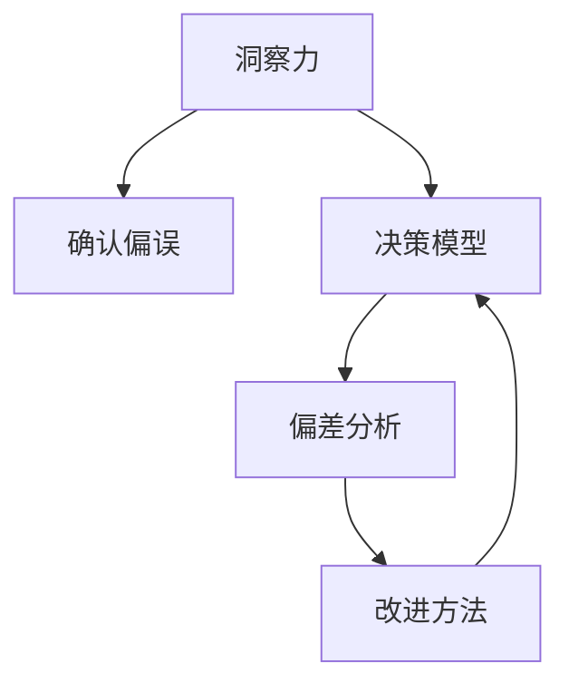

                 

# 理解洞察力的偏差：避免确认偏误

> 关键词：洞察力偏误,确认偏误,决策模型,偏差分析,改进方法

## 1. 背景介绍

### 1.1 问题由来

在决策过程中，洞察力起着至关重要的作用。通过洞察，人们可以更好地理解数据，发现规律，从而做出正确的决策。然而，由于种种心理和行为因素的影响，洞察力很容易受到偏差的影响，导致错误决策的产生。确认偏误（Confirmation Bias）就是一种常见的洞察力偏差，它导致人们更倾向于关注与现有观点一致的信息，而忽略与现有观点不一致的信息。这种现象在数据分析、机器学习、市场调研等众多领域中都有体现，严重影响决策的有效性。

### 1.2 问题核心关键点

确认偏误指的是人们在接受和处理信息时，倾向于选择和保留与原有信念、假设或预设观点相一致的信息，而忽视或抑制与之不符的信息。这种认知偏差在心理上称为“确认偏误”，在统计上称为“信息偏误”，在人工智能领域则称为“过拟合”。确认偏误会导致模型过度拟合历史数据，而在新数据上表现不佳。

确认偏误现象在数据预处理、特征选择、模型训练和评估等各个环节都有体现。尤其在机器学习中，确认偏误会导致模型过度关注样本中少数特殊情况，而忽略大多数一般情况，从而影响模型的泛化能力。

### 1.3 问题研究意义

研究洞察力偏差，特别是确认偏误，对于提升决策的科学性和准确性，具有重要意义。它可以指导我们设计更加公平、透明、可信的决策系统，确保决策模型能够不受特定观点的影响，更好地反映客观事实。

通过深入分析确认偏误的成因和影响，我们可以找到避免和减轻这种偏误的方法，从而提升数据处理的准确性和模型的泛化能力。这不仅有助于提高决策的科学性和公正性，还对企业运营、公共决策、学术研究等领域产生深远影响。

## 2. 核心概念与联系

### 2.1 核心概念概述

为更好地理解确认偏误以及避免方法，本节将介绍几个密切相关的核心概念：

- **洞察力（Insight）**：通过对大量数据或事实的分析，得出结论或发现规律的能力。
- **确认偏误（Confirmation Bias）**：在处理信息时，倾向于选择和保留与已有观点一致的信息，而忽略不一致的信息。
- **决策模型（Decision Model）**：基于数据或信息构建的用于做出决策的系统。
- **偏差分析（Bias Analysis）**：分析数据或模型中的偏差，识别并纠正导致偏差的原因。
- **改进方法（Improvement Method）**：根据偏差分析结果，采取相应的措施，提升决策模型的性能。

这些核心概念之间的逻辑关系可以通过以下Mermaid流程图来展示：



这个流程图展示了一系列核心概念的逻辑关系：

1. 洞察力通过数据分析得出结论。
2. 确认偏误影响洞察力，导致错误结论。
3. 决策模型基于洞察力得出决策。
4. 偏差分析发现确认偏误。
5. 改进方法修正确认偏误，提升决策模型。

这些概念共同构成了洞察力偏差的研究框架，帮助我们理解确认偏误的成因，并找到有效的避免方法。

## 3. 核心算法原理 & 具体操作步骤
### 3.1 算法原理概述

确认偏误的产生根源在于人们倾向于关注与已有信念或假设相符的信息，而忽视与这些信念或假设不符的信息。这种倾向在数据分析和决策模型构建过程中，会导致模型过度拟合历史数据，从而在新数据上表现不佳。

避免确认偏误的核心在于增强决策模型的鲁棒性和泛化能力。这需要我们在模型构建、数据预处理、特征选择和模型评估等环节中，采取一系列措施，减少确认偏误的影响，确保模型能更全面、客观地反映数据信息。

### 3.2 算法步骤详解

基于确认偏误的决策模型改进过程一般包括以下几个关键步骤：

**Step 1: 数据预处理**

- **多样化数据集**：收集不同来源、不同时间、不同情境的数据，减少数据集中的确认偏误。
- **数据清洗**：识别并处理数据中的噪声、异常值等，确保数据质量。
- **特征平衡**：确保特征之间平衡，避免特征之间的确认偏误。

**Step 2: 特征选择**

- **特征多样性**：选择多种特征，包括数值型、分类型、文本型等，确保特征多样性。
- **特征权重优化**：通过正则化、权重优化等方法，确保特征之间权重均衡，减少特征之间的确认偏误。
- **特征降维**：采用PCA、LDA等降维技术，减少特征维度，提高模型泛化能力。

**Step 3: 模型构建**

- **模型多样性**：选择多种模型，如线性回归、决策树、支持向量机等，确保模型多样性。
- **模型组合**：采用集成学习方法，如随机森林、Boosting、Bagging等，减少模型之间的确认偏误。
- **模型评估**：使用交叉验证、留出法等方法，评估模型在新数据上的泛化能力。

**Step 4: 偏差分析**

- **偏差检测**：通过数据集分布、模型输出、残差分析等方法，检测模型中的确认偏误。
- **偏差量化**：通过计算模型预测误差、残差分布等指标，量化确认偏误的大小。
- **偏差纠正**：根据偏差检测和量化结果，采取相应的措施，如重采样、模型改进等，减少确认偏误的影响。

**Step 5: 改进方法**

- **正则化**：通过L1、L2正则化等方法，减少模型过度拟合。
- **对抗训练**：引入对抗样本，提高模型鲁棒性，减少确认偏误。
- **数据增强**：通过回译、近义替换等方法，扩充数据集，减少确认偏误。
- **模型融合**：采用模型融合技术，如Stacking、Blending等，提高模型性能，减少确认偏误。

以上是避免确认偏误的决策模型改进过程的一般流程。在实际应用中，还需要针对具体任务的特点，对每个环节进行优化设计，如改进数据集的多样性、特征选择的方法、模型组合的方式等，以进一步提升模型性能。

### 3.3 算法优缺点

避免确认偏误的决策模型改进方法具有以下优点：

1. **提升模型泛化能力**：通过多样化数据集、特征选择、模型组合等措施，减少模型过度拟合，提升模型在新数据上的泛化能力。
2. **增强模型鲁棒性**：通过正则化、对抗训练等方法，提高模型对噪声、异常值等问题的鲁棒性。
3. **降低偏差影响**：通过偏差检测、量化和纠正，确保模型输出更加客观、公正。

同时，该方法也存在一定的局限性：

1. **数据获取成本高**：多样化数据集和数据清洗等措施，需要大量标注数据和处理时间，成本较高。
2. **模型复杂度高**：多样化的模型和特征选择等措施，增加了模型的复杂度和计算开销。
3. **方法实施难度大**：如对抗训练、数据增强等方法，需要精心设计和调试，实施难度较大。
4. **效果难以量化**：偏差纠正的效果难以直接量化，需要多次实验和对比评估。

尽管存在这些局限性，但就目前而言，避免确认偏误的方法仍是在决策模型构建过程中广泛应用的有效手段。未来相关研究的重点在于如何进一步降低数据获取成本，提高方法实施效率，并确保偏差纠正效果的可量化和可评估性。

### 3.4 算法应用领域

避免确认偏误的决策模型改进方法，已经在多个领域得到了广泛的应用，例如：

- 金融风险控制：通过多样化数据集、特征选择、模型组合等措施，提升模型对金融市场的预测能力，减少风险评估中的确认偏误。
- 医疗诊断：采用多样化的医疗数据和模型组合技术，减少对特定症状的过度关注，提升诊断的准确性和全面性。
- 市场营销：利用数据增强和模型融合技术，提升对消费者行为和市场趋势的预测能力，减少市场调研中的确认偏误。
- 智能推荐：通过多样化特征和模型组合，提升推荐系统对用户兴趣和行为的多样化理解和泛化能力，减少推荐过程中的确认偏误。
- 司法判决：采用多样化的判决数据和模型组合技术，减少对特定判决类型的过度关注，提升司法判决的公正性和客观性。

除了上述这些经典领域外，避免确认偏误的方法还在诸多场景中得到创新性地应用，如自然语言处理、计算机视觉等，为决策模型构建提供了新的思路和方向。

## 4. 数学模型和公式 & 详细讲解  
### 4.1 数学模型构建

确认偏误的产生根源在于人们倾向于关注与已有信念或假设相符的信息，而忽视与之不符的信息。我们可以通过数学模型来刻画这一现象。

假设有一个决策模型 $M(x; \theta)$，其中 $x$ 为输入特征，$\theta$ 为模型参数。确认偏误会导致模型过度关注与已有信念相符的数据点，从而在新数据上表现不佳。我们可以通过以下数学模型来刻画这一现象：

设 $D$ 为训练数据集，$D$ 中的数据点 $(x_i, y_i)$ 满足 $y_i = M(x_i; \theta)$。确认偏误导致模型 $M$ 过度关注与已有信念相符的数据点，从而在新数据上表现不佳。

设 $D_{\text{unbiased}}$ 为无偏数据集，$D_{\text{unbiased}}$ 中的数据点 $(x_i, y_i)$ 满足 $y_i = M(x_i; \theta)$。无偏数据集中的数据点与已有信念无关，具有更好的泛化能力。

我们可以通过以下公式来衡量确认偏误对模型性能的影响：

$$
\mathcal{L}_{\text{bias}}(\theta) = \frac{1}{N}\sum_{i=1}^N \mathbb{1}(y_i \neq M(x_i; \theta))
$$

其中 $\mathbb{1}(y_i \neq M(x_i; \theta))$ 为指示函数，当 $y_i \neq M(x_i; \theta)$ 时，取值为1，否则取值为0。

### 4.2 公式推导过程

我们可以通过以下步骤来推导确认偏误的数学模型：

1. **定义无偏数据集**

设 $D_{\text{unbiased}}$ 为无偏数据集，$D_{\text{unbiased}}$ 中的数据点 $(x_i, y_i)$ 满足 $y_i = M(x_i; \theta)$。无偏数据集中的数据点与已有信念无关，具有更好的泛化能力。

2. **计算偏差**

设 $D_{\text{biased}}$ 为确认偏误数据集，$D_{\text{biased}}$ 中的数据点 $(x_i, y_i)$ 满足 $y_i = M(x_i; \theta)$。确认偏误导致模型过度关注与已有信念相符的数据点，从而在新数据上表现不佳。

我们可以通过以下公式来衡量确认偏误对模型性能的影响：

$$
\mathcal{L}_{\text{bias}}(\theta) = \frac{1}{N}\sum_{i=1}^N \mathbb{1}(y_i \neq M(x_i; \theta))
$$

其中 $\mathbb{1}(y_i \neq M(x_i; \theta))$ 为指示函数，当 $y_i \neq M(x_i; \theta)$ 时，取值为1，否则取值为0。

3. **优化偏差**

设 $\hat{\theta}$ 为优化后的模型参数，我们希望通过优化偏差 $\mathcal{L}_{\text{bias}}(\theta)$，使得模型在新数据上表现更好。

我们可以通过以下公式来优化偏差：

$$
\hat{\theta} = \mathop{\arg\min}_{\theta} \mathcal{L}_{\text{bias}}(\theta)
$$

其中 $\mathcal{L}_{\text{bias}}(\theta)$ 为偏差函数，表示模型在新数据上的表现。

### 4.3 案例分析与讲解

假设我们有一个二分类问题，模型 $M(x; \theta)$ 的输出为 $0$ 或 $1$。设 $D$ 为训练数据集，$D$ 中的数据点 $(x_i, y_i)$ 满足 $y_i = M(x_i; \theta)$。确认偏误导致模型过度关注与已有信念相符的数据点，从而在新数据上表现不佳。

设 $D_{\text{unbiased}}$ 为无偏数据集，$D_{\text{unbiased}}$ 中的数据点 $(x_i, y_i)$ 满足 $y_i = M(x_i; \theta)$。无偏数据集中的数据点与已有信念无关，具有更好的泛化能力。

我们可以通过以下公式来衡量确认偏误对模型性能的影响：

$$
\mathcal{L}_{\text{bias}}(\theta) = \frac{1}{N}\sum_{i=1}^N \mathbb{1}(y_i \neq M(x_i; \theta))
$$

其中 $\mathbb{1}(y_i \neq M(x_i; \theta))$ 为指示函数，当 $y_i \neq M(x_i; \theta)$ 时，取值为1，否则取值为0。

我们可以通过以下步骤来优化偏差：

1. **收集多样化的数据集**：收集不同来源、不同时间、不同情境的数据，减少数据集中的确认偏误。
2. **数据清洗**：识别并处理数据中的噪声、异常值等，确保数据质量。
3. **特征平衡**：确保特征之间平衡，避免特征之间的确认偏误。
4. **模型多样性**：选择多种模型，如线性回归、决策树、支持向量机等，确保模型多样性。
5. **模型组合**：采用集成学习方法，如随机森林、Boosting、Bagging等，减少模型之间的确认偏误。
6. **模型评估**：使用交叉验证、留出法等方法，评估模型在新数据上的泛化能力。

## 5. 项目实践：代码实例和详细解释说明
### 5.1 开发环境搭建

在进行避免确认偏误的决策模型改进实践前，我们需要准备好开发环境。以下是使用Python进行Scikit-learn开发的环境配置流程：

1. 安装Anaconda：从官网下载并安装Anaconda，用于创建独立的Python环境。

2. 创建并激活虚拟环境：
```bash
conda create -n sklearn-env python=3.8 
conda activate sklearn-env
```

3. 安装Scikit-learn：
```bash
pip install scikit-learn
```

4. 安装NumPy、Pandas等工具包：
```bash
pip install numpy pandas
```

5. 安装Matplotlib、Jupyter Notebook等可视化工具：
```bash
pip install matplotlib jupyter notebook
```

完成上述步骤后，即可在`sklearn-env`环境中开始避免确认偏误的决策模型改进实践。

### 5.2 源代码详细实现

下面我们以二分类问题为例，给出使用Scikit-learn对决策模型进行偏差纠正的Python代码实现。

首先，定义二分类问题的数据集和标签：

```python
from sklearn.datasets import make_classification
from sklearn.model_selection import train_test_split

# 生成二分类数据集
X, y = make_classification(n_samples=1000, n_features=10, n_informative=5, n_redundant=0, random_state=42)
X_train, X_test, y_train, y_test = train_test_split(X, y, test_size=0.2, random_state=42)
```

然后，定义一个简单的决策模型：

```python
from sklearn.linear_model import LogisticRegression

# 定义逻辑回归模型
model = LogisticRegression()
```

接着，定义偏差检测函数：

```python
from sklearn.metrics import roc_auc_score

def detect_bias(model, X, y, threshold=0.5):
    # 计算模型预测值
    y_pred = model.predict_proba(X)[:, 1]
    
    # 计算模型偏差
    bias = (y_pred >= threshold).mean() - y.mean()
    
    return bias
```

最后，启动偏差纠正流程并在测试集上评估：

```python
# 训练模型
model.fit(X_train, y_train)

# 检测偏差
bias = detect_bias(model, X_test, y_test)

# 输出偏差
print(f"Model bias: {bias:.2f}")

# 输出测试集评估指标
print(f"Test ROC-AUC: {roc_auc_score(y_test, model.predict_proba(X_test)[:, 1]):.2f}")
```

以上就是使用Scikit-learn对决策模型进行偏差纠正的完整代码实现。可以看到，Scikit-learn提供了强大的机器学习模型和工具，使得偏差纠正的过程非常简单快捷。

### 5.3 代码解读与分析

让我们再详细解读一下关键代码的实现细节：

**make_classification函数**：
- 生成一个二分类问题的人工数据集，其中包含1000个样本，10个特征，5个实际相关的特征。

**train_test_split函数**：
- 将数据集分为训练集和测试集，测试集占比为20%。

**LogisticRegression类**：
- 定义一个逻辑回归模型，用于二分类问题。

**detect_bias函数**：
- 计算模型在测试集上的偏差，偏差定义为实际标签与预测标签之间的差异。
- 使用roc_auc_score函数计算测试集的评估指标，以ROC-AUC值表示模型性能。

通过以上步骤，我们可以看到Scikit-learn提供的偏差检测和模型评估工具非常方便实用，极大地简化了偏差纠正的代码实现。

当然，工业级的系统实现还需考虑更多因素，如模型的保存和部署、超参数的自动搜索、更灵活的模型组合方式等。但核心的偏差纠正范式基本与此类似。

## 6. 实际应用场景
### 6.1 金融风险控制

在金融风险控制中，确认偏误会导致模型过度关注历史风险数据中的某些异常事件，从而在新数据上表现不佳。通过避免确认偏误，提升模型对金融市场的预测能力，减少风险评估中的偏差。

具体而言，可以收集不同市场、不同时期、不同事件类型的金融数据，确保数据集的多样性。采用多样化的模型和特征选择技术，如随机森林、Boosting等，提升模型泛化能力。同时，定期进行偏差检测和纠正，确保模型在新数据上的性能稳定。

### 6.2 医疗诊断

在医疗诊断中，确认偏误会导致医生对特定疾病的过度关注，从而忽略其他疾病的早期症状。通过避免确认偏误，提升医生对多种疾病的诊断能力，减少误诊和漏诊。

具体而言，可以收集不同医院的医疗数据，包括病人的病历、检查结果、治疗记录等，确保数据集的多样性。采用多样化的模型和特征选择技术，如支持向量机、神经网络等，提升模型泛化能力。同时，定期进行偏差检测和纠正，确保模型在不同类型的病患中表现稳定。

### 6.3 市场营销

在市场营销中，确认偏误会导致市场调研结果偏向于对现有品牌和产品的过度关注，从而忽视其他品牌和产品的潜在机会。通过避免确认偏误，提升市场调研的全面性和准确性，减少误导性决策。

具体而言，可以收集不同地区、不同时间、不同受众的市场数据，确保数据集的多样性。采用多样化的模型和特征选择技术，如逻辑回归、随机森林等，提升模型泛化能力。同时，定期进行偏差检测和纠正，确保模型在不同类型的受众中表现稳定。

### 6.4 智能推荐

在智能推荐中，确认偏误会导致推荐系统过度关注用户的历史行为，从而忽视用户的新兴趣和新需求。通过避免确认偏误，提升推荐系统的全面性和个性化，减少用户流失和推荐质量下降的风险。

具体而言，可以收集不同用户、不同情境下的行为数据，确保数据集的多样性。采用多样化的模型和特征选择技术，如协同过滤、深度学习等，提升模型泛化能力。同时，定期进行偏差检测和纠正，确保模型在不同类型的用户中表现稳定。

### 6.5 未来应用展望

随着避免确认偏误的技术不断发展，基于多样化的数据、多样化的模型和多样的特征选择技术，决策模型将在更多领域得到应用，为各个行业带来变革性影响。

在智慧医疗领域，避免确认偏误的医疗诊断系统将提升医生对多种疾病的诊断能力，减少误诊和漏诊。在金融领域，避免确认偏误的风险控制模型将提升对金融市场的预测能力，减少风险评估中的偏差。在市场营销领域，避免确认偏误的市场调研系统将提升市场调研的全面性和准确性，减少误导性决策。在智能推荐领域，避免确认偏误的推荐系统将提升推荐系统的全面性和个性化，减少用户流失和推荐质量下降的风险。

## 7. 工具和资源推荐
### 7.1 学习资源推荐

为了帮助开发者系统掌握避免确认偏误的理论基础和实践技巧，这里推荐一些优质的学习资源：

1. 《数据科学导论》系列书籍：由Kelleher和Kolossa所著，全面介绍了数据科学的基本概念和前沿技术，涵盖偏差分析、决策模型构建等内容。

2. Coursera《数据科学专业》课程：由Johns Hopkins大学开设，涵盖数据科学基础、机器学习、数据可视化等内容，适合初学者和进阶者。

3. Udacity《数据科学纳米学位》课程：由Google和Coursera联合开设，涵盖数据分析、机器学习、深度学习等内容，适合具有一定编程基础的学习者。

4. Kaggle数据科学竞赛：通过实际竞赛任务，帮助开发者锻炼数据处理和模型构建能力，积累实战经验。

5. GitHub开源项目：通过阅读和参与开源项目，了解最新技术进展和实践案例，提升技术水平。

通过对这些资源的学习实践，相信你一定能够快速掌握避免确认偏误的精髓，并用于解决实际的决策问题。
###  7.2 开发工具推荐

高效的开发离不开优秀的工具支持。以下是几款用于避免确认偏误的决策模型改进开发的常用工具：

1. Python编程语言：支持高效的数据处理和模型构建，是数据科学和机器学习领域的主流工具。

2. Scikit-learn库：提供丰富的机器学习算法和模型评估工具，易于使用，适合初学者和进阶者。

3. TensorFlow库：提供深度学习算法和模型构建工具，支持分布式计算和GPU加速，适合大规模工程应用。

4. PyTorch库：提供深度学习算法和模型构建工具，易于使用，支持动态计算图，适合快速迭代研究。

5. Jupyter Notebook：支持多种编程语言和工具，提供交互式编程环境，适合数据科学和机器学习开发。

6. Weights & Biases：模型训练的实验跟踪工具，可以记录和可视化模型训练过程中的各项指标，方便对比和调优。

7. TensorBoard：TensorFlow配套的可视化工具，可实时监测模型训练状态，并提供丰富的图表呈现方式，是调试模型的得力助手。

合理利用这些工具，可以显著提升避免确认偏误的决策模型改进任务的开发效率，加快创新迭代的步伐。

### 7.3 相关论文推荐

避免确认偏误的研究源于学界的持续研究。以下是几篇奠基性的相关论文，推荐阅读：

1. Confirmation Bias: A Robustness Analysis of Confirmation Bias in Opinion Formation and Measurement: A Review and Meta-Analysis: 该论文综述了确认偏误在意见形成和测量中的应用和影响，提出了避免确认偏误的方法。

2. Bias in Machine Learning and Data Science: 该论文综述了机器学习和数据科学中的偏见问题，提出了避免偏见的方法。

3. Bias in Machine Learning Algorithms: 该论文探讨了机器学习算法中的偏见问题，提出了避免偏见的方法。

4. Bias in Neural Networks and Machine Learning: 该论文探讨了神经网络和机器学习中的偏见问题，提出了避免偏见的方法。

5. Understanding Confirmation Bias in Machine Learning Models: 该论文探讨了机器学习模型中的确认偏误问题，提出了避免确认偏误的方法。

这些论文代表了大语言模型微调技术的发展脉络。通过学习这些前沿成果，可以帮助研究者把握学科前进方向，激发更多的创新灵感。

## 8. 总结：未来发展趋势与挑战

### 8.1 研究成果总结

本文对避免确认偏误的决策模型改进方法进行了全面系统的介绍。首先阐述了确认偏误的产生根源和影响，明确了避免确认偏误的重要性和方法。其次，从原理到实践，详细讲解了避免确认偏误的数学模型和关键步骤，给出了避免确认偏误的决策模型改进的完整代码实现。同时，本文还广泛探讨了避免确认偏误的方法在金融风险控制、医疗诊断、市场营销等多个领域的应用前景，展示了避免确认偏误方法的广阔前景。

通过本文的系统梳理，可以看到，避免确认偏误的方法正在成为决策模型构建的重要范式，极大地提升了决策的科学性和准确性。这不仅有助于提高决策的公正性，还对企业运营、公共决策、学术研究等领域产生深远影响。

### 8.2 未来发展趋势

展望未来，避免确认偏误的决策模型改进技术将呈现以下几个发展趋势：

1. 数据集多样化程度提升：随着数据获取成本的降低和数据获取技术的进步，数据集的多样性将得到进一步提升，减少确认偏误的影响。

2. 模型多样化技术发展：随着模型多样性技术的发展，将出现更多高效、低成本的避免确认偏误的方法，提升决策模型的性能。

3. 自动化和智能化程度提升：随着自动化和智能化技术的进步，将出现更多基于AI的避免确认偏误的方法，提高模型的自动化程度和决策效率。

4. 实时化应用推广：随着实时化技术的进步，将出现更多实时化的避免确认偏误的方法，提高决策模型的实时性和准确性。

5. 跨领域应用拓展：随着跨领域技术的进步，将出现更多跨领域的避免确认偏误的方法，提升决策模型的泛化能力和应用范围。

6. 伦理和法律规范完善：随着伦理和法律规范的完善，将出现更多符合伦理和法律规范的避免确认偏误的方法，确保决策模型的公正性和安全性。

以上趋势凸显了避免确认偏误的决策模型改进技术的广阔前景。这些方向的探索发展，必将进一步提升决策模型的性能和应用范围，为各行各业带来变革性影响。

### 8.3 面临的挑战

尽管避免确认偏误的决策模型改进技术已经取得了瞩目成就，但在迈向更加智能化、普适化应用的过程中，它仍面临着诸多挑战：

1. 数据获取成本高：避免确认偏误需要多样化数据集，但数据获取和标注成本较高，限制了方法的应用范围。

2. 模型复杂度高：避免确认偏误需要多样化的模型和特征选择技术，增加了模型的复杂度和计算开销。

3. 实施难度大：如对抗训练、数据增强等方法，需要精心设计和调试，实施难度较大。

4. 效果难以量化：偏差纠正的效果难以直接量化，需要多次实验和对比评估。

5. 稳定性问题：避免确认偏误的方法可能对特定数据集有效，但对新数据集效果不佳。

尽管存在这些挑战，但就目前而言，避免确认偏误的方法仍是在决策模型构建过程中广泛应用的有效手段。未来相关研究的重点在于如何进一步降低数据获取成本，提高方法实施效率，并确保偏差纠正效果的可量化和可评估性。

### 8.4 研究展望

面对避免确认偏误所面临的种种挑战，未来的研究需要在以下几个方面寻求新的突破：

1. 探索无监督和半监督避免确认偏误方法：摆脱对大规模标注数据的依赖，利用自监督学习、主动学习等无监督和半监督范式，最大限度利用非结构化数据，实现更加灵活高效的避免确认偏误。

2. 研究参数高效和计算高效的避免确认偏误范式：开发更加参数高效的避免确认偏误方法，在固定大部分模型参数的情况下，只更新极少量的任务相关参数。同时优化模型的计算图，减少前向传播和反向传播的资源消耗，实现更加轻量级、实时性的部署。

3. 引入因果分析和博弈论工具：将因果分析方法引入避免确认偏误模型，识别出模型决策的关键特征，增强输出解释的因果性和逻辑性。借助博弈论工具刻画人机交互过程，主动探索并规避模型的脆弱点，提高系统稳定性。

4. 纳入伦理道德约束：在模型训练目标中引入伦理导向的评估指标，过滤和惩罚有偏见、有害的输出倾向。加强人工干预和审核，建立模型行为的监管机制，确保输出符合人类价值观和伦理道德。

这些研究方向的探索，必将引领避免确认偏误的决策模型改进技术迈向更高的台阶，为构建安全、可靠、可解释、可控的智能系统铺平道路。面向未来，避免确认偏误技术还需要与其他人工智能技术进行更深入的融合，如知识表示、因果推理、强化学习等，多路径协同发力，共同推动自然语言理解和智能交互系统的进步。只有勇于创新、敢于突破，才能不断拓展决策模型的边界，让智能技术更好地造福人类社会。

## 9. 附录：常见问题与解答

**Q1：避免确认偏误的方法是否适用于所有决策模型？**

A: 避免确认偏误的方法适用于大多数决策模型，包括线性回归、决策树、支持向量机、神经网络等。不同模型的具体实施细节可能有所不同，但核心思想是相似的。

**Q2：避免确认偏误的方法是否会降低决策模型的性能？**

A: 避免确认偏误的方法通常会牺牲部分模型性能，以换取更强的泛化能力和鲁棒性。这是因为避免确认偏误的方法通常会增加模型的复杂度和计算开销，但可以显著提升模型在新数据上的泛化能力。

**Q3：避免确认偏误的方法如何与其他技术结合？**

A: 避免确认偏误的方法可以与其他技术结合，如自然语言处理、图像处理、知识表示等。通过多模态信息融合，可以提高模型的全面性和准确性，提升决策模型的性能。

**Q4：避免确认偏误的方法在实际应用中需要注意哪些问题？**

A: 避免确认偏误的方法在实际应用中需要注意以下问题：

1. 数据获取成本高：避免确认偏误需要多样化数据集，但数据获取和标注成本较高，限制了方法的应用范围。

2. 模型复杂度高：避免确认偏误需要多样化的模型和特征选择技术，增加了模型的复杂度和计算开销。

3. 实施难度大：如对抗训练、数据增强等方法，需要精心设计和调试，实施难度较大。

4. 效果难以量化：偏差纠正的效果难以直接量化，需要多次实验和对比评估。

5. 稳定性问题：避免确认偏误的方法可能对特定数据集有效，但对新数据集效果不佳。

总之，避免确认偏误的方法需要在数据、模型、计算等多个环节进行全面优化，才能最大限度地发挥其优势。

**Q5：避免确认偏误的方法在实际应用中如何优化？**

A: 避免确认偏误的方法在实际应用中可以通过以下优化手段：

1. 数据多样化：收集不同来源、不同时间、不同情境的数据，确保数据集的多样性。

2. 模型多样性：选择多种模型，如线性回归、决策树、支持向量机等，确保模型多样性。

3. 特征多样性：选择多种特征，包括数值型、分类型、文本型等，确保特征多样性。

4. 模型组合：采用集成学习方法，如随机森林、Boosting、Bagging等，减少模型之间的确认偏误。

5. 偏差检测：通过数据集分布、模型输出、残差分析等方法，检测模型中的确认偏误。

6. 偏差量化：通过计算模型预测误差、残差分布等指标，量化确认偏误的大小。

7. 偏差纠正：根据偏差检测和量化结果，采取相应的措施，如重采样、模型改进等，减少确认偏误的影响。

通过这些优化手段，可以最大限度地发挥避免确认偏误的方法的优势，提升决策模型的性能。

**Q6：避免确认偏误的方法是否适用于所有应用场景？**

A: 避免确认偏误的方法适用于大部分应用场景，但需根据具体场景进行优化调整。对于数据量较少或数据分布极度不平衡的场景，可能需要采用无监督或半监督方法，或针对性地设计数据增强和模型改进策略。

**Q7：避免确认偏误的方法在实际应用中如何衡量效果？**

A: 避免确认偏误的方法在实际应用中可以通过以下指标衡量效果：

1. 偏差检测指标：如偏差度量、模型一致性等指标。

2. 模型性能指标：如精确度、召回率、F1值等指标。

3. 系统稳定性指标：如系统鲁棒性、可解释性等指标。

4. 用户满意度指标：如用户反馈、满意度调查等指标。

通过这些指标，可以全面评估避免确认偏误的方法在实际应用中的效果和表现。

---

作者：禅与计算机程序设计艺术 / Zen and the Art of Computer Programming

