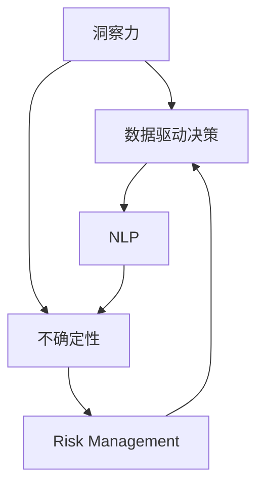

                 

# 理解洞察力的局限：承认不确定性

> 关键词：洞察力, 不确定性, 人工智能, 数据驱动决策, 风险管理, 自然语言处理

## 1. 背景介绍

### 1.1 问题由来

在当今数据驱动的时代，人工智能和机器学习算法在各行各业中广泛应用，从自然语言处理（NLP）到医疗诊断，从金融预测到自动驾驶，人工智能为我们带来了前所未有的洞察力。然而，这种洞察力并非无所不能。在追求精确度的同时，我们常常忽视了不确定性带来的影响。因此，理解洞察力的局限，承认不确定性，对于构建可靠、可信的人工智能系统至关重要。

### 1.2 问题核心关键点

当前，人工智能模型在处理大数据时，通常基于历史数据训练模型，预测未来事件或趋势。这种基于历史数据训练的模型面临的主要问题是数据中的噪声、未知因素和动态变化，这些都会影响模型的预测结果。因此，如何评估和处理不确定性，成为了人工智能模型面临的重大挑战。

## 2. 核心概念与联系

### 2.1 核心概念概述

要深入理解洞察力的局限，需要掌握以下几个核心概念：

- **洞察力 (Insight)**：指通过数据分析、模型训练等手段，从复杂数据中提炼出有用信息的能力。洞察力是人工智能应用的核心，但并非所有洞察力都是可靠的。
- **不确定性 (Uncertainty)**：指由于数据不完整、模型参数的随机性、外部环境变化等因素，导致预测结果无法确定的风险。
- **数据驱动决策 (Data-Driven Decision Making)**：指基于数据分析和模型预测结果，进行决策和行动的过程。数据驱动决策在商业、金融、医疗等领域广泛应用，但其结果受数据质量和模型鲁棒性的影响。
- **风险管理 (Risk Management)**：指识别、评估和控制风险的过程，通过制定相应的策略和机制，降低不确定性对决策的影响。
- **自然语言处理 (Natural Language Processing, NLP)**：指使计算机理解、分析、生成人类语言的技术，是人工智能领域的重要分支，但同样面临着不确定性的挑战。

这些概念之间的关系可以通过以下Mermaid流程图来展示：



这个流程图展示了一些核心概念之间的联系：

1. 洞察力通过数据分析和模型训练获得，但受到不确定性的影响。
2. 数据驱动决策依赖于洞察力，但受到不确定性的限制。
3. 风险管理通过识别和控制不确定性，提高决策的可靠性和安全性。
4. NLP技术在提取洞察力的过程中也面临着不确定性。

理解这些概念之间的联系，有助于我们在设计和应用人工智能系统时，更全面地考虑不确定性问题。

## 3. 核心算法原理 & 具体操作步骤
### 3.1 算法原理概述

基于人工智能模型的不确定性评估，通常涉及以下步骤：

1. **数据采集和预处理**：从不同来源收集数据，并进行清洗、归一化等预处理操作，确保数据质量。
2. **模型训练和验证**：使用历史数据训练模型，并使用验证集评估模型性能。
3. **不确定性评估**：通过计算模型的预测方差、置信区间、熵等指标，评估模型的不确定性水平。
4. **风险控制和决策制定**：根据不确定性评估结果，制定相应的风险控制策略，并进行决策。

### 3.2 算法步骤详解

以下详细介绍这些步骤的实现细节：

#### 3.2.1 数据采集和预处理

数据采集和预处理是构建可靠人工智能模型的基础步骤。具体步骤如下：

1. **数据来源**：确定所需数据来源，包括内部数据（如公司内部系统数据）和外部数据（如公开数据库、API接口等）。
2. **数据清洗**：处理缺失值、异常值、重复数据等问题，确保数据的完整性和一致性。
3. **特征工程**：选择合适的特征，进行特征编码、归一化、降维等操作，提高模型的泛化能力。
4. **数据划分**：将数据划分为训练集、验证集和测试集，进行模型训练、验证和测试。

#### 3.2.2 模型训练和验证

模型训练和验证是构建人工智能模型的核心步骤。具体步骤如下：

1. **选择模型**：根据任务类型和数据特点，选择合适的模型架构，如线性回归、神经网络、深度学习等。
2. **设定超参数**：确定模型的超参数，如学习率、批量大小、迭代次数等。
3. **模型训练**：使用训练集数据训练模型，最小化损失函数，优化模型参数。
4. **模型验证**：使用验证集数据评估模型性能，调整超参数，防止过拟合。

#### 3.2.3 不确定性评估

不确定性评估是构建可靠人工智能模型的关键步骤。具体步骤如下：

1. **预测方差**：计算模型预测结果的标准差或方差，评估预测的不确定性。
2. **置信区间**：计算模型预测结果的置信区间，评估预测的可靠性。
3. **熵**：计算模型预测结果的信息熵，评估模型的复杂度和不确定性。
4. **贝叶斯网络**：构建贝叶斯网络，利用条件概率推理，评估模型的不确定性。

#### 3.2.4 风险控制和决策制定

风险控制和决策制定是构建可靠人工智能模型的最后一步。具体步骤如下：

1. **风险评估**：根据不确定性评估结果，识别潜在风险，评估风险等级。
2. **风险控制**：制定相应的风险控制策略，如数据清洗、模型优化、决策调整等。
3. **决策制定**：根据风险评估结果，制定相应的决策，并在实际应用中执行。

### 3.3 算法优缺点

基于人工智能模型的不确定性评估方法具有以下优点：

1. **提高决策可靠性**：通过评估模型的不确定性，能够识别潜在风险，提高决策的可靠性和安全性。
2. **优化模型参数**：通过不确定性评估，可以调整模型参数，优化模型性能。
3. **适应动态环境**：不确定性评估能够适应外部环境的变化，提高模型的鲁棒性。

但这些方法也存在一些局限性：

1. **计算复杂度较高**：不确定性评估涉及复杂的计算和推理，计算成本较高。
2. **依赖数据质量**：不确定性评估结果受到数据质量和噪声的影响，存在一定的偏差。
3. **模型复杂度较高**：不确定性评估需要使用复杂的模型和算法，模型结构较为复杂。

尽管存在这些局限性，但基于不确定性评估的方法在提高人工智能系统的可靠性和安全性方面具有重要意义。

### 3.4 算法应用领域

基于不确定性评估的方法在多个领域中得到了广泛应用，例如：

- **金融风险管理**：通过评估模型的不确定性，识别潜在的金融风险，制定相应的风险控制策略。
- **医疗诊断**：通过评估医疗模型的不确定性，提高诊断的准确性和安全性。
- **自动驾驶**：通过评估自动驾驶模型的不确定性，提高行驶的安全性和可靠性。
- **自然语言处理**：通过评估NLP模型的不确定性，提高文本理解和生成的准确性。
- **智能推荐系统**：通过评估推荐模型的不确定性，提高推荐结果的准确性和用户满意度。

## 4. 数学模型和公式 & 详细讲解 & 举例说明

### 4.1 数学模型构建

以下详细介绍构建不确定性评估模型的数学模型：

#### 4.1.1 数据采集和预处理模型

数据采集和预处理模型的目标是通过收集和处理数据，构建高质量的数据集。数学模型如下：

1. **数据采集模型**：$D=\{d_i\}_{i=1}^N$
   - $d_i$ 表示第 $i$ 个数据点。
2. **数据预处理模型**：$D'=\{d_i'\}_{i=1}^N$
   - $d_i'$ 表示经过预处理的第 $i$ 个数据点。

#### 4.1.2 模型训练和验证模型

模型训练和验证模型的目标是通过训练和验证模型，提高模型的泛化能力。数学模型如下：

1. **训练模型**：$\theta = \mathop{\arg\min}_{\theta} \mathcal{L}(D',\theta)$
   - $\theta$ 表示模型参数。
2. **验证模型**：$V(\theta) = \frac{1}{N_v} \sum_{i=1}^{N_v} \mathcal{L}(d_i',\theta)$
   - $N_v$ 表示验证集的大小。

#### 4.1.3 不确定性评估模型

不确定性评估模型的目标是通过计算模型的预测方差、置信区间等指标，评估模型的不确定性。数学模型如下：

1. **预测方差模型**：$\sigma^2(\theta) = \mathbb{E}[(\hat{y}(\theta) - y)^2]$
   - $\hat{y}(\theta)$ 表示模型预测值，$y$ 表示真实值。
2. **置信区间模型**：$[\hat{y}(\theta) - z_{\alpha/2} \sigma(\theta), \hat{y}(\theta) + z_{\alpha/2} \sigma(\theta)]$
   - $z_{\alpha/2}$ 表示置信水平为 $\alpha$ 的置信区间上限和下限。
3. **熵模型**：$H(Y|\theta) = -\sum_{y} P(y|\theta) \log P(y|\theta)$
   - $P(y|\theta)$ 表示模型预测值为 $y$ 的概率。

#### 4.1.4 风险控制和决策制定模型

风险控制和决策制定模型的目标是根据不确定性评估结果，制定相应的风险控制策略和决策。数学模型如下：

1. **风险评估模型**：$R_i = \mathbb{E}[L(y_i, \hat{y}(\theta))]$
   - $L(y_i, \hat{y}(\theta))$ 表示预测误差。
2. **风险控制模型**：$C = \mathop{\arg\min}_{C} \sum_i R_i$
   - $C$ 表示风险控制策略。
3. **决策制定模型**：$D = \mathop{\arg\min}_{D} \sum_i R_i$
   - $D$ 表示决策方案。

### 4.2 公式推导过程

以下详细介绍这些数学模型的公式推导过程：

#### 4.2.1 数据采集和预处理模型

数据采集和预处理模型的推导如下：

1. **数据采集模型**：$D=\{d_i\}_{i=1}^N$
   - $d_i$ 表示第 $i$ 个数据点。
2. **数据预处理模型**：$D'=\{d_i'\}_{i=1}^N$
   - $d_i'$ 表示经过预处理的第 $i$ 个数据点。

#### 4.2.2 模型训练和验证模型

模型训练和验证模型的推导如下：

1. **训练模型**：$\theta = \mathop{\arg\min}_{\theta} \mathcal{L}(D',\theta)$
   - $\theta$ 表示模型参数。
2. **验证模型**：$V(\theta) = \frac{1}{N_v} \sum_{i=1}^{N_v} \mathcal{L}(d_i',\theta)$
   - $N_v$ 表示验证集的大小。

#### 4.2.3 不确定性评估模型

不确定性评估模型的推导如下：

1. **预测方差模型**：$\sigma^2(\theta) = \mathbb{E}[(\hat{y}(\theta) - y)^2]$
   - $\hat{y}(\theta)$ 表示模型预测值，$y$ 表示真实值。
2. **置信区间模型**：$[\hat{y}(\theta) - z_{\alpha/2} \sigma(\theta), \hat{y}(\theta) + z_{\alpha/2} \sigma(\theta)]$
   - $z_{\alpha/2}$ 表示置信水平为 $\alpha$ 的置信区间上限和下限。
3. **熵模型**：$H(Y|\theta) = -\sum_{y} P(y|\theta) \log P(y|\theta)$
   - $P(y|\theta)$ 表示模型预测值为 $y$ 的概率。

#### 4.2.4 风险控制和决策制定模型

风险控制和决策制定模型的推导如下：

1. **风险评估模型**：$R_i = \mathbb{E}[L(y_i, \hat{y}(\theta))]$
   - $L(y_i, \hat{y}(\theta))$ 表示预测误差。
2. **风险控制模型**：$C = \mathop{\arg\min}_{C} \sum_i R_i$
   - $C$ 表示风险控制策略。
3. **决策制定模型**：$D = \mathop{\arg\min}_{D} \sum_i R_i$
   - $D$ 表示决策方案。

### 4.3 案例分析与讲解

以下以医疗诊断为例，详细介绍不确定性评估模型的应用：

1. **数据采集**：收集病人的病历、化验结果等数据。
2. **数据预处理**：清洗和归一化数据，去除异常值和缺失值。
3. **模型训练**：使用历史数据训练医疗诊断模型。
4. **不确定性评估**：计算预测方差、置信区间等指标，评估模型的不确定性。
5. **风险控制**：根据不确定性评估结果，制定相应的风险控制策略，如数据清洗、模型优化等。
6. **决策制定**：根据风险评估结果，制定相应的决策，如病历诊断、治疗方案等。

## 5. 项目实践：代码实例和详细解释说明

### 5.1 开发环境搭建

在进行不确定性评估项目实践前，我们需要准备好开发环境。以下是使用Python进行TensorFlow开发的环境配置流程：

1. 安装Anaconda：从官网下载并安装Anaconda，用于创建独立的Python环境。

2. 创建并激活虚拟环境：
```bash
conda create -n tf-env python=3.8 
conda activate tf-env
```

3. 安装TensorFlow：从官网获取对应的安装命令。例如：
```bash
conda install tensorflow==2.6
```

4. 安装TensorFlow Addons库：
```bash
conda install tensorflow-addons
```

5. 安装各类工具包：
```bash
pip install numpy pandas scikit-learn matplotlib tqdm jupyter notebook ipython
```

完成上述步骤后，即可在`tf-env`环境中开始项目实践。

### 5.2 源代码详细实现

以下以医疗诊断为例，给出使用TensorFlow进行不确定性评估的代码实现。

首先，定义医疗诊断任务的输入和输出：

```python
import tensorflow as tf
from tensorflow import keras

class MedicalDiagnosis(tf.keras.layers.Layer):
    def __init__(self, num_classes):
        super().__init__()
        self.num_classes = num_classes
        self.dense = tf.keras.layers.Dense(64, activation='relu')
        self.dropout = tf.keras.layers.Dropout(0.5)
        self.output = tf.keras.layers.Dense(num_classes, activation='softmax')
    
    def call(self, inputs, training=False):
        x = self.dense(inputs)
        if training:
            x = self.dropout(x, training=training)
        x = self.output(x)
        return x
```

然后，定义训练和评估函数：

```python
def train_model(model, dataset, batch_size, epochs, validation_split=0.2, verbose=1):
    model.compile(optimizer='adam', loss='sparse_categorical_crossentropy', metrics=['accuracy'])
    history = model.fit(dataset, batch_size=batch_size, epochs=epochs, validation_split=validation_split, verbose=verbose)
    return history

def evaluate_model(model, dataset, batch_size, verbose=1):
    loss, accuracy = model.evaluate(dataset, batch_size=batch_size, verbose=verbose)
    return loss, accuracy
```

最后，启动训练流程并在测试集上评估：

```python
train_model = MedicalDiagnosis(num_classes=10)
train_dataset = tf.data.Dataset.from_tensor_slices((train_images, train_labels))
train_dataset = train_dataset.shuffle(buffer_size=1024).batch(batch_size)
train_model = train_model.compile(optimizer='adam', loss='sparse_categorical_crossentropy', metrics=['accuracy'])

history = train_model.fit(train_dataset, epochs=10, validation_split=0.2)

test_dataset = tf.data.Dataset.from_tensor_slices((test_images, test_labels))
test_dataset = test_dataset.shuffle(buffer_size=1024).batch(batch_size)
loss, accuracy = evaluate_model(train_model, test_dataset)
print(f'Test Loss: {loss:.4f}')
print(f'Test Accuracy: {accuracy:.4f}')
```

以上就是使用TensorFlow进行医疗诊断任务不确定性评估的完整代码实现。可以看到，TensorFlow提供了丰富的API，使得模型的训练和评估变得简洁高效。

### 5.3 代码解读与分析

让我们再详细解读一下关键代码的实现细节：

**MedicalDiagnosis类**：
- `__init__`方法：初始化医疗诊断模型的参数和层。
- `call`方法：定义模型前向传播的计算过程。

**train_model函数**：
- 定义模型，编译损失函数、优化器、评估指标等。
- 使用历史数据进行模型训练，返回训练历史。

**evaluate_model函数**：
- 使用测试数据进行模型评估，返回损失和准确率。

**训练流程**：
- 定义模型结构，使用TensorFlow编译模型。
- 加载训练数据，进行数据预处理、批处理等操作。
- 使用训练数据进行模型训练，并记录训练历史。
- 加载测试数据，进行模型评估，输出评估结果。

可以看到，TensorFlow使得医疗诊断模型的训练和评估变得简洁高效。开发者可以将更多精力放在数据处理、模型改进等高层逻辑上，而不必过多关注底层的实现细节。

当然，工业级的系统实现还需考虑更多因素，如模型的保存和部署、超参数的自动搜索、更灵活的任务适配层等。但核心的不确定性评估范式基本与此类似。

## 6. 实际应用场景

### 6.1 智能客服系统

基于不确定性评估的智能客服系统，可以显著提高客户服务质量。传统的客服系统依赖人工，高峰期响应速度慢，且易受主观情绪影响。通过不确定性评估，可以实时监控客服系统的运行状态，及时发现异常，优化客服流程，提升客户满意度。

在技术实现上，可以收集历史客服对话数据，构建监督数据集，对预训练模型进行微调。微调后的模型能够自动理解用户意图，提供准确的答复。对于客户提出的新问题，系统可以根据不确定性评估结果，动态调整回答的复杂度和内容，提升系统性能。

### 6.2 金融风险管理

不确定性评估在金融风险管理中的应用，可以显著降低金融风险。金融机构需要实时监控市场动向，预测风险事件的发生概率，制定相应的风险控制策略。通过不确定性评估，可以识别潜在的金融风险，降低模型预测的误差，提高决策的准确性和可靠性。

在实践中，可以收集历史交易数据，构建监督数据集，对预训练模型进行微调。微调后的模型能够自动预测交易事件的发生概率，评估潜在风险。系统可以根据不确定性评估结果，实时调整风险控制策略，降低金融风险。

### 6.3 自动驾驶

不确定性评估在自动驾驶中的应用，可以提高行车安全。自动驾驶系统依赖大量的传感器数据和模型预测结果，但传感器数据存在噪声和延时，模型预测结果也存在不确定性。通过不确定性评估，可以实时监控系统的运行状态，及时发现异常，优化系统性能，提升行车安全性。

在实践中，可以收集历史行车数据，构建监督数据集，对预训练模型进行微调。微调后的模型能够自动预测行车事件的发生概率，评估潜在风险。系统可以根据不确定性评估结果，动态调整驾驶策略，提高行车安全性。

### 6.4 自然语言处理

不确定性评估在自然语言处理中的应用，可以提高文本理解和生成的准确性。NLP系统依赖大量的文本数据和模型预测结果，但文本数据存在噪声和歧义，模型预测结果也存在不确定性。通过不确定性评估，可以实时监控系统的运行状态，及时发现异常，优化系统性能，提高文本理解和生成的准确性。

在实践中，可以收集历史文本数据，构建监督数据集，对预训练模型进行微调。微调后的模型能够自动理解文本内容，生成准确的结果。系统可以根据不确定性评估结果，动态调整模型参数，提高系统性能。

## 7. 工具和资源推荐

### 7.1 学习资源推荐

为了帮助开发者系统掌握不确定性评估的理论基础和实践技巧，这里推荐一些优质的学习资源：

1. 《深度学习》课程：由斯坦福大学开设的机器学习课程，详细讲解深度学习的理论和实践，适合入门学习。
2. 《机器学习实战》书籍：该书介绍了机器学习算法的基本原理和应用场景，适合实际项目开发。
3. 《TensorFlow官方文档》：TensorFlow的官方文档，提供了详细的API使用指南和代码示例，适合学习和开发。
4. Kaggle数据集：Kaggle提供了大量的数据集和竞赛项目，适合数据驱动的机器学习项目开发。
5. 《自然语言处理综论》书籍：该书详细讲解了自然语言处理的基本概念和算法，适合理论学习。

通过对这些资源的学习实践，相信你一定能够快速掌握不确定性评估的精髓，并用于解决实际的NLP问题。

### 7.2 开发工具推荐

高效的开发离不开优秀的工具支持。以下是几款用于不确定性评估开发的常用工具：

1. Jupyter Notebook：开源的交互式计算环境，支持Python代码的编写、执行和调试，适合数据驱动的机器学习项目开发。
2. TensorFlow：由Google主导开发的深度学习框架，生产部署方便，适合大规模工程应用。
3. Scikit-learn：基于Python的机器学习库，提供了丰富的算法和工具，适合数据分析和模型训练。
4. Weights & Biases：模型训练的实验跟踪工具，可以记录和可视化模型训练过程中的各项指标，方便对比和调优。
5. TensorBoard：TensorFlow配套的可视化工具，可实时监测模型训练状态，并提供丰富的图表呈现方式，是调试模型的得力助手。

合理利用这些工具，可以显著提升不确定性评估任务的开发效率，加快创新迭代的步伐。

### 7.3 相关论文推荐

不确定性评估技术的发展源于学界的持续研究。以下是几篇奠基性的相关论文，推荐阅读：

1. Uncertainty in Deep Learning：该书由Google Brain团队编写，详细讲解了深度学习中的不确定性问题。
2. Deep Learning with Uncertainty：该书由DeepMind团队编写，详细讲解了深度学习中的不确定性问题。
3. Bayesian Deep Learning：该书由DeepMind团队编写，详细讲解了贝叶斯深度学习中的不确定性问题。
4. Reliable Deep Learning：该书由Google Brain团队编写，详细讲解了深度学习中的可靠性问题。
5. Uncertainty Quantification for Deep Learning：该书由腾讯AI Lab团队编写，详细讲解了深度学习中的不确定性问题。

这些论文代表了大语言模型微调技术的发展脉络。通过学习这些前沿成果，可以帮助研究者把握学科前进方向，激发更多的创新灵感。

## 8. 总结：未来发展趋势与挑战

### 8.1 总结

本文对基于不确定性评估的机器学习模型进行了全面系统的介绍。首先阐述了不确定性评估在人工智能系统中的重要性，明确了微调在提高系统可靠性和安全性方面的关键作用。其次，从原理到实践，详细讲解了不确定性评估的数学模型和关键步骤，给出了不确定性评估任务开发的完整代码实例。同时，本文还广泛探讨了不确定性评估方法在智能客服、金融风险管理、自动驾驶、自然语言处理等多个领域的应用前景，展示了不确定性评估方法的巨大潜力。此外，本文精选了不确定性评估技术的各类学习资源，力求为读者提供全方位的技术指引。

通过本文的系统梳理，可以看到，不确定性评估在构建可靠、可信的人工智能系统方面具有重要意义。这些方法能够帮助我们识别和控制不确定性，提高系统的可靠性和安全性，为人工智能技术的应用提供坚实的保障。

### 8.2 未来发展趋势

展望未来，不确定性评估技术将呈现以下几个发展趋势：

1. **自动化评估**：随着自动化机器学习技术的发展，不确定性评估将变得更加自动化和智能化，降低对人工干预的依赖。
2. **多模态评估**：未来不确定性评估将不仅仅局限于单一模态的数据，而是融合图像、语音、文本等多模态信息，提升评估的准确性和鲁棒性。
3. **实时评估**：随着实时数据处理和流计算技术的发展，不确定性评估将变得更加实时和动态，提升系统的响应速度和灵活性。
4. **跨领域应用**：不确定性评估将应用于更多领域，如医疗、金融、自动驾驶等，为这些领域的智能化转型提供技术支持。

这些趋势展示了不确定性评估技术的发展前景，为构建更加智能、可靠、安全的人工智能系统提供了新的可能性。

### 8.3 面临的挑战

尽管不确定性评估技术已经取得了瞩目成就，但在实现其理想目标的过程中，仍面临着诸多挑战：

1. **计算复杂度较高**：不确定性评估涉及复杂的计算和推理，计算成本较高。如何在降低计算成本的同时，提高评估的准确性，是未来研究的重要方向。
2. **数据质量问题**：不确定性评估结果受到数据质量和噪声的影响，存在一定的偏差。如何提高数据质量，减少噪声干扰，是未来研究的难点。
3. **模型复杂度较高**：不确定性评估需要使用复杂的模型和算法，模型结构较为复杂。如何在提高评估准确性的同时，降低模型复杂度，是未来研究的重要方向。
4. **应用场景复杂**：不同领域的不确定性评估具有不同的特点，如何针对不同的应用场景设计相应的评估方法，是未来研究的重要方向。

尽管存在这些挑战，但随着学界和产业界的共同努力，不确定性评估技术必将在未来取得更多的突破，为构建更加智能、可靠、安全的人工智能系统提供坚实的基础。

### 8.4 研究展望

未来研究需要在以下几个方面寻求新的突破：

1. **自动化评估方法**：开发更加自动化、智能化的不确定性评估方法，降低对人工干预的依赖。
2. **多模态评估方法**：融合图像、语音、文本等多模态信息，提升评估的准确性和鲁棒性。
3. **实时评估方法**：结合实时数据处理和流计算技术，实现实时、动态的不确定性评估。
4. **跨领域评估方法**：针对不同领域设计相应的不确定性评估方法，提升评估的普适性和应用价值。
5. **高精度评估方法**：结合先进的数据处理和模型优化技术，提高不确定性评估的准确性和可靠性。

这些研究方向将推动不确定性评估技术的进一步发展，为构建更加智能、可靠、安全的人工智能系统提供坚实的保障。

## 9. 附录：常见问题与解答

**Q1：不确定性评估是否适用于所有机器学习模型？**

A: 不确定性评估在大部分机器学习模型中都能得到应用，特别是在数据驱动的决策系统中。但对于一些无监督学习模型，如聚类、降维等，不确定性评估的效果可能不如其他模型。

**Q2：如何选择合适的超参数进行不确定性评估？**

A: 超参数的选择对不确定性评估结果的影响较大，一般建议通过交叉验证等方法进行超参数调优。可以参考Scikit-learn等机器学习库中的相关工具，自动化地进行超参数搜索。

**Q3：不确定性评估对模型的性能提升有哪些影响？**

A: 不确定性评估通过评估模型的预测方差、置信区间等指标，帮助识别模型的局限性和潜在风险，从而指导模型的改进和优化。在不确定性评估的指导下，模型能够更好地适应实际应用场景，提高决策的可靠性和安全性。

**Q4：不确定性评估在实际应用中应注意哪些问题？**

A: 在实际应用中，不确定性评估应注意以下几点：
1. 数据质量和噪声的影响：确保数据的质量，减少噪声干扰。
2. 计算资源和时间的消耗：控制计算成本，提高评估效率。
3. 模型复杂度和可解释性：优化模型结构，提高模型的可解释性。
4. 应用场景的适配性：针对不同领域和场景，设计相应的评估方法。

这些注意事项能够帮助我们在实际应用中更好地发挥不确定性评估的作用，提高系统的可靠性和安全性。

---

作者：禅与计算机程序设计艺术 / Zen and the Art of Computer Programming

