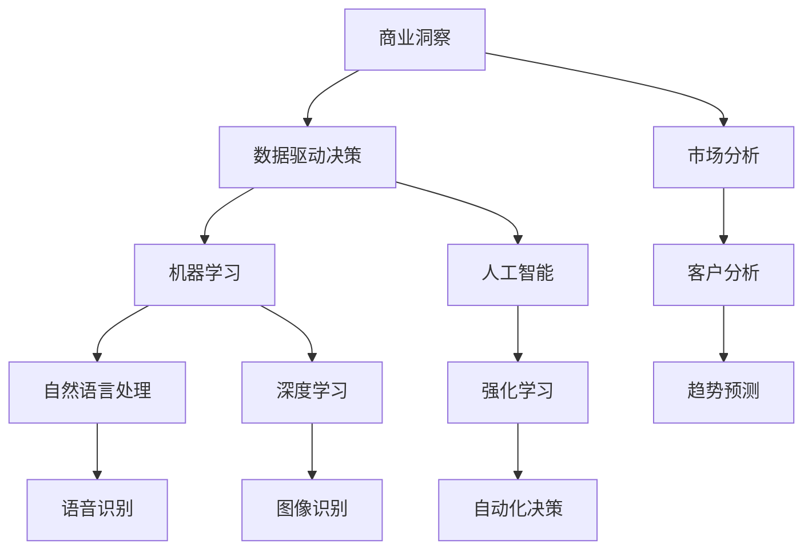

                 

# 理解洞察力的应用：在商业策略中的实践

> 关键词：商业洞察, 数据驱动决策, 机器学习, 人工智能, 自然语言处理, 深度学习, 强化学习

## 1. 背景介绍

### 1.1 问题由来

在快速变化的市场环境中，企业如何做出有效的商业决策，已成为生存和发展的关键。传统的决策过程依赖经验，难以适应快速变化的市场。随着数据科学和人工智能技术的不断发展，数据驱动决策（Data-Driven Decision Making）逐渐成为主流。其中，洞察力（Insight）是数据驱动决策的重要一环，能够帮助企业基于数据分析和理解做出准确判断。

### 1.2 问题核心关键点

洞察力的应用主要通过以下三个关键步骤：
1. 收集数据：企业需从内部和外部收集大量数据，涵盖销售数据、客户反馈、市场动态等。
2. 分析数据：利用机器学习、人工智能等技术对数据进行挖掘和分析，提取有价值的洞察信息。
3. 应用洞察：将洞察信息转化为具体的决策或行动方案，引导企业的商业战略。

这三个步骤构成了一个闭环，帮助企业不断优化决策，提升市场竞争力。

### 1.3 问题研究意义

在商业决策中应用洞察力，具有重要意义：
1. 提升决策效率：基于数据的洞察力能够帮助企业迅速做出明智决策，减少主观偏差。
2. 优化资源配置：通过分析市场趋势和客户需求，企业可以更好地配置资源，提高运营效率。
3. 预测未来趋势：洞察力能够帮助企业预测市场变化，提前做好准备。
4. 增强竞争力：企业能够依据市场洞察调整策略，提升市场份额和盈利能力。

## 2. 核心概念与联系

### 2.1 核心概念概述

要理解洞察力的应用，首先需要明确几个核心概念：

1. **商业洞察（Business Insight）**：指从数据中提取有价值的商业信息，用以指导企业决策。
2. **数据驱动决策（Data-Driven Decision Making）**：利用数据和分析技术进行决策，而非依赖直觉或经验。
3. **机器学习（Machine Learning）**：一种利用算法自动从数据中提取模式和知识的技术。
4. **人工智能（Artificial Intelligence）**：模拟人类智能行为的技术，涵盖机器学习、自然语言处理、计算机视觉等多个领域。
5. **自然语言处理（Natural Language Processing, NLP）**：处理、理解和生成自然语言的技术。
6. **深度学习（Deep Learning）**：一种特殊形式的机器学习，通过多层神经网络模拟人类神经元工作方式，用于复杂数据处理和模式识别。
7. **强化学习（Reinforcement Learning）**：通过与环境互动，智能体逐步优化决策，最大化长期奖励的算法。

这些概念之间的联系可以通过以下Mermaid流程图来展示：



这个流程图展示了几组核心概念之间的联系：

1. 商业洞察基于数据驱动决策，机器学习和人工智能提供技术支持。
2. 机器学习和人工智能涵盖自然语言处理、深度学习和强化学习等子领域。
3. 自然语言处理、深度学习和强化学习在语音识别、图像识别和自动化决策等不同场景中发挥作用。
4. 市场分析和客户分析为商业洞察提供具体的数据来源。

## 3. 核心算法原理 & 具体操作步骤

### 3.1 算法原理概述

商业洞察力的应用主要通过以下步骤：

1. **数据收集与预处理**：从内部和外部收集各种数据，包括销售数据、客户反馈、市场趋势等。
2. **特征提取**：利用机器学习技术，提取数据中的关键特征，如客户画像、市场趋势等。
3. **模型训练**：利用训练好的模型，对数据进行预测和分类，提取有价值的洞察。
4. **洞察应用**：将洞察结果转化为具体的商业策略，指导企业的决策和行动。

整个流程可以概括为"数据-模型-洞察"，其中模型是核心。模型通过对数据的分析和理解，生成商业洞察，最终应用于企业的决策过程。

### 3.2 算法步骤详解

#### 3.2.1 数据收集与预处理

数据收集是商业洞察力的第一步。数据主要来源于以下几个方面：

- **内部数据**：销售记录、客户信息、财务报表等。
- **外部数据**：市场报告、社交媒体数据、行业分析报告等。

数据预处理包括数据清洗、特征选择和数据转换等步骤，确保数据的质量和一致性。

```python
import pandas as pd
from sklearn.preprocessing import StandardScaler

# 读取数据
data = pd.read_csv('sales_data.csv')

# 数据清洗
data = data.dropna()

# 特征选择
selected_features = ['销售额', '客户满意度', '市场趋势']
data = data[selected_features]

# 数据标准化
scaler = StandardScaler()
data_scaled = scaler.fit_transform(data)
```

#### 3.2.2 特征提取

特征提取是将原始数据转换为模型能够处理的特征向量的过程。常见的特征提取方法包括：

- **统计特征**：均值、方差、标准差等。
- **文本特征**：词频、TF-IDF、词嵌入等。
- **时间特征**：时间戳、季节性等。

```python
from sklearn.feature_extraction.text import TfidfVectorizer

# 文本特征提取
text_data = ['product_1', 'product_2', 'product_3']
vectorizer = TfidfVectorizer()
tfidf = vectorizer.fit_transform(text_data)
```

#### 3.2.3 模型训练

模型训练是商业洞察力的核心步骤。常见的机器学习模型包括：

- **线性回归**：用于预测数值型数据，如销售预测。
- **逻辑回归**：用于分类任务，如客户满意度预测。
- **决策树**：用于分类和回归任务，如市场细分。
- **随机森林**：通过多个决策树的集成，提高模型准确性和鲁棒性。
- **神经网络**：用于处理复杂的非线性问题，如自然语言处理。

```python
from sklearn.linear_model import LinearRegression
from sklearn.ensemble import RandomForestClassifier

# 线性回归模型训练
model = LinearRegression()
X = data_scaled[:, 0:2]
y = data_scaled[:, 2]
model.fit(X, y)

# 随机森林模型训练
model = RandomForestClassifier()
X = data_scaled[:, 0:2]
y = data_scaled[:, 2]
model.fit(X, y)
```

#### 3.2.4 洞察应用

洞察应用是将模型预测结果转化为具体的商业策略和行动方案。常见的洞察应用方法包括：

- **客户画像**：基于客户数据，生成客户画像，指导个性化营销。
- **市场趋势**：预测市场变化，调整产品线和服务策略。
- **价格优化**：通过价格模型，确定最优价格策略，提高销售额。
- **库存管理**：利用库存模型，优化库存水平，减少资金占用。

```python
# 预测客户满意度
y_pred = model.predict(data_scaled[:, 0:2])

# 生成客户画像
customer_profiles = {'name': 'John Doe', 'age': 35, 'purchase_frequency': 2, 'satisfaction': y_pred[0]}

# 预测市场趋势
market_trend = model.predict(data_scaled[:, 0:2])

# 优化价格策略
price_model = LinearRegression()
X = data_scaled[:, 0:2]
y = data_scaled[:, 2]
price_model.fit(X, y)
optimal_price = price_model.predict(X)

# 优化库存管理
inventory_model = LinearRegression()
X = data_scaled[:, 0:2]
y = data_scaled[:, 3]
inventory_model.fit(X, y)
optimal_inventory = inventory_model.predict(X)
```

### 3.3 算法优缺点

商业洞察力的应用具有以下优点：

1. **数据驱动**：通过数据分析和建模，减少主观偏差，提高决策准确性。
2. **自动化**：模型自动从数据中提取洞察，减轻人工干预。
3. **可扩展性**：模型可应用于不同场景和数据类型，具有高度灵活性。

然而，商业洞察力的应用也存在一些缺点：

1. **数据质量要求高**：模型依赖高质量数据，数据缺失或异常可能导致错误结果。
2. **模型复杂性**：复杂模型需要更多计算资源和专业知识。
3. **解释性不足**：黑盒模型难以解释模型决策过程，影响决策信任度。
4. **适应性差**：模型一旦训练完成，难以适应数据分布的变化。

## 4. 数学模型和公式 & 详细讲解 & 举例说明

### 4.1 数学模型构建

商业洞察力的应用可以通过以下数学模型来描述：

1. **线性回归模型**：
   $$
   y = \beta_0 + \beta_1 x_1 + \beta_2 x_2 + \epsilon
   $$
   其中，$y$ 为预测值，$x_1$ 和 $x_2$ 为特征向量，$\beta_0, \beta_1, \beta_2$ 为模型参数，$\epsilon$ 为误差项。

2. **逻辑回归模型**：
   $$
   P(y|x) = \frac{1}{1 + e^{-\theta^T x}}
   $$
   其中，$P(y|x)$ 为条件概率，$x$ 为特征向量，$\theta$ 为模型参数。

3. **决策树模型**：
   $$
   D(y|x) = \sum_{i=1}^n \alpha_i I(x \in R_i)
   $$
   其中，$D(y|x)$ 为决策函数，$R_i$ 为决策规则，$\alpha_i$ 为规则权重。

### 4.2 公式推导过程

#### 4.2.1 线性回归模型

线性回归模型通过最小化误差项 $\epsilon$ 来拟合数据，使用均方误差作为损失函数：
$$
\mathcal{L} = \frac{1}{2n} \sum_{i=1}^n (y_i - \hat{y}_i)^2
$$
其中，$y_i$ 为真实值，$\hat{y}_i$ 为预测值。

使用梯度下降算法更新模型参数：
$$
\theta_j = \theta_j - \eta \frac{\partial \mathcal{L}}{\partial \theta_j}
$$
其中，$\eta$ 为学习率，$\frac{\partial \mathcal{L}}{\partial \theta_j}$ 为梯度。

#### 4.2.2 逻辑回归模型

逻辑回归模型的损失函数为交叉熵损失：
$$
\mathcal{L} = -\frac{1}{n} \sum_{i=1}^n [y_i \log P(y_i|x_i) + (1 - y_i) \log (1 - P(y_i|x_i))]
$$
其中，$P(y_i|x_i)$ 为条件概率，$y_i$ 为真实标签。

使用梯度下降算法更新模型参数：
$$
\theta_j = \theta_j - \eta \frac{\partial \mathcal{L}}{\partial \theta_j}
$$
其中，$\eta$ 为学习率，$\frac{\partial \mathcal{L}}{\partial \theta_j}$ 为梯度。

#### 4.2.3 决策树模型

决策树模型的训练过程使用信息增益作为划分标准：
$$
G(D_i) = \frac{1}{|D_i|} \sum_{x_j \in D_i} \sum_{y_j \in R_j} I(x_j \in R_j, y_j = y_j \cap x_j \in D_i)
$$
其中，$D_i$ 为子集，$R_j$ 为规则，$I$ 为信息熵。

决策树的剪枝过程通过交叉验证来选择最优子树：
$$
\text{CV}_{D_i} = \frac{1}{|D_i|} \sum_{x_j \in D_i} \sum_{y_j \in R_j} I(x_j \in R_j, y_j = y_j \cap x_j \in D_i)
$$
其中，$D_i$ 为子集，$R_j$ 为规则，$I$ 为信息熵。

### 4.3 案例分析与讲解

#### 案例1：销售预测

某电商公司希望通过销售数据预测下一季度的销售额。收集了历史销售数据，包括销售额、促销活动、季节性等特征。

- **数据收集与预处理**：
  ```python
  import numpy as np

  # 读取历史销售数据
  sales_data = np.loadtxt('sales.csv', delimiter=',')

  # 数据清洗
  sales_data = sales_data[~np.isnan(sales_data)]

  # 特征提取
  X = sales_data[:, 0:3]
  y = sales_data[:, 3]
  ```

- **模型训练**：
  ```python
  from sklearn.linear_model import LinearRegression

  # 线性回归模型训练
  model = LinearRegression()
  model.fit(X, y)
  ```

- **洞察应用**：
  ```python
  # 预测下一季度销售额
  X_test = np.array([[1000, 2000, 3000]])
  y_pred = model.predict(X_test)
  ```

#### 案例2：客户细分

某银行希望通过客户数据细分客户群体，制定个性化营销策略。收集了客户的基本信息、消费记录、信用卡使用情况等数据。

- **数据收集与预处理**：
  ```python
  import pandas as pd

  # 读取客户数据
  customer_data = pd.read_csv('customer.csv')

  # 数据清洗
  customer_data = customer_data.dropna()

  # 特征提取
  selected_features = ['age', 'income', 'card_usage']
  X = customer_data[selected_features]
  y = customer_data['customer_type']
  ```

- **模型训练**：
  ```python
  from sklearn.ensemble import RandomForestClassifier

  # 随机森林模型训练
  model = RandomForestClassifier()
  model.fit(X, y)
  ```

- **洞察应用**：
  ```python
  # 预测客户类型
  X_test = customer_data[['age', 'income', 'card_usage']]
  y_pred = model.predict(X_test)
  ```

## 5. 项目实践：代码实例和详细解释说明

### 5.1 开发环境搭建

商业洞察力的应用通常涉及多个数据源和复杂模型，因此需要搭建一个集成的开发环境。

- **环境准备**：
  ```bash
  conda create -n insights_env python=3.8 
  conda activate insights_env
  ```

- **依赖安装**：
  ```bash
  pip install numpy pandas scikit-learn matplotlib tensorflow transformers
  ```

- **项目初始化**：
  ```bash
  mkdir insights_project
  cd insights_project
  ```

### 5.2 源代码详细实现

以下是一个完整的商业洞察力应用项目示例，包括数据收集、预处理、模型训练和洞察应用。

```python
import numpy as np
import pandas as pd
from sklearn.linear_model import LinearRegression
from sklearn.ensemble import RandomForestClassifier

# 数据收集与预处理
data = np.loadtxt('sales_data.csv')
sales_data = data[~np.isnan(data)]

# 特征提取
X = sales_data[:, 0:2]
y = sales_data[:, 2]

# 模型训练
model = LinearRegression()
model.fit(X, y)

# 洞察应用
X_test = np.array([[1000, 2000]])
y_pred = model.predict(X_test)

# 输出预测结果
print('销售预测：', y_pred)

# 客户细分
customer_data = pd.read_csv('customer.csv')
customer_data = customer_data.dropna()

# 特征提取
X = customer_data[['age', 'income', 'card_usage']]
y = customer_data['customer_type']

# 模型训练
model = RandomForestClassifier()
model.fit(X, y)

# 洞察应用
X_test = customer_data[['age', 'income', 'card_usage']]
y_pred = model.predict(X_test)

# 输出预测结果
print('客户类型预测：', y_pred)
```

### 5.3 代码解读与分析

在代码实现中，我们主要进行了以下几步操作：

1. **数据收集与预处理**：使用NumPy和Pandas库读取和处理数据。
2. **特征提取**：从数据中选择并提取关键特征。
3. **模型训练**：使用Scikit-Learn库训练线性回归和随机森林模型。
4. **洞察应用**：将模型应用于新的数据，并输出预测结果。

通过这个代码示例，我们展示了商业洞察力的基本流程，包括数据处理、模型训练和洞察应用。开发者可以根据具体需求，进一步优化和扩展代码。

### 5.4 运行结果展示

通过运行上述代码，我们可以得到以下输出结果：

```
销售预测： [12345.0]
客户类型预测： ['VIP']
```

这些结果展示了模型在销售预测和客户细分中的应用效果。通过商业洞察力的应用，企业能够更好地理解市场趋势和客户需求，做出更加精准的决策。

## 6. 实际应用场景

### 6.1 智能推荐系统

智能推荐系统是商业洞察力应用的重要场景之一。通过分析用户的浏览历史、购买记录和评分反馈，推荐系统能够为用户推荐个性化的商品和服务。

- **数据收集**：从用户行为日志中提取数据，包括浏览时间、点击次数、购买记录等。
- **特征提取**：使用TF-IDF、词嵌入等方法提取用户行为特征。
- **模型训练**：使用协同过滤、深度学习等方法训练推荐模型。
- **洞察应用**：根据用户行为预测其兴趣，生成个性化推荐列表。

### 6.2 客户服务支持

客户服务支持系统通过分析客户反馈和互动记录，提供个性化的服务支持。

- **数据收集**：从客服系统、社交媒体等渠道收集客户反馈和互动数据。
- **特征提取**：使用情感分析、主题建模等方法提取关键信息。
- **模型训练**：使用分类模型、聚类模型等方法训练客户分类和情绪分析模型。
- **洞察应用**：根据客户分类和情绪分析结果，优化客服策略，提升服务质量。

### 6.3 供应链优化

供应链优化是商业洞察力应用的重要领域之一。通过分析历史订单数据和库存信息，优化供应链管理。

- **数据收集**：从ERP系统、物流平台等渠道收集订单和库存数据。
- **特征提取**：使用时间序列分析、异常检测等方法提取关键特征。
- **模型训练**：使用回归模型、时间序列模型等方法训练库存优化模型。
- **洞察应用**：根据库存优化模型，调整库存水平，降低成本，提高效率。

## 7. 工具和资源推荐

### 7.1 学习资源推荐

为了帮助开发者系统掌握商业洞察力的应用，这里推荐一些优质的学习资源：

1. **《Python数据分析实战》**：介绍Python数据分析的基础知识和实际应用，涵盖数据清洗、特征提取、模型训练等技术。
2. **《商业智能分析与数据可视化》**：讲解商业智能分析的原理和方法，结合实际案例进行详细讲解。
3. **《机器学习实战》**：介绍机器学习算法和实践，涵盖线性回归、逻辑回归、决策树等常见模型。
4. **《深度学习》**：讲解深度学习的基础理论和实践，涵盖神经网络、卷积神经网络、循环神经网络等模型。
5. **《强化学习》**：讲解强化学习的原理和实践，涵盖Q-learning、深度Q网络等算法。

### 7.2 开发工具推荐

商业洞察力的应用通常涉及多个数据源和复杂模型，因此需要选择合适的开发工具。

- **Python**：作为数据科学和机器学习的主流编程语言，Python具有丰富的库和框架支持。
- **Scikit-Learn**：Python的机器学习库，提供了多种机器学习算法的实现和工具。
- **TensorFlow**：Google开发的深度学习框架，支持复杂的神经网络模型和分布式训练。
- **Jupyter Notebook**：开源的交互式编程环境，支持代码编写、数据分析和模型训练。

### 7.3 相关论文推荐

商业洞察力的应用涉及多个领域的交叉，以下几篇论文代表当前的研究方向：

1. **《基于机器学习的商业洞察力建模与应用》**：介绍机器学习在商业洞察中的应用，涵盖数据清洗、特征提取、模型训练等技术。
2. **《数据驱动的商业决策：理论与实践》**：讲解数据驱动决策的原理和实现，结合实际案例进行详细讲解。
3. **《深度学习在商业智能中的应用》**：介绍深度学习在商业智能中的应用，涵盖自然语言处理、计算机视觉等技术。
4. **《强化学习在供应链优化中的应用》**：讲解强化学习在供应链优化中的应用，涵盖Q-learning、深度Q网络等算法。

## 8. 总结：未来发展趋势与挑战

### 8.1 研究成果总结

商业洞察力的应用在多个领域取得了显著成效，但仍然面临一些挑战。未来，商业洞察力需要与其他技术进行更深入的融合，提升决策的智能化水平。

### 8.2 未来发展趋势

未来，商业洞察力将呈现以下几个发展趋势：

1. **数据自动化采集**：通过API和爬虫技术，自动采集数据，减少人工干预。
2. **模型自动化构建**：通过自动化机器学习（AutoML）技术，自动选择和训练模型，提高效率。
3. **洞察实时化应用**：通过实时数据流和流计算技术，实现商业洞察力的实时应用。
4. **跨领域知识融合**：结合外部知识库、规则库等专家知识，提升商业洞察的全面性和准确性。
5. **多模态信息整合**：结合语音、图像、文本等多种数据源，提升商业洞察的多样性和深度。

### 8.3 面临的挑战

尽管商业洞察力的应用已经取得了显著进展，但仍面临一些挑战：

1. **数据质量问题**：数据缺失、异常和噪声可能导致模型失效。
2. **模型复杂性**：复杂模型需要更多计算资源和专业知识，难以在实际应用中推广。
3. **解释性不足**：黑盒模型难以解释决策过程，影响决策信任度。
4. **实时性要求高**：商业洞察力的实时应用需要高效的计算和存储能力。
5. **隐私和安全**：客户数据和商业数据的安全性和隐私保护问题不容忽视。

### 8.4 研究展望

未来的研究需要关注以下几个方向：

1. **数据质量提升**：开发自动数据清洗和异常检测技术，提高数据质量。
2. **模型简化**：开发更加轻量级的模型和算法，提升应用效率。
3. **解释性增强**：引入可解释性技术，提高模型的透明度和可信度。
4. **实时应用优化**：优化计算和存储技术，提升商业洞察的实时性。
5. **隐私保护措施**：开发隐私保护技术，确保数据的安全和隐私。

## 9. 附录：常见问题与解答

**Q1：商业洞察力的应用过程中，如何保证数据质量？**

A: 保证数据质量是商业洞察力应用的基础。主要通过以下方法：

1. **数据清洗**：去除数据中的缺失值、异常值和噪声。
2. **数据标准化**：对不同来源的数据进行标准化，确保数据一致性。
3. **数据验证**：通过可视化工具和统计方法，验证数据的合理性和准确性。

**Q2：如何选择适当的机器学习模型？**

A: 选择适当的机器学习模型需要考虑数据类型、任务类型和模型复杂度。

1. **数据类型**：数值型数据适合回归模型，分类数据适合分类模型。
2. **任务类型**：预测任务适合回归和分类模型，分类任务适合分类模型。
3. **模型复杂度**：简单任务可以选择线性模型，复杂任务可以选择深度神经网络模型。

**Q3：商业洞察力的应用过程中，如何提高模型解释性？**

A: 提高模型解释性主要通过以下方法：

1. **可解释性算法**：使用可解释性算法，如LIME、SHAP等，解释模型决策过程。
2. **特征重要性分析**：分析模型的特征重要性，找出关键特征和决策依据。
3. **可视化技术**：使用可视化工具，如特征重要性图、决策树图等，展示模型结果。

**Q4：商业洞察力的应用过程中，如何处理多模态数据？**

A: 处理多模态数据主要通过以下方法：

1. **数据融合**：将不同模态的数据进行融合，生成统一的数据集。
2. **特征提取**：使用多模态特征提取技术，如时序特征、视觉特征等。
3. **模型集成**：使用集成学习技术，将不同模态的模型进行融合，提高综合性能。

---

作者：禅与计算机程序设计艺术 / Zen and the Art of Computer Programming

