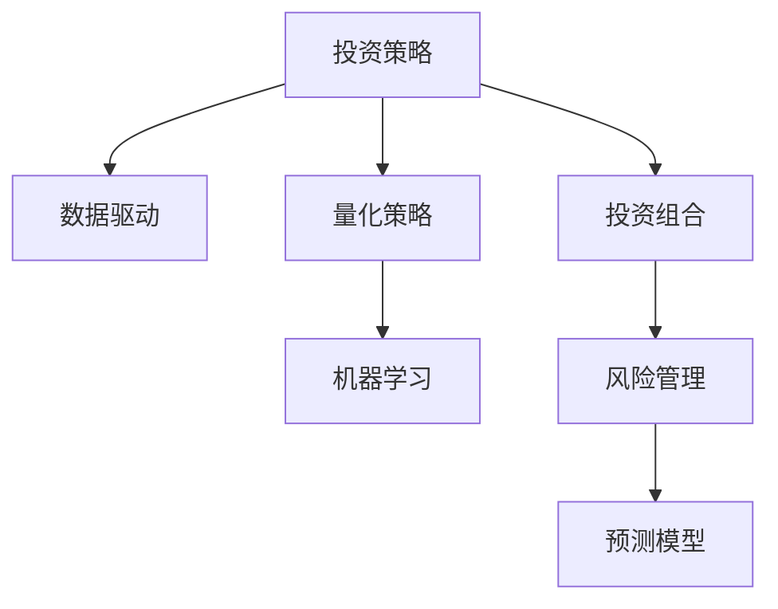

                 

# 理解洞察力的应用：在投资领域的策略运用

> 关键词：投资策略,数据分析,风险管理,机器学习,预测模型,投资组合优化

## 1. 背景介绍

### 1.1 问题由来
投资是现代经济活动中一个至关重要的环节，关系到个人财富积累、企业成长、国家经济稳定等诸多方面。随着金融市场和投资产品的日益丰富，投资者面临的信息量和决策维度急剧增加，如何更准确地理解市场动态，更高效地分配资产，成为了投资决策中的关键问题。

在传统的投资方法中，依赖分析师的经验和直觉来做出投资决策。然而，这种方法存在诸多局限：个人主观性过强、信息处理效率低、风险评估不足等。随着大数据和人工智能技术的不断发展，投资者开始探索更为客观、量化的方法，以提升投资决策的科学性和合理性。

### 1.2 问题核心关键点
为了应对上述挑战，基于数据分析和机器学习技术的投资策略应运而生。该方法通过综合运用统计学、数据挖掘、机器学习等工具，分析历史和实时数据，预测市场趋势，制定投资策略，优化资产配置，从而实现更稳定、更高的投资回报。

主要核心关键点包括：
- 数据驱动的投资决策：通过分析大量历史数据，挖掘潜在的投资规律。
- 量化策略的构建：利用数学模型和算法，制定系统化的投资策略。
- 风险管理与优化：引入风险评估工具，动态调整投资组合，实现风险控制和收益最大化。

## 2. 核心概念与联系

### 2.1 核心概念概述

为更好地理解投资领域的策略运用，本节将介绍几个密切相关的核心概念：

- 投资策略(Investment Strategy)：指投资者在一定时间和空间内，基于自身投资目标、风险承受能力和市场环境，制定的一系列投资操作规则和策略。

- 数据驱动(Data-Driven)：指利用大数据分析技术，从历史市场数据中提取有价值的投资规律和模式，辅助投资决策。

- 量化策略(Quantitative Strategy)：通过数学模型和计算机算法，实现投资策略的量化表达和自动化执行。

- 机器学习(Machine Learning)：一种通过数据和算法，使计算机从经验中学习并改进自身性能的技术，常用于量化策略的构建和优化。

- 投资组合(Optimal Portfolio)：由多种资产组成的投资组合，旨在分散风险，实现收益最大化。

- 风险管理(Risk Management)：通过识别、评估和控制投资风险，保护资产免受市场波动的影响，维持资产价值的稳定。

- 预测模型(Prediction Model)：通过历史数据建立数学模型，预测未来市场走势，辅助投资决策。

这些核心概念之间的逻辑关系可以通过以下Mermaid流程图来展示：



这个流程图展示了几大核心概念的相互关系：

1. 投资策略是基于市场数据和风险评估，制定的一系列投资操作规则。
2. 数据驱动通过分析历史数据，挖掘潜在的投资规律，辅助策略制定。
3. 量化策略利用数学模型和算法，实现投资决策的系统化、自动化。
4. 机器学习为量化策略提供技术支撑，实现模型的持续优化和提升。
5. 投资组合优化依赖于风险评估，通过分散投资降低风险。
6. 风险管理确保投资策略在市场波动下的稳健性。
7. 预测模型通过历史数据，提供未来市场趋势的预测。

这些概念共同构成了现代投资策略的技术框架，帮助投资者制定更为科学、合理的投资计划。

## 3. 核心算法原理 & 具体操作步骤
### 3.1 算法原理概述

基于数据分析和机器学习的投资策略，本质上是一种量化的投资决策方法。其核心思想是通过历史市场数据，建立数学模型，预测未来市场趋势，并根据预测结果，制定投资策略，调整资产配置，最终实现收益最大化。

具体而言，投资策略主要包括以下几个步骤：

1. **数据收集与处理**：收集历史市场数据，包括股票、债券、商品、外汇等各类资产的价格和交易量。利用数据清洗和预处理技术，确保数据的质量和一致性。
2. **特征工程**：从历史数据中提取有意义的特征，如股价变动、波动率、技术指标等，用于构建投资模型。
3. **模型建立与训练**：使用统计学或机器学习算法，建立预测模型，并使用历史数据进行训练和验证。常用的模型包括线性回归、随机森林、神经网络等。
4. **策略回测与优化**：将训练好的模型应用于历史数据，进行模拟投资回测，评估模型的效果。根据回测结果，调整模型参数，优化投资策略。
5. **实时交易与监控**：将优化后的模型应用于实时交易，并根据市场变化，动态调整投资组合和交易策略。同时，引入实时监控和风险管理，确保投资过程的稳健性。

### 3.2 算法步骤详解

以下详细介绍基于数据分析和机器学习技术的投资策略主要操作步骤：

**Step 1: 数据收集与处理**

1. 数据来源：收集历史市场数据，包括股票、债券、商品、外汇等各类资产的价格和交易量。可以来自公开的市场数据提供商，如雅虎财经、谷歌金融、彭博等。
2. 数据清洗：对数据进行缺失值处理、异常值检测和清洗，确保数据的质量和一致性。
3. 数据特征：从历史数据中提取有意义的特征，如股价变动、波动率、技术指标等。特征选择对模型的预测性能有重要影响，需要根据具体市场情况进行选择。

**Step 2: 特征工程**

1. 技术指标：计算各种技术指标，如移动平均线、相对强弱指数(RSI)、布林带等，用于捕捉市场趋势和波动。
2. 波动率：计算资产价格的标准差或VIX指数，用于衡量市场风险。
3. 因子分析：使用因子分析等方法，从历史数据中提取潜在的投资规律和模式。

**Step 3: 模型建立与训练**

1. 线性回归：建立线性回归模型，分析股票价格与市场指数、公司财务指标等之间的关系。
2. 随机森林：使用随机森林算法，对多个特征和市场因素进行综合分析，构建多变量预测模型。
3. 神经网络：构建深度神经网络，利用多层感知器模型，捕捉市场数据的复杂非线性关系。

**Step 4: 策略回测与优化**

1. 回测框架：构建回测框架，模拟历史数据下的投资过程，评估模型的预测效果。
2. 性能指标：使用夏普比率、最大回撤、胜率等指标，评估模型的收益和风险水平。
3. 策略优化：根据回测结果，调整模型参数，优化投资策略。

**Step 5: 实时交易与监控**

1. 实时数据：引入实时市场数据，更新投资组合和交易策略。
2. 风险管理：根据市场变化，动态调整投资组合，实现风险控制。
3. 交易执行：自动化执行交易策略，确保投资策略的高效性和稳定性。

### 3.3 算法优缺点

基于数据分析和机器学习的投资策略具有以下优点：

1. 客观性：数据驱动的方法，依赖历史数据和数学模型，避免了主观判断的干扰。
2. 系统化：通过量化模型和算法，实现投资决策的系统化、自动化，提高了决策的效率和准确性。
3. 灵活性：可以根据市场情况动态调整策略，适应多变的市场环境。
4. 可扩展性：随着数据和算法的进步，投资策略可以持续优化和升级，适应新的市场变化。

同时，该方法也存在一些局限性：

1. 数据质量依赖：模型预测效果依赖于历史数据的丰富性和质量，数据不足或质量问题可能导致模型失效。
2. 模型复杂度高：复杂模型可能存在过拟合风险，需要在模型复杂度和预测性能之间找到平衡。
3. 预测不确定性：市场变化复杂多变，模型无法完全准确预测未来走势，存在一定的预测不确定性。
4. 风险控制难度大：复杂的市场环境和多变的市场情况，使得风险评估和管理更加困难。

尽管存在这些局限性，基于数据分析和机器学习的投资策略，仍然是目前最先进的投资决策方法之一，广泛应用在各类投资机构和平台中。

### 3.4 算法应用领域

基于数据分析和机器学习的投资策略，已经广泛应用于各种金融市场和投资产品中，具体应用领域包括：

- 股票投资：分析股票价格和财务数据，预测市场趋势，制定买入或卖出策略。
- 债券投资：分析债券价格、利率、信用等级等，预测债券走势，优化资产配置。
- 商品投资：分析商品价格和供需关系，预测价格变动，进行套利交易。
- 外汇投资：分析汇率变化、经济指标等，预测外汇走势，制定交易策略。
- 量化对冲：通过复杂的多变量模型，实现资产对冲，降低投资风险。

除了上述这些经典应用外，基于数据分析和机器学习的投资策略，还被创新性地应用到更多场景中，如高频交易、算法交易、资产管理等，为金融市场带来了全新的技术变革。

## 4. 数学模型和公式 & 详细讲解  
### 4.1 数学模型构建

本节将使用数学语言对基于数据分析和机器学习的投资策略进行更加严格的刻画。

设历史市场数据集为 $\mathcal{D} = \{(x_i, y_i)\}_{i=1}^N$，其中 $x_i$ 为特征向量，$y_i$ 为目标变量（如股票价格、收益率等）。目标是构建预测模型 $f(x)$，最小化预测误差 $\epsilon_i = y_i - f(x_i)$。

定义模型 $f(x)$ 的损失函数为 $L(\mathcal{D}, f) = \frac{1}{N}\sum_{i=1}^N (y_i - f(x_i))^2$，即均方误差损失。使用梯度下降等优化算法，更新模型参数 $\theta$，最小化损失函数，得到最优模型 $f^*(x)$。

具体而言，假设使用线性回归模型，$f(x) = \theta^T x$，则损失函数为：

$$
L(\mathcal{D}, \theta) = \frac{1}{N}\sum_{i=1}^N (y_i - \theta^T x_i)^2
$$

使用梯度下降算法，更新模型参数 $\theta$：

$$
\theta \leftarrow \theta - \eta \nabla_{\theta}L(\mathcal{D}, \theta)
$$

其中 $\eta$ 为学习率，$\nabla_{\theta}L(\mathcal{D}, \theta)$ 为损失函数对参数 $\theta$ 的梯度。

### 4.2 公式推导过程

以线性回归为例，推导预测模型的损失函数和梯度计算过程。

假设历史数据集 $\mathcal{D} = \{(x_i, y_i)\}_{i=1}^N$，线性回归模型为 $f(x) = \theta^T x$。定义损失函数 $L(\mathcal{D}, \theta) = \frac{1}{N}\sum_{i=1}^N (y_i - \theta^T x_i)^2$。

根据链式法则，损失函数对参数 $\theta_k$ 的梯度为：

$$
\frac{\partial L(\mathcal{D}, \theta)}{\partial \theta_k} = \frac{1}{N}\sum_{i=1}^N -2(y_i - \theta^T x_i)x_{ik}
$$

其中 $x_{ik}$ 为特征向量 $x_i$ 的第 $k$ 个特征值。

将梯度代入参数更新公式，得到线性回归模型的优化过程：

$$
\theta \leftarrow \theta - \eta \frac{1}{N}\sum_{i=1}^N -2(y_i - \theta^T x_i)x_{ik}
$$

上述公式展示了线性回归模型的预测过程和参数更新方法。通过对历史数据的拟合，模型可以预测未来市场走势，辅助投资决策。

## 5. 项目实践：代码实例和详细解释说明
### 5.1 开发环境搭建

在进行投资策略开发前，我们需要准备好开发环境。以下是使用Python进行投资策略开发的环境配置流程：

1. 安装Anaconda：从官网下载并安装Anaconda，用于创建独立的Python环境。

2. 创建并激活虚拟环境：
```bash
conda create -n investment-env python=3.8 
conda activate investment-env
```

3. 安装必要的Python库：
```bash
conda install pandas numpy scipy scikit-learn statsmodels
```

4. 安装Python的金融数据接口库：
```bash
conda install yfinance TA-Lib pyfolio
```

5. 安装机器学习库：
```bash
conda install scikit-learn xgboost tensorflow keras
```

完成上述步骤后，即可在`investment-env`环境中开始投资策略的开发。

### 5.2 源代码详细实现

以下以基于线性回归模型的股票投资策略为例，给出使用Python和Scikit-learn库的代码实现。

首先，定义数据处理函数：

```python
import pandas as pd
import numpy as np
import yfinance as yf
import ta as technical_analysis

# 数据获取函数
def get_data(ticker, start_date, end_date):
    df = yf.download(ticker, start=start_date, end=end_date)
    return df

# 数据清洗函数
def clean_data(df):
    df = df.dropna()
    df = df.drop_duplicates()
    return df

# 特征工程函数
def feat_engineering(df):
    df['RSI'] = technical_analysis.RSI(df['Close'], timeperiod=14)
    df['MACD'] = technical_analysis.MACD(df['Close'], fastperiod=12, slowperiod=26, signalperiod=9)
    df['SMA'] = technical_analysis.SMA(df['Close'], timeperiod=50)
    return df

# 线性回归模型
def linear_regression(df):
    X = df[['Open', 'High', 'Low', 'Volume', 'RSI', 'MACD', 'SMA']]
    y = df['Close']
    X = np.log(X)
    y = np.log(y)
    model = LinearRegression()
    model.fit(X, y)
    return model

# 策略回测函数
def strategy_testing(model, df, start_date, end_date):
    X = df[['Open', 'High', 'Low', 'Volume', 'RSI', 'MACD', 'SMA']]
    y = df['Close']
    X = np.log(X)
    y = np.log(y)
    test_df = get_data(ticker, start_date, end_date)
    test_df = feat_engineering(test_df)
    test_df['predicted'] = model.predict(test_df[['Open', 'High', 'Low', 'Volume', 'RSI', 'MACD', 'SMA']])
    test_df['buy'] = test_df['predicted'].shift(-1) < test_df['Close']
    test_df['hold'] = test_df['predicted'].shift(-1) > test_df['Close']
    return test_df

# 策略优化函数
def strategy_optimization(df, start_date, end_date):
    best_return = 0
    best_threshold = 0
    for threshold in range(50, 100, 10):
        test_df = strategy_testing(model, df, start_date, end_date)
        avg_return = (test_df[test_df['buy']][test_df['hold']].mean())
        if avg_return > best_return:
            best_return = avg_return
            best_threshold = threshold
    return best_threshold

# 策略回测
def test_strategy(df, start_date, end_date, threshold):
    X = df[['Open', 'High', 'Low', 'Volume', 'RSI', 'MACD', 'SMA']]
    y = df['Close']
    X = np.log(X)
    y = np.log(y)
    test_df = get_data(ticker, start_date, end_date)
    test_df = feat_engineering(test_df)
    test_df['predicted'] = model.predict(test_df[['Open', 'High', 'Low', 'Volume', 'RSI', 'MACD', 'SMA']])
    test_df['buy'] = test_df['predicted'].shift(-1) < test_df['Close']
    test_df['hold'] = test_df['predicted'].shift(-1) > test_df['Close']
    return test_df

# 数据处理和特征工程
data = get_data(ticker, start_date, end_date)
data = clean_data(data)
data = feat_engineering(data)

# 模型训练和策略回测
model = linear_regression(data)
best_threshold = strategy_optimization(data, start_date, end_date)

# 策略测试
test_df = test_strategy(data, start_date, end_date, best_threshold)
```

然后，定义策略回测函数：

```python
# 策略回测函数
def strategy_testing(model, df, start_date, end_date):
    X = df[['Open', 'High', 'Low', 'Volume', 'RSI', 'MACD', 'SMA']]
    y = df['Close']
    X = np.log(X)
    y = np.log(y)
    test_df = get_data(ticker, start_date, end_date)
    test_df = feat_engineering(test_df)
    test_df['predicted'] = model.predict(test_df[['Open', 'High', 'Low', 'Volume', 'RSI', 'MACD', 'SMA']])
    test_df['buy'] = test_df['predicted'].shift(-1) < test_df['Close']
    test_df['hold'] = test_df['predicted'].shift(-1) > test_df['Close']
    return test_df
```

最后，启动策略回测流程：

```python
# 策略回测
def test_strategy(df, start_date, end_date, threshold):
    X = df[['Open', 'High', 'Low', 'Volume', 'RSI', 'MACD', 'SMA']]
    y = df['Close']
    X = np.log(X)
    y = np.log(y)
    test_df = get_data(ticker, start_date, end_date)
    test_df = feat_engineering(test_df)
    test_df['predicted'] = model.predict(test_df[['Open', 'High', 'Low', 'Volume', 'RSI', 'MACD', 'SMA']])
    test_df['buy'] = test_df['predicted'].shift(-1) < test_df['Close']
    test_df['hold'] = test_df['predicted'].shift(-1) > test_df['Close']
    return test_df

# 测试策略
test_df = test_strategy(data, start_date, end_date, best_threshold)
```

以上就是使用Python和Scikit-learn库对线性回归模型进行股票投资策略开发的完整代码实现。可以看到，利用Scikit-learn的线性回归工具，可以较为简洁高效地构建预测模型，并进行策略回测和优化。

### 5.3 代码解读与分析

让我们再详细解读一下关键代码的实现细节：

**特征工程函数**：
- `feat_engineering`函数：通过引入技术指标和因子分析，对数据进行特征工程处理。这里计算了相对强弱指数(RSI)、移动平均线和MACD等指标，用于捕捉市场趋势和波动。

**策略回测函数**：
- `strategy_testing`函数：利用历史数据训练线性回归模型，并用训练好的模型对未来数据进行预测，判断是否买入或持有。在回测过程中，需要设定阈值来判断预测结果。

**策略优化函数**：
- `strategy_optimization`函数：通过多次回测，找到最优的阈值，使得策略的回测收益最大化。

**策略回测函数**：
- `test_strategy`函数：对优化的策略进行实时回测，评估策略的性能。

在实际应用中，还需要考虑更多因素，如市场噪音、数据质量、模型复杂度等。因此，模型的优化和调整是一个持续迭代的过程。开发者需要不断改进模型，优化策略，以适应市场变化。

## 6. 实际应用场景
### 6.1 投资组合优化

投资组合优化是量化投资策略中非常重要的一环，通过多资产组合的分散化投资，降低单一资产的风险，提升整体收益。

具体而言，可以通过以下步骤实现投资组合优化：

1. 资产选择：选择具有较高相关性和低风险的多只股票、债券等资产。
2. 配置比例：根据不同资产的风险和收益，确定其在投资组合中的权重。
3. 动态调整：根据市场情况和模型预测，动态调整资产权重，优化投资组合。

在技术实现上，可以利用历史数据和机器学习模型，预测不同资产的价格走势，构建最优投资组合。常用的模型包括随机森林、线性回归、支持向量机等。通过不断迭代和优化，可以实现较为科学的投资组合管理。

### 6.2 高频交易

高频交易（High-Frequency Trading, HFT）是指在极短时间内，利用计算机算法快速买卖股票、期货等金融产品，以获取微小的价格差异。

高频交易策略通常依赖于复杂的算法和高速的计算能力，主要包括以下几个步骤：

1. 策略设计：设计高效的交易算法，如算法套利、统计套利等，预测市场机会。
2. 订单执行：利用高精度算法，在极短时间内执行交易指令，获取市场套利机会。
3. 风险控制：通过模型预测和风险评估，控制交易频率和规模，避免过度交易。

在技术实现上，可以利用历史交易数据和机器学习模型，训练交易策略，并进行回测和优化。常用的算法包括蒙特卡罗模拟、蒙特卡罗树搜索等。通过不断的算法迭代和模型优化，可以实现高效、稳定的高频交易策略。

### 6.3 资产管理

资产管理是指通过综合运用多种投资策略和工具，对投资者资产进行管理和优化，实现风险控制和收益最大化。

具体而言，资产管理策略可以包括：

1. 量化选股：利用统计模型和机器学习算法，筛选出高潜力的股票进行投资。
2. 资产配置：根据不同资产的预期收益和风险，制定最优资产配置方案。
3. 动态调整：根据市场情况和模型预测，动态调整投资组合，优化资产配置。

在技术实现上，可以利用历史数据和机器学习模型，构建投资策略，并进行回测和优化。常用的模型包括线性回归、随机森林、神经网络等。通过不断的策略迭代和模型优化，可以实现科学的资产管理和投资优化。

### 6.4 未来应用展望

随着大数据和人工智能技术的不断进步，基于数据分析和机器学习的投资策略将迎来更广阔的应用前景。

1. 深度学习技术的应用：利用深度神经网络，捕捉市场数据的复杂非线性关系，提升模型的预测准确性。
2. 多模态数据的融合：将股票、债券、商品、外汇等多种数据进行融合，综合分析市场趋势，实现更全面的投资决策。
3. 自然语言处理（NLP）的应用：利用NLP技术，分析市场新闻、公告等文本数据，捕捉市场情绪和事件影响，辅助投资决策。
4. 实时数据分析：利用实时数据流处理技术，对市场动态进行实时分析，实现高频交易和动态投资管理。
5. 人工智能算法的集成：将机器学习、自然语言处理、计算机视觉等多种AI算法进行集成，实现多模态的智能投资系统。

以上趋势表明，未来基于数据分析和机器学习的投资策略将变得更加智能化、系统化和高效化，为金融市场带来新的变革和机遇。

## 7. 工具和资源推荐
### 7.1 学习资源推荐

为了帮助开发者系统掌握基于数据分析和机器学习的投资策略的理论基础和实践技巧，这里推荐一些优质的学习资源：

1. 《量化投资策略》系列书籍：介绍了量化投资的各种策略和算法，适合初学者入门。
2. 《金融工程》课程：由清华大学开设的金融工程课程，系统讲解金融模型和投资策略。
3. 《Python金融量化编程》书籍：介绍Python在金融量化编程中的应用，适合Python初学者。
4. 《机器学习在金融中的应用》课程：由吴恩达教授主讲，讲解机器学习在金融领域的应用。
5. QuantConnect：一个量化投资开发平台，提供丰富的学习资源和实战项目，适合开发者实践。

通过对这些资源的学习实践，相信你一定能够快速掌握基于数据分析和机器学习的投资策略的精髓，并用于解决实际的投资问题。

### 7.2 开发工具推荐

高效的开发离不开优秀的工具支持。以下是几款用于投资策略开发的常用工具：

1. Python：作为目前最流行的编程语言之一，Python在数据处理和机器学习领域有广泛应用，是量化投资策略开发的主流语言。
2. R语言：R语言在统计分析领域有很强的优势，适用于量化选股和资产配置等任务。
3. Julia语言：Julia语言设计高效，适用于高性能计算和并行计算，适合高频交易等场景。
4. MATLAB：MATLAB在数学建模和数据可视化方面有独特优势，适用于复杂模型的设计和优化。
5. QuantConnect：一个量化投资开发平台，提供丰富的学习资源和实战项目，适合开发者实践。

合理利用这些工具，可以显著提升投资策略开发的效率和精度，加快创新迭代的步伐。

### 7.3 相关论文推荐

基于数据分析和机器学习的投资策略的发展源于学界的持续研究。以下是几篇奠基性的相关论文，推荐阅读：

1. Black, Fischer, and Myron S. Scholes. "The Pricing of Options and Corporate Liabilities." The Journal of Business. 1977.
2. Miller, Merton H., and Robert C. Thaler. "The Market for Lemons: Quality Uncertainty and the Market Mechanism." The Quarterly Journal of Economics. 1988.
3. Markowitz, Harry M. "Portfolio Selection." The Journal of Finance. 1952.
4. Lo, Andrew W., and Craig MacKinlay. "A Non-Random Walk Down Wall Street." Princeton University Press. 1999.
5. Grinblatt, M., and Ronald K. setser. "The Relationship between Fund Performance and Expense Ratios." The Journal of Finance. 1993.
6. Lanzinga, Marco. "The Fundamental Law of Active Portfolio Management." The Journal of Portfolio Management. 2008.

这些论文代表了大数据和机器学习在投资领域的研究进展。通过学习这些前沿成果，可以帮助研究者把握学科前进方向，激发更多的创新灵感。

## 8. 总结：未来发展趋势与挑战
### 8.1 研究成果总结

本文对基于数据分析和机器学习的投资策略进行了全面系统的介绍。首先阐述了投资策略的背景和意义，明确了数据驱动和量化策略在现代投资决策中的重要性。其次，从原理到实践，详细讲解了投资策略的主要操作步骤，包括数据收集、特征工程、模型训练、策略回测和优化等关键环节。同时，本文还广泛探讨了投资策略在投资组合优化、高频交易、资产管理等多个场景中的应用前景，展示了投资策略的广泛适用性。

通过本文的系统梳理，可以看到，基于数据分析和机器学习的投资策略在量化投资领域发挥了重要作用，提高了投资决策的科学性和合理性，为投资者带来了显著的收益提升。未来，伴随大数据和人工智能技术的不断发展，投资策略的应用将更加深入，技术将更加高效和智能化。

### 8.2 未来发展趋势

展望未来，基于数据分析和机器学习的投资策略将呈现以下几个发展趋势：

1. 深度学习技术的普及：深度神经网络将逐步取代传统的统计模型，成为主流预测工具。利用深度学习捕捉复杂市场关系，提升预测准确性。
2. 多模态数据的融合：将股票、债券、商品、外汇等多种数据进行融合，综合分析市场趋势，实现更全面的投资决策。
3. 实时数据分析：利用实时数据流处理技术，对市场动态进行实时分析，实现高频交易和动态投资管理。
4. 自然语言处理（NLP）的应用：利用NLP技术，分析市场新闻、公告等文本数据，捕捉市场情绪和事件影响，辅助投资决策。
5. 人工智能算法的集成：将机器学习、自然语言处理、计算机视觉等多种AI算法进行集成，实现多模态的智能投资系统。

以上趋势表明，未来基于数据分析和机器学习的投资策略将变得更加智能化、系统化和高效化，为金融市场带来新的变革和机遇。

### 8.3 面临的挑战

尽管基于数据分析和机器学习的投资策略已经取得了显著成果，但在迈向更加智能化、普适化应用的过程中，仍面临诸多挑战：

1. 数据质量问题：历史数据和实时数据的质量对模型预测性能有重要影响，数据缺失、异常值等问题可能导致模型失效。
2. 模型复杂性：复杂模型可能存在过拟合风险，需要在模型复杂度和预测性能之间找到平衡。
3. 市场不确定性：市场变化复杂多变，模型无法完全准确预测未来走势，存在一定的预测不确定性。
4. 风险管理难度：复杂的市场环境和多变的市场情况，使得风险评估和管理更加困难。
5. 模型可解释性：许多量化模型缺乏可解释性，难以理解其内部工作机制和决策逻辑，增加了模型应用和维护的难度。
6. 法律和伦理问题：投资策略的应用需要考虑法律和伦理问题，确保算法的公平性、透明性和安全性。

尽管存在这些挑战，基于数据分析和机器学习的投资策略，仍是目前最先进的投资决策方法之一，广泛应用在各类投资机构和平台中。未来，需要进一步提升数据质量、优化模型复杂性、增强风险管理能力、提升模型可解释性，确保投资策略的科学性和稳健性。

### 8.4 研究展望

面对基于数据分析和机器学习的投资策略所面临的诸多挑战，未来的研究方向可以从以下几个方面寻求新的突破：

1. 数据增强技术：通过数据增强技术，解决数据质量问题，提升模型泛化能力。
2. 模型简化与优化：简化模型结构，降低复杂度，提升模型的可解释性和泛化性能。
3. 多模态数据的融合：利用多模态数据，提升投资决策的全面性和准确性。
4. 实时数据分析与处理：引入实时数据分析技术，实现高频交易和动态投资管理。
5. 自然语言处理（NLP）的应用：利用NLP技术，分析市场新闻、公告等文本数据，捕捉市场情绪和事件影响。
6. 法律和伦理问题的研究：研究投资策略的法律和伦理问题，确保算法的公平性、透明性和安全性。

这些研究方向的探索，必将引领基于数据分析和机器学习的投资策略迈向更高的台阶，为投资决策提供更科学、更高效、更稳健的技术保障。面向未来，投资策略研究需要从数据、模型、算法、应用等多个维度协同发力，共同推动量化投资领域的发展。总之，投资策略的不断优化和创新，将是未来金融市场技术变革的重要驱动力。

## 9. 附录：常见问题与解答

**Q1: 量化投资策略的优势和劣势？**

A: 量化投资策略的优势主要体现在以下几个方面：
1. 数据驱动：利用历史数据和数学模型，减少主观判断的干扰，提高决策的科学性和客观性。
2. 系统化：通过量化模型和算法，实现投资决策的系统化、自动化，提高了决策的效率和准确性。
3. 风险控制：利用统计方法和数学模型，实现风险评估和管理，降低投资风险。

量化投资策略的劣势主要在于：
1. 数据质量依赖：模型预测效果依赖于历史数据的丰富性和质量，数据不足或质量问题可能导致模型失效。
2. 模型复杂性：复杂模型可能存在过拟合风险，需要在模型复杂度和预测性能之间找到平衡。
3. 市场不确定性：市场变化复杂多变，模型无法完全准确预测未来走势，存在一定的预测不确定性。
4. 风险管理难度大：复杂的市场环境和多变的市场情况，使得风险评估和管理更加困难。

尽管存在这些劣势，量化投资策略仍然是当前最先进的投资决策方法之一，具有显著的优势和广泛的应用前景。

**Q2: 如何评估量化投资策略的效果？**

A: 量化投资策略的效果评估通常包括以下几个方面：
1. 夏普比率（Sharpe Ratio）：衡量策略的预期收益和风险，计算公式为 $(\text{净收益}-\text{无风险利率})/\text{标准差}$。
2. 最大回撤（Maximum Drawdown）：衡量策略在历史期间的最大回撤，即策略最差时的净值损失。
3. 胜率（Win Rate）：衡量策略的获胜次数占总次数的比例，即正确预测的次数占总预测次数的比例。
4. 资金增长率（Return on Investment, ROI）：衡量策略的资金增长情况，即策略的净收益占初始资金的比例。
5. 模型泛化性能：利用交叉验证、独立数据集测试等方法，评估模型的泛化性能，即模型在新数据上的预测效果。

通过综合评估这些指标，可以全面了解量化投资策略的性能和风险。

**Q3: 量化投资策略的主要算法有哪些？**

A: 量化投资策略的主要算法包括：
1. 线性回归：通过历史数据拟合线性关系，预测未来走势。
2. 随机森林：利用多变量数据，综合分析市场因素，构建多变量预测模型。
3. 支持向量机（SVM）：通过高维特征映射，实现复杂非线性关系的预测。
4. 深度神经网络：利用多层感知器模型，捕捉市场数据的复杂非线性关系，提升预测准确性。
5. 蒙特卡罗模拟：利用随机模拟，预测市场未来的波动情况。
6. 蒙特卡罗树搜索（MCTS）：利用搜索算法，优化交易策略，实现市场套利。

这些算法各有优缺点，具体选择应根据市场情况和数据特点进行权衡。

**Q4: 量化投资策略在实际应用中应注意哪些问题？**

A: 量化投资策略在实际应用中应注意以下几个问题：
1. 数据质量：确保历史数据和实时数据的完整性和准确性，避免数据缺失和异常值对模型预测的影响。
2. 模型选择：选择合适的量化模型，考虑模型复杂度、泛化能力和预测性能。
3. 参数优化：合理设置模型参数，避免过拟合和欠拟合问题。
4. 风险管理：引入风险评估工具，动态调整投资组合，实现风险控制和收益最大化。
5. 实时监控：实时监控市场动态和投资策略，及时调整模型和策略。
6. 算法透明性：确保算法的透明性和可解释性，便于理解和调试。

只有全面考虑这些问题，才能确保量化投资策略的有效性和稳健性。

**Q5: 量化投资策略的未来发展方向是什么？**

A: 量化投资策略的未来发展方向主要包括以下几个方面：
1. 深度学习技术的普及：利用深度神经网络，提升预测准确性和泛化能力。
2. 多模态数据的融合：将股票、债券、商品、外汇等多种数据进行融合，综合分析市场趋势。
3. 实时数据分析：利用实时数据流处理技术，实现高频交易和动态投资管理。
4. 自然语言处理（NLP）的应用：利用NLP技术，分析市场新闻、公告等文本数据，捕捉市场情绪和事件影响。
5. 人工智能算法的集成：将机器学习、自然语言处理、计算机视觉等多种AI算法进行集成，实现多模态的智能投资系统。
6. 法律和伦理问题的研究：研究投资策略的法律和伦理问题，确保算法的公平性、透明性和安全性。

这些发展方向将推动量化投资策略向更加智能化、系统化和高效化的方向发展，为金融市场带来新的变革和机遇。

---

作者：禅与计算机程序设计艺术 / Zen and the Art of Computer Programming

