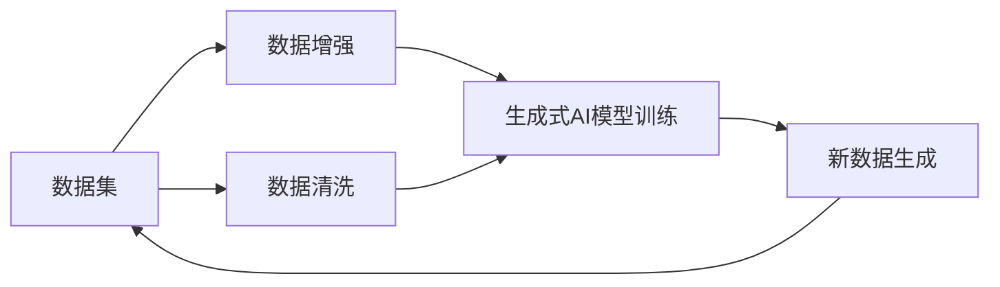

                 

# 生成式 AI：数据集的未来

> 关键词：生成式AI, 数据集, 模型训练, 数据增强, 数据清洗, 自动数据集生成

## 1. 背景介绍

在人工智能(AI)的迅猛发展中，生成式AI技术正变得越来越重要。从自然语言处理到计算机视觉，生成式AI被广泛应用于各个领域，极大地推动了AI技术的进步。然而，生成式AI模型的训练与优化，高度依赖于数据集的质量和数量。随着模型复杂度的提高，训练一个高效的生成式AI模型对数据集的需求也在不断增长。因此，高质量、多样化的数据集是生成式AI技术的核心瓶颈之一。本文将从背景介绍、核心概念与联系、核心算法原理与具体操作步骤、数学模型和公式推导、项目实践、实际应用场景、工具和资源推荐、总结与展望等多个维度，深入探讨生成式AI数据集的未来发展趋势和面临的挑战，为未来的数据集构建和优化提供策略和指导。

## 2. 核心概念与联系

### 2.1 核心概念概述

- **生成式AI (Generative AI)**：使用深度学习模型生成新数据的技术。生成式AI能够从已有数据中学习规律，生成与训练数据分布相似的新样本，广泛应用于图像生成、文本生成、音乐创作等领域。

- **数据集 (Dataset)**：包含用于训练、验证和测试模型的数据样本集合。数据集的多样性和质量直接影响生成式AI模型的性能。

- **模型训练 (Model Training)**：通过调整模型参数，使其能够更好地拟合数据集的过程。模型训练需要大量高质量的数据集作为支撑。

- **数据增强 (Data Augmentation)**：通过对原始数据进行各种变换，生成新的训练样本，以增强数据集的多样性。

- **数据清洗 (Data Cleaning)**：从原始数据中移除噪声和异常值，提升数据集的质量。

- **自动数据集生成 (Automated Dataset Generation)**：使用AI技术自动生成新的数据集，补充或替代已有数据集。

这些核心概念之间存在紧密联系，通过高质量的数据集，生成式AI模型能够更好地学习规律，生成更逼真、更具多样性的新数据。然而，构建和优化高质量数据集仍然存在诸多挑战，需要在数据增强、数据清洗和自动数据集生成等方面进行深入探索。

### 2.2 核心概念原理和架构的 Mermaid 流程图



## 3. 核心算法原理 & 具体操作步骤

### 3.1 算法原理概述

生成式AI模型的训练与优化依赖于高质量、多样化的数据集。数据集的多样性和质量直接影响模型的泛化能力和生成效果。因此，生成式AI的核心算法原理在于如何构建、优化和增强数据集，使得模型能够更好地学习规律，生成高质量的新数据。

### 3.2 算法步骤详解

1. **数据收集**：收集大量与任务相关的原始数据，包括文本、图像、音频等。数据应尽量覆盖不同场景和变化，确保多样性。

2. **数据预处理**：对原始数据进行去噪、标准化、归一化等预处理，确保数据的质量和一致性。

3. **数据增强**：使用数据增强技术，如旋转、翻转、裁剪、缩放、噪声添加等，生成新的训练样本，以增强数据集的多样性。

4. **数据清洗**：通过人工审核、自动化算法等方式，移除异常值、噪声，确保数据集的质量。

5. **模型训练**：使用深度学习模型，如GANs、变分自编码器、自回归模型等，对数据集进行训练，优化模型参数。

6. **评估与优化**：使用评估指标，如生成质量、多样性、生成速度等，评估模型性能，不断调整模型和数据集，优化模型效果。

### 3.3 算法优缺点

**优点**：
- **多样性**：数据增强技术能够生成大量多样化的训练样本，提升模型的泛化能力。
- **鲁棒性**：数据清洗技术能够移除噪声和异常值，提升模型鲁棒性。
- **自动化**：自动数据集生成技术能够快速生成新数据，补充或替代已有数据集。

**缺点**：
- **成本高**：高质量数据集的构建和优化需要大量人力物力，成本较高。
- **复杂性**：数据增强和数据清洗技术复杂，需要精心设计和优化。
- **过拟合风险**：数据增强和数据清洗过度，可能导致模型过拟合，降低模型泛化能力。

### 3.4 算法应用领域

生成式AI技术在多个领域具有广泛应用，包括但不限于：

- **自然语言处理**：文本生成、对话系统、语音合成等。
- **计算机视觉**：图像生成、图像修复、视频制作等。
- **音乐创作**：音乐生成、风格转换、音乐推荐等。
- **游戏与模拟**：虚拟环境创建、角色生成、游戏内容生成等。

## 4. 数学模型和公式 & 详细讲解 & 举例说明

### 4.1 数学模型构建

生成式AI模型的核心在于构建和优化数据集。常用的数学模型包括：

- **自回归模型**：如LSTM、GRU等，通过序列数据的预测来生成新数据。
- **变分自编码器 (VAE)**：通过将数据表示为低维潜在变量，生成新数据。
- **生成对抗网络 (GANs)**：通过生成器和判别器之间的对抗训练，生成高质量的新数据。

### 4.2 公式推导过程

以生成对抗网络 (GANs) 为例，其基本公式如下：

$$
\min_G \max_D V(D, G) = \mathbb{E}_{x \sim p_{\text{data}}(x)} [\log D(x)] + \mathbb{E}_{z \sim p(z)} [\log (1 - D(G(z)))]
$$

其中 $G$ 是生成器，$D$ 是判别器，$V(D, G)$ 是损失函数。生成器 $G$ 通过随机噪声 $z$ 生成新数据 $G(z)$，判别器 $D$ 判断数据是真实数据还是生成数据，最终目标是通过对抗训练使生成器生成与真实数据难以区分的新数据。

### 4.3 案例分析与讲解

假设我们要生成一张猫的图片，可以将一组猫的图像作为训练数据集，通过GANs生成器学习猫的特征，然后通过生成器生成新的猫的图片。下面是一个简单的GANs训练流程：

1. **数据准备**：收集一组猫的图像，进行预处理，确保数据质量。
2. **模型构建**：使用PyTorch构建生成器和判别器模型。
3. **训练过程**：将生成器和判别器交替训练，优化损失函数，生成新的猫的图片。
4. **评估与优化**：通过生成图片的质量和多样性评估模型性能，不断调整模型和数据集，优化生成效果。

## 5. 项目实践：代码实例和详细解释说明

### 5.1 开发环境搭建

为了进行生成式AI项目的实践，需要先搭建好开发环境。以下是使用Python进行TensorFlow和PyTorch开发的环境配置流程：

1. 安装Anaconda：从官网下载并安装Anaconda，用于创建独立的Python环境。

2. 创建并激活虚拟环境：
```bash
conda create -n tf-env python=3.8 
conda activate tf-env
```

3. 安装TensorFlow和PyTorch：根据CUDA版本，从官网获取对应的安装命令。例如：
```bash
pip install tensorflow==2.7
conda install pytorch torchvision torchaudio cudatoolkit=11.1 -c pytorch -c conda-forge
```

4. 安装各类工具包：
```bash
pip install numpy pandas scikit-learn matplotlib tqdm jupyter notebook ipython
```

完成上述步骤后，即可在`tf-env`环境中开始项目实践。

### 5.2 源代码详细实现

这里我们以图像生成任务为例，给出使用TensorFlow和PyTorch实现GANs的代码实现。

首先，定义GANs的结构：

```python
from tensorflow.keras import layers, models

# 生成器
def make_generator():
    model = models.Sequential()
    model.add(layers.Dense(256, use_bias=False, input_shape=(100,)))
    model.add(layers.BatchNormalization())
    model.add(layers.LeakyReLU())
    model.add(layers.Dense(512))
    model.add(layers.BatchNormalization())
    model.add(layers.LeakyReLU())
    model.add(layers.Dense(1024))
    model.add(layers.BatchNormalization())
    model.add(layers.LeakyReLU())
    model.add(layers.Dense(784, activation='tanh'))
    model.add(layers.Reshape((28, 28, 1)))
    return model

# 判别器
def make_discriminator():
    model = models.Sequential()
    model.add(layers.Conv2D(64, (3, 3), strides=2, padding='same', input_shape=[28, 28, 1]))
    model.add(layers.LeakyReLU())
    model.add(layers.Dropout(0.3))
    model.add(layers.Conv2D(128, (3, 3), strides=2, padding='same'))
    model.add(layers.LeakyReLU())
    model.add(layers.Dropout(0.3))
    model.add(layers.Flatten())
    model.add(layers.Dense(1, activation='sigmoid'))
    return model
```

然后，定义损失函数和优化器：

```python
from tensorflow.keras import optimizers

# 生成器和判别器的损失函数
cross_entropy = layers.loss.BinaryCrossentropy(from_logits=True)
def discriminator_loss(real_output, fake_output):
    real_loss = cross_entropy(tf.ones_like(real_output), real_output)
    fake_loss = cross_entropy(tf.zeros_like(fake_output), fake_output)
    return real_loss + fake_loss

def generator_loss(fake_output):
    return cross_entropy(tf.ones_like(fake_output), fake_output)

# 优化器
gen_optimizer = optimizers.Adam(1e-4)
disc_optimizer = optimizers.Adam(1e-4)
```

接着，定义训练函数：

```python
import numpy as np

# 定义随机噪声
def make_noise(batch_size):
    return np.random.normal(0, 1, size=(batch_size, 100))

# 训练函数
@tf.function
def train_step(images):
    noise = make_noise(batch_size=batch_size)
    with tf.GradientTape() as gen_tape, tf.GradientTape() as disc_tape:
        generated_images = generator(noise, training=True)
        real_output = discriminator(images, training=True)
        fake_output = discriminator(generated_images, training=True)
        
        gen_loss = generator_loss(fake_output)
        disc_loss = discriminator_loss(real_output, fake_output)
        
    gradients_of_generator = gen_tape.gradient(gen_loss, generator.trainable_variables)
    gradients_of_discriminator = disc_tape.gradient(disc_loss, discriminator.trainable_variables)
    
    gen_optimizer.apply_gradients(zip(gradients_of_generator, generator.trainable_variables))
    disc_optimizer.apply_gradients(zip(gradients_of_discriminator, discriminator.trainable_variables))
```

最后，启动训练流程：

```python
# 定义训练参数
batch_size = 128
epochs = 100

# 加载数据集
(train_images, train_labels), (_, _) = tf.keras.datasets.mnist.load_data()
train_images = train_images.reshape(train_images.shape[0], 28, 28, 1).astype('float32')
train_images = (train_images - 127.5) / 127.5 # 归一化

# 定义数据增强
aug = tf.keras.Sequential([
    layers.experimental.preprocessing.RandomRotation(0.1),
    layers.experimental.preprocessing.RandomZoom(0.1),
    layers.experimental.preprocessing.RandomFlip('horizontal_and_vertical'),
])

# 训练过程
for epoch in range(epochs):
    for image_batch in tf.data.Dataset.from_tensor_slices(train_images).shuffle(buffer_size=1024).batch(batch_size):
        augmented_images = aug(image_batch)
        train_step(augmented_images)
    
    # 生成新图片
    gen = generator(np.random.normal(0, 1, size=(1, 100)))
    plt.imshow(gen.numpy().reshape(28, 28), cmap='gray')
    plt.show()
```

以上就是使用TensorFlow和PyTorch实现GANs的完整代码实现。可以看到，借助TensorFlow和PyTorch的强大功能和高效性能，我们能够快速实现GANs的训练过程，并生成逼真的新图像。

### 5.3 代码解读与分析

让我们再详细解读一下关键代码的实现细节：

**make_generator和make_discriminator函数**：
- `make_generator`函数定义了生成器的神经网络结构，从输入噪声生成图像。
- `make_discriminator`函数定义了判别器的神经网络结构，区分真实图像和生成图像。

**cross_entropy函数**：
- 定义了交叉熵损失函数，用于计算生成器和判别器的损失。

**train_step函数**：
- 定义了训练过程中的每个步骤，包括生成噪声、计算生成器和判别器的输出、计算损失、反向传播更新模型参数等。

**训练流程**：
- 定义训练参数，如批次大小和迭代次数。
- 加载MNIST数据集，并进行数据增强。
- 在每个epoch内，对数据集进行迭代，生成新图像并展示。

可以看到，TensorFlow和PyTorch的高效性能和强大功能，使得实现GANs的训练过程变得非常简单。开发者可以将更多精力放在模型结构设计、损失函数选择、优化器调整等高层逻辑上，而不必过多关注底层的实现细节。

当然，工业级的系统实现还需考虑更多因素，如模型的保存和部署、超参数的自动搜索、更灵活的训练策略等。但核心的生成式AI训练流程基本与此类似。

## 6. 实际应用场景

### 6.1 图像生成

图像生成是生成式AI最常见的应用之一。GANs等模型被广泛应用于艺术创作、图像修复、虚拟现实等领域。通过生成逼真、多样的新图像，图像生成技术为各种创意产业提供了强大的工具支持。

### 6.2 文本生成

文本生成技术可以用于自然语言处理、机器翻译、聊天机器人等领域。使用生成式AI模型，可以从已有文本中学习规律，生成新的文本内容，极大地提升NLP任务的性能。

### 6.3 音乐生成

音乐生成技术可以用于音乐创作、自动作曲、音乐推荐等领域。通过生成新颖、具有风格的音乐作品，音乐生成技术为音乐创作和娱乐产业带来了新的可能性。

### 6.4 游戏与模拟

生成式AI技术在游戏与模拟领域具有广泛应用，可以用于虚拟角色生成、虚拟环境创建、游戏内容生成等。通过生成逼真的游戏内容和模拟环境，生成式AI技术为游戏和教育模拟等领域提供了新的工具。

## 7. 工具和资源推荐

### 7.1 学习资源推荐

为了帮助开发者系统掌握生成式AI的技术基础和实践技巧，这里推荐一些优质的学习资源：

1. **《Deep Learning》书籍**：Ian Goodfellow等人所著，全面介绍了深度学习的基本概念和算法，是生成式AI的入门必读书籍。

2. **《Generative Adversarial Networks》书籍**：Ian Goodfellow等人所著，详细介绍了GANs的原理和应用，是生成式AI的核心读物。

3. **Coursera《深度学习专项课程》**：由Coursera提供的深度学习课程，涵盖了深度学习的基础知识和前沿技术，包括生成式AI。

4. **arXiv.org**：最新的学术论文发布平台，涵盖了生成式AI的最新研究进展和前沿技术。

5. **GitHub**：全球最大的开源代码托管平台，提供了丰富的生成式AI项目代码和资源。

通过对这些资源的学习实践，相信你一定能够快速掌握生成式AI的精髓，并用于解决实际的AI问题。

### 7.2 开发工具推荐

高效的开发离不开优秀的工具支持。以下是几款用于生成式AI开发常用的工具：

1. **TensorFlow**：由Google主导开发的深度学习框架，提供了丰富的生成式AI模型库和工具。

2. **PyTorch**：由Facebook主导开发的深度学习框架，提供了高效的动态计算图和丰富的模型库。

3. **Jupyter Notebook**：交互式编程工具，支持Python和R等语言，便于实验和协作开发。

4. **TensorBoard**：TensorFlow配套的可视化工具，可实时监测模型训练状态，并提供丰富的图表呈现方式。

5. **Weights & Biases**：模型训练的实验跟踪工具，可以记录和可视化模型训练过程中的各项指标，方便对比和调优。

6. **Ganer**：一个基于PyTorch的GANs实现工具，提供了简单易用的API和丰富的模型配置。

合理利用这些工具，可以显著提升生成式AI开发的效率和质量，加速创新迭代的步伐。

### 7.3 相关论文推荐

生成式AI技术的发展离不开学界的持续研究。以下是几篇奠基性的相关论文，推荐阅读：

1. **Generative Adversarial Nets**：Ian Goodfellow等人提出GANs模型，开启了生成式AI的研究先河。

2. **Language Models are Unsupervised Multitask Learners**：OpenAI提出的语言模型，展示了自监督学习在生成式AI中的巨大潜力。

3. **Controllable Generation of Text**：OpenAI提出基于 Prompt 的文本生成方法，通过精心设计的提示模板引导生成器生成特定风格的文本。

4. **Diffusion Models**：OpenAI提出扩散模型，使用小步度的噪声添加和反向扩散，生成高质量的新图像和文本。

5. **GPT-3: Language Models are Few-shot Learners**：OpenAI提出的GPT-3模型，展示了预训练模型在生成式AI中的强大能力。

这些论文代表了大规模生成式AI的研究进展，通过学习这些前沿成果，可以帮助研究者把握学科前进方向，激发更多的创新灵感。

## 8. 总结：未来发展趋势与挑战

### 8.1 研究成果总结

本文对生成式AI数据集的未来进行了深入探讨，从背景介绍、核心概念与联系、核心算法原理与具体操作步骤、数学模型和公式推导、项目实践、实际应用场景、工具和资源推荐等多个维度，全面解析了生成式AI数据集构建和优化的关键技术。通过本文的系统梳理，可以看到，生成式AI技术的迅猛发展极大地拓展了数据集的应用范围，推动了AI技术的进步。

### 8.2 未来发展趋势

展望未来，生成式AI数据集将呈现以下几个发展趋势：

1. **多样化和高质量数据集**：高质量、多样化的数据集将继续推动生成式AI技术的进步，确保生成模型的泛化能力和生成效果。

2. **自动数据集生成技术**：自动数据集生成技术将成为生成式AI的重要组成部分，通过AI技术自动生成新数据，补充或替代已有数据集。

3. **数据增强和数据清洗技术**：数据增强和数据清洗技术将继续优化数据集，提高生成模型的性能和鲁棒性。

4. **多模态数据融合**：多模态数据融合技术将进一步拓展生成式AI的应用范围，融合视觉、语音、文本等多种数据形式，提升模型的生成能力和应用效果。

5. **联邦学习和隐私保护**：联邦学习技术将进一步提升生成式AI数据集的安全性和隐私保护能力，确保数据安全。

### 8.3 面临的挑战

尽管生成式AI技术取得了显著进展，但在迈向更加智能化、普适化应用的过程中，它仍面临诸多挑战：

1. **数据隐私和安全**：生成式AI模型的训练和应用需要大量的高质量数据，如何在数据隐私和安全方面进行保障，是一个重要挑战。

2. **计算资源需求**：生成式AI模型的训练和推理需要大量的计算资源，如何高效利用计算资源，提高模型训练和推理效率，是一个重要的研究方向。

3. **模型泛化能力**：生成式AI模型在不同场景和数据分布上的泛化能力仍然有待提高，如何提升模型的泛化能力和鲁棒性，是一个重要的研究课题。

4. **生成质量**：生成式AI模型生成的样本质量仍然有待提升，如何生成更高质量、更具多样性的样本，是一个重要的研究课题。

5. **模型解释性**：生成式AI模型通常被视为"黑盒"系统，难以解释其内部工作机制和决策逻辑。如何提高模型的可解释性，是一个重要的研究方向。

### 8.4 研究展望

面对生成式AI面临的种种挑战，未来的研究需要在以下几个方面寻求新的突破：

1. **数据隐私和安全技术**：研究数据隐私和安全保护技术，确保生成式AI模型在数据隐私和安全方面具有更高的保障能力。

2. **高效计算资源利用技术**：研究高效计算资源利用技术，如分布式训练、模型并行等，提升模型训练和推理效率。

3. **泛化能力和鲁棒性提升**：研究提升生成式AI模型的泛化能力和鲁棒性的方法，使其在不同场景和数据分布上具备更强的适应能力。

4. **高质量生成样本生成技术**：研究生成高质量、更具多样性的样本的方法，提升生成式AI模型的生成效果。

5. **模型解释性和透明性技术**：研究提高生成式AI模型的可解释性和透明性的方法，使其能够更好地理解和解释其内部工作机制和决策逻辑。

这些研究方向将推动生成式AI技术的进一步发展，为构建智能、安全、可信的生成式AI系统铺平道路。面向未来，生成式AI数据集和模型需要在数据隐私、计算资源、模型性能、模型解释性等方面进行深入探索和创新。相信随着技术的不断进步，生成式AI将在更多领域展现其强大的应用潜力，为人类社会的进步做出更大的贡献。

## 9. 附录：常见问题与解答

**Q1: 生成式AI的生成效果与训练数据集的质量和多样性有何关系？**

A: 生成式AI的生成效果与训练数据集的质量和多样性密切相关。高质量、多样化的数据集能够帮助模型更好地学习规律，生成更加逼真、多样化的新数据。如果数据集存在噪声、异常值或者数据分布不均衡，生成效果会受到严重影响，生成样本质量下降。因此，构建和优化高质量数据集是生成式AI技术的基础。

**Q2: 如何提高生成式AI模型的泛化能力和鲁棒性？**

A: 提高生成式AI模型的泛化能力和鲁棒性，可以从以下几个方面入手：
1. 数据增强：通过旋转、翻转、裁剪、缩放等技术，生成更多样化的训练数据，提升模型的泛化能力。
2. 对抗训练：引入对抗样本，训练模型对扰动的鲁棒性，提升模型的鲁棒性。
3. 正则化：使用L2正则、Dropout等技术，避免过拟合，提升模型的泛化能力。
4. 多模态数据融合：融合视觉、语音、文本等多种数据形式，提升模型的泛化能力和鲁棒性。

**Q3: 如何处理生成式AI模型生成的样本质量问题？**

A: 处理生成式AI模型生成的样本质量问题，可以从以下几个方面入手：
1. 数据清洗：通过数据清洗技术，移除噪声和异常值，提升样本质量。
2. 模型优化：优化生成式AI模型的架构和参数设置，提升生成效果。
3. 数据增强：通过数据增强技术，生成更多样化的训练数据，提升生成效果。
4. 对抗训练：引入对抗样本，训练模型对扰动的鲁棒性，提升生成效果。

**Q4: 生成式AI模型在实际应用中存在哪些挑战？**

A: 生成式AI模型在实际应用中存在以下几个挑战：
1. 数据隐私和安全：生成式AI模型的训练和应用需要大量的高质量数据，如何在数据隐私和安全方面进行保障，是一个重要挑战。
2. 计算资源需求：生成式AI模型的训练和推理需要大量的计算资源，如何高效利用计算资源，提高模型训练和推理效率，是一个重要的研究方向。
3. 模型泛化能力：生成式AI模型在不同场景和数据分布上的泛化能力仍然有待提高，如何提升模型的泛化能力和鲁棒性，是一个重要的研究课题。
4. 生成质量：生成式AI模型生成的样本质量仍然有待提升，如何生成更高质量、更具多样性的样本，是一个重要的研究课题。
5. 模型解释性：生成式AI模型通常被视为"黑盒"系统，难以解释其内部工作机制和决策逻辑。如何提高模型的可解释性，是一个重要的研究方向。

**Q5: 自动数据集生成技术有哪些应用场景？**

A: 自动数据集生成技术在以下几个方面具有广泛应用：
1. 补充现有数据集：在现有数据集规模不足或者数据分布不均衡时，自动数据集生成技术可以补充和扩展数据集，提升模型的泛化能力和鲁棒性。
2. 替代现有数据集：在一些高风险领域，如医疗、法律等，自动数据集生成技术可以替代现有数据集，避免敏感数据的泄露。
3. 实时数据生成：自动数据集生成技术可以实时生成新的数据，用于在线学习和在线推理，提高系统的实时性和响应速度。

通过这些问题的解答，可以看到，生成式AI技术在实际应用中仍然面临诸多挑战，需要在数据隐私、计算资源、模型性能、模型解释性等方面进行深入探索和创新。相信随着技术的不断进步，生成式AI将在更多领域展现其强大的应用潜力，为人类社会的进步做出更大的贡献。

---

作者：禅与计算机程序设计艺术 / Zen and the Art of Computer Programming

