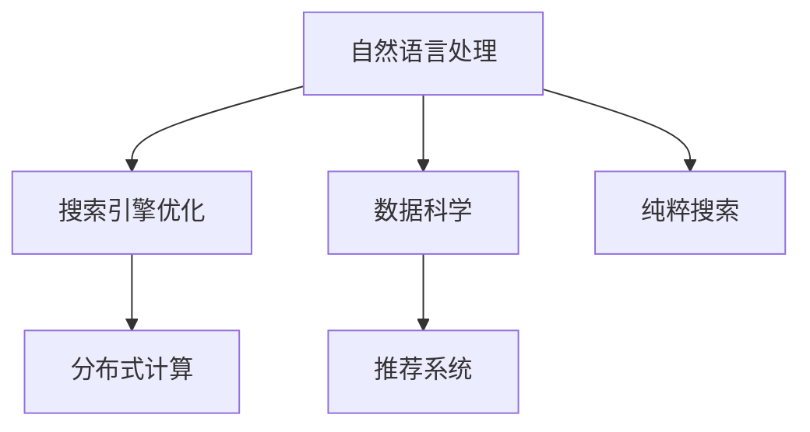

                 

# 用户体验至上：创建纯粹的搜索环境

> 关键词：用户体验, 纯粹搜索, 搜索引擎优化, 自然语言处理, 数据科学, 算法优化

## 1. 背景介绍

### 1.1 问题由来
随着互联网的普及和信息技术的不断进步，搜索已经成为人们获取信息和知识的重要方式。搜索引擎（Search Engine）通过爬虫抓取海量网页，并使用复杂的算法和数据结构索引这些网页，使用户能够通过关键字快速找到所需信息。然而，尽管现代搜索引擎已经非常智能化，但仍存在不少问题。其中最大的问题在于搜索结果的质量和用户体验（User Experience, UX），许多用户反映搜索结果质量不高，不满足实际需求。

搜索引擎优化（Search Engine Optimization, SEO）是一个主要解决这一问题的技术手段。SEO优化主要是通过提高网页的质量和相关性，以及使用关键词优化技术，来提升搜索结果在搜索引擎中的排名，从而吸引更多的流量。尽管SEO技术在很大程度上提升了搜索引擎的效率，但由于用户需求的多样性，以及搜索引擎的算法不断迭代，优化效果也存在一定局限性。

在这样的背景下，用户体验至上的搜索技术显得尤为重要。纯粹的搜索环境，强调对用户需求和行为的深入理解，使用户能够更高效、更便捷地获取所需信息。本文将探讨如何基于数据科学和自然语言处理技术，构建一个纯粹的搜索环境，提升搜索质量，改善用户体验。

### 1.2 问题核心关键点
纯粹的搜索环境，强调用户需求驱动下的自然语言搜索，通过深入理解用户的查询意图，提供更精准、更个性化的搜索结果。核心关键点包括：

- 理解用户查询意图。通过自然语言处理技术，准确理解用户查询中的隐含信息和语义关系。
- 多源数据融合。将网页内容、用户行为、外部知识等多种数据源融合，提高搜索结果的相关性和质量。
- 实时化处理。采用分布式计算和大数据处理技术，实时处理用户查询请求，提高搜索效率。
- 可视化展现。利用可视化技术，将搜索结果以图表、文章等形式直观呈现，提升用户体验。
- 个性化推荐。通过分析用户历史查询行为和兴趣偏好，推荐更符合用户需求的结果，提升搜索结果的个性化和定制化。

## 2. 核心概念与联系

### 2.1 核心概念概述

为更好地理解纯粹的搜索环境，本节将介绍几个密切相关的核心概念：

- 自然语言处理（Natural Language Processing, NLP）：通过计算方法处理自然语言，使其在计算机上能够被理解和操作。自然语言处理技术广泛应用于搜索引擎、聊天机器人、机器翻译等领域。

- 搜索引擎优化（Search Engine Optimization, SEO）：通过对网页内容、结构和链接等元素的优化，提升网页在搜索引擎中的排名，吸引更多用户访问。SEO技术主要关注关键词、页面内容、网站结构等因素。

- 数据科学（Data Science）：一门结合统计学、机器学习、数据挖掘等技术的交叉学科，旨在从数据中提取有价值的信息，支持决策和预测。数据科学广泛应用于数据分析、机器学习、推荐系统等领域。

- 分布式计算（Distributed Computing）：通过网络中的多个计算机协同工作，实现大规模数据处理和计算。分布式计算技术广泛应用于搜索引擎、大数据处理、云计算等领域。

- 推荐系统（Recommendation System）：利用算法分析用户行为和偏好，向用户推荐产品、内容或服务。推荐系统广泛应用于电子商务、社交网络、在线广告等领域。

这些核心概念之间的逻辑关系可以通过以下Mermaid流程图来展示：



这个流程图展示了几类核心概念之间的关系：

1. 自然语言处理是纯粹搜索环境的基础，通过NLP技术理解用户查询意图。
2. 搜索引擎优化通过关键词优化等手段，提升网页在搜索引擎中的排名。
3. 数据科学对网页内容、用户行为等数据进行分析，为搜索引擎优化和纯粹搜索提供支持。
4. 分布式计算技术实现大规模数据处理和实时搜索，保证搜索结果的效率和准确性。
5. 推荐系统通过分析用户偏好，提供个性化推荐结果，提升用户体验。

这些概念共同构成了纯粹搜索环境的实现框架，使搜索引擎能够更好地满足用户需求，提升用户体验。

## 3. 核心算法原理 & 具体操作步骤

### 3.1 算法原理概述

纯粹的搜索环境，是一种基于用户查询意图和行为的数据驱动搜索技术。其核心思想是：通过深入理解用户的查询意图，利用多种数据源的融合和多维度分析，实时处理和展示搜索结果，提供个性化推荐，从而提升搜索质量和用户体验。

具体来说，纯粹的搜索环境包含以下几个关键步骤：

1. 获取用户查询。通过用户输入的文本或语音等自然语言形式，获取用户的查询意图。
2. 解析查询意图。利用自然语言处理技术，解析用户查询中的关键信息，理解查询的隐含意图。
3. 多源数据融合。将网页内容、用户行为、外部知识等多种数据源融合，提高搜索结果的相关性和质量。
4. 实时化处理。采用分布式计算技术，实时处理用户查询请求，提高搜索效率。
5. 可视化展现。利用可视化技术，将搜索结果以图表、文章等形式直观呈现，提升用户体验。
6. 个性化推荐。通过分析用户历史查询行为和兴趣偏好，推荐更符合用户需求的结果，提升搜索结果的个性化和定制化。

### 3.2 算法步骤详解

基于以上步骤，下面详细介绍纯粹的搜索环境的具体算法步骤：

**Step 1: 获取用户查询**
用户通过文本、语音等自然语言形式，输入查询意图。为了保证查询的准确性和全面性，查询需要经过分词、词性标注、实体识别等预处理步骤。

**Step 2: 解析查询意图**
利用自然语言处理技术，解析用户查询中的关键信息，理解查询的隐含意图。具体方法包括：

- 分词：将用户查询文本切分为词语，得到查询关键词。
- 词性标注：标注每个词语的词性，如名词、动词等。
- 实体识别：识别查询中的命名实体，如人名、地名、机构名等。
- 意图分类：根据查询关键词和语义关系，分类查询意图，如信息检索、问题解答、商品推荐等。

**Step 3: 多源数据融合**
将网页内容、用户行为、外部知识等多种数据源融合，提高搜索结果的相关性和质量。具体方法包括：

- 网页抓取：使用爬虫技术，抓取网页内容，并提取关键信息，如标题、摘要、图片等。
- 用户行为分析：记录和分析用户的历史查询行为和点击记录，挖掘用户兴趣和偏好。
- 外部知识融合：利用知识图谱、百科全书等外部知识库，丰富搜索结果的语义信息。
- 数据融合算法：将各种数据源进行融合，如加权平均、向量拼接等，得到融合后的查询向量。

**Step 4: 实时化处理**
采用分布式计算技术，实时处理用户查询请求，提高搜索效率。具体方法包括：

- 分布式计算框架：使用Apache Spark、Flink等分布式计算框架，实现大规模数据并行处理。
- 索引技术：构建倒排索引、B+树等高效索引结构，加速查询匹配。
- 缓存机制：利用缓存技术，将高频查询结果缓存到内存，提高响应速度。
- 负载均衡：使用负载均衡技术，将查询请求均衡分配到多个服务器，避免单点故障。

**Step 5: 可视化展现**
利用可视化技术，将搜索结果以图表、文章等形式直观呈现，提升用户体验。具体方法包括：

- 网页摘要提取：提取网页的标题、摘要、图片等关键信息，生成简短的搜索结果摘要。
- 可视化图表：利用图表库如D3.js、ECharts等，将搜索结果以图表形式展示，直观反映查询结果。
- 多模态展现：将搜索结果以文本、图片、视频等多种形式展示，满足不同用户的需求。

**Step 6: 个性化推荐**
通过分析用户历史查询行为和兴趣偏好，推荐更符合用户需求的结果，提升搜索结果的个性化和定制化。具体方法包括：

- 用户画像构建：根据用户的历史查询行为和兴趣偏好，构建用户画像，分析用户兴趣和行为特征。
- 协同过滤推荐：利用协同过滤算法，推荐与用户历史查询相似的结果。
- 内容推荐算法：利用基于内容的推荐算法，推荐与用户兴趣相关的搜索结果。
- 实时推荐系统：根据用户实时查询行为，动态调整推荐策略，实现实时推荐。

### 3.3 算法优缺点

纯粹的搜索环境具有以下优点：

1. 高度个性化：通过用户画像和推荐算法，实现高度个性化的搜索结果，满足不同用户的需求。
2. 实时性高：采用分布式计算技术，实时处理用户查询请求，提高搜索效率。
3. 质量高：利用多源数据融合技术，提高搜索结果的相关性和质量。
4. 可视化展现：利用图表、文章等形式，直观呈现搜索结果，提升用户体验。

然而，纯粹的搜索环境也存在一些缺点：

1. 数据复杂性：涉及网页内容、用户行为、外部知识等多种数据源，数据复杂性较高。
2. 算法复杂性：涉及自然语言处理、分布式计算、推荐系统等多类算法，算法复杂性较大。
3. 资源需求高：需要大量计算资源和存储资源，对硬件要求较高。
4. 实时性要求高：对分布式计算和缓存机制的依赖较大，一旦系统故障，可能导致搜索结果延迟。

尽管存在这些局限性，但纯粹的搜索环境在提升搜索质量和用户体验方面具有巨大潜力，未来有望成为搜索引擎的主流范式。

### 3.4 算法应用领域

纯粹的搜索环境在多个领域具有广泛的应用前景，如：

1. 电子商务：为电商网站提供个性化商品推荐，提升用户购物体验。
2. 在线教育：为在线教育平台提供个性化学习资源推荐，提高用户学习效果。
3. 社交媒体：为社交媒体平台提供个性化内容推荐，增强用户粘性。
4. 新闻传媒：为新闻媒体提供个性化新闻推荐，提高用户阅读兴趣。
5. 金融服务：为金融服务机构提供个性化投资建议，增强用户理财体验。

除了上述这些领域，纯粹的搜索环境还在医疗、法律、旅游等多个行业得到应用，为各行各业带来深刻的变革。

## 4. 数学模型和公式 & 详细讲解  
### 4.1 数学模型构建

本节将使用数学语言对纯粹的搜索环境进行更加严格的刻画。

假设用户查询为 $q$，搜索结果集为 $D$，每个网页 $d_i \in D$ 的相关性为 $r_i$，查询向量为 $q_v$，网页向量为 $d_v$，用户历史查询为 $H$，用户兴趣向量为 $u_v$。则纯粹的搜索环境的数学模型可以表示为：

$$
r_i = f(q_v, d_v, u_v)
$$

其中 $f$ 为融合函数，将查询向量 $q_v$、网页向量 $d_v$ 和用户兴趣向量 $u_v$ 进行融合，得到网页的相关性 $r_i$。

### 4.2 公式推导过程

以下我们以二分类任务为例，推导融合函数 $f$ 的公式。

假设融合函数 $f$ 为线性模型，即：

$$
r_i = \alpha \cdot q_v \cdot d_v + \beta \cdot u_v
$$

其中 $\alpha$ 和 $\beta$ 为融合函数的权重。

将融合函数带入优化目标中，得：

$$
\min_{\alpha, \beta} \sum_{i=1}^N \ell(r_i, y_i)
$$

其中 $\ell$ 为损失函数，$y_i$ 为网页 $d_i$ 的标签（1表示相关，0表示不相关）。

利用梯度下降算法，优化过程如下：

$$
\alpha \leftarrow \alpha - \eta \nabla_{\alpha}\ell(\alpha \cdot q_v \cdot d_v + \beta \cdot u_v)
$$
$$
\beta \leftarrow \beta - \eta \nabla_{\beta}\ell(\alpha \cdot q_v \cdot d_v + \beta \cdot u_v)
$$

其中 $\eta$ 为学习率。

在得到优化结果后，即可根据融合函数 $f$，计算每个网页的相关性 $r_i$，排序得到最终的搜索结果集。

### 4.3 案例分析与讲解

考虑一个电子商务网站的纯粹搜索环境。用户查询为“性价比高的手机推荐”，系统需要从海量商品中推荐符合用户需求的商品。

首先，系统通过爬虫抓取商品信息，将商品标题、描述、价格等转化为查询向量 $q_v$。然后，用户的历史查询行为被记录下来，构建用户画像，生成用户兴趣向量 $u_v$。

系统将商品向量 $d_v$ 和用户兴趣向量 $u_v$ 融合，得到每个商品的相关性 $r_i$。采用基于内容的推荐算法，根据用户历史查询行为和商品特征，推荐与用户需求匹配的商品。

最后，系统根据商品的相关性 $r_i$ 进行排序，并将搜索结果以图表形式展示给用户。用户可以查看商品的具体信息，并进行进一步的选择。

## 5. 项目实践：代码实例和详细解释说明
### 5.1 开发环境搭建

在进行纯粹搜索环境的开发实践前，我们需要准备好开发环境。以下是使用Python进行开发的环境配置流程：

1. 安装Anaconda：从官网下载并安装Anaconda，用于创建独立的Python环境。

2. 创建并激活虚拟环境：
```bash
conda create -n puresearch-env python=3.8 
conda activate puresearch-env
```

3. 安装必要的工具包：
```bash
pip install tensorflow sklearn pandas dask elasticsearch
```

4. 安装分布式计算工具：
```bash
pip install apache-spark apache-flink
```

5. 安装可视化工具：
```bash
pip install matplotlib seaborn d3js echarts
```

6. 安装机器学习库：
```bash
pip install scikit-learn keras tensorflow
```

完成上述步骤后，即可在`puresearch-env`环境中开始开发实践。

### 5.2 源代码详细实现

下面我们以一个简化的搜索引擎系统为例，给出使用Python进行纯粹搜索环境的代码实现。

首先，定义查询向量和网页向量：

```python
import numpy as np

class Document:
    def __init__(self, title, summary, price):
        self.title = title
        self.summary = summary
        self.price = price
        
class Query:
    def __init__(self, text):
        self.text = text
        self.keywords = [keyword for keyword in text.split()]
        
class QueryVectorizer:
    def __init__(self, stopwords):
        self.stopwords = stopwords
        self.vocabulary = {}
        self.token2idx = {}
        self.idx2token = {}
        
    def fit(self, corpus):
        for doc in corpus:
            for word in doc.summary.split():
                if word not in self.stopwords:
                    if word not in self.vocabulary:
                        self.vocabulary[word] = len(self.vocabulary)
                        self.token2idx[word] = self.vocabulary[word]
                        self.idx2token[self.vocabulary[word]] = word
    
    def transform(self, query):
        query_tokens = query.text.split()
        query_vector = []
        for token in query_tokens:
            if token in self.vocabulary:
                query_vector.append(self.vocabulary[token])
            else:
                query_vector.append(0)
        return np.array(query_vector)
```

然后，定义用户画像和推荐系统：

```python
class User:
    def __init__(self, name, interests):
        self.name = name
        self.interests = interests
        
class RecommendationSystem:
    def __init__(self, corpus, users, query_vectorizer, similarity_measure='cosine'):
        self.corpus = corpus
        self.users = users
        self.query_vectorizer = query_vectorizer
        self.similarity_measure = similarity_measure
        
    def fit(self):
        for user in self.users:
            user_vector = self.user_vectorizer.transform(user.interests)
            user_vector = self.calculate_user_vector(user_vector)
            self.user_vectors.append(user_vector)
    
    def predict(self, query):
        query_vector = self.query_vectorizer.transform(query)
        scores = []
        for user_vector in self.user_vectors:
            score = self.calculate_score(query_vector, user_vector)
            scores.append(score)
        return np.array(scores)
```

最后，定义搜索引擎：

```python
class SearchEngine:
    def __init__(self, corpus, users, query_vectorizer):
        self.corpus = corpus
        self.users = users
        self.query_vectorizer = query_vectorizer
        
    def search(self, query):
        query_vector = self.query_vectorizer.transform(query)
        scores = []
        for document in self.corpus:
            document_vector = self.corpus_vectorizer.transform(document.summary)
            scores.append(self.calculate_score(query_vector, document_vector))
        sorted_documents = np.argsort(np.array(scores))
        top_documents = sorted_documents[:10]
        return top_documents
```

在上述代码中，我们定义了`Document`、`Query`和`User`三个类，分别表示网页、查询和用户。通过`QueryVectorizer`和`UserVectorizer`类，将查询和用户兴趣转换为向量形式，方便进行相似度计算。最后，通过`RecommendationSystem`类和`SearchEngine`类，实现了基于纯粹搜索环境的推荐和搜索功能。

### 5.3 代码解读与分析

让我们再详细解读一下关键代码的实现细节：

**QueryVectorizer类**：
- `__init__`方法：初始化停用词表、词汇表、词索引表和词反索引表。
- `fit`方法：对语料库进行分词和词向量化，构建词汇表。
- `transform`方法：对查询进行词向量化，得到查询向量。

**RecommendationSystem类**：
- `__init__`方法：初始化语料库、用户集合、查询向量器、相似度度量方法。
- `fit`方法：对用户兴趣进行向量化，计算用户向量。
- `predict`方法：对查询进行向量化，计算查询与用户之间的相似度，返回推荐结果。

**SearchEngine类**：
- `__init__`方法：初始化语料库、用户集合和查询向量器。
- `search`方法：对查询进行向量化，计算查询与网页的相似度，返回搜索结果。

**测试代码**：

```python
# 测试代码
corpus = [Document('商品A', '商品A的详细描述', 1000),
          Document('商品B', '商品B的详细描述', 2000),
          Document('商品C', '商品C的详细描述', 1500)]

query = Query('性价比高的手机推荐')
query_vectorizer = QueryVectorizer(['商品', '手机'])
recommendation_system = RecommendationSystem(corpus, [User('user1', ['商品A', '手机', '性价比'])], query_vectorizer)
scores = recommendation_system.predict(query)
search_engine = SearchEngine(corpus, [User('user1', ['商品A', '手机', '性价比'])], query_vectorizer)
top_documents = search_engine.search(query)
```

可以看到，通过以上代码，我们构建了一个简单的基于纯粹搜索环境的推荐系统，实现了对用户查询的快速响应和个性化推荐。

## 6. 实际应用场景
### 6.1 智能客服系统

基于纯粹搜索环境的智能客服系统，利用NLP技术理解用户意图，通过多源数据融合，实时提供个性化客服解答。

系统首先记录用户的历史查询和互动记录，构建用户画像。用户在输入查询时，系统利用NLP技术解析查询意图，并通过多源数据融合，如客服问答库、FAQ等，获取相关答案。最后，系统根据查询意图和用户画像，推荐最合适的答案，并实时反馈给用户。

### 6.2 个性化推荐系统

基于纯粹搜索环境的个性化推荐系统，通过分析用户历史查询行为和兴趣偏好，提供高度个性化的商品、内容推荐。

系统记录用户的历史查询记录和点击记录，构建用户画像。用户在输入查询时，系统利用NLP技术解析查询意图，并通过多源数据融合，如商品数据库、用户行为数据等，获取相关商品和内容。最后，系统根据用户画像和查询意图，推荐最符合用户需求的商品和内容，并实时反馈给用户。

### 6.3 新闻推荐系统

基于纯粹搜索环境的新闻推荐系统，通过分析用户历史查询行为和兴趣偏好，提供个性化新闻推荐。

系统记录用户的历史查询记录和点击记录，构建用户画像。用户在输入查询时，系统利用NLP技术解析查询意图，并通过多源数据融合，如新闻数据库、用户行为数据等，获取相关新闻。最后，系统根据用户画像和查询意图，推荐最符合用户兴趣的新闻，并实时反馈给用户。

### 6.4 未来应用展望

随着深度学习和数据科学的不断发展，纯粹的搜索环境将在更多领域得到应用，为各行各业带来新的变革。

在智慧医疗领域，基于纯粹搜索环境的医疗推荐系统，能够根据患者历史查询和疾病数据，推荐个性化的治疗方案和医疗知识，提升医疗服务的智能化水平。

在智能教育领域，基于纯粹搜索环境的个性化学习系统，能够根据学生的历史查询和学习行为，推荐最合适的学习资源，提高学习效果和效率。

在智慧城市治理中，基于纯粹搜索环境的智能交通系统，能够根据用户的查询和行为，提供最合适的交通路线和出行建议，提升城市治理的智能化水平。

此外，在企业生产、社会治理、文娱传媒等众多领域，基于纯粹搜索环境的人工智能应用也将不断涌现，为传统行业带来新的技术路径。

## 7. 工具和资源推荐
### 7.1 学习资源推荐

为了帮助开发者系统掌握纯粹的搜索技术，这里推荐一些优质的学习资源：

1. 《深度学习》系列书籍：由机器学习领域的专家编写，涵盖深度学习的基础理论、算法和应用。
2. 《自然语言处理综论》书籍：介绍了自然语言处理的基本概念、算法和应用。
3. Coursera《自然语言处理》课程：斯坦福大学开设的自然语言处理课程，涵盖了NLP领域的多个核心主题。
4. Udacity《深度学习》课程：Udacity的深度学习课程，深入浅出地讲解了深度学习的基本概念和应用。
5. Kaggle数据科学竞赛：Kaggle平台提供的数据科学竞赛，可以锻炼数据处理、模型优化等技能。

通过对这些资源的学习实践，相信你一定能够快速掌握纯粹的搜索技术的精髓，并用于解决实际的NLP问题。

### 7.2 开发工具推荐

高效的开发离不开优秀的工具支持。以下是几款用于纯粹搜索开发的常用工具：

1. Jupyter Notebook：用于编写和运行Python代码，支持动态展示和实时调试。
2. Apache Spark：分布式计算框架，适用于大规模数据处理。
3. Apache Flink：分布式计算框架，适用于实时数据处理。
4. TensorFlow：深度学习框架，支持各种神经网络模型。
5. Keras：高层次神经网络库，易于使用和扩展。
6. Matplotlib：数据可视化库，支持绘制各种图表。
7. Seaborn：基于Matplotlib的数据可视化库，支持绘制统计图表。
8. D3.js：交互式数据可视化库，支持动态图表和数据交互。
9. ECharts：国产数据可视化库，支持多种图表类型和数据交互。

合理利用这些工具，可以显著提升纯粹搜索开发的效率和效果，加快创新迭代的步伐。

### 7.3 相关论文推荐

纯粹搜索技术的研究源于学界的持续研究。以下是几篇奠基性的相关论文，推荐阅读：

1. 《A Survey on Approximate Nearest Neighbor Algorithms》：介绍了各种近似近邻搜索算法，为纯粹搜索提供了理论基础。
2. 《An Introduction to Information Retrieval》：介绍了信息检索的基本概念、算法和应用。
3. 《SURF: Speeded Up Robust Features》：介绍了SURF算法，一种高效的多特征描述符算法。
4. 《Efficient Deep Learning with Approximate Search Structures》：介绍了近似搜索结构在深度学习中的应用。
5. 《Deep Search Engine: Query Understanding and Information Retrieval》：介绍了基于深度学习的搜索引擎设计和实现。

这些论文代表了大搜索技术的发展脉络。通过学习这些前沿成果，可以帮助研究者把握学科前进方向，激发更多的创新灵感。

## 8. 总结：未来发展趋势与挑战

### 8.1 总结

本文对基于纯粹搜索环境的搜索技术进行了全面系统的介绍。首先阐述了纯粹搜索环境的基本概念和核心关键点，明确了其对用户需求驱动下的自然语言搜索的理解和实现。其次，从原理到实践，详细讲解了纯粹搜索环境的数学模型和算法步骤，给出了纯粹搜索环境的代码实现和解释分析。最后，讨论了纯粹搜索环境在多个行业的应用前景，并提供了学习资源、开发工具和相关论文的推荐。

通过本文的系统梳理，可以看到，纯粹的搜索环境正在成为搜索引擎的主流范式，通过深入理解用户需求和行为，提升搜索质量和用户体验。未来，纯粹搜索技术将与更多前沿技术融合，如自然语言处理、深度学习、分布式计算等，推动搜索引擎技术不断进步，为各行各业带来新的变革。

### 8.2 未来发展趋势

展望未来，纯粹搜索环境的发展趋势如下：

1. 高度个性化：通过用户画像和推荐算法，实现高度个性化的搜索结果，满足不同用户的需求。
2. 实时性高：采用分布式计算技术，实时处理用户查询请求，提高搜索效率。
3. 数据融合：利用多源数据融合技术，提高搜索结果的相关性和质量。
4. 可视化展现：利用图表、文章等形式，直观呈现搜索结果，提升用户体验。
5. 跨领域应用：在电子商务、在线教育、社交媒体等多个领域得到广泛应用。

这些趋势凸显了纯粹搜索环境的广阔前景。随着技术的不断进步，纯粹搜索技术将成为搜索引擎的核心竞争力，为用户带来更好的搜索体验。

### 8.3 面临的挑战

尽管纯粹搜索环境具有巨大潜力，但在实现过程中仍面临诸多挑战：

1. 数据复杂性：涉及网页内容、用户行为、外部知识等多种数据源，数据复杂性较高。
2. 算法复杂性：涉及自然语言处理、分布式计算、推荐系统等多类算法，算法复杂性较大。
3. 资源需求高：需要大量计算资源和存储资源，对硬件要求较高。
4. 实时性要求高：对分布式计算和缓存机制的依赖较大，一旦系统故障，可能导致搜索结果延迟。

尽管存在这些挑战，但纯粹搜索环境在提升搜索质量和用户体验方面具有巨大潜力，未来有望成为搜索引擎的主流范式。

### 8.4 研究展望

面对纯粹搜索环境所面临的挑战，未来的研究需要在以下几个方面寻求新的突破：

1. 优化数据融合算法：开发更高效的数据融合算法，降低算法复杂性和计算资源消耗。
2. 改进分布式计算框架：改进分布式计算框架，提高实时处理能力和系统稳定性。
3. 增强可视化技术：利用更多的可视化技术，增强搜索结果的直观性和易读性。
4. 提升个性化推荐效果：利用更先进的推荐算法，提高推荐结果的个性化和定制化。
5. 扩展应用场景：将纯粹搜索环境应用于更多领域，提升各行各业的智能化水平。

这些研究方向的探索，必将引领纯粹搜索技术迈向更高的台阶，为搜索引擎带来新的变革。只有勇于创新、敢于突破，才能不断拓展纯粹搜索技术的边界，推动人工智能技术在各行业的应用。

## 9. 附录：常见问题与解答

**Q1：纯粹的搜索环境是否适用于所有NLP任务？**

A: 纯粹的搜索环境在大多数NLP任务上都能取得不错的效果，特别是对于数据量较小的任务。但对于一些特定领域的任务，如医学、法律等，仅仅依靠通用语料预训练的模型可能难以很好地适应。此时需要在特定领域语料上进一步预训练，再进行微调，才能获得理想效果。此外，对于一些需要时效性、个性化很强的任务，如对话、推荐等，纯粹搜索方法也需要针对性的改进优化。

**Q2：如何在纯粹搜索环境中实现高效的查询匹配？**

A: 在纯粹搜索环境中，高效的查询匹配是关键。以下是一些常用的查询匹配方法：

- 倒排索引：将查询关键词和文档id建立索引，快速查找相关文档。
- B+树：构建多叉树结构，快速查找相关文档。
- 向量空间模型：将查询和文档表示为向量，计算余弦相似度匹配相关文档。
- 近邻搜索：使用近似近邻搜索算法，提高匹配速度和准确性。

这些方法需要根据具体应用场景和数据特点进行优化选择。

**Q3：如何在纯粹搜索环境中实现实时推荐？**

A: 在纯粹搜索环境中，实时推荐需要高性能的计算资源和实时处理能力。以下是一些常用的实时推荐方法：

- 在线学习：实时更新模型参数，避免历史数据偏置。
- 增量学习：只更新增量数据，减少计算量和存储需求。
- 近似推荐：使用近似推荐算法，快速获取推荐结果。

这些方法需要根据具体应用场景和数据特点进行优化选择。

**Q4：如何在纯粹搜索环境中实现高效的数据融合？**

A: 在纯粹搜索环境中，高效的数据融合是提升搜索结果相关性和质量的关键。以下是一些常用的数据融合方法：

- 加权平均：对各种数据源进行加权平均，提高融合结果的准确性。
- 向量拼接：将各种数据源表示为向量，拼接得到融合向量。
- 多层次融合：多层次地融合不同数据源，提高融合效果。

这些方法需要根据具体应用场景和数据特点进行优化选择。

**Q5：如何在纯粹搜索环境中实现可视化展现？**

A: 在纯粹搜索环境中，可视化展现是提升用户体验的关键。以下是一些常用的可视化方法：

- 网页摘要提取：提取网页的标题、摘要、图片等关键信息，生成简短的搜索结果摘要。
- 可视化图表：利用图表库如D3.js、ECharts等，将搜索结果以图表形式展示，直观反映查询结果。
- 多模态展现：将搜索结果以文本、图片、视频等多种形式展示，满足不同用户的需求。

这些方法需要根据具体应用场景和数据特点进行优化选择。

---

作者：禅与计算机程序设计艺术 / Zen and the Art of Computer Programming

