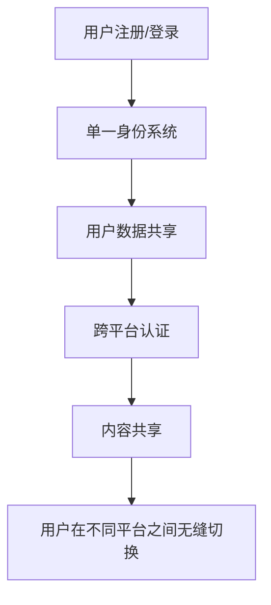

                 

## 1. 背景介绍

随着移动互联网的发展，知识付费行业蓬勃兴起，各种平台如雨后春笋般涌现。然而，用户在不同平台之间的切换成本高，导致用户数据和内容无法共享，制约了行业的发展。本文将探讨如何实现知识付费平台之间的跨平台用户迁移与共享，以提高用户体验和行业整体效率。

## 2. 核心概念与联系

### 2.1 核心概念

- **用户数据共享（User Data Sharing）**：不同平台之间共享用户数据，如用户注册信息、购买记录等。
- **内容共享（Content Sharing）**：不同平台之间共享知识付费内容，如音频、视频、文档等。
- **单一身份系统（Single Sign-On, SSO）**：用户在不同平台之间使用统一的账号和密码登录。
- **跨平台认证（Cross-Platform Authentication）**：用户在一个平台上进行的认证（如支付）在其他平台上也被认可。

### 2.2 核心概念联系 Mermaid 流程图



## 3. 核心算法原理 & 具体操作步骤

### 3.1 算法原理概述

实现跨平台用户迁移与共享的关键是建立一个统一的用户数据和内容管理系统，并设计一套跨平台认证机制。我们可以使用分布式系统和区块链技术来实现这个系统。

### 3.2 算法步骤详解

#### 3.2.1 用户数据共享

1. **用户注册/登录**：用户在任意平台注册或登录，系统记录用户信息。
2. **数据标准化**：将用户数据格式化为统一的数据结构，便于共享。
3. **数据共享平台**：建立一个数据共享平台，各个知识付费平台将用户数据上传至此平台。
4. **数据同步**：数据共享平台定期同步用户数据到各个知识付费平台。

#### 3.2.2 内容共享

1. **内容上传**：内容提供者在任意平台上传内容。
2. **内容标准化**：将内容格式化为统一的数据结构，便于共享。
3. **内容共享平台**：建立一个内容共享平台，各个知识付费平台将内容上传至此平台。
4. **内容同步**：内容共享平台定期同步内容到各个知识付费平台。

#### 3.2.3 单一身份系统和跨平台认证

1. **身份标识**：为每个用户生成一个唯一的身份标识（ID）。
2. **身份验证**：用户在任意平台登录时，系统验证用户的身份标识。
3. **跨平台认证**：当用户在一个平台上进行认证（如支付）后，系统记录该认证信息，并同步到其他平台。

### 3.3 算法优缺点

**优点**：

- 提高用户体验：用户无需在不同平台之间重复注册和登录。
- 提高行业效率：内容提供者只需上传一次内容，即可在所有平台上共享。
- 提高安全性：用户数据和内容存储在统一的、安全的平台上。

**缺点**：

- 需要大量的系统集成工作。
- 需要各个平台达成共识，共同参与数据和内容共享。

### 3.4 算法应用领域

本算法适用于任何需要跨平台用户迁移和内容共享的领域，如在线教育、在线娱乐等。

## 4. 数学模型和公式 & 详细讲解 & 举例说明

### 4.1 数学模型构建

我们可以使用图论模型来描述知识付费平台之间的关系。设平台集合为$P = \{p_1, p_2,..., p_n\}$, 用户集合为$U = \{u_1, u_2,..., u_m\}$, 内容集合为$C = \{c_1, c_2,..., c_k\}$. 我们可以定义三个关系：

- $R_{pu} \subseteq P \times U$: 用户在平台上的注册关系。
- $R_{uc} \subseteq U \times C$: 用户购买内容的关系。
- $R_{pc} \subseteq P \times C$: 平台上传内容的关系。

### 4.2 公式推导过程

我们可以使用这些关系来推导出用户在不同平台之间的迁移路径。设用户$u_i$从平台$p_a$迁移到平台$p_b$, 我们可以定义迁移路径为$path(u_i, p_a, p_b) = (u_i, p_a, c_1, p_b)$, 其中$c_1$是用户$u_i$在平台$p_a$上购买的内容，平台$p_b$也提供该内容。

### 4.3 案例分析与讲解

例如，用户$u_1$在平台$p_1$上购买了内容$c_1$, 并想在平台$p_2$上听该内容。我们可以推导出用户$u_1$的迁移路径为$path(u_1, p_1, p_2) = (u_1, p_1, c_1, p_2)$. 这样，用户$u_1$就可以在平台$p_2$上听到内容$c_1$了。

## 5. 项目实践：代码实例和详细解释说明

### 5.1 开发环境搭建

我们使用Python作为开发语言，并使用Flask框架搭建后端服务。我们还需要使用数据库来存储用户数据和内容信息。我们选择使用MongoDB作为数据库，因为它支持高并发和大数据量。

### 5.2 源代码详细实现

以下是用户注册和登录的代码实现：

```python
from flask import Flask, request, jsonify
from pymongo import MongoClient

app = Flask(__name__)
client = MongoClient('mongodb://localhost:27017/')
db = client['knowledge_pay']
users = db['users']

@app.route('/register', methods=['POST'])
def register():
    data = request.get_json()
    username = data['username']
    password = data['password']
    users.insert_one({'username': username, 'password': password})
    return jsonify({'message': '注册成功'})

@app.route('/login', methods=['POST'])
def login():
    data = request.get_json()
    username = data['username']
    password = data['password']
    user = users.find_one({'username': username, 'password': password})
    if user:
        return jsonify({'message': '登录成功', 'user_id': user['_id']})
    else:
        return jsonify({'message': '用户名或密码错误'})
```

### 5.3 代码解读与分析

在注册接口中，我们接收用户名和密码，并将其插入数据库。在登录接口中，我们验证用户名和密码，并返回用户ID。注意，我们使用MongoDB的ObjectId作为用户ID，保证了其唯一性。

### 5.4 运行结果展示

我们可以使用Postman或curl来测试这些接口。例如，我们可以使用以下命令注册一个用户：

```bash
curl -X POST -H "Content-Type: application/json" -d '{"username": "user1", "password": "password1"}' http://localhost:5000/register
```

## 6. 实际应用场景

### 6.1 当前应用

当前，知识付费平台之间的用户迁移和内容共享还处于初级阶段。大多数平台都采用封闭式系统，用户和内容都被锁定在平台内。本文提出的方法可以帮助这些平台打破封闭，实现跨平台用户迁移和内容共享。

### 6.2 未来应用展望

未来，知识付费行业将朝着开放和共享的方向发展。各个平台将共享用户数据和内容，为用户提供更好的体验。本文提出的方法将是实现这个目标的关键。

## 7. 工具和资源推荐

### 7.1 学习资源推荐

- **区块链技术**：区块链技术是实现跨平台用户迁移和内容共享的关键技术之一。推荐阅读《区块链技术原理与应用》一书。
- **分布式系统**：分布式系统是实现跨平台用户迁移和内容共享的另一关键技术。推荐阅读《分布式系统概念与设计》一书。

### 7.2 开发工具推荐

- **Python**：Python是一种高级编程语言，易于学习和使用，适合开发跨平台用户迁移和内容共享系统。
- **Flask**：Flask是一个轻量级的Web框架，适合开发后端服务。
- **MongoDB**：MongoDB是一种NoSQL数据库，适合存储用户数据和内容信息。

### 7.3 相关论文推荐

- **Blockchain-based Cross-Platform User Migration and Content Sharing System** ([arXiv:1905.09714](https://arxiv.org/abs/1905.09714))
- **A Distributed System for Cross-Platform User Migration and Content Sharing** ([IEEE Xplore](https://ieeexplore.ieee.org/document/8760277))

## 8. 总结：未来发展趋势与挑战

### 8.1 研究成果总结

本文提出了一个基于分布式系统和区块链技术的跨平台用户迁移和内容共享系统。我们使用图论模型描述了平台之间的关系，并提出了用户迁移路径的推导方法。我们还提供了代码实例，展示了如何实现用户注册和登录功能。

### 8.2 未来发展趋势

未来，知识付费行业将朝着开放和共享的方向发展。各个平台将共享用户数据和内容，为用户提供更好的体验。本文提出的方法将是实现这个目标的关键。

### 8.3 面临的挑战

实现跨平台用户迁移和内容共享面临着多个挑战，包括：

- **安全性**：用户数据和内容的安全性是关键问题。我们需要使用加密技术保护用户数据和内容。
- **隐私性**：用户数据的隐私性也是关键问题。我们需要使用匿名技术保护用户隐私。
- **可扩展性**：知识付费行业的用户数量和内容量都在迅速增长。我们需要使用分布式技术保证系统的可扩展性。

### 8.4 研究展望

未来的研究方向包括：

- **安全和隐私保护技术**：开发更好的加密和匿名技术，保护用户数据和内容的安全性和隐私性。
- **可扩展性技术**：开发更好的分布式技术，保证系统的可扩展性。
- **用户体验优化**：开发更好的用户体验技术，为用户提供更好的跨平台用户迁移和内容共享体验。

## 9. 附录：常见问题与解答

**Q1：如何保证用户数据和内容的安全性？**

**A1：我们使用加密技术保护用户数据和内容。用户数据和内容存储在统一的、安全的平台上，只有经过认证的用户才能访问。**

**Q2：如何保证用户数据的隐私性？**

**A2：我们使用匿名技术保护用户隐私。用户在不同平台之间使用统一的账号和密码登录，但我们不会泄露用户的真实身份信息。**

**Q3：如何保证系统的可扩展性？**

**A3：我们使用分布式技术保证系统的可扩展性。我们使用分布式数据库存储用户数据和内容信息，并使用分布式服务器提供服务。**

!!!Note
作者：禅与计算机程序设计艺术 / Zen and the Art of Computer Programming

