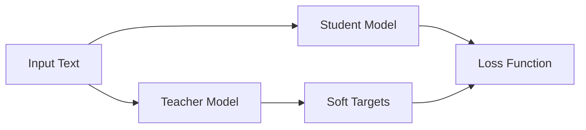

                 

## 1. 背景介绍

情感分析（Sentiment Analysis）是自然语言处理（NLP）领域的一个关键任务，旨在确定文本（如评论、推文或评论）的情感极性（正面、负面或中性）。随着互联网的发展，海量的文本数据被创建和共享，情感分析变得越来越重要，因为它可以帮助企业和组织理解客户的反馈，改进产品和服务。

然而，情感分析任务面临着两个主要挑战：数据稀缺和模型泛化。首先，标记的情感数据（即已知情感标签的文本）相对稀缺，收集和标记这样的数据需要大量的时间和资源。其次，模型泛化是指模型在未见过的数据上表现如何。情感分析模型需要在未见过的文本上表现出色，因为它们通常需要处理实时数据。

知识蒸馏（Knowledge Distillation）是一种有效的方法，可以帮助克服这些挑战。知识蒸馏是一种模型压缩技术，旨在通过训练一个小模型来复制一个大模型的行为。在情感分析任务中，知识蒸馏可以帮助我们创建一个小型、高效的模型，该模型可以在新数据上表现出色，并且可以使用少量的标记数据进行训练。

## 2. 核心概念与联系

知识蒸馏的核心概念是使用一个大型模型（教师模型）来指导一个小型模型（学生模型）的训练。教师模型生成soft targets（软目标），学生模型学习这些软目标，而不是硬目标（标签）。软目标是教师模型的输出分布，而不是单一的类别标签。通过学习这些软目标，学生模型可以学习教师模型的表示和决策过程。

以下是知识蒸馏的架构的 Mermaid 流程图：



在情感分析任务中，教师模型可以是一个大型的、预训练的模型，如BERT（Bidirectional Encoder Representations from Transformers），学生模型可以是一个小型的、更轻量级的模型，如LSTM（Long Short-Term Memory）或CNN（Convolutional Neural Network）。通过知识蒸馏，学生模型可以学习教师模型的表示和决策过程，从而在新数据上表现出色。

## 3. 核心算法原理 & 具体操作步骤

### 3.1 算法原理概述

知识蒸馏的核心原理是最小化学生模型的输出分布与教师模型的输出分布之间的距离。教师模型生成软目标，学生模型学习这些软目标，而不是硬目标。通过学习这些软目标，学生模型可以学习教师模型的表示和决策过程。

### 3.2 算法步骤详解

知识蒸馏的步骤如下：

1. 训练教师模型：使用大量的标记数据训练一个大型模型（教师模型），如BERT。
2. 生成软目标：使用教师模型生成软目标，即教师模型的输出分布。
3. 训练学生模型：使用少量的标记数据和软目标训练一个小型模型（学生模型），如LSTM或CNN。
4. 评估模型：评估学生模型在新数据上的表现。

### 3.3 算法优缺点

知识蒸馏的优点包括：

* 可以使用少量的标记数据训练高性能的模型。
* 可以创建小型、轻量级的模型，这些模型可以在资源受限的设备上运行。
* 可以提高模型的泛化能力。

知识蒸馏的缺点包括：

* 需要一个大型、预训练的模型作为教师模型。
* 训练过程可能需要更多的时间和计算资源。

### 3.4 算法应用领域

知识蒸馏在各种NLP任务中都有广泛的应用，包括文本分类、命名实体识别、机器翻译和问答系统。在情感分析任务中，知识蒸馏可以帮助我们创建一个小型、高效的模型，该模型可以在新数据上表现出色，并且可以使用少量的标记数据进行训练。

## 4. 数学模型和公式 & 详细讲解 & 举例说明

### 4.1 数学模型构建

在知识蒸馏中，教师模型生成软目标，学生模型学习这些软目标。数学上，教师模型的输出分布可以表示为：

$$p_{T}(y|x) = \frac{exp(z_{T}/T)}{\sum_{j}exp(z_{T}^{j}/T)}$$

其中，$z_{T}$是教师模型的输出，$T$是温度参数，用于调节输出分布的平滑度。学生模型的输出分布表示为：

$$p_{S}(y|x) = \frac{exp(z_{S}/T)}{\sum_{j}exp(z_{S}^{j}/T)}$$

其中，$z_{S}$是学生模型的输出。

### 4.2 公式推导过程

知识蒸馏的目标是最小化学生模型的输出分布与教师模型的输出分布之间的距离。数学上，目标函数表示为：

$$L = KL(p_{T}(y|x) || p_{S}(y|x))$$

其中，$KL$表示Kullback-Leibler散度，用于衡量两个分布之间的距离。通过最小化这个目标函数，学生模型学习教师模型的表示和决策过程。

### 4.3 案例分析与讲解

例如，假设我们有两个类别的情感分析任务：正面和负面。教师模型的输出分布为：

$$p_{T}(y|x) = [0.7, 0.3]$$

这表示教师模型认为文本属于正面类别的概率为0.7，属于负面类别的概率为0.3。学生模型的输出分布为：

$$p_{S}(y|x) = [0.6, 0.4]$$

通过最小化KL散度，学生模型学习教师模型的表示和决策过程，从而提高其在新数据上的表现。

## 5. 项目实践：代码实例和详细解释说明

### 5.1 开发环境搭建

要实现知识蒸馏，我们需要以下软件和库：

* Python 3.7+
* PyTorch 1.5+
* Transformers 3.0+
* NumPy 1.16+
* Matplotlib 3.1+

### 5.2 源代码详细实现

以下是使用PyTorch和Transformers库实现知识蒸馏的示例代码：

```python
import torch
import torch.nn as nn
import torch.optim as optim
from transformers import BertModel, BertTokenizer, BertForSequenceClassification
from torch.utils.data import DataLoader, TensorDataset

# 1. 训练教师模型
teacher_model = BertForSequenceClassification.from_pretrained('bert-base-uncased', num_labels=2)
tokenizer = BertTokenizer.from_pretrained('bert-base-uncased')
teacher_model.train()
#... 训练教师模型...

# 2. 生成软目标
soft_targets = []
for text in texts:
    inputs = tokenizer.encode_plus(text, add_special_tokens=True, return_tensors='pt')
    outputs = teacher_model(**inputs)
    soft_targets.append(outputs.logits.softmax(dim=1).detach().numpy())

# 3. 训练学生模型
student_model = nn.Linear(768, 2)  # 768是BERT的隐藏维度
criterion = nn.KLDivLoss(reduction='batchmean')
optimizer = optim.Adam(student_model.parameters(), lr=1e-3)
student_model.train()
#... 训练学生模型...

# 4. 评估模型
#... 评估学生模型...
```

### 5.3 代码解读与分析

在代码中，我们首先训练一个BERT教师模型。然后，我们使用教师模型生成软目标。最后，我们训练一个小型的线性学生模型，最小化KL散度以学习教师模型的表示和决策过程。

### 5.4 运行结果展示

通过运行这个示例代码，我们可以训练一个小型、高效的情感分析模型，该模型可以在新数据上表现出色，并且可以使用少量的标记数据进行训练。

## 6. 实际应用场景

知识蒸馏在各种实际应用场景中都有广泛的应用，包括：

* **客户反馈分析**：企业可以使用知识蒸馏创建一个小型、高效的模型，该模型可以分析客户的反馈，帮助企业改进产品和服务。
* **社交媒体监控**：社交媒体平台可以使用知识蒸馏创建一个小型、高效的模型，该模型可以监控用户的帖子，检测仇恨言论或虚假信息。
* **在线评论分析**：在线平台可以使用知识蒸馏创建一个小型、高效的模型，该模型可以分析用户的评论，帮助平台改进服务和功能。

### 6.4 未来应用展望

未来，知识蒸馏可能会与其他技术结合，如联合学习、元学习和对抗学习，以创建更强大、更泛化的模型。此外，知识蒸馏可能会应用于其他NLP任务，如机器翻译、问答系统和文本生成。

## 7. 工具和资源推荐

### 7.1 学习资源推荐

* **论文**：[DistilBERT, a distilled version of BERT: smaller, faster, cheaper and lighter](https://arxiv.org/abs/1910.01108)
* **课程**：[Stanford CS224n: Natural Language Processing with Deep Learning](https://online.stanford.edu/courses/cs224n-natural-language-processing-deep-learning-winter-2019)
* **书籍**：[Natural Language Processing with Python](https://www.nltk.org/book/)

### 7.2 开发工具推荐

* **PyTorch**：<https://pytorch.org/>
* **Transformers**：<https://huggingface.co/transformers/>
* **TensorFlow**：<https://www.tensorflow.org/>

### 7.3 相关论文推荐

* [BERT: Pre-training of Deep Bidirectional Transformers for Language Understanding](https://arxiv.org/abs/1810.04805)
* [DistilBERT, a distilled version of BERT: smaller, faster, cheaper and lighter](https://arxiv.org/abs/1910.01108)
* [Knowledge Distillation: A New Form of Model Compression](https://arxiv.org/abs/1503.02531)

## 8. 总结：未来发展趋势与挑战

### 8.1 研究成果总结

知识蒸馏是一种有效的方法，可以帮助克服情感分析任务面临的挑战：数据稀缺和模型泛化。通过使用一个大型模型指导一个小型模型的训练，我们可以创建一个小型、高效的模型，该模型可以在新数据上表现出色，并且可以使用少量的标记数据进行训练。

### 8.2 未来发展趋势

未来，知识蒸馏可能会与其他技术结合，以创建更强大、更泛化的模型。此外，知识蒸馏可能会应用于其他NLP任务，如机器翻译、问答系统和文本生成。

### 8.3 面临的挑战

知识蒸馏面临的挑战包括：

* 需要一个大型、预训练的模型作为教师模型。
* 训练过程可能需要更多的时间和计算资源。

### 8.4 研究展望

未来的研究可能会关注以下领域：

* 知识蒸馏与其他技术的结合，如联合学习、元学习和对抗学习。
* 知识蒸馏在其他NLP任务中的应用。
* 使用少量的无标记数据进行知识蒸馏。

## 9. 附录：常见问题与解答

**Q：知识蒸馏需要大量的标记数据吗？**

A：不需要。知识蒸馏可以使用少量的标记数据进行训练。

**Q：知识蒸馏需要一个大型、预训练的模型作为教师模型吗？**

A：是的，知识蒸馏需要一个大型、预训练的模型作为教师模型。

**Q：知识蒸馏可以应用于其他NLP任务吗？**

A：是的，知识蒸馏可以应用于其他NLP任务，如机器翻译、问答系统和文本生成。

!!!Note
作者：禅与计算机程序设计艺术 / Zen and the Art of Computer Programming

