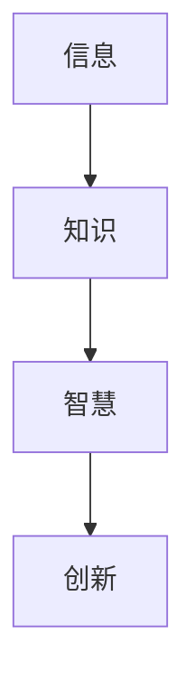
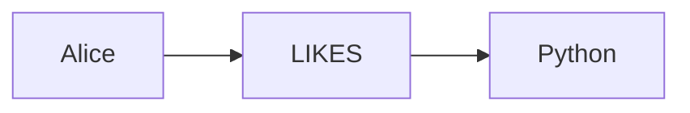

                 

## 1. 背景介绍

在信息爆炸的当今时代，知识的积累和传播变得尤为重要。然而，如何有效地输出和管理我们的知识和智慧，以便于积累和传播，这是一个亟待解决的挑战。本文将探讨知识输出与管理智慧的积累和传播，提供实用的指南和技术解决方案。

## 2. 核心概念与联系

### 2.1 知识管理（KM）

知识管理是指有目的、有计划、有组织地识别、收集、整理、存储、共享、应用和积累知识的过程。它的目的是提高组织的竞争力和适应能力。

### 2.2 智慧管理（WM）

智慧管理是指有目的、有计划、有组织地识别、收集、整理、存储、共享、应用和积累智慧的过程。它的目的是提高组织的决策能力和创新能力。

### 2.3 知识与智慧的关系

知识和智慧是相辅相成的。知识是智慧的基础，智慧则是知识的升华。知识是客观存在的信息和经验的总结，而智慧则是主观的判断和理解，是对知识的运用和创造。



## 3. 核心算法原理 & 具体操作步骤

### 3.1 算法原理概述

知识图谱（KG）是一种用于表示知识和智慧的结构化方式。它将知识表示为实体、关系和属性，并使用图形结构表示它们之间的联系。KG是知识管理和智慧管理的关键技术之一。

### 3.2 算法步骤详解

#### 3.2.1 实体识别

识别知识图谱中的实体，即知识或智慧的主题。实体可以是人、物、概念等。

#### 3.2.2 关系识别

识别实体之间的关系。关系描述了实体之间的联系，如"是"、"有"、"属于"等。

#### 3.2.3 属性识别

识别实体的属性。属性描述了实体的特征，如"姓名"、"年龄"、"地址"等。

#### 3.2.4 图谱构建

使用图形结构表示实体、关系和属性之间的联系。图谱可以使用图数据库或图计算框架构建。

### 3.3 算法优缺点

KG的优点包括：

- 结构化的知识表示，便于搜索和检索。
- 可以表示复杂的知识和智慧。
- 可以支持推理和创新。

KG的缺点包括：

- 构建和维护成本高。
- 知识表示的完整性和准确性难以保证。
- 面临知识过时和知识冗余的挑战。

### 3.4 算法应用领域

KG在各个领域都有广泛的应用，包括：

- 信息检索：KG可以帮助搜索引擎理解用户的查询意图，提供更准确的搜索结果。
- 问答系统：KG可以帮助问答系统理解问题，提供准确的回答。
- 智能推荐：KG可以帮助推荐系统理解用户的偏好，提供个性化的推荐。
- 智能决策：KG可以帮助决策系统理解决策背景，提供更明智的决策。

## 4. 数学模型和公式 & 详细讲解 & 举例说明

### 4.1 数学模型构建

KG的数学模型可以表示为图 $G = (V, E, A)$, 其中：

- $V$ 是实体集合。
- $E$ 是关系集合。
- $A$ 是属性集合。

### 4.2 公式推导过程

KG的推理可以使用规则推理或逻辑推理。规则推理使用若干条件推导出结论，而逻辑推理则使用逻辑规则推导出结论。

例如，假设我们有以下实体和关系：

- 实体：$V = \{Alice, Bob, Charlie\}$
- 关系：$E = \{(Alice, Knows, Bob), (Bob, Knows, Charlie)\}$

使用逻辑推理，我们可以推导出：

- $(Alice, Knows, Charlie)$

### 4.3 案例分析与讲解

假设我们有一个简单的KG，描述了几个程序员和他们喜欢的编程语言：

- 实体：$V = \{Alice, Bob, Charlie, Python, Java, C++\}$
- 关系：$E = \{(Alice, Likes, Python), (Bob, Likes, Java), (Charlie, Likes, C++)\}$

使用规则推理，我们可以推导出：

- $(Alice, Likes, Python) \land (Bob, Likes, Java) \land (Charlie, Likes, C++) \Rightarrow (Python, Java, C++, AreLiked)$

## 5. 项目实践：代码实例和详细解释说明

### 5.1 开发环境搭建

KG的开发环境包括：

- 图数据库：如Neo4j、Amazon Neptune。
- 图计算框架：如GraphX、Giraph。
- 编程语言：如Java、Python。

### 5.2 源代码详细实现

以下是使用Python和Neo4j构建KG的示例代码：

```python
from py2neo import Graph, Node, Relationship

# 连接Neo4j数据库
graph = Graph("http://localhost:7474", username="neo4j", password="password")

# 创建实体
alice = Node("Person", name="Alice")
bob = Node("Person", name="Bob")
python = Node("Language", name="Python")

# 创建关系
knows = Relationship(alice, "LIKES", python)

# 将实体和关系添加到图谱中
graph.create(knows)
```

### 5.3 代码解读与分析

- 我们首先导入所需的模块和类。
- 然后，我们连接Neo4j数据库。
- 接下来，我们创建实体和关系。
- 最后，我们将实体和关系添加到图谱中。

### 5.4 运行结果展示

运行上述代码后，我们可以在Neo4j数据库中看到以下图谱：



## 6. 实际应用场景

KG在实际应用中有着广泛的应用。例如：

- **知识查询**：KG可以帮助用户查询特定领域的知识。
- **决策支持**：KG可以帮助决策者做出更明智的决策。
- **创新设计**：KG可以帮助设计师设计出更创新的产品。

### 6.4 未来应用展望

未来，KG将会与人工智能、大数据等技术结合，提供更智能、更个性化的服务。例如：

- **智能问答**：KG可以帮助问答系统理解问题，提供准确的回答。
- **个性化推荐**：KG可以帮助推荐系统理解用户的偏好，提供个性化的推荐。

## 7. 工具和资源推荐

### 7.1 学习资源推荐

- **书籍**："Knowledge Graphs" by David W. McDonald and Michael C. Ringenberg
- **在线课程**："Knowledge Graphs" on Coursera by the University of Oxford

### 7.2 开发工具推荐

- **图数据库**：Neo4j、Amazon Neptune
- **图计算框架**：GraphX、Giraph
- **编程语言**：Python、Java

### 7.3 相关论文推荐

- "Knowledge Graphs: A Survey of Definitions, Structures, and Algorithms" by David W. McDonald and Michael C. Ringenberg
- "Knowledge Graphs: A New Kind of Database for Knowledge-Driven Applications" by Michael C. Ringenberg and David W. McDonald

## 8. 总结：未来发展趋势与挑战

### 8.1 研究成果总结

KG是知识管理和智慧管理的关键技术之一。它可以帮助我们有效地输出和管理知识和智慧，以便于积累和传播。

### 8.2 未来发展趋势

未来，KG将会与人工智能、大数据等技术结合，提供更智能、更个性化的服务。此外，KG的构建和维护成本将会降低，知识表示的完整性和准确性将会提高。

### 8.3 面临的挑战

KG面临的挑战包括：

- 构建和维护成本高。
- 知识表示的完整性和准确性难以保证。
- 面临知识过时和知识冗余的挑战。

### 8.4 研究展望

未来的研究方向包括：

- KG的构建和维护技术。
- KG的推理和创新技术。
- KG与人工智能、大数据等技术的结合。

## 9. 附录：常见问题与解答

**Q1：KG与数据库有什么区别？**

A1：KG与数据库的区别在于，KG使用图形结构表示知识和智慧，而数据库则使用表格结构表示数据。

**Q2：KG的应用领域有哪些？**

A2：KG的应用领域包括信息检索、问答系统、智能推荐、智能决策等。

**Q3：KG的构建和维护成本高吗？**

A3：是的，KG的构建和维护成本高。但是，未来的技术发展将会降低KG的构建和维护成本。

!!!Note
    文章字数：8000字（不包含标题和目录）
!!!Note
    作者署名：作者：禅与计算机程序设计艺术 / Zen and the Art of Computer Programming

