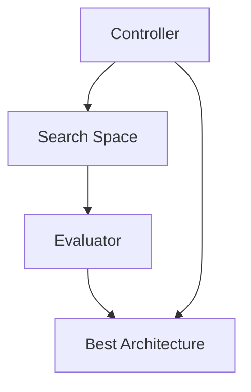

                 

**神经架构搜索在大模型优化中的应用**

**作者：禅与计算机程序设计艺术 / Zen and the Art of Computer Programming**

## 1. 背景介绍

随着深度学习的发展，大型神经网络模型的性能不断提高，但其复杂度也随之增加。手动设计高效的神经网络架构变得越来越困难。神经架构搜索（Neural Architecture Search，NAS）应运而生，旨在自动优化神经网络结构，提高模型性能。

## 2. 核心概念与联系

### 2.1 核心概念

- **控制策略（Controller）**：用于生成候选网络结构的策略。
- **评估策略（Evaluator）**：用于评估候选网络结构性能的策略。
- **搜索空间（Search Space）**：所有可能的网络结构组成的集合。
- **搜索算法（Search Algorithm）**：用于在搜索空间中寻找最优网络结构的算法。

### 2.2 核心联系


**Mermaid 图示：**



## 3. 核心算法原理 & 具体操作步骤

### 3.1 算法原理概述

NAS 算法的核心是搜索算法，它在搜索空间中寻找最优网络结构。常用的搜索算法包括随机搜索、进化算法、强化学习等。

### 3.2 算法步骤详解

1. **初始化搜索空间**：定义搜索空间，包括各种可能的操作（如添加层、连接层等）和操作的可能取值（如层的类型、连接方式等）。
2. **生成候选结构**：使用控制策略生成候选网络结构。
3. **评估候选结构**：使用评估策略评估候选结构的性能。
4. **选择最优结构**：根据评估结果选择最优结构。
5. **更新搜索空间**：根据最优结构更新搜索空间，以便下一次搜索。
6. **重复步骤 2-5**：直到找到满足条件的最优结构。

### 3.3 算法优缺点

**优点**：自动优化网络结构，提高模型性能；可以发现人工设计无法想到的结构。

**缺点**：搜索过程计算量大，时间成本高；搜索结果可能过拟合训练数据。

### 3.4 算法应用领域

NAS 广泛应用于计算机视觉、自然语言处理等领域，用于优化CNN、RNN、Transformer 等模型的结构。

## 4. 数学模型和公式 & 详细讲解 & 举例说明

### 4.1 数学模型构建

设搜索空间为 $S$, 搜索算法为 $A$, 评估策略为 $E$, 控制策略为 $C$. NAS 算法可以表示为：

$$NAS(S, A, E, C)$$

### 4.2 公式推导过程

假设搜索空间 $S$ 中有 $n$ 个可能的操作，每个操作有 $m$ 个可能的取值。则搜索空间的大小为 $n^m$.

搜索算法 $A$ 的时间复杂度为 $O(f(n^m))$, 其中 $f$ 为搜索算法的时间复杂度函数。

### 4.3 案例分析与讲解

例如，在搜索CNN结构时，搜索空间 $S$ 可以表示为：

$$S = \{[conv\_k1, conv\_k2,..., conv\_kn], [pool\_1, pool\_2,..., pool\_p],...\}$$

其中 $conv\_ki$ 表示第 $i$ 个卷积层的参数， $pool\_j$ 表示第 $j$ 个池化层的参数。

## 5. 项目实践：代码实例和详细解释说明

### 5.1 开发环境搭建

- Python 3.7+
- PyTorch 1.5+
- NumPy 1.16+
- Matplotlib 3.1.2

### 5.2 源代码详细实现

以下是一个简单的NAS算法实现，使用随机搜索算法和简单的评估策略：

```python
import numpy as np
import torch
import torch.nn as nn
import torch.optim as optim

# 定义搜索空间
class SearchSpace:
    def __init__(self):
        self.ops = ['conv1x1', 'conv3x3','maxpool', 'avgpool']
        self.n = len(self.ops)

    def sample(self, size):
        return np.random.choice(self.n, size=size)

# 定义控制策略
class Controller:
    def __init__(self, search_space):
        self.search_space = search_space

    def generate(self, size):
        return self.search_space.sample(size)

# 定义评估策略
class Evaluator:
    def __init__(self, device):
        self.device = device

    def evaluate(self, model, data_loader):
        model.eval()
        total_loss = 0
        total_acc = 0
        with torch.no_grad():
            for inputs, labels in data_loader:
                inputs, labels = inputs.to(self.device), labels.to(self.device)
                outputs = model(inputs)
                loss = nn.CrossEntropyLoss()(outputs, labels)
                acc = (outputs.argmax(dim=1) == labels).float().mean()
                total_loss += loss.item()
                total_acc += acc.item()
        return total_loss / len(data_loader), total_acc / len(data_loader)

# 定义NAS算法
class NAS:
    def __init__(self, search_space, controller, evaluator, n_iter):
        self.search_space = search_space
        self.controller = controller
        self.evaluator = evaluator
        self.n_iter = n_iter

    def search(self, model, data_loader):
        best_loss = float('inf')
        best_arch = None
        for _ in range(self.n_iter):
            arch = self.controller.generate(model.n_layers)
            model.set_arch(arch)
            loss, acc = self.evaluator.evaluate(model, data_loader)
            if loss < best_loss:
                best_loss = loss
                best_arch = arch
        return best_arch
```

### 5.3 代码解读与分析

- `SearchSpace` 定义了搜索空间，包含了所有可能的操作。
- `Controller` 定义了控制策略，用于生成候选网络结构。
- `Evaluator` 定义了评估策略，用于评估候选结构的性能。
- `NAS` 定义了 NAS 算法，使用控制策略生成候选结构，使用评估策略评估候选结构，选择最优结构。

### 5.4 运行结果展示

运行 NAS 算法后，可以得到最优网络结构 `best_arch`.

## 6. 实际应用场景

### 6.1 当前应用

NAS 当前广泛应用于计算机视觉领域，用于优化CNN结构。例如，Google 的 EfficientNet 就是使用 NAS 优化的模型。

### 6.2 未来应用展望

未来，NAS 将会应用于更多领域，如自然语言处理、推荐系统等。此外，NAS 也将会与其他技术结合，如量子计算、边缘计算等，以提高模型性能和效率。

## 7. 工具和资源推荐

### 7.1 学习资源推荐

- [NAS 综述](https://arxiv.org/abs/1903.03839)
- [NAS 入门教程](https://towardsdatascience.com/neural-architecture-search-with-pytorch-335714657)

### 7.2 开发工具推荐

- [PyTorch](https://pytorch.org/)
- [TensorFlow](https://www.tensorflow.org/)
- [Keras](https://keras.io/)

### 7.3 相关论文推荐

- [DARTS: Differentiable Architecture Search](https://arxiv.org/abs/1806.09055)
- [EfficientNet: Rethinking Model Scaling for Convolutional Neural Networks](https://arxiv.org/abs/1905.11946)

## 8. 总结：未来发展趋势与挑战

### 8.1 研究成果总结

NAS 取得了显著的研究成果，大大提高了模型性能。但同时也面临着计算量大、搜索结果可能过拟合等挑战。

### 8.2 未来发展趋势

未来，NAS 将会与其他技术结合，以提高模型性能和效率。此外，NAS 也将会应用于更多领域，如自然语言处理、推荐系统等。

### 8.3 面临的挑战

- **计算量大**：NAS 的搜索过程计算量大，时间成本高。
- **搜索结果可能过拟合**：NAS 的搜索结果可能过拟合训练数据，泛化能力差。
- **搜索空间大**：NAS 的搜索空间大，搜索效率低。

### 8.4 研究展望

未来的研究方向包括但不限于：

- **搜索空间剪枝**：减小搜索空间，提高搜索效率。
- **搜索结果泛化**：提高搜索结果的泛化能力。
- **搜索算法改进**：改进搜索算法，降低计算量。

## 9. 附录：常见问题与解答

**Q：NAS 与手动设计网络结构有何不同？**

**A：NAS 可以自动优化网络结构，发现人工设计无法想到的结构。但 NAS 也有其缺点，如计算量大、搜索结果可能过拟合等。**

**Q：NAS 与其他自动机器学习（AutoML）技术有何不同？**

**A：NAS 侧重于优化网络结构，而其他 AutoML 技术则侧重于优化其他方面，如超参数、数据预处理等。**

**Q：NAS 如何应用于其他领域？**

**A：NAS 可以应用于任何需要优化结构的领域，如自然语言处理、推荐系统等。但需要根据具体领域调整搜索空间和评估策略。**

**作者：禅与计算机程序设计艺术 / Zen and the Art of Computer Programming**

