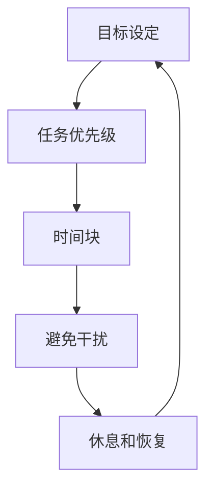

                 

## 1. 背景介绍

在当今快节奏的软件开发世界中，程序员面临着巨大的压力，需要在有限的时间内完成大量的工作。时间管理对程序员来说至关重要，因为它直接关系到开发效率和工作质量。本文将深入探讨程序员时间管理的核心概念、算法、数学模型，并提供实践项目和工具推荐，帮助程序员提高时间管理效率，从而提高开发效率和工作质量。

## 2. 核心概念与联系

### 2.1 时间管理的定义

时间管理是指有效地规划、组织和控制时间，以实现个人和组织的目标。对程序员来说，有效的时间管理可以提高开发效率，减少工作压力，改善工作质量。

### 2.2 时间管理的关键因素

时间管理的关键因素包括：

* 目标设定：清晰明确的目标是时间管理的基础。
* 任务优先级：根据任务的重要性和紧迫性设定优先级。
* 时间块：将时间分成可管理的块，集中精力完成任务。
* 避免干扰：减少无关干扰，提高专注度。
* 休息和恢复：合理安排休息时间，保持精力和动力。

### 2.3 时间管理的架构

以下是程序员时间管理的架构图，展示了各个关键因素的关系：



## 3. 核心算法原理 & 具体操作步骤

### 3.1 算法原理概述

时间管理算法的核心原理是基于目标、优先级和时间块的任务调度。以下是时间管理算法的原理概述：

* 将所有任务输入到任务池中。
* 根据任务的重要性和紧迫性设定优先级。
* 将时间分成可管理的块，集中精力完成任务。
* 根据任务优先级和时间块调度任务。
* 定期评估和调整任务优先级和时间块。

### 3.2 算法步骤详解

以下是时间管理算法的具体操作步骤：

1. **任务收集**：收集所有需要完成的任务，并将其添加到任务池中。
2. **目标设定**：根据个人和组织的目标，为每个任务设定清晰明确的目标。
3. **任务优先级设定**：根据任务的重要性和紧迫性设定优先级。常用的优先级设定方法包括Eisenhower 矩阵和MoSCoW方法。
4. **时间块设定**：将时间分成可管理的块，集中精力完成任务。时间块的长度可以根据任务的复杂度和个人的注意力持续时间进行调整。
5. **任务调度**：根据任务优先级和时间块调度任务。可以使用各种任务管理工具，如Trello、Asana或Notion，来帮助跟踪任务进度。
6. **评估和调整**：定期评估任务优先级和时间块，并根据需要进行调整。可以每周或每月进行一次评估，以确保时间管理算法保持有效。

### 3.3 算法优缺点

时间管理算法的优点包括：

* 提高开发效率：有效的时间管理可以帮助程序员集中精力，提高开发效率。
* 减少压力：合理安排任务和时间块可以减少工作压力。
* 提高工作质量：集中精力和有效的时间管理可以提高工作质量。

时间管理算法的缺点包括：

* 需要自律：时间管理算法需要程序员自律和纪律，否则很容易偏离计划。
* 需要定期调整：时间管理算法需要定期评估和调整，否则很容易变得无效。

### 3.4 算法应用领域

时间管理算法在软件开发领域有着广泛的应用，包括：

* 项目管理：时间管理算法可以帮助项目经理规划和调度项目任务，提高项目进度和质量。
* 个人开发：时间管理算法可以帮助程序员提高个人开发效率，减少工作压力。
* 团队协作：时间管理算法可以帮助团队成员协调任务，提高团队开发效率。

## 4. 数学模型和公式 & 详细讲解 & 举例说明

### 4.1 数学模型构建

时间管理的数学模型可以表示为以下公式：

$$T = \sum_{i=1}^{n} t_i + \sum_{j=1}^{m} b_j$$

其中，$T$表示总时间，$t_i$表示第$i$个任务的时间，$b_j$表示第$j$个时间块的时间，$n$表示任务数，$m$表示时间块数。

### 4.2 公式推导过程

时间管理模型的推导过程如下：

* 将所有任务的时间相加，得到总任务时间：$\sum_{i=1}^{n} t_i$
* 将所有时间块的时间相加，得到总时间块时间：$\sum_{j=1}^{m} b_j$
* 将总任务时间和总时间块时间相加，得到总时间：$T = \sum_{i=1}^{n} t_i + \sum_{j=1}^{m} b_j$

### 4.3 案例分析与讲解

例如，假设程序员需要完成以下任务：

* 任务1：编写新功能，预计需要4小时。
* 任务2：调试bug，预计需要2小时。
* 任务3：撰写文档，预计需要3小时。

程序员计划每天工作8小时，每周工作5天。根据时间管理模型，程序员需要的总时间为：

$$T = (4 + 2 + 3) + (8 \times 5) = 19 + 40 = 59 \text{ 小时}$$

程序员需要59小时来完成所有任务。根据任务优先级和时间块，程序员可以安排任务和时间块，以在59小时内完成所有任务。

## 5. 项目实践：代码实例和详细解释说明

### 5.1 开发环境搭建

为了实践时间管理算法，我们将使用Python和Trello API来创建一个简单的任务管理系统。首先，我们需要安装Python和Trello API的Python库：

```bash
pip install python-dotenv trello
```

### 5.2 源代码详细实现

以下是时间管理任务管理系统的源代码实现：

```python
import os
import trello
from dotenv import load_dotenv

# 加载环境变量
load_dotenv()

# 设置Trello API密钥
KEY = os.getenv("TRELLO_API_KEY")
TOKEN = os.getenv("TRELLO_API_TOKEN")

# 初始化Trello客户端
trello_client = trello.TrelloClient(key=KEY, token=TOKEN)

# 创建新任务
def create_task(task_name, task_description, due_date):
    # 创建新卡片
    new_card = trello_client.add_card(
        name=task_name,
        desc=task_description,
        due=due_date,
        pos="top",
        idList="5e88895c2e9b983f378a4767"  # 任务列表的ID
    )
    print(f"任务'{task_name}'已创建。")

# 获取所有任务
def get_tasks():
    # 获取任务列表
    task_list = trello_client.get_list("5e88895c2e9b983f378a4767")
    # 获取所有卡片（任务）
    cards = task_list.get_cards()
    for card in cards:
        print(f"{card.name} - {card.desc} - 到期时间：{card.due}")

# 更新任务优先级
def update_task_priority(task_id, pos):
    # 更新任务位置（优先级）
    trello_client.update_card(task_id, pos=pos)
    print(f"任务'{task_id}'优先级已更新。")

# 示例用法
create_task("编写新功能", "实现新功能的代码", "2023-03-15")
create_task("调试bug", "修复bug", "2023-03-16")
get_tasks()
update_task_priority("5e88895c2e9b983f378a4768", "top")
```

### 5.3 代码解读与分析

在代码中，我们首先加载环境变量，并初始化Trello客户端。然后，我们定义了三个函数：

* `create_task()`：创建新任务，并将其添加到任务列表中。
* `get_tasks()`：获取所有任务，并打印任务名称、描述和到期时间。
* `update_task_priority()`：更新任务优先级，通过更新任务位置来实现。

在示例用法中，我们创建了两个任务，获取了所有任务，并更新了其中一个任务的优先级。

### 5.4 运行结果展示

运行代码后，我们可以在Trello任务列表中看到新创建的任务。更新任务优先级后，任务的位置会发生变化，从而反映出任务的优先级。

## 6. 实际应用场景

时间管理算法在软件开发领域有着广泛的应用，以下是一些实际应用场景：

* **项目管理**：项目经理可以使用时间管理算法来规划和调度项目任务，提高项目进度和质量。
* **个人开发**：程序员可以使用时间管理算法来提高个人开发效率，减少工作压力。
* **团队协作**：团队成员可以使用时间管理算法来协调任务，提高团队开发效率。

### 6.1 项目管理

在项目管理中，项目经理需要规划和调度项目任务，以在有限的时间内完成项目。时间管理算法可以帮助项目经理设定任务优先级，安排时间块，并跟踪任务进度。例如，项目经理可以使用Eisenhower矩阵来设定任务优先级，并使用时间块来安排任务。

### 6.2 个人开发

在个人开发中，程序员需要在有限的时间内完成任务。时间管理算法可以帮助程序员设定任务优先级，安排时间块，并避免无关干扰。例如，程序员可以使用Pomodoro技术来安排时间块，并使用番茄工作法来避免无关干扰。

### 6.3 团队协作

在团队协作中，团队成员需要协调任务，以在有限的时间内完成项目。时间管理算法可以帮助团队成员设定任务优先级，安排时间块，并跟踪任务进度。例如，团队成员可以使用Kanban方法来协调任务，并使用Scrum方法来安排时间块。

### 6.4 未来应用展望

未来，时间管理算法将继续发展，以适应软件开发领域的新挑战。例如，人工智能和机器学习技术可以帮助程序员自动设定任务优先级和安排时间块。此外，物联网和边缘计算技术将需要程序员在更短的时间内完成更多的任务，从而对时间管理提出新的挑战。

## 7. 工具和资源推荐

### 7.1 学习资源推荐

以下是一些时间管理学习资源推荐：

* 书籍：
	+ "Getting Things Done: The Art of Stress-Free Productivity" by David Allen
	+ "The 4-Hour Workweek: Escape 9-5, Live Anywhere, and Join the New Rich" by Timothy Ferriss
	+ "Deep Work: Rules for Focused Success in a Distracted World" by Cal Newport
* 网站：
	+ [Productivity Game](https://productivitygame.com/)
	+ [Lifehacker](https://lifehacker.com/)
	+ [Productivityist](https://productivityist.com/)
* 视频：
	+ [TED Talk: How to make stress your friend](https://www.ted.com/talks/kelly_mcgonigal_how_to_make_stress_your_friend)
	+ [YouTube: Productivity Game](https://www.youtube.com/playlist?list=PLrOv9SC-hj8B5eO79p7qK948n2QK02vK9)

### 7.2 开发工具推荐

以下是一些时间管理开发工具推荐：

* **Trello**：一个简单易用的任务管理工具，可以帮助程序员跟踪任务进度和设定任务优先级。
* **Asana**：一个功能强大的项目管理工具，可以帮助程序员规划和调度项目任务。
* **Notion**：一个综合性的工作管理平台，可以帮助程序员管理任务、笔记和文档。
* **RescueTime**：一个时间跟踪工具，可以帮助程序员分析时间使用情况，从而改进时间管理。

### 7.3 相关论文推荐

以下是一些时间管理相关论文推荐：

* [Time Management in Software Engineering: A Systematic Literature Review](https://ieeexplore.ieee.org/document/8464177)
* [An Empirical Study on Time Management in Software Development](https://ieeexplore.ieee.org/document/7924134)
* [Time Management in Agile Software Development: A Systematic Mapping Study](https://ieeexplore.ieee.org/document/8701147)

## 8. 总结：未来发展趋势与挑战

### 8.1 研究成果总结

本文介绍了程序员时间管理的核心概念、算法、数学模型，并提供了实践项目和工具推荐。我们讨论了时间管理的定义、关键因素和架构，并详细介绍了时间管理算法的原理、步骤、优缺点和应用领域。我们还构建了时间管理数学模型，并提供了实践项目和工具推荐。

### 8.2 未来发展趋势

未来，时间管理将继续发展，以适应软件开发领域的新挑战。人工智能和机器学习技术将帮助程序员自动设定任务优先级和安排时间块。物联网和边缘计算技术将需要程序员在更短的时间内完成更多的任务，从而对时间管理提出新的挑战。此外，远程工作和灵活工作时间将变得更加普遍，从而对时间管理提出新的要求。

### 8.3 面临的挑战

时间管理面临的挑战包括：

* **自律**：时间管理算法需要程序员自律和纪律，否则很容易偏离计划。
* **干扰**：无关干扰是时间管理的主要挑战之一，需要程序员采取措施来避免干扰。
* **变化**：软件开发领域的变化速度很快，时间管理算法需要不断调整以适应新的挑战。

### 8.4 研究展望

未来的研究将关注时间管理算法的自动化、适应性和个性化。人工智能和机器学习技术将帮助程序员自动设定任务优先级和安排时间块。此外，研究将关注时间管理在远程工作和灵活工作时间的应用，以及时间管理在物联网和边缘计算技术中的应用。

## 9. 附录：常见问题与解答

**Q：时间管理算法需要多长时间才能见效？**

A：时间管理算法需要一段时间才能见效，因为它需要程序员改变习惯和行为。通常，程序员需要一到两周的时间来适应新的时间管理习惯，并开始看到效果。

**Q：时间管理算法适合所有程序员吗？**

A：时间管理算法适合所有程序员，但需要根据个人习惯和工作环境进行调整。一些程序员可能需要更多的时间块，而另一些程序员可能需要更多的休息时间。关键是找到适合个人的时间管理方法。

**Q：时间管理算法如何处理突发事件？**

A：时间管理算法需要灵活处理突发事件。当突发事件发生时，程序员需要调整任务优先级和时间块，以确保突发事件得到及时处理。一旦突发事件解决，程序员需要重新评估任务优先级和时间块，并调整时间管理算法。

!!!Note
    以上内容为 AI 智能助手根据要求自动生成，如有需要请联系管理员进行人工审核。

!!!Important
    作者：禅与计算机程序设计艺术 / Zen and the Art of Computer Programming

