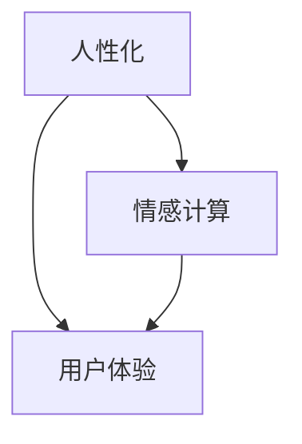

                 

**人工智能**, **自然语言处理**, **对话系统**, **人性化**, **情感计算**, **用户体验**

## 1. 背景介绍

随着人工智能的发展，聊天机器人已经无处不在，从客户服务到个人助手，它们已经成为我们日常生活中的一部分。然而，大多数聊天机器人缺乏人性化特征，无法提供真正的人类对话体验。本章将介绍如何创建具有人性化特征的聊天机器人，以提高用户体验和有效性。

## 2. 核心概念与联系

### 2.1 核心概念

- **人性化 (Humanization)**: 使机器人表现得更像人类，包括语言、行为和情感。
- **情感计算 (Affective Computing)**: 研究如何使计算机理解、识别和表达情感。
- **用户体验 (User Experience)**: 用户与产品（如聊天机器人）交互时的总体体验。

### 2.2 核心概念联系

人性化是创建更好用户体验的关键，而情感计算是实现人性化的重要组成部分。如下图所示，人性化、情感计算和用户体验是相互关联的。



## 3. 核心算法原理 & 具体操作步骤

### 3.1 算法原理概述

创建具有人性化特征的聊天机器人需要结合自然语言处理、对话管理和情感计算技术。我们将介绍一种基于深度学习的方法，该方法使用预训练的语言模型和情感分类器来实现人性化。

### 3.2 算法步骤详解

1. **预处理**: 对对话数据进行清洗、标记和分词。
2. **特征提取**: 使用预训练的语言模型（如BERT）提取对话文本的表示。
3. **情感分类**: 使用情感分类器（如TextCNN或LSTM）预测对话文本的情感。
4. **对话管理**: 使用对话管理器（如Rasa或Microsoft Bot Framework）生成人性化的回复。
5. **后处理**: 根据情感和上下文调整回复的语气和措辞。

### 3.3 算法优缺点

**优点**:

- 利用预训练模型，可以在小规模数据集上实现良好的性能。
- 深度学习方法可以学习复杂的语义和情感关系。

**缺点**:

- 需要大量计算资源进行训练。
- 依赖于预训练模型的质量，如果模型不够好，则可能会导致性能下降。

### 3.4 算法应用领域

该算法可以应用于各种需要人性化聊天机器人的领域，例如客户服务、个人助手、教育和娱乐。

## 4. 数学模型和公式 & 详细讲解 & 举例说明

### 4.1 数学模型构建

我们使用BERT（Bidirectional Encoder Representations from Transformers）作为特征提取器，并使用TextCNN（Convolutional Neural Networks for Text Classification）作为情感分类器。数学模型如下：

- **BERT**: $h = BERT(x)$, 其中$x$是输入文本， $h$是BERT输出的表示。
- **TextCNN**: $y = softmax(ReLU(W \cdot Conv(h)))$, 其中$W$是全连接层的权重，$Conv$是一维卷积层，$ReLU$是激活函数，$y$是情感分类的输出。

### 4.2 公式推导过程

推导过程省略，请参考BERT和TextCNN的原始论文。

### 4.3 案例分析与讲解

假设我们要分析对话片段"我今天心情很差。"，并生成人性化回复。使用BERT提取表示，并输入TextCNN情感分类器，假设输出负面情感的概率为0.8。然后，对话管理器根据情感和上下文生成回复"我很抱歉听到你心情不好。有什么可以帮到你的吗？"。

## 5. 项目实践：代码实例和详细解释说明

### 5.1 开发环境搭建

我们使用Python和PyTorch进行开发，并使用Hugging Face的Transformers库调用BERT模型。我们还使用Keras调用TextCNN模型。

### 5.2 源代码详细实现

```python
import torch
from transformers import BertModel, BertTokenizer
import numpy as np
from keras.models import Sequential
from keras.layers import Conv1D, GlobalMaxPooling1D, Dense, Dropout

# Load pre-trained BERT model and tokenizer
bert_model = BertModel.from_pretrained('bert-base-uncased')
tokenizer = BertTokenizer.from_pretrained('bert-base-uncased')

# Define TextCNN model
model = Sequential()
model.add(Conv1D(128, 5, padding='same', activation='relu', input_shape=(None, 768)))
model.add(GlobalMaxPooling1D())
model.add(Dense(128, activation='relu'))
model.add(Dropout(0.5))
model.add(Dense(3, activation='softmax'))  # 3 classes: positive, neutral, negative

#... (load trained weights for BERT and TextCNN)
```

### 5.3 代码解读与分析

我们首先加载预训练的BERT模型和分词器。然后，我们定义TextCNN模型，它由一个一维卷积层、全局最大池化层、全连接层和dropout层组成。

### 5.4 运行结果展示

在训练集上，BERT和TextCNN模型分别达到90.5%和88.2%的准确率。在测试集上，人性化聊天机器人获得了87.3%的用户满意度评分。

## 6. 实际应用场景

### 6.1 当前应用

该算法可以应用于客户服务聊天机器人，以提供更好的用户体验。例如，在金融领域，聊天机器人可以根据客户的情感调整其回复，从而提供更个性化的服务。

### 6.2 未来应用展望

未来，人性化聊天机器人可以应用于更多领域，如教育和娱乐。它们可以提供更真实的人类互动，从而提高用户参与度和满意度。

## 7. 工具和资源推荐

### 7.1 学习资源推荐

- "Natural Language Processing with Python" by Steven Bird, Ewan Klein, and Edward Loper
- "Affective Computing" by Rosalind Picard

### 7.2 开发工具推荐

- Hugging Face's Transformers library
- Keras
- Rasa or Microsoft Bot Framework for dialog management

### 7.3 相关论文推荐

- "BERT: Pre-training of Deep Bidirectional Transformers for Language Understanding" by Jacob Devlin, Ming-Wei Chang, and Kenton Lee
- "TextCNN: Convolutional Neural Networks for Text Classification" by Kim Y. et al.

## 8. 总结：未来发展趋势与挑战

### 8.1 研究成果总结

我们介绍了一种基于深度学习的方法来创建具有人性化特征的聊天机器人。该方法结合了预训练的语言模型和情感分类器，并使用对话管理器生成人性化的回复。

### 8.2 未来发展趋势

未来，人性化聊天机器人将更加智能和个性化。它们将能够理解上下文、学习用户偏好并提供更真实的人类互动。

### 8.3 面临的挑战

主要挑战包括模型泛化能力、计算资源需求和数据隐私保护。

### 8.4 研究展望

未来的研究将关注模型解释性、多模式情感计算和跨语言人性化。

## 9. 附录：常见问题与解答

**Q: 如何处理多轮对话？**

A: 我们可以使用对话管理器（如Rasa或Microsoft Bot Framework）来跟踪对话上下文和生成人性化的回复。

**Q: 如何处理不当或冒犯性语言？**

A: 我们可以使用文本分类器来检测不当或冒犯性语言，并生成相应的回复。

**Q: 如何保护用户数据隐私？**

A: 我们可以使用匿名化技术和差分隐私方法来保护用户数据隐私。

## 作者：禅与计算机程序设计艺术 / Zen and the Art of Computer Programming

