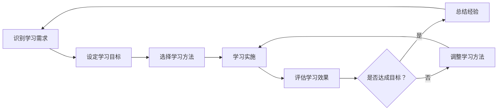

                 

## 1. 背景介绍

在当今快速变化的商业环境中，管理者面临着前所未有的挑战。技术进步、全球化、不断变化的市场需求和竞争对手等因素，都要求管理者具备持续学习和适应的能力。终身学习不再是一种选择，而是一种必需。本文将探讨管理者终身学习的重要性，并提供一些实用的方法和技巧。

## 2. 核心概念与联系

### 2.1 终身学习的定义

终身学习（Lifelong Learning）是指个体在其一生中不断获取新知识、新技能，以适应不断变化的环境和需求的过程。它强调学习是一个持续终身的活动，而不是一次性的事件。

### 2.2 管理者终身学习的重要性

管理者终身学习的重要性可以从以下几个方面来看：

- **适应变化**：管理者需要不断学习以适应市场、技术和竞争对手的变化。
- **提高竞争力**：终身学习有助于管理者提高其技能和知识水平，从而提高其竞争力。
- **提高决策能力**：不断学习可以帮助管理者获取更多信息，从而做出更明智的决策。
- **提高员工满意度**：管理者的终身学习可以带动整个团队的学习，提高员工的技能和满意度。

### 2.3 管理者终身学习的架构

管理者终身学习的过程可以用下面的 Mermaid 流程图来表示：



## 3. 核心算法原理 & 具体操作步骤

### 3.1 算法原理概述

管理者终身学习的过程可以看作是一个反馈控制系统。管理者首先识别自己的学习需求，设定学习目标，选择学习方法，实施学习，然后评估学习效果。如果学习效果达到了预期目标，则总结经验，开始下一个学习循环；如果没有达到预期目标，则调整学习方法，重新开始学习。

### 3.2 算法步骤详解

#### 3.2.1 识别学习需求

管理者需要定期评估自己的知识和技能水平，识别出需要学习的领域。这可以通过自省、与同事交流、参加行业会议等方式来实现。

#### 3.2.2 设定学习目标

一旦识别出学习需求，管理者需要设定具体的学习目标。目标应当是SMART的，即具体的（Specific）、可衡量的（Measurable）、可实现的（Achievable）、相关的（Relevant）、有时间限制的（Time-bound）。

#### 3.2.3 选择学习方法

管理者应当选择最适合自己的学习方法。学习方法可以包括阅读、参加培训课程、在线学习、实践等。

#### 3.2.4 学习实施

管理者应当严格按照计划实施学习。这需要自律和时间管理能力。

#### 3.2.5 评估学习效果

学习结束后，管理者应当评估自己的学习效果。这可以通过测试、与同事交流、反思等方式来实现。

#### 3.2.6 总结经验

如果学习效果达到了预期目标，管理者应当总结自己的学习经验，以便于下次学习。

#### 3.2.7 调整学习方法

如果学习效果没有达到预期目标，管理者应当调整自己的学习方法，重新开始学习。

### 3.3 算法优缺点

**优点**：这种算法可以帮助管理者有效地实施终身学习，提高学习效果。

**缺点**：这种算法需要管理者有很强的自律能力和时间管理能力。如果管理者缺乏这些能力，则学习效果可能会受到影响。

### 3.4 算法应用领域

这种算法可以应用于任何需要管理者终身学习的领域，例如企业管理、技术管理等。

## 4. 数学模型和公式 & 详细讲解 & 举例说明

### 4.1 数学模型构建

管理者终身学习的过程可以用下面的数学模型来表示：

$$L = f(N, T, M, E)$$

其中，$L$表示学习效果，$N$表示学习需求，$T$表示学习目标，$M$表示学习方法，$E$表示学习环境。

### 4.2 公式推导过程

学习效果$L$是学习需求$N$、学习目标$T$、学习方法$M$和学习环境$E$的函数。学习需求$N$和学习目标$T$是管理者通过自省和评估得出的。学习方法$M$是管理者根据自己的学习习惯和学习需求选择的。学习环境$E$是管理者所处的外部环境，包括工作环境、家庭环境等。

### 4.3 案例分析与讲解

例如，一位管理者需要学习数据分析技能。他首先识别出自己的学习需求$N$是数据分析技能，设定学习目标$T$是能够独立完成数据分析任务。他选择了在线学习平台作为学习方法$M$，并创造了安静的学习环境$E$.根据数学模型，他的学习效果$L$将取决于这些因素。

## 5. 项目实践：代码实例和详细解释说明

### 5.1 开发环境搭建

本节将使用Python编写一个简单的学习计划生成器。我们需要安装Python和Jupyter Notebook。

### 5.2 源代码详细实现

```python
# 学习计划生成器

# 识别学习需求
def identify_learning_needs():
    # 这里可以添加代码来识别学习需求
    pass

# 设定学习目标
def set_learning_goals(learning_needs):
    # 根据学习需求设定学习目标
    goals = []
    for need in learning_needs:
        # 这里可以添加代码来设定学习目标
        pass
    return goals

# 选择学习方法
def choose_learning_methods(learning_goals):
    # 根据学习目标选择学习方法
    methods = []
    for goal in learning_goals:
        # 这里可以添加代码来选择学习方法
        pass
    return methods

# 学习实施
def implement_learning(methods):
    # 根据学习方法实施学习
    for method in methods:
        # 这里可以添加代码来实施学习
        pass

# 评估学习效果
def evaluate_learning():
    # 这里可以添加代码来评估学习效果
    pass

# 总结经验
def summarize_experience():
    # 这里可以添加代码来总结学习经验
    pass

# 调整学习方法
def adjust_learning_methods(methods, evaluation_result):
    # 根据学习效果调整学习方法
    for method in methods:
        # 这里可以添加代码来调整学习方法
        pass

# 主函数
def main():
    learning_needs = identify_learning_needs()
    learning_goals = set_learning_goals(learning_needs)
    learning_methods = choose_learning_methods(learning_goals)
    implement_learning(learning_methods)
    evaluation_result = evaluate_learning()
    if evaluation_result =='success':
        summarize_experience()
    else:
        adjust_learning_methods(learning_methods, evaluation_result)

if __name__ == '__main__':
    main()
```

### 5.3 代码解读与分析

这个学习计划生成器包含了管理者终身学习的所有步骤。每个步骤都对应一个函数。主函数`main()`调用这些函数，实现了整个学习过程。

### 5.4 运行结果展示

运行这个程序会实现管理者终身学习的整个过程。具体的学习需求、学习目标、学习方法等需要根据实际情况来设定。

## 6. 实际应用场景

管理者终身学习可以应用于各种实际场景。例如：

- **企业管理**：企业管理者需要不断学习新的管理技能以适应市场变化。
- **技术管理**：技术管理者需要不断学习新的技术以保持竞争力。
- **个人发展**：个人也需要不断学习以提高自己的技能和知识水平。

### 6.1 企业管理

企业管理者需要不断学习新的管理技能以适应市场变化。例如，随着电子商务的兴起，企业管理者需要学习电子商务管理技能。

### 6.2 技术管理

技术管理者需要不断学习新的技术以保持竞争力。例如，随着人工智能技术的发展，技术管理者需要学习人工智能技术。

### 6.3 未来应用展望

未来，管理者终身学习将变得越来越重要。随着技术的发展，管理者需要不断学习新的技能以适应新的环境。同时，学习也将变得越来越便利。在线学习平台、人工智能助手等技术将帮助管理者更有效地学习。

## 7. 工具和资源推荐

### 7.1 学习资源推荐

- **在线学习平台**： Coursera、Udemy、edX等在线学习平台提供了大量的学习资源。
- **行业会议**：参加行业会议可以学习到最新的行业动态和技术。
- **专业书籍**：阅读专业书籍可以获取深入的知识。

### 7.2 开发工具推荐

- **Jupyter Notebook**：这是一个非常好的学习和开发工具，可以帮助管理者记录和分享学习过程。
- **Slack**：这是一个非常好的沟通工具，可以帮助管理者与同事交流学习经验。

### 7.3 相关论文推荐

- [Lifelong Learning: A Survey of Methods and Taxonomies](https://ieeexplore.ieee.org/document/8454727)
- [Lifelong Learning in Neural Networks: A Review](https://arxiv.org/abs/1607.03250)

## 8. 总结：未来发展趋势与挑战

### 8.1 研究成果总结

本文介绍了管理者终身学习的重要性，并提供了实用的方法和技巧。我们还提出了一个数学模型来表示管理者终身学习的过程，并实现了一个简单的学习计划生成器。

### 8.2 未来发展趋势

未来，管理者终身学习将变得越来越重要。随着技术的发展，管理者需要不断学习新的技能以适应新的环境。同时，学习也将变得越来越便利。在线学习平台、人工智能助手等技术将帮助管理者更有效地学习。

### 8.3 面临的挑战

管理者终身学习面临的挑战包括：

- **时间管理**：管理者需要平衡学习和工作之间的关系。
- **学习动机**：管理者需要保持学习动机，避免学习变成一种负担。
- **学习效果评估**：管理者需要能够评估自己的学习效果，并及时调整学习方法。

### 8.4 研究展望

未来的研究可以从以下几个方面展开：

- **学习动机研究**：进一步研究管理者学习动机的来源和维持机制。
- **学习效果评估研究**：进一步研究管理者学习效果评估的方法和工具。
- **学习技术研究**：研究新的学习技术，如人工智能助手等，如何帮助管理者更有效地学习。

## 9. 附录：常见问题与解答

**Q1：管理者终身学习需要花费多少时间？**

**A1：管理者终身学习需要花费的时间取决于学习需求和学习目标。一般情况下，每周花费2-3小时学习是合理的。**

**Q2：管理者终身学习需要花费多少钱？**

**A2：管理者终身学习需要花费的钱取决于学习方法。在线学习平台通常比参加培训课程便宜。**

**Q3：管理者终身学习有哪些好处？**

**A3：管理者终身学习有以下好处：适应变化、提高竞争力、提高决策能力、提高员工满意度。**

!!!Note
作者：禅与计算机程序设计艺术 / Zen and the Art of Computer Programming

