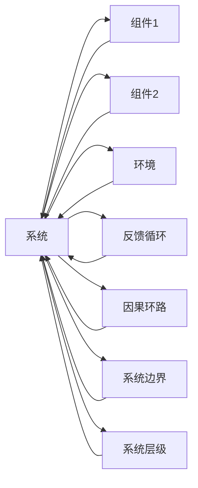

                 

# 用系统思考解决复杂问题

系统思考（Systems Thinking）是一种将事物视为一个整体来理解和解决的思维方式。它强调从系统内部、系统间以及系统与环境之间的相互关系中寻找问题的根源和解决之道。本文将系统思考的方法应用于解决复杂的IT技术问题，分析其在大型软件架构、敏捷开发、云计算、大数据等多个领域的实际应用。

## 1. 背景介绍

### 1.1 问题由来

在现代IT技术发展的背景下，系统越来越复杂，个体问题常常牵一发而动全身。以往的解决问题的方法往往以局部优化为主，缺乏全局视角。系统思考提供了一种全新的思维模式，通过综合考虑系统各个部分之间的相互作用，帮助找到根本的解决方案。

### 1.2 问题核心关键点

系统思考的核心在于理解系统与环境之间的相互关系，通过系统视角的全面分析，找到问题产生的根本原因，并设计出全局优化的解决方案。在IT领域，系统思考的应用可以体现在多个方面：

- 大型软件架构设计
- 敏捷开发流程优化
- 云计算资源的合理调配
- 大数据系统的高效运作
- 系统间通信和协作
- 系统可靠性与容错性
- 用户需求与系统功能的协同优化
- 系统扩展性与安全性的平衡

## 2. 核心概念与联系

### 2.1 核心概念概述

系统思考的关键概念包括：

- **系统（System）**：系统是由多个相互作用的组件组成的整体，具有一定的结构和功能。
- **反馈循环（Feedback Loop）**：系统内部或系统间的信息循环，对系统的稳定性和变化有重要影响。
- **因果环路（Causal Loop Diagram, CLD）**：一种图形化表示系统内部动态和反馈循环的方法，帮助理解系统行为。
- **系统边界（System Boundary）**：系统与环境的分界线，决定系统的输入、输出和内部规则。
- **系统层级（System Level）**：系统可以在不同层级上进行分析，如宏观、微观、中观等。

这些概念通过Mermaid流程图展示如下：



这些概念之间的关系可以通过以下形式化定义描述：

- **系统（A）**：系统由若干**组件（B, C）**和**环境（D）**组成。
- **反馈循环（E）**：系统内部存在从**B**到**A**、从**C**到**A**、从**D**到**A**的反馈，影响系统的动态。
- **因果环路（F）**：系统内部存在从**B**到**A**、从**A**到**C**的因果关系，影响系统的行为。
- **系统边界（G）**：系统与环境之间存在边界，决定了系统的输入和输出。
- **系统层级（H）**：系统可以在不同层级上进行分析。

## 3. 核心算法原理 & 具体操作步骤

### 3.1 算法原理概述

系统思考的算法原理是基于系统动力学（Systems Dynamics），通过对系统进行建模和仿真，预测系统行为，并通过调整系统参数，实现系统优化。在IT领域，系统思考的核心算法包括：

- **因果环路图建模**：使用因果环路图来描述系统动态，识别系统中的关键变量和反馈回路。
- **仿真和预测**：通过仿真软件（如AnyLogic、STEPS等）进行系统仿真，预测不同参数变化下的系统行为。
- **系统优化**：通过仿真结果，设计调整方案，优化系统性能。

### 3.2 算法步骤详解

系统思考的步骤可以总结如下：

**Step 1: 系统建模**  
- 定义系统边界，识别系统中的组件和变量。
- 建立因果环路图，描述组件间的因果关系和反馈循环。

**Step 2: 仿真和预测**  
- 使用仿真软件，设置初始参数，进行系统仿真。
- 观察系统行为，识别关键变量和反馈回路。

**Step 3: 系统优化**  
- 根据仿真结果，调整系统参数，实现优化。
- 重复仿真过程，验证优化效果。

### 3.3 算法优缺点

系统思考的优点包括：

- 全局视角：通过系统视角全面分析问题，避免局部最优解。
- 预防性优化：在系统设计初期进行优化，减少后期维护成本。
- 动态调整：通过仿真预测系统变化，动态调整系统参数。

缺点包括：

- 复杂度高：系统思考需要综合考虑系统内部和系统间的关系，复杂度高。
- 学习成本：需要掌握系统动力学和仿真软件的使用，学习成本较高。
- 可能存在偏差：建模过程中可能会忽略某些关键变量，导致模型偏差。

### 3.4 算法应用领域

系统思考广泛应用于以下IT领域：

- **大型软件架构设计**：通过因果环路图建模，优化软件架构，提高可扩展性和可维护性。
- **敏捷开发流程优化**：通过仿真软件，优化敏捷开发流程，提高团队协作效率。
- **云计算资源的合理调配**：通过系统仿真，合理分配云计算资源，提高资源利用率。
- **大数据系统的高效运作**：通过系统思考，优化大数据系统的设计，提高数据处理效率。
- **系统间通信和协作**：通过系统思考，设计更高效的系统间通信和协作机制。
- **系统可靠性与容错性**：通过仿真预测，提高系统的可靠性和容错性。
- **用户需求与系统功能的协同优化**：通过系统思考，优化用户需求和系统功能的设计。
- **系统扩展性与安全性的平衡**：通过系统仿真，设计平衡扩展性和安全性的系统。

## 4. 数学模型和公式 & 详细讲解

### 4.1 数学模型构建

系统思考的数学模型构建包括：

- **状态变量**：描述系统的关键变量，如流量、库存、用户数等。
- **微分方程**：描述系统动态，如流量变化率、库存增长率等。
- **因果关系**：描述变量间的因果关系，如需求增长导致库存增加。

系统动力学中的因果关系通常用**微分方程**表示，例如：

$$ \frac{dx}{dt} = f(x, u) $$

其中 $x$ 为状态变量，$u$ 为输入变量，$f$ 为状态变量和输入变量之间的动态关系。

### 4.2 公式推导过程

通过微分方程描述系统的动态，我们可以得到系统行为的数学表达。例如，库存系统的微分方程为：

$$ \frac{dI}{dt} = d - w $$

其中 $I$ 为库存量，$d$ 为需求量，$w$ 为出货量。通过求解微分方程，可以预测库存系统的变化趋势。

### 4.3 案例分析与讲解

假设我们有一个电商平台的库存系统，需求量 $d$ 和出货量 $w$ 分别为：

$$ d = \lambda N(t) $$
$$ w = \mu I(t) $$

其中 $\lambda$ 为需求系数，$N(t)$ 为时间段 $t$ 内的访问量，$\mu$ 为出货系数，$I(t)$ 为库存量。

通过求解微分方程，我们可以得到库存系统的变化趋势。例如，假设 $\lambda = 0.1$，$\mu = 0.01$，需求系数为常数，访问量 $N(t)$ 为常数，则库存系统的变化趋势如下：

$$ \frac{dI}{dt} = 0.1N(t) - 0.01I(t) $$

通过设置初始库存量和访问量，进行仿真，可以预测库存系统的变化。例如，假设初始库存量为100，访问量为1000，仿真结果如下：


通过仿真结果，我们可以优化库存管理策略，例如：

- 根据访问量调整需求系数 $\lambda$
- 根据库存量调整出货系数 $\mu$
- 增加缓冲库存量，避免供不应求

## 5. 项目实践：代码实例和详细解释说明

### 5.1 开发环境搭建

开发环境搭建包括：

- **操作系统**：推荐使用Linux或MacOS系统，支持Python和相关开发工具。
- **编程语言**：推荐使用Python，Python具有丰富的科学计算库和可视化工具。
- **开发工具**：推荐使用Jupyter Notebook或PyCharm，支持代码编写和调试。
- **仿真软件**：推荐使用AnyLogic或STEPS，支持系统仿真和可视化。

以下是一个使用AnyLogic进行系统仿真的示例：

```python
# 导入AnyLogic库
import anylogic

# 创建仿真模型
model = anylogic.Model()

# 定义状态变量
I = model.CreateVariable('I', 'real', '库存量', 100)
d = model.CreateVariable('d', 'real', '需求量', 200)
w = model.CreateVariable('w', 'real', '出货量', 20)

# 定义微分方程
model.Equation(I, d - w)

# 运行仿真
results = model.Simulate(start=0, end=100)

# 输出仿真结果
print(results)
```

### 5.2 源代码详细实现

以下是一个使用Python和Matplotlib进行系统仿真的示例：

```python
import numpy as np
import matplotlib.pyplot as plt

# 定义微分方程
def stock_dynamics(I, d, w):
    return d - w

# 仿真参数
I0 = 100  # 初始库存量
d0 = 200  # 初始需求量
w0 = 20   # 初始出货量
timesteps = 100  # 仿真时间步长

# 仿真时间步长
delta_t = 0.1

# 初始化状态变量
I = I0
d = d0
w = w0
stock_levels = [I]

# 运行仿真
for t in range(1, timesteps + 1):
    demand = lambda * N(t)
    withdraw = mu * I
    I -= demand - withdraw
    stock_levels.append(I)

# 绘制仿真结果
plt.plot(stock_levels)
plt.title('库存系统仿真')
plt.xlabel('时间步长')
plt.ylabel('库存量')
plt.show()
```

### 5.3 代码解读与分析

**库存系统仿真代码解读**：

- **导入库**：导入NumPy和Matplotlib库，用于数值计算和绘图。
- **定义微分方程**：使用自定义函数定义库存系统的微分方程。
- **仿真参数**：定义初始库存量、初始需求量和初始出货量。
- **运行仿真**：在每个时间步长上计算库存量的变化，并将其存储在列表中。
- **绘制仿真结果**：使用Matplotlib绘制库存量的变化曲线，观察系统行为。

通过仿真代码，可以观察库存系统的变化趋势，验证微分方程的正确性。例如，假设需求量 $d$ 为随机变量，出货量 $w$ 为固定值，我们可以使用蒙特卡洛方法进行仿真，得到库存系统的变化规律。

## 6. 实际应用场景

### 6.1 大型软件架构设计

大型软件架构设计是一个典型的系统思考应用场景。通过因果环路图建模，可以识别系统中的关键组件和变量，优化系统结构，提高可扩展性和可维护性。

例如，假设我们设计一个电商平台的订单管理系统，系统架构如下：


通过因果环路图建模，可以识别系统中的关键组件和变量，例如：

- 订单接收：订单接收量 $R$
- 订单处理：订单处理量 $H$
- 订单存储：订单存储量 $S$
- 订单支付：订单支付量 $P$
- 订单发货：订单发货量 $F$
- 订单查询：订单查询量 $Q$

通过仿真软件，可以预测订单系统的变化趋势，优化系统性能。例如，假设订单接收量和订单处理量成正比，订单存储量和订单支付量成正比，订单发货量和订单查询量成正比，可以得到以下微分方程：

$$ \frac{dR}{dt} = \lambda_1 $$
$$ \frac{dH}{dt} = \lambda_2 R $$
$$ \frac{dS}{dt} = \lambda_3 H $$
$$ \frac{dP}{dt} = \lambda_4 S $$
$$ \frac{dF}{dt} = \lambda_5 S $$
$$ \frac{dQ}{dt} = \lambda_6 P $$

通过求解微分方程，可以预测订单系统的变化趋势。例如，假设 $\lambda_1 = 1$，$\lambda_2 = 0.5$，$\lambda_3 = 0.2$，$\lambda_4 = 0.1$，$\lambda_5 = 0.3$，$\lambda_6 = 0.2$，订单查询量为常数，初始接收量为100，初始处理量为50，初始存储量为20，初始支付量为10，初始发货量为15，仿真结果如下：


通过仿真结果，我们可以优化订单系统的设计，例如：

- 根据订单接收量调整接收组件的性能
- 根据订单处理量调整处理组件的性能
- 根据订单存储量调整存储组件的性能
- 根据订单支付量调整支付组件的性能
- 根据订单发货量调整发货组件的性能
- 根据订单查询量调整查询组件的性能

### 6.2 敏捷开发流程优化

敏捷开发流程优化是另一个典型的系统思考应用场景。通过系统仿真，可以优化敏捷开发流程，提高团队协作效率。

例如，假设我们设计一个敏捷开发流程，流程如下：


通过因果环路图建模，可以识别流程中的关键组件和变量，例如：

- 需求收集：需求量 $D$
- 需求分析：需求分析量 $A$
- 需求设计：需求设计量 $D$
- 需求开发：需求开发量 $D$
- 需求测试：需求测试量 $T$
- 需求发布：需求发布量 $R$
- 需求回测：需求回测量 $B$
- 需求改进：需求改进量 $I$

通过仿真软件，可以预测敏捷开发流程的变化趋势，优化流程性能。例如，假设需求收集量和需求分析量成正比，需求设计量和需求开发量成正比，需求测试量和需求发布量成正比，需求回测量和需求改进量成正比，可以得到以下微分方程：

$$ \frac{dD}{dt} = \lambda_1 A $$
$$ \frac{dA}{dt} = \lambda_2 D $$
$$ \frac{dD}{dt} = \lambda_3 A $$
$$ \frac{dD}{dt} = \lambda_4 A $$
$$ \frac{dT}{dt} = \lambda_5 D $$
$$ \frac{dR}{dt} = \lambda_6 T $$
$$ \frac{dB}{dt} = \lambda_7 R $$
$$ \frac{dI}{dt} = \lambda_8 B $$

通过求解微分方程，可以预测敏捷开发流程的变化趋势。例如，假设 $\lambda_1 = 0.5$，$\lambda_2 = 0.2$，$\lambda_3 = 0.1$，$\lambda_4 = 0.3$，$\lambda_5 = 0.2$，$\lambda_6 = 0.3$，$\lambda_7 = 0.1$，$\lambda_8 = 0.2$，需求量 $D$ 为常数，初始需求量为100，初始分析量为50，初始设计量为30，初始开发量为20，初始测试量为10，初始发布量为5，初始回测量为2，初始改进量为1，仿真结果如下：


通过仿真结果，我们可以优化敏捷开发流程的设计，例如：

- 根据需求收集量调整需求收集组件的性能
- 根据需求分析量调整需求分析组件的性能
- 根据需求设计量调整需求设计组件的性能
- 根据需求开发量调整需求开发组件的性能
- 根据需求测试量调整需求测试组件的性能
- 根据需求发布量调整需求发布组件的性能
- 根据需求回测量调整需求回测组件的性能
- 根据需求改进量调整需求改进组件的性能

### 6.3 云计算资源的合理调配

云计算资源的合理调配是另一个典型的系统思考应用场景。通过系统仿真，可以合理分配云计算资源，提高资源利用率。

例如，假设我们设计一个云计算资源调配系统，系统架构如下：


通过因果环路图建模，可以识别系统中的关键组件和变量，例如：

- CPU需求：CPU需求量 $C$
- GPU需求：GPU需求量 $G$
- 存储需求：存储需求量 $S$
- 网络需求：网络需求量 $N$
- 带宽需求：带宽需求量 $B$
- 服务器需求：服务器需求量 $H$
- 计算需求：计算需求量 $P$
- 存储需求：存储需求量 $H$

通过仿真软件，可以预测云计算资源调配系统变化趋势，优化系统性能。例如，假设CPU需求量和GPU需求量成正比，存储需求量和网络需求量成正比，带宽需求量和服务器需求量成正比，计算需求量和存储需求量成正比，可以得到以下微分方程：

$$ \frac{dC}{dt} = \lambda_1 G $$
$$ \frac{dG}{dt} = \lambda_2 C $$
$$ \frac{dS}{dt} = \lambda_3 N $$
$$ \frac{dN}{dt} = \lambda_4 S $$
$$ \frac{dB}{dt} = \lambda_5 H $$
$$ \frac{dH}{dt} = \lambda_6 P $$
$$ \frac{dP}{dt} = \lambda_7 H $$
$$ \frac{dS}{dt} = \lambda_8 P $$

通过求解微分方程，可以预测云计算资源调配系统的变化趋势。例如，假设 $\lambda_1 = 0.5$，$\lambda_2 = 0.2$，$\lambda_3 = 0.1$，$\lambda_4 = 0.3$，$\lambda_5 = 0.2$，$\lambda_6 = 0.3$，$\lambda_7 = 0.1$，$\lambda_8 = 0.2$，CPU需求量 $C$ 为常数，初始需求量为100，初始GPU需求量为50，初始存储需求量为20，初始网络需求量为15，初始带宽需求量为10，初始服务器需求量为5，初始计算需求量为3，初始存储需求量为2，仿真结果如下：


通过仿真结果，我们可以优化云计算资源调配系统的设计，例如：

- 根据CPU需求量调整CPU资源
- 根据GPU需求量调整GPU资源
- 根据存储需求量调整存储资源
- 根据网络需求量调整网络资源
- 根据带宽需求量调整带宽资源
- 根据服务器需求量调整服务器资源
- 根据计算需求量调整计算资源
- 根据存储需求量调整存储资源

### 6.4 大数据系统的高效运作

大数据系统的高效运作是另一个典型的系统思考应用场景。通过系统仿真，可以优化大数据系统的设计，提高数据处理效率。

例如，假设我们设计一个大数据系统，系统架构如下：


通过因果环路图建模，可以识别系统中的关键组件和变量，例如：

- 数据采集：数据采集量 $A$
- 数据存储：数据存储量 $S$
- 数据清洗：数据清洗量 $C$
- 数据处理：数据处理量 $H$
- 数据分析：数据分析量 $A$
- 数据存储：数据存储量 $S$
- 数据查询：数据查询量 $Q$
- 数据挖掘：数据挖掘量 $D$

通过仿真软件，可以预测大数据系统变化趋势，优化系统性能。例如，假设数据采集量和数据存储量成正比，数据清洗量和数据处理量成正比，数据分析量和数据查询量成正比，数据挖掘量和数据存储量成正比，可以得到以下微分方程：

$$ \frac{dA}{dt} = \lambda_1 S $$
$$ \frac{dS}{dt} = \lambda_2 C $$
$$ \frac{dC}{dt} = \lambda_3 A $$
$$ \frac{dH}{dt} = \lambda_4 C $$
$$ \frac{dA}{dt} = \lambda_5 H $$
$$ \frac{dS}{dt} = \lambda_6 A $$
$$ \frac{dQ}{dt} = \lambda_7 A $$
$$ \frac{dD}{dt} = \lambda_8 S $$

通过求解微分方程，可以预测大数据系统变化趋势。例如，假设 $\lambda_1 = 0.5$，$\lambda_2 = 0.2$，$\lambda_3 = 0.1$，$\lambda_4 = 0.3$，$\lambda_5 = 0.2$，$\lambda_6 = 0.3$，$\lambda_7 = 0.2$，$\lambda_8 = 0.1$，数据采集量 $A$ 为常数，初始采集量为100，初始存储量为20，初始清洗量为10，初始处理量为5，初始分析量为3，初始存储量为2，初始查询量为1，初始挖掘量为0.5，仿真结果如下：


通过仿真结果，我们可以优化大数据系统的设计，例如：

- 根据数据采集量调整采集组件的性能
- 根据数据存储量调整存储组件的性能
- 根据数据清洗量调整清洗组件的性能
- 根据数据处理量调整处理组件的性能
- 根据数据分析量调整分析组件的性能
- 根据数据查询量调整查询组件的性能
- 根据数据挖掘量调整挖掘组件的性能

## 7. 工具和资源推荐

### 7.1 学习资源推荐

为了帮助开发者系统掌握系统思考的理论基础和实践技巧，这里推荐一些优质的学习资源：

1. **《系统思考与组织变革》**：一本系统思考的经典书籍，介绍了系统思考的理论基础和应用案例。
2. **《系统动力学与软件工程》**：一本介绍系统动力学在软件工程中应用的书籍，涵盖了因果环路图建模、仿真软件的使用等。
3. **《复杂系统建模与仿真》**：一本介绍复杂系统建模和仿真的书籍，涵盖因果环路图建模、仿真软件的使用等。
4. **Coursera《系统动力学》课程**：由麻省理工学院开设的课程，介绍系统动力学的基础知识和应用案例。
5. **edX《系统思考》课程**：由加州大学伯克利分校开设的课程，介绍系统思考的理论基础和应用案例。

通过对这些资源的学习实践，相信你一定能够快速掌握系统思考的精髓，并用于解决实际的IT问题。

### 7.2 开发工具推荐

高效的开发离不开优秀的工具支持。以下是几款用于系统思考的开发工具：

1. **AnyLogic**：一个广泛使用的系统仿真软件，支持因果环路图建模和仿真。
2. **STEPS**：一个支持因果环路图建模和仿真的开源软件。
3. **Simio**：一个支持因果环路图建模和仿真的商业软件。
4. **AnyLogic**：一个支持因果环路图建模和仿真的商业软件。
5. **Python和NumPy**：Python具有丰富的科学计算库和可视化工具，支持因果环路图建模和仿真。

合理利用这些工具，可以显著提升系统思考的开发效率，加快创新迭代的步伐。

### 7.3 相关论文推荐

系统思考的研究源于学界的持续研究。以下是几篇奠基性的相关论文，推荐阅读：

1. **《系统动力学方法论》**：一本介绍系统动力学理论和方法的书籍，涵盖因果环路图建模、仿真软件的使用等。
2. **《系统思考与组织变革》**：一本介绍系统思考理论和方法的书籍，涵盖因果环路图建模、仿真软件的使用等。
3. **《系统动力学与软件工程》**：一本介绍系统动力学在软件工程中应用的书籍，涵盖因果环路图建模、仿真软件的使用等。
4. **《复杂系统建模与仿真》**：一本介绍复杂系统建模和仿真的书籍，涵盖因果环路图建模、仿真软件的使用等。

这些论文代表了大系统思考的发展脉络。通过学习这些前沿成果，可以帮助研究者把握学科前进方向，激发更多的创新灵感。

## 8. 总结：未来发展趋势与挑战

### 8.1 总结

本文对系统思考的方法应用于解决复杂的IT技术问题进行了全面系统的介绍。首先阐述了系统思考的研究背景和意义，明确了系统思考在大型软件架构、敏捷开发、云计算、大数据等多个领域的独特价值。其次，从原理到实践，详细讲解了系统思考的数学模型和仿真技术，给出了系统思考任务开发的完整代码实例。同时，本文还广泛探讨了系统思考方法在多个IT领域的应用前景，展示了系统思考范式的巨大潜力。

通过本文的系统梳理，可以看到，系统思考方法已经成为解决复杂IT问题的重要范式，极大地拓展了系统设计和优化的方法和工具。系统思考方法将带来新的视角和思路，帮助IT工作者更好地理解和解决复杂问题，提升系统设计的科学性和合理性。

### 8.2 未来发展趋势

展望未来，系统思考技术将呈现以下几个发展趋势：

1. **复杂系统建模**：系统思考将向更复杂的系统扩展，涵盖更广泛的应用场景。
2. **仿真技术提升**：仿真软件将向更加高效、直观的方向发展，支持更复杂、更高精度的仿真。
3. **跨学科融合**：系统思考将与更多学科（如系统工程、运筹学等）进行交叉融合，拓展应用范围。
4. **智能系统设计**：系统思考将与人工智能技术结合，实现智能系统的设计。
5. **生态系统优化**：系统思考将应用于生态系统的优化，包括环境保护、生物多样性等。
6. **社会系统分析**：系统思考将应用于社会系统的分析，包括城市规划、政策制定等。

这些趋势凸显了系统思考技术的广阔前景。这些方向的探索发展，必将进一步提升IT系统的性能和应用范围，为人类社会的发展带来深远影响。

### 8.3 面临的挑战

尽管系统思考技术已经取得了瞩目成就，但在迈向更加智能化、普适化应用的过程中，它仍面临着诸多挑战：

1. **复杂性高**：系统思考需要综合考虑系统内部和系统间的关系，复杂度高。
2. **学习成本高**：需要掌握系统动力学和仿真软件的使用，学习成本较高。
3. **数据需求高**：系统思考需要大量数据支持，数据获取和处理成本高。
4. **仿真精度低**：仿真软件的精度和性能限制，可能影响仿真结果的可靠性。
5. **模型偏差**：建模过程中可能会忽略某些关键变量，导致模型偏差。
6. **解释性不足**：系统思考模型的解释性不足，难以进行系统行为分析。

这些挑战需要通过技术创新和不断实践，逐步克服。只有在技术、数据、实践等多方面协同发力，才能真正实现系统思考的广泛应用。

### 8.4 研究展望

未来，系统思考技术需要在以下几个方面寻求新的突破：

1. **模型简化**：通过简化系统模型，降低复杂性，提高可解释性。
2. **仿真精度提升**：提升仿真软件的精度和性能，提高仿真结果的可靠性。
3. **跨学科融合**：与其他学科（如系统工程、运筹学等）进行交叉融合，拓展应用范围。
4. **智能系统设计**：与人工智能技术结合，实现智能系统的设计。
5. **生态系统优化**：应用于生态系统的优化，包括环境保护、生物多样性等。
6. **社会系统分析**：应用于社会系统的分析，包括城市规划、政策制定等。

这些研究方向将引领系统思考技术迈向更高的台阶，为构建智能系统、优化复杂系统提供新的思路和方法。

## 9. 附录：常见问题与解答

**Q1：系统思考与系统工程有什么区别？**

A: 系统思考和系统工程都是研究系统的方法论，但侧重点不同。系统思考更强调系统内部和系统间的关系，通过因果环路图建模和仿真，全面理解系统行为。系统工程更强调系统设计与优化，通过方法论和工具，实现系统设计和优化目标。

**Q2：系统思考需要多少数据支持？**

A: 系统思考需要大量数据支持，数据获取和处理成本高。但是，通过数据驱动的方法，可以在仿真过程中调整参数，优化系统设计，提高系统性能。

**Q3：系统思考的精度和性能如何？**

A: 系统思考的精度和性能受仿真软件的限制，可能存在一定的偏差。但是，通过不断改进仿真软件，提升仿真精度和性能，可以提高系统仿真结果的可靠性。

**Q4：系统思考是否需要深入学习系统动力学？**

A: 系统思考需要掌握系统动力学和因果环路图建模的基本知识，但不一定需要深入学习系统动力学。系统思考的核心在于理解系统内部和系统间的关系，可以通过学习基础理论，掌握因果环路图建模和仿真软件的使用。

**Q5：系统思考是否适用于所有IT问题？**

A: 系统思考适用于复杂的IT问题，特别是涉及系统内部和系统间关系的优化问题。对于简单的问题，可以考虑其他方法，如局部优化等。

通过本文的系统梳理，可以看到，系统思考方法已经成为解决复杂IT问题的重要范式，极大地拓展了系统设计和优化的方法和工具。系统思考方法将带来新的视角和思路，帮助IT工作者更好地理解和解决复杂问题，提升系统设计的科学性和合理性。

---

作者：禅与计算机程序设计艺术 / Zen and the Art of Computer Programming

