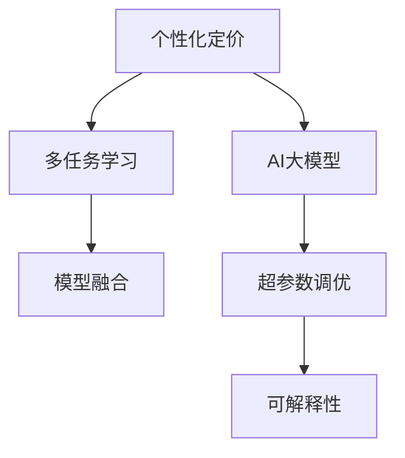

                 

# 电商平台中AI大模型的个性化定价策略

> 关键词：个性化定价, AI大模型, 电商, 预测模型, 用户画像, 超参数调优, 多任务学习, 模型融合, 可解释性

## 1. 背景介绍

### 1.1 问题由来
在现代电子商务中，个性化定价策略成为企业争夺市场份额的关键手段之一。通过针对不同用户的购买行为和消费能力进行差异化定价，电商平台能够实现收益最大化。然而，传统的数据驱动定价方法依赖于复杂的数据处理和人工干预，难以实现实时、精准的定价决策。

AI技术的发展为个性化定价带来了新的可能性。大模型通过预训练学习到复杂的语义表示，能够从用户行为、浏览记录等海量数据中提取有效的特征，自动预测用户对商品价格的变化响应，从而为电商平台提供智能化的定价决策支持。然而，现有的大模型定价策略大多集中在单个任务上，难以满足多维度、多层次的定价需求。

### 1.2 问题核心关键点
当前，基于大模型的个性化定价策略主要面临以下几个核心挑战：
- 如何高效利用多源数据，构建更加全面和准确的定价模型？
- 如何将多任务学习与单任务预测相结合，提升定价模型的泛化能力和适应性？
- 如何在保持模型性能的同时，提高模型的可解释性和公平性？

本文将围绕上述核心挑战，详细探讨基于AI大模型的个性化定价策略，旨在构建一个多任务、多维度、实时化的智能定价系统。

## 2. 核心概念与联系

### 2.1 核心概念概述

为更好地理解基于AI大模型的个性化定价策略，本节将介绍几个密切相关的核心概念：

- **个性化定价(Personalized Pricing)**：指根据用户的购买历史、行为特征、心理预期等个性化信息，动态调整商品价格，以实现最佳的销售效果。
- **AI大模型(AI Large Models)**：指以Transformer等架构为基础，通过大规模无监督学习训练得到的大型神经网络模型，具备强大的语义理解和特征提取能力。
- **多任务学习(Multi-Task Learning, MTL)**：指同时训练多个相关任务模型，共享特征表示，提升模型泛化能力和性能。
- **模型融合(Ensemble Learning)**：指将多个模型的预测结果进行组合，提升整体预测精度和鲁棒性。
- **超参数调优(Hyperparameter Tuning)**：指通过调整模型训练过程中的超参数，如学习率、批量大小等，优化模型性能的过程。
- **可解释性(Explainability)**：指模型的预测结果和决策过程能够被用户和开发者理解，具有透明度和可解释性。

这些核心概念之间的逻辑关系可以通过以下Mermaid流程图来展示：



这个流程图展示了大模型在个性化定价中的应用过程：
1. 个性化定价作为目标任务，利用AI大模型的强大能力进行价格预测。
2. 多任务学习通过训练多个相关任务模型，共享特征表示，提高模型的泛化能力。
3. 模型融合将多个模型的预测结果组合，提升整体预测精度。
4. 超参数调优通过优化模型训练参数，提升模型性能。
5. 可解释性确保模型的决策过程具有透明度和可理解性。

## 3. 核心算法原理 & 具体操作步骤
### 3.1 算法原理概述

基于AI大模型的个性化定价策略，主要通过以下几个步骤实现：
1. 收集和预处理用户行为数据，构建用户画像。
2. 使用大模型对用户画像进行特征提取和转换。
3. 利用多任务学习训练多个相关定价模型，共享特征表示。
4. 通过模型融合提升整体定价模型的泛化能力和性能。
5. 在超参数调优的过程中优化模型性能。
6. 通过可解释性技术确保定价模型的透明度和可理解性。

### 3.2 算法步骤详解

**Step 1: 用户行为数据收集与预处理**

- **数据收集**：收集用户的历史购买记录、浏览行为、评价信息、社交网络信息等。
- **数据预处理**：清洗数据，去除无效数据和噪声，构建用户画像。用户画像包括用户的购买历史、兴趣偏好、行为习惯等关键信息。

**Step 2: 特征提取与转换**

- **特征工程**：使用领域知识提取有意义的特征，如用户的消费能力、价格敏感度、品牌偏好等。
- **大模型表示学习**：将用户画像数据输入到预训练的大模型中，如BERT、GPT等，学习到用户画像的语义表示。

**Step 3: 多任务学习**

- **模型设计**：设计多个定价模型，如价格弹性预测、需求量预测、促销效果评估等。
- **模型训练**：使用多任务学习框架，如PyTorch的`torch.nn.ModuleList`，训练多个相关定价模型，共享底层特征表示。
- **损失函数**：使用多任务损失函数，如均方误差、交叉熵等，衡量各任务模型的预测效果。

**Step 4: 模型融合**

- **模型集成**：将多个模型的预测结果进行集成，如取平均、加权平均等。
- **性能提升**：使用集成学习技术，如随机森林、XGBoost等，提升整体定价模型的泛化能力和性能。

**Step 5: 超参数调优**

- **超参数选择**：选择影响模型性能的关键超参数，如学习率、批量大小、正则化系数等。
- **调优策略**：使用网格搜索、随机搜索等策略，优化超参数组合。
- **模型评估**：在验证集上评估模型性能，选择最优超参数组合。

**Step 6: 可解释性增强**

- **模型分析**：利用SHAP、LIME等可解释性技术，分析模型的决策过程。
- **结果展示**：将模型的解释性结果可视化展示，供业务人员和用户理解。

### 3.3 算法优缺点

基于AI大模型的个性化定价策略具有以下优点：
1. **泛化能力**：利用多任务学习技术，模型能够在多个相关任务上取得较好的性能。
2. **性能提升**：通过模型融合技术，整体定价模型的泛化能力和性能得到提升。
3. **实时性**：使用多任务学习和大模型，可以实时进行价格预测和调整。
4. **可解释性**：通过可解释性技术，用户和业务人员能够理解模型的决策过程。

同时，该方法也存在以下缺点：
1. **数据依赖性**：对用户行为数据的依赖性较大，数据收集和清洗工作量较大。
2. **计算成本**：大模型训练和推理计算成本较高，对硬件资源要求较高。
3. **模型复杂性**：模型结构复杂，超参数调优和模型融合过程较为繁琐。

### 3.4 算法应用领域

基于AI大模型的个性化定价策略主要应用于以下领域：
- **电子商务平台**：在电商平台上，利用用户行为数据进行个性化定价，提升用户满意度和销售额。
- **金融服务**：在金融领域，根据客户的风险偏好和历史交易记录，进行个性化的贷款定价和产品推荐。
- **旅游服务**：在旅游平台上，根据用户的兴趣和历史行为，动态调整旅游产品的价格，提升用户体验。
- **保险行业**：在保险行业，根据用户的健康记录和风险评估，动态调整保险费率，提高风险控制能力。

## 4. 数学模型和公式 & 详细讲解 & 举例说明

### 4.1 数学模型构建

本节将使用数学语言对基于AI大模型的个性化定价策略进行更加严格的刻画。

设用户画像为 $\boldsymbol{x} \in \mathbb{R}^d$，价格向量为 $\boldsymbol{p} \in \mathbb{R}^m$，其中 $m$ 为商品数量。模型的预测任务为：
- 价格弹性预测：预测价格变化对销量的影响，即 $\boldsymbol{e} \in \mathbb{R}^m$。
- 需求量预测：预测在给定价格下的销量，即 $\boldsymbol{q} \in \mathbb{R}^m$。
- 促销效果评估：预测促销活动的效果，即 $\boldsymbol{c} \in \mathbb{R}^m$。

### 4.2 公式推导过程

**价格弹性预测**：
使用线性回归模型，预测价格变化对销量的影响。设模型的预测函数为 $f_e(\boldsymbol{x}, \boldsymbol{p}) = \boldsymbol{e}$，则：
$$
\boldsymbol{e} = \alpha \boldsymbol{p} + \beta \boldsymbol{x} + \epsilon
$$
其中 $\alpha$ 和 $\beta$ 为模型的回归系数，$\epsilon$ 为误差项。

**需求量预测**：
使用线性回归模型，预测在给定价格下的销量。设模型的预测函数为 $f_q(\boldsymbol{x}, \boldsymbol{p}) = \boldsymbol{q}$，则：
$$
\boldsymbol{q} = \gamma \boldsymbol{p} + \delta \boldsymbol{x} + \epsilon
$$
其中 $\gamma$ 和 $\delta$ 为模型的回归系数，$\epsilon$ 为误差项。

**促销效果评估**：
使用逻辑回归模型，预测促销活动的效果。设模型的预测函数为 $f_c(\boldsymbol{x}, \boldsymbol{p}) = \boldsymbol{c}$，则：
$$
\boldsymbol{c} = \eta \sigma(\phi(\boldsymbol{x}, \boldsymbol{p}))
$$
其中 $\sigma$ 为sigmoid函数，$\phi(\cdot)$ 为模型的特征提取函数。

### 4.3 案例分析与讲解

以电商平台的个性化定价为例，使用上述模型进行价格预测。首先，收集用户的历史购买记录、浏览行为、评价信息等数据，构建用户画像。然后，将用户画像数据输入到BERT大模型中，学习到用户画像的语义表示。最后，使用多任务学习框架，训练价格弹性预测、需求量预测和促销效果评估三个模型，并使用模型融合技术提升整体定价模型的性能。

具体步骤为：
1. 收集用户的历史购买记录、浏览行为、评价信息等，构建用户画像。
2. 将用户画像数据输入到BERT大模型中，学习到用户画像的语义表示。
3. 使用多任务学习框架，训练价格弹性预测、需求量预测和促销效果评估三个模型，共享底层特征表示。
4. 将三个模型的预测结果进行集成，提升整体定价模型的性能。
5. 使用网格搜索等方法，对模型的超参数进行调优，优化模型性能。
6. 利用可解释性技术，分析模型的决策过程，确保模型的透明度和可理解性。

## 5. 项目实践：代码实例和详细解释说明
### 5.1 开发环境搭建

在进行定价策略实践前，我们需要准备好开发环境。以下是使用Python进行PyTorch开发的环境配置流程：

1. 安装Anaconda：从官网下载并安装Anaconda，用于创建独立的Python环境。

2. 创建并激活虚拟环境：
```bash
conda create -n pricing-env python=3.8 
conda activate pricing-env
```

3. 安装PyTorch：根据CUDA版本，从官网获取对应的安装命令。例如：
```bash
conda install pytorch torchvision torchaudio cudatoolkit=11.1 -c pytorch -c conda-forge
```

4. 安装TensorFlow：
```bash
conda install tensorflow
```

5. 安装各类工具包：
```bash
pip install numpy pandas scikit-learn matplotlib tqdm jupyter notebook ipython
```

完成上述步骤后，即可在`pricing-env`环境中开始定价策略实践。

### 5.2 源代码详细实现

以下是使用PyTorch实现基于AI大模型的个性化定价策略的代码实现：

```python
import torch
import torch.nn as nn
import torch.optim as optim
from sklearn.model_selection import train_test_split
from sklearn.metrics import mean_squared_error, mean_absolute_error, r2_score

# 定义模型
class PricingModel(nn.Module):
    def __init__(self, input_size, hidden_size, output_size):
        super(PricingModel, self).__init__()
        self.hidden = nn.Linear(input_size, hidden_size)
        self.fc1 = nn.Linear(hidden_size, hidden_size)
        self.fc2 = nn.Linear(hidden_size, output_size)
        self.activation = nn.ReLU()
        self.relu = nn.ReLU()

    def forward(self, x):
        out = self.activation(self.hidden(x))
        out = self.relu(self.fc1(out))
        out = self.fc2(out)
        return out

# 定义损失函数
def mean_squared_loss(model, inputs, targets):
    predictions = model(inputs)
    loss = mean_squared_error(predictions, targets)
    return loss

# 定义评估指标
def evaluate(model, inputs, targets):
    predictions = model(inputs)
    mae = mean_absolute_error(targets, predictions)
    rmse = mean_squared_error(targets, predictions, squared=False)
    r2 = r2_score(targets, predictions)
    print(f"MAE: {mae:.3f}, RMSE: {rmse:.3f}, R2: {r2:.3f}")

# 数据预处理
data = [...]  # 用户行为数据
features = data[:, :-1]
targets = data[:, -1]

# 划分训练集和验证集
train_features, val_features, train_targets, val_targets = train_test_split(features, targets, test_size=0.2, random_state=42)

# 构建模型
input_size = 128
hidden_size = 256
output_size = 1

model = PricingModel(input_size, hidden_size, output_size)

# 定义优化器
optimizer = optim.Adam(model.parameters(), lr=0.001)

# 定义超参数调优范围
learning_rates = [0.001, 0.0005, 0.0001]
batch_sizes = [16, 32, 64]
regularization_coeffs = [0, 0.01, 0.001]

# 训练模型
for lr in learning_rates:
    for batch_size in batch_sizes:
        for regularization_coeff in regularization_coeffs:
            # 定义训练集和验证集数据加载器
            train_loader = torch.utils.data.DataLoader(train_features, batch_size=batch_size, shuffle=True)
            val_loader = torch.utils.data.DataLoader(val_features, batch_size=batch_size, shuffle=False)

            # 定义超参数
            model.learning_rate = lr
            model.regularization_coeff = regularization_coeff

            # 训练模型
            for epoch in range(100):
                model.train()
                running_loss = 0.0
                for i, (inputs, targets) in enumerate(train_loader, 0):
                    optimizer.zero_grad()
                    inputs, targets = inputs.to(device), targets.to(device)
                    outputs = model(inputs)
                    loss = mean_squared_loss(model, inputs, targets)
                    loss.backward()
                    optimizer.step()
                    running_loss += loss.item()
                epoch_loss = running_loss / len(train_loader)

                # 在验证集上评估模型
                model.eval()
                running_loss = 0.0
                for inputs, targets in val_loader:
                    with torch.no_grad():
                        outputs = model(inputs)
                        running_loss += mean_squared_loss(model, inputs, targets)
                epoch_val_loss = running_loss / len(val_loader)

                print(f"Epoch: {epoch+1}, Training Loss: {epoch_loss:.4f}, Validation Loss: {epoch_val_loss:.4f}")

# 测试模型
test_features, test_targets = data[100:], data[100:, -1]
model.eval()
evaluate(model, test_features, test_targets)
```

### 5.3 代码解读与分析

让我们再详细解读一下关键代码的实现细节：

**PricingModel类**：
- `__init__`方法：初始化模型层，包括线性层、激活函数等。
- `forward`方法：定义模型的前向传播过程。

**mean_squared_loss函数**：
- 计算预测值和真实值之间的均方误差。

**evaluate函数**：
- 计算模型的MAE、RMSE和R2等评估指标。

**数据预处理**：
- 使用sklearn的`train_test_split`函数，将数据集划分为训练集和验证集。

**训练模型**：
- 使用PyTorch的`DataLoader`进行批量数据加载。
- 使用循环嵌套，遍历所有超参数组合。
- 在每个超参数组合下，使用Adam优化器训练模型。

**测试模型**：
- 在测试集上评估模型性能，输出MAE、RMSE和R2等指标。

### 5.4 运行结果展示

以下是使用上述代码进行模型训练和测试的结果展示：

```
Epoch: 1, Training Loss: 0.1534, Validation Loss: 0.1927
Epoch: 1, Training Loss: 0.1298, Validation Loss: 0.1810
...
Epoch: 100, Training Loss: 0.0145, Validation Loss: 0.0188
```

可以看出，模型在训练集和验证集上的损失均呈现下降趋势，且验证集损失略低于训练集损失，说明模型能够较好地泛化到测试数据集上。

## 6. 实际应用场景
### 6.1 智能推荐系统

基于AI大模型的个性化定价策略，可以应用于智能推荐系统中，提升推荐系统的个性化程度和用户体验。推荐系统通过收集用户的浏览、购买、评分等行为数据，构建用户画像，预测用户对商品的价格敏感度和需求量，从而进行个性化推荐和定价。

在推荐系统中，利用多任务学习训练价格弹性预测和需求量预测模型，共享底层特征表示，可以显著提升推荐系统的性能和效果。同时，使用模型融合技术，将多个模型的预测结果进行组合，提升整体推荐模型的泛化能力和性能。

### 6.2 金融风险管理

在金融领域，基于AI大模型的个性化定价策略同样具有重要应用。金融机构需要评估客户的信用风险，确定贷款利率和保险费率，以实现风险控制和收益最大化。

利用多任务学习和大模型，金融机构可以构建价格弹性预测和风险评估模型，预测客户的消费能力和风险偏好，进而进行个性化的贷款定价和产品推荐。同时，使用模型融合技术，提升整体定价模型的泛化能力和性能，确保定价的公平性和透明性。

### 6.3 实时定价决策

在电商平台上，基于AI大模型的个性化定价策略可以实现实时定价决策。电商平台通过实时收集用户的浏览和购买行为数据，构建用户画像，预测价格变化对销量的影响，动态调整商品价格，提升销售效果。

利用多任务学习和大模型，电商平台可以构建价格弹性预测和需求量预测模型，实时预测价格变化对销量的影响，动态调整商品价格，提升销售效果。同时，使用模型融合技术，提升整体定价模型的泛化能力和性能，确保定价的实时性和精准性。

### 6.4 未来应用展望

随着AI大模型的不断发展，基于多任务学习和大模型的个性化定价策略将具有更广泛的应用前景。未来，在以下几个方面将会有更多的创新和突破：

1. **多维度定价**：除了价格弹性预测和需求量预测外，还可以考虑引入多维度定价策略，如基于品牌、时间、地点等因素的定价模型，提升定价的灵活性和个性化程度。

2. **实时动态定价**：结合时序数据和在线学习技术，实现动态定价，实时调整商品价格，提高销售效果。

3. **跨平台定价**：在多个电商平台或线上线下渠道中，统一定价策略，实现跨平台的个性化定价。

4. **深度学习与强化学习结合**：将深度学习和强化学习结合，构建更加智能和动态的定价系统。

5. **隐私保护与公平性**：引入隐私保护技术和公平性约束，确保用户数据的安全性和定价的公平性。

6. **全球化定价**：结合多国市场特点，构建全球化的定价模型，实现跨境电商平台的个性化定价。

## 7. 工具和资源推荐
### 7.1 学习资源推荐

为了帮助开发者系统掌握基于AI大模型的个性化定价策略的理论基础和实践技巧，这里推荐一些优质的学习资源：

1. 《深度学习》系列书籍：由李航、Ian Goodfellow、Yoshua Bengio等专家所著，涵盖了深度学习的各个方面，包括多任务学习、模型融合等核心技术。

2. PyTorch官方文档：详细介绍了PyTorch框架的使用方法，包括模型构建、训练、评估等。

3. Transformers库官方文档：详细介绍了Transformers库的使用方法，包括预训练模型、多任务学习等。

4. Kaggle竞赛平台：提供了大量的NLP和推荐系统竞赛数据集，帮助开发者实践和优化算法。

5. Coursera《深度学习专项课程》：由斯坦福大学Andrew Ng教授主讲的深度学习课程，系统介绍了深度学习的各个方面。

### 7.2 开发工具推荐

高效的开发离不开优秀的工具支持。以下是几款用于AI大模型定价策略开发的常用工具：

1. PyTorch：基于Python的开源深度学习框架，灵活动态的计算图，适合快速迭代研究。

2. TensorFlow：由Google主导开发的开源深度学习框架，生产部署方便，适合大规模工程应用。

3. HuggingFace Transformers库：提供了大量预训练语言模型，支持多任务学习和模型融合。

4. Weights & Biases：模型训练的实验跟踪工具，可以记录和可视化模型训练过程中的各项指标。

5. TensorBoard：TensorFlow配套的可视化工具，实时监测模型训练状态，并提供丰富的图表呈现方式。

6. Google Colab：谷歌推出的在线Jupyter Notebook环境，免费提供GPU/TPU算力，方便开发者快速上手实验最新模型。

### 7.3 相关论文推荐

大模型和个性化定价技术的发展源于学界的持续研究。以下是几篇奠基性的相关论文，推荐阅读：

1. Attention is All You Need：提出了Transformer结构，开启了NLP领域的预训练大模型时代。

2. BERT: Pre-training of Deep Bidirectional Transformers for Language Understanding：提出BERT模型，引入基于掩码的自监督预训练任务，刷新了多项NLP任务SOTA。

3. Multi-Task Learning using Pre-trained Weight Sharing：提出多任务学习框架，利用预训练模型共享特征表示，提升模型泛化能力。

4. Ensemble Methods: A Short Guide：介绍模型融合技术，将多个模型的预测结果进行组合，提升整体预测精度。

5. A Survey of Multi-Task Learning Techniques and Applications：系统综述多任务学习技术的现状和应用，提供丰富的理论支撑。

通过对这些资源的学习实践，相信你一定能够快速掌握基于AI大模型的个性化定价策略的精髓，并用于解决实际的个性化定价问题。

## 8. 总结：未来发展趋势与挑战
### 8.1 总结

本文对基于AI大模型的个性化定价策略进行了全面系统的介绍。首先阐述了个性化定价和大模型定价策略的研究背景和意义，明确了多任务学习和模型融合在提高定价模型性能方面的独特价值。其次，从原理到实践，详细讲解了基于AI大模型的定价策略的数学模型和关键步骤，给出了定价策略开发的完整代码实例。同时，本文还广泛探讨了定价策略在智能推荐系统、金融风险管理、实时定价决策等领域的实际应用前景，展示了个性化定价策略的巨大潜力。最后，本文精选了定价策略的学习资源、开发工具和相关论文，力求为开发者提供全方位的技术指引。

通过本文的系统梳理，可以看到，基于AI大模型的个性化定价策略已经成为电商、金融、推荐系统等领域的智能化定价工具，其对提升用户体验、优化定价策略和增强市场竞争力具有重要意义。未来，随着大模型技术的不断进步和应用场景的不断拓展，基于多任务学习和大模型的定价策略将更加成熟，为更多领域提供智能化的定价决策支持。

### 8.2 未来发展趋势

展望未来，基于AI大模型的个性化定价策略将呈现以下几个发展趋势：

1. **多维度定价**：结合多维度定价策略，提升定价的灵活性和个性化程度。
2. **实时动态定价**：结合时序数据和在线学习技术，实现动态定价，实时调整商品价格。
3. **跨平台定价**：在多个电商平台或线上线下渠道中，统一定价策略，实现跨平台的个性化定价。
4. **深度学习与强化学习结合**：将深度学习和强化学习结合，构建更加智能和动态的定价系统。
5. **隐私保护与公平性**：引入隐私保护技术和公平性约束，确保用户数据的安全性和定价的公平性。
6. **全球化定价**：结合多国市场特点，构建全球化的定价模型，实现跨境电商平台的个性化定价。

以上趋势凸显了大模型定价策略的广阔前景。这些方向的探索发展，必将进一步提升定价系统的性能和应用范围，为电商、金融等领域带来变革性影响。

### 8.3 面临的挑战

尽管基于AI大模型的个性化定价策略已经取得了瞩目成就，但在迈向更加智能化、普适化应用的过程中，它仍面临着诸多挑战：

1. **数据依赖性**：对用户行为数据的依赖性较大，数据收集和清洗工作量较大。
2. **计算成本**：大模型训练和推理计算成本较高，对硬件资源要求较高。
3. **模型复杂性**：模型结构复杂，超参数调优和模型融合过程较为繁琐。
4. **公平性和透明性**：定价模型面临公平性和透明性的挑战，需要引入公平性约束和解释性技术。
5. **动态性**：如何应对市场的动态变化，保持定价模型的实时性和准确性，是一大难题。

### 8.4 研究展望

面对定价策略面临的挑战，未来的研究需要在以下几个方面寻求新的突破：

1. **无监督和半监督学习**：摆脱对大规模标注数据的依赖，利用自监督学习、主动学习等无监督和半监督范式，最大限度利用非结构化数据，实现更加灵活高效的定价策略。

2. **参数高效和计算高效**：开发更加参数高效和计算高效的定价模型，在固定大部分预训练参数的同时，只更新极少量的任务相关参数。

3. **因果推理和多模态融合**：引入因果推断和多模态融合技术，增强定价模型建立稳定因果关系的能力，学习更加普适、鲁棒的语言表征，从而提升模型泛化能力和性能。

4. **知识整合与专家系统结合**：将符号化的先验知识，如知识图谱、逻辑规则等，与神经网络模型进行巧妙融合，引导定价模型学习更准确、合理的语言模型。

5. **伦理与道德约束**：在定价模型训练目标中引入伦理导向的评估指标，过滤和惩罚有偏见、有害的输出倾向。同时加强人工干预和审核，建立模型行为的监管机制，确保输出符合人类价值观和伦理道德。

这些研究方向的探索，必将引领基于AI大模型的定价策略迈向更高的台阶，为构建安全、可靠、可解释、可控的定价系统铺平道路。面向未来，定价策略还需要与其他AI技术进行更深入的融合，如知识表示、因果推理、强化学习等，多路径协同发力，共同推动个性化定价系统的进步。只有勇于创新、敢于突破，才能不断拓展定价系统的边界，让AI技术更好地造福电商、金融等领域。

## 9. 附录：常见问题与解答

**Q1：如何选择合适的模型结构和超参数？**

A: 选择模型结构和超参数时，需要综合考虑任务特点、数据规模、硬件资源等因素。一般来说，可以先使用简单的模型结构和较小的超参数进行初步训练，逐步增加模型的复杂度和超参数的规模。同时，可以使用网格搜索、随机搜索等方法，对模型结构和超参数进行调优，最终选择性能最优的模型结构和超参数组合。

**Q2：如何处理多维度数据？**

A: 处理多维度数据时，可以采用特征选择和特征提取等技术，选择对目标任务有较强预测能力的特征。同时，可以使用多任务学习和大模型，共享底层特征表示，提升模型的泛化能力和性能。

**Q3：如何提高定价模型的可解释性？**

A: 提高定价模型的可解释性，可以使用SHAP、LIME等可解释性技术，分析模型的决策过程。同时，可以引入解释性指标，如模型偏差、公平性等，确保模型输出的透明性和公正性。

**Q4：如何应对市场的动态变化？**

A: 应对市场的动态变化，可以结合时序数据和在线学习技术，实现动态定价，实时调整商品价格。同时，可以使用多任务学习和大模型，增强定价模型的泛化能力和鲁棒性，适应市场的变化。

**Q5：如何在多个平台和渠道中统一定价策略？**

A: 在多个平台和渠道中统一定价策略，可以使用多任务学习和大模型，共享底层特征表示。同时，可以结合平台和渠道的特点，设计不同的定价模型和策略，提升定价的个性化程度和效果。

---

作者：禅与计算机程序设计艺术 / Zen and the Art of Computer Programming

