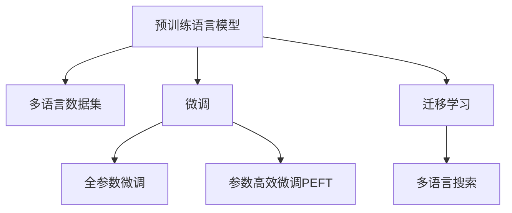

                 

## 1. 背景介绍

全球化电商市场正在迅速发展，商家们希望能扩展到不同语言和地区的用户，提供更广泛的商品和服务。随着消费者越来越习惯使用多语言进行搜索，电商平台面临着多语言搜索支持的巨大挑战。人工智能大模型（如BERT、GPT-3）的兴起为解决这一问题提供了新思路，通过大模型微调，可以构建多语言搜索系统，使平台能够快速处理和响应不同语言的用户查询，提高搜索准确率和用户满意度。

### 1.1 问题由来

尽管近年来人工智能和大数据技术在电商领域得到了广泛应用，但多语言搜索仍然是电商平台的一大痛点。传统方法依赖于昂贵的语言模型训练和多语言数据分析，但成本高、效率低，且无法充分利用现有数据。多语言搜索需求推动了自然语言处理（NLP）领域的研究，特别是大规模预训练语言模型（如BERT、GPT-3）的应用，提供了一种高效、低成本的解决方案。

### 1.2 问题核心关键点

大模型微调是解决多语言搜索问题的关键。通过预训练-微调范式，模型在大量无标签数据上预训练后，使用少量标注数据进行微调，可以迅速适应新语言和任务，提供高质量的多语言搜索服务。

- **预训练：**在大量无标签文本数据上训练模型，学习语言表示和语义理解能力。
- **微调：**在特定语言和任务的少量标注数据上，有监督地微调模型，使其能够理解和生成多语言文本。
- **多语言支持：**通过迁移学习，将一个语言的任务知识迁移到另一个语言，实现多语言搜索支持。

## 2. 核心概念与联系

### 2.1 核心概念概述

为更好地理解基于大模型微调的多语言搜索，本节将介绍几个密切相关的核心概念：

- **预训练语言模型：**如BERT、GPT-3等，通过大规模无标签文本数据进行训练，学习语言表示和语义理解能力。
- **多语言数据集：**包含多种语言的标注数据集，用于微调模型的多语言能力。
- **微调：**在预训练模型的基础上，通过有监督的训练优化模型在特定任务上的性能。
- **迁移学习：**将一个领域学习到的知识，迁移到另一个领域中，以提高模型在新任务上的性能。
- **多语言搜索：**使用自然语言处理技术，帮助用户快速找到他们需要的商品或服务，支持多种语言的搜索请求。

这些核心概念之间的逻辑关系可以通过以下Mermaid流程图来展示：



这个流程图展示了大模型微调的几个关键步骤，包括预训练、多语言数据集准备、微调以及最终的迁移学习和多语言搜索应用。

## 3. 核心算法原理 & 具体操作步骤
### 3.1 算法原理概述

基于大模型微调的多语言搜索支持，利用预训练语言模型和迁移学习技术，在多语言数据集上微调模型，使其能够处理和生成多种语言的搜索请求。该过程分为以下步骤：

1. **预训练：**在大量无标签文本数据上训练模型，学习语言表示和语义理解能力。
2. **多语言数据集准备：**收集和预处理包含多种语言的多语言数据集。
3. **微调：**使用多语言数据集对预训练模型进行微调，使其能够理解和生成多种语言的文本。
4. **迁移学习：**通过迁移学习，将一个语言的任务知识迁移到另一个语言，实现多语言搜索支持。

### 3.2 算法步骤详解

以下是基于大模型微调的多语言搜索支持的具体操作步骤：

**Step 1: 准备预训练模型和多语言数据集**
- **预训练模型选择：**选择适合的预训练语言模型，如BERT、GPT-3等。
- **多语言数据集准备：**收集和预处理包含多种语言的多语言数据集。数据集应涵盖多种语言的常见搜索词和查询类型。

**Step 2: 设计任务适配层**
- **任务定义：**根据多语言搜索任务的特点，设计适当的任务适配层，如分类、匹配、生成等。
- **损失函数：**选择合适的损失函数，如交叉熵、均方误差等，用于评估模型在特定任务上的性能。

**Step 3: 设置微调超参数**
- **学习率：**选择合适的学习率，一般较小，避免破坏预训练权重。
- **批大小：**设置合适的批大小，以提高训练效率。
- **迭代轮数：**设定合适的迭代轮数，以确保模型收敛。

**Step 4: 执行梯度训练**
- **训练集划分：**将数据集划分为训练集、验证集和测试集。
- **模型前向传播：**对训练集数据进行前向传播，计算损失函数。
- **反向传播：**根据损失函数计算梯度，更新模型参数。
- **验证集评估：**在验证集上评估模型性能，根据性能调整超参数。
- **迭代训练：**重复上述步骤，直到模型收敛或达到预设的迭代轮数。

**Step 5: 测试和部署**
- **测试集评估：**在测试集上评估微调后模型的性能，对比微调前后的效果。
- **模型部署：**将模型部署到电商平台中，支持多语言搜索。
- **持续优化：**根据新数据和用户反馈，持续优化模型，提升搜索准确率和用户满意度。

### 3.3 算法优缺点

基于大模型微调的多语言搜索支持有以下优点：
1. **高效性：**相比于从头训练模型，微调方法能够快速适应新任务，显著提高开发效率。
2. **低成本：**微调方法可以使用预训练模型的知识，减少训练成本和时间。
3. **多语言支持：**通过迁移学习，模型可以支持多种语言的搜索，满足不同用户的需求。
4. **性能提升：**微调后的模型能够提升搜索准确率和用户满意度，增强用户体验。

同时，该方法也存在一些局限性：
1. **依赖标注数据：**微调效果取决于标注数据的质量和数量，标注成本较高。
2. **模型泛化能力：**当目标语言与预训练语言差异较大时，模型泛化能力可能受限。
3. **可解释性不足：**微调模型的决策过程难以解释，不利于调试和优化。

尽管存在这些局限性，但基于大模型微调的多语言搜索支持在电商平台中的应用前景广阔，能够显著提升用户搜索体验，降低开发和维护成本。

### 3.4 算法应用领域

基于大模型微调的多语言搜索支持，已经在电商平台中得到了广泛应用，具体包括：

- **搜索推荐：**使用多语言搜索技术，帮助用户快速找到他们需要的商品，提高推荐准确率。
- **用户界面：**支持多语言界面，使不同语言的用户能够方便地使用平台。
- **客户服务：**通过多语言聊天机器人，提供24/7的多语言客服支持。
- **商品描述：**自动翻译商品描述，使非母语用户能够理解商品信息。

此外，多语言搜索支持还扩展到了全球化的物流和金融服务，帮助用户进行国际支付、跨境购物等操作。

## 4. 数学模型和公式 & 详细讲解  
### 4.1 数学模型构建

本节将使用数学语言对基于大模型微调的多语言搜索过程进行更加严格的刻画。

假设预训练语言模型为 $M_{\theta}$，其中 $\theta$ 为预训练得到的模型参数。假设多语言搜索任务 $T$ 的训练集为 $D=\{(x_i, y_i)\}_{i=1}^N, x_i \in \mathcal{X}, y_i \in \mathcal{Y}$，其中 $\mathcal{X}$ 为输入空间，$\mathcal{Y}$ 为输出空间。

定义模型 $M_{\theta}$ 在输入 $x$ 上的损失函数为 $\ell(M_{\theta}(x),y)$，则在数据集 $D$ 上的经验风险为：

$$
\mathcal{L}(\theta) = \frac{1}{N} \sum_{i=1}^N \ell(M_{\theta}(x_i),y_i)
$$

微调的优化目标是最小化经验风险，即找到最优参数：

$$
\theta^* = \mathop{\arg\min}_{\theta} \mathcal{L}(\theta)
$$

在实践中，我们通常使用基于梯度的优化算法（如SGD、Adam等）来近似求解上述最优化问题。设 $\eta$ 为学习率，$\lambda$ 为正则化系数，则参数的更新公式为：

$$
\theta \leftarrow \theta - \eta \nabla_{\theta}\mathcal{L}(\theta) - \eta\lambda\theta
$$

其中 $\nabla_{\theta}\mathcal{L}(\theta)$ 为损失函数对参数 $\theta$ 的梯度，可通过反向传播算法高效计算。

### 4.2 公式推导过程

以下我们以二分类任务为例，推导交叉熵损失函数及其梯度的计算公式。

假设模型 $M_{\theta}$ 在输入 $x$ 上的输出为 $\hat{y}=M_{\theta}(x) \in [0,1]$，表示样本属于正类的概率。真实标签 $y \in \{0,1\}$。则二分类交叉熵损失函数定义为：

$$
\ell(M_{\theta}(x),y) = -[y\log \hat{y} + (1-y)\log (1-\hat{y})]
$$

将其代入经验风险公式，得：

$$
\mathcal{L}(\theta) = -\frac{1}{N}\sum_{i=1}^N [y_i\log M_{\theta}(x_i)+(1-y_i)\log(1-M_{\theta}(x_i))]
$$

根据链式法则，损失函数对参数 $\theta_k$ 的梯度为：

$$
\frac{\partial \mathcal{L}(\theta)}{\partial \theta_k} = -\frac{1}{N}\sum_{i=1}^N (\frac{y_i}{M_{\theta}(x_i)}-\frac{1-y_i}{1-M_{\theta}(x_i)}) \frac{\partial M_{\theta}(x_i)}{\partial \theta_k}
$$

其中 $\frac{\partial M_{\theta}(x_i)}{\partial \theta_k}$ 可进一步递归展开，利用自动微分技术完成计算。

在得到损失函数的梯度后，即可带入参数更新公式，完成模型的迭代优化。重复上述过程直至收敛，最终得到适应下游任务的最优模型参数 $\theta^*$。

## 5. 项目实践：代码实例和详细解释说明
### 5.1 开发环境搭建

在进行多语言搜索支持实践前，我们需要准备好开发环境。以下是使用Python进行PyTorch开发的环境配置流程：

1. 安装Anaconda：从官网下载并安装Anaconda，用于创建独立的Python环境。

2. 创建并激活虚拟环境：
```bash
conda create -n pytorch-env python=3.8 
conda activate pytorch-env
```

3. 安装PyTorch：根据CUDA版本，从官网获取对应的安装命令。例如：
```bash
conda install pytorch torchvision torchaudio cudatoolkit=11.1 -c pytorch -c conda-forge
```

4. 安装Transformers库：
```bash
pip install transformers
```

5. 安装各类工具包：
```bash
pip install numpy pandas scikit-learn matplotlib tqdm jupyter notebook ipython
```

完成上述步骤后，即可在`pytorch-env`环境中开始多语言搜索支持的微调实践。

### 5.2 源代码详细实现

下面我们以二分类任务为例，给出使用Transformers库对BERT模型进行微调的PyTorch代码实现。

首先，定义多语言搜索任务的数据处理函数：

```python
from transformers import BertTokenizer
from torch.utils.data import Dataset
import torch

class MultilingualSearchDataset(Dataset):
    def __init__(self, texts, labels, tokenizer, max_len=128):
        self.texts = texts
        self.labels = labels
        self.tokenizer = tokenizer
        self.max_len = max_len
        
    def __len__(self):
        return len(self.texts)
    
    def __getitem__(self, item):
        text = self.texts[item]
        label = self.labels[item]
        
        encoding = self.tokenizer(text, return_tensors='pt', max_length=self.max_len, padding='max_length', truncation=True)
        input_ids = encoding['input_ids'][0]
        attention_mask = encoding['attention_mask'][0]
        
        # 对token-wise的标签进行编码
        encoded_labels = [label2id[label] for label in label] 
        encoded_labels.extend([label2id['O']] * (self.max_len - len(encoded_labels)))
        labels = torch.tensor(encoded_labels, dtype=torch.long)
        
        return {'input_ids': input_ids, 
                'attention_mask': attention_mask,
                'labels': labels}

# 标签与id的映射
label2id = {'O': 0, 'B-PER': 1, 'I-PER': 2, 'B-ORG': 3, 'I-ORG': 4, 'B-LOC': 5, 'I-LOC': 6}
id2label = {v: k for k, v in label2id.items()}

# 创建dataset
tokenizer = BertTokenizer.from_pretrained('bert-base-cased')

train_dataset = MultilingualSearchDataset(train_texts, train_labels, tokenizer)
dev_dataset = MultilingualSearchDataset(dev_texts, dev_labels, tokenizer)
test_dataset = MultilingualSearchDataset(test_texts, test_labels, tokenizer)
```

然后，定义模型和优化器：

```python
from transformers import BertForTokenClassification, AdamW

model = BertForTokenClassification.from_pretrained('bert-base-cased', num_labels=len(label2id))

optimizer = AdamW(model.parameters(), lr=2e-5)
```

接着，定义训练和评估函数：

```python
from torch.utils.data import DataLoader
from tqdm import tqdm
from sklearn.metrics import classification_report

device = torch.device('cuda') if torch.cuda.is_available() else torch.device('cpu')
model.to(device)

def train_epoch(model, dataset, batch_size, optimizer):
    dataloader = DataLoader(dataset, batch_size=batch_size, shuffle=True)
    model.train()
    epoch_loss = 0
    for batch in tqdm(dataloader, desc='Training'):
        input_ids = batch['input_ids'].to(device)
        attention_mask = batch['attention_mask'].to(device)
        labels = batch['labels'].to(device)
        model.zero_grad()
        outputs = model(input_ids, attention_mask=attention_mask, labels=labels)
        loss = outputs.loss
        epoch_loss += loss.item()
        loss.backward()
        optimizer.step()
    return epoch_loss / len(dataloader)

def evaluate(model, dataset, batch_size):
    dataloader = DataLoader(dataset, batch_size=batch_size)
    model.eval()
    preds, labels = [], []
    with torch.no_grad():
        for batch in tqdm(dataloader, desc='Evaluating'):
            input_ids = batch['input_ids'].to(device)
            attention_mask = batch['attention_mask'].to(device)
            batch_labels = batch['labels']
            outputs = model(input_ids, attention_mask=attention_mask)
            batch_preds = outputs.logits.argmax(dim=2).to('cpu').tolist()
            batch_labels = batch_labels.to('cpu').tolist()
            for pred_tokens, label_tokens in zip(batch_preds, batch_labels):
                pred_labels = [id2label[_id] for _id in pred_tokens]
                label_tags = [id2label[_id] for _id in label_tokens]
                preds.append(pred_labels[:len(label_tokens)])
                labels.append(label_tags)
                
    print(classification_report(labels, preds))
```

最后，启动训练流程并在测试集上评估：

```python
epochs = 5
batch_size = 16

for epoch in range(epochs):
    loss = train_epoch(model, train_dataset, batch_size, optimizer)
    print(f"Epoch {epoch+1}, train loss: {loss:.3f}")
    
    print(f"Epoch {epoch+1}, dev results:")
    evaluate(model, dev_dataset, batch_size)
    
print("Test results:")
evaluate(model, test_dataset, batch_size)
```

以上就是使用PyTorch对BERT进行多语言搜索任务微调的完整代码实现。可以看到，得益于Transformers库的强大封装，我们可以用相对简洁的代码完成BERT模型的加载和微调。

### 5.3 代码解读与分析

让我们再详细解读一下关键代码的实现细节：

**MultilingualSearchDataset类**：
- `__init__`方法：初始化文本、标签、分词器等关键组件。
- `__len__`方法：返回数据集的样本数量。
- `__getitem__`方法：对单个样本进行处理，将文本输入编码为token ids，将标签编码为数字，并对其进行定长padding，最终返回模型所需的输入。

**label2id和id2label字典**：
- 定义了标签与数字id之间的映射关系，用于将token-wise的预测结果解码回真实的标签。

**训练和评估函数**：
- 使用PyTorch的DataLoader对数据集进行批次化加载，供模型训练和推理使用。
- 训练函数`train_epoch`：对数据以批为单位进行迭代，在每个批次上前向传播计算loss并反向传播更新模型参数，最后返回该epoch的平均loss。
- 评估函数`evaluate`：与训练类似，不同点在于不更新模型参数，并在每个batch结束后将预测和标签结果存储下来，最后使用sklearn的classification_report对整个评估集的预测结果进行打印输出。

**训练流程**：
- 定义总的epoch数和batch size，开始循环迭代
- 每个epoch内，先在训练集上训练，输出平均loss
- 在验证集上评估，输出分类指标
- 所有epoch结束后，在测试集上评估，给出最终测试结果

可以看到，PyTorch配合Transformers库使得BERT微调的代码实现变得简洁高效。开发者可以将更多精力放在数据处理、模型改进等高层逻辑上，而不必过多关注底层的实现细节。

当然，工业级的系统实现还需考虑更多因素，如模型的保存和部署、超参数的自动搜索、更灵活的任务适配层等。但核心的微调范式基本与此类似。

## 6. 实际应用场景
### 6.1 智能客服系统

基于大模型微调的多语言搜索技术，可以广泛应用于智能客服系统的构建。传统客服往往需要配备大量人力，高峰期响应缓慢，且一致性和专业性难以保证。而使用微调后的多语言搜索技术，可以7x24小时不间断服务，快速响应客户咨询，用自然流畅的语言解答各类常见问题。

在技术实现上，可以收集企业内部的历史客服对话记录，将问题和最佳答复构建成监督数据，在此基础上对预训练语言模型进行微调。微调后的多语言搜索技术能够自动理解用户意图，匹配最合适的答案模板进行回复。对于客户提出的新问题，还可以接入检索系统实时搜索相关内容，动态组织生成回答。如此构建的智能客服系统，能大幅提升客户咨询体验和问题解决效率。

### 6.2 全球化营销

电商平台在全球化营销中面临多语言搜索的挑战。使用基于大模型微调的多语言搜索技术，能够快速响应不同语言的搜索请求，提高用户体验和平台的多语言支持能力。

在实际应用中，平台可以收集全球用户的搜索数据，并根据这些数据对多语言搜索模型进行微调。微调后的模型能够识别不同语言的用户需求，并提供相应的搜索结果，帮助用户快速找到所需的商品或服务。

### 6.3 多语言社区

社交媒体平台和论坛需要支持多语言社区的搜索功能，使不同语言的用户能够方便地搜索和浏览内容。使用基于大模型微调的多语言搜索技术，可以满足多语言社区的需求，提升平台的全球化覆盖范围。

平台可以收集不同语言的用户搜索数据，并根据这些数据对多语言搜索模型进行微调。微调后的模型能够理解不同语言的查询意图，并提供相应的搜索结果，使多语言社区的用户能够快速找到感兴趣的内容。

### 6.4 未来应用展望

随着大模型微调技术的不断发展，基于多语言搜索支持的应用场景将不断拓展。

在智慧医疗领域，基于多语言搜索支持的医疗问答、病历分析、药物研发等应用将提升医疗服务的智能化水平，辅助医生诊疗，加速新药开发进程。

在智能教育领域，基于多语言搜索支持的学习资源搜索、知识推荐等应用，因材施教，促进教育公平，提高教学质量。

在智慧城市治理中，基于多语言搜索支持的舆情分析、事件监测、应急指挥等环节，提高城市管理的自动化和智能化水平，构建更安全、高效的未来城市。

此外，在企业生产、社会治理、文娱传媒等众多领域，基于大模型微调的多语言搜索技术也将不断涌现，为NLP技术带来了全新的突破。

## 7. 工具和资源推荐
### 7.1 学习资源推荐

为了帮助开发者系统掌握大模型微调的多语言搜索技术，这里推荐一些优质的学习资源：

1. 《Transformer from Principle to Practice》系列博文：由大模型技术专家撰写，深入浅出地介绍了Transformer原理、BERT模型、多语言搜索技术等前沿话题。

2. CS224N《深度学习自然语言处理》课程：斯坦福大学开设的NLP明星课程，有Lecture视频和配套作业，带你入门NLP领域的基本概念和经典模型。

3. 《Natural Language Processing with Transformers》书籍：Transformers库的作者所著，全面介绍了如何使用Transformers库进行NLP任务开发，包括多语言搜索在内的诸多范式。

4. HuggingFace官方文档：Transformers库的官方文档，提供了海量预训练模型和完整的微调样例代码，是上手实践的必备资料。

5. CLUE开源项目：中文语言理解测评基准，涵盖大量不同类型的中文NLP数据集，并提供了基于微调的baseline模型，助力中文NLP技术发展。

通过对这些资源的学习实践，相信你一定能够快速掌握大模型微调的多语言搜索技术的精髓，并用于解决实际的NLP问题。
###  7.2 开发工具推荐

高效的开发离不开优秀的工具支持。以下是几款用于大模型微调的多语言搜索开发的常用工具：

1. PyTorch：基于Python的开源深度学习框架，灵活动态的计算图，适合快速迭代研究。大部分预训练语言模型都有PyTorch版本的实现。

2. TensorFlow：由Google主导开发的开源深度学习框架，生产部署方便，适合大规模工程应用。同样有丰富的预训练语言模型资源。

3. Transformers库：HuggingFace开发的NLP工具库，集成了众多SOTA语言模型，支持PyTorch和TensorFlow，是进行多语言搜索微调开发的利器。

4. Weights & Biases：模型训练的实验跟踪工具，可以记录和可视化模型训练过程中的各项指标，方便对比和调优。与主流深度学习框架无缝集成。

5. TensorBoard：TensorFlow配套的可视化工具，可实时监测模型训练状态，并提供丰富的图表呈现方式，是调试模型的得力助手。

6. Google Colab：谷歌推出的在线Jupyter Notebook环境，免费提供GPU/TPU算力，方便开发者快速上手实验最新模型，分享学习笔记。

合理利用这些工具，可以显著提升大模型微调的多语言搜索任务的开发效率，加快创新迭代的步伐。

### 7.3 相关论文推荐

大模型微调的多语言搜索技术的发展源于学界的持续研究。以下是几篇奠基性的相关论文，推荐阅读：

1. Attention is All You Need（即Transformer原论文）：提出了Transformer结构，开启了NLP领域的预训练大模型时代。

2. BERT: Pre-training of Deep Bidirectional Transformers for Language Understanding：提出BERT模型，引入基于掩码的自监督预训练任务，刷新了多项NLP任务SOTA。

3. Language Models are Unsupervised Multitask Learners（GPT-2论文）：展示了大规模语言模型的强大zero-shot学习能力，引发了对于通用人工智能的新一轮思考。

4. Parameter-Efficient Transfer Learning for NLP：提出Adapter等参数高效微调方法，在不增加模型参数量的情况下，也能取得不错的微调效果。

5. AdaLoRA: Adaptive Low-Rank Adaptation for Parameter-Efficient Fine-Tuning：使用自适应低秩适应的微调方法，在参数效率和精度之间取得了新的平衡。

6. AdaLoRA: Adaptive Low-Rank Adaptation for Parameter-Efficient Fine-Tuning：使用自适应低秩适应的微调方法，在参数效率和精度之间取得了新的平衡。

这些论文代表了大模型微调的多语言搜索技术的发展脉络。通过学习这些前沿成果，可以帮助研究者把握学科前进方向，激发更多的创新灵感。

## 8. 总结：未来发展趋势与挑战
### 8.1 总结

本文对基于大模型微调的多语言搜索支持进行了全面系统的介绍。首先阐述了多语言搜索需求的背景和挑战，明确了多语言搜索在大电商、全球化营销、社交媒体等多个领域的应用意义。其次，从原理到实践，详细讲解了大模型微调的多语言搜索过程，给出了微调任务开发的完整代码实例。同时，本文还探讨了多语言搜索支持在智能客服、全球化营销、多语言社区等实际应用场景中的广泛应用，展示了多语言搜索支持的巨大潜力。

通过本文的系统梳理，可以看到，基于大模型微调的多语言搜索支持正在成为电商平台的重要范式，极大地提升平台的用户搜索体验，降低开发和维护成本。未来，伴随大模型微调技术的持续演进，基于多语言搜索支持的应用场景还将不断拓展，为全球化电商市场带来全新的变革。

### 8.2 未来发展趋势

展望未来，基于大模型微调的多语言搜索技术将呈现以下几个发展趋势：

1. **模型规模持续增大：**随着算力成本的下降和数据规模的扩张，预训练语言模型的参数量还将持续增长。超大规模语言模型蕴含的丰富语言知识，有望支撑更加复杂多变的下游任务微调。

2. **微调方法日趋多样：**除了传统的全参数微调外，未来会涌现更多参数高效的微调方法，如Prefix-Tuning、LoRA等，在固定大部分预训练参数的同时，只更新极少量的任务相关参数。

3. **持续学习成为常态：**随着数据分布的不断变化，微调模型也需要持续学习新知识以保持性能。如何在不遗忘原有知识的同时，高效吸收新样本信息，将成为重要的研究课题。

4. **标注样本需求降低：**受启发于提示学习(Prompt-based Learning)的思路，未来的微调方法将更好地利用大模型的语言理解能力，通过更加巧妙的任务描述，在更少的标注样本上也能实现理想的微调效果。

5. **多模态微调崛起：**当前的微调主要聚焦于纯文本数据，未来会进一步拓展到图像、视频、语音等多模态数据微调。多模态信息的融合，将显著提升语言模型对现实世界的理解和建模能力。

6. **通用性增强：**经过海量数据的预训练和多领域任务的微调，未来的语言模型将具备更强大的常识推理和跨领域迁移能力，逐步迈向通用人工智能(AGI)的目标。

以上趋势凸显了大模型微调的多语言搜索技术的广阔前景。这些方向的探索发展，必将进一步提升平台的用户搜索体验，降低开发和维护成本。

### 8.3 面临的挑战

尽管基于大模型微调的多语言搜索支持已经取得了瞩目成就，但在迈向更加智能化、普适化应用的过程中，它仍面临着诸多挑战：

1. **标注成本瓶颈：**微调效果取决于标注数据的质量和数量，标注成本较高。如何进一步降低微调对标注样本的依赖，将是一大难题。

2. **模型鲁棒性不足：**当目标语言与预训练语言差异较大时，模型泛化能力可能受限。对于测试样本的微小扰动，微调模型的预测也容易发生波动。

3. **推理效率有待提高：**大规模语言模型虽然精度高，但在实际部署时往往面临推理速度慢、内存占用大等效率问题。

4. **可解释性不足：**微调模型的决策过程难以解释，不利于调试和优化。

5. **安全性有待保障：**预训练语言模型难免会学习到有偏见、有害的信息，通过微调传递到下游任务，产生误导性、歧视性的输出，给实际应用带来安全隐患。

6. **知识整合能力不足：**现有的微调模型往往局限于任务内数据，难以灵活吸收和运用更广泛的先验知识。如何让微调过程更好地与外部知识库、规则库等专家知识结合，形成更加全面、准确的信息整合能力，还有很大的想象空间。

正视多语言搜索支持面临的这些挑战，积极应对并寻求突破，将是大模型微调技术迈向成熟的必由之路。

### 8.4 研究展望

面向未来，大模型微调的多语言搜索支持技术的研究需要在以下几个方面寻求新的突破：

1. **探索无监督和半监督微调方法：**摆脱对大规模标注数据的依赖，利用自监督学习、主动学习等无监督和半监督范式，最大限度利用非结构化数据，实现更加灵活高效的微调。

2. **研究参数高效和计算高效的微调范式：**开发更加参数高效的微调方法，在固定大部分预训练参数的同时，只更新极少量的任务相关参数。同时优化微调模型的计算图，减少前向传播和反向传播的资源消耗，实现更加轻量级、实时性的部署。

3. **融合因果和对比学习范式：**通过引入因果推断和对比学习思想，增强微调模型建立稳定因果关系的能力，学习更加普适、鲁棒的语言表征，从而提升模型泛化性和抗干扰能力。

4. **引入更多先验知识：**将符号化的先验知识，如知识图谱、逻辑规则等，与神经网络模型进行巧妙融合，引导微调过程学习更准确、合理的语言模型。同时加强不同模态数据的整合，实现视觉、语音等多模态信息与文本信息的协同建模。

5. **结合因果分析和博弈论工具：**将因果分析方法引入微调模型，识别出模型决策的关键特征，增强输出解释的因果性和逻辑性。借助博弈论工具刻画人机交互过程，主动探索并规避模型的脆弱点，提高系统稳定性。

6. **纳入伦理道德约束：**在模型训练目标中引入伦理导向的评估指标，过滤和惩罚有偏见、有害的输出倾向。同时加强人工干预和审核，建立模型行为的监管机制，确保输出符合人类价值观和伦理道德。

这些研究方向的探索，必将引领大模型微调的多语言搜索技术迈向更高的台阶，为构建安全、可靠、可解释、可控的智能系统铺平道路。面向未来，大模型微调的多语言搜索技术还需要与其他人工智能技术进行更深入的融合，如知识表示、因果推理、强化学习等，多路径协同发力，共同推动自然语言理解和智能交互系统的进步。只有勇于创新、敢于突破，才能不断拓展语言模型的边界，让智能技术更好地造福人类社会。

## 9. 附录：常见问题与解答

**Q1：大模型微调是否适用于所有NLP任务？**

A: 大模型微调在大多数NLP任务上都能取得不错的效果，特别是对于数据量较小的任务。但对于一些特定领域的任务，如医学、法律等，仅仅依靠通用语料预训练的模型可能难以很好地适应。此时需要在特定领域语料上进一步预训练，再进行微调，才能获得理想效果。此外，对于一些需要时效性、个性化很强的任务，如对话、推荐等，微调方法也需要针对性的改进优化。

**Q2：如何选择合适的学习率？**

A: 微调的学习率一般要比预训练时小1-2个数量级，如果使用过大的学习率，容易破坏预训练权重，导致过拟合。一般建议从1e-5开始调参，逐步减小学习率，直至收敛。也可以使用warmup策略，在开始阶段使用较小的学习率，再逐渐过渡到预设值。需要注意的是，不同的优化器(如AdamW、Adafactor等)以及不同的学习率调度策略，可能需要设置不同的学习率阈值。

**Q3：采用大模型微调时会面临哪些资源瓶颈？**

A: 目前主流的预训练大模型动辄以亿计的参数规模，对算力、内存、存储都提出了很高的要求。GPU/TPU等高性能设备是必不可少的，但即便如此，超大批次的训练和推理也可能遇到显存不足的问题。因此需要采用一些资源优化技术，如梯度积累、混合精度训练、模型并行等，来突破硬件瓶颈。同时，模型的存储和读取也可能占用大量时间和空间，需要采用模型压缩、稀疏化存储等方法进行优化。

**Q4：如何缓解微调过程中的过拟合问题？**

A: 过拟合是微调面临的主要挑战，尤其是在标注数据不足的情况下。常见的缓解策略包括：
1. 数据增强：通过回译、近义替换等方式扩充训练集
2. 正则化：使用L2正则、Dropout、Early Stopping等避免过拟合
3. 对抗训练：引入对抗样本，提高模型鲁棒性
4. 参数高效微调：只调整少量参数(如Adapter、Prefix等)，减小过拟合风险
5. 多模型集成：训练多个微调模型，取平均输出，抑制过拟合

这些策略往往需要根据具体任务和数据特点进行灵活组合。只有在数据、模型、训练、推理等各环节进行全面优化，才能最大限度地发挥大模型微调的威力。

**Q5：微调模型在落地部署时需要注意哪些问题？**

A: 将微调模型转化为实际应用，还需要考虑以下因素：
1. 模型裁剪：去除不必要的层和参数，减小模型尺寸，加快推理速度
2. 量化加速：将浮点模型转为定点模型，压缩存储空间，提高计算效率
3. 服务化封装：将模型封装为标准化服务接口，便于集成调用
4. 弹性伸缩：根据请求流量动态调整资源配置，平衡服务质量和成本
5. 监控告警：实时采集系统指标，设置异常告警阈值，确保服务稳定性
6. 安全防护：采用访问鉴权、数据脱敏等措施，保障数据和模型安全

大模型微调的多语言搜索支持为NLP应用开启了广阔的想象空间，但如何将强大的性能转化为稳定、高效、安全的业务价值，还需要工程实践的不断打磨。唯有从数据、算法、工程、业务等多个维度协同发力，才能真正实现人工智能技术在垂直行业的规模化落地。总之，微调需要开发者根据具体任务，不断迭代和优化模型、数据和算法，方能得到理想的效果。

---

作者：禅与计算机程序设计艺术 / Zen and the Art of Computer Programming

