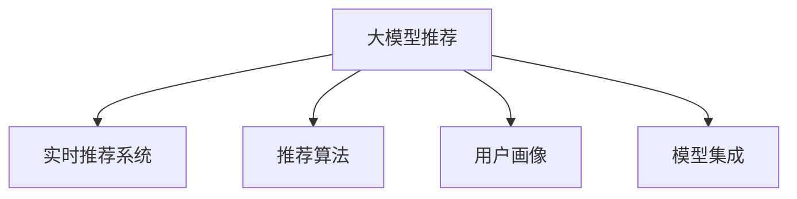

                 

# 电商平台中AI大模型的实时推荐技术

## 1. 背景介绍

在现代电商平台上，商品种类繁多，信息爆炸，消费者难以在短时间内找到满足需求的产品。为了提升用户体验，电商平台纷纷引入AI推荐技术，帮助用户快速锁定目标商品。其中，AI大模型推荐技术通过深度学习和大规模数据训练，能够分析用户行为数据和商品特征，构建用户画像，生成个性化的推荐列表，大大提升了购物的效率和满意度。

### 1.1 问题由来

尽管AI推荐技术在电商平台已经得到广泛应用，但其推荐效果往往受到数据质量、模型复杂度和计算资源等因素的限制。特别是在用户行为数据稀缺、用户画像不完善的情况下，传统的基于用户-商品矩阵的协同过滤算法（CF）难以取得理想的效果。此外，现有的大模型推荐系统通常缺乏实时性，无法根据用户即时行为和市场变化进行动态调整，导致推荐结果滞后于用户需求。因此，研究如何构建高效、精准、实时的AI大模型推荐系统，成为电商平台提高用户转化率和用户满意度的关键。

### 1.2 问题核心关键点

AI大模型推荐技术的核心在于以下几个方面：

- **实时性**：能够在用户交互的过程中动态更新推荐模型，适应用户即时需求和市场变化。
- **个性化**：通过深度学习和大数据，构建用户画像，生成个性化的推荐结果，提升用户满意度。
- **高效性**：利用GPU/TPU等高性能设备，加速模型训练和推理过程，满足电商平台高并发访问的需求。
- **鲁棒性**：具备较好的泛化能力，能够应对长尾商品和异常数据，提升推荐系统的稳定性和可靠性。

## 2. 核心概念与联系

### 2.1 核心概念概述

- **大模型推荐**：以大规模预训练语言模型为基础，通过微调训练生成推荐模型的技术。大模型推荐通常基于Transformer架构，通过自监督预训练和有监督微调，学习用户行为和商品特征之间的复杂关系。
- **实时推荐系统**：指在用户浏览、点击、购买等行为发生的实时过程中，动态生成个性化推荐列表的技术。实时推荐系统通常需要高性能计算设备和低延迟算法支持，以实现快速响应用户需求。
- **推荐算法**：指用于生成推荐结果的各类算法，如协同过滤、基于内容的推荐、混合推荐等。推荐算法是推荐系统实现的核心技术之一。
- **用户画像**：通过分析用户行为数据和商品特征，构建用户兴趣、偏好、购买力等特征，为推荐系统提供个性化输入。用户画像在实时推荐中起到重要的决策支撑作用。
- **模型集成**：指将多个推荐模型的结果进行融合，取长补短，提升整体推荐效果。模型集成是提升推荐系统性能和鲁棒性的重要手段。

这些核心概念通过一个简单的Mermaid流程图展示了它们之间的关系：



## 3. 核心算法原理 & 具体操作步骤
### 3.1 算法原理概述

AI大模型推荐技术的原理基于深度学习和大规模数据训练，核心在于构建用户画像和商品特征的表示，并在此基础上设计推荐模型。其中，基于Transformer的预训练-微调范式是最常用的一种方法。

- **预训练**：使用大规模无标签文本数据对语言模型进行预训练，学习语言知识，构建良好的特征表示能力。
- **微调**：利用有标注数据对预训练模型进行微调，学习用户行为和商品特征之间的映射关系。
- **推荐模型设计**：在微调后的模型基础上，设计推荐算法和用户画像，构建实时推荐系统。

### 3.2 算法步骤详解

基于Transformer的大模型推荐系统一般包括以下步骤：

**Step 1: 准备数据和环境**
- 收集电商平台用户行为数据，包括点击、浏览、购买等行为。
- 选择合适的预训练语言模型，如BERT、GPT等，下载并导入到计算环境。
- 安装推荐系统开发所需的工具包，如TensorFlow、PyTorch、Keras等。

**Step 2: 数据预处理**
- 对原始用户行为数据进行清洗、去重和归一化处理，形成结构化数据集。
- 对用户画像数据进行特征工程，提取有用的特征。
- 将用户行为数据和商品特征数据拼接成Tensor格式，用于后续模型训练。

**Step 3: 设计推荐模型**
- 基于预训练语言模型，设计推荐模型的架构，如U型结构、残差连接等。
- 选择推荐算法，如基于内容的推荐、协同过滤等。
- 设计用户画像，利用文本、行为等数据构建用户兴趣、偏好等特征。

**Step 4: 微调模型**
- 将用户行为数据和商品特征数据作为输入，进行模型微调。
- 设置合适的学习率、批大小和迭代轮数。
- 应用正则化技术，防止过拟合。

**Step 5: 实时推荐**
- 部署微调后的推荐模型到服务器。
- 实时收集用户行为数据，动态更新推荐结果。
- 使用缓存、负载均衡等技术提升系统响应速度。

**Step 6: 效果评估**
- 在测试数据集上评估推荐模型的性能。
- 分析推荐结果的准确性、多样性和个性化。
- 根据评估结果进行模型调优。

### 3.3 算法优缺点

基于Transformer的大模型推荐系统具有以下优点：

- **高效性**：使用GPU/TPU等高性能设备，加速模型训练和推理过程。
- **泛化性强**：预训练模型具有较强的泛化能力，可以适应多种推荐场景。
- **实时性**：能够实时响应用户行为和市场变化，生成个性化推荐。

同时，该方法也存在一些局限：

- **数据依赖**：依赖于大规模用户行为数据和商品特征数据，数据稀缺时难以构建有效的用户画像。
- **模型复杂**：大模型结构复杂，计算资源需求高，需要高性能计算设备。
- **解释性不足**：推荐模型通常被视为"黑盒"系统，难以解释推荐结果的生成逻辑。

## 4. 数学模型和公式 & 详细讲解 & 举例说明

### 4.1 数学模型构建

大模型推荐系统通常基于Transformer架构，利用自监督预训练和有监督微调学习用户行为和商品特征之间的关系。以BERT为例，其数学模型如下：

$$
L_{pred} = \sum_{i=1}^N \ell(y_i, \hat{y}_i)
$$

其中，$y_i$为真实标签，$\hat{y}_i$为模型预测结果，$\ell$为损失函数（如交叉熵）。

### 4.2 公式推导过程

BERT模型的预训练任务包括掩码语言模型(Masked Language Model, MLM)和下一句预测(Next Sentence Prediction, NSP)。MLM任务通过随机掩码部分输入文本，预测被掩码的单词，学习词语上下文关系。NSP任务通过预测两个句子是否相连，学习句子顺序关系。

以MLM任务为例，其公式推导如下：

设输入序列为$x=[x_1, x_2, \dots, x_n]$，其中$x_i$表示第$i$个单词。随机掩码部分单词后，得到掩码后的序列$y=[y_1, y_2, \dots, y_n]$。掩码后，模型预测每个单词被掩码的概率，构成预测序列$\hat{y}$。目标函数为：

$$
L_{mlm}(x, y) = -\frac{1}{N} \sum_{i=1}^N \log P(x_i|x_{1:i-1}, \hat{y})
$$

其中，$P(x_i|x_{1:i-1}, \hat{y})$为预测概率。

### 4.3 案例分析与讲解

以电商平台商品推荐为例，假设商品特征向量为$\textbf{f}$，用户行为数据向量为$\textbf{b}$，用户画像向量为$\textbf{u}$，模型预测向量为$\textbf{p}$。模型训练过程如下：

1. 将用户行为数据和商品特征数据拼接成Tensor格式，输入到BERT模型进行编码。
2. 将编码后的特征输入到推荐模型进行预测，得到商品推荐向量$\textbf{p}$。
3. 根据用户画像$\textbf{u}$，计算推荐向量与用户画像之间的相似度，得到推荐得分。
4. 根据得分从商品库中选取前$k$个商品作为推荐结果。

## 5. 项目实践：代码实例和详细解释说明
### 5.1 开发环境搭建

在进行项目实践前，需要先搭建好开发环境。以下是Python环境搭建的步骤：

1. 安装Anaconda：从官网下载并安装Anaconda，用于创建独立的Python环境。

2. 创建并激活虚拟环境：
```bash
conda create -n ecommerce-env python=3.8 
conda activate ecommerce-env
```

3. 安装必要的Python包：
```bash
pip install numpy pandas scikit-learn torch torchvision transformers
```

4. 安装推荐的工具包和库：
```bash
pip install torchtext
```

5. 安装GPU驱动和CUDA工具包：
```bash
conda install pytorch torchtext cudatoolkit=11.1 -c pytorch -c conda-forge
```

完成上述步骤后，即可在`ecommerce-env`环境中开始项目实践。

### 5.2 源代码详细实现

以下是一个基于BERT模型的电商平台实时推荐系统的示例代码：

```python
import torch
from transformers import BertTokenizer, BertModel

# 初始化BERT模型和分词器
tokenizer = BertTokenizer.from_pretrained('bert-base-uncased')
model = BertModel.from_pretrained('bert-base-uncased')

# 加载用户行为数据
user_behavior = pd.read_csv('user_behavior.csv')

# 加载商品特征数据
item_features = pd.read_csv('item_features.csv')

# 构建推荐模型
def build_recommender():
    model = BertModel.from_pretrained('bert-base-uncased')
    tokenizer = BertTokenizer.from_pretrained('bert-base-uncased')
    return model, tokenizer

# 预测商品推荐得分
def predict_score(model, tokenizer, user_behavior, item_features):
    user_data = []
    item_data = []
    
    # 分批次处理数据
    for i in range(0, len(user_behavior), 16):
        user_batch = user_behavior.iloc[i:i+16]['query'].tolist()
        item_batch = item_features.iloc[i:i+16]['features'].tolist()
        
        # 构建输入张量
        input_ids = tokenizer(user_batch, return_tensors='pt', padding='max_length', truncation=True)
        features = input_ids['input_ids']
        mask = input_ids['attention_mask']
        
        # 进行编码和预测
        with torch.no_grad():
            outputs = model(features, attention_mask=mask)
            last_hidden_states = outputs[0]
        
        # 计算推荐得分
        scores = torch.matmul(last_hidden_states, item_features['features'].values.reshape(1,-1).float()).flatten().tolist()
        
        user_data.extend(scores)
    
    return user_data

# 加载模型并进行预测
model, tokenizer = build_recommender()
scores = predict_score(model, tokenizer, user_behavior, item_features)

# 输出推荐结果
top_k = 10
recommendations = sorted(scores, reverse=True)[:top_k]
print('Top 10 Recommendations:', recommendations)
```

### 5.3 代码解读与分析

让我们再详细解读一下代码实现的关键部分：

**构建推荐模型**：
- 使用BERT模型和分词器，构建推荐模型。

**预测商品推荐得分**：
- 将用户行为数据和商品特征数据分批次输入模型，进行编码和预测，计算推荐得分。

**输出推荐结果**：
- 根据得分排序，选取前$k$个商品作为推荐结果。

**代码优化**：
- 使用Tensor、Pandas等高效数据处理工具，提升代码运行效率。
- 使用GPU加速计算，提升模型训练和推理速度。
- 使用缓存技术，减少重复计算，优化系统响应速度。

## 6. 实际应用场景
### 6.1 智能客服系统

基于AI大模型的实时推荐技术，可以应用于智能客服系统的构建。传统客服往往需要配备大量人力，高峰期响应缓慢，且一致性和专业性难以保证。而使用实时推荐技术，可以自动匹配用户需求和商品信息，提供即时准确的解决方案，提升客户满意度。

在技术实现上，可以收集用户历史咨询记录和商品信息，将问题和最佳答复构建成监督数据，在此基础上对预训练模型进行微调。微调后的推荐模型能够自动理解用户意图，匹配最合适的商品和解决方案，实现个性化客户服务。

### 6.2 个性化推荐系统

实时推荐技术在个性化推荐系统中也有广泛应用。现有的推荐系统往往难以捕捉用户动态变化的需求，实时推荐系统可以动态更新用户画像，根据用户的即时行为生成个性化的推荐列表，提升用户体验。

在具体应用中，可以结合商品分类、用户画像等特征，设计实时推荐算法，如基于内容的推荐、协同过滤等，生成更精准的推荐结果。同时，利用缓存技术，减少重复计算，提升系统响应速度。

### 6.3 智能广告投放

实时推荐技术还可以应用于智能广告投放中。电商平台可以通过分析用户行为数据和商品特征，构建用户画像，实时推荐最适合的广告内容。例如，可以根据用户的浏览历史和购买记录，推荐相关的商品广告或促销活动，提升广告投放效果和转化率。

## 7. 工具和资源推荐
### 7.1 学习资源推荐

为了帮助开发者系统掌握AI大模型的实时推荐技术，这里推荐一些优质的学习资源：

1. 《深度学习推荐系统》系列博文：深入浅出地介绍了推荐系统的工作原理和前沿技术，涵盖协同过滤、基于内容的推荐、混合推荐等。

2. 《推荐系统实战》课程：由知名推荐系统专家授课，涵盖推荐系统设计、模型训练、特征工程等实用技能。

3. 《推荐系统入门与实战》书籍：全面介绍了推荐系统从理论到实践的完整流程，包括算法、技术栈等。

4. 《TensorFlow推荐系统实战》：基于TensorFlow框架，提供从数据处理到模型训练的完整代码实现。

5. HuggingFace官方文档：详细介绍了BERT、GPT等预训练模型的使用方法，并提供了丰富的推荐系统开发样例。

通过对这些资源的学习实践，相信你一定能够快速掌握AI大模型的实时推荐技术，并用于解决实际的推荐问题。

### 7.2 开发工具推荐

高效的开发离不开优秀的工具支持。以下是几款用于AI大模型实时推荐系统开发的常用工具：

1. TensorFlow：基于Python的开源深度学习框架，生产部署方便，适合大规模工程应用。

2. PyTorch：基于Python的开源深度学习框架，灵活的计算图设计，适合快速迭代研究。

3. HuggingFace Transformers库：提供预训练语言模型的封装，方便快速实现推荐系统。

4. Keras：基于TensorFlow和Theano的高层次深度学习框架，易于上手，适合快速原型设计。

5. TensorBoard：TensorFlow配套的可视化工具，可实时监测模型训练状态，提供丰富的图表呈现方式。

6. Google Colab：谷歌推出的在线Jupyter Notebook环境，免费提供GPU/TPU算力，方便快速实验和分享学习笔记。

合理利用这些工具，可以显著提升AI大模型实时推荐系统的开发效率，加快创新迭代的步伐。

### 7.3 相关论文推荐

AI大模型实时推荐技术的发展源于学界的持续研究。以下是几篇奠基性的相关论文，推荐阅读：

1. Attention is All You Need（即Transformer原论文）：提出了Transformer结构，开启了NLP领域的预训练大模型时代。

2. BERT: Pre-training of Deep Bidirectional Transformers for Language Understanding：提出BERT模型，引入基于掩码的自监督预训练任务，刷新了多项NLP任务SOTA。

3. DIN: Deep Interest Network：提出了一种基于兴趣网络推荐模型，适用于电商平台商品推荐。

4. HAT: Hybrid Attention Transformer：提出了一种混合注意力机制的推荐模型，兼顾局部和全局信息。

5. GRU4Rec：提出了一种基于Gated Recurrent Unit的推荐模型，适用于序列数据推荐。

6. NCF: Neural Collaborative Filtering：提出了一种基于神经网络的协同过滤推荐模型，适用于隐式反馈数据的推荐。

这些论文代表了大模型实时推荐技术的发展脉络。通过学习这些前沿成果，可以帮助研究者把握学科前进方向，激发更多的创新灵感。

## 8. 总结：未来发展趋势与挑战
### 8.1 总结

本文对基于AI大模型的实时推荐技术进行了全面系统的介绍。首先阐述了实时推荐技术在电商平台的应用背景和意义，明确了实时推荐在提升用户体验、提高转化率方面的重要作用。其次，从原理到实践，详细讲解了实时推荐系统的数学模型和核心算法，给出了推荐系统开发的完整代码实例。同时，本文还广泛探讨了实时推荐技术在智能客服、个性化推荐等多个行业领域的应用前景，展示了实时推荐范式的巨大潜力。此外，本文精选了实时推荐技术的各类学习资源，力求为读者提供全方位的技术指引。

通过本文的系统梳理，可以看到，基于AI大模型的实时推荐技术正在成为电商平台推荐系统的重要范式，极大地提升了推荐系统的精准度和实时性，带来了更优质的用户体验。未来，伴随预训练语言模型和推荐算法的不断进步，实时推荐技术将在更多领域得到应用，为各行各业带来变革性影响。

### 8.2 未来发展趋势

展望未来，AI大模型实时推荐技术将呈现以下几个发展趋势：

1. **实时性进一步提升**：未来推荐系统将更加强调实时性，能够快速响应用户行为和市场变化，生成个性化推荐。

2. **个性化水平提升**：基于深度学习和大数据，实时推荐系统将具备更强的个性化能力，能够根据用户的即时需求提供精准推荐。

3. **模型集成优化**：未来的推荐系统将更多地采用模型集成技术，将多种推荐算法和预训练模型的结果进行融合，提升整体推荐效果。

4. **跨模态推荐发展**：推荐系统将更多地融合视觉、语音、文本等多种模态信息，提升推荐内容的丰富性和多样性。

5. **模型推理优化**：通过优化模型结构、量化加速等技术，提升推荐系统的计算效率和资源利用率。

6. **推荐系统生态建设**：推荐系统将更多地与外部数据源、规则库等进行融合，构建更全面、准确的信息整合能力。

以上趋势凸显了实时推荐技术的广阔前景。这些方向的探索发展，必将进一步提升推荐系统的性能和应用范围，为各行各业带来更大的价值。

### 8.3 面临的挑战

尽管AI大模型实时推荐技术已经取得了瞩目成就，但在迈向更加智能化、普适化应用的过程中，它仍面临着诸多挑战：

1. **数据质量瓶颈**：依赖于高质量的用户行为数据和商品特征数据，数据稀缺时难以构建有效的用户画像。

2. **模型复杂性高**：大模型结构复杂，计算资源需求高，需要高性能计算设备。

3. **推荐结果解释性不足**：推荐模型通常被视为"黑盒"系统，难以解释推荐结果的生成逻辑。

4. **用户隐私保护**：在用户画像构建过程中，如何保护用户隐私，防止数据泄露，是推荐系统设计必须考虑的重要问题。

5. **异常数据处理**：推荐模型需要具备一定的鲁棒性，能够应对长尾商品和异常数据，确保推荐系统稳定性。

6. **多场景适应性差**：现有推荐系统在应对多场景、多维度数据时，常常需要重新训练和调参，增加了开发和维护成本。

这些挑战需要研究者持续探索和优化，以确保推荐系统的稳定性和可靠性。只有不断创新和改进，才能实现推荐系统在实际应用中的广泛落地。

### 8.4 研究展望

未来的研究需要在以下几个方面寻求新的突破：

1. **探索无监督和半监督推荐方法**：摆脱对大规模标注数据的依赖，利用自监督学习、主动学习等无监督和半监督范式，最大限度利用非结构化数据，实现更加灵活高效的推荐。

2. **研究参数高效和计算高效的推荐范式**：开发更加参数高效的推荐方法，在固定大部分预训练参数的同时，只更新极少量的任务相关参数。同时优化推荐模型的计算图，减少前向传播和反向传播的资源消耗，实现更加轻量级、实时性的部署。

3. **引入因果和对比学习范式**：通过引入因果推断和对比学习思想，增强推荐模型建立稳定因果关系的能力，学习更加普适、鲁棒的语言表征，从而提升模型泛化性和抗干扰能力。

4. **结合更多先验知识**：将符号化的先验知识，如知识图谱、逻辑规则等，与神经网络模型进行巧妙融合，引导推荐过程学习更准确、合理的语言模型。同时加强不同模态数据的整合，实现视觉、语音等多模态信息与文本信息的协同建模。

5. **纳入伦理道德约束**：在推荐模型训练目标中引入伦理导向的评估指标，过滤和惩罚有偏见、有害的输出倾向。同时加强人工干预和审核，建立模型行为的监管机制，确保推荐内容符合人类价值观和伦理道德。

这些研究方向的探索，必将引领AI大模型实时推荐技术迈向更高的台阶，为构建安全、可靠、可解释、可控的智能推荐系统铺平道路。面向未来，AI大模型实时推荐技术还需要与其他人工智能技术进行更深入的融合，如知识表示、因果推理、强化学习等，多路径协同发力，共同推动智能推荐系统的进步。

## 9. 附录：常见问题与解答

**Q1：AI大模型推荐系统是否适用于所有电商平台？**

A: AI大模型推荐系统适用于大多数电商平台，特别是那些拥有海量用户和丰富商品数据的平台。但对于一些小型电商平台，由于数据量较少，模型效果可能不佳。此时需要在模型设计和训练过程中考虑样本多样性和泛化能力，提升模型的鲁棒性。

**Q2：AI大模型推荐系统如何处理长尾商品？**

A: 长尾商品是电商平台推荐系统面临的常见问题，AI大模型推荐系统可以通过以下方法处理：

1. 利用协同过滤算法，根据用户历史行为数据预测长尾商品的购买概率。
2. 引入辅助标签，如热门标签、促销标签等，引导模型关注长尾商品。
3. 利用推荐系统生态，通过推荐结果传播和用户分享，促进长尾商品的曝光和购买。

**Q3：AI大模型推荐系统如何应对异常数据？**

A: 异常数据是推荐系统面临的常见问题，AI大模型推荐系统可以通过以下方法应对：

1. 利用正则化和剪枝技术，减少异常数据对模型的影响。
2. 引入对抗样本生成技术，生成和训练模型对抗的异常数据。
3. 利用用户反馈和用户画像，排除异常数据的影响。

**Q4：AI大模型推荐系统如何提升推荐结果的解释性？**

A: 推荐系统通常被视为"黑盒"系统，难以解释推荐结果的生成逻辑。AI大模型推荐系统可以通过以下方法提升推荐结果的解释性：

1. 引入可解释性模型，如线性模型、决策树等，将推荐过程拆解为可解释的步骤。
2. 利用符号化的先验知识，如规则库、知识图谱等，解释推荐结果的逻辑。
3. 提供推荐理由和推荐依据，增强用户对推荐结果的理解和信任。

**Q5：AI大模型推荐系统如何保护用户隐私？**

A: 用户隐私保护是推荐系统设计必须考虑的重要问题。AI大模型推荐系统可以通过以下方法保护用户隐私：

1. 匿名化用户数据，去除敏感信息，保护用户隐私。
2. 利用差分隐私技术，保护用户数据的敏感性。
3. 提供用户数据控制权，允许用户选择是否参与推荐系统。

**Q6：AI大模型推荐系统如何提高推荐系统的多场景适应性？**

A: 推荐系统需要具备良好的多场景适应性，以应对不同电商平台的特点。AI大模型推荐系统可以通过以下方法提高推荐系统的多场景适应性：

1. 引入多场景推荐模型，针对不同平台设计不同的推荐策略。
2. 利用模型迁移技术，将在大平台训练好的模型迁移到小平台进行微调。
3. 结合平台特色数据，定制化推荐策略，提升推荐效果。

**Q7：AI大模型推荐系统如何实现跨模态推荐？**

A: 跨模态推荐是推荐系统的一个重要发展方向。AI大模型推荐系统可以通过以下方法实现跨模态推荐：

1. 引入多模态数据融合技术，将视觉、语音、文本等多种模态数据进行融合。
2. 利用深度学习技术，构建跨模态推荐模型。
3. 引入多模态数据标注，提升模型对多模态数据的理解能力。

这些方法的应用，将使AI大模型推荐系统在多模态推荐场景中取得更好的效果，提升推荐系统的多样性和丰富性。

---

作者：禅与计算机程序设计艺术 / Zen and the Art of Computer Programming

