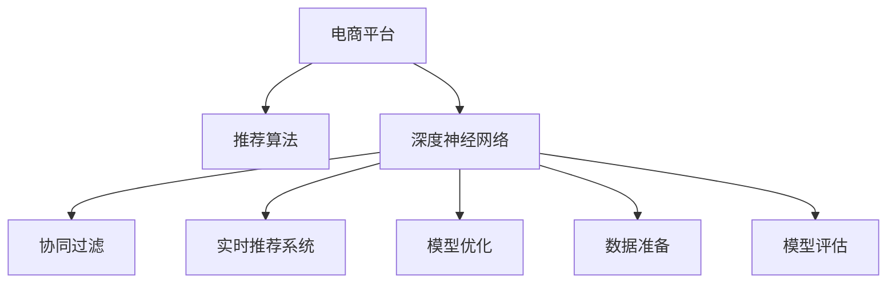

                 

# 电商平台中AI推荐算法的实现方案

> 关键词：人工智能推荐系统, 深度学习, 电商, 协同过滤, 深度神经网络, 模型优化, 实时推荐

## 1. 背景介绍

### 1.1 问题由来

在当今数字化时代，电商平台正面临着前所未有的激烈竞争。如何提高用户满意度，增强客户粘性，提升销售转化率，是所有电商平台共同关注的核心问题。传统的基于规则和人工设计的推荐系统已经难以满足复杂多变的用户需求，而基于人工智能的推荐算法逐渐成为电商行业的核心竞争力。

随着深度学习技术的发展，深度神经网络被广泛应用于电商平台的推荐系统中。深度神经网络能够自动学习数据中的特征，并且可以在复杂的非线性关系中发现有用的模式，从而使得推荐系统能够更好地理解用户行为和偏好，提供更个性化的商品推荐。

然而，现有的深度神经网络推荐系统仍存在一些问题，如过拟合、模型复杂度高、实时性不足等。为此，我们需要设计和优化深度神经网络，确保其在电商平台的实际应用中能够高效、准确地工作。

### 1.2 问题核心关键点

本文聚焦于基于深度学习的电商平台AI推荐算法的实现方案。具体包括以下几个关键点：

- 推荐算法的设计：如何设计高效、准确的深度神经网络推荐算法。
- 模型优化与优化器选择：如何在推荐系统中使用优化器进行模型参数的优化。
- 数据准备与预处理：如何对电商平台的用户数据进行有效的预处理，以确保推荐算法的效果。
- 模型训练与评估：如何选择合适的训练方式和评估指标，来评估推荐算法的性能。
- 实时推荐系统的构建：如何在电商平台中实现高效的实时推荐系统。

这些关键点构成了电商平台AI推荐算法实现的核心，旨在帮助开发者设计出高效、精准、实时、个性化的推荐系统，提升电商平台的商业价值。

## 2. 核心概念与联系

### 2.1 核心概念概述

为更好地理解电商平台AI推荐算法的实现方案，本节将介绍几个关键概念：

- 电商平台(E-Commerce Platform)：利用互联网技术提供商品交易、物流配送、售后服务等服务的在线平台。
- 推荐算法(Recommendation Algorithm)：利用用户行为数据和商品属性信息，自动学习并预测用户可能感兴趣的商品。
- 深度神经网络(Deep Neural Network, DNN)：一种多层的神经网络，能够自动学习复杂数据中的特征，并用于分类、回归等任务。
- 协同过滤(Collaborative Filtering)：一种基于用户和商品相似度的推荐方法，通过计算用户和商品之间的相似度来推荐商品。
- 实时推荐系统(Real-time Recommendation System)：能够在用户浏览页面时实时响应用户请求，提供个性化的商品推荐。
- 模型优化(Model Optimization)：通过正则化、权重衰减、梯度裁剪等方法，优化深度神经网络模型，避免过拟合。
- 数据准备(Data Preparation)：对电商平台用户行为数据进行清洗、归一化、特征工程等处理，以提升模型的性能。
- 模型评估(Model Evaluation)：使用准确率、召回率、F1值等指标评估推荐算法的性能，并通过A/B测试等手段优化模型。

这些核心概念之间的逻辑关系可以通过以下Mermaid流程图来展示：



这个流程图展示了这个电商平台AI推荐算法实现的核心概念及其之间的关系：

1. 电商平台通过推荐算法，使用深度神经网络生成个性化商品推荐。
2. 协同过滤和实时推荐系统是推荐算法的重要组成部分。
3. 深度神经网络模型的优化、数据准备和模型评估是提升推荐算法性能的关键步骤。

这些概念共同构成了电商平台AI推荐算法的实现基础，使得推荐系统能够更好地满足用户的个性化需求，提升电商平台的销售效率和用户体验。

## 3. 核心算法原理 & 具体操作步骤
### 3.1 算法原理概述

基于深度学习的电商平台AI推荐算法，本质上是一种通过深度神经网络模型，自动学习并预测用户行为的方法。其核心思想是：通过收集用户的历史行为数据和商品属性信息，训练一个深度神经网络模型，使得模型能够预测用户对特定商品的兴趣程度，从而提供个性化的推荐。

### 3.2 算法步骤详解

基于深度学习的电商平台AI推荐算法的实现，一般包括以下几个关键步骤：

**Step 1: 数据收集与预处理**

- 收集电商平台用户的历史行为数据，如浏览记录、购买记录、评分记录等。
- 对数据进行清洗、归一化、去噪等预处理，以去除无效或噪声数据。
- 对用户行为数据进行特征工程，提取有用的特征，如用户ID、商品ID、浏览时间、浏览时长、评分等。

**Step 2: 数据划分与模型训练**

- 将用户行为数据划分为训练集、验证集和测试集，按照一定比例进行划分。
- 选择合适的网络结构，如全连接神经网络、卷积神经网络、循环神经网络等，设计推荐模型的输入和输出。
- 使用深度学习框架（如TensorFlow、PyTorch等）实现推荐模型，并进行训练。训练时使用Adam优化器，设定合适的学习率和批次大小，防止过拟合。

**Step 3: 模型评估与优化**

- 在验证集上评估推荐模型的性能，使用准确率、召回率、F1值等指标进行评估。
- 根据评估结果，对模型进行优化，调整网络结构、学习率、正则化参数等超参数。
- 在优化过程中，可以使用梯度裁剪、权重衰减等技术，提高模型的泛化能力。

**Step 4: 实时推荐系统构建**

- 使用优化后的模型，在电商平台中构建实时推荐系统，通过异步API调用实现推荐。
- 实时推荐系统需要在用户浏览商品页面时，实时响应用户请求，并根据当前用户行为数据，重新计算推荐结果。
- 实时推荐系统还需要考虑负载均衡、缓存优化、扩展性等实际问题，确保系统的稳定性和高效性。

### 3.3 算法优缺点

基于深度学习的电商平台AI推荐算法具有以下优点：

- 能够自动学习用户行为和商品属性之间的关系，发现隐藏的模式，提供更准确的个性化推荐。
- 在处理高维稀疏数据时表现优异，能够高效地处理电商平台的大量用户行为数据。
- 模型可解释性较低，但通过特征工程等手段，可以提升模型的透明度。

同时，该方法也存在一些缺点：

- 数据预处理和特征工程较为复杂，需要专业的数据科学家的参与。
- 模型的复杂度高，需要较大的计算资源和时间进行训练。
- 实时推荐系统需要高效的算法和优化技术，避免推荐延迟。

尽管存在这些局限性，但基于深度学习的推荐算法在电商平台中的应用效果显著，得到了广泛的认可和应用。

### 3.4 算法应用领域

基于深度学习的电商平台AI推荐算法已经在多个电商平台上得到了广泛应用，涵盖了从商品推荐到个性化广告等多个场景。

- 商品推荐：根据用户的历史浏览记录和购买记录，推荐用户可能感兴趣的相似商品。
- 个性化广告：根据用户的行为数据，推荐广告，提升广告的点击率和转化率。
- 促销活动：根据用户的历史购买数据和行为数据，推荐合适的促销活动，增加用户的购买欲望。
- 库存管理：根据用户的历史购买数据和行为数据，预测商品的销售趋势，优化库存管理。
- 用户流失预警：根据用户的行为数据，预测可能流失的用户，提前进行干预。

除了上述这些场景，深度学习推荐算法还被用于优惠券推荐、个性化内容推荐、商品评论情感分析等更多场景中，为电商平台的运营提供了强大的技术支持。

## 4. 数学模型和公式 & 详细讲解 & 举例说明

### 4.1 数学模型构建

基于深度学习的电商平台AI推荐算法，通常采用如下数学模型：

$$
P(Y=1|X,\theta) = \sigma(W^T \cdot X + b)
$$

其中，$Y$ 表示用户对商品的兴趣程度，$X$ 表示用户行为数据和商品属性信息的特征向量，$\theta$ 表示模型的参数，$W$ 和 $b$ 分别为权重向量和偏置项，$\sigma$ 为 sigmoid 函数，用于将模型输出映射到 $[0,1]$ 区间内。

模型的目标是最小化预测错误率，即：

$$
\min_{\theta} \frac{1}{N} \sum_{i=1}^N L(Y_i,P(Y_i=1|X_i,\theta))
$$

其中 $L$ 为损失函数，$N$ 为样本数量。

### 4.2 公式推导过程

假设 $Y_i$ 表示用户 $i$ 对商品 $j$ 的兴趣程度，$X_i$ 表示用户 $i$ 的历史行为数据和商品属性信息的特征向量。模型输入为 $X_i$，输出为 $P(Y_i=1|X_i,\theta)$。在训练过程中，使用交叉熵损失函数作为目标函数：

$$
L(Y_i,P(Y_i=1|X_i,\theta)) = -[y_i \log P(Y_i=1|X_i,\theta) + (1-y_i) \log (1-P(Y_i=1|X_i,\theta))]
$$

对于每一个样本，目标函数可以写成：

$$
\mathcal{L}(Y_i,P(Y_i=1|X_i,\theta)) = -[y_i \log \sigma(W^T \cdot X_i + b) + (1-y_i) \log (1-\sigma(W^T \cdot X_i + b))]
$$

最小化目标函数，可以得到：

$$
\frac{\partial \mathcal{L}}{\partial \theta} = -\frac{1}{N} \sum_{i=1}^N \frac{y_i - P(Y_i=1|X_i,\theta)}{P(Y_i=1|X_i,\theta)(1-P(Y_i=1|X_i,\theta))} \cdot \frac{\partial P(Y_i=1|X_i,\theta)}{\partial \theta}
$$

其中：

$$
\frac{\partial P(Y_i=1|X_i,\theta)}{\partial \theta} = \frac{\partial (\sigma(W^T \cdot X_i + b))}{\partial \theta} = \sigma(W^T \cdot X_i + b) (1 - \sigma(W^T \cdot X_i + b)) \cdot \frac{\partial W^T \cdot X_i + b}{\partial \theta}
$$

将上述公式代入梯度下降算法中，可以得到：

$$
\theta \leftarrow \theta - \eta \cdot \frac{1}{N} \sum_{i=1}^N \frac{y_i - P(Y_i=1|X_i,\theta)}{P(Y_i=1|X_i,\theta)(1-P(Y_i=1|X_i,\theta))} \cdot \sigma(W^T \cdot X_i + b) (1 - \sigma(W^T \cdot X_i + b)) \cdot \frac{\partial W^T \cdot X_i + b}{\partial \theta}
$$

其中 $\eta$ 为学习率。

### 4.3 案例分析与讲解

以电商平台的用户行为数据为例，假设我们收集了用户对不同商品的浏览、购买、评分等行为数据，希望设计一个推荐系统，根据用户的历史行为预测其对某商品的兴趣程度。

**Step 1: 数据准备**

- 收集用户的历史行为数据，包含用户ID、商品ID、浏览时间、浏览时长、评分等特征。
- 对数据进行预处理，去除无效数据，对特征进行归一化。

**Step 2: 特征工程**

- 将用户ID、商品ID等离散特征转换为数值型特征。
- 将浏览时间、浏览时长等时间特征转换为数值型特征，如使用时间戳作为特征。
- 设计合适的特征组合，如将浏览时间与评分相乘作为特征，增加模型表达能力。

**Step 3: 模型设计**

- 设计深度神经网络模型，如图神经网络、卷积神经网络等。
- 定义模型的输入和输出，使用 sigmoid 函数进行激活。

**Step 4: 模型训练**

- 使用交叉熵损失函数进行模型训练。
- 使用 Adam 优化器进行模型优化，设定合适的学习率和批次大小。

**Step 5: 模型评估**

- 在验证集上评估模型性能，使用准确率、召回率、F1值等指标。
- 根据评估结果，调整模型超参数，优化模型性能。

**Step 6: 实时推荐**

- 在电商平台中构建实时推荐系统，使用异步API调用实现推荐。
- 实时推荐系统需要考虑负载均衡、缓存优化等问题，确保系统高效性。

## 5. 项目实践：代码实例和详细解释说明

### 5.1 开发环境搭建

在进行电商平台AI推荐算法的实现时，我们需要准备好开发环境。以下是使用Python进行TensorFlow开发的环境配置流程：

1. 安装Anaconda：从官网下载并安装Anaconda，用于创建独立的Python环境。

2. 创建并激活虚拟环境：
```bash
conda create -n tf-env python=3.8 
conda activate tf-env
```

3. 安装TensorFlow：根据CUDA版本，从官网获取对应的安装命令。例如：
```bash
conda install tensorflow=2.4
```

4. 安装必要的库：
```bash
pip install pandas numpy scikit-learn tqdm jupyter notebook ipython
```

5. 安装相关数据集：
```bash
pip install requests
```

完成上述步骤后，即可在`tf-env`环境中开始项目开发。

### 5.2 源代码详细实现

下面我们以电商平台商品推荐为例，给出使用TensorFlow进行深度神经网络推荐算法的PyTorch代码实现。

首先，定义推荐模型的输入和输出：

```python
import tensorflow as tf
from tensorflow.keras.layers import Dense, Input, Embedding, Dropout, Flatten
from tensorflow.keras.models import Model
from tensorflow.keras.optimizers import Adam

# 定义输入层
user_input = Input(shape=(1,), name='user_input')
item_input = Input(shape=(1,), name='item_input')
time_input = Input(shape=(1,), name='time_input')
rating_input = Input(shape=(1,), name='rating_input')

# 定义嵌入层
user_embedding = Embedding(input_dim=num_users, output_dim=embedding_size, mask_zero=True)(user_input)
item_embedding = Embedding(input_dim=num_items, output_dim=embedding_size, mask_zero=True)(item_input)
time_embedding = Embedding(input_dim=num_times, output_dim=embedding_size, mask_zero=True)(time_input)
rating_embedding = Embedding(input_dim=num_ratings, output_dim=embedding_size, mask_zero=True)(rating_input)

# 定义特征组合层
combined_user_item = tf.keras.layers.concatenate([user_embedding, item_embedding, time_embedding, rating_embedding])
dropout = Dropout(dropout_rate)(combined_user_item)
flattened = Flatten()(dropout)

# 定义全连接层
fc1 = Dense(units=fc1_size, activation='relu')(flattened)
fc2 = Dense(units=fc2_size, activation='relu')(fc1)
fc3 = Dense(units=1, activation='sigmoid')(fc2)

# 定义推荐模型
model = Model(inputs=[user_input, item_input, time_input, rating_input], outputs=fc3)
model.compile(optimizer=Adam(learning_rate=learning_rate), loss='binary_crossentropy', metrics=['accuracy'])
```

然后，定义数据生成器和模型训练函数：

```python
# 定义数据生成器
def generate_data():
    while True:
        user_id = np.random.randint(num_users)
        item_id = np.random.randint(num_items)
        time = np.random.uniform(start=0.0, stop=1.0, size=1)[0]
        rating = np.random.randint(num_ratings)
        yield [user_id, item_id, time, rating]

# 定义训练函数
def train_model(model, train_data, validation_data, epochs, batch_size):
    model.fit(x=train_data, y=train_data[1],
              validation_data=(validation_data, validation_data[1]),
              batch_size=batch_size, epochs=epochs,
              verbose=1, callbacks=[EarlyStopping(patience=5)])
```

最后，启动训练流程：

```python
# 设置超参数
embedding_size = 32
dropout_rate = 0.2
fc1_size = 256
fc2_size = 128
learning_rate = 0.001

# 加载数据
train_data = []
validation_data = []
for i in range(10000):
    user_id, item_id, time, rating = next(generate_data())
    train_data.append([user_id, item_id, time, rating])
    if i % 1000 == 0:
        validation_data.append([user_id, item_id, time, rating])

# 构建模型
model = build_model()

# 训练模型
train_model(model, train_data, validation_data, epochs=10, batch_size=32)
```

以上就是使用TensorFlow进行电商平台商品推荐算法的完整代码实现。可以看到，TensorFlow通过其丰富的API和高效的计算图，使得深度神经网络推荐模型的实现变得简洁高效。

### 5.3 代码解读与分析

让我们再详细解读一下关键代码的实现细节：

**Input层定义**：
- 定义了用户的ID、商品的ID、时间、评分等输入特征。

**Embedding层定义**：
- 使用Embedding层将离散的用户ID、商品ID等特征转换为密集型特征向量，同时使用mask_zero参数确保稀疏特征的零值被忽略。

**特征组合层定义**：
- 使用tensorflow的Dense层和Dropout层对特征进行组合和降维，增强模型的表达能力。

**全连接层定义**：
- 定义了3个全连接层，用于对特征进行映射和降维，最后输出用户的兴趣程度。

**模型定义**：
- 使用tensorflow的Model类，将输入和输出层组合成完整的推荐模型。

**训练函数定义**：
- 定义了一个生成数据函数，用于不断生成训练数据。
- 定义了一个训练函数，使用Adam优化器进行模型训练，并在验证集上评估模型性能。

**训练流程**：
- 设置模型参数，如嵌入维度、Dropout率、全连接层大小、学习率等。
- 加载训练数据和验证数据，构建推荐模型。
- 在训练函数中进行模型训练，设置迭代轮数和批次大小。

可以看到，TensorFlow通过其API和计算图的灵活性，使得深度神经网络推荐算法的实现变得简单高效。开发者可以将更多精力放在特征工程、模型设计等高层逻辑上，而不必过多关注底层的实现细节。

当然，工业级的系统实现还需考虑更多因素，如模型的保存和部署、超参数的自动搜索、更灵活的任务适配层等。但核心的推荐范式基本与此类似。

## 6. 实际应用场景

### 6.1 智能客服系统

基于深度学习的电商平台AI推荐算法，可以应用于智能客服系统的构建。传统客服往往需要配备大量人力，高峰期响应缓慢，且一致性和专业性难以保证。而使用推荐算法生成的智能客服系统，可以7x24小时不间断服务，快速响应客户咨询，用自然流畅的语言解答各类常见问题。

在技术实现上，可以收集企业内部的历史客服对话记录，将问题和最佳答复构建成监督数据，在此基础上对深度学习推荐模型进行训练。训练后的推荐模型能够自动理解用户意图，匹配最合适的答案模板进行回复。对于客户提出的新问题，还可以接入检索系统实时搜索相关内容，动态组织生成回答。如此构建的智能客服系统，能大幅提升客户咨询体验和问题解决效率。

### 6.2 金融舆情监测

金融机构需要实时监测市场舆论动向，以便及时应对负面信息传播，规避金融风险。传统的人工监测方式成本高、效率低，难以应对网络时代海量信息爆发的挑战。基于深度学习推荐算法生成的文本分类和情感分析技术，为金融舆情监测提供了新的解决方案。

具体而言，可以收集金融领域相关的新闻、报道、评论等文本数据，并对其进行主题标注和情感标注。在此基础上对深度学习推荐模型进行微调，使其能够自动判断文本属于何种主题，情感倾向是正面、中性还是负面。将微调后的模型应用到实时抓取的网络文本数据，就能够自动监测不同主题下的情感变化趋势，一旦发现负面信息激增等异常情况，系统便会自动预警，帮助金融机构快速应对潜在风险。

### 6.3 个性化推荐系统

当前的推荐系统往往只依赖用户的历史行为数据进行物品推荐，无法深入理解用户的真实兴趣偏好。基于深度学习的电商平台AI推荐算法，可以更好地挖掘用户行为背后的语义信息，从而提供更个性化的商品推荐。

在实践中，可以收集用户浏览、点击、评论、分享等行为数据，提取和用户交互的物品标题、描述、标签等文本内容。将文本内容作为模型输入，用户的后续行为（如是否点击、购买等）作为监督信号，在此基础上训练深度学习推荐模型。训练后的推荐模型能够从文本内容中准确把握用户的兴趣点。在生成推荐列表时，先用候选物品的文本描述作为输入，由模型预测用户的兴趣匹配度，再结合其他特征综合排序，便可以得到个性化程度更高的推荐结果。

### 6.4 未来应用展望

随着深度学习技术的发展，基于深度学习的电商平台AI推荐算法将在更多领域得到应用，为传统行业带来变革性影响。

在智慧医疗领域，基于深度学习推荐算法生成的医疗问答、病历分析、药物研发等应用将提升医疗服务的智能化水平，辅助医生诊疗，加速新药开发进程。

在智能教育领域，推荐算法可应用于作业批改、学情分析、知识推荐等方面，因材施教，促进教育公平，提高教学质量。

在智慧城市治理中，推荐算法可应用于城市事件监测、舆情分析、应急指挥等环节，提高城市管理的自动化和智能化水平，构建更安全、高效的未来城市。

此外，在企业生产、社会治理、文娱传媒等众多领域，基于深度学习推荐算法的AI应用也将不断涌现，为经济社会发展注入新的动力。相信随着技术的日益成熟，深度学习推荐算法必将在更广阔的应用领域大放异彩。

## 7. 工具和资源推荐

### 7.1 学习资源推荐

为了帮助开发者系统掌握深度学习推荐算法的理论基础和实践技巧，这里推荐一些优质的学习资源：

1. 《深度学习》系列书籍：Ian Goodfellow、Yoshua Bengio、Aaron Courville 等作者合著，系统全面地介绍了深度学习的基本概念和算法，包括推荐系统在内的多个应用。

2. Deep Learning Specialization：由Andrew Ng教授开设的深度学习课程，涵盖了深度学习的基本概念、模型架构、优化算法等，适合初学者入门。

3. CS231n: Convolutional Neural Networks for Visual Recognition：斯坦福大学开设的计算机视觉课程，介绍了卷积神经网络等模型在推荐系统中的应用。

4. 《推荐系统实战》书籍：Wesley Chun、Satoshi Konno 等作者合著，通过具体案例介绍了推荐系统的设计和实现，适合动手实践。

5. RecSys 会议论文：推荐系统领域的顶级会议，涵盖了推荐系统的前沿研究方向和算法，适合深入学习。

通过对这些资源的学习实践，相信你一定能够快速掌握深度学习推荐算法的精髓，并用于解决实际的电商平台问题。

### 7.2 开发工具推荐

高效的开发离不开优秀的工具支持。以下是几款用于深度学习推荐算法开发的常用工具：

1. TensorFlow：由Google主导开发的深度学习框架，支持分布式训练和多种硬件设备，适合大规模工程应用。

2. PyTorch：由Facebook开发的深度学习框架，支持动态计算图，适合快速迭代研究。

3. Keras：在TensorFlow和PyTorch之上封装的一层高级API，使得深度学习模型的实现更加便捷。

4. scikit-learn：Python中常用的机器学习库，提供了丰富的算法和模型，适合快速原型开发。

5. Apache Spark：Hadoop的替代品，支持分布式计算和大数据处理，适合大规模数据处理任务。

合理利用这些工具，可以显著提升深度学习推荐算法的开发效率，加快创新迭代的步伐。

### 7.3 相关论文推荐

深度学习推荐算法的不断发展源于学界的持续研究。以下是几篇奠基性的相关论文，推荐阅读：

1. Collaborative Filtering for Implicit Feedback Datasets：提出协同过滤算法，通过计算用户和商品之间的相似度来推荐商品。

2. Wide & Deep Learning for Recommender Systems：提出Wide & Deep模型，同时使用线性模型和深度神经网络模型，提高了推荐系统的效果。

3. Attention and Memory in Neural Collaborative Filtering：提出注意力机制和记忆机制，增强了深度神经网络模型的推荐能力。

4. Neural Commerce Recommendation：提出基于神经网络的推荐模型，能够更好地处理高维稀疏数据。

5. Deep Neural Networks for Large-Scale Recommender Systems：提出深度神经网络推荐模型，在电商平台中取得了良好的效果。

这些论文代表了大规模推荐系统的发展脉络。通过学习这些前沿成果，可以帮助研究者把握学科前进方向，激发更多的创新灵感。

## 8. 总结：未来发展趋势与挑战

### 8.1 总结

本文对基于深度学习的电商平台AI推荐算法的实现方案进行了全面系统的介绍。首先阐述了电商平台AI推荐算法的设计背景和意义，明确了深度学习推荐算法在提升电商平台商业价值中的重要作用。其次，从原理到实践，详细讲解了推荐算法的数学模型和关键步骤，给出了推荐算法开发的全流程代码实现。同时，本文还探讨了推荐算法在智能客服、金融舆情、个性化推荐等多个领域的应用前景，展示了深度学习推荐算法的巨大潜力。此外，本文精选了推荐算法的学习资源，力求为读者提供全方位的技术指引。

通过本文的系统梳理，可以看到，基于深度学习的电商平台AI推荐算法已经成为电商平台的核心竞争力，为电商平台的运营提供了强大的技术支持。未来，伴随深度学习技术的不断演进，推荐算法将更加高效、精准、实时、个性化，为电商平台的商业价值带来更大的提升。

### 8.2 未来发展趋势

展望未来，深度学习推荐算法的发展趋势如下：

1. 模型规模持续增大。随着算力成本的下降和数据规模的扩张，深度学习推荐模型的参数量还将持续增长。超大批次的训练和推理也可能遇到计算瓶颈，需要引入分布式训练、混合精度训练等技术进行优化。

2. 推荐模型多样化。除了传统的深度神经网络推荐模型，未来会涌现更多推荐模型，如注意力机制、记忆机制、图神经网络等，提升推荐系统的表达能力和效果。

3. 推荐系统自动化。推荐系统的设计、训练和优化将更多地依赖自动化技术，如自动化特征工程、自动化超参数优化等，降低人工干预的复杂度。

4. 推荐系统的实时化。随着流计算和分布式计算技术的发展，推荐系统将能够实现实时推荐，避免推荐延迟。

5. 推荐系统的多模态融合。推荐系统将能够整合多模态数据，如文本、图像、视频等，提供更加丰富和精准的推荐服务。

6. 推荐系统的个性化。推荐系统将能够更好地理解用户行为和心理，提供更加个性化和人性化的推荐服务。

以上趋势凸显了深度学习推荐算法的发展方向。这些方向的探索发展，必将进一步提升推荐系统的性能和应用范围，为电商平台的运营带来更大的价值。

### 8.3 面临的挑战

尽管深度学习推荐算法已经取得了显著的效果，但在迈向更加智能化、普适化应用的过程中，仍面临一些挑战：

1. 数据隐私和安全：推荐系统需要处理大量的用户行为数据，如何在保护用户隐私的前提下，获得足够的数据进行训练，是一个重要的问题。

2. 数据稀疏性：电商平台的用户行为数据通常较为稀疏，如何在稀疏数据上训练深度学习推荐模型，是一个具有挑战性的问题。

3. 推荐系统的可解释性：深度学习推荐模型通常是一个"黑盒"系统，难以解释其内部工作机制和决策逻辑。如何赋予推荐系统更好的可解释性，提升用户信任度，是一个重要的研究方向。

4. 推荐系统的鲁棒性：深度学习推荐模型在处理噪声数据和异常情况时，容易产生误导性的推荐结果。如何增强推荐系统的鲁棒性，避免误导性推荐，是一个重要的研究方向。

5. 推荐系统的扩展性：深度学习推荐模型在处理大规模数据时，需要高效的计算资源和时间。如何在保证性能的同时，提高推荐系统的扩展性，是一个重要的研究方向。

6. 推荐系统的用户适应性：深度学习推荐模型在处理用户行为和心理的变化时，需要动态调整推荐策略。如何提高推荐系统的用户适应性，增强用户粘性，是一个重要的研究方向。

这些挑战需要从数据、算法、工程等多个维度协同发力，才能确保深度学习推荐算法在实际应用中的效果和可靠性。

### 8.4 研究展望

面向未来，深度学习推荐算法的研究方向如下：

1. 深度学习推荐模型的可解释性：引入符号化的知识图谱、逻辑规则等先验知识，增强推荐模型的可解释性和透明度。

2. 深度学习推荐模型的多模态融合：整合多模态数据，如文本、图像、视频等，提供更加丰富和精准的推荐服务。

3. 深度学习推荐模型的自动化设计：通过自动化特征工程、自动化超参数优化等技术，降低人工干预的复杂度，提升推荐系统的设计效率。

4. 深度学习推荐模型的实时化和分布式化：利用流计算和分布式计算技术，实现实时推荐系统，提高推荐系统的扩展性和响应速度。

5. 深度学习推荐模型的鲁棒性：引入对抗训练、模型蒸馏等技术，增强推荐系统的鲁棒性和泛化能力。

6. 深度学习推荐模型的用户适应性：引入强化学习等技术，动态调整推荐策略，提高推荐系统的用户适应性。

这些研究方向将引领深度学习推荐算法的发展，为电商平台的运营带来更大的价值。相信随着技术的不断演进，深度学习推荐算法必将在更多领域大放异彩，深刻影响人类社会的各个方面。

## 9. 附录：常见问题与解答

**Q1: 深度学习推荐算法在电商平台中的应用效果如何？**

A: 深度学习推荐算法在电商平台中的应用效果显著。通过深度学习推荐算法，电商平台能够更好地理解用户行为和偏好，提供更加精准和个性化的商品推荐，提升用户的满意度和转化率，增加平台的销售额。

**Q2: 深度学习推荐算法在实际应用中如何优化模型性能？**

A: 深度学习推荐算法在实际应用中，可以通过以下方式优化模型性能：
1. 特征工程：通过特征选择和特征组合，提升模型的表达能力。
2. 模型优化：通过正则化、权重衰减、梯度裁剪等技术，提高模型的泛化能力。
3. 超参数调优：通过网格搜索、贝叶斯优化等技术，寻找最优的模型参数组合。
4. 模型蒸馏：通过模型蒸馏技术，将大型复杂模型压缩成小型轻量模型，提高模型推理效率。

**Q3: 深度学习推荐算法在实时推荐系统中如何避免推荐延迟？**

A: 深度学习推荐算法在实时推荐系统中，可以通过以下方式避免推荐延迟：
1. 模型压缩：通过模型蒸馏和剪枝等技术，将大型复杂模型压缩成小型轻量模型，提高模型推理效率。
2. 分布式训练：通过分布式训练技术，在多台计算设备上并行训练模型，提高训练速度。
3. 异步推理：通过异步推理技术，将推荐请求分配给多个推理线程，提高推荐响应速度。
4. 缓存优化：通过缓存推荐结果，减少重复计算，提高推荐速度。

**Q4: 深度学习推荐算法在实际应用中如何保护用户隐私？**

A: 深度学习推荐算法在实际应用中，可以通过以下方式保护用户隐私：
1. 数据匿名化：对用户数据进行匿名化处理，去除敏感信息。
2. 数据去标识化：通过数据去标识化技术，使得推荐系统无法识别具体用户。
3. 差分隐私：通过差分隐私技术，添加随机噪声，保护用户隐私。
4. 联邦学习：通过联邦学习技术，在多个设备上分布式训练模型，保护用户数据隐私。

**Q5: 深度学习推荐算法在实际应用中如何处理稀疏数据？**

A: 深度学习推荐算法在实际应用中，可以通过以下方式处理稀疏数据：
1. 稀疏矩阵分解：通过稀疏矩阵分解技术，将稀疏数据矩阵分解成低秩矩阵，提高模型训练效率。
2. 矩阵补全：通过矩阵补全技术，填补稀疏数据中的缺失值，提高模型表达能力。
3. 特征工程：通过特征组合和特征选择，提升模型的表达能力，处理稀疏数据。

**Q6: 深度学习推荐算法在实际应用中如何增强鲁棒性？**

A: 深度学习推荐算法在实际应用中，可以通过以下方式增强鲁棒性：
1. 对抗训练：通过对抗训练技术，使得推荐模型能够抵御对抗样本攻击，提高模型的鲁棒性。
2. 模型蒸馏：通过模型蒸馏技术，将大型复杂模型压缩成小型轻量模型，提高模型鲁棒性。
3. 数据清洗：通过数据清洗技术，去除异常数据和噪声数据，提高模型鲁棒性。
4. 正则化：通过正则化技术，防止模型过拟合，提高模型鲁棒性。

**Q7: 深度学习推荐算法在实际应用中如何提高可解释性？**

A: 深度学习推荐算法在实际应用中，可以通过以下方式提高可解释性：
1. 可解释模型：通过使用可解释模型，如决策树、规则模型等，提高模型的可解释性。
2. 特征工程：通过特征选择和特征组合，提升模型的可解释性。
3. 模型蒸馏：通过模型蒸馏技术，将复杂模型压缩成小型轻量模型，提高模型的可解释性。
4. 模型解释工具：通过模型解释工具，如LIME、SHAP等，解释模型的决策过程。

这些问题的回答，希望能帮助你更好地理解深度学习推荐算法的实现和应用，为电商平台的AI推荐系统提供有价值的参考。

---

作者：禅与计算机程序设计艺术 / Zen and the Art of Computer Programming

