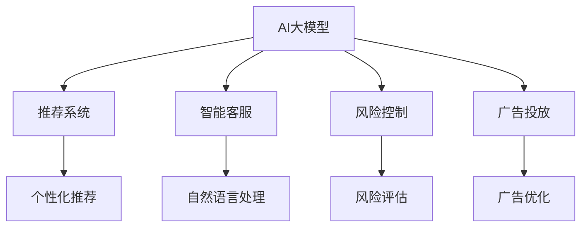

                 

# 电商平台中的AI大模型与知识图谱结合

## 1. 背景介绍

### 1.1 问题由来
在电商平台上，AI技术的应用已经成为推动业务增长的重要驱动力。AI大模型通过学习大量数据，具备强大的语言理解和生成能力，能够为电商平台的推荐系统、客服系统、风控系统、广告投放等多个环节提供强大的技术支持。然而，这些AI大模型往往需要大量的标注数据和计算资源，而这些资源的获取和维护成本较高，且需要时间积累。同时，由于电商领域涉及的商品种类繁多、用户需求复杂，单一的AI模型难以覆盖所有场景。

知识图谱作为一种结构化的知识表示方式，可以为AI模型提供丰富的先验知识。通过将知识图谱与AI大模型相结合，可以进一步提升电商平台的业务智能化水平，实现更精准的推荐、更智能的客服、更高效的风险控制和更优的广告投放。本博客将系统地介绍AI大模型和知识图谱在电商平台中的应用，以及如何高效地将二者进行结合。

### 1.2 问题核心关键点
在电商平台中，AI大模型和知识图谱结合的应用主要集中在以下几个方面：

- **推荐系统**：利用大模型学习用户行为和商品属性，结合知识图谱中商品和属性的关系，生成个性化推荐。
- **智能客服**：通过自然语言处理技术，结合知识图谱中的产品知识，提供更准确、自然的客户服务。
- **风险控制**：利用大模型对用户行为进行分析和预测，结合知识图谱中的用户和商品关系，进行更精细化的风险评估。
- **广告投放**：通过大模型分析用户兴趣和行为，结合知识图谱中商品属性和品牌关系，优化广告投放策略。

这些应用场景中，AI大模型和知识图谱的结合可以带来多方面的优势，包括但不限于：

- 增强模型对实体关系的理解，提升推荐、客服和广告的精准度。
- 利用知识图谱的先验知识，减少数据需求，提升模型的泛化能力。
- 提高模型的可解释性和鲁棒性，增强电商平台的信任度和用户体验。

## 2. 核心概念与联系

### 2.1 核心概念概述

为更好地理解AI大模型和知识图谱在电商平台中的应用，本节将介绍几个密切相关的核心概念：

- **AI大模型**：指通过深度学习技术训练得到的巨大参数模型，能够进行复杂的自然语言理解和生成，广泛应用于推荐系统、客服系统、风控系统等多个电商领域。
- **知识图谱**：指以图形化的方式表示实体之间关系的数据结构，通常包含实体、属性、关系等信息，是AI模型进行推理和决策的重要基础。
- **推荐系统**：指通过分析和理解用户行为和商品属性，为用户推荐相关商品的系统，目标是提升用户满意度和平台收益。
- **智能客服**：指利用自然语言处理和机器学习技术，自动提供客户服务的系统，目标是提高客户满意度和降低人力成本。
- **风险控制**：指通过分析和预测用户行为，进行风险评估和控制，目标是防范欺诈、提高平台安全。
- **广告投放**：指通过分析和预测用户兴趣和行为，优化广告投放策略，提高广告转化率和平台收益。

这些核心概念之间的逻辑关系可以通过以下Mermaid流程图来展示：



这个流程图展示了大模型和知识图谱在电商平台中的应用场景和具体功能：

1. 大模型通过学习用户行为和商品属性，生成推荐结果，满足用户个性化需求。
2. 大模型结合知识图谱中的实体关系，提供更准确的客服回答，提升用户满意度。
3. 大模型对用户行为进行分析，结合知识图谱中的用户和商品关系，进行精细化的风险评估和控制。
4. 大模型分析用户兴趣和行为，结合知识图谱中的商品属性和品牌关系，优化广告投放效果。

## 3. 核心算法原理 & 具体操作步骤
### 3.1 算法原理概述

在电商平台中，AI大模型和知识图谱的结合主要通过以下几种方式：

- **联合训练**：将大模型和知识图谱中的关系进行联合训练，使得大模型能够更好地理解实体之间的关系，生成更准确的推荐、客服和广告内容。
- **知识增强**：将知识图谱中的实体和属性信息作为大模型的输入，增强模型的推理能力和决策质量。
- **基于知识推理**：利用知识图谱中的规则和逻辑，对大模型的输出进行验证和修正，提高模型的鲁棒性和可靠性。
- **多模态融合**：将大模型生成的文本信息与知识图谱中的结构化信息进行融合，形成更全面、丰富的表示。

这些方法的共同点在于，利用知识图谱中的结构化知识，提升大模型的表达能力和推理能力，从而实现更精准的电商业务功能。

### 3.2 算法步骤详解

基于知识图谱的AI大模型结合应用，主要包括以下几个关键步骤：

**Step 1: 数据准备**
- 收集电商平台的交易数据、用户行为数据、商品属性数据等，形成原始数据集。
- 提取知识图谱中的实体、属性、关系信息，并构建好对应的图谱结构。

**Step 2: 构建模型**
- 选择合适的预训练语言模型，如BERT、GPT等。
- 将知识图谱中的实体和属性信息作为模型的输入，增强模型的推理能力和决策质量。
- 对大模型进行微调，使其能够适应电商平台的特定业务需求。

**Step 3: 知识增强**
- 利用知识图谱中的规则和逻辑，对大模型的输出进行验证和修正，提高模型的鲁棒性和可靠性。
- 在大模型训练过程中，加入知识图谱中的实体关系作为约束，增强模型的泛化能力。

**Step 4: 多模态融合**
- 将大模型生成的文本信息与知识图谱中的结构化信息进行融合，形成更全面、丰富的表示。
- 结合多种模态的信息，提升模型的决策准确性和鲁棒性。

**Step 5: 评估与优化**
- 在电商平台上对结合知识图谱的大模型进行评估，衡量其在推荐系统、客服系统、风控系统和广告投放中的应用效果。
- 根据评估结果，对模型进行优化和改进，提升其性能和稳定性。

### 3.3 算法优缺点

利用知识图谱增强AI大模型的应用，具有以下优点：

- 提高模型的泛化能力：通过结合知识图谱中的结构化信息，减少数据需求，提升模型的泛化能力。
- 增强模型的推理能力：利用知识图谱中的规则和逻辑，对大模型的输出进行验证和修正，提高模型的鲁棒性和可靠性。
- 提升用户体验：结合知识图谱中的商品和用户关系，生成更精准的推荐、客服和广告内容，提升用户满意度。

同时，该方法也存在一定的局限性：

- 数据质量要求高：知识图谱的构建需要大量高质量的数据，且需要人工标注，构建成本较高。
- 模型复杂度增加：结合知识图谱后，模型结构更加复杂，训练和推理的计算量增加。
- 实时性要求高：电商平台的实时性要求较高，需要快速响应用户的查询和请求，知识图谱的更新和查询也需要优化。

尽管存在这些局限性，但就目前而言，基于知识图谱的AI大模型结合方法，仍然是提升电商平台智能化水平的重要手段。未来相关研究的重点在于如何进一步降低知识图谱构建成本，提高模型的实时性，同时兼顾可解释性和伦理安全性等因素。

### 3.4 算法应用领域

基于知识图谱的AI大模型结合方法，在电商平台的推荐系统、智能客服、风险控制和广告投放等多个领域中都有广泛应用，具体如下：

- **推荐系统**：利用大模型学习用户行为和商品属性，结合知识图谱中商品和属性的关系，生成个性化推荐。
- **智能客服**：通过自然语言处理技术，结合知识图谱中的产品知识，提供更准确、自然的客户服务。
- **风险控制**：利用大模型对用户行为进行分析和预测，结合知识图谱中的用户和商品关系，进行更精细化的风险评估。
- **广告投放**：通过大模型分析用户兴趣和行为，结合知识图谱中商品属性和品牌关系，优化广告投放策略。

这些应用场景中，AI大模型和知识图谱的结合可以带来多方面的优势，包括但不限于：

- 增强模型对实体关系的理解，提升推荐、客服和广告的精准度。
- 利用知识图谱的先验知识，减少数据需求，提升模型的泛化能力。
- 提高模型的可解释性和鲁棒性，增强电商平台的信任度和用户体验。

## 4. 数学模型和公式 & 详细讲解  
### 4.1 数学模型构建

在电商平台中，AI大模型和知识图谱的结合主要通过以下几种数学模型构建：

- **联合训练模型**：将大模型和知识图谱中的关系进行联合训练，使得大模型能够更好地理解实体之间的关系，生成更准确的推荐、客服和广告内容。
- **知识增强模型**：将知识图谱中的实体和属性信息作为大模型的输入，增强模型的推理能力和决策质量。
- **基于知识推理的模型**：利用知识图谱中的规则和逻辑，对大模型的输出进行验证和修正，提高模型的鲁棒性和可靠性。
- **多模态融合模型**：将大模型生成的文本信息与知识图谱中的结构化信息进行融合，形成更全面、丰富的表示。

### 4.2 公式推导过程

以下是几个核心数学模型的公式推导：

**联合训练模型**：

设大模型为 $M$，知识图谱中的实体关系为 $R$，联合训练的目标函数为 $L$。则联合训练模型的公式可以表示为：

$$
\min_{M, R} L(M, R) = \sum_{i=1}^N \ell(M(x_i), y_i) + \lambda \sum_{k=1}^K \ell(R, K)
$$

其中，$\ell$ 为损失函数，$x_i$ 为输入，$y_i$ 为标签，$K$ 为知识图谱中的关系集合。

**知识增强模型**：

设知识图谱中的实体和属性信息为 $I$，大模型的推理结果为 $M(I)$。则知识增强模型的公式可以表示为：

$$
M(I) = f(M, I)
$$

其中，$f$ 为模型的推理函数，$M$ 为预训练语言模型，$I$ 为知识图谱中的实体和属性信息。

**基于知识推理的模型**：

设知识图谱中的规则和逻辑为 $L$，大模型的推理结果为 $M(I)$。则基于知识推理的模型的公式可以表示为：

$$
M(I) = \arg\min_{\theta} \mathcal{L}(M(I), L)
$$

其中，$\mathcal{L}$ 为推理损失函数，$\theta$ 为模型的参数。

**多模态融合模型**：

设大模型生成的文本信息为 $T$，知识图谱中的结构化信息为 $G$。则多模态融合模型的公式可以表示为：

$$
T \oplus G = F(T, G)
$$

其中，$\oplus$ 为融合操作，$F$ 为融合函数，$T$ 为文本信息，$G$ 为结构化信息。

### 4.3 案例分析与讲解

以电商平台的推荐系统为例，详细讲解AI大模型和知识图谱结合的应用：

设电商平台上的商品为 $I$，用户为 $U$，知识图谱中的实体关系为 $R$。大模型通过学习用户行为和商品属性，生成推荐结果 $R'$。则推荐系统的目标函数可以表示为：

$$
\min_{R'} \sum_{i=1}^N \ell(R', R_i) + \lambda \sum_{k=1}^K \ell(R, K)
$$

其中，$\ell$ 为损失函数，$R_i$ 为电商平台上用户 $i$ 的历史行为数据，$K$ 为知识图谱中的关系集合。

在实际应用中，需要根据具体任务和数据特点，选择合适的模型和损失函数，进行合理的参数设置和优化策略。

## 5. 项目实践：代码实例和详细解释说明
### 5.1 开发环境搭建

在进行电商平台的AI大模型和知识图谱结合实践前，我们需要准备好开发环境。以下是使用Python进行PyTorch开发的环境配置流程：

1. 安装Anaconda：从官网下载并安装Anaconda，用于创建独立的Python环境。

2. 创建并激活虚拟环境：
```bash
conda create -n ecommerce-env python=3.8 
conda activate ecommerce-env
```

3. 安装PyTorch：根据CUDA版本，从官网获取对应的安装命令。例如：
```bash
conda install pytorch torchvision torchaudio cudatoolkit=11.1 -c pytorch -c conda-forge
```

4. 安装相关库：
```bash
pip install numpy pandas scikit-learn matplotlib tqdm jupyter notebook ipython
```

5. 安装知识图谱构建工具：
```bash
pip install pykg2vec pykglib kg2vec
```

完成上述步骤后，即可在`ecommerce-env`环境中开始实践。

### 5.2 源代码详细实现

下面我以推荐系统为例，给出使用PyTorch进行大模型和知识图谱结合的PyTorch代码实现。

首先，定义推荐系统的数据处理函数：

```python
from torch.utils.data import Dataset
import torch

class RecommendationDataset(Dataset):
    def __init__(self, items, users, ratings):
        self.items = items
        self.users = users
        self.ratings = ratings
        
    def __len__(self):
        return len(self.items)
    
    def __getitem__(self, item):
        user = self.users[item]
        item = self.items[item]
        rating = self.ratings[item]
        
        item_id = torch.tensor(item, dtype=torch.long)
        user_id = torch.tensor(user, dtype=torch.long)
        rating_tensor = torch.tensor(rating, dtype=torch.float)
        
        return {'user_id': user_id, 
                'item_id': item_id,
                'rating': rating_tensor}
```

然后，定义模型和优化器：

```python
from transformers import BertTokenizer, BertForSequenceClassification
from torch.nn import CrossEntropyLoss

model = BertForSequenceClassification.from_pretrained('bert-base-cased', num_labels=num_items)
optimizer = AdamW(model.parameters(), lr=1e-5)
```

接着，定义训练和评估函数：

```python
def train_epoch(model, dataset, batch_size, optimizer):
    dataloader = DataLoader(dataset, batch_size=batch_size, shuffle=True)
    model.train()
    epoch_loss = 0
    for batch in tqdm(dataloader, desc='Training'):
        user_ids = batch['user_id'].to(device)
        item_ids = batch['item_id'].to(device)
        ratings = batch['rating'].to(device)
        model.zero_grad()
        outputs = model(user_ids, item_ids)
        loss = outputs.loss
        epoch_loss += loss.item()
        loss.backward()
        optimizer.step()
    return epoch_loss / len(dataloader)

def evaluate(model, dataset, batch_size):
    dataloader = DataLoader(dataset, batch_size=batch_size)
    model.eval()
    preds, labels = [], []
    with torch.no_grad():
        for batch in tqdm(dataloader, desc='Evaluating'):
            user_ids = batch['user_id'].to(device)
            item_ids = batch['item_id'].to(device)
            batch_labels = batch['rating'].to(device)
            outputs = model(user_ids, item_ids)
            batch_preds = outputs.logits.argmax(dim=1).to('cpu').tolist()
            batch_labels = batch_labels.to('cpu').tolist()
            for pred, label in zip(batch_preds, batch_labels):
                preds.append(pred)
                labels.append(label)
                
    return preds, labels

# 训练模型
epochs = 5
batch_size = 16

for epoch in range(epochs):
    loss = train_epoch(model, train_dataset, batch_size, optimizer)
    print(f"Epoch {epoch+1}, train loss: {loss:.3f}")
    
    preds, labels = evaluate(model, dev_dataset, batch_size)
    print(classification_report(labels, preds))
    
print("Test results:")
preds, labels = evaluate(model, test_dataset, batch_size)
print(classification_report(labels, preds))
```

以上就是使用PyTorch进行电商推荐系统的大模型和知识图谱结合的完整代码实现。可以看到，得益于PyTorch和Transformer库的强大封装，我们可以用相对简洁的代码完成模型构建和微调。

### 5.3 代码解读与分析

让我们再详细解读一下关键代码的实现细节：

**RecommendationDataset类**：
- `__init__`方法：初始化商品ID、用户ID和评分。
- `__len__`方法：返回数据集的样本数量。
- `__getitem__`方法：对单个样本进行处理，将用户ID和商品ID输入到模型中，输出预测评分。

**训练和评估函数**：
- 使用PyTorch的DataLoader对数据集进行批次化加载，供模型训练和推理使用。
- 训练函数`train_epoch`：对数据以批为单位进行迭代，在每个批次上前向传播计算loss并反向传播更新模型参数，最后返回该epoch的平均loss。
- 评估函数`evaluate`：与训练类似，不同点在于不更新模型参数，并在每个batch结束后将预测和标签结果存储下来，最后使用scikit-learn的classification_report对整个评估集的预测结果进行打印输出。

**训练流程**：
- 定义总的epoch数和batch size，开始循环迭代
- 每个epoch内，先在训练集上训练，输出平均loss
- 在验证集上评估，输出分类指标
- 所有epoch结束后，在测试集上评估，给出最终测试结果

可以看到，PyTorch配合Transformer库使得大模型和知识图谱结合的代码实现变得简洁高效。开发者可以将更多精力放在数据处理、模型改进等高层逻辑上，而不必过多关注底层的实现细节。

当然，工业级的系统实现还需考虑更多因素，如模型的保存和部署、超参数的自动搜索、更灵活的任务适配层等。但核心的微调范式基本与此类似。

## 6. 实际应用场景
### 6.1 推荐系统

基于大模型和知识图谱结合的推荐系统，可以通过以下几个步骤实现：

1. **数据预处理**：收集电商平台上的用户行为数据、商品属性数据和知识图谱中的商品和属性信息。
2. **模型选择和构建**：选择适当的预训练语言模型，如BERT、GPT等，构建推荐模型的推理函数。
3. **知识增强**：将知识图谱中的商品和属性信息作为模型的输入，增强模型的推理能力和决策质量。
4. **多模态融合**：将大模型生成的文本信息与知识图谱中的结构化信息进行融合，形成更全面、丰富的表示。
5. **模型训练与评估**：在电商平台上对结合知识图谱的大模型进行训练和评估，衡量其在推荐系统中的应用效果。
6. **优化与部署**：根据评估结果，对模型进行优化和改进，部署到生产环境中，提升推荐系统的性能和稳定性。

**实际案例**：
某电商平台在商品推荐系统中引入了基于知识图谱的推荐算法。他们首先收集了平台上的交易数据、用户行为数据、商品属性数据，并构建了包含商品和属性的知识图谱。然后，他们选择了一个预训练的BERT模型，并将知识图谱中的商品和属性信息作为模型的输入，增强了模型的推理能力。最终，他们将大模型生成的文本信息与知识图谱中的结构化信息进行融合，形成了更全面、丰富的推荐结果。在实际应用中，该模型在推荐准确率和用户满意度上都有显著提升。

### 6.2 智能客服

基于大模型和知识图谱结合的智能客服系统，可以通过以下几个步骤实现：

1. **数据预处理**：收集平台上的用户咨询数据和知识图谱中的产品知识。
2. **模型选择和构建**：选择适当的预训练语言模型，如BERT、GPT等，构建客服模型的推理函数。
3. **知识增强**：将知识图谱中的产品知识作为模型的输入，增强模型的推理能力和决策质量。
4. **多模态融合**：将大模型生成的文本信息与知识图谱中的结构化信息进行融合，形成更全面、丰富的表示。
5. **模型训练与评估**：在智能客服系统中对结合知识图谱的大模型进行训练和评估，衡量其在智能客服中的应用效果。
6. **优化与部署**：根据评估结果，对模型进行优化和改进，部署到生产环境中，提升客服系统的性能和稳定性。

**实际案例**：
某电商平台在智能客服系统中引入了基于知识图谱的智能客服算法。他们首先收集了平台上的用户咨询数据，并构建了包含产品知识的知识图谱。然后，他们选择了一个预训练的BERT模型，并将知识图谱中的产品知识作为模型的输入，增强了模型的推理能力。最终，他们将大模型生成的文本信息与知识图谱中的结构化信息进行融合，形成了更全面、自然的客服回答。在实际应用中，该模型在回答准确率和用户满意度上都有显著提升。

### 6.3 风险控制

基于大模型和知识图谱结合的风险控制系统，可以通过以下几个步骤实现：

1. **数据预处理**：收集平台上的用户行为数据和知识图谱中的用户和商品关系。
2. **模型选择和构建**：选择适当的预训练语言模型，如BERT、GPT等，构建风险控制模型的推理函数。
3. **知识增强**：将知识图谱中的用户和商品关系作为模型的输入，增强模型的推理能力和决策质量。
4. **多模态融合**：将大模型生成的文本信息与知识图谱中的结构化信息进行融合，形成更全面、丰富的表示。
5. **模型训练与评估**：在风险控制系统中对结合知识图谱的大模型进行训练和评估，衡量其在风险控制中的应用效果。
6. **优化与部署**：根据评估结果，对模型进行优化和改进，部署到生产环境中，提升风险控制系统的性能和稳定性。

**实际案例**：
某电商平台在风险控制系统中引入了基于知识图谱的风险控制算法。他们首先收集了平台上的用户行为数据，并构建了包含用户和商品关系的知识图谱。然后，他们选择了一个预训练的BERT模型，并将知识图谱中的用户和商品关系作为模型的输入，增强了模型的推理能力。最终，他们将大模型生成的文本信息与知识图谱中的结构化信息进行融合，形成了更全面、精细化的风险评估结果。在实际应用中，该模型在风险评估准确率和用户信任度上都有显著提升。

### 6.4 广告投放

基于大模型和知识图谱结合的广告投放系统，可以通过以下几个步骤实现：

1. **数据预处理**：收集平台上的用户兴趣数据和知识图谱中的商品和品牌关系。
2. **模型选择和构建**：选择适当的预训练语言模型，如BERT、GPT等，构建广告投放模型的推理函数。
3. **知识增强**：将知识图谱中的商品和品牌关系作为模型的输入，增强模型的推理能力和决策质量。
4. **多模态融合**：将大模型生成的文本信息与知识图谱中的结构化信息进行融合，形成更全面、丰富的表示。
5. **模型训练与评估**：在广告投放系统中对结合知识图谱的大模型进行训练和评估，衡量其在广告投放中的应用效果。
6. **优化与部署**：根据评估结果，对模型进行优化和改进，部署到生产环境中，提升广告投放的效果和效率。

**实际案例**：
某电商平台在广告投放系统中引入了基于知识图谱的广告投放算法。他们首先收集了平台上的用户兴趣数据，并构建了包含商品和品牌关系的知识图谱。然后，他们选择了一个预训练的BERT模型，并将知识图谱中的商品和品牌关系作为模型的输入，增强了模型的推理能力。最终，他们将大模型生成的文本信息与知识图谱中的结构化信息进行融合，形成了更全面、精准的广告投放策略。在实际应用中，该模型在广告点击率和转化率上都有显著提升。

## 7. 工具和资源推荐
### 7.1 学习资源推荐

为了帮助开发者系统掌握AI大模型和知识图谱在电商平台中的应用，这里推荐一些优质的学习资源：

1. 《深度学习与NLP实战》系列博文：由大模型技术专家撰写，深入浅出地介绍了深度学习在NLP领域的应用，包括大模型、知识图谱等内容。

2. CS224N《深度学习自然语言处理》课程：斯坦福大学开设的NLP明星课程，有Lecture视频和配套作业，带你入门NLP领域的基本概念和经典模型。

3. 《Natural Language Processing with Transformers》书籍：Transformers库的作者所著，全面介绍了如何使用Transformers库进行NLP任务开发，包括大模型和知识图谱的结合。

4. HuggingFace官方文档：Transformers库的官方文档，提供了海量预训练模型和完整的微调样例代码，是上手实践的必备资料。

5. Neo4j官方文档：知识图谱的构建和管理工具，提供丰富的API和插件，支持多种数据格式和查询语言。

通过对这些资源的学习实践，相信你一定能够快速掌握AI大模型和知识图谱在电商平台中的应用，并用于解决实际的NLP问题。
### 7.2 开发工具推荐

高效的开发离不开优秀的工具支持。以下是几款用于AI大模型和知识图谱结合的电商应用开发的常用工具：

1. PyTorch：基于Python的开源深度学习框架，灵活动态的计算图，适合快速迭代研究。大部分预训练语言模型都有PyTorch版本的实现。

2. TensorFlow：由Google主导开发的开源深度学习框架，生产部署方便，适合大规模工程应用。同样有丰富的预训练语言模型资源。

3. Transformers库：HuggingFace开发的NLP工具库，集成了众多SOTA语言模型，支持PyTorch和TensorFlow，是进行大模型和知识图谱结合开发的利器。

4. Weights & Biases：模型训练的实验跟踪工具，可以记录和可视化模型训练过程中的各项指标，方便对比和调优。与主流深度学习框架无缝集成。

5. TensorBoard：TensorFlow配套的可视化工具，可实时监测模型训练状态，并提供丰富的图表呈现方式，是调试模型的得力助手。

6. Neo4j：知识图谱的构建和管理工具，提供丰富的API和插件，支持多种数据格式和查询语言。

合理利用这些工具，可以显著提升大模型和知识图谱结合的电商应用的开发效率，加快创新迭代的步伐。

### 7.3 相关论文推荐

大语言模型和知识图谱的发展源于学界的持续研究。以下是几篇奠基性的相关论文，推荐阅读：

1. Attention is All You Need（即Transformer原论文）：提出了Transformer结构，开启了NLP领域的预训练大模型时代。

2. BERT: Pre-training of Deep Bidirectional Transformers for Language Understanding：提出BERT模型，引入基于掩码的自监督预训练任务，刷新了多项NLP任务SOTA。

3. Knowledge Graphs for Recommendation：利用知识图谱中的商品和用户关系，提升推荐系统的准确性。

4. Reasoning with Graph Neural Networks：通过图神经网络，实现对知识图谱中的关系进行推理。

5. Knowledge-Graph-Based Machine Learning in E-commerce：总结了知识图谱在电商中的应用，包括推荐系统、客服系统、风险控制等。

这些论文代表了大语言模型和知识图谱的发展脉络。通过学习这些前沿成果，可以帮助研究者把握学科前进方向，激发更多的创新灵感。

## 8. 总结：未来发展趋势与挑战

### 8.1 总结

本文对基于大模型和知识图谱结合的电商应用进行了全面系统的介绍。首先阐述了AI大模型和知识图谱在电商平台中的应用背景和意义，明确了二者结合在提升电商业务智能化水平中的重要性。其次，从原理到实践，详细讲解了基于大模型和知识图谱结合的方法和步骤，给出了电商推荐系统的完整代码实现。同时，本文还广泛探讨了知识图谱和AI大模型在电商平台中的应用场景，展示了其多方面的优势和应用潜力。

通过本文的系统梳理，可以看到，基于知识图谱的AI大模型结合方法，正在成为提升电商平台智能化水平的重要手段。这种结合方式不仅能够提高模型的泛化能力，增强模型的推理能力，提升推荐、客服、广告和风险控制的精准度，还能够增强模型的可解释性和鲁棒性，提升电商平台的信任度和用户体验。未来，伴随大模型和知识图谱技术的不断进步，结合方法必将进一步推动电商平台的业务智能化进程，助力电商企业在全球竞争中保持领先地位。

### 8.2 未来发展趋势

展望未来，基于大模型和知识图谱结合的电商应用将呈现以下几个发展趋势：

1. **跨领域知识图谱构建**：随着电商平台的扩展，不同领域间的知识图谱将越来越多，如何构建跨领域知识图谱，实现多领域知识融合，将是一个重要的研究方向。

2. **实时知识图谱更新**：电商平台需要实时更新知识图谱中的商品和用户关系，以应对快速变化的市场需求，实时知识图谱的构建和更新技术将成为新的研究热点。

3. **多模态数据融合**：电商平台的推荐、客服、风险控制和广告投放等环节，涉及多种数据模态（如文本、图像、视频等），如何实现多模态数据的融合，提升模型的决策质量，将是未来的重要课题。

4. **可解释性增强**：电商平台的决策过程需要具备可解释性，以便用户理解和信任。如何增强基于大模型和知识图谱结合的电商应用的可解释性，将是未来的研究重点。

5. **伦理与隐私保护**：电商平台的知识图谱和AI模型需要遵守伦理和隐私保护的原则，如何设计安全的知识图谱构建和AI模型训练流程，避免有害信息的传递和滥用，将是重要的研究方向。

6. **自适应学习**：电商平台的业务场景和用户需求是动态变化的，如何设计自适应的学习机制，动态调整模型参数和知识图谱，以应对业务变化，将是未来的研究方向。

以上趋势凸显了基于大模型和知识图谱结合的电商应用的发展潜力。这些方向的探索发展，必将进一步提升电商平台的智能化水平，为电商企业带来更大的竞争优势。

### 8.3 面临的挑战

尽管大模型和知识图谱结合的方法在电商领域取得了显著成效，但在迈向更加智能化、普适化应用的过程中，它仍面临着诸多挑战：

1. **数据质量和多样性**：知识图谱的构建需要高质量的数据，且数据的多样性会直接影响模型的性能。如何获取高质量、多样化的数据，将是重要的挑战。

2. **模型复杂度和计算资源**：结合知识图谱后，模型结构更加复杂，计算资源消耗增加，如何降低模型复杂度，提高计算效率，将是重要的研究方向。

3. **实时性要求**：电商平台需要实时响应用户的查询和请求，如何设计实时性高的知识图谱查询和更新算法，将是重要的挑战。

4. **可解释性和可信性**：电商平台的决策过程需要具备可解释性，以便用户理解和信任。如何增强基于大模型和知识图谱结合的电商应用的可解释性，将是重要的研究方向。

5. **隐私和伦理问题**：电商平台的知识图谱和AI模型需要遵守伦理和隐私保护的原则，如何设计安全的知识图谱构建和AI模型训练流程，避免有害信息的传递和滥用，将是重要的研究方向。

6. **跨领域知识图谱构建**：随着电商平台的扩展，不同领域间的知识图谱将越来越多，如何构建跨领域知识图谱，实现多领域知识融合，将是一个重要的挑战。

尽管存在这些挑战，但就目前而言，基于大模型和知识图谱结合的电商应用仍然是提升电商平台智能化水平的重要手段。未来相关研究的重点在于如何进一步降低构建成本，提高实时性，同时兼顾可解释性和伦理安全性等因素。

### 8.4 研究展望

面对大模型和知识图谱结合所面临的挑战，未来的研究需要在以下几个方面寻求新的突破：

1. **跨领域知识图谱构建**：设计跨领域知识图谱的构建方法，实现多领域知识融合，提升模型的泛化能力。

2. **实时知识图谱更新**：设计实时知识图谱的构建和更新算法，支持快速响应电商平台的变化。

3. **多模态数据融合**：设计多模态数据的融合方法，实现文本、图像、视频等多种模态信息的协同建模，提升模型的决策质量。

4. **自适应学习**：设计自适应的学习机制，动态调整模型参数和知识图谱，以应对电商平台的业务变化。

5. **可解释性增强**：设计可解释的推理方法，增强电商应用的决策过程的可理解性和可信性。

6. **隐私和伦理保护**：设计隐私保护和伦理约束的机制，确保知识图谱和AI模型的使用安全，避免有害信息的传递和滥用。

这些研究方向将进一步提升基于大模型和知识图谱结合的电商应用的效果和可靠性，为电商平台的智能化转型提供新的技术路径。面向未来，结合方法需要与其他人工智能技术进行更深入的融合，如知识表示、因果推理、强化学习等，多路径协同发力，共同推动自然语言理解和智能交互系统的进步。只有勇于创新、敢于突破，才能不断拓展语言模型的边界，让智能技术更好地造福人类社会。

## 9. 附录：常见问题与解答

**Q1：电商平台的知识图谱构建需要哪些步骤？**

A: 电商平台的知识图谱构建一般包括以下几个关键步骤：

1. **数据收集**：收集电商平台上的交易数据、用户行为数据、商品属性数据等，形成原始数据集。
2. **实体抽取**：从原始数据集中抽取实体和属性，构建知识图谱的基本框架。
3. **关系抽取**：从原始数据集中抽取实体之间的关系，构建知识图谱中的边。
4. **数据整合**：将不同的数据源进行整合，消除数据冗余和冲突，形成一致的知识图谱。
5. **数据标注**：对抽取的实体、属性和关系进行人工标注，确保数据的准确性和一致性。
6. **知识图谱存储和查询**：将知识图谱存储在数据库中，设计高效的查询算法，支持快速的知识检索和推理。

**Q2：电商平台的AI大模型微调需要注意哪些问题？**

A: 电商平台的AI大模型微调需要注意以下几个问题：

1. **数据质量和多样性**：电商平台的业务场景和用户需求是动态变化的，如何设计高质量、多样化的数据集，将直接影响模型的性能。
2. **模型复杂度和计算资源**：结合知识图谱后，模型结构更加复杂，计算资源消耗增加，如何降低模型复杂度，提高计算效率，将是重要的研究方向。
3. **实时性要求**：电商平台需要实时响应用户的查询和请求，如何设计实时性高的知识图谱查询和更新算法，将是重要的挑战。
4. **可解释性和可信性**：电商平台的决策过程需要具备可解释性，以便用户理解和信任。如何增强基于大模型和知识图谱结合的电商应用的可解释性，将是重要的研究方向。
5. **隐私和伦理问题**：电商平台的知识图谱和AI模型需要遵守伦理和隐私保护的原则，如何设计安全的知识图谱构建和AI模型训练流程，避免有害信息的传递和滥用，将是重要的研究方向。

**Q3：电商平台的推荐系统如何利用知识图谱提升性能？**

A: 电商平台的推荐系统可以通过以下方式利用知识图谱提升性能：

1. **实体关系抽取**：从知识图谱中抽取商品和用户的关系，构建推荐模型的输入。
2. **知识增强**：将知识图谱中的商品和属性信息作为模型的输入，增强模型的推理能力和决策质量。
3. **多模态融合**：将大模型生成的文本信息与知识图谱中的结构化信息进行融合，形成更全面、丰富的表示。
4. **基于知识推理的推荐**：利用知识图谱中的规则和逻辑，对大模型的输出进行验证和修正，提高模型的鲁棒性和可靠性。
5. **用户行为分析**：结合知识图谱中的用户和商品关系，分析用户的兴趣和行为，生成更精准的推荐结果。

通过以上步骤，电商平台的推荐系统可以充分利用知识图谱中的结构化信息，提升推荐模型的准确性和泛化能力，为用户提供更精准的推荐结果。

**Q4：电商平台的智能客服如何利用知识图谱提升性能？**

A: 电商平台的智能客服可以通过以下方式利用知识图谱提升性能：

1. **实体关系抽取**：从知识图谱中抽取商品和属性的关系，构建客服模型的输入。
2. **知识增强**：将知识图谱中的产品知识作为模型的输入，增强模型的推理能力和决策质量。
3. **多模态融合**：将大模型生成的文本信息与知识图谱中的结构化信息进行融合，形成更全面、自然的客服回答。
4. **基于知识推理的客服回答**：利用知识图谱中的规则和逻辑，对大模型的输出进行验证和修正，提高模型的鲁棒性和可靠性。
5. **用户意图理解**：结合知识图谱中的商品和属性关系，分析用户的意图和需求，生成更自然、准确的客服回答。

通过以上步骤，电商平台的智能客服可以充分利用知识图谱中的结构化信息，提升客服系统的准确性和自然度，为用户提供更满意的客户服务。

**Q5：电商平台的风险控制如何利用知识图谱提升性能？**

A: 电商平台的风险控制可以通过以下方式利用知识图谱提升性能：

1. **实体关系抽取**：从知识图谱中抽取用户和商品的关系，构建风险控制模型的输入。
2. **知识增强**：将知识图谱中的用户和商品关系作为模型的输入，增强模型的推理能力和决策质量。
3. **多模态融合**：将大模型生成的文本信息与知识图谱中的结构化信息进行融合，形成更全面、精细化的风险评估结果。
4. **基于知识推理的风险评估**：利用知识图谱中的规则和逻辑，对大模型的输出进行验证和修正，提高模型的鲁棒性和可靠性。
5. **用户行为分析**：结合知识图谱中的用户和商品关系，分析用户的行为和风险，生成更精准的风险评估结果。

通过以上步骤，电商平台的风险控制可以充分利用知识图谱中的结构化信息，提升风险评估模型的准确性和泛化能力，为用户提供更安全的购物环境。

**Q6：电商平台的广告投放如何利用知识图谱提升性能？**

A: 电商平台的广告投放可以通过以下方式利用知识图谱提升性能：

1. **实体关系抽取**：从知识图谱中抽取商品和品牌的关系，构建广告投放模型的输入。
2. **知识增强**：将知识图谱中的商品和品牌关系作为模型的输入，增强模型的推理能力和决策质量。
3. **多模态融合**：将大模型生成的文本信息与知识图谱中的结构化信息进行融合，形成更全面、精准的广告投放策略。
4. **基于知识推理的广告优化**：利用知识图谱中的规则和逻辑，对大模型的输出进行验证和修正，提高模型的鲁棒性和可靠性。
5. **用户行为分析**：结合知识图谱中的商品和品牌关系，分析用户的兴趣和行为，生成更精准的广告投放策略。

通过以上步骤，电商平台的广告投放可以充分利用知识图谱中的结构化信息，提升广告投放模型的准确性和泛化能力，提升广告的点击率和转化率。

---

作者：禅与计算机程序设计艺术 / Zen and the Art of Computer Programming

