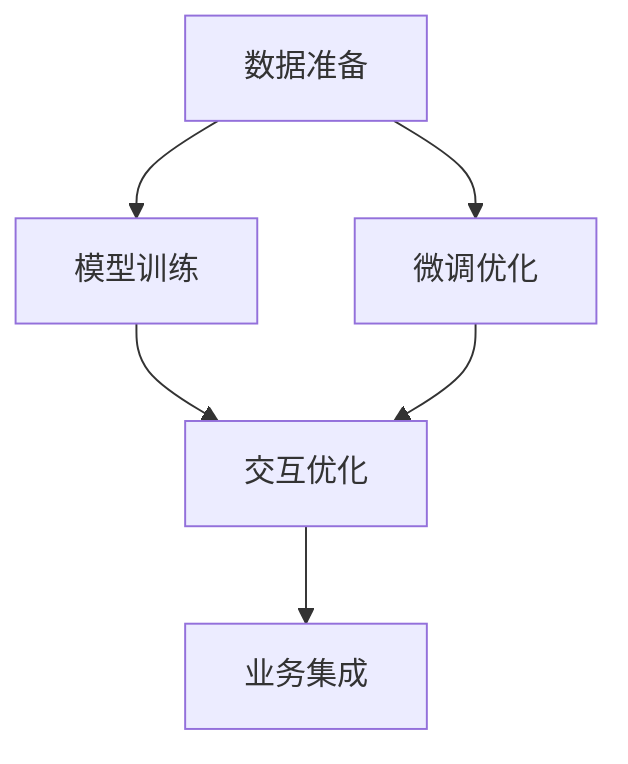

                 

# 电商平台中的AI大模型：从被动响应到主动预测与个性化服务

> 关键词：AI大模型, 电商平台, 个性化推荐, 预测模型, 交互式优化

## 1. 背景介绍

### 1.1 问题由来
随着电商平台的快速发展和消费者需求的多样化，传统的基于规则或人工策略的推荐系统已经难以满足用户的个性化需求。客户希望平台能更智能、更精确地推荐商品，帮助自己更快速地找到满意的商品。AI大模型通过强大的深度学习能力和丰富的先验知识，能够基于用户的历史行为、兴趣和情境信息，实现精准的个性化推荐和主动预测，大大提升了电商平台的运营效率和用户体验。

### 1.2 问题核心关键点
AI大模型在电商平台中的应用，主要是通过以下核心步骤实现的：

- **数据准备**：收集用户的浏览、购买、评价等行为数据，并标注商品的属性和标签。
- **模型训练**：在准备好的数据集上训练大模型，通过大规模数据进行预训练，获取通用的商品语义表示。
- **微调优化**：在电商平台的实际数据上进行微调，针对电商场景和用户需求进行优化，构建高效的个性化推荐和预测模型。
- **交互优化**：与用户进行动态交互，利用用户反馈实时调整模型参数，实现持续的性能提升。
- **业务集成**：将优化后的模型集成到电商平台的用户推荐系统中，实现实时推荐和预测。

以上步骤中，数据准备是基础，模型训练和微调是核心，交互优化和业务集成是保障。通过这些关键步骤，AI大模型能够在大规模电商数据上实现高效、个性化的推荐和预测服务，极大地提升平台的运营效率和用户体验。

## 2. 核心概念与联系

### 2.1 核心概念概述

在电商平台中应用AI大模型的过程中，需要掌握以下几个核心概念：

- **AI大模型**：基于深度学习架构，通过大规模数据进行预训练的通用语言模型或图像模型。在电商领域，常用BERT、GPT等自然语言处理模型，或DALL-E等计算机视觉模型。
- **数据准备**：对用户行为数据和商品属性数据进行清洗、标注和处理，构建可用于模型训练的数据集。
- **模型训练**：在大规模预训练模型的基础上，利用电商平台的数据进行微调，优化模型参数，以适应电商场景的需求。
- **微调优化**：对微调后的模型进行进一步优化，提升其在特定任务上的表现，如个性化推荐、商品分类、情感分析等。
- **交互优化**：通过用户反馈数据，不断调整和优化模型，实现更精准、更动态的推荐和预测。
- **业务集成**：将优化后的模型集成到电商平台的推荐系统中，提供实时、个性化的商品推荐和预测服务。

这些概念之间的联系可以通过以下Mermaid流程图来展示：



这个流程图展示了大模型在电商平台中的应用流程：

1. 首先收集和准备电商平台的数据，构建数据集。
2. 在准备好的数据集上训练大模型，学习通用的商品语义表示。
3. 在电商平台上进行微调，优化模型参数，适应电商场景的需求。
4. 利用用户反馈进行交互优化，实时调整模型。
5. 将优化后的模型集成到推荐系统中，提供个性化推荐和预测服务。

## 3. 核心算法原理 & 具体操作步骤

### 3.1 算法原理概述

在电商平台中，AI大模型的应用主要基于监督学习和迁移学习的范式，通过大规模数据进行预训练和微调，构建个性化推荐和预测模型。其核心原理如下：

1. **预训练**：在大规模无标注电商数据上，利用自监督学习任务训练通用大模型，学习通用的商品语义表示。
2. **微调优化**：在电商平台的标注数据上，通过有监督学习任务训练微调后的模型，优化其性能，提升推荐和预测的准确性。
3. **交互优化**：通过实时用户反馈数据，利用在线学习技术，动态调整模型参数，进一步提升推荐和预测的精准度。
4. **业务集成**：将优化后的模型集成到电商平台的推荐系统中，提供实时、个性化的商品推荐和预测服务。

### 3.2 算法步骤详解

以下是基于监督学习和迁移学习的AI大模型在电商平台中的应用步骤详解：

**Step 1: 数据准备**
- 收集电商平台的各项数据，包括用户行为数据、商品属性数据、用户评价数据等。
- 对数据进行清洗、标注和处理，构建可用于模型训练的数据集。
- 划分训练集、验证集和测试集，准备用于模型训练和评估的数据。

**Step 2: 模型训练**
- 选择合适的预训练大模型，如BERT、GPT等，将其视作初始化参数。
- 在准备好的数据集上，利用大规模预训练任务进行训练，如掩码语言模型、下一句预测等。
- 在预训练后，通过有监督学习任务进行微调，优化模型参数，提升在电商场景上的表现。

**Step 3: 微调优化**
- 在电商平台的实际数据上进行微调，选择合适的任务适配层和损失函数。
- 设置合适的学习率和优化器，应用正则化技术，防止过拟合。
- 进行迭代训练，周期性在验证集上评估模型性能，根据性能指标决定是否触发Early Stopping。
- 在测试集上评估微调后模型的性能，对比微调前后的精度提升。

**Step 4: 交互优化**
- 利用用户反馈数据，动态调整模型参数，实现持续的性能提升。
- 采用在线学习技术，如增量学习、对抗学习等，增强模型的鲁棒性和实时性。
- 根据用户的行为变化，实时调整模型的推荐策略和预测模型。

**Step 5: 业务集成**
- 将优化后的模型集成到电商平台的推荐系统中，提供实时、个性化的商品推荐和预测服务。
- 利用API接口，将模型的推理服务暴露给前端，实现前端调用。
- 监控系统性能，设置异常告警阈值，确保服务稳定性。

### 3.3 算法优缺点

基于监督学习和迁移学习的AI大模型在电商平台中的应用具有以下优点：

- **高效性**：利用大规模预训练模型的通用知识，可以在少量标注数据上快速训练出高效模型。
- **精准性**：通过微调优化，可以针对电商场景进行深度定制，提升推荐和预测的精准度。
- **可解释性**：通过控制微调过程，可以实现模型的可解释性，提升用户对推荐结果的信任度。

同时，该方法也存在一定的局限性：

- **数据依赖**：对标注数据的依赖较大，获取高质量标注数据的成本较高。
- **过拟合风险**：在标注数据较少的情况下，模型容易过拟合，泛化能力不足。
- **实时性**：大规模模型推理速度较慢，实时推荐性能受限。
- **模型复杂性**：模型的复杂度较高，部署和维护成本较大。

尽管存在这些局限性，但就目前而言，基于监督学习和迁移学习的微调方法仍是大模型在电商平台中应用的主流范式。未来相关研究的重点在于如何进一步降低微调对标注数据的依赖，提高模型的实时性和可解释性，同时兼顾精准度和成本效益。

### 3.4 算法应用领域

基于AI大模型的电商推荐系统，已经在商品推荐、价格预测、库存管理等多个领域得到了广泛的应用，成为电商技术的重要支撑。以下是几个典型的应用场景：

- **商品推荐**：根据用户的历史行为、兴趣和浏览数据，推荐可能感兴趣的商品。
- **价格预测**：基于市场趋势和用户行为，预测商品的价格走势，帮助平台进行价格调整。
- **库存管理**：预测商品的销售量，优化库存水平，减少库存积压。
- **个性化搜索**：根据用户的搜索习惯，提供个性化的搜索结果，提升搜索体验。
- **用户画像**：构建用户画像，提供个性化的商品推荐和个性化服务。

除了上述这些经典应用外，AI大模型还在电商平台的智能客服、广告投放、风险管理等多个环节中发挥了重要作用，极大地提升了电商平台的运营效率和用户体验。

## 4. 数学模型和公式 & 详细讲解 & 举例说明

### 4.1 数学模型构建

在电商平台中应用AI大模型的数学模型，主要包括以下几个组成部分：

- **输入层**：输入电商平台的各项数据，如用户行为、商品属性、评价等。
- **隐藏层**：通过预训练模型进行特征提取，学习通用的商品语义表示。
- **输出层**：根据任务需求，构建不同的输出层，如推荐列表、价格预测结果等。
- **损失函数**：设计合适的损失函数，衡量模型预测与真实标签之间的差异。
- **优化器**：选择合适的优化算法，如Adam、SGD等，更新模型参数。

### 4.2 公式推导过程

以商品推荐任务为例，我们推导一下基于深度学习的推荐模型公式：

设电商平台有 $N$ 个用户，每个用户有 $M$ 个历史行为数据，每个行为数据包括 $d$ 个特征。则每个用户的历史行为数据可以表示为 $X \in \mathbb{R}^{N \times M \times d}$。

设电商平台有 $K$ 个商品，每个商品有 $h$ 个属性。则每个商品的属性向量可以表示为 $H \in \mathbb{R}^{K \times h}$。

设推荐模型的输出为 $Y \in \mathbb{R}^{N \times K}$，表示每个用户对每个商品的评分。

模型的损失函数为均方误差损失函数，公式如下：

$$
\mathcal{L} = \frac{1}{NK} \sum_{i=1}^N \sum_{j=1}^K (y_{ij} - \hat{y}_{ij})^2
$$

其中 $y_{ij}$ 为真实评分，$\hat{y}_{ij}$ 为模型预测的评分。

模型的优化目标是最小化损失函数，即：

$$
\hat{y}_{ij} = \mathop{\arg\min}_{y_{ij}} \mathcal{L}
$$

模型可以通过梯度下降等优化算法，不断更新模型参数，最小化损失函数。

### 4.3 案例分析与讲解

以一个简单的商品推荐模型为例，我们给出模型训练的详细步骤：

1. **数据准备**：收集用户的历史行为数据和商品的属性信息，构建训练集和测试集。
2. **模型初始化**：选择合适的预训练模型，如BERT，并将其作为初始化参数。
3. **微调优化**：在电商平台的实际数据上进行微调，选择合适的损失函数和优化器，如交叉熵损失和Adam优化器。
4. **迭代训练**：进行多轮迭代训练，不断更新模型参数，最小化损失函数。
5. **性能评估**：在测试集上评估模型的性能，对比微调前后的精度提升。
6. **交互优化**：利用用户反馈数据，动态调整模型参数，提升推荐效果。
7. **业务集成**：将优化后的模型集成到推荐系统中，提供实时推荐服务。

## 5. 项目实践：代码实例和详细解释说明

### 5.1 开发环境搭建

在进行AI大模型在电商平台中的应用实践前，我们需要准备好开发环境。以下是使用Python进行TensorFlow和TensorFlow Addons开发的环境配置流程：

1. 安装Anaconda：从官网下载并安装Anaconda，用于创建独立的Python环境。

2. 创建并激活虚拟环境：
```bash
conda create -n tf-env python=3.8 
conda activate tf-env
```

3. 安装TensorFlow：根据CUDA版本，从官网获取对应的安装命令。例如：
```bash
conda install tensorflow -c tf -c conda-forge
```

4. 安装TensorFlow Addons：
```bash
pip install tensorflow-addons
```

5. 安装各类工具包：
```bash
pip install numpy pandas scikit-learn matplotlib tqdm jupyter notebook ipython
```

完成上述步骤后，即可在`tf-env`环境中开始开发实践。

### 5.2 源代码详细实现

下面我们以商品推荐任务为例，给出使用TensorFlow Addons对BERT模型进行微调的TensorFlow代码实现。

首先，定义推荐任务的数据处理函数：

```python
import tensorflow as tf
import tensorflow_addons as tfa
from transformers import BertTokenizer, TFBertForSequenceClassification

def create_dataset(batch_size):
    # 构建数据集
    tokenizer = BertTokenizer.from_pretrained('bert-base-cased')
    train_dataset = load_train_dataset(tokenizer)
    dev_dataset = load_dev_dataset(tokenizer)
    test_dataset = load_test_dataset(tokenizer)
    
    # 数据预处理
    def preprocess_function(examples):
        return tokenizer(examples['features'], padding='max_length', truncation=True, max_length=256)
    
    train_dataset = train_dataset.map(preprocess_function)
    dev_dataset = dev_dataset.map(preprocess_function)
    test_dataset = test_dataset.map(preprocess_function)
    
    # 分批次处理数据
    train_dataset = train_dataset.batch(batch_size)
    dev_dataset = dev_dataset.batch(batch_size)
    test_dataset = test_dataset.batch(batch_size)
    
    return train_dataset, dev_dataset, test_dataset
```

然后，定义模型和优化器：

```python
# 定义模型
model = TFBertForSequenceClassification.from_pretrained('bert-base-cased', num_labels=5)

# 定义优化器
optimizer = tfa.optimizers.AdamW(learning_rate=2e-5)
```

接着，定义训练和评估函数：

```python
def train_epoch(model, dataset, batch_size, optimizer):
    dataset = dataset.shuffle(buffer_size=1000)
    dataset = dataset.batch(batch_size)
    
    with tf.GradientTape() as tape:
        for batch in dataset:
            features, labels = batch['features'], batch['labels']
            with tf.GradientTape() as inner_tape:
                logits = model(features)
                loss = tf.reduce_mean(tfa.losses.SparseCategoricalCrossentropy(labels=labels, logits=logits))
            gradients = tape.gradient(loss, model.trainable_variables)
            optimizer.apply_gradients(zip(gradients, model.trainable_variables))
    
    return loss.numpy().mean()

def evaluate(model, dataset, batch_size):
    dataset = dataset.batch(batch_size)
    
    with tf.GradientTape() as tape:
        loss = 0.0
        for batch in dataset:
            features, labels = batch['features'], batch['labels']
            logits = model(features)
            loss += tf.reduce_mean(tfa.losses.SparseCategoricalCrossentropy(labels=labels, logits=logits))
        loss /= len(dataset)
    
    return loss.numpy()
```

最后，启动训练流程并在测试集上评估：

```python
epochs = 5
batch_size = 16

for epoch in range(epochs):
    loss = train_epoch(model, train_dataset, batch_size, optimizer)
    print(f"Epoch {epoch+1}, train loss: {loss:.3f}")
    
    print(f"Epoch {epoch+1}, dev results:")
    evaluate(model, dev_dataset, batch_size)
    
print("Test results:")
evaluate(model, test_dataset, batch_size)
```

以上就是使用TensorFlow Addons对BERT进行商品推荐任务微调的完整代码实现。可以看到，得益于TensorFlow Addons的强大封装，我们可以用相对简洁的代码完成BERT模型的加载和微调。

### 5.3 代码解读与分析

让我们再详细解读一下关键代码的实现细节：

**create_dataset函数**：
- 首先，定义分词器，使用预训练的BERT分词器。
- 然后，加载训练集、验证集和测试集数据，并进行预处理，如分词、padding等。
- 接着，将数据按批次进行划分，以便于模型训练。

**BertForSequenceClassification类**：
- 使用Transformers库提供的TFBertForSequenceClassification类，并指定模型架构和输出维度。
- 这里的模型输出维度为5，表示预测的商品类别数。

**train_epoch函数**：
- 在每个epoch内，对数据进行随机打乱和分批次处理，以提高训练效率。
- 利用梯度下降法，对模型进行前向传播和反向传播，计算损失函数。
- 根据计算得到的梯度，使用AdamW优化器更新模型参数。

**evaluate函数**：
- 在每个epoch结束后，对验证集进行评估，计算损失函数。
- 在测试集上进行测试，输出模型的平均损失。

**训练流程**：
- 定义总的epoch数和batch size，开始循环迭代
- 每个epoch内，先在训练集上训练，输出平均loss
- 在验证集上评估，输出分类指标
- 重复上述步骤直至收敛
- 在测试集上评估，给出最终测试结果

可以看到，TensorFlow配合TensorFlow Addons使得BERT微调的代码实现变得简洁高效。开发者可以将更多精力放在数据处理、模型改进等高层逻辑上，而不必过多关注底层的实现细节。

当然，工业级的系统实现还需考虑更多因素，如模型的保存和部署、超参数的自动搜索、更灵活的任务适配层等。但核心的微调范式基本与此类似。

## 6. 实际应用场景

### 6.1 智能客服系统

基于AI大模型的电商智能客服系统，能够7x24小时不间断服务，快速响应客户咨询，用自然流畅的语言解答各类常见问题。

在技术实现上，可以收集企业内部的历史客服对话记录，将问题-答案对作为监督数据，在此基础上对预训练客服模型进行微调。微调后的客服模型能够自动理解用户意图，匹配最合适的答案模板进行回复。对于客户提出的新问题，还可以接入检索系统实时搜索相关内容，动态组织生成回答。如此构建的智能客服系统，能大幅提升客户咨询体验和问题解决效率。

### 6.2 金融舆情监测

金融机构需要实时监测市场舆论动向，以便及时应对负面信息传播，规避金融风险。传统的人工监测方式成本高、效率低，难以应对网络时代海量信息爆发的挑战。基于大语言模型微调的文本分类和情感分析技术，为金融舆情监测提供了新的解决方案。

具体而言，可以收集金融领域相关的新闻、报道、评论等文本数据，并对其进行主题标注和情感标注。在此基础上对预训练语言模型进行微调，使其能够自动判断文本属于何种主题，情感倾向是正面、中性还是负面。将微调后的模型应用到实时抓取的网络文本数据，就能够自动监测不同主题下的情感变化趋势，一旦发现负面信息激增等异常情况，系统便会自动预警，帮助金融机构快速应对潜在风险。

### 6.3 个性化推荐系统

当前的推荐系统往往只依赖用户的历史行为数据进行物品推荐，无法深入理解用户的真实兴趣偏好。基于大语言模型微调技术，个性化推荐系统可以更好地挖掘用户行为背后的语义信息，从而提供更精准、更多样的推荐内容。

在实践中，可以收集用户浏览、点击、评论、分享等行为数据，提取和用户交互的物品标题、描述、标签等文本内容。将文本内容作为模型输入，用户的后续行为（如是否点击、购买等）作为监督信号，在此基础上微调预训练语言模型。微调后的模型能够从文本内容中准确把握用户的兴趣点。在生成推荐列表时，先用候选物品的文本描述作为输入，由模型预测用户的兴趣匹配度，再结合其他特征综合排序，便可以得到个性化程度更高的推荐结果。

### 6.4 未来应用展望

随着大语言模型和微调方法的不断发展，基于微调范式将在更多领域得到应用，为传统行业带来变革性影响。

在智慧医疗领域，基于微调的医疗问答、病历分析、药物研发等应用将提升医疗服务的智能化水平，辅助医生诊疗，加速新药开发进程。

在智能教育领域，微调技术可应用于作业批改、学情分析、知识推荐等方面，因材施教，促进教育公平，提高教学质量。

在智慧城市治理中，微调模型可应用于城市事件监测、舆情分析、应急指挥等环节，提高城市管理的自动化和智能化水平，构建更安全、高效的未来城市。

此外，在企业生产、社会治理、文娱传媒等众多领域，基于大模型微调的人工智能应用也将不断涌现，为经济社会发展注入新的动力。相信随着预训练语言模型和微调方法的持续演进，未来AI大模型必将在更广阔的应用领域大放异彩，深刻影响人类的生产生活方式。

## 7. 工具和资源推荐

### 7.1 学习资源推荐

为了帮助开发者系统掌握AI大模型在电商平台中的应用理论基础和实践技巧，这里推荐一些优质的学习资源：

1. TensorFlow官方文档：提供了TensorFlow和TensorFlow Addons的详细API文档和教程，是学习模型的绝佳资源。
2. 《深度学习框架TensorFlow实战》书籍：系统介绍了TensorFlow和TensorFlow Addons的应用实践，涵盖模型训练、微调等核心内容。
3. 《自然语言处理入门与实践》书籍：介绍了自然语言处理的基本概念和应用实践，帮助理解模型训练和微调过程。
4. HuggingFace官方文档：提供了丰富的预训练语言模型资源，并展示了微调的样例代码。
5. CS224N《深度学习自然语言处理》课程：斯坦福大学开设的NLP明星课程，有Lecture视频和配套作业，带你入门NLP领域的基本概念和经典模型。

通过对这些资源的学习实践，相信你一定能够快速掌握AI大模型在电商平台中的应用精髓，并用于解决实际的NLP问题。

### 7.2 开发工具推荐

高效的开发离不开优秀的工具支持。以下是几款用于AI大模型在电商平台中应用开发的常用工具：

1. TensorFlow：基于Python的开源深度学习框架，灵活动态的计算图，适合快速迭代研究。大部分预训练语言模型都有TensorFlow版本的实现。
2. TensorFlow Addons：TensorFlow的扩展库，提供了丰富的优化器和模型，方便微调模型的开发和训练。
3. Weights & Biases：模型训练的实验跟踪工具，可以记录和可视化模型训练过程中的各项指标，方便对比和调优。
4. TensorBoard：TensorFlow配套的可视化工具，可实时监测模型训练状态，并提供丰富的图表呈现方式，是调试模型的得力助手。
5. Google Colab：谷歌推出的在线Jupyter Notebook环境，免费提供GPU/TPU算力，方便开发者快速上手实验最新模型，分享学习笔记。

合理利用这些工具，可以显著提升AI大模型在电商平台中的应用开发效率，加快创新迭代的步伐。

### 7.3 相关论文推荐

AI大模型在电商平台中的应用研究源于学界的持续研究。以下是几篇奠基性的相关论文，推荐阅读：

1. Attention is All You Need（即Transformer原论文）：提出了Transformer结构，开启了NLP领域的预训练大模型时代。
2. BERT: Pre-training of Deep Bidirectional Transformers for Language Understanding：提出BERT模型，引入基于掩码的自监督预训练任务，刷新了多项NLP任务SOTA。
3. Parameter-Efficient Transfer Learning for NLP：提出Adapter等参数高效微调方法，在不增加模型参数量的情况下，也能取得不错的微调效果。
4. Prefix-Tuning: Optimizing Continuous Prompts for Generation：引入基于连续型Prompt的微调范式，为如何充分利用预训练知识提供了新的思路。
5. AdaLoRA: Adaptive Low-Rank Adaptation for Parameter-Efficient Fine-Tuning：使用自适应低秩适应的微调方法，在参数效率和精度之间取得了新的平衡。

这些论文代表了大语言模型在电商平台中的应用发展脉络。通过学习这些前沿成果，可以帮助研究者把握学科前进方向，激发更多的创新灵感。

## 8. 总结：未来发展趋势与挑战

### 8.1 总结

本文对AI大模型在电商平台中的应用进行了全面系统的介绍。首先阐述了AI大模型在电商平台中的应用背景和意义，明确了微调在拓展预训练模型应用、提升推荐和预测精准度方面的独特价值。其次，从原理到实践，详细讲解了监督微调的数学原理和关键步骤，给出了微调任务开发的完整代码实例。同时，本文还广泛探讨了AI大模型在智能客服、金融舆情、个性化推荐等多个行业领域的应用前景，展示了微调范式的巨大潜力。此外，本文精选了微调技术的各类学习资源，力求为读者提供全方位的技术指引。

通过本文的系统梳理，可以看到，基于AI大模型的电商推荐系统已经取得了显著的效果，极大地提升了电商平台的运营效率和用户体验。未来，随着AI大模型的不断发展，基于微调范式将在更多领域得到应用，为传统行业带来变革性影响。

### 8.2 未来发展趋势

展望未来，AI大模型在电商平台中的应用将呈现以下几个发展趋势：

1. **模型规模持续增大**：随着算力成本的下降和数据规模的扩张，预训练语言模型的参数量还将持续增长。超大规模语言模型蕴含的丰富语言知识，有望支撑更加复杂多变的电商推荐任务。
2. **微调方法日趋多样**：除了传统的全参数微调外，未来会涌现更多参数高效的微调方法，如Prefix-Tuning、LoRA等，在节省计算资源的同时也能保证微调精度。
3. **持续学习成为常态**：随着数据分布的不断变化，微调模型也需要持续学习新知识以保持性能。如何在不遗忘原有知识的同时，高效吸收新样本信息，将成为重要的研究课题。
4. **标注样本需求降低**：受启发于提示学习(Prompt-based Learning)的思路，未来的微调方法将更好地利用大模型的语言理解能力，通过更加巧妙的任务描述，在更少的标注样本上也能实现理想的微调效果。
5. **多模态微调崛起**：当前的微调主要聚焦于纯文本数据，未来会进一步拓展到图像、视频、语音等多模态数据微调。多模态信息的融合，将显著提升语言模型对现实世界的理解和建模能力。

以上趋势凸显了AI大模型在电商平台中的应用前景。这些方向的探索发展，必将进一步提升电商平台的运营效率和用户体验，为电商业务带来新的突破。

### 8.3 面临的挑战

尽管AI大模型在电商平台中的应用已经取得了显著效果，但在迈向更加智能化、普适化应用的过程中，仍面临诸多挑战：

1. **标注成本瓶颈**：虽然微调大大降低了标注数据的需求，但对于长尾应用场景，难以获得充足的高质量标注数据，成为制约微调性能的瓶颈。如何进一步降低微调对标注样本的依赖，将是一大难题。
2. **模型鲁棒性不足**：当前微调模型面对域外数据时，泛化性能往往大打折扣。对于测试样本的微小扰动，微调模型的预测也容易发生波动。如何提高微调模型的鲁棒性，避免灾难性遗忘，还需要更多理论和实践的积累。
3. **实时性有待提高**：大规模模型推理速度较慢，实时推荐性能受限。如何在保证性能的同时，简化模型结构，提升推理速度，优化资源占用，将是重要的优化方向。
4. **可解释性亟需加强**：当前微调模型更像是"黑盒"系统，难以解释其内部工作机制和决策逻辑。对于医疗、金融等高风险应用，算法的可解释性和可审计性尤为重要。如何赋予微调模型更强的可解释性，将是亟待攻克的难题。
5. **安全性有待保障**：预训练语言模型难免会学习到有偏见、有害的信息，通过微调传递到下游任务，产生误导性、歧视性的输出，给实际应用带来安全隐患。如何从数据和算法层面消除模型偏见，避免恶意用途，确保输出的安全性，也将是重要的研究课题。
6. **知识整合能力不足**：现有的微调模型往往局限于任务内数据，难以灵活吸收和运用更广泛的先验知识。如何让微调过程更好地与外部知识库、规则库等专家知识结合，形成更加全面、准确的信息整合能力，还有很大的想象空间。

正视微调面临的这些挑战，积极应对并寻求突破，将是大语言模型在电商平台中应用走向成熟的必由之路。相信随着学界和产业界的共同努力，这些挑战终将一一被克服，AI大模型必将在电商平台中展现更大的应用潜力。

### 8.4 研究展望

面对AI大模型在电商平台中的诸多挑战，未来的研究需要在以下几个方面寻求新的突破：

1. **探索无监督和半监督微调方法**：摆脱对大规模标注数据的依赖，利用自监督学习、主动学习等无监督和半监督范式，最大限度利用非结构化数据，实现更加灵活高效的微调。
2. **研究参数高效和计算高效的微调范式**：开发更加参数高效的微调方法，在固定大部分预训练参数的同时，只更新极少量的任务相关参数。同时优化微调模型的计算图，减少前向传播和反向传播的资源消耗，实现更加轻量级、实时性的部署。
3. **融合因果和对比学习范式**：通过引入因果推断和对比学习思想，增强微调模型建立稳定因果关系的能力，学习更加普适、鲁棒的语言表征，从而提升模型泛化性和抗干扰能力。
4. **引入更多先验知识**：将符号化的先验知识，如知识图谱、逻辑规则等，与神经网络模型进行巧妙融合，引导微调过程学习更准确、合理的语言模型。同时加强不同模态数据的整合，实现视觉、语音等多模态信息与文本信息的协同建模。
5. **结合因果分析和博弈论工具**：将因果分析方法引入微调模型，识别出模型决策的关键特征，增强输出解释的因果性和逻辑性。借助博弈论工具刻画人机交互过程，主动探索并规避模型的脆弱点，提高系统稳定性。
6. **纳入伦理道德约束**：在模型训练目标中引入伦理导向的评估指标，过滤和惩罚有偏见、有害的输出倾向。同时加强人工干预和审核，建立模型行为的监管机制，确保输出符合人类价值观和伦理道德。

这些研究方向的探索，必将引领AI大模型在电商平台中的应用走向更高的台阶，为电商业务带来更多的创新和突破。未来，随着AI大模型的不断发展，相信其在电商平台中的应用将更加广泛和深入，深刻影响电商业务的各个环节。

## 9. 附录：常见问题与解答

**Q1：AI大模型在电商平台中的应用是否需要从头训练？**

A: 通常情况下，AI大模型在电商平台中的应用不需要从头训练。通过预训练模型进行微调，可以显著减少从头训练所需的时间和计算资源，同时利用已有的大规模知识，提升推荐和预测的精准度。

**Q2：微调过程中如何选择合适的学习率？**

A: 微调的学习率一般要比预训练时小1-2个数量级，如果使用过大的学习率，容易破坏预训练权重，导致过拟合。一般建议从1e-5开始调参，逐步减小学习率，直至收敛。也可以使用warmup策略，在开始阶段使用较小的学习率，再逐渐过渡到预设值。需要注意的是，不同的优化器(如Adam、SGD等)以及不同的学习率调度策略，可能需要设置不同的学习率阈值。

**Q3：微调过程中如何避免过拟合？**

A: 过拟合是微调面临的主要挑战，尤其是在标注数据较少的情况下。常见的缓解策略包括：
1. 数据增强：通过回译、近义替换等方式扩充训练集
2. 正则化：使用L2正则、Dropout、Early Stopping等防止过拟合
3. 对抗训练：引入对抗样本，提高模型鲁棒性
4. 参数高效微调：只调整少量参数(如Adapter、Prefix等)，减小过拟合风险
5. 多模型集成：训练多个微调模型，取平均输出，抑制过拟合

这些策略往往需要根据具体任务和数据特点进行灵活组合。只有在数据、模型、训练、推理等各环节进行全面优化，才能最大限度地发挥AI大模型的潜力。

**Q4：微调后的模型在实际应用中如何保证实时性？**

A: 微调后的模型在实际应用中，实时性往往成为瓶颈。为了提升实时性，可以采用以下策略：
1. 模型裁剪：去除不必要的层和参数，减小模型尺寸，加快推理速度
2. 量化加速：将浮点模型转为定点模型，压缩存储空间，提高计算效率
3. 服务化封装：将模型封装为标准化服务接口，便于集成调用
4. 弹性伸缩：根据请求流量动态调整资源配置，平衡服务质量和成本
5. 模型压缩：通过剪枝、量化等技术，进一步压缩模型规模，优化推理速度。

这些策略能够显著提升微调后模型的实时性和效率，使其能够更好地适应电商平台的实时推荐需求。

**Q5：如何提高微调模型的可解释性？**

A: 提高微调模型的可解释性，需要从以下几个方面进行改进：
1. 模型设计：选择可解释性强的模型架构，如决策树、线性回归等
2. 特征工程：使用可解释的特征，如用户行为、商品属性等
3. 解释方法：引入可解释性工具，如LIME、SHAP等，对模型决策进行解释
4. 用户界面：设计友好的用户界面，展示模型的决策过程和推理逻辑

这些方法能够帮助用户更好地理解模型的工作机制，增强对推荐结果的信任度，提升用户体验。

---

作者：禅与计算机程序设计艺术 / Zen and the Art of Computer Programming

