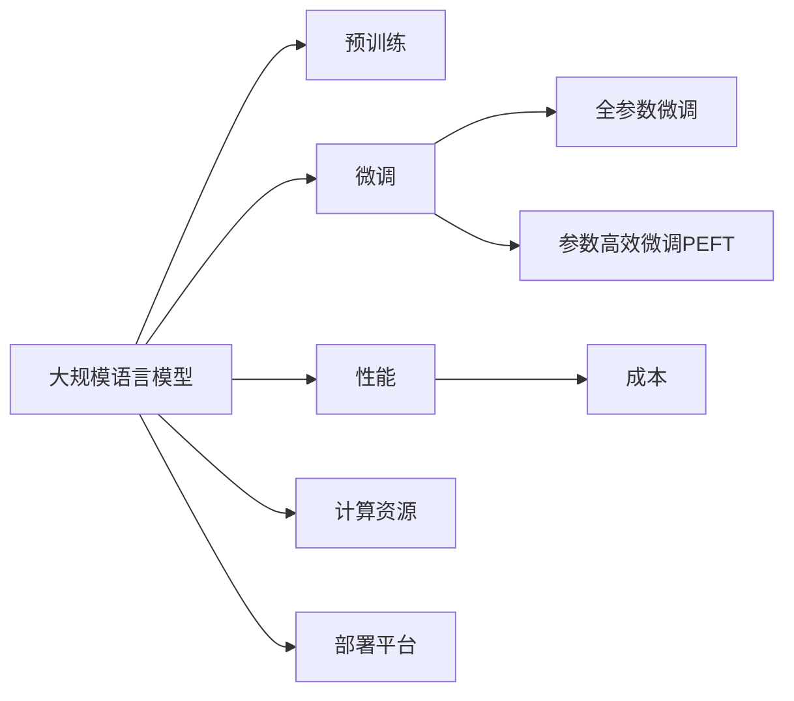
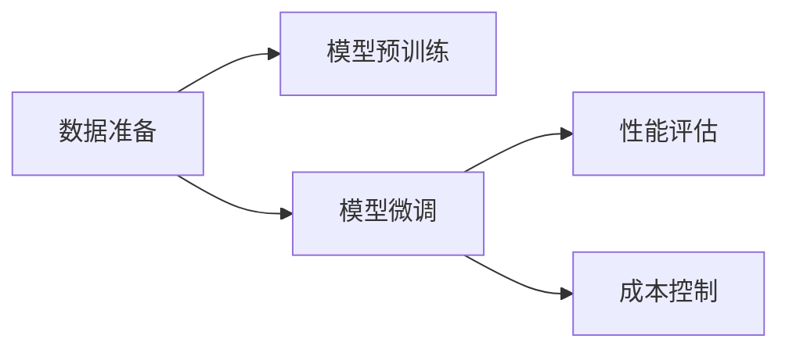

                 

# 电商平台中的AI大模型：性能与成本的平衡

## 1. 背景介绍

随着电商平台的迅速发展，对算法的依赖也愈加凸显。如何在保证性能的同时，降低算法的部署和维护成本，成为业界关注的焦点。近年来，大规模语言模型（如BERT、GPT-3）在电商平台中的应用，带来了显著的性能提升，但相应的计算资源消耗也让人望而却步。本文将探讨如何在大模型与性能之间找到平衡点，既提升电商平台的用户体验，又控制成本开支。

## 2. 核心概念与联系

### 2.1 核心概念概述

本文涉及的核心概念包括：

- **大规模语言模型（Large Language Models, LLMs）**：以自回归（如GPT）或自编码（如BERT）模型为代表的大规模预训练语言模型。这些模型在处理自然语言任务上展现了卓越的性能。

- **预训练（Pre-training）**：在大规模无标签文本数据上进行自监督学习，以学习通用的语言表示。

- **微调（Fine-tuning）**：在预训练模型基础上，使用任务特定的数据进行有监督学习，优化模型在特定任务上的性能。

- **性能（Performance）**：指模型的准确性、速度、资源占用等指标。

- **成本（Cost）**：指模型训练、部署和维护的费用。

- **参数高效微调（Parameter-Efficient Fine-Tuning, PEFT）**：只更新模型中部分参数，以减少计算资源消耗。

- **计算资源（Computational Resources）**：指模型训练和推理所需的GPU、CPU、内存等。

- **部署平台（Deployment Platforms）**：如AWS、Google Cloud、阿里云等，提供模型部署、管理和调度的服务。

这些核心概念之间的关系可以通过以下Mermaid流程图表示：



### 2.2 核心概念原理和架构的 Mermaid 流程图

在商平台上，使用大模型进行任务微调的过程可以概括为：

1. **数据准备**：收集电商平台相关数据，如用户评论、商品描述、交易记录等。
2. **模型预训练**：在大规模无标签文本数据上训练大规模语言模型。
3. **模型微调**：在电商平台任务上微调模型，提升任务性能。
4. **性能评估**：使用任务特定数据评估模型性能。
5. **成本控制**：分析模型性能和计算资源消耗，平衡性能与成本。

流程图示例：



## 3. 核心算法原理 & 具体操作步骤

### 3.1 算法原理概述

基于大规模语言模型的电商平台任务微调，其核心思想是通过任务特定的数据优化模型，使其在特定任务上表现更佳。这涉及两个主要步骤：预训练和微调。

**预训练**：在无标签文本数据上训练大规模语言模型，学习通用的语言表示。

**微调**：在特定任务上使用有标签数据进行有监督学习，优化模型在该任务上的性能。

### 3.2 算法步骤详解

1. **数据准备**：收集电商平台相关数据，如用户评论、商品描述、交易记录等。
2. **模型预训练**：使用大规模无标签文本数据（如维基百科、新闻等）训练大规模语言模型。
3. **模型微调**：在电商平台任务上微调模型，提升任务性能。
4. **性能评估**：使用任务特定数据评估模型性能。
5. **成本控制**：分析模型性能和计算资源消耗，平衡性能与成本。

### 3.3 算法优缺点

**优点**：

- **通用性强**：适用于多种自然语言处理任务，如文本分类、情感分析、推荐系统等。
- **效果显著**：在大规模语料上预训练的模型，通常能够显著提升下游任务的性能。
- **可解释性高**：相较于传统的机器学习模型，大模型的推理过程更容易理解。

**缺点**：

- **计算成本高**：大规模语言模型需要大量的计算资源进行训练和推理。
- **资源消耗大**：模型参数多，占用的内存和存储资源较大。
- **部署复杂**：模型的部署和维护需要专业的技术支持。

### 3.4 算法应用领域

基于大规模语言模型的电商平台任务微调，可以应用于以下领域：

- **用户评论分析**：情感分析、产品评价、用户行为分析等。
- **商品推荐**：基于用户历史行为和评论的推荐系统。
- **广告投放**：自然语言生成广告，提升广告效果。
- **搜索排序**：优化搜索结果的排序，提升用户体验。

## 4. 数学模型和公式 & 详细讲解 & 举例说明

### 4.1 数学模型构建

假设任务为文本分类，输入为自然语言文本，输出为类别标签。模型 $M_{\theta}$ 由预训练层和微调层组成。微调层的输出为 $h_i$，类别标签为 $y_i$，则模型的损失函数 $L$ 可以表示为：

$$ L = \frac{1}{N} \sum_{i=1}^N \ell(h_i, y_i) $$

其中，$\ell$ 为交叉熵损失函数。

### 4.2 公式推导过程

以分类任务为例，损失函数推导如下：

$$ L = -\frac{1}{N} \sum_{i=1}^N \log(\sigma(h_i^Ty_i)) $$

其中，$\sigma$ 为sigmoid函数。

在训练过程中，使用反向传播算法计算梯度并更新模型参数。优化目标为最小化损失函数 $L$。

### 4.3 案例分析与讲解

以电商平台商品推荐为例，任务为预测用户购买某商品的意图。模型结构如图1所示。

图1：商品推荐模型结构

输入为商品描述，模型预训练层将输入转换为向量表示 $h_1$，微调层输出分类向量 $h_2$，最终预测用户购买意图为类别 $y$。损失函数为交叉熵损失函数。

## 5. 项目实践：代码实例和详细解释说明

### 5.1 开发环境搭建

1. **环境配置**：在Python环境中安装PyTorch、TensorFlow等深度学习框架，并配置相应的硬件资源（如GPU）。
2. **数据准备**：收集电商平台相关数据，如用户评论、商品描述、交易记录等，并进行数据预处理。
3. **模型选择**：选择合适的预训练模型（如BERT、GPT）进行微调。
4. **模型训练**：在电商平台数据集上训练微调模型，调整超参数以优化性能。

### 5.2 源代码详细实现

以BERT微调为例，代码实现如下：

```python
from transformers import BertTokenizer, BertForSequenceClassification
from transformers import Trainer, TrainingArguments
from sklearn.model_selection import train_test_split
import torch

# 准备数据
train_dataset, test_dataset = train_test_split(..., test_size=0.2)

# 加载预训练模型和分词器
tokenizer = BertTokenizer.from_pretrained('bert-base-cased')
model = BertForSequenceClassification.from_pretrained('bert-base-cased', num_labels=2)

# 定义训练参数
training_args = TrainingArguments(
    output_dir='./results',
    per_device_train_batch_size=16,
    per_device_eval_batch_size=16,
    evaluation_strategy='epoch',
    learning_rate=2e-5,
    num_train_epochs=3,
    weight_decay=0.01,
    load_best_model_at_end=True,
    metric_for_best_model='accuracy'
)

# 定义训练器
trainer = Trainer(
    model=model,
    args=training_args,
    train_dataset=train_dataset,
    eval_dataset=test_dataset
)

# 开始训练
trainer.train()
```

### 5.3 代码解读与分析

- **数据准备**：使用`train_test_split`函数将数据集分为训练集和测试集。
- **模型选择**：使用`BertForSequenceClassification`类加载预训练模型，并指定输出层数为2，用于二分类任务。
- **训练参数**：定义训练参数，如批大小、学习率、训练轮数等。
- **训练器**：使用`Trainer`类定义训练器，并指定训练和评估数据集。
- **训练**：调用`trainer.train()`方法开始训练。

### 5.4 运行结果展示

训练结束后，可以使用测试集对模型进行评估，计算模型的准确率、召回率、F1值等指标。

## 6. 实际应用场景

### 6.1 用户评论分析

电商平台的用户评论分析是一个典型任务。通过微调大模型，可以自动对用户评论进行情感分析，识别出正负面情感评论，并进行情感倾向性分类。这有助于电商平台了解用户对商品和服务的态度，及时采取措施提升用户体验。

### 6.2 商品推荐

商品推荐系统可以基于用户的历史行为和评论，使用微调大模型进行推荐。模型在用户行为数据上微调，可以预测用户对商品的兴趣，生成个性化的推荐列表。

### 6.3 广告投放

自然语言生成广告可以显著提升广告效果。通过微调大模型，自动生成符合用户需求的广告文案，提高广告点击率和转化率。

### 6.4 未来应用展望

未来，基于大模型的电商平台任务微调将有更广泛的应用前景：

- **多模态数据处理**：结合图像、视频等多模态数据，提升自然语言处理的全面性。
- **跨领域迁移**：在大模型上微调，可以提升模型的跨领域迁移能力。
- **动态更新**：随着用户行为和商品描述的动态变化，模型可以实时更新，保持最新的模型性能。

## 7. 工具和资源推荐

### 7.1 学习资源推荐

- **课程**：
  - 《深度学习自然语言处理》（CS224N）：斯坦福大学课程，涵盖了NLP的基本概念和经典模型。
  - 《Transformers from the ground up》：Hugging Face官方博客，深入浅出地介绍Transformer和BERT等模型。

- **书籍**：
  - 《深度学习》（Ian Goodfellow）：经典教材，介绍了深度学习的理论基础和实现方法。
  - 《自然语言处理与深度学习》（Richard Socher）：介绍了NLP与深度学习的结合。

### 7.2 开发工具推荐

- **深度学习框架**：
  - PyTorch：灵活的动态计算图，适用于研究和实验。
  - TensorFlow：生产部署方便，适合大规模工程应用。

- **自然语言处理工具库**：
  - Hugging Face Transformers：提供多种预训练模型的封装，方便微调使用。
  - spaCy：轻量级自然语言处理库，适用于NLP任务开发。

### 7.3 相关论文推荐

- **BERT**：
  - Devlin等（2019）：BERT: Pre-training of Deep Bidirectional Transformers for Language Understanding
  - Clark等（2019）：BERT: Pre-training of Deep Bidirectional Transformers for Language Understanding

- **GPT-3**：
  - Radford等（2020）：Language Models are Unsupervised Multitask Learners
  - Brown等（2020）：Language Models are Unsupervised Multitask Learners

## 8. 总结：未来发展趋势与挑战

### 8.1 研究成果总结

本文对基于大模型的电商平台任务微调进行了全面介绍，包括数据准备、模型训练、性能评估等步骤。总结了微调方法在用户评论分析、商品推荐、广告投放等实际应用中的优势和挑战。

### 8.2 未来发展趋势

未来，基于大模型的电商平台任务微调将向以下方向发展：

- **更高效计算**：引入计算加速技术（如TPU），提升模型的训练和推理速度。
- **更小模型**：开发更加轻量级的模型结构，减少计算资源消耗。
- **更智能推理**：引入自然语言推理、知识图谱等技术，提升模型的智能推理能力。

### 8.3 面临的挑战

尽管大模型在电商平台应用中展现了巨大的潜力，但也面临以下挑战：

- **计算资源消耗大**：大规模语言模型需要大量的计算资源，如何高效利用资源是关键问题。
- **模型部署复杂**：模型的部署和维护需要专业的技术支持。
- **数据隐私保护**：电商平台涉及大量用户数据，如何保护数据隐私是一个重要问题。

### 8.4 研究展望

未来，基于大模型的电商平台任务微调需要在性能与成本之间找到平衡点，可以考虑以下研究方向：

- **参数高效微调**：开发更高效的低秩微调方法，减少计算资源消耗。
- **多任务学习**：探索多任务学习（Multi-task Learning）方法，提升模型在多个任务上的性能。
- **模型压缩**：引入模型压缩技术，如剪枝、量化等，提升模型的推理速度和资源利用效率。

## 9. 附录：常见问题与解答

**Q1：电商平台中如何选择合适的大模型进行微调？**

A: 选择合适的大模型进行微调，需要考虑以下因素：

- **任务类型**：不同的任务适合不同的大模型，如分类任务适合BERT，生成任务适合GPT。
- **数据规模**：大数据集适合大模型，小数据集适合参数高效微调方法。
- **性能要求**：根据业务需求，选择性能更优的模型。

**Q2：电商平台中的大模型微调，如何处理计算资源不足的问题？**

A: 处理计算资源不足的问题，可以考虑以下方法：

- **分布式训练**：使用分布式训练技术，提高计算效率。
- **模型压缩**：使用模型压缩技术，减少计算资源消耗。
- **梯度累加**：使用梯度累加技术，提升计算效率。

**Q3：电商平台中的大模型微调，如何保证模型的公平性和可靠性？**

A: 保证模型的公平性和可靠性，可以考虑以下方法：

- **数据清洗**：清洗数据中的偏见和不公平信息，避免模型学习到有害信息。
- **公平性评估**：使用公平性评估指标，评估模型的公平性和可靠性。
- **多模型集成**：使用多模型集成技术，提升模型的鲁棒性和可靠性。

**Q4：电商平台中的大模型微调，如何提升模型的可解释性？**

A: 提升模型的可解释性，可以考虑以下方法：

- **特征可视化**：可视化模型的特征，理解模型的内部机制。
- **自然语言推理**：引入自然语言推理技术，提高模型的可解释性。
- **交互式推理**：开发交互式推理工具，让用户理解模型的推理过程。

---

作者：禅与计算机程序设计艺术 / Zen and the Art of Computer Programming

