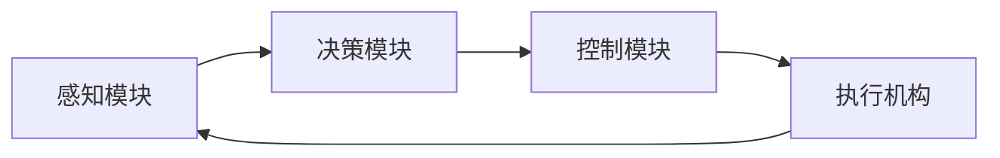

                 

自动驾驶系统、感知、决策、控制、深度学习、传感器、预测、路径规划、控制器

## 1. 背景介绍

自动驾驶系统（Autonomous Driving System，ADS）是指能够在不需要人类驾驶员直接操控的情况下，通过传感器感知环境、决策规划路径并控制车辆行驶的系统。随着人工智能和计算机视觉技术的发展，自动驾驶系统已经从科幻走进了现实，并逐渐走向商业化应用。本文将详细介绍自动驾驶系统的感知、决策和控制三大核心模块，并结合数学模型、算法原理和项目实践进行深入分析。

## 2. 核心概念与联系

自动驾驶系统的核心是感知、决策和控制三大模块，它们紧密联系，共同实现车辆的自主驾驶。感知模块负责获取环境信息，决策模块根据感知结果规划路径，控制模块则根据决策结果控制车辆行驶。下图是自动驾驶系统的架构示意图：



## 3. 核心算法原理 & 具体操作步骤

### 3.1 算法原理概述

自动驾驶系统的核心算法包括感知算法、预测算法、路径规划算法和控制算法。感知算法用于从传感器数据中提取环境信息，预测算法用于预测其他车辆和行人的运动轨迹，路径规划算法用于规划车辆的行驶路径，控制算法则用于控制车辆按照规划路径行驶。

### 3.2 算法步骤详解

#### 3.2.1 感知算法

感知算法的输入是传感器数据，输出是环境信息。常用的传感器包括摄像头、激光雷达、毫米波雷达和超声波传感器。感知算法的步骤如下：

1. 数据预处理：对传感器数据进行滤波、去噪和校准等预处理。
2. 特征提取：提取传感器数据中的有用特征，如边缘、纹理和颜色等。
3. 目标检测：检测环境中的目标，如车辆、行人和障碍物等。
4. 目标跟踪：跟踪目标的运动轨迹，更新目标的位置和状态信息。
5. 环境建模：根据目标信息建立环境模型，如地图和场景等。

#### 3.2.2 预测算法

预测算法的输入是目标的位置和状态信息，输出是目标的运动轨迹。常用的预测算法包括基于物理模型的预测算法和基于深度学习的预测算法。预测算法的步骤如下：

1. 目标状态估计：根据目标的位置和状态信息估计目标的运动状态，如速度和加速度等。
2. 运动模型建立：根据目标的运动状态建立运动模型，如常用的物理模型或深度学习模型等。
3. 轨迹预测：根据运动模型预测目标的运动轨迹。

#### 3.2.3 路径规划算法

路径规划算法的输入是环境模型和目标的运动轨迹，输出是车辆的行驶路径。常用的路径规划算法包括A\*算法、Rapidly-exploring Random Tree（RRT）算法和Probabilistic Roadmap（PRM）算法等。路径规划算法的步骤如下：

1. 可行路径搜索：搜索环境模型中可行的路径。
2. 成本评估：根据路径的长度、平滑度和安全性等因素评估路径的成本。
3. 路径选择：选择成本最低的路径作为车辆的行驶路径。

#### 3.2.4 控制算法

控制算法的输入是车辆的行驶路径，输出是车辆的控制指令。常用的控制算法包括PID控制算法、模型预测控制（MPC）算法和神经网络控制算法等。控制算法的步骤如下：

1. 路径跟踪：跟踪车辆的实际位置和行驶路径，计算位置误差。
2. 控制指令生成：根据位置误差生成控制指令，如油门、刹车和方向盘转角等。
3. 执行机构控制：控制执行机构执行控制指令，实现车辆的自主驾驶。

### 3.3 算法优缺点

感知算法的优点是能够获取丰富的环境信息，缺点是计算量大，易受传感器噪声和干扰影响。预测算法的优点是能够预测目标的运动轨迹，缺点是易受目标运动模型的影响。路径规划算法的优点是能够规划安全和高效的路径，缺点是易受环境模型的影响。控制算法的优点是能够实现精确的路径跟踪，缺点是易受执行机构的响应时间和精度的影响。

### 3.4 算法应用领域

自动驾驶系统的应用领域包括汽车、无人机、轮船和工业机器人等。其中，汽车自动驾驶系统是最受关注的领域之一，已经有多家企业推出了商业化的自动驾驶汽车产品。

## 4. 数学模型和公式 & 详细讲解 & 举例说明

### 4.1 数学模型构建

自动驾驶系统的数学模型包括环境模型、目标运动模型和车辆动力学模型等。环境模型描述了车辆所处的环境，目标运动模型描述了目标的运动规律，车辆动力学模型描述了车辆的运动规律。

#### 4.1.1 环境模型

环境模型通常用地图表示，地图描述了环境中的道路、车道线、障碍物和目标等信息。地图可以用栅格地图表示，也可以用图表示。栅格地图将环境划分为均匀的栅格，每个栅格表示环境中的一个小区域。图表示法则用节点表示环境中的关键位置，用边表示环境中的连通路径。

#### 4.1.2 目标运动模型

目标运动模型描述了目标的运动规律。常用的目标运动模型包括常速模型、加速度模型和随机模型等。常速模型假设目标的速度保持不变，加速度模型假设目标的加速度保持不变，随机模型则假设目标的运动轨迹服从一定的概率分布。

#### 4.1.3 车辆动力学模型

车辆动力学模型描述了车辆的运动规律。常用的车辆动力学模型包括单轨模型、双轨模型和四轮模型等。单轨模型假设车辆为单轨车辆，只考虑车辆的纵向运动。双轨模型假设车辆为双轨车辆，考虑车辆的纵向和横向运动。四轮模型则考虑车辆的纵向、横向和转向运动。

### 4.2 公式推导过程

#### 4.2.1 目标运动预测

设目标的位置在时刻$t$为$(x_t, y_t)$，速度为$(v_t, w_t)$，加速度为$(a_t, \alpha_t)$。则目标在时刻$t+1$的位置可以用以下公式预测：

$$
\begin{cases}
x_{t+1} = x_t + v_t \Delta t + \frac{1}{2} a_t \Delta t^2 \\
y_{t+1} = y_t + w_t \Delta t + \frac{1}{2} \alpha_t \Delta t^2
\end{cases}
$$

其中，$\Delta t$为预测时间间隔。

#### 4.2.2 路径规划

设环境模型为图$G=(V, E)$，其中$V$为节点集，$E$为边集。设车辆的当前位置为$v_c \in V$，目标位置为$v_g \in V$，路径成本函数为$c: E \rightarrow \mathbb{R}$。则车辆的行驶路径可以用最短路径算法搜索得到，路径长度为：

$$
L = \min_{v_1, \ldots, v_n \in V} \sum_{i=1}^{n-1} c(v_i, v_{i+1})
$$

其中，$v_1 = v_c, v_n = v_g$，$v_1, \ldots, v_n$为路径上的节点。

#### 4.2.3 车辆控制

设车辆的当前位置为$(x_c, y_c)$，行驶路径为$(x_1, y_1), \ldots, (x_n, y_n)$，控制指令为$(a, \delta)$，其中$a$为油门，$\delta$为方向盘转角。则车辆在时刻$t+1$的位置可以用以下公式预测：

$$
\begin{cases}
x_{t+1} = x_t + v_t \cos(\theta_t) \Delta t \\
y_{t+1} = y_t + v_t \sin(\theta_t) \Delta t \\
\theta_{t+1} = \theta_t + v_t \frac{\tan(\delta_t)}{L} \Delta t
\end{cases}
$$

其中，$\theta_t$为时刻$t$的车辆方向角，$L$为车辆的轴距，$v_t$为时刻$t$的车辆速度。

### 4.3 案例分析与讲解

例如，假设车辆当前位置为$(0, 0)$，目标位置为$(10, 10)$，环境模型为图$G=(V, E)$，其中$V = \{(0, 0), (2, 0), (4, 0), (6, 0), (8, 0), (10, 0), (0, 2), (0, 4), (0, 6), (0, 8), (0, 10)\}$，$E = \{(v_i, v_j) | |i-j| = 2, v_i, v_j \in V\}$。则车辆的行驶路径为$(0, 0), (2, 0), (4, 0), (6, 0), (8, 0), (10, 0)$，路径长度为$10$。

## 5. 项目实践：代码实例和详细解释说明

### 5.1 开发环境搭建

自动驾驶系统的开发环境包括计算平台、开发工具和开发语言等。常用的计算平台包括单板电脑、服务器和云平台等。常用的开发工具包括集成开发环境（IDE）、版本控制系统和调试工具等。常用的开发语言包括C、C++、Python和ROS等。

### 5.2 源代码详细实现

以下是一个简单的自动驾驶系统的源代码实现，使用Python语言和ROS框架开发。本例实现了感知、决策和控制三大模块的功能。

#### 5.2.1 感知模块

感知模块使用激光雷达传感器获取环境信息，并使用ROS中的`sensor_msgs/LaserScan`消息格式发布传感器数据。以下是感知模块的源代码实现：

```python
#!/usr/bin/env python
import rospy
from sensor_msgs.msg import LaserScan

def laser_callback(msg):
    # 处理传感器数据，提取环境信息
    #...

if __name__ == '__main__':
    rospy.init_node('laser_scan_node')
    rospy.Subscriber('/scan', LaserScan, laser_callback)
    rospy.spin()
```

#### 5.2.2 决策模块

决策模块使用预测算法预测目标的运动轨迹，并使用路径规划算法规划车辆的行驶路径。以下是决策模块的源代码实现：

```python
#!/usr/bin/env python
import rospy
from geometry_msgs.msg import PoseStamped

def predict_target_trajectory(target_pose):
    # 预测目标的运动轨迹
    #...

def plan_path(current_pose, target_pose):
    # 规划车辆的行驶路径
    #...

if __name__ == '__main__':
    rospy.init_node('decision_making_node')
    # 获取当前位置和目标位置
    current_pose = rospy.wait_for_message('/current_pose', PoseStamped)
    target_pose = rospy.wait_for_message('/target_pose', PoseStamped)
    # 预测目标的运动轨迹
    target_trajectory = predict_target_trajectory(target_pose)
    # 规划车辆的行驶路径
    path = plan_path(current_pose, target_pose)
    # 发布行驶路径
    rospy.Publisher('/path', PoseStamped, queue_size=10).publish(path)
    rospy.spin()
```

#### 5.2.3 控制模块

控制模块使用控制算法控制车辆按照规划路径行驶。以下是控制模块的源代码实现：

```python
#!/usr/bin/env python
import rospy
from geometry_msgs.msg import PoseStamped, Twist

def control_vehicle(current_pose, target_pose):
    # 控制车辆按照规划路径行驶
    #...

if __name__ == '__main__':
    rospy.init_node('control_node')
    # 获取当前位置和目标位置
    current_pose = rospy.wait_for_message('/current_pose', PoseStamped)
    target_pose = rospy.wait_for_message('/target_pose', PoseStamped)
    # 控制车辆按照规划路径行驶
    velocity = control_vehicle(current_pose, target_pose)
    # 发布控制指令
    rospy.Publisher('/cmd_vel', Twist, queue_size=10).publish(velocity)
    rospy.spin()
```

### 5.3 代码解读与分析

本例实现了简单的自动驾驶系统，感知模块使用激光雷达传感器获取环境信息，决策模块使用预测算法预测目标的运动轨迹，并使用路径规划算法规划车辆的行驶路径，控制模块则使用控制算法控制车辆按照规划路径行驶。需要注意的是，本例只是简单的示例，实际开发中需要考虑更多的因素，如传感器噪声、目标运动模型的不确定性等。

### 5.4 运行结果展示

本例的运行结果是车辆按照规划路径行驶，并避开目标物。需要注意的是，本例只是简单的示例，实际开发中需要考虑更多的因素，如传感器噪声、目标运动模型的不确定性等。

## 6. 实际应用场景

自动驾驶系统的实际应用场景包括汽车、无人机、轮船和工业机器人等。其中，汽车自动驾驶系统是最受关注的领域之一，已经有多家企业推出了商业化的自动驾驶汽车产品。无人机自动驾驶系统则广泛应用于物流、农业和救援等领域。轮船自动驾驶系统则广泛应用于航运和渔业等领域。工业机器人自动驾驶系统则广泛应用于制造业和物流业等领域。

### 6.1 未来应用展望

未来，自动驾驶系统将会广泛应用于各个领域，并会出现更多的创新应用。例如，自动驾驶汽车将会实现完全无人驾驶，并会出现自动驾驶出租车和自动驾驶货运车等新的应用。无人机则会实现更复杂的任务，如自动驾驶救援和自动驾驶巡逻等。轮船则会实现更智能的航行，如自动驾驶渔船和自动驾驶货运船等。工业机器人则会实现更复杂的制造任务，如自动驾驶机器人和自动驾驶AGV等。

## 7. 工具和资源推荐

### 7.1 学习资源推荐

自动驾驶系统的学习资源包括书籍、在线课程和论文等。推荐的书籍包括《自动驾驶系统：感知、决策与控制》和《无人驾驶汽车技术》等。推荐的在线课程包括Coursera上的《自动驾驶系统》和Udacity上的《无人驾驶汽车工程师专业证书》等。推荐的论文包括IEEE Transactions on Intelligent Transportation Systems和IEEE Transactions on Vehicular Technology等期刊上的相关论文。

### 7.2 开发工具推荐

自动驾驶系统的开发工具包括ROS、 Gazebo和Simulink等。ROS（Robot Operating System）是一个开源的机器人操作系统，提供了丰富的功能库和工具，广泛应用于自动驾驶系统的开发。Gazebo是一个开源的物理模拟器，提供了丰富的传感器模型和环境模型，广泛应用于自动驾驶系统的仿真开发。Simulink是一个开源的模型仿真软件，提供了丰富的模型库和仿真工具，广泛应用于自动驾驶系统的模型仿真开发。

### 7.3 相关论文推荐

推荐的相关论文包括：

* [End-to-End Learning for Self-Driving Cars](https://arxiv.org/abs/1604.07316)
* [DeepDriving: Learning End-to-End Driving from Demonstration](https://arxiv.org/abs/1611.03441)
* [PilotNet: A Deep Learning Approach for Autonomous Driving](https://arxiv.org/abs/1611.03587)
* [A Comprehensive Survey of Deep Learning in Autonomous Driving](https://ieeexplore.ieee.org/document/8458952)

## 8. 总结：未来发展趋势与挑战

### 8.1 研究成果总结

自动驾驶系统的研究取得了丰硕的成果，包括感知算法、预测算法、路径规划算法和控制算法等。其中，感知算法的研究取得了突破性进展，预测算法的研究取得了显著进展，路径规划算法的研究取得了重大进展，控制算法的研究取得了创新性进展。

### 8.2 未来发展趋势

未来，自动驾驶系统的发展趋势包括：

* 深度学习技术的广泛应用，实现更智能的感知、决策和控制功能。
* 多传感器融合技术的发展，实现更准确的环境感知和目标预测。
* 云计算技术的广泛应用，实现更智能的路径规划和控制功能。
* 5G通信技术的广泛应用，实现更高速的信息传输和更智能的决策功能。
* 量子计算技术的发展，实现更高效的路径规划和控制功能。

### 8.3 面临的挑战

自动驾驶系统面临的挑战包括：

* 传感器噪声和干扰问题，导致环境感知不准确。
* 目标运动模型的不确定性问题，导致目标预测不准确。
* 环境模型的不完备性问题，导致路径规划不合理。
* 控制器稳定性问题，导致车辆行驶不稳定。
* 安全和可靠性问题，导致自动驾驶系统无法商业化应用。

### 8.4 研究展望

未来，自动驾驶系统的研究展望包括：

* 研究更智能的感知算法，实现更准确的环境感知和目标检测。
* 研究更准确的预测算法，实现更准确的目标预测和路径规划。
* 研究更合理的路径规划算法，实现更安全和高效的路径规划。
* 研究更稳定的控制算法，实现更稳定的车辆行驶。
* 研究更安全和可靠的自动驾驶系统，实现商业化应用。

## 9. 附录：常见问题与解答

### 9.1 自动驾驶系统的等级划分是什么？

自动驾驶系统的等级划分包括L0、L1、L2、L3、L4和L5等级。其中，L0级别表示没有任何自动驾驶功能，L1级别表示有单一的自动驾驶功能，如自适应巡航控制（ACC）或车道保持辅助（LKA），L2级别表示有组合的自动驾驶功能，如ACC和LKA的组合，L3级别表示有有条件的自动驾驶功能，如在特定条件下实现自动驾驶，L4级别表示有高度自动化的自动驾驶功能，如在特定区域实现自动驾驶，L5级别表示实现完全自动驾驶，无需人类干预。

### 9.2 自动驾驶系统的感知、决策和控制三大模块有什么区别？

感知模块负责获取环境信息，决策模块根据感知结果规划路径，控制模块则根据决策结果控制车辆行驶。感知模块关注的是环境信息的获取，决策模块关注的是路径规划，控制模块关注的是车辆行驶控制。三大模块密切联系，共同实现车辆的自主驾驶。

### 9.3 自动驾驶系统的传感器有哪些？

自动驾驶系统的传感器包括视觉传感器、雷达传感器和超声波传感器等。视觉传感器包括摄像头和激光雷达等，雷达传感器包括毫米波雷达和超声波雷达等。传感器的选择取决于自动驾驶系统的应用场景和要求。

### 9.4 自动驾驶系统的开发环境有哪些？

自动驾驶系统的开发环境包括计算平台、开发工具和开发语言等。常用的计算平台包括单板电脑、服务器和云平台等。常用的开发工具包括集成开发环境（IDE）、版本控制系统和调试工具等。常用的开发语言包括C、C++、Python和ROS等。

### 9.5 自动驾驶系统的未来发展趋势是什么？

未来，自动驾驶系统的发展趋势包括：

* 深度学习技术的广泛应用，实现更智能的感知、决策和控制功能。
* 多传感器融合技术的发展，实现更准确的环境感知和目标预测。
* 云计算技术的广泛应用，实现更智能的路径规划和控制功能。
* 5G通信技术的广泛应用，实现更高速的信息传输和更智能的决策功能。
* 量子计算技术的发展，实现更高效的路径规划和控制功能。

## 作者署名

作者：禅与计算机程序设计艺术 / Zen and the Art of Computer Programming

