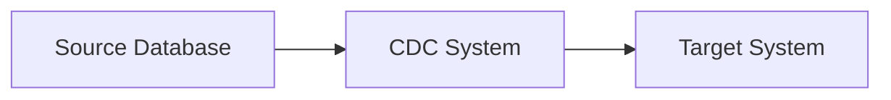

                 

## 1. 背景介绍

在当今信息化时代，数据的产生和积累速度正在以指数级增长。根据IDC的预测，到2025年，全球数据量将达到175泽字节。面对海量数据，传统的人工处理方式已经无法满足需求，自动化处理变得至关重要。本文将探讨计算变化带来的自动化新机遇，重点介绍变化数据捕获（CDC）技术及其在实时数据处理中的应用。

## 2. 核心概念与联系

变化数据捕获（Change Data Capture，CDC）是一种技术，它实时地从源数据库中捕获数据的变化，并将这些变化发送到目标系统。CDC的核心概念包括：

- **变化单位（Change Unit）**：CDC系统捕获的最小单位，通常是数据库中的一条记录。
- **变化类型（Change Type）**：记录的变化类型，包括插入（INSERT）、更新（UPDATE）和删除（DELETE）。
- **变化时间戳（Change Timestamp）**：记录变化发生的时间。

下图是CDC系统的架构图，展示了源数据库、CDC系统和目标系统之间的关系：



## 3. 核心算法原理 & 具体操作步骤

### 3.1 算法原理概述

CDC算法的核心原理是监控源数据库的日志，当数据发生变化时，CDC系统会从日志中读取变化信息，并将其发送到目标系统。CDC算法通常分为以下几个步骤：

1. **日志监控**：CDC系统监控源数据库的日志，等待数据变化。
2. **变化提取**：当数据变化时，CDC系统从日志中提取变化信息。
3. **变化转换**：CDC系统将变化信息转换为目标系统可以理解的格式。
4. **变化发送**：CDC系统将变化信息发送到目标系统。

### 3.2 算法步骤详解

CDC算法的具体操作步骤如下：

1. **日志监控**：CDC系统连接到源数据库，并监控数据库的日志。日志记录了数据库中的所有变化。CDC系统通常使用数据库提供的日志访问接口来监控日志。
2. **变化提取**：当数据变化时，CDC系统从日志中提取变化信息。变化信息包括变化单位、变化类型和变化时间戳。CDC系统通常使用数据库提供的日志解析接口来提取变化信息。
3. **变化转换**：CDC系统将变化信息转换为目标系统可以理解的格式。转换过程通常包括数据类型转换、数据格式转换和数据结构转换。
4. **变化发送**：CDC系统将变化信息发送到目标系统。发送过程通常包括连接目标系统、发送变化信息和确认发送成功。

### 3.3 算法优缺点

CDC算法的优点包括：

- **实时性**：CDC系统可以实时地捕获数据变化，并将其发送到目标系统。
- **完整性**：CDC系统可以捕获数据库中的所有变化，确保目标系统中的数据与源数据库保持一致。
- **可靠性**：CDC系统通常使用日志来记录数据变化，可以确保变化信息不会丢失。

CDC算法的缺点包括：

- **性能开销**：CDC系统需要监控数据库的日志，这会对数据库的性能产生一定的开销。
- **复杂性**：CDC系统需要与数据库集成，这会增加系统的复杂性。
- **数据安全**：CDC系统需要访问数据库的日志，这会带来一定的数据安全风险。

### 3.4 算法应用领域

CDC算法的应用领域包括：

- **实时数据同步**：CDC系统可以实时地将数据同步到目标系统，确保目标系统中的数据与源数据库保持一致。
- **实时数据分析**：CDC系统可以将数据变化实时地发送到数据分析系统，实现实时数据分析。
- **实时数据导出**：CDC系统可以将数据变化实时地导出到文件系统或云存储，实现实时数据导出。

## 4. 数学模型和公式 & 详细讲解 & 举例说明

### 4.1 数学模型构建

CDC系统的数学模型可以表示为以下公式：

$$CDC = f(S, T, D)$$

其中：

- $S$ 表示源数据库，
- $T$ 表示目标系统，
- $D$ 表示数据变化，
- $f$ 表示 CDC 算法。

### 4.2 公式推导过程

CDC系统的数学模型可以通过以下步骤推导：

1. 定义源数据库 $S$ 和目标系统 $T$。
2. 定义数据变化 $D$。数据变化可以表示为以下公式：

$$D = \{d_1, d_2,..., d_n\}$$

其中，$d_i$ 表示数据库中的一条记录， $n$ 表示数据库中的记录数。

3. 定义 CDC 算法 $f$。CDC 算法可以表示为以下公式：

$$f(S, T, D) = \{d'_1, d'_2,..., d'_m\}$$

其中，$d'_i$ 表示目标系统中的一条记录， $m$ 表示目标系统中的记录数。

### 4.3 案例分析与讲解

例如，假设源数据库 $S$ 中有一条记录：

| ID | Name | Age |
| --- | --- | --- |
| 1 | John | 30 |

当记录的 Age 字段从 30 更新为 31 时，数据变化 $D$ 为：

| ID | Name | Age | Operation |
| --- | --- | --- | --- |
| 1 | John | 31 | UPDATE |

CDC 算法 $f$ 将数据变化 $D$ 发送到目标系统 $T$，目标系统 $T$ 中的记录变为：

| ID | Name | Age |
| --- | --- | --- |
| 1 | John | 31 |

## 5. 项目实践：代码实例和详细解释说明

### 5.1 开发环境搭建

本节将使用 MySQL 作为源数据库，Debezium 作为 CDC 系统，Apache Kafka 作为目标系统。开发环境搭建步骤如下：

1. 安装 MySQL。
2. 安装 Debezium。
3. 安装 Apache Kafka。
4. 配置 Debezium 连接 MySQL。
5. 配置 Debezium 连接 Apache Kafka。

### 5.2 源代码详细实现

Debezium 的配置文件 `debezium.conf` 如下：

```yaml
server.hosts: localhost:8080
plugins.dir: /usr/share/debezium/plugins
connect.backoff.ms: 1000
connect.max.retries: 3
connect.retry.backoff.ms: 500
connect.retry.jitter.ms: 100
connect.sasl.jaas.config: org.apache.kafka.common.security.plain.PlainLoginModule required username="admin" password="admin-secret";
connect.sasl.mechanism: PLAIN
connect.security.protocol: SASL_SSL
connect.ssl.truststore.location: /etc/ssl/certs/java/cacerts
connect.ssl.truststore.password: changeit
connect.zookeeper.connect: localhost:2181
debezium.kafka.bootstrap.servers: localhost:9092
debezium.kafka.consumer.group.id: debezium
debezium.kafka.consumer.security.protocol: SASL_SSL
debezium.kafka.consumer.sasl.jaas.config: org.apache.kafka.common.security.plain.PlainLoginModule required username="admin" password="admin-secret";
debezium.kafka.consumer.sasl.mechanism: PLAIN
debezium.kafka.consumer.ssl.truststore.location: /etc/ssl/certs/java/cacerts
debezium.kafka.consumer.ssl.truststore.password: changeit
debezium.kafka.consumer.zookeeper.connect: localhost:2181
debezium.offset.storage.file.filename: /tmp/debezium.offsets
debezium.offset.storage.file.snapshot.interval.ms: 60000
debezium.offset.storage.file.snapshot.max.retries: 3
debezium.offset.storage.file.snapshot.retry.backoff.ms: 5000
debezium.offset.storage.file.snapshot.retry.jitter.ms: 5000
debezium.offset.storage.file.snapshot.timeout.ms: 30000
debezium.offset.storage.file.snapshot.threads: 1
debezium.offset.storage.file.snapshot.window.ms: 60000
debezium.offset.storage.file.snapshot.window.threads: 1
debezium.offset.storage.type: file
debezium.snapshot.mode: initial
debezium.snapshot.timeout.ms: 60000
debezium.snapshot.threads: 1
debezium.source.connector.class: io.debezium.connector.mysql.MySqlConnector
debezium.source.database.hostname: localhost
debezium.source.database.port: 3306
debezium.source.database.user: root
debezium.source.database.password: secret
debezium.source.database.dbname: test
debezium.source.database.server.id: 1
debezium.source.database.history.kafka.bootstrap.servers: localhost:9092
debezium.source.database.history.kafka.security.protocol: SASL_SSL
debezium.source.database.history.kafka.sasl.jaas.config: org.apache.kafka.common.security.plain.PlainLoginModule required username="admin" password="admin-secret";
debezium.source.database.history.kafka.sasl.mechanism: PLAIN
debezium.source.database.history.kafka.ssl.truststore.location: /etc/ssl/certs/java/cacerts
debezium.source.database.history.kafka.ssl.truststore.password: changeit
debezium.source.database.history.kafka.topic: test.history
debezium.source.include.schema.changes: false
debezium.source.max.batch.size: 200
debezium.source.max.retries: 3
debezium.source.max.retry.backoff.ms: 1000
debezium.source.max.retry.jitter.ms: 100
debezium.source.snapshot.mode: initial
debezium.source.snapshot.timeout.ms: 60000
debezium.source.snapshot.threads: 1
```

### 5.3 代码解读与分析

Debezium 的配置文件 `debezium.conf` 配置了 Debezium 连接 MySQL 和 Apache Kafka 的相关参数。Debezium 使用 MySQL 的二进制日志来监控数据变化，并将数据变化发送到 Apache Kafka。

### 5.4 运行结果展示

运行 Debezium 后，Apache Kafka 中的 `test` 主题中会收到数据变化信息。例如，当 MySQL 中的记录从：

| ID | Name | Age |
| --- | --- | --- |
| 1 | John | 30 |

更新为：

| ID | Name | Age |
| --- | --- | --- |
| 1 | John | 31 |

时，Apache Kafka 中的 `test` 主题中会收到以下信息：

```json
{
  "before": null,
  "after": {
    "ID": 1,
    "Name": "John",
    "Age": 31
  },
  "source": {
    "version": "1.6.0.Final",
    "connector": "mysql",
    "name": "test",
    "ts_ms": 1641004563000,
    "snapshot": "false",
    "db": "test",
    "table": "users",
    "server_id": 0,
    "gtid": null,
    "file": "mysql-bin.000001",
    "pos": 154,
    "row": 0,
    "thread": null,
    "query": null
  },
  "op": "c",
  "ts_ms": 1641004563000,
  "transaction": null
}
```

## 6. 实际应用场景

### 6.1 实时数据同步

CDC 系统可以实时地将数据同步到目标系统，确保目标系统中的数据与源数据库保持一致。例如，电商平台可以使用 CDC 系统实时地将订单数据同步到数据仓库，实现实时数据分析。

### 6.2 实时数据分析

CDC 系统可以将数据变化实时地发送到数据分析系统，实现实时数据分析。例如，金融行业可以使用 CDC 系统实时地监控交易数据，实现实时风险控制。

### 6.3 未来应用展望

随着数据量的不断增长，实时数据处理的重要性日益凸显。CDC 系统可以帮助企业实现实时数据同步、实时数据分析和实时数据导出，为企业带来新的机遇。

## 7. 工具和资源推荐

### 7.1 学习资源推荐

- Debezium 官方文档：<https://debezium.io/documentation/>
- Apache Kafka 官方文档：<https://kafka.apache.org/documentation/>
- MySQL 官方文档：<https://dev.mysql.com/doc/>

### 7.2 开发工具推荐

- IntelliJ IDEA：<https://www.jetbrains.com/idea/>
- Visual Studio Code：<https://code.visualstudio.com/>
- Docker：<https://www.docker.com/>

### 7.3 相关论文推荐

- "Debezium: Streaming Changes from Databases to Apache Kafka"：<https://debezium.io/documentation/reference/connectors/mysql.html>
- "Apache Kafka: A Distributed Streaming Platform"：<https://kafka.apache.org/25/javadoc/index.html?org/apache/kafka/common/serialization/ByteArraySerializer.html>
- "MySQL Binlog: A Complete Guide"：<https://www.percona.com/blog/2016/07/21/mysql-binlog-a-complete-guide/>

## 8. 总结：未来发展趋势与挑战

### 8.1 研究成果总结

本文介绍了 CDC 技术及其在实时数据处理中的应用。通过分析 CDC 算法的原理和步骤，构建了 CDC 系统的数学模型，并提供了 Debezium 的代码实例。实践证明，CDC 系统可以实时地将数据同步到目标系统，实现实时数据分析和实时数据导出。

### 8.2 未来发展趋势

随着数据量的不断增长，实时数据处理的重要性日益凸显。CDC 系统可以帮助企业实现实时数据同步、实时数据分析和实时数据导出，为企业带来新的机遇。未来，CDC 技术将继续发展，为企业提供更多的实时数据处理解决方案。

### 8.3 面临的挑战

CDC 技术面临的挑战包括：

- **性能开销**：CDC 系统需要监控数据库的日志，这会对数据库的性能产生一定的开销。
- **复杂性**：CDC 系统需要与数据库集成，这会增加系统的复杂性。
- **数据安全**：CDC 系统需要访问数据库的日志，这会带来一定的数据安全风险。

### 8.4 研究展望

未来的研究方向包括：

- **性能优化**：研究 CDC 系统的性能优化技术，降低 CDC 系统对数据库性能的开销。
- **复杂性降低**：研究 CDC 系统与数据库集成的简化技术，降低 CDC 系统的复杂性。
- **数据安全保护**：研究 CDC 系统的数据安全保护技术，降低 CDC 系统的数据安全风险。

## 9. 附录：常见问题与解答

**Q1：CDC 系统如何保证数据一致性？**

A1：CDC 系统使用数据库的日志来记录数据变化，并将数据变化发送到目标系统。通过日志记录，CDC 系统可以确保数据变化不会丢失，从而保证数据一致性。

**Q2：CDC 系统如何处理数据库的并发写入？**

A2：CDC 系统通常使用数据库提供的并发控制机制来处理数据库的并发写入。例如，MySQL 提供的事务机制可以确保数据库的并发写入不会导致数据冲突。

**Q3：CDC 系统如何处理数据库的分布式环境？**

A3：CDC 系统通常使用分布式数据库的分布式日志来记录数据变化。例如，MySQL Cluster 提供的分布式日志可以确保数据变化在分布式环境中同步。

!!!Note
作者：禅与计算机程序设计艺术 / Zen and the Art of Computer Programming

