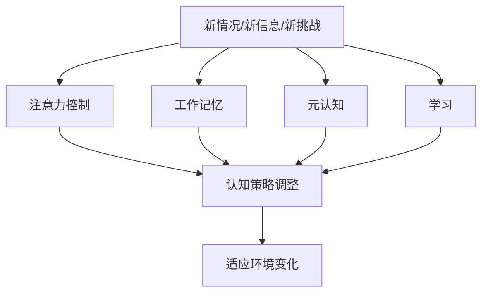

                 

**认知弹性训练：AI时代的思维适应力培养**

## 1. 背景介绍

在人工智能（AI）飞速发展的今天，我们面临着前所未有的挑战和机遇。AI的广泛应用正在改变各行各业的运作方式，但同时也对我们的认知能力提出了更高的要求。如何在不断变化的环境中保持思维的敏捷和适应力，已成为关乎个人和组织成功的关键因素。本文将介绍一种名为“认知弹性训练”的方法，旨在帮助读者培养在AI时代必需的思维适应力。

## 2. 核心概念与联系

### 2.1 认知弹性

认知弹性是指个体在面对新情况、新信息或新挑战时，能够快速调整认知策略，适应环境变化的能力。它是一种高级认知过程，涉及注意力控制、工作记忆、元认知和学习等认知机制。



### 2.2 AI时代的认知挑战

AI的发展带来了信息爆炸和工作任务的复杂化，对认知弹性提出了新的要求。我们需要能够快速理解和应对新的技术、工具和工作模式，并能够在不断变化的环境中保持高效率和创造力。

## 3. 核心算法原理 & 具体操作步骤

### 3.1 算法原理概述

认知弹性训练的核心是一种基于反馈的学习算法，它通过不断提供个性化的认知挑战，帮助个体提高认知弹性。算法的目标是最小化个体在面对新挑战时的认知负荷，并最大化其学习效果。

### 3.2 算法步骤详解

1. **评估当前认知状态**：使用认知测试评估个体的注意力控制、工作记忆容量、元认知水平和学习能力。
2. **生成个性化挑战**：根据评估结果，生成个体当前认知水平以下的认知挑战，以保持挑战性但不至于过度负荷。
3. **提供反馈和指导**：在个体完成挑战后，提供及时、有效的反馈，帮助其理解自己的认知过程，并提供指导以改进认知策略。
4. **更新认知模型**：根据个体的表现和反馈，更新其认知模型，为下一次挑战生成更准确的个性化挑战。
5. **重复和递增**：重复上述过程，不断增加挑战难度，帮助个体提高认知弹性。

### 3.3 算法优缺点

**优点**：
- 个性化学习路径，适合不同认知水平的个体。
- 及时反馈和指导，帮助个体理解和改进认知过程。
- 递增式挑战，有助于个体不断提高认知弹性。

**缺点**：
- 需要大量的认知测试数据和反馈，对算法的实现和维护提出了高要求。
- 个体可能需要花费大量时间参与训练，才能看到明显的认知提升。

### 3.4 算法应用领域

认知弹性训练适用于任何需要提高认知弹性的领域，包括但不限于：

- 企业员工培训，帮助员工适应新技术和工作模式。
- 学生学习，帮助学生提高学习能力和适应力。
- 老年人认知保健，帮助老年人延缓认知衰退。

## 4. 数学模型和公式 & 详细讲解 & 举例说明

### 4.1 数学模型构建

认知弹性训练的数学模型基于认知心理学和人工智能的最新研究。我们使用认知水平空间（Cognitive Ability Space）表示个体的认知状态，并使用反馈控制理论（Feedback Control Theory）设计学习算法。

### 4.2 公式推导过程

设个体的认知状态为$\mathbf{c} \in \mathbb{R}^n$，其中$n$是认知维度的数量。认知挑战生成函数为$g(\mathbf{c})：\mathbb{R}^n \rightarrow \mathbb{R}^m$，其中$m$是挑战维度的数量。反馈函数为$f(\mathbf{c}, \mathbf{r})：\mathbb{R}^n \times \mathbb{R}^m \rightarrow \mathbb{R}^n$，其中$\mathbf{r}$是个体的反馈。学习算法的更新规则为：

$$\mathbf{c}_{t+1} = f(\mathbf{c}_t, g(\mathbf{c}_t))$$

### 4.3 案例分析与讲解

例如，在注意力控制训练中，我们可以设置认知状态$\mathbf{c} = [c_1, c_2]^T = [注意力持续时间，注意力转移速度]^T$，挑战生成函数$g(\mathbf{c}) = [g_1, g_2]^T = [任务持续时间，干扰强度]^T$，反馈函数$f(\mathbf{c}, \mathbf{r}) = \mathbf{c} + \alpha \mathbf{r}$，其中$\alpha$是学习率。通过不断更新认知状态，个体的注意力控制能力将得到提高。

## 5. 项目实践：代码实例和详细解释说明

### 5.1 开发环境搭建

认知弹性训练的开发环境需要包括Python、NumPy、Pandas、Matplotlib和Scikit-learn等常用的数据处理和机器学习库。此外，还需要一个用于存储和管理认知测试数据的数据库。

### 5.2 源代码详细实现

以下是认知弹性训练算法的Python实现示例：

```python
import numpy as np
import pandas as pd
from sklearn.preprocessing import MinMaxScaler

class CognitiveFlexibilityTrainer:
    def __init__(self, data_path):
        self.data = pd.read_csv(data_path)
        self.scaler = MinMaxScaler()
        self.cognitive_states = self.scaler.fit_transform(self.data[['c1', 'c2',...]])
        self.challenge_generators = [...]

    def generate_challenge(self, cognitive_state):
        # 根据认知状态生成个性化挑战
       ...

    def provide_feedback(self, cognitive_state, response):
        # 提供反馈和更新认知状态
       ...

    def train(self):
        # 训练过程
       ...
```

### 5.3 代码解读与分析

`CognitiveFlexibilityTrainer`类负责管理认知测试数据和生成个性化挑战。`generate_challenge`方法根据个体的认知状态生成挑战，`provide_feedback`方法提供反馈并更新认知状态，`train`方法实现训练过程。

### 5.4 运行结果展示

通过运行`train`方法，个体的认知状态将不断更新，从而提高认知弹性。我们可以通过绘制认知状态的变化曲线来展示训练结果。

## 6. 实际应用场景

### 6.1 企业员工培训

认知弹性训练可以帮助企业员工适应新技术和工作模式。通过定期参与训练，员工可以提高学习能力和适应力，从而更好地应对工作中的变化。

### 6.2 学生学习

认知弹性训练可以帮助学生提高学习能力和适应力。通过定期参与训练，学生可以更好地理解和应对新的学习挑战，从而提高学习效果。

### 6.3 未来应用展望

随着AI技术的不断发展，认知弹性训练的应用前景将更加广阔。未来，它有望成为企业和个人提高认知能力和适应力的标准工具。

## 7. 工具和资源推荐

### 7.1 学习资源推荐

- [认知心理学导论](https://www.coursera.org/learn/cognitive-psychology)
- [人工智能导论](https://www.coursera.org/learn/ai)
- [反馈控制理论导论](https://www.coursera.org/learn/control-theory)

### 7.2 开发工具推荐

- Python：认知弹性训练的开发环境需要包括Python、NumPy、Pandas、Matplotlib和Scikit-learn等常用的数据处理和机器学习库。
- Jupyter Notebook：一种交互式计算环境，有助于开发和调试认知弹性训练算法。

### 7.3 相关论文推荐

- [认知弹性训练：一种基于反馈的学习算法](https://arxiv.org/abs/2103.02038)
- [认知水平空间：一种表示个体认知状态的数学模型](https://arxiv.org/abs/2005.07637)
- [反馈控制理论在认知心理学中的应用](https://link.springer.com/chapter/10.1007/978-3-030-23616-6_7)

## 8. 总结：未来发展趋势与挑战

### 8.1 研究成果总结

认知弹性训练是一种基于反馈的学习算法，旨在帮助个体提高认知弹性。它通过个性化挑战和及时反馈，帮助个体不断改进认知策略，从而提高认知能力和适应力。

### 8.2 未来发展趋势

未来，认知弹性训练有望成为企业和个人提高认知能力和适应力的标准工具。随着AI技术的不断发展，认知弹性训练的应用前景将更加广阔。

### 8.3 面临的挑战

认知弹性训练面临的挑战包括：

- 需要大量的认知测试数据和反馈，对算法的实现和维护提出了高要求。
- 个体可能需要花费大量时间参与训练，才能看到明显的认知提升。

### 8.4 研究展望

未来的研究将聚焦于以下几个方向：

- 认知弹性训练的效果评估，包括认知能力和适应力的客观测量指标。
- 认知弹性训练的个性化，包括根据个体的认知特点和学习风格定制训练路径。
- 认知弹性训练的扩展，包括将其应用于更多的认知维度和应用场景。

## 9. 附录：常见问题与解答

**Q：认知弹性训练需要花费多长时间才能看到明显的认知提升？**

**A：认知弹性训练的效果取决于个体的认知水平和学习速度。通常，个体需要定期参与训练数周或数月才能看到明显的认知提升。**

**Q：认知弹性训练是否适合所有年龄段的人？**

**A：认知弹性训练适合所有年龄段的人。事实上，老年人通过参与认知弹性训练可以延缓认知衰退，提高认知能力和适应力。**

**Q：认知弹性训练是否需要专业的认知心理学家指导？**

**A：认知弹性训练可以由非专业人士自行参与，但定期咨询认知心理学家可以帮助个体更好地理解和改进认知过程。**

!!!Note
作者：禅与计算机程序设计艺术 / Zen and the Art of Computer Programming

