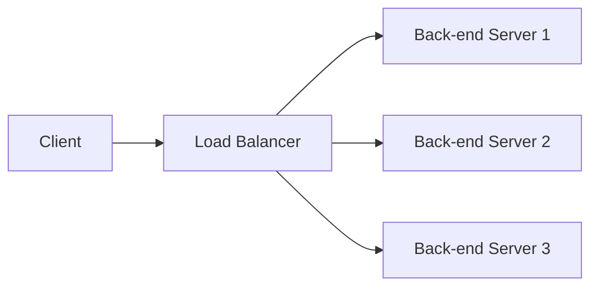

                 

**负载均衡技术：提高系统可用性和性能**

**作者：禅与计算机程序设计艺术 / Zen and the Art of Computer Programming**

## 1. 背景介绍

在当今的互联网时代，高可用性和高性能已成为关键指标，用户对系统的容错性、可扩展性和响应速度提出了更高的要求。负载均衡技术应运而生，它通过将网络或应用程序的负载合理分布到多个服务器上，有效提高了系统的可用性和性能。本文将深入探讨负载均衡技术的原理、算法、数学模型，并提供实践项目和工具推荐。

## 2. 核心概念与联系

负载均衡技术的核心是将请求分发到后端服务器集群，以实现负载的合理分布。其核心概念包括：

- **客户端（Client）**：发起请求的一方。
- **负载均衡器（Load Balancer）**：接收请求并将其分发到后端服务器的中间件。
- **后端服务器（Back-end Servers）**：接收请求并处理业务逻辑的服务器集群。

下图是负载均衡技术的架构示意图：



## 3. 核心算法原理 & 具体操作步骤

### 3.1 算法原理概述

负载均衡算法的目的是将请求合理分发到后端服务器集群，以实现负载的平衡。常见的负载均衡算法包括轮询、随机、IP哈希和最小连接数等。

### 3.2 算法步骤详解

1. **轮询（Round Robin）**：将请求按顺序分发到后端服务器集群，每个服务器轮流处理请求。
2. **随机（Random）**：使用随机数将请求分发到后端服务器集群中的任意服务器。
3. **IP哈希（IP Hash）**：根据客户端的IP地址计算哈希值，将请求分发到对应的后端服务器。
4. **最小连接数（Least Connections）**：维护后端服务器的连接数，将请求分发到连接数最少的服务器。

### 3.3 算法优缺点

| 算法       | 优点                                       | 缺点                                       |
|------------|-------------------------------------------|-------------------------------------------|
| 轮询       | 公平，简单易实现                          | 无法感知服务器的负载情况                   |
| 随机       | 可以避免单点故障                           | 无法保证负载的平衡                         |
| IP哈希     | 可以保证同一客户端的请求始终发往同一服务器 | 无法感知服务器的负载情况，可能导致负载不均 |
| 最小连接数 | 可以感知服务器的负载情况，实现负载均衡   | 可能导致某些服务器长期处于空闲状态         |

### 3.4 算法应用领域

不同的负载均衡算法适用于不同的应用场景：

- **轮询**：适用于后端服务器性能相近，请求分布较为均匀的场景。
- **随机**：适用于后端服务器性能不一致，需要避免单点故障的场景。
- **IP哈希**：适用于需要保持会话状态的场景，如购物车等。
- **最小连接数**：适用于后端服务器性能不一致，请求分布不均匀的场景。

## 4. 数学模型和公式 & 详细讲解 & 举例说明

### 4.1 数学模型构建

假设后端服务器集群共有 `n` 台服务器，每台服务器的处理能力为 `c_i`（`i = 1, 2,..., n`），当前请求到达率为 `λ`，则系统的负载为：

$$L = \frac{\lambda}{\sum_{i=1}^{n}c_i}$$

### 4.2 公式推导过程

系统的负载 `L` 表示当前请求到达率 `λ` 与后端服务器集群总处理能力之比。当 `L > 1` 时，系统处于过载状态；当 `L < 1` 时，系统处于正常状态。

### 4.3 案例分析与讲解

假设后端服务器集群共有 3 台服务器，每台服务器的处理能力分别为 100、150、200 个请求/秒，当前请求到达率为 350 个请求/秒，则系统的负载为：

$$L = \frac{350}{100 + 150 + 200} = 1.167$$

此时，系统处于过载状态，需要采取负载均衡措施以提高系统的可用性和性能。

## 5. 项目实践：代码实例和详细解释说明

### 5.1 开发环境搭建

本项目使用 Python 和 Flask 实现一个简单的负载均衡器。环境搭建如下：

- Python 3.8+
- Flask 2.0+
- Virtualenv

### 5.2 源代码详细实现

```python
from flask import Flask, request
import random

app = Flask(__name__)

# 后端服务器列表
backends = ['http://192.168.1.100:5000', 'http://192.168.1.101:5000', 'http://192.168.1.102:5000']

@app.route('/')
def home():
    # 随机选择后端服务器
    backend = random.choice(backends)
    # 转发请求到后端服务器
    response = requests.get(backend)
    return response.text

if __name__ == '__main__':
    app.run(host='0.0.0.0', port=5000)
```

### 5.3 代码解读与分析

本项目使用 Flask 实现了一个简单的负载均衡器，后端服务器列表存储在 `backends` 变量中。当接收到请求时，随机选择一个后端服务器并转发请求。

### 5.4 运行结果展示

运行项目后，访问 `http://127.0.0.1:5000` 将会返回后端服务器的响应结果。每次请求的后端服务器都是随机选择的，实现了简单的负载均衡功能。

## 6. 实际应用场景

负载均衡技术在各种场景下都有广泛应用，如：

- **Web 服务器集群**：将用户请求分发到多台 Web 服务器上，提高系统的可用性和性能。
- **数据库集群**：将数据库请求分发到多台数据库服务器上，实现数据库的高可用和高性能。
- **缓存集群**：将缓存请求分发到多台缓存服务器上，提高系统的响应速度。

### 6.4 未来应用展望

随着云计算和容器技术的发展，负载均衡技术将更加智能化和自动化。未来的负载均衡器将能够感知服务器的实时负载情况，动态调整请求分发策略，实现更高效的负载均衡。

## 7. 工具和资源推荐

### 7.1 学习资源推荐

- [负载均衡技术原理与实践](https://www.oreilly.com/library/view/load-balancing-technology/9781492033453/)
- [负载均衡算法分析与实现](https://www.researchgate.net/publication/321372428_Analysis_and_Implementation_of_Load_Balancing_Algorithms)

### 7.2 开发工具推荐

- **Nginx**：广泛应用于 Web 服务器集群的负载均衡器。
- **HAProxy**：高可用的负载均衡器，支持多种负载均衡算法。
- **Envoy**：云原生应用的高性能、高可用负载均衡器。

### 7.3 相关论文推荐

- [A Survey on Load Balancing Algorithms for Cloud Computing](https://ieeexplore.ieee.org/document/7923322)
- [Load Balancing in Cloud Computing: A Survey](https://link.springer.com/chapter/10.1007/978-981-10-8552-7_12)

## 8. 总结：未来发展趋势与挑战

### 8.1 研究成果总结

本文介绍了负载均衡技术的原理、算法、数学模型，并提供了实践项目和工具推荐。负载均衡技术是提高系统可用性和性能的关键手段，在各种应用场景下都有广泛应用。

### 8.2 未来发展趋势

未来的负载均衡技术将更加智能化和自动化，能够感知服务器的实时负载情况，动态调整请求分发策略，实现更高效的负载均衡。

### 8.3 面临的挑战

负载均衡技术面临的挑战包括：

- **服务器性能不一致**：后端服务器的性能不一致可能导致负载不均，需要采用合适的负载均衡算法。
- **请求分布不均匀**：请求分布不均匀可能导致某些服务器长期处于空闲状态，需要动态调整请求分发策略。
- **单点故障**：负载均衡器本身可能成为单点故障，需要采取高可用措施。

### 8.4 研究展望

未来的研究方向包括：

- **智能负载均衡**：开发能够感知服务器实时负载情况的智能负载均衡算法。
- **自动化负载均衡**：开发能够自动调整请求分发策略的自动化负载均衡系统。
- **多维度负载均衡**：开发能够综合考虑多种因素（如服务器性能、请求分布、网络拓扑等）的多维度负载均衡算法。

## 9. 附录：常见问题与解答

**Q：什么是负载均衡？**

A：负载均衡是一种分布式系统技术，通过将请求分发到后端服务器集群，实现负载的合理分布，提高系统的可用性和性能。

**Q：负载均衡的作用是什么？**

A：负载均衡的作用包括提高系统的可用性、性能、可扩展性和容错性。

**Q：常见的负载均衡算法有哪些？**

A：常见的负载均衡算法包括轮询、随机、IP哈希和最小连接数等。

**Q：如何选择合适的负载均衡算法？**

A：选择合适的负载均衡算法取决于具体的应用场景，需要综合考虑后端服务器的性能、请求分布等因素。

**Q：负载均衡技术面临的挑战是什么？**

A：负载均衡技术面临的挑战包括服务器性能不一致、请求分布不均匀和单点故障等。

**Q：未来的负载均衡技术发展趋势是什么？**

A：未来的负载均衡技术将更加智能化和自动化，能够感知服务器的实时负载情况，动态调整请求分发策略，实现更高效的负载均衡。

**作者：禅与计算机程序设计艺术 / Zen and the Art of Computer Programming**

