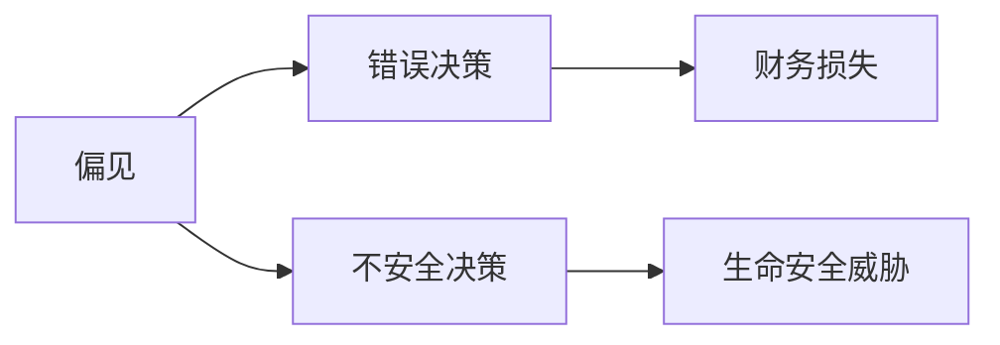

                 

## 1. 背景介绍

随着人工智能（AI）和机器学习（ML）技术的飞速发展，软件正在经历一场革命，从传统的软件 1.0 过渡到软件 2.0。软件 2.0 利用 AI 和 ML 算法，能够自动学习和适应，提供更智能、更灵活的解决方案。然而，这种转变也带来了一些挑战和局限性，其中最突出的是不可解释性和潜在风险。

不可解释性是指软件 2.0 系统无法提供清晰、可理解的原因来解释其决策或行为。这对于需要理解系统决策的领域，如医疗保健、金融和司法，是一个严重的问题。潜在风险则包括系统可能会出现的不当行为，如偏见、错误或不安全的决策，从而导致严重的后果。

本文将深入探讨软件 2.0 的不可解释性和潜在风险，并提供一些解决方案和最佳实践，以帮助开发人员和决策者更好地理解和管理这些挑战。

## 2. 核心概念与联系

### 2.1 可解释性与不可解释性

可解释性是指系统能够提供清晰、可理解的原因来解释其决策或行为。在软件 1.0 中，可解释性是一个显而易见的特性，因为系统的行为是由明确定义的规则和逻辑控制的。然而，在软件 2.0 中，特别是在使用深度学习和其他复杂 ML 算法的情况下，系统的行为可能很难解释。

不可解释性的程度可以在连续谱上进行量化，从完全不可解释的“黑箱”系统到完全可解释的系统。图 1 显示了可解释性谱系的 Mermaid 流程图。


### 2.2 潜在风险

软件 2.0 的潜在风险包括系统可能会出现的不当行为，如偏见、错误或不安全的决策。这些风险可能会导致严重的后果，包括财务损失、声誉受损或甚至生命安全威胁。图 2 显示了软件 2.0 的潜在风险的 Mermaid 流程图。



## 3. 核心算法原理 & 具体操作步骤

### 3.1 算法原理概述

软件 2.0 通常使用 ML 算法，如决策树、神经网络和支持向量机。这些算法学习于数据，并使用学习到的模型来预测或决策。然而，这些算法通常是“黑箱”的，很难解释其决策的原因。

### 3.2 算法步骤详解

以下是 ML 算法的一般步骤：

1. 数据收集：收集与问题相关的数据。
2. 数据预处理：清洗、标记和转换数据，以便于使用。
3. 特征选择：选择最相关的特征来训练模型。
4. 模型选择：选择适合问题的 ML 算法。
5. 模型训练：使用训练数据训练模型。
6. 模型评估：评估模型的性能。
7. 模型部署：将模型部署到生产环境中。

### 3.3 算法优缺点

ML 算法的优点包括自动学习、适应性强和高精确度。然而，它们的缺点包括不可解释性、过度拟合和对数据质量的高要求。

### 3.4 算法应用领域

软件 2.0 的 ML 算法广泛应用于各种领域，包括图像和语音识别、自然语言处理、医疗诊断和金融预测。

## 4. 数学模型和公式 & 详细讲解 & 举例说明

### 4.1 数学模型构建

数学模型是 ML 算法的基础。例如，线性回归模型的数学模型是：

$$y = wx + b$$

其中，$y$ 是目标变量，$x$ 是输入变量，$w$ 是权重，$b$ 是偏置项。

### 4.2 公式推导过程

权重和偏置项可以通过最小化误差平方和来学习：

$$J(w, b) = \frac{1}{2n}\sum_{i=1}^{n}(h_{w, b}(x^{(i)}) - y^{(i)})^2$$

其中，$h_{w, b}(x)$ 是模型的假设函数，$n$ 是训练数据的大小。

### 4.3 案例分析与讲解

例如，假设我们想要构建一个预测房价的线性回归模型。我们的输入变量是房屋的面积，目标变量是房屋的价格。我们可以使用上面的数学模型和公式来构建和训练模型。

## 5. 项目实践：代码实例和详细解释说明

### 5.1 开发环境搭建

要构建和训练 ML 算法，我们需要一个开发环境。推荐使用 Python 和 Scikit-learn 库。我们还需要一个集成开发环境（IDE），如 Jupyter Notebook 或 PyCharm。

### 5.2 源代码详细实现

以下是一个简单的线性回归模型的 Python 实现：

```python
from sklearn.linear_model import LinearRegression
from sklearn.model_selection import train_test_split
from sklearn.metrics import mean_squared_error

# 加载数据
X, y = load_data()

# 分割数据
X_train, X_test, y_train, y_test = train_test_split(X, y, test_size=0.2, random_state=42)

# 创建模型
model = LinearRegression()

# 训练模型
model.fit(X_train, y_train)

# 预测
y_pred = model.predict(X_test)

# 评估模型
print("Mean Squared Error:", mean_squared_error(y_test, y_pred))
```

### 5.3 代码解读与分析

这段代码使用 Scikit-learn 库构建和训练了一个线性回归模型。它首先加载数据，然后将数据分成训练集和测试集。它创建了一个线性回归模型，并使用训练数据训练模型。然后，它使用测试数据预测目标变量，并计算均方误差来评估模型的性能。

### 5.4 运行结果展示

运行这段代码后，它会打印出模型的均方误差。这个值越小，模型的性能就越好。

## 6. 实际应用场景

### 6.1 当前应用

软件 2.0 的 ML 算法已经广泛应用于各种领域，包括图像和语音识别、自然语言处理、医疗诊断和金融预测。

### 6.2 未来应用展望

未来，软件 2.0 的 ML 算法可能会应用于更多领域，如自动驾驶汽车、人工智能助手和智能城市规划。然而，这些应用都面临着不可解释性和潜在风险的挑战。

## 7. 工具和资源推荐

### 7.1 学习资源推荐

推荐阅读 Andrew Ng 的机器学习课程和 Hands-On Machine Learning with Scikit-Learn, Keras, and TensorFlow 这本书。

### 7.2 开发工具推荐

推荐使用 Python 和 Scikit-learn 库来构建和训练 ML 算法。还可以使用 TensorFlow 和 Keras 来构建深度学习模型。

### 7.3 相关论文推荐

推荐阅读 "Why Should I Trust You?: Explaining the Predictions of Any Classifier" 这篇论文，它介绍了解释 ML 算法决策的方法。

## 8. 总结：未来发展趋势与挑战

### 8.1 研究成果总结

本文总结了软件 2.0 的不可解释性和潜在风险，并提供了解决方案和最佳实践。

### 8.2 未来发展趋势

未来，软件 2.0 的 ML 算法可能会变得更加可解释，并能够更好地管理潜在风险。这可能会通过开发新的算法和技术来实现，这些算法和技术能够提供清晰的解释，并能够检测和管理风险。

### 8.3 面临的挑战

然而，开发更可解释的 ML 算法和管理风险是一个挑战。这需要跨学科的合作，包括计算机科学家、统计学家和社会科学家。

### 8.4 研究展望

未来的研究应该关注开发新的算法和技术，这些算法和技术能够提供清晰的解释，并能够检测和管理风险。还应该关注开发新的评估方法，这些方法能够更好地评估 ML 算法的性能和风险。

## 9. 附录：常见问题与解答

### 9.1 什么是软件 2.0？

软件 2.0 是一种利用 AI 和 ML 算法的软件，能够自动学习和适应，提供更智能、更灵活的解决方案。

### 9.2 什么是不可解释性？

不可解释性是指系统无法提供清晰、可理解的原因来解释其决策或行为。

### 9.3 什么是潜在风险？

潜在风险是指系统可能会出现的不当行为，如偏见、错误或不安全的决策，从而导致严重的后果。

### 9.4 如何解决软件 2.0 的不可解释性和潜在风险？

可以通过开发新的算法和技术来解决软件 2.0 的不可解释性和潜在风险，这些算法和技术能够提供清晰的解释，并能够检测和管理风险。还可以通过开发新的评估方法来评估 ML 算法的性能和风险。

## 作者：禅与计算机程序设计艺术 / Zen and the Art of Computer Programming

