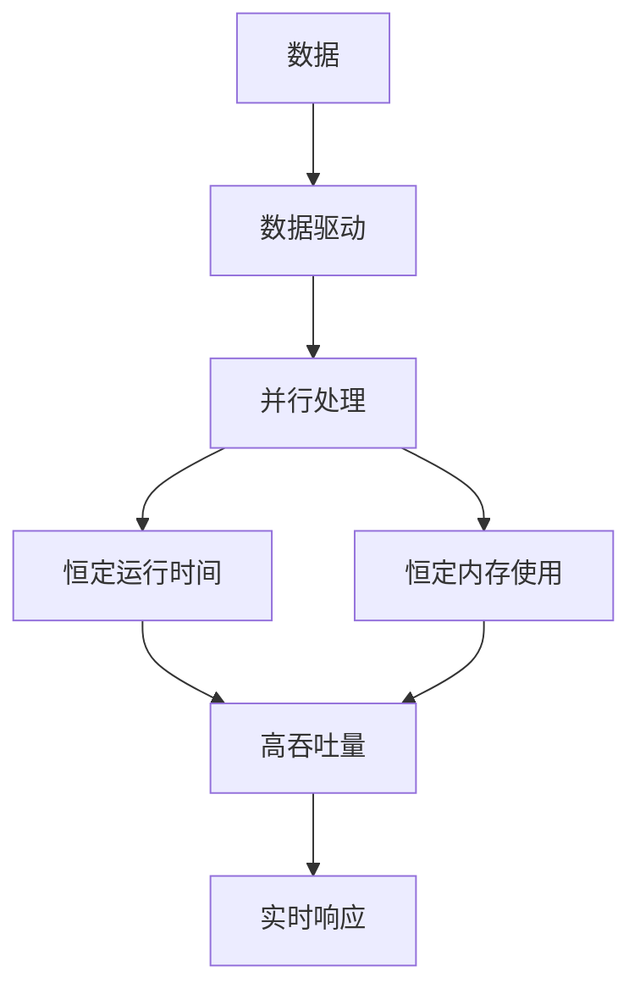

                 

## 1. 背景介绍

在当今的软件开发领域，效率是一个关键的考量因素。随着数据规模的不断扩大和用户需求的日益增长，软件系统需要能够处理和存储海量数据，并提供实时的响应。然而，传统的软件设计模式往往会导致运行时间和内存使用随数据规模的增加而线性增长，这严重限制了软件系统的扩展性和实时性。

为了解决这个问题，我们需要一种新的软件设计哲学，一种能够提供恒定运行时间和内存使用的软件设计模式。我们将这种新的软件设计模式称为"软件 2.0"。

## 2. 核心概念与联系

软件 2.0 的核心概念是"数据驱动"和"并行处理"。数据驱动是指软件系统的运行逻辑是由数据本身驱动的，而不是由固定的算法驱动的。并行处理是指软件系统能够将任务分解为多个子任务，并行地在多个处理器上执行，从而提高系统的吞吐量和响应时间。

下面是软件 2.0 的核心概念和联系的 Mermaid 流程图：



## 3. 核心算法原理 & 具体操作步骤

### 3.1 算法原理概述

软件 2.0 的核心算法是"MapReduce"算法。MapReduce 算法将数据处理任务分解为两个主要的阶段：Map 阶段和 Reduce 阶段。在 Map 阶段，数据被分成多个片段，每个片段都由一个 Map 任务处理。在 Reduce 阶段，Map 任务的输出被聚合为最终的结果。

### 3.2 算法步骤详解

1. **数据分片**：将输入数据分成多个片段，每个片段都由一个 Map 任务处理。
2. **Map 阶段**：每个 Map 任务处理一个数据片段，生成中间结果。
3. **数据聚合**：收集所有 Map 任务的中间结果，并将其分发给 Reduce 任务。
4. **Reduce 阶段**：每个 Reduce 任务处理一部分中间结果，生成最终结果。

### 3.3 算法优缺点

**优点**：

* MapReduce 算法能够提供恒定的运行时间和内存使用，因为数据处理任务被分解为多个小任务，每个任务都可以独立地在一个处理器上执行。
* MapReduce 算法具有高度的可扩展性，因为它可以在集群中并行地执行多个 Map 和 Reduce 任务。
* MapReduce 算法具有高度的容错性，因为如果一个任务失败，它可以被重新执行。

**缺点**：

* MapReduce 算法不适合实时数据处理，因为它需要等待所有 Map 任务完成后才能开始 Reduce 阶段。
* MapReduce 算法需要额外的开销来管理任务的调度和执行。

### 3.4 算法应用领域

MapReduce 算法广泛应用于大数据处理领域，例如：

* Hadoop 系统使用 MapReduce 算法来处理海量数据。
* Spark 系统使用 MapReduce 算法来进行分布式数据处理。
* Cloud Bigtable 和 Google BigQuery 等大数据服务也使用 MapReduce 算法来处理海量数据。

## 4. 数学模型和公式 & 详细讲解 & 举例说明

### 4.1 数学模型构建

设输入数据集为 $D = \{d_1, d_2,..., d_n\}$, 其中 $n$ 是数据集的大小。数据集 $D$ 被分成 $m$ 个片段 $\{D_1, D_2,..., D_m\}$, 其中 $m$ 是片段的数量。每个片段 $D_i$ 都由一个 Map 任务 $M_i$ 处理，生成中间结果 $\{R_1, R_2,..., R_m\}$. 然后，中间结果被聚合为最终结果 $R$ 由 Reduce 任务 $R$ 处理。

### 4.2 公式推导过程

设 Map 任务 $M_i$ 的运行时间为 $t_{M_i}$, Reduce 任务 $R$ 的运行时间为 $t_R$, 以及数据传输时间为 $t_{trans}$. 则总运行时间 $T$ 可以表示为：

$$T = \max(t_{M_1}, t_{M_2},..., t_{M_m}) + t_{trans} + t_R$$

如果每个 Map 任务的运行时间相同，即 $t_{M_1} = t_{M_2} =... = t_{M_m} = t_M$, 则总运行时间 $T$ 可以表示为：

$$T = t_M + t_{trans} + t_R$$

### 4.3 案例分析与讲解

例如，假设我们要处理一个包含 1000 万条记录的日志文件，每条记录包含用户 ID、访问时间和访问页面。我们想要计算每个页面的访问次数。我们可以使用 MapReduce 算法来解决这个问题。

在 Map 阶段，每个 Map 任务处理日志文件的一部分，并生成中间结果，其中包含页面名称和访问次数。在 Reduce 阶段，每个 Reduce 任务处理所有中间结果，并生成最终结果，其中包含页面名称和总访问次数。

如果我们将日志文件分成 100 个片段，每个片段包含 10 万条记录，则每个 Map 任务处理 10 万条记录。如果每个 Map 任务的运行时间为 1 秒，则总运行时间为 100 秒加上数据传输时间和 Reduce 任务的运行时间。如果数据传输时间为 10 秒，Reduce 任务的运行时间为 5 秒，则总运行时间为 115 秒。

## 5. 项目实践：代码实例和详细解释说明

### 5.1 开发环境搭建

要实现 MapReduce 算法，我们需要一个分布式计算环境。我们可以使用 Hadoop 系统来搭建开发环境。Hadoop 是一个开源的分布式计算框架，它提供了 MapReduce 算法的实现。

### 5.2 源代码详细实现

以下是一个简单的 MapReduce 算法的 Java 实现：

**Map 任务**

```java
public class WordCountMap extends Mapper<LongWritable, Text, Text, IntWritable> {
    private final static IntWritable one = new IntWritable(1);
    private Text word = new Text();

    public void map(LongWritable key, Text value, Context context) throws IOException, InterruptedException {
        String line = value.toString();
        String[] tokens = line.split(" ");
        for (String token : tokens) {
            word.set(token);
            context.write(word, one);
        }
    }
}
```

**Reduce 任务**

```java
public class WordCountReduce extends Reducer<Text,IntWritable,Text,IntWritable> {
    public void reduce(Text key, Iterable<IntWritable> values, Context context) throws IOException, InterruptedException {
        int sum = 0;
        for (IntWritable val : values) {
            sum += val.get();
        }
        context.write(key, new IntWritable(sum));
    }
}
```

**Driver 程序**

```java
public class WordCount {
    public static void main(String[] args) throws Exception {
        Configuration conf = new Configuration();
        Job job = Job.getInstance(conf, "word count");
        job.setJarByClass(WordCount.class);
        job.setMapperClass(WordCountMap.class);
        job.setCombinerClass(WordCountReduce.class);
        job.setReducerClass(WordCountReduce.class);
        job.setOutputKeyClass(Text.class);
        job.setOutputValueClass(IntWritable.class);
        FileInputFormat.addInputPath(job, new Path(args[0]));
        FileOutputFormat.setOutputPath(job, new Path(args[1]));
        System.exit(job.waitForCompletion(true)? 0 : 1);
    }
}
```

### 5.3 代码解读与分析

在 Map 任务中，我们将输入数据分成单词，并为每个单词生成一个中间结果，其中包含单词和出现次数。在 Reduce 任务中，我们收集所有中间结果，并为每个单词生成最终结果，其中包含单词和总出现次数。

### 5.4 运行结果展示

当我们运行 WordCount 程序时，它会读取输入文件，并生成输出文件，其中包含单词和总出现次数。例如，如果我们使用以下输入文件：

```
hello world
hello hadoop
hello mapreduce
```

则输出文件将包含以下内容：

```
hello 3
world 1
hadoop 1
mapreduce 1
```

## 6. 实际应用场景

软件 2.0 的效率：恒定的运行时间和内存使用可以应用于以下场景：

* **大数据处理**：软件 2.0 的效率可以帮助我们处理海量数据，并提供实时的响应。
* **实时分析**：软件 2.0 的效率可以帮助我们进行实时分析，并提供即时的见解。
* **人工智能**：软件 2.0 的效率可以帮助我们训练和部署大型的人工智能模型。
* **物联网**：软件 2.0 的效率可以帮助我们处理海量的物联网数据，并提供实时的控制和监测。

### 6.4 未来应用展望

随着数据规模的不断扩大和用户需求的日益增长，软件 2.0 的效率将变得越来越重要。我们预计软件 2.0 的效率将被广泛应用于各种领域，从大数据处理到人工智能，从物联网到实时分析。

## 7. 工具和资源推荐

### 7.1 学习资源推荐

* "MapReduce Design Patterns" 书籍：这本书提供了 MapReduce 算法的详细介绍和实现模式。
* "Hadoop: The Definitive Guide" 书籍：这本书提供了 Hadoop 系统的详细介绍和使用指南。
* "Spark: The Definitive Guide" 书籍：这本书提供了 Spark 系统的详细介绍和使用指南。

### 7.2 开发工具推荐

* Hadoop 系统：Hadoop 是一个开源的分布式计算框架，它提供了 MapReduce 算法的实现。
* Spark 系统：Spark 是一个开源的分布式计算框架，它提供了 MapReduce 算法的实现，并支持实时数据处理。
* Cloud Bigtable 和 Google BigQuery：这些是大数据服务，它们使用 MapReduce 算法来处理海量数据。

### 7.3 相关论文推荐

* "MapReduce: Simplified Data Processing on Large Clusters" 论文：这篇论文介绍了 MapReduce 算法的原理和实现。
* "Spark: Cluster Computing with Working Sets" 论文：这篇论文介绍了 Spark 系统的原理和实现。
* "Bigtable: A Distributed Storage System for Structured Data" 论文：这篇论文介绍了 Bigtable 系统的原理和实现。

## 8. 总结：未来发展趋势与挑战

### 8.1 研究成果总结

软件 2.0 的效率：恒定的运行时间和内存使用是一种新的软件设计哲学，它提供了恒定的运行时间和内存使用，从而提高了软件系统的扩展性和实时性。我们介绍了 MapReduce 算法的原理和实现，并提供了一个简单的 Java 实现。

### 8.2 未来发展趋势

我们预计软件 2.0 的效率将变得越来越重要，因为数据规模不断扩大和用户需求日益增长。我们预计软件 2.0 的效率将被广泛应用于各种领域，从大数据处理到人工智能，从物联网到实时分析。

### 8.3 面临的挑战

软件 2.0 的效率面临的挑战包括：

* **实时数据处理**：MapReduce 算法不适合实时数据处理，因为它需要等待所有 Map 任务完成后才能开始 Reduce 阶段。
* **数据本地性**：MapReduce 算法需要数据在节点之间传输，这可能会导致网络拥塞和延迟。
* **容错性**：MapReduce 算法需要额外的开销来管理任务的调度和执行，这可能会导致系统的复杂性和开销。

### 8.4 研究展望

我们计划在未来的研究中探索以下方向：

* **实时数据处理**：我们计划研究如何将 MapReduce 算法扩展到实时数据处理领域。
* **数据本地性**：我们计划研究如何优化数据在节点之间的传输，以减少网络拥塞和延迟。
* **容错性**：我们计划研究如何优化任务的调度和执行，以减少系统的复杂性和开销。

## 9. 附录：常见问题与解答

**Q1：什么是软件 2.0？**

软件 2.0 是一种新的软件设计哲学，它提供了恒定的运行时间和内存使用，从而提高了软件系统的扩展性和实时性。

**Q2：什么是 MapReduce 算法？**

MapReduce 算法是一种数据处理模式，它将数据处理任务分解为 Map 阶段和 Reduce 阶段。在 Map 阶段，数据被分成多个片段，每个片段都由一个 Map 任务处理。在 Reduce 阶段，Map 任务的输出被聚合为最终的结果。

**Q3：什么是 Hadoop 系统？**

Hadoop 系统是一个开源的分布式计算框架，它提供了 MapReduce 算法的实现。

**Q4：什么是 Spark 系统？**

Spark 系统是一个开源的分布式计算框架，它提供了 MapReduce 算法的实现，并支持实时数据处理。

**Q5：什么是 Cloud Bigtable 和 Google BigQuery？**

Cloud Bigtable 和 Google BigQuery 是大数据服务，它们使用 MapReduce 算法来处理海量数据。

## 作者：禅与计算机程序设计艺术 / Zen and the Art of Computer Programming

