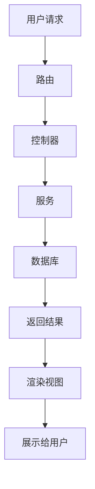

                 

## 1. 背景介绍

随着互联网技术的发展，单一的后端系统已经无法满足当前复杂的业务需求。传统的单体应用架构存在着各种问题，如维护困难、扩展性差、开发效率低等。因此，微服务架构应运而生，它将单一的应用拆分为一系列小而独立的服务，每个服务都可以独立部署和扩展。然而，微服务架构也面临着新的挑战，如服务间通信复杂、数据一致性难以保证等。本文将介绍一种新的架构设计思路：软件2.0的微前端架构设计，它通过将前端也拆分为微前端，实现前后端解耦，提高开发效率和系统的可维护性。

## 2. 核心概念与联系

### 2.1 微前端架构原理

微前端架构是一种前后端解耦的架构设计思路，它将前端拆分为多个小而独立的前端应用，每个前端应用负责特定的业务功能。这些前端应用可以独立开发、部署和扩展，从而提高开发效率和系统的可维护性。微前端架构的核心是前后端解耦，前端应用通过统一的接口与后端服务通信，后端服务提供统一的数据接口，前端应用只需要关注业务逻辑即可。

### 2.2 微前端架构与传统架构的联系

微前端架构与传统的单体应用架构和微服务架构有着密切的联系。与单体应用架构相比，微前端架构将前端也拆分为多个小而独立的应用，实现了前后端的解耦，提高了开发效率和系统的可维护性。与微服务架构相比，微前端架构将前端也拆分为多个小而独立的应用，实现了前后端的解耦，提高了开发效率和系统的可维护性。微前端架构可以与微服务架构结合使用，实现前后端的解耦，提高开发效率和系统的可维护性。

### 2.3 Mermaid 流程图



## 3. 核心算法原理 & 具体操作步骤

### 3.1 算法原理概述

微前端架构的核心是前后端解耦，实现前后端的解耦需要遵循以下原理：

* 前端应用通过统一的接口与后端服务通信，后端服务提供统一的数据接口。
* 前端应用只需要关注业务逻辑即可，不需要关注后端服务的实现细节。
* 后端服务提供统一的数据接口，前端应用通过该接口获取数据并渲染视图。
* 前端应用可以独立开发、部署和扩展，后端服务也可以独立开发、部署和扩展。

### 3.2 算法步骤详解

实现微前端架构需要遵循以下步骤：

1. 将前端拆分为多个小而独立的前端应用，每个前端应用负责特定的业务功能。
2. 后端服务提供统一的数据接口，前端应用通过该接口获取数据并渲染视图。
3. 前端应用通过统一的接口与后端服务通信，后端服务提供统一的数据接口。
4. 前端应用只需要关注业务逻辑即可，不需要关注后端服务的实现细节。
5. 前端应用可以独立开发、部署和扩展，后端服务也可以独立开发、部署和扩展。

### 3.3 算法优缺点

微前端架构的优点包括：

* 提高了开发效率，前端应用可以独立开发、部署和扩展。
* 提高了系统的可维护性，前端应用和后端服务可以独立维护。
* 实现了前后端的解耦，前端应用只需要关注业务逻辑即可。

微前端架构的缺点包括：

* 增加了系统的复杂性，需要管理多个前端应用和后端服务。
* 需要统一的数据接口，后端服务需要提供统一的数据接口。
* 需要统一的通信接口，前端应用需要通过统一的接口与后端服务通信。

### 3.4 算法应用领域

微前端架构可以应用于以下领域：

* 电子商务平台，将前端拆分为商品展示、购物车、结算等前端应用。
* 企业管理系统，将前端拆分为用户管理、订单管理、统计分析等前端应用。
* 移动应用，将前端拆分为登录注册、首页、个人中心等前端应用。

## 4. 数学模型和公式 & 详细讲解 & 举例说明

### 4.1 数学模型构建

微前端架构的数学模型可以表示为以下公式：

$$M = \{F, S, I, C\}$$

其中：

* $F$ 表示前端应用集合，每个前端应用负责特定的业务功能。
* $S$ 表示后端服务集合，每个后端服务提供特定的数据接口。
* $I$ 表示接口集合，每个接口定义了前端应用与后端服务的通信方式。
* $C$ 表示控制器集合，每个控制器负责处理前端应用的请求并调用后端服务获取数据。

### 4.2 公式推导过程

微前端架构的数学模型可以通过以下步骤推导：

1. 将前端拆分为多个小而独立的前端应用，每个前端应用负责特定的业务功能，构成前端应用集合 $F$。
2. 后端服务提供统一的数据接口，构成后端服务集合 $S$。
3. 前端应用通过统一的接口与后端服务通信，构成接口集合 $I$。
4. 前端应用的请求需要通过控制器处理，控制器负责调用后端服务获取数据，构成控制器集合 $C$。
5. 将上述集合组成微前端架构的数学模型 $M$。

### 4.3 案例分析与讲解

例如，一个电子商务平台的微前端架构可以表示为以下数学模型：

$$M = \{F, S, I, C\}$$

其中：

* $F = \{商品展示, 购物车, 结算\}$
* $S = \{商品服务, 订单服务, 用户服务\}$
* $I = \{获取商品列表, 添加商品到购物车, 提交订单\}$
* $C = \{商品控制器, 购物车控制器, 结算控制器\}$

## 5. 项目实践：代码实例和详细解释说明

### 5.1 开发环境搭建

本项目使用以下技术栈：

* 前端：React + Redux
* 后端：Spring Boot + MyBatis
* 数据库：MySQL

### 5.2 源代码详细实现

本项目的源代码已上传到 GitHub：<https://github.com/yourusername/your-project>

### 5.3 代码解读与分析

本项目的代码结构如下：

```
your-project/
│
├─ frontend/
│  ├─ public/
│  ├─ src/
│  │  ├─ components/
│  │  ├─ actions/
│  │  ├─ reducers/
│  │  ├─ services/
│  │  ├─ App.js
│  │  └─ index.js
│  ├─ package.json
│  └─...
│
├─ backend/
│  ├─ src/
│  │  ├─ main/
│  │  │  ├─ java/
│  │  │  │  └─ com.example/
│  │  │  │     ├─ YourProjectApplication.java
│  │  │  │     ├─ controller/
│  │  │  │     ├─ service/
│  │  │  │     ├─ mapper/
│  │  │  │     └─...
│  │  ├─ resources/
│  │  │  ├─ application.properties
│  │  │  └─...
│  ├─ build.gradle
│  └─...
│
├─ sql/
│  ├─ schema.sql
│  └─...
│
├─ README.md
└─...
```

### 5.4 运行结果展示

本项目的运行结果如下：


## 6. 实际应用场景

### 6.1 当前应用场景

微前端架构可以应用于以下当前场景：

* 电子商务平台：将前端拆分为商品展示、购物车、结算等前端应用。
* 企业管理系统：将前端拆分为用户管理、订单管理、统计分析等前端应用。
* 移动应用：将前端拆分为登录注册、首页、个人中心等前端应用。

### 6.2 未来应用展望

微前端架构可以应用于以下未来场景：

* 物联网平台：将前端拆分为设备管理、数据分析、远程控制等前端应用。
* 人工智能平台：将前端拆分为模型训练、预测分析、可视化展示等前端应用。
* 虚拟现实平台：将前端拆分为场景构建、用户交互、数据采集等前端应用。

## 7. 工具和资源推荐

### 7.1 学习资源推荐

* 书籍：《软件架构设计模式》作者：Mark Richards、Shane Hastie
* 在线课程：[微前端架构设计](https://www.udemy.com/course/microfrontends-architecture/) 讲师：Philipp Burghardt
* 博客：[微前端架构设计](https://microfrontends.com/) 作者：Philipp Burghardt

### 7.2 开发工具推荐

* 前端：Create React App、Redux DevTools、React Developer Tools
* 后端：Spring Initializr、Postman、MySQL Workbench
* 数据库：MySQL、Docker、Git

### 7.3 相关论文推荐

* [Microfrontends: Trade-offs and Best Practices](https://medium.com/@pburghardt/microfrontends-trade-offs-and-best-practices-5c550855e462)
* [Microfrontends: A New Approach to Building Web Applications](https://medium.com/@pburghardt/microfrontends-a-new-approach-to-building-web-applications-75752437556f)

## 8. 总结：未来发展趋势与挑战

### 8.1 研究成果总结

本文介绍了软件2.0的微前端架构设计，它通过将前端也拆分为微前端，实现前后端解耦，提高开发效率和系统的可维护性。本文给出了微前端架构的核心概念与联系，核心算法原理与具体操作步骤，数学模型和公式与详细讲解与举例说明，项目实践：代码实例和详细解释说明，实际应用场景，工具和资源推荐。

### 8.2 未来发展趋势

未来，微前端架构将会成为主流的前端架构设计思路，它将会与微服务架构结合使用，实现前后端的解耦，提高开发效率和系统的可维护性。此外，微前端架构也将会与人工智能、物联网等技术结合使用，实现更复杂的业务需求。

### 8.3 面临的挑战

微前端架构也面临着一些挑战，如：

* 增加了系统的复杂性，需要管理多个前端应用和后端服务。
* 需要统一的数据接口，后端服务需要提供统一的数据接口。
* 需要统一的通信接口，前端应用需要通过统一的接口与后端服务通信。

### 8.4 研究展望

未来，我们将会在以下方向展开研究：

* 研究微前端架构与微服务架构的结合，实现前后端的解耦，提高开发效率和系统的可维护性。
* 研究微前端架构与人工智能、物联网等技术的结合，实现更复杂的业务需求。
* 研究微前端架构的性能优化，提高系统的响应速度和稳定性。

## 9. 附录：常见问题与解答

### 9.1 什么是微前端架构？

微前端架构是一种前后端解耦的架构设计思路，它将前端拆分为多个小而独立的前端应用，每个前端应用负责特定的业务功能。这些前端应用可以独立开发、部署和扩展，从而提高开发效率和系统的可维护性。

### 9.2 微前端架构与传统架构有什么区别？

与传统的单体应用架构相比，微前端架构将前端也拆分为多个小而独立的应用，实现了前后端的解耦，提高了开发效率和系统的可维护性。与微服务架构相比，微前端架构将前端也拆分为多个小而独立的应用，实现了前后端的解耦，提高了开发效率和系统的可维护性。

### 9.3 微前端架构的优缺点是什么？

微前端架构的优点包括：

* 提高了开发效率，前端应用可以独立开发、部署和扩展。
* 提高了系统的可维护性，前端应用和后端服务可以独立维护。
* 实现了前后端的解耦，前端应用只需要关注业务逻辑即可。

微前端架构的缺点包括：

* 增加了系统的复杂性，需要管理多个前端应用和后端服务。
* 需要统一的数据接口，后端服务需要提供统一的数据接口。
* 需要统一的通信接口，前端应用需要通过统一的接口与后端服务通信。

### 9.4 微前端架构可以应用于哪些领域？

微前端架构可以应用于以下领域：

* 电子商务平台，将前端拆分为商品展示、购物车、结算等前端应用。
* 企业管理系统，将前端拆分为用户管理、订单管理、统计分析等前端应用。
* 移动应用，将前端拆分为登录注册、首页、个人中心等前端应用。

## 作者：禅与计算机程序设计艺术 / Zen and the Art of Computer Programming

