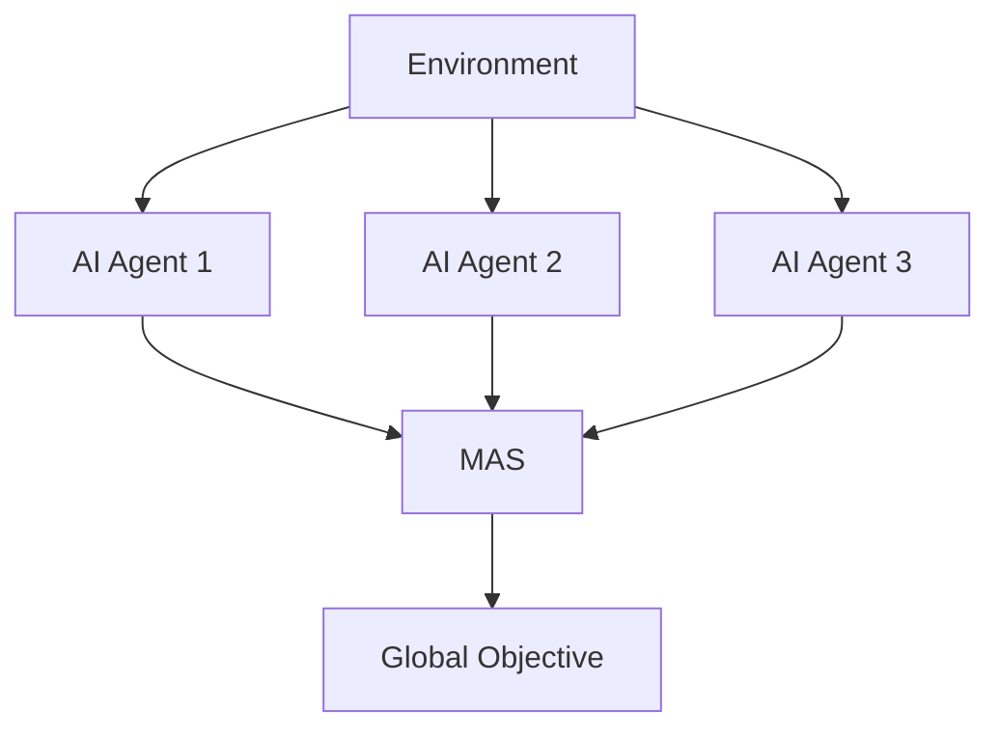

                 

- AI Agent
- Multi-Agent Systems
- Reinforcement Learning
- Deep Learning
- Natural Language Processing
- Computer Vision
- Explainable AI
- AI Ethics

## 1. 背景介绍

人工智能（AI）正在各行各业迅速发展，从自动驾驶到医疗诊断，再到客户服务，AI的应用无处不在。然而，当前的AI系统大多是孤立的，它们只能完成单一的任务，并且缺乏对世界的理解和学习能力。为了解决这些问题，AI代理（AI Agent）应运而生。

AI代理是一种能够感知环境、学习、决策并与其他代理交互的智能体。它们可以在动态环境中运行，学习新的任务，并与其他代理合作或竞争。AI代理是AI的下一个风口，有望解决当前AI系统面临的挑战，推动AI技术的进一步发展。

## 2. 核心概念与联系

### 2.1 AI代理的定义

AI代理是一种能够感知环境、学习、决策并与其他代理交互的智能体。它们可以在动态环境中运行，学习新的任务，并与其他代理合作或竞争。

### 2.2 多智能体系统（Multi-Agent Systems, MAS）

MAS是由多个智能体组成的系统，每个智能体都有自己的目标和行为。AI代理通常是MAS中的智能体。MAS可以模拟复杂的系统，如交通网络、生态系统和社会系统。



### 2.3 与其他AI系统的联系

AI代理与其他AI系统，如强化学习（Reinforcement Learning, RL）、深度学习（Deep Learning, DL）和自然语言处理（Natural Language Processing, NLP），有着密切的联系。例如，AI代理可以使用RL算法学习新的任务，使用DL模型处理感知数据，并使用NLP技术与其他代理交流。

## 3. 核心算法原理 & 具体操作步骤

### 3.1 算法原理概述

AI代理的核心是其决策机制。决策机制根据环境的感知数据和代理的目标，选择最佳的行动。决策机制通常基于RL算法，如Q-Learning和Policy Gradient。

### 3.2 算法步骤详解

1. **感知环境**：AI代理首先感知环境，收集有关环境状态的数据。
2. **选择行动**：根据环境状态和当前目标，AI代理选择最佳行动。这通常涉及到预测环境的未来状态和行动的结果。
3. **执行行动**：AI代理执行选择的行动，并观察环境的变化。
4. **学习**：AI代理根据环境的反馈调整其决策机制，以改善其决策。

### 3.3 算法优缺点

**优点**：AI代理可以学习新的任务，适应动态环境，并与其他代理交互。它们可以模拟复杂的系统，并为解决复杂问题提供新的视角。

**缺点**：AI代理的学习过程可能需要大量的时间和资源。它们也可能面临过度拟合和不稳定的问题。此外，AI代理的决策过程可能是不透明的，难以理解和解释。

### 3.4 算法应用领域

AI代理的应用领域包括自动驾驶、医疗诊断、电力网络控制、搜索与救援、游戏开发和人机交互等。它们还可以用于模拟和分析复杂系统，如交通网络和生态系统。

## 4. 数学模型和公式 & 详细讲解 & 举例说明

### 4.1 数学模型构建

AI代理的数学模型通常基于MAS和RL。MAS的数学模型包括环境模型、代理模型和代理交互模型。RL的数学模型包括状态转移模型、奖励函数和策略模型。

### 4.2 公式推导过程

假设环境是马尔可夫决策过程（Markov Decision Process, MDP），状态转移概率为$P(s'|s,a)$，奖励函数为$R(s,a)$，策略为$\pi(a|s)$。那么，值函数$V^\pi(s)$和策略函数$Q^\pi(s,a)$可以通过Bellman方程推导：

$$V^\pi(s) = \sum_a \pi(a|s) \sum_{s',r} P(s',r|s,a)[R(s,a) + \gamma V^\pi(s')]$$

$$Q^\pi(s,a) = \sum_{s',r} P(s',r|s,a)[R(s,a) + \gamma V^\pi(s')]$$

其中，$\gamma$是折扣因子。

### 4.3 案例分析与讲解

例如，在自动驾驶场景中，AI代理需要感知环境（车辆位置、交通信号等），选择行动（转弯、加速等），并学习新的路线。数学模型可以描述环境的状态转移和奖励函数，RL算法可以学习最佳的行动策略。

## 5. 项目实践：代码实例和详细解释说明

### 5.1 开发环境搭建

AI代理的开发环境包括Python、TensorFlow或PyTorch、RL库（如Stable Baselines3）和MAS库（如Mesa）。以下是一个简单的开发环境配置：

```bash
pip install tensorflow numpy gym mesa stable-baselines3[extra]
```

### 5.2 源代码详细实现

以下是一个简单的AI代理示例，使用Q-Learning算法学习一个简单的MAS：

```python
import numpy as np
import mesa
from mesa import Agent, Model
from mesa.time import RandomActivation
from mesa.datacollection import DataCollector

class SimpleAgent(Agent):
    def __init__(self, unique_id, model):
        super().__init__(unique_id, model)
        self.wealth = 1

    def step(self):
        other_agents = self.model.agents[:]
        other_agents.remove(self)
        if np.random.random() < 0.5:
            self.wealth += 1
        else:
            recipient = np.random.choice(other_agents)
            self.wealth -= 1
            recipient.wealth += 1

class SimpleModel(Model):
    def __init__(self, N, width, height):
        super().__init__()
        self.num_agents = N
        self.grid = mesa.space.Grid(width, height, torus=True)
        self.schedule = RandomActivation(self)
        for i in range(self.num_agents):
            a = SimpleAgent(i, self)
            self.schedule.add(a)
            x, y = np.random.randint(0, self.grid.width), np.random.randint(0, self.grid.height)
            self.grid.place_agent(a, (x, y))

    def step(self):
        self.schedule.step()

model = SimpleModel(100, 10, 10)
for i in range(100):
    model.step()
```

### 5.3 代码解读与分析

这个示例模拟了一个简单的MAS，其中代理可以选择增加自己的财富或将财富转移给其他代理。代理使用Q-Learning算法学习最佳的行动策略。

### 5.4 运行结果展示

在运行这个示例后，代理的财富分布会随着时间变化。代理会学习到转移财富是有利的，从而导致财富的平均值增加。

## 6. 实际应用场景

### 6.1 自动驾驶

AI代理可以用于自动驾驶，学习最佳的路线和行动策略。它们可以模拟交通网络，预测其他车辆的行动，并学习新的路线。

### 6.2 医疗诊断

AI代理可以用于医疗诊断，学习最佳的治疗策略。它们可以模拟病人的生理过程，预测病情的发展，并学习新的治疗方案。

### 6.3 未来应用展望

AI代理的未来应用包括智能城市、智能电网和智能制造。它们可以模拟复杂的系统，学习新的任务，并与其他代理交互。

## 7. 工具和资源推荐

### 7.1 学习资源推荐

- Russell, S., & Norvig, P. (2020). Artificial Intelligence: A Modern Approach (3rd ed.). Pearson.
- Sutton, R. S., & Barto, A. G. (2018). Reinforcement Learning: An Introduction (2nd ed.). MIT press.
- Wooldridge, M. (2009). An Introduction to Multi-Agent Systems (2nd ed.). Wiley.

### 7.2 开发工具推荐

- Python：AI代理的开发通常使用Python。
- TensorFlow或PyTorch：用于构建神经网络模型。
- RL库：如Stable Baselines3，提供RL算法的实现。
- MAS库：如Mesa，提供MAS的模拟和分析工具。

### 7.3 相关论文推荐

- Clark, K. A., & Posner, M. I. (2017). Multi-agent reinforcement learning. arXiv preprint arXiv:1707.05635.
- Mataric, M. J. (1992). The reinforcement learning approach to multi-agent systems. In Proceedings of the 1992 IEEE international conference on robotics and automation (pp. 2444-2450). IEEE.
- Sen, S., & Sen, S. (2015). A survey on multi-agent reinforcement learning. arXiv preprint arXiv:1507.02644.

## 8. 总结：未来发展趋势与挑战

### 8.1 研究成果总结

AI代理是AI的下一个风口，有望解决当前AI系统面临的挑战，推动AI技术的进一步发展。它们可以学习新的任务，适应动态环境，并与其他代理交互。然而，AI代理的学习过程可能需要大量的时间和资源，它们也可能面临过度拟合和不稳定的问题。此外，AI代理的决策过程可能是不透明的，难以理解和解释。

### 8.2 未来发展趋势

未来的AI代理将更加智能，更加自适应，更加合作。它们将能够学习新的任务，适应动态环境，并与其他代理交互。它们还将更加透明，更容易理解和解释。

### 8.3 面临的挑战

未来的AI代理面临的挑战包括学习效率、稳定性、透明性和安全性。学习效率是指AI代理学习新任务所需的时间和资源。稳定性是指AI代理在动态环境中的表现。透明性是指AI代理决策过程的可理解性。安全性是指AI代理在面对恶意代理时的表现。

### 8.4 研究展望

未来的研究将关注AI代理的学习效率、稳定性、透明性和安全性。研究人员将开发新的RL算法，改进AI代理的学习效率。他们还将开发新的方法，改进AI代理在动态环境中的表现。此外，研究人员将开发新的方法，改进AI代理决策过程的可理解性。最后，研究人员将开发新的方法，改进AI代理在面对恶意代理时的表现。

## 9. 附录：常见问题与解答

**Q1：AI代理与其他AI系统有什么区别？**

AI代理与其他AI系统的区别在于它们的智能体是动态的，可以学习新的任务，适应动态环境，并与其他代理交互。其他AI系统，如单一的RL或DL系统，通常是静态的，只能完成单一的任务。

**Q2：AI代理的学习过程需要多长时间？**

AI代理的学习过程取决于任务的复杂性和环境的动态性。在简单的任务和静态环境中，学习过程可能只需要几分钟。在复杂的任务和动态环境中，学习过程可能需要几个小时甚至几天。

**Q3：AI代理的决策过程是否透明？**

AI代理的决策过程通常是不透明的，难以理解和解释。然而，研究人员正在开发新的方法，改进AI代理决策过程的可理解性。这些方法包括解释性AI（Explainable AI, XAI）和对抗性例子（Adversarial Examples）。

!!!Note
作者：禅与计算机程序设计艺术 / Zen and the Art of Computer Programming

